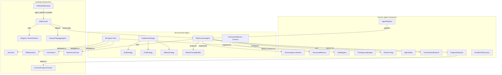
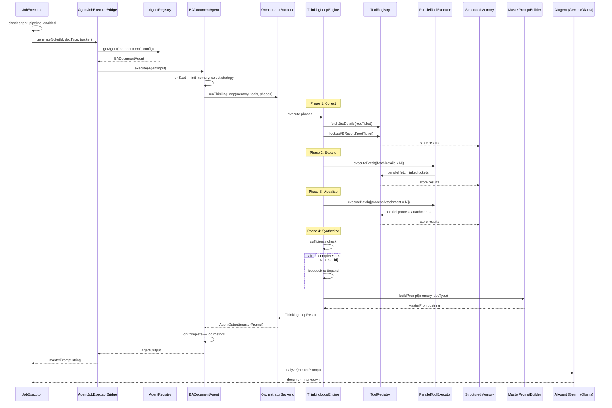
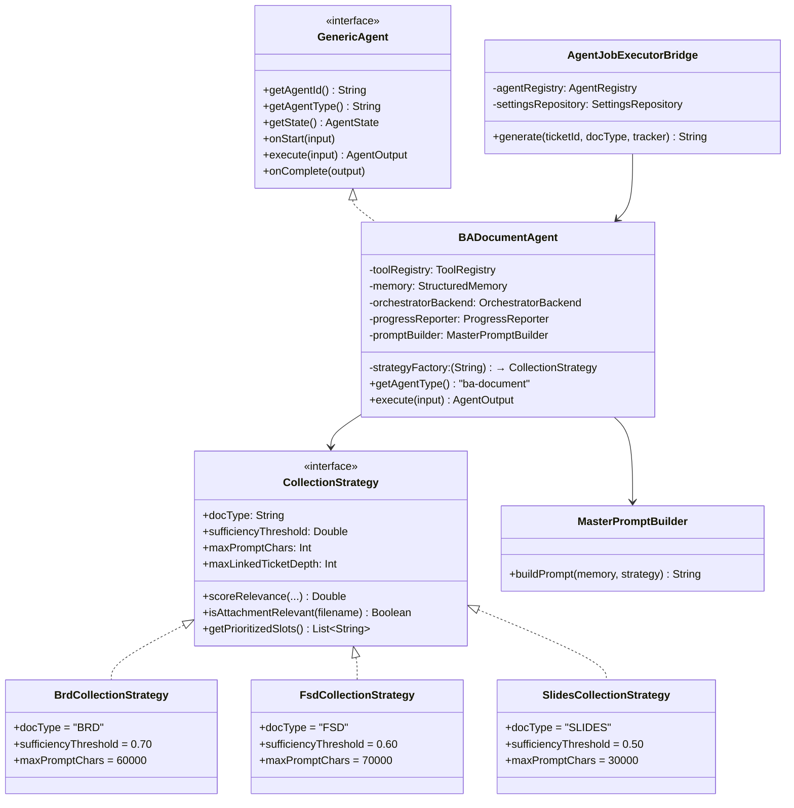
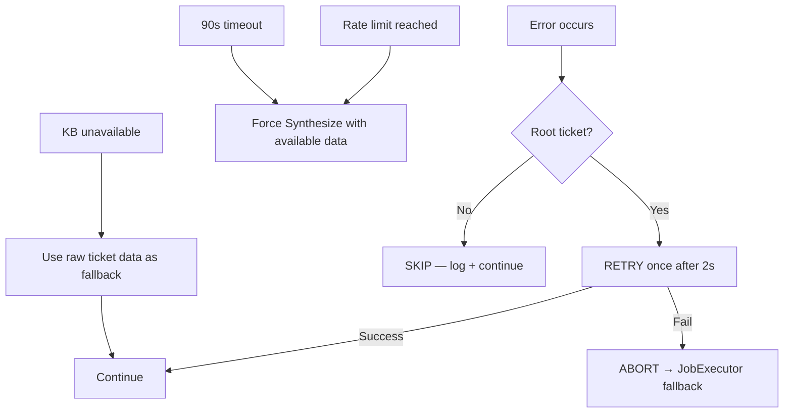

# Design Document — Agent-Based Document Generation Pipeline

## Overview

The Agent-Based Document Generation Pipeline replaces the rigid sequential `DeepCollector → PromptAssembler → JobExecutor` flow with an intelligent BA Document Agent built on the Generic Agent Framework (`generic-agent-framework` spec). Instead of collecting ALL data into a flat 200K+ char `EnrichedContext` blob, the BA Agent reasons about what data to collect based on the target document type, uses composable tools to gather information incrementally, and produces focused Master Prompts (30K–70K chars).

The BA Document Agent (`BADocumentAgent`) is the **first specialized agent** built on the Generic Agent Framework. It:
- Implements `GenericAgent` from the framework
- Extends `StructuredMemory` with a Jira-specific schema (`JiraContextMemory` slots)
- Registers Jira-specific tools in the framework's `ToolRegistry`
- Configures a 4-phase thinking loop (Collect → Expand → Visualize → Synthesize) via `PhaseConfig`
- Integrates with the existing `JobExecutor` via a feature flag (`agent_pipeline_enabled`)

### Design Decisions

1. **Framework-first, domain-second** — All agent infrastructure (memory, tools, engine, orchestrator) comes from the Generic Agent Framework. The BA Agent only provides domain-specific configuration: memory schema, tool implementations, phase definitions, and collection strategies. Zero framework code is modified.

2. **JiraContextMemory as StructuredMemory schema** — Rather than subclassing `StructuredMemory`, the BA Agent defines a `SlotSchema` list that declares Jira-specific slots (summary, comments, linkedTickets, etc.). This keeps the framework generic while giving the BA Agent typed access via extension functions.

3. **Collection Strategy as a Strategy pattern** — Each document type (BRD, FSD, Slides) has a `CollectionStrategy` implementation that controls relevance scoring, attachment filtering, and sufficiency thresholds. New document types are added by implementing the interface.

4. **Feature-flagged integration** — The `agent_pipeline_enabled` setting in `SettingsRepository` controls whether `JobExecutor` uses the new agent pipeline or the existing `DeepCollector + PromptAssembler` flow. Fallback to the existing pipeline on unrecoverable errors ensures zero downtime during rollout.

5. **Reuse existing infrastructure** — The BA Agent's tools delegate to existing components: `JiraClient` for ticket fetching, `KBRepository` for KB lookups, `VectorStore` for attachment processing, and `RelevanceScorer` for ticket relevance. No duplication of existing logic.

6. **Master Prompt replaces EnrichedContext** — The agent's output is a focused `MasterPrompt` string (not an `EnrichedContext`). The existing `AIAgent.analyze(prompt)` call in `JobExecutor` receives this prompt directly, working unchanged with both `GeminiCliAgent` and `OllamaAgent`.


## Architecture



### Package Structure

```
server/src/jvmMain/kotlin/com/assistant/server/agent/ba/
├── BADocumentAgent.kt              # GenericAgent implementation
├── BAAgentConfig.kt                # AgentConfig DSL definition
├── BAAgentModule.kt                # Koin module registration
├── memory/
│   └── JiraContextMemorySchema.kt  # SlotSchema definitions + extensions
├── tools/
│   ├── FetchJiraDetailsTool.kt     # fetchJiraDetails tool
│   ├── GetLinkedIssuesTool.kt      # getLinkedIssues tool
│   ├── FetchCommentsTool.kt        # fetchComments tool
│   ├── ProcessAttachmentTool.kt    # processAttachment tool
│   ├── LookupKBRecordTool.kt       # lookupKBRecord tool
│   └── SearchKBTool.kt             # searchKB tool
├── strategy/
│   ├── CollectionStrategy.kt       # Strategy interface
│   ├── BrdCollectionStrategy.kt    # BRD-specific strategy
│   ├── FsdCollectionStrategy.kt    # FSD-specific strategy
│   └── SlidesCollectionStrategy.kt # Slides-specific strategy
├── prompt/
│   ├── MasterPromptBuilder.kt      # Prompt assembly from memory
│   └── PromptTruncator.kt         # Progressive truncation logic
├── phases/
│   ├── CollectPhase.kt             # Phase 1: core ticket data
│   ├── ExpandPhase.kt              # Phase 2: linked tickets
│   ├── VisualizePhase.kt           # Phase 3: attachments
│   └── SynthesizePhase.kt          # Phase 4: Master Prompt
└── integration/
    └── AgentJobExecutorBridge.kt   # Bridge between JobExecutor and BA Agent
```

### Execution Flow



## Components and Interfaces

### 1. BADocumentAgent

The core specialized agent implementing `GenericAgent` from the framework.

```kotlin
// server/.../agent/ba/BADocumentAgent.kt
class BADocumentAgent(
    private val toolRegistry: ToolRegistry,
    private val memory: StructuredMemory,
    private val engineFactory: () -> ThinkingLoopEngine,
    private val orchestratorBackend: OrchestratorBackend,
    private val progressReporter: ProgressReporter,
    private val strategyFactory: (String) -> CollectionStrategy,
    private val promptBuilder: MasterPromptBuilder
) : GenericAgent {

    override fun getAgentId(): String  // UUID per execution
    override fun getAgentType(): String = "ba-document"
    override fun getState(): AgentState

    override suspend fun onStart(input: AgentInput) {
        // 1. Extract ticketId and docType from input.payload
        // 2. Select CollectionStrategy based on docType
        // 3. Initialize memory with JiraContextMemory schema
        // Note: BA-specific tools are pre-registered in ToolRegistry
        //       by wireBATools() in BAAgentModule.kt during Koin factory creation
    }

    override suspend fun execute(input: AgentInput): AgentOutput {
        // Delegates to orchestratorBackend.runThinkingLoop()
        // Returns AgentOutput with masterPrompt in result field
    }

    override suspend fun onComplete(output: AgentOutput) {
        // Log metrics: duration, tool calls, memory size, prompt size
        // Log compression ratio: memory chars → prompt chars
    }
}
```

### 2. JiraContextMemory Schema

Defines the memory slot schema for the BA Agent using the framework's `SlotSchema`.

```kotlin
// server/.../agent/ba/memory/JiraContextMemorySchema.kt
object JiraContextMemorySchema {

    val SLOTS = listOf(
        SlotSchema("summary", SlotType.STRING, maxSize = 10_000),
        SlotSchema("description", SlotType.STRING, maxSize = 10_000),
        SlotSchema("comments", SlotType.LIST, maxSize = 50),
        SlotSchema("attachmentsData", SlotType.LIST, maxSize = 30),
        SlotSchema("linkedTickets", SlotType.MAP, maxSize = 20),
        SlotSchema("businessGoals", SlotType.STRING, maxSize = 10_000),
        SlotSchema("kbRecords", SlotType.MAP, maxSize = 20),
        SlotSchema("technicalDetails", SlotType.STRING, maxSize = 10_000),
        SlotSchema("acceptanceCriteria", SlotType.LIST, maxSize = 50)
    )

    fun createMemory(): StructuredMemory = StructuredMemory(SLOTS)
}

// Extension functions for typed access
fun StructuredMemory.storeSummary(text: String, source: String, tool: String)
fun StructuredMemory.storeComment(comment: String, source: String)
fun StructuredMemory.storeLinkedTicket(ticketId: String, summary: String)
fun StructuredMemory.getLinkedTicketIds(): List<String>
fun StructuredMemory.hasKBRecord(ticketId: String): Boolean
```

### 3. CollectionStrategy Interface

Strategy pattern for document-type-specific data collection behavior.

```kotlin
// server/.../agent/ba/strategy/CollectionStrategy.kt
interface CollectionStrategy {
    val docType: String
    val sufficiencyThreshold: Double
    val maxPromptChars: Int
    val maxLinkedTicketDepth: Int

    fun scoreRelevance(
        issueType: String, labels: List<String>,
        components: List<String>, relationshipType: String
    ): Double

    fun isAttachmentRelevant(filename: String): Boolean
    fun getPrioritizedSlots(): List<String>
}
```

**Three implementations:**

| Strategy | Threshold | Max Prompt | Depth | Priority Slots |
|---|---|---|---|---|
| `BrdCollectionStrategy` | 0.70 | 60,000 | 2 | businessGoals, acceptanceCriteria, comments |
| `FsdCollectionStrategy` | 0.60 | 70,000 | 2 | technicalDetails, kbRecords, linkedTickets |
| `SlidesCollectionStrategy` | 0.50 | 30,000 | 1 | summary, businessGoals, attachmentsData |

### 4. BA Agent Tools

Six tools registered in the framework's `ToolRegistry`, each implementing `AgentTool`.

```kotlin
// server/.../agent/ba/tools/FetchJiraDetailsTool.kt
class FetchJiraDetailsTool(
    private val jiraClient: JiraClient
) : AgentTool {
    override val name = "fetchJiraDetails"
    override val description = "Retrieves ticket summary, description, status, priority, and metadata"
    override val parameterNames = listOf("issueKey")

    override suspend fun execute(params: Map<String, String>): ToolResult
    // Delegates to jiraClient, maps to StructuredTicketContent fields
}
```

| Tool | Delegates To | Parameters | Returns |
|---|---|---|---|
| `fetchJiraDetails` | `JiraClient` | issueKey | Summary, description, status, metadata |
| `getLinkedIssues` | `JiraClient` | issueKey | List of linked ticket keys + relationship types |
| `fetchComments` | `JiraClient` | issueKey | Up to 20 most recent comments |
| `processAttachment` | `VectorStore` | attachmentId | Extracted text content from file/image |
| `lookupKBRecord` | `KBRepository` | ticketId | Pre-analyzed KB record (if exists) |
| `searchKB` | `KBRepository` | query | KB search results matching query |

### 5. Phase Definitions

Four phases configured via the framework's `PhaseConfig` DSL.

```kotlin
// server/.../agent/ba/BAAgentConfig.kt
fun buildBAPhaseConfig(strategy: CollectionStrategy): PhaseConfig {
    return agentConfig {
        phases {
            phase("collect") {
                entryCondition { true }  // Always enters
                action { memory, tools ->
                    CollectPhase.execute(memory, tools)
                }
                exitCondition { memory ->
                    memory.getSlot("summary").isNotEmpty()
                }
                maxDurationSeconds = 30
                errorStrategy = ErrorStrategy.RETRY
            }
            phase("expand") {
                entryCondition { memory ->
                    memory.getSlot("linkedTickets").isNotEmpty() ||
                    memory.getSlot("summary").isNotEmpty()
                }
                action { memory, tools ->
                    ExpandPhase.execute(memory, tools, strategy)
                }
                exitCondition { memory ->
                    val completeness = memory.getCompleteness()
                    completeness.values.average() >= 0.4
                }
                maxDurationSeconds = 30
                errorStrategy = ErrorStrategy.SKIP
            }
            phase("visualize") {
                entryCondition { memory ->
                    memory.getSlot("attachmentsData").isEmpty()
                }
                action { memory, tools ->
                    VisualizePhase.execute(memory, tools, strategy)
                }
                exitCondition { memory -> true }
                maxDurationSeconds = 30
                errorStrategy = ErrorStrategy.SKIP
            }
            phase("synthesize") {
                entryCondition { true }
                action { memory, tools ->
                    SynthesizePhase.execute(memory, strategy)
                }
                exitCondition { memory ->
                    val completeness = memory.getCompleteness()
                    val avg = strategy.getPrioritizedSlots()
                        .mapNotNull { completeness[it] }
                        .average()
                    avg >= strategy.sufficiencyThreshold
                }
                loopbackTarget = "expand"
                maxDurationSeconds = 30
                errorStrategy = ErrorStrategy.SKIP
            }
        }
        limits {
            maxTotalDurationSeconds = 90
            maxToolCalls = 50
            maxIterations = 3
            maxConcurrentTools = 5
        }
    }.phases
}
```

### 6. MasterPromptBuilder

Assembles the final prompt from structured memory contents.

```kotlin
// server/.../agent/ba/prompt/MasterPromptBuilder.kt
class MasterPromptBuilder {

    fun buildPrompt(
        memory: StructuredMemory,
        strategy: CollectionStrategy
    ): String {
        // 1. Build role instruction section
        // 2. Build document-type-specific context from memory
        // 3. Build template structure section
        // 4. Build output format instructions
        // 5. Build diagram instructions (BRD/FSD only)
        // 6. Apply progressive truncation if over limit
        // 7. Add source attribution per memory slot
    }
}
```

**Progressive truncation order** (when prompt exceeds `strategy.maxPromptChars`):
1. Reduce linked ticket details to summaries only
2. Truncate attachment previews to first 500 chars each
3. Reduce comment summaries to first 200 chars each
4. **Never truncate**: root ticket data, role instruction, template structure

### 7. AgentJobExecutorBridge

Bridges the existing `JobExecutor` lifecycle with the BA Agent.

```kotlin
// server/.../agent/ba/integration/AgentJobExecutorBridge.kt
class AgentJobExecutorBridge(
    private val agentRegistry: AgentRegistry,
    private val settingsRepository: SettingsRepository
) {
    suspend fun generate(
        ticketId: String,
        docType: String,
        tracker: DocGenProgressTracker
    ): String {
        // 1. Build AgentInput with ticketId, docType in payload
        // 2. Create DocGenProgressAdapter wrapping tracker
        // 3. Get BADocumentAgent from registry
        // 4. Execute agent, return masterPrompt from AgentOutput.result
        // 5. On unrecoverable error, throw to trigger JobExecutor fallback
    }
}
```

## Data Models

All data models use `@Serializable` from `kotlinx.serialization` and follow the project convention of using `JsonConfig.instance` (with `encodeDefaults = true`, `ignoreUnknownKeys = true`).

### CollectionStrategyConfig

```kotlin
@Serializable
data class CollectionStrategyConfig(
    val docType: String,
    val sufficiencyThreshold: Double,
    val maxPromptChars: Int,
    val maxLinkedTicketDepth: Int,
    val prioritizedSlots: List<String>,
    val relevanceThreshold: Double = 0.3
)
```

### MasterPromptResult

```kotlin
@Serializable
data class MasterPromptResult(
    val prompt: String,
    val promptSizeChars: Int,
    val sourceTicketIds: List<String>,
    val memorySlotsUsed: List<String>,
    val compressionRatio: Double,
    val truncationApplied: Boolean = false
)
```

### BAAgentPayload

The payload map keys used in `AgentInput.payload` for the BA Agent:

```kotlin
object BAAgentPayload {
    const val TICKET_ID = "ticketId"
    const val DOC_TYPE = "docType"       // "BRD", "FSD", "SLIDES"
    const val JOB_ID = "jobId"
}
```

### RelevanceScore

```kotlin
@Serializable
data class RelevanceScore(
    val ticketId: String,
    val score: Double,
    val issueType: String,
    val relationshipType: String,
    val included: Boolean
)
```

### AgentPipelineMetrics

```kotlin
@Serializable
data class AgentPipelineMetrics(
    val thinkingLoopTimeMs: Long,
    val iterationCount: Int,
    val toolCallCount: Int,
    val parallelBatchCount: Int,
    val totalDataCollectedChars: Int,
    val masterPromptSizeChars: Int,
    val compressionRatio: Double,
    val memoryCompletenessAtSynthesis: Map<String, Double>,
    val phaseBreakdown: List<PhaseMetric>
)

@Serializable
data class PhaseMetric(
    val phaseName: String,
    val durationMs: Long,
    val toolCallsInPhase: Int,
    val memoryCompletenessBefore: Map<String, Double>,
    val memoryCompletenessAfter: Map<String, Double>
)
```

### Class Diagram




## Correctness Properties

*A property is a characteristic or behavior that should hold true across all valid executions of a system — essentially, a formal statement about what the system should do. Properties serve as the bridge between human-readable specifications and machine-verifiable correctness guarantees.*

Note: Properties that are already covered by the Generic Agent Framework's correctness properties (e.g., StructuredMemory serialization round-trip, ToolRegistry invoke-never-throws, ParallelToolExecutor failure isolation) are NOT duplicated here. This section covers only BA-Agent-specific properties.

### Property 1: Memory entry metadata recording

*For any* data stored into any JiraContextMemory slot via any BA Agent tool, the resulting `MemoryEntry` SHALL contain a non-empty `source` (ticket ID), a non-empty `toolName`, and a non-empty `timestamp`.

**Validates: Requirements 1.2**

### Property 2: Relevance threshold filtering

*For any* set of linked tickets discovered during the Expand phase, the BA Agent SHALL invoke `fetchJiraDetails` only for tickets whose `CollectionStrategy.scoreRelevance()` returns a score >= 0.3. Tickets with score < 0.3 SHALL have only a one-line reference stored in the `linkedTickets` memory slot.

**Validates: Requirements 3.3, 4.5**

### Property 3: Attachment relevance filtering

*For any* set of attachments discovered during the Visualize phase, the BA Agent SHALL invoke `processAttachment` only for attachments where `CollectionStrategy.isAttachmentRelevant(filename)` returns true. Non-relevant attachments SHALL NOT trigger tool calls.

**Validates: Requirements 3.4**

### Property 4: Sufficiency check loopback decision

*For any* memory state at the end of the Synthesize phase, if the average completeness of the strategy's prioritized slots is below `CollectionStrategy.sufficiencyThreshold`, the ThinkingLoopEngine SHALL loop back to the Expand phase (up to `maxIterations`). If completeness is at or above the threshold, the loop SHALL complete without loopback.

**Validates: Requirements 3.5**

### Property 5: Relevance score range invariant

*For any* combination of issue type, labels, components, and relationship type, `CollectionStrategy.scoreRelevance()` SHALL return a value in the range [0.0, 1.0] for all three strategy implementations (BRD, FSD, Slides).

**Validates: Requirements 4.4**

### Property 6: Master Prompt size limit invariant

*For any* JiraContextMemory state (including maximally-filled slots), `MasterPromptBuilder.buildPrompt()` SHALL produce a prompt no larger than `CollectionStrategy.maxPromptChars` — specifically: 60,000 chars for BRD, 70,000 chars for FSD, and 30,000 chars for Slides.

**Validates: Requirements 5.1**

### Property 7: Master Prompt section ordering

*For any* non-empty JiraContextMemory state, the Master Prompt produced by `MasterPromptBuilder.buildPrompt()` SHALL contain sections in the following order: Role instruction appears before Context, Context appears before Template structure, Template structure appears before Output format instructions. For BRD and FSD, Diagram instructions SHALL appear after Output format.

**Validates: Requirements 5.2**

### Property 8: KB-first data source priority

*For any* ticket that has both a KB record in the `kbRecords` memory slot AND raw description/comments in other slots, the Master Prompt SHALL include the KB record's analyzed data for that ticket and SHALL NOT include the raw ticket description or raw comment text for that same ticket.

**Validates: Requirements 5.3**

### Property 9: Master Prompt source attribution

*For any* data section included in the Master Prompt, the section SHALL contain a source attribution marker referencing the originating ticket ID and the memory slot name from which the data was drawn.

**Validates: Requirements 5.4**

### Property 10: Progressive truncation preserves protected sections

*For any* JiraContextMemory state that causes the assembled prompt to exceed the size limit, after progressive truncation the Master Prompt SHALL still contain the complete root ticket data, the complete role instruction, and the complete template structure — these sections SHALL NEVER be truncated.

**Validates: Requirements 5.5**

### Property 11: BA Agent reasoning log cap

*For any* BA Agent execution that produces more than 50 reasoning log entries, the `AgentState.reasoningLog` SHALL contain exactly 50 entries, and those entries SHALL be the 50 most recent ones (oldest entries discarded first).

**Validates: Requirements 7.6**

### Property 12: Progress phase label mapping

*For any* BA Agent phase name (collect, expand, visualize, synthesize), the `DocGenProgressAdapter` SHALL map it to one of the existing phase labels: AGGREGATING_DATA (for collect, expand, visualize) or GENERATING_DOCUMENT (for synthesize). No agent phase SHALL produce an unmapped or null label.

**Validates: Requirements 9.7**


## Error Handling

The BA Document Agent uses the Generic Agent Framework's error handling infrastructure with domain-specific configuration.

### Error Classification (BA-Specific)

| Classification | Error Types | Strategy |
|---|---|---|
| **RECOVERABLE** | Linked ticket fetch timeout, attachment processing failure, KB lookup timeout, network glitch on non-root ticket | SKIP or RETRY |
| **UNRECOVERABLE** | Root ticket not found (404), authentication failure (401/403), invalid agent config, rate limit exhausted on root ticket | ABORT → fallback to existing pipeline |

### Error Strategy Configuration per Tool

| Tool | Default Strategy | Override | Rationale |
|---|---|---|---|
| `fetchJiraDetails` | RETRY (max 1, delay 2s) | ABORT if root ticket | Root ticket is essential; linked tickets can be skipped |
| `getLinkedIssues` | SKIP | — | Missing links degrade quality but don't block generation |
| `fetchComments` | SKIP | — | Comments are supplementary data |
| `processAttachment` | SKIP | — | Attachment text is optional enrichment |
| `lookupKBRecord` | SKIP | — | Falls back to raw ticket data (Req 11.3) |
| `searchKB` | SKIP | — | KB search is optional enrichment |

### Error Strategy Resolution (inherits from framework)

1. **Tool-level override** → 2. **Phase-level default** → 3. **Agent-level default (SKIP)**

### Graceful Degradation Scenarios



### Fallback Chain

When the BA Agent pipeline fails with an unrecoverable error:

1. `BADocumentAgent.execute()` throws or returns `AgentOutput(status=FAILED)`
2. `AgentJobExecutorBridge.generate()` catches the error, logs warning with details
3. `JobExecutor` catches the bridge exception and logs `"Agent pipeline failed, trying curation pipeline fallback"`
4. If `prompt_curation_enabled=true` AND `CurationPipeline` is injected, `JobExecutor` tries the curation pipeline: `aggregateData()` → `CurationPipeline.curate()` → `CuratedPromptAssembler.buildPrompt()` (50K–80K chars)
5. If curation also fails (or is disabled), `JobExecutor` falls back to legacy pipeline: `FeatureFlagAggregator.aggregate()` → `PromptAssembler.buildPrompt()` with 200K budget
6. If legacy fallback also fails, `JobExecutor` marks the job as FAILED (existing behavior)

**DI Wiring**: `CurationPipeline` and `McpToolRegistrar` are injected into `JobExecutor` via `ServerModule.kt` alongside `agentBridge` and `settingsRepository`.

## Testing Strategy

### Property-Based Testing

The BA Agent uses **Kotest** with `kotest-property` for all 12 correctness properties, consistent with the Generic Agent Framework's testing approach.

**Configuration:**
- Minimum 100 iterations per property test
- Each test tagged with: `Feature: agent-document-generation, Property {N}: {title}`
- Custom `Arb` generators for BA-specific types

**Custom Generators:**

| Generator | Produces | Used By |
|---|---|---|
| `Arb.jiraContextMemory()` | `StructuredMemory` with random JiraContextMemory slot data | Properties 1, 4, 6, 7, 8, 9, 10 |
| `Arb.collectionStrategy()` | Random `CollectionStrategy` (BRD/FSD/Slides) | Properties 2, 3, 4, 5, 6 |
| `Arb.linkedTicketSet()` | Set of linked tickets with random metadata | Properties 2, 5 |
| `Arb.attachmentSet()` | Set of attachments with random filenames | Property 3 |
| `Arb.issueMetadata()` | Random issue type, labels, components, relationship | Property 5 |
| `Arb.reasoningLogEntries(n)` | List of n random reasoning log strings | Property 11 |
| `Arb.agentPhaseName()` | Random BA phase name (collect/expand/visualize/synthesize) | Property 12 |

### Unit Tests (Example-Based)

Unit tests cover specific examples, edge cases, and behaviors not suitable for PBT:

- **BADocumentAgent lifecycle**: `onStart` initializes memory and selects strategy, `onComplete` logs metrics
- **CollectPhase**: Calls `fetchJiraDetails` + `lookupKBRecord` for root ticket
- **ExpandPhase**: Batches linked ticket fetches via ParallelToolExecutor
- **VisualizePhase**: Filters attachments by strategy before processing
- **SynthesizePhase**: Produces MasterPromptResult with correct metadata
- **MasterPromptBuilder**: Section ordering for each doc type, truncation behavior
- **CollectionStrategy implementations**: Correct prioritized slots, thresholds, depth limits per doc type
- **AgentJobExecutorBridge**: Feature flag routing, fallback on agent failure
- **Error scenarios**: Root ticket failure → retry → abort, KB unavailable → raw data fallback, rate limit → force synthesize, 90s timeout → force synthesize

### Integration Tests

Integration tests verify component wiring and end-to-end flows:

- **Koin DI**: BADocumentAgent resolution, dependency injection completeness, shared Semaphore injection
- **Feature flag routing**: `agent_pipeline_enabled` toggles between agent and legacy pipeline
- **End-to-end with mocks**: Register BA agent → configure → execute with mocked JiraClient/KBRepository → verify MasterPrompt output
- **Progress reporting**: Agent phases map to DocGenProgressTracker labels correctly
- **Orchestrator selection**: `agent_orchestrator_type` setting selects correct backend
- **Fallback chain**: Agent failure triggers existing pipeline fallback
- **API endpoints**: `GET /api/jobs/{jobId}/agent-state` and `GET /api/metrics/agent-pipeline` return correct structures

### Test File Organization

```
server/src/test/kotlin/com/assistant/server/agent/ba/
├── BADocumentAgentTest.kt                  # Lifecycle, execute flow
├── BAAgentConfigTest.kt                    # Config validation
├── memory/
│   └── JiraContextMemoryPropertyTest.kt    # Property 1 (metadata recording)
├── strategy/
│   ├── CollectionStrategyPropertyTest.kt   # Properties 2, 3, 4, 5
│   ├── BrdStrategyTest.kt                  # BRD-specific examples
│   ├── FsdStrategyTest.kt                  # FSD-specific examples
│   └── SlidesStrategyTest.kt               # Slides-specific examples
├── prompt/
│   ├── MasterPromptPropertyTest.kt         # Properties 6, 7, 8, 9, 10
│   └── PromptTruncatorTest.kt             # Truncation edge cases
├── phases/
│   ├── CollectPhaseTest.kt                 # Collect phase examples
│   ├── ExpandPhaseTest.kt                  # Expand phase examples
│   ├── VisualizePhaseTest.kt               # Visualize phase examples
│   └── SynthesizePhaseTest.kt              # Synthesize + sufficiency check
├── integration/
│   ├── AgentJobExecutorBridgeTest.kt       # Feature flag, fallback
│   └── BAAgentEndToEndTest.kt              # Full pipeline with mocks
├── state/
│   └── BAAgentStatePropertyTest.kt         # Property 11 (log cap)
├── progress/
│   └── ProgressMappingPropertyTest.kt      # Property 12 (label mapping)
└── generators/
    └── BAAgentArbitraries.kt               # Custom Arb generators
```
