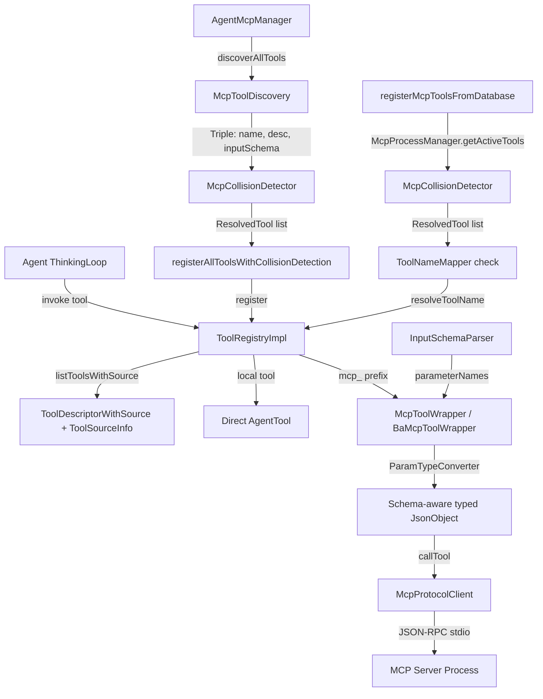

# Design Document — Agent MCP Tool Bridge

## Overview

Feature này xây dựng một bridge layer cho phép Generic Agent Framework sử dụng MCP tools thông qua `ToolRegistry` interface hiện có. Thay vì agents gọi trực tiếp vào API clients (JiraClient, KBRepository), tool calls được route qua MCP servers đang chạy — transparent với agent code.

### Implementation Status

Feature đã được implement hoàn chỉnh (100%). Tất cả components đã hoạt động:

| Component | Status | Location |
|-----------|--------|----------|
| `McpToolWrapper` (AgentTool adapter) | ✅ Implemented | `AgentMcpManager.kt` |
| `BaMcpToolWrapper` (BA-specific adapter) | ✅ Implemented | `BAAgentModule.kt` |
| `AgentMcpManager` (Agent Home Dir MCP) | ✅ Implemented | `AgentMcpManager.kt` |
| `registerMcpToolsFromDatabase()` (Shared MCP) | ✅ Implemented | `BAAgentModule.kt` |
| `ToolSource` enum + `resolveToolSource()` | ✅ Implemented | `SubprocessProxyHelpers.kt` |
| Logging & error handling | ✅ Implemented | Multiple files |
| `ToolNameMapper` (name mapping config) | ✅ Implemented | `ToolNameMapper.kt` |
| `McpCollisionDetector` (duplicate detection) | ✅ Implemented | `McpCollisionDetector.kt` |
| `listToolsWithSource()` method | ✅ Implemented | `ToolRegistryImpl.kt` + `ToolRegistry.kt` |
| `ParamTypeConverter` (schema-aware conversion) | ✅ Implemented | `ParamTypeConverter.kt` |
| `InputSchemaParser` (parameterNames extraction) | ✅ Implemented | `InputSchemaParser.kt` |

## Architecture

### Full Architecture



## Components and Interfaces

### 1. ToolNameMapper (Req 6)

Configurable mapping between agent-facing tool names and MCP tool names.

**Location:** `server/src/jvmMain/kotlin/com/assistant/server/agent/tool/ToolNameMapper.kt`

```kotlin
/**
 * Maps agent-facing tool names to MCP server + tool name pairs.
 * Allows agents to use semantic names (e.g., "fetchJiraDetails")
 * while the bridge routes to MCP tools (e.g., server "jira", tool "get_issue").
 */
class ToolNameMapper(
    private val mappings: Map<String, ToolNameMapping> = emptyMap()
) {
    data class ToolNameMapping(
        val agentName: String,
        val serverName: String,
        val mcpToolName: String
    )

    fun resolve(agentName: String): ToolNameMapping?
    fun hasMapping(agentName: String): Boolean
    fun getMcpName(agentName: String): String?
    fun findByMcpTool(serverName: String, mcpToolName: String): ToolNameMapping?

    companion object {
        fun fromConfig(config: Map<String, Map<String, String>>): ToolNameMapper
    }
}
```

**Design Decision:** Mapping is a simple `Map<String, ToolNameMapping>` rather than a DSL or annotation-based approach. This keeps it lightweight and easy to configure per agent type via Koin parameters. The mapping is optional — unmapped tools use their original MCP name with `mcp_{server}_{tool}` prefix. `findByMcpTool()` provides reverse lookup during registration to check if an MCP tool has a custom agent name.

### 2. ParamTypeConverter (Req 8.2-8.3)

Schema-aware parameter type conversion from `Map<String, String>` to typed `JsonObject`.

**Location:** `server/src/jvmMain/kotlin/com/assistant/server/agent/tool/ParamTypeConverter.kt`

```kotlin
/**
 * Converts string parameter values to typed JSON values
 * based on the MCP tool's inputSchema.
 *
 * Conversion rules:
 * - "integer"/"number" → JsonPrimitive(Long/Double)
 * - "boolean" → JsonPrimitive(Boolean)
 * - Conversion failure → keep as JsonPrimitive(string)
 */
object ParamTypeConverter {

    fun convert(
        params: Map<String, String>,
        inputSchema: JsonElement
    ): JsonObject

    internal fun resolveType(
        key: String, value: String,
        schemaProperties: JsonObject?
    ): JsonPrimitive
}
```

**Design Decision:** `ParamTypeConverter` is a stateless `object` (pure function) rather than a class instance. This makes it easy to test and reuse. The `resolveType()` accepts nullable `JsonObject?` for `schemaProperties` — returns string primitive when schema is null (missing or unparseable). The conversion is best-effort — if a string can't be parsed as the schema type, it falls back to string and lets the MCP server handle validation. This avoids the bridge becoming a validation bottleneck.

### 3. McpCollisionDetector (Req 2.7)

Detects and resolves tool name collisions when multiple MCP servers expose tools with the same name.

**Location:** `server/src/jvmMain/kotlin/com/assistant/server/agent/home/McpCollisionDetector.kt`

```kotlin
/**
 * Detects duplicate tool names across MCP servers and resolves
 * collisions by prefixing with server name.
 */
object McpCollisionDetector {

    data class ResolvedTool(
        val registeredName: String,
        val originalName: String,
        val serverName: String,
        val wasRenamed: Boolean
    )

    fun resolve(
        tools: List<McpAggregatedTool>
    ): List<ResolvedTool>
}
```

**Design Decision:** Collision resolution uses `{serverName}_{toolName}` prefix only when a collision is detected. If tool names are unique across servers, they keep their original `mcp_{toolName}` format. This minimizes name changes for the common case (no collisions).

### 4. InputSchemaParser (Req 1.6)

Extracts `parameterNames` from MCP tool's `inputSchema` JSON.

**Location:** `server/src/jvmMain/kotlin/com/assistant/server/agent/tool/InputSchemaParser.kt`

```kotlin
/**
 * Parses MCP tool inputSchema (JSON Schema) to extract
 * parameter names from the "properties" object.
 */
object InputSchemaParser {

    fun extractParameterNames(inputSchema: JsonElement): List<String>
}
```

**Design Decision:** Simple extraction of top-level "properties" keys from the JSON Schema. Nested schemas and `$ref` are not supported — MCP tools typically use flat parameter schemas. Returns empty list if schema is malformed or missing "properties".

### 5. ToolRegistryImpl Enhancement (Req 3.4)

Add `listToolsWithSource()` method to existing `ToolRegistryImpl`.

```kotlin
// Metadata about a registered tool's source (in ToolRegistryHelpers.kt)
data class ToolSourceInfo(
    val source: String = "LOCAL",
    val serverId: String? = null,
    val serverName: String? = null
)

// Enriched tool descriptor (in shared ToolModels.kt)
@Serializable
data class ToolDescriptorWithSource(
    val name: String,
    val description: String,
    val parameterNames: List<String> = emptyList(),
    val toolSource: String = "LOCAL",
    val serverId: String? = null,
    val serverName: String? = null
)

// Added to ToolRegistryImpl
fun listToolsWithSource(): List<ToolDescriptorWithSource>

// Added to ToolRegistry interface (shared module) with default implementation
fun listToolsWithSource(): List<ToolDescriptorWithSource> =
    listTools().map { ToolDescriptorWithSource(it.name, it.description, it.parameterNames) }
```

**Design Decision:** `toolSource` uses `String` ("LOCAL", "AGENT_MCP", "SHARED_MCP") instead of `ToolSource` enum for cross-platform compatibility in the shared module. Source classification uses prefix-based detection in `ToolRegistryImpl.resolveSourceInfo()`: `mcp_agent_*` → AGENT_MCP, `mcp_*` → SHARED_MCP, else → LOCAL. This mirrors the existing `resolveToolSource()` pattern in `SubprocessProxyHelpers.kt`. The `ToolSourceInfo` helper class and `toDescriptorWithSource()` extension are in `ToolRegistryHelpers.kt`.

### Existing Components (Modified During Implementation)

- **McpToolWrapper** (`AgentMcpManager.kt`): Implements `AgentTool`, delegates to `McpProtocolClient.callTool()`. Handles null client fallback and exception catching. **Modified:** Now accepts `inputSchema: JsonElement`, uses `InputSchemaParser` for `parameterNames`, and uses `ParamTypeConverter` for schema-aware param conversion.
- **BaMcpToolWrapper** (`BAAgentModule.kt`): BA-specific MCP tool wrapper. **Modified:** Now accepts `inputSchema: JsonElement`, uses `InputSchemaParser` for `parameterNames`, and uses `ParamTypeConverter` for schema-aware param conversion.
- **AgentMcpManager**: Discovers tools from Agent Home Directory MCP configs, starts servers, registers tools. **Modified:** Refactored to collect all tools from all servers first via `discoverAllTools()`, then apply `McpCollisionDetector` across all servers via `registerAllToolsWithCollisionDetection()`, then register with collision-resolved names.
- **registerMcpToolsFromDatabase()** (`BAAgentModule.kt`): Discovers tools from `McpProcessManager.getActiveTools()`. **Modified:** Now uses `McpCollisionDetector.resolve()` before registration, accepts optional `ToolNameMapper` parameter, and uses `resolveToolName()` helper for name mapping priority.
- **McpToolDiscovery**: **Modified:** Return type changed from `List<Pair<String, String>>` to `List<Triple<String, String, JsonElement>>` to include `inputSchema` from MCP tool discovery.
- **ToolSource enum + resolveToolSource()**: Three-tier classification (LOCAL, AGENT_MCP, SHARED_MCP) — unchanged.
- **McpToolNameResolver**: Strips prefix, converts response to ToolResult — unchanged (param conversion now handled by `ParamTypeConverter`).

## Data Models

### New Models

```kotlin
// ToolNameMapping — maps agent name to MCP server + tool (in ToolNameMapper.kt)
data class ToolNameMapping(
    val agentName: String,
    val serverName: String,
    val mcpToolName: String
)

// ToolDescriptorWithSource — enriched descriptor with source info (in shared ToolModels.kt)
@Serializable
data class ToolDescriptorWithSource(
    val name: String,
    val description: String,
    val parameterNames: List<String> = emptyList(),
    val toolSource: String = "LOCAL",
    val serverId: String? = null,
    val serverName: String? = null
)

// ToolSourceInfo — internal source metadata (in ToolRegistryHelpers.kt)
data class ToolSourceInfo(
    val source: String = "LOCAL",
    val serverId: String? = null,
    val serverName: String? = null
)

// ResolvedTool — collision detection result (in McpCollisionDetector.kt)
data class ResolvedTool(
    val registeredName: String,
    val originalName: String,
    val serverName: String,
    val wasRenamed: Boolean
)
```

### Existing Models (No Changes)

- `McpAggregatedTool(serverId, serverName, name, description, inputSchema: JsonElement)`
- `ToolResult(toolName, data, executionTimeMs, dataSizeChars, success, errorType, errorMessage)`
- `ToolDescriptor(name, description, parameterNames)`
- `ToolSource { LOCAL, AGENT_MCP, SHARED_MCP }`

## Correctness Properties

*A property is a characteristic or behavior that should hold true across all valid executions of a system — essentially, a formal statement about what the system should do. Properties serve as the bridge between human-readable specifications and machine-verifiable correctness guarantees.*

### Property 1: Response conversion preserves success semantics

*For any* `McpToolCallResponse`, converting it to a `ToolResult` via the adapter SHALL produce `success = !response.isError`, and the data field SHALL contain the concatenated text content of all content items.

**Validates: Requirements 1.3, 1.4, 8.5**

### Property 2: Exception handling produces transport error

*For any* exception thrown by `McpProtocolClient.callTool()`, the adapter SHALL catch it and return a `ToolResult` with `success = false` and `errorType = "MCP_TRANSPORT_ERROR"`, never propagating the exception.

**Validates: Requirements 1.5**

### Property 3: inputSchema parameter extraction

*For any* valid JSON Schema object with a "properties" field, `InputSchemaParser.extractParameterNames()` SHALL return exactly the set of top-level property keys, in the order they appear.

**Validates: Requirements 1.6**

### Property 4: Adapter count matches tools with available clients

*For any* list of `McpAggregatedTool` objects, the number of `McpToolAdapter` instances created by the bridge SHALL equal the number of tools whose server has a non-null `McpProtocolClient`.

**Validates: Requirements 2.4, 2.5**

### Property 5: Collision detection prefixes only duplicates

*For any* list of MCP tools from multiple servers, `McpCollisionDetector.resolve()` SHALL prefix tool names with `{serverName}_` only when two or more servers expose a tool with the same name. Tools with unique names SHALL keep their original name.

**Validates: Requirements 2.7**

### Property 6: Tool source metadata correctness

*For any* set of registered tools in `ToolRegistryImpl`, `listToolsWithSource()` SHALL return `toolSource = MCP` for every `McpToolWrapper`/`McpToolAdapter` and `toolSource = LOCAL` for every other `AgentTool` implementation.

**Validates: Requirements 3.1, 3.2, 3.3, 3.4**

### Property 7: Local tools take precedence over MCP tools

*For any* `ToolRegistry` containing both a local tool and an MCP tool with the same name, invoking that tool name SHALL execute the local tool implementation, not the MCP adapter.

**Validates: Requirements 4.4**

### Property 8: Tool name mapping round-trip

*For any* configured tool name mapping (agentName → serverName + mcpToolName), the adapter SHALL register with `agentName` in the ToolRegistry but call `McpProtocolClient.callTool()` with `mcpToolName`. The mapping SHALL be transparent to the agent.

**Validates: Requirements 6.1, 6.2, 6.3**

### Property 9: Schema-aware parameter type conversion

*For any* parameter where the inputSchema specifies type "integer", "number", or "boolean", and the string value is a valid representation of that type, `ParamTypeConverter.convert()` SHALL produce the corresponding typed `JsonPrimitive`. For invalid conversions, the original string value SHALL be preserved as a `JsonPrimitive` string.

**Validates: Requirements 8.2, 8.3, 8.4**

## Error Handling

| Scenario | Handling | Location |
|----------|----------|----------|
| MCP client is null | Return fallback ToolResult (success=true, message) | `McpToolWrapper.fallbackResult()` |
| `callTool()` throws exception | Catch, log error, return ToolResult(success=false) | `McpToolWrapper.callMcpTool()` |
| `listTools()` returns empty | Log warning, return empty list | `McpToolDiscovery.tryListTools()` |
| MCP server process fails to start | Retry up to 2 times, then return no-client state | `McpProcessStarter.tryStartWithRetry()` |
| inputSchema missing "properties" | Return `emptyList()` for parameterNames | `InputSchemaParser` |
| inputSchema is not a JsonObject | Return `emptyList()` for parameterNames | `InputSchemaParser` |
| String → number conversion fails | Keep as string JsonPrimitive, log at DEBUG | `ParamTypeConverter` |
| String → boolean conversion fails | Keep as string JsonPrimitive, log at DEBUG | `ParamTypeConverter` |
| Tool name mapping incomplete config | Skip mapping entry, log warning | `ToolNameMapper.fromConfig()` |
| Collision detection with empty tool list | Return empty list | `McpCollisionDetector` |

## Testing Strategy

### Property-Based Testing

Core components are pure functions with clear input/output behavior, tested with property-based testing:

| Component | Test File | Properties | Iterations |
|-----------|-----------|------------|------------|
| `InputSchemaParser` | `InputSchemaParserPropertyTest.kt` | 5 (3a–3e) | 100 each |
| `McpCollisionDetector` | `McpCollisionDetectorPropertyTest.kt` | 4 (5a–5d) | 100 each |
| `ParamTypeConverter` | `ParamTypeConverterPropertyTest.kt` | 7 (9a–9g) | 100 each |
| `ToolNameMapper` | `ToolNameMapperPropertyTest.kt` | 7 (8a–8g) | 100 each |
| `listToolsWithSource()` | `ListToolsWithSourcePropertyTest.kt` | 3 (6a–6c) | 100 each |

**Library:** [Kotest Property Testing](https://kotest.io/docs/proptest/property-based-testing.html)

**Configuration:** Minimum 100 iterations per property test.

**Tag format:** `agent-mcp-tool-bridge`, `Property-{N}`

### Unit Tests (Example-Based)

| Test | What it verifies | Type |
|------|-----------------|------|
| ToolNameMapper with empty config | No mappings → original names used | Example |
| ToolNameMapper per-agent-type config | Different agents get different mappings | Example |
| listToolsWithSource() with mixed tools | Returns correct source for each tool | Example |
| ToolRegistryImpl source logging | Log includes tool source on invoke | Example |
| McpToolBridge graceful degradation | No servers → empty tool list, no crash | Example |

### Integration Tests

| Test | What it verifies |
|------|-----------------|
| BA Agent gets MCP Jira tools via bridge | End-to-end tool discovery + registration |
| Local tool overrides MCP tool | Priority ordering works in real Koin setup |
| AgentModule auto-registers MCP tools | Factory creates registry with MCP tools |
