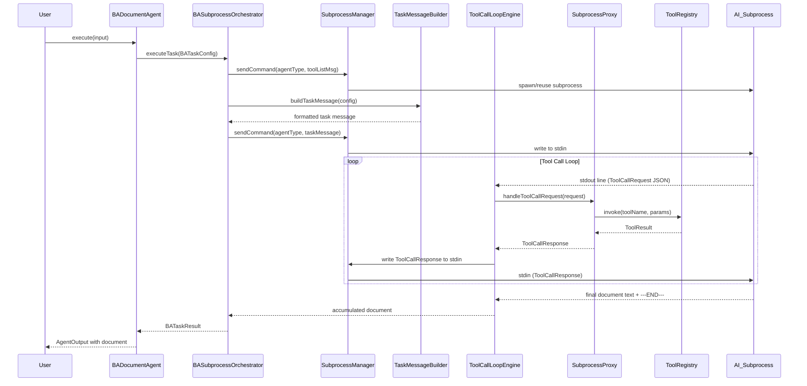
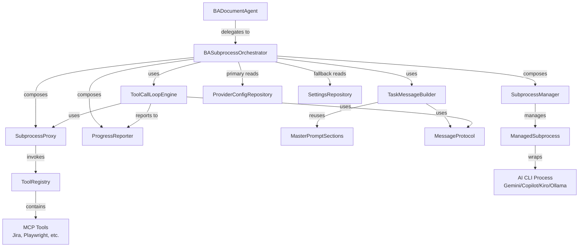
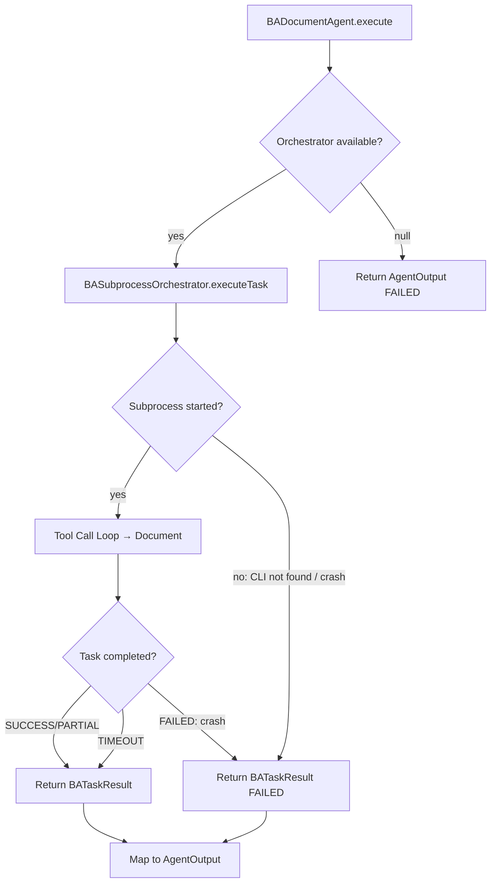

# Design Document — Agent Subprocess Orchestration

> **Updated 2025:** This document has been updated to reflect the [legacy-pipeline-removal spec](./../legacy-pipeline-removal/design.md). The legacy 4-phase pipeline, feature flags, and all fallback chains have been completely removed. Subprocess orchestration is now the single execution path.

## Overview

This design replaces the BA agent's rigid 4-phase data collection pipeline (CollectPhase → ExpandPhase → VisualizePhase → SynthesizePhase → MasterPromptBuilder → GeminiCliAgent) with an **AI-driven subprocess architecture**. Instead of the agent pre-collecting data through hardcoded phases and building a giant prompt, the new architecture:

1. Starts a long-lived AI subprocess (Gemini CLI, Copilot CLI, Kiro CLI, Ollama CLI)
2. Sends a task message with role instructions, document template, and available tools
3. Lets the AI service decide what data it needs by requesting tool calls on demand
4. Proxies tool calls through the existing ToolRegistry (MCP tools from the Integrations page)
5. Collects the final generated document from the subprocess stdout

The design reuses the **Generic Agent Framework** infrastructure already implemented: `SubprocessManager` (Req 13), `SubprocessProxy` (Req 20), `MessageProtocol`, `ManagedSubprocess`, and `ToolRegistry`. New components are thin orchestration layers on top of these existing building blocks.

### Key Design Decisions

1. **Composition over inheritance** — `BASubprocessOrchestrator` composes `SubprocessManager` + `SubprocessProxy` + `ProgressReporter` rather than extending any framework class. This keeps the orchestrator focused on BA-specific workflow logic.

2. **Subprocess-only execution** — The legacy pipeline has been removed per the [legacy-pipeline-removal spec](./../legacy-pipeline-removal/design.md). There is no feature flag, no fallback chain, and no dual-path logic. `BADocumentAgent` always delegates to `BASubprocessOrchestrator`. Failures return FAILED status directly.

3. **Models in shared module** — `BATaskConfig`, `BATaskResult`, and `ToolCallLogEntry` live in `shared/src/commonMain` for KMP compatibility, following the pattern of `SubprocessModels.kt`.

4. **Reuse MessageProtocol framing** — All subprocess communication uses the existing `MessageProtocol` JSON + `---END---` delimiter format. No new wire protocol needed.

5. **ToolCallLoopEngine as a separate class** — The tool call loop is extracted into its own class (≤200 lines) rather than being embedded in the orchestrator. This keeps both classes under the 200-line limit and makes the loop independently testable.

---

## Architecture

### High-Level Flow



### Component Dependency Graph



### Execution Mode Selection



---

## Components and Interfaces

### 1. BASubprocessOrchestrator

**Location:** `server/src/jvmMain/kotlin/com/assistant/server/agent/ba/subprocess/BASubprocessOrchestrator.kt`

**Responsibility:** Orchestrates a single BA document generation task through the subprocess architecture. Thin coordination layer — delegates lifecycle to `SubprocessManager`, tool proxying to `SubprocessProxy`, and the event loop to `ToolCallLoopEngine`.

```kotlin
class BASubprocessOrchestrator(
    private val subprocessManager: SubprocessManager,
    private val subprocessProxy: SubprocessProxy,
    private val progressReporter: ProgressReporter,
    private val settingsRepository: SettingsRepository,
    private val providerConfigRepo: ProviderConfigRepository? = null
) {
    suspend fun executeTask(taskConfig: BATaskConfig): BATaskResult
}
```

**Key behaviors:**
- Resolves CLI backend from `BATaskConfig.cliBackend` → `SubprocessConfig` via `CliBackendResolver` (reads from `ProviderConfigRepository` / Integrations page first, then `SettingsRepository` as fallback)
- Registers the resolved `SubprocessConfig` with `SubprocessManagerImpl` at runtime before spawning — this bridges the Integrations page dynamic config to the subprocess lifecycle manager
- Injects tool list into subprocess context before sending the task
- Delegates the stdout reading loop to `ToolCallLoopEngine`
- Reports progress milestones: 5% (subprocess started), 10% (task sent), 15–80% (tool call loop), 85% (response received), 95% (parsing complete)
- On failure, returns `BATaskResult` with status `FAILED` — no fallback to any other pipeline

### 2. TaskMessageBuilder

**Location:** `server/src/jvmMain/kotlin/com/assistant/server/agent/ba/subprocess/TaskMessageBuilder.kt`
**Constants:** `server/src/jvmMain/kotlin/com/assistant/server/agent/ba/subprocess/TaskMessageConstants.kt`

**Responsibility:** Constructs the initial task message sent to the AI subprocess. Reuses existing `MasterPromptSections` for role instructions, template structure, and output format — but does NOT include pre-collected data.

```kotlin
object TaskMessageBuilder {
    fun buildTaskMessage(config: BATaskConfig, tools: List<ToolDescriptor>, isRealCli: Boolean): String
    fun buildToolUsageInstructions(tools: List<ToolDescriptor>): String
    fun buildStrategyHint(docType: String): String
}
```

**Key behaviors:**
- For `isRealCli = true`: places RESPONSE PROTOCOL section at the **top** of the prompt (before role instruction) and adds a reminder at the end
- Filters tools to read-only subset via `filterRelevantTools()` — removes write/mutation tools (create, delete, update, transition) that the AI should not call during document generation
- Truncates tool descriptions to first sentence (max 120 chars) — strips verbose Python docstrings (Args/Returns/Raises)
- Includes a STEP-BY-STEP GUIDE section with concrete tool call sequence for the given `rootTicketId`
- Composes: (response protocol) + role instruction + template structure + output format + diagram instructions + tool usage instructions + strategy hint + step-by-step guide + root ticket ID + (reminder)
- Strategy hints vary by document type (BRD → business goals; FSD → technical architecture; SLIDES → executive summary)
- For `isRealCli = false`: formats final message via `MessageProtocol.formatCommand()`
- For `isRealCli = true`: returns plain text with `\n` suffix
- Does NOT include any pre-collected ticket data
- String constants extracted to `TaskMessageConstants.kt` to respect 200-line file limit

### 3. ToolCallLoopEngine

**Location:** `server/src/jvmMain/kotlin/com/assistant/server/agent/ba/subprocess/ToolCallLoopEngine.kt`

**Responsibility:** Event-driven loop that reads AI subprocess stdout, detects tool call requests, proxies them, and accumulates the final document response.

```kotlin
class ToolCallLoopEngine(
    private val subprocessProxy: SubprocessProxy,
    private val progressReporter: ProgressReporter
) {
    suspend fun runLoop(
        stdoutFlow: Flow<String>,
        stdinWriter: suspend (String) -> Unit,
        maxToolCalls: Int = 30,
        timeoutSeconds: Int = 180
    ): ToolCallLoopResult
}
```

**Key behaviors:**
- Reads each line from the subprocess stdout `Flow<String>`
- JSON lines → `MessageProtocol.parseStdoutLine()` → if `type == "toolCall"`, extract `ToolCallRequest`
- Plain text lines → accumulate as document content
- `---END---` delimiter → end of response, return accumulated document
- Proxies tool calls via `SubprocessProxy.handleToolCallRequest()`
- Sends responses back via `stdinWriter` using `MessageProtocol.formatToolResponse()`
- Enforces max tool call limit (default: 30) — sends error response after limit
- Enforces total timeout (default: 180s) — returns partial document on timeout
- Reports each tool call to `ProgressReporter` with progress in 15–80% range
- Supports parallel tool calls via `SubprocessProxy` batch handling

### 4. BATaskConfig (Data Model)

**Location:** `shared/src/commonMain/kotlin/com/assistant/agent/ba/models/BATaskConfig.kt`

```kotlin
@Serializable
data class BATaskConfig(
    val rootTicketId: String,
    val docType: String = "BRD",
    val maxToolCalls: Int = 30,
    val taskTimeoutSeconds: Int = 180,
    val cliBackend: String = "gemini"
)
```

### 5. BATaskResult (Data Model)

**Location:** `shared/src/commonMain/kotlin/com/assistant/agent/ba/models/BATaskResult.kt`

```kotlin
@Serializable
data class BATaskResult(
    val document: String,
    val toolCallsExecuted: Int,
    val toolCallsFailed: Int,
    val totalDurationMs: Long,
    val status: BATaskStatus,
    val toolCallLog: List<ToolCallLogEntry> = emptyList()
)

@Serializable
enum class BATaskStatus { SUCCESS, PARTIAL, TIMEOUT, FAILED }
```

### 6. ToolCallLogEntry (Data Model)

**Location:** `shared/src/commonMain/kotlin/com/assistant/agent/ba/models/ToolCallLogEntry.kt`

```kotlin
@Serializable
data class ToolCallLogEntry(
    val toolName: String,
    val durationMs: Long,
    val success: Boolean,
    val resultSizeChars: Int
)
```

---

## Data Models

### BATaskConfig

| Field | Type | Default | Description |
|-------|------|---------|-------------|
| `rootTicketId` | `String` | (required) | Jira ticket ID to analyze (e.g., "PROJ-123") |
| `docType` | `String` | `"BRD"` | Document type: "BRD", "FSD", "SLIDES" |
| `maxToolCalls` | `Int` | `30` | Maximum tool calls per task |
| `taskTimeoutSeconds` | `Int` | `180` | Total timeout for the task |
| `cliBackend` | `String` | `"gemini"` | CLI backend: "gemini", "copilot", "kiro", "ollama" |

**Validation rules:**
- `rootTicketId` must be non-blank
- `docType` must be one of: "BRD", "FSD", "SLIDES"
- `maxToolCalls` must be > 0
- `taskTimeoutSeconds` must be > 0
- `cliBackend` must be one of: "gemini", "copilot", "kiro", "ollama"

### BATaskResult

| Field | Type | Description |
|-------|------|-------------|
| `document` | `String` | Generated markdown document |
| `toolCallsExecuted` | `Int` | Total tool calls made |
| `toolCallsFailed` | `Int` | Tool calls that returned `success = false` |
| `totalDurationMs` | `Long` | Total execution time in milliseconds |
| `status` | `BATaskStatus` | Execution outcome: SUCCESS, PARTIAL, TIMEOUT, FAILED |
| `toolCallLog` | `List<ToolCallLogEntry>` | Ordered log of all tool calls |

**Status semantics:**
- `SUCCESS` — Document generated, all tool calls completed normally
- `PARTIAL` — Document generated but some tool calls failed; AI worked with available data
- `TIMEOUT` — Task exceeded timeout; partial document returned
- `FAILED` — Subprocess crashed or could not start; no document produced

### ToolCallLogEntry

| Field | Type | Description |
|-------|------|-------------|
| `toolName` | `String` | Name of the tool invoked |
| `durationMs` | `Long` | Execution time in milliseconds |
| `success` | `Boolean` | Whether the tool call succeeded |
| `resultSizeChars` | `Int` | Size of the result data in characters |

### ToolCallLoopResult (Internal)

**Location:** `server/src/jvmMain/kotlin/com/assistant/server/agent/ba/subprocess/ToolCallLoopEngine.kt` (internal class)

| Field | Type | Description |
|-------|------|-------------|
| `document` | `String` | Accumulated document text |
| `toolCallsExecuted` | `Int` | Total tool calls proxied |
| `toolCallsFailed` | `Int` | Failed tool calls |
| `toolCallLog` | `List<ToolCallLogEntry>` | Ordered tool call log |
| `timedOut` | `Boolean` | Whether the loop ended due to timeout |

### CLI Backend Configuration Mapping

CLI paths and models are resolved from `ProviderConfigRepository` (Integrations page) first. If not found, `CliBackendResolver` falls back to `SettingsRepository`. Backend names map to `ProviderType`: gemini→GEMINI_CLI, copilot→COPILOT_CLI, kiro→KIRO_CLI. The `endpoint` field stores the CLI path and `model` stores the model name.

| Backend | Settings Key (CLI path) | Settings Key (Model) | CLI Args Pattern |
|---------|------------------------|---------------------|-----------------|
| `gemini` | `ai_cli_path` | `ai_cli_model` | `[cliPath, "-m", model]` |
| `copilot` | `copilot_cli_path` | — | `[cliPath]` |
| `kiro` | `kiro_cli_path` | — | `[cliPath]` |
| `ollama` | `ollama_cli_path` | `ollama_cli_model` | `[cliPath, "run", model]` |

---

## Package Structure

```
shared/src/commonMain/kotlin/com/assistant/agent/ba/
└── models/
    ├── BATaskConfig.kt          # Task input configuration
    ├── BATaskResult.kt          # Task output with status and metrics
    └── ToolCallLogEntry.kt      # Individual tool call log entry

server/src/jvmMain/kotlin/com/assistant/server/agent/ba/
├── subprocess/
│   ├── BASubprocessOrchestrator.kt   # Main orchestrator (≤200 lines)
│   ├── TaskMessageBuilder.kt         # Task message construction (≤200 lines)
│   ├── TaskMessageConstants.kt       # Prompt string constants (≤200 lines)
│   ├── ToolCallLoopEngine.kt         # Event-driven tool call loop (≤200 lines)
│   └── CliBackendResolver.kt         # CLI backend → SubprocessConfig mapping (≤200 lines)
├── BADocumentAgent.kt                # Subprocess-only delegation (legacy removed)
├── BAAgentConfig.kt                  # Provides buildSubprocessConfig() (legacy phase config removed)
└── BAAgentModule.kt                  # Registers orchestrator in Koin (legacy beans removed)
```

**Rationale for file split:**
- `BASubprocessOrchestrator` — orchestration logic only (~120 lines)
- `TaskMessageBuilder` — message construction with template reuse, tool filtering, description truncation (~170 lines)
- `TaskMessageConstants` — prompt string constants extracted from TaskMessageBuilder (~65 lines)
- `ToolCallLoopEngine` — event loop with timeout/limit enforcement (~150 lines)
- `CliBackendResolver` — settings lookup with ProviderConfigRepository fallback and SubprocessConfig mapping (~100 lines)

Each file stays well under the 200-line limit.


---

## Correctness Properties

*A property is a characteristic or behavior that should hold true across all valid executions of a system — essentially, a formal statement about what the system should do. Properties serve as the bridge between human-readable specifications and machine-verifiable correctness guarantees.*

### Property 1: Task message contains all required sections

*For any* valid `BATaskConfig` with arbitrary `rootTicketId`, `docType` ∈ {"BRD", "FSD", "SLIDES"}, and `cliBackend`, the task message produced by `TaskMessageBuilder.buildTaskMessage()` SHALL contain: a role instruction section, a document template structure section, an output format section, the `rootTicketId` value, and the `docType` value.

**Validates: Requirements 2.1**

### Property 2: Tool usage instructions reference all relevant read-only tools

*For any* non-empty list of `ToolDescriptor` objects with arbitrary names and descriptions, the tool usage instructions produced by `TaskMessageBuilder.buildToolUsageInstructions()` after filtering via `filterRelevantTools()` SHALL contain every tool name that matches a read-only prefix (get, search, download). Write/mutation tools (create, delete, update, transition, add, remove) SHALL be excluded from the output.

**Validates: Requirements 2.3**

### Property 3: Task message MessageProtocol round-trip

*For any* valid `BATaskConfig`, the task message produced by `TaskMessageBuilder.buildTaskMessage()` — which internally calls `MessageProtocol.formatCommand()` — SHALL be parseable: splitting the output by newlines, each line SHALL either be parseable by `MessageProtocol.parseStdoutLine()` as a valid `SubprocessMessage`, be plain text (returns null), or be the `MessageProtocol.DELIMITER`.

**Validates: Requirements 2.5, 2.6**

### Property 4: Tool call proxying with correlation ID matching

*For any* set of N `ToolCallRequest` messages (1 ≤ N ≤ 30) with unique correlation IDs emitted on subprocess stdout — whether the tool calls succeed or fail — the `ToolCallLoopEngine` SHALL write exactly N `ToolCallResponse` messages back to stdin, and each response's `id` SHALL match exactly one request's `id`, establishing a bijection between requests and responses.

**Validates: Requirements 3.1, 3.4, 3.8**

### Property 5: Plain text accumulation preserves content and order

*For any* sequence of K plain text lines (not JSON, not delimiter) emitted on subprocess stdout before a `---END---` delimiter, the `ToolCallLoopEngine` SHALL return a document string that contains all K lines in their original order.

**Validates: Requirements 3.2, 3.3**

### Property 6: Max tool call limit enforcement

*For any* max tool call limit N (N ≥ 1) and a sequence of N + K tool call requests (K ≥ 1), the `ToolCallLoopEngine` SHALL proxy the first N requests normally through `SubprocessProxy` and SHALL return error responses with `success = false` for the remaining K requests without invoking `SubprocessProxy.handleToolCallRequest()`.

**Validates: Requirements 3.5**

### Property 7: Combined tool descriptors completeness

> **Updated:** Native BA tools have been removed per the [native-tool-removal spec](./../native-tool-removal/design.md). This property now applies to MCP tools only.

*For any* set of MCP tools registered via `AgentMcpManager`, `SubprocessProxy.getAvailableToolDescriptors()` SHALL return a list containing descriptors for all registered MCP tools — the result set SHALL be a superset of the MCP tool input set (by tool name).

**Validates: Requirements 5.3**

### Property 8: Tool registration priority ordering

> **Updated:** Native BA tools have been removed per the [native-tool-removal spec](./../native-tool-removal/design.md). Local native tool vs MCP tool priority is no longer applicable.

*For any* tool name registered from multiple MCP sources (Agent Home MCP and Shared MCP Bridge with the same name), `ToolRegistry` SHALL resolve to the Agent Home MCP tool. The Shared MCP Bridge tool with the duplicate name SHALL NOT appear in `listTools()`.

**Validates: Requirements 5.5**

### Property 9: BATaskConfig JSON serialization round-trip

*For any* valid `BATaskConfig` with arbitrary `rootTicketId` (non-blank string), `docType` ∈ {"BRD", "FSD", "SLIDES"}, `maxToolCalls` (positive Int), `taskTimeoutSeconds` (positive Int), and `cliBackend` ∈ {"gemini", "copilot", "kiro", "ollama"}, serializing to JSON then deserializing back SHALL produce an equivalent `BATaskConfig` object.

**Validates: Requirements 6.1, 6.4**

### Property 10: BATaskResult JSON serialization round-trip

*For any* valid `BATaskResult` with arbitrary `document` (String), `toolCallsExecuted` (non-negative Int), `toolCallsFailed` (non-negative Int), `totalDurationMs` (non-negative Long), `status` ∈ {SUCCESS, PARTIAL, TIMEOUT, FAILED}, and `toolCallLog` (list of valid `ToolCallLogEntry` objects), serializing to JSON then deserializing back SHALL produce an equivalent `BATaskResult` object.

**Validates: Requirements 6.2, 6.3, 6.5**

---

## Error Handling

### Subprocess Startup Failures

| Scenario | Detection | Response | Recovery |
|----------|-----------|----------|----------|
| CLI binary not found | `SubprocessManager.sendCommand()` throws `IOException` | Log warning with CLI path | Return `BATaskResult(status=FAILED)` — no fallback |
| CLI process crashes on startup | `ManagedSubprocess.isAlive() == false` after spawn | Log crash with exit code and stderr | Return `BATaskResult(status=FAILED)` — no fallback |
| Invalid CLI configuration | Settings missing or malformed | Return `BATaskResult(status=FAILED)` | Return `BATaskResult(status=FAILED)` — no fallback |
| Subprocess unresponsive | No stdout output within `unresponsiveTimeoutMs` | `SubprocessManager` detects via health monitor | Auto-restart on next command (existing framework behavior) |

### Tool Call Failures

| Scenario | Detection | Response |
|----------|-----------|----------|
| Tool not found in ToolRegistry | `ToolRegistry.invoke()` returns `ToolResult(success=false)` | Send `ToolCallResponse(success=false, error="Tool not found: <name>")` back to subprocess — AI decides next action |
| Tool execution timeout | `ToolRegistry` internal timeout | Send `ToolCallResponse(success=false, error="Tool timeout")` — AI proceeds with available data |
| Tool returns error | `ToolResult.success == false` | Forward error in `ToolCallResponse` — AI may retry with different params or skip |
| Max tool calls exceeded | `ToolCallLoopEngine` counter ≥ `maxToolCalls` | Send error response + instruction to produce final document with available data |
| MCP server down | `McpToolBridge` returns error | Forward error — AI can try alternative tools or proceed without data |

### Task-Level Failures

| Scenario | Detection | BATaskResult.status | Behavior |
|----------|-----------|---------------------|----------|
| All tool calls succeed, document generated | Normal completion | `SUCCESS` | Return full document |
| Some tool calls failed, document generated | `toolCallsFailed > 0` but document non-empty | `PARTIAL` | Return document with warning log |
| Task timeout reached | `ToolCallLoopEngine` timeout | `TIMEOUT` | Return partial document accumulated so far |
| Subprocess crashes mid-task | `ManagedSubprocess.isAlive() == false` during loop | `FAILED` | Log crash details, return empty document — no fallback |
| No document produced | Subprocess returned empty stdout | `FAILED` | Log warning, return FAILED status — no fallback |

### Stderr Handling

The `BASubprocessOrchestrator` captures stderr from the AI subprocess in a separate coroutine:
- Stderr lines are logged as `WARN` level — they don't mix with document content on stdout
- On subprocess crash, the last N stderr lines are included in `BATaskResult` for diagnostics
- Stderr is never sent back to the subprocess or included in the document

---

## Testing Strategy

### Property-Based Testing (PBT)

**Library:** [Kotest Property Testing](https://kotest.io/docs/proptest/property-based-testing.html) — already available in the project's test dependencies.

**Configuration:** Minimum 100 iterations per property test.

**Tag format:** `// Feature: agent-subprocess-orchestration, Property N: <property_text>`

Each of the 10 correctness properties above maps to a single property-based test:

| Property | Test Class | Generator Strategy |
|----------|-----------|-------------------|
| P1: Task message sections | `TaskMessageBuilderPropertyTest` | Random `BATaskConfig` (arbitrary strings for ticketId, random docType from set) |
| P2: Tool instructions reference all tools | `TaskMessageBuilderPropertyTest` | Random lists of `ToolDescriptor` (1–20 tools, arbitrary names) |
| P3: MessageProtocol round-trip | `TaskMessageBuilderPropertyTest` | Random `BATaskConfig`, parse output lines |
| P4: Tool call correlation ID matching | `ToolCallLoopEnginePropertyTest` | Random N (1–30) `ToolCallRequest` objects with unique UUIDs |
| P5: Plain text accumulation | `ToolCallLoopEnginePropertyTest` | Random K (1–50) plain text lines (no `{` prefix, no delimiter) |
| P6: Max tool call limit | `ToolCallLoopEnginePropertyTest` | Random N (1–10) limit, N+K (K=1–5) requests |
| P7: Combined tool descriptors | `SubprocessProxyPropertyTest` | Random sets of MCP tool descriptors |
| P8: Tool priority ordering | `ToolRegistryPriorityPropertyTest` | Random tool names registered from multiple sources |
| P9: BATaskConfig round-trip | `BATaskConfigPropertyTest` | Random field values within valid ranges |
| P10: BATaskResult round-trip | `BATaskResultPropertyTest` | Random field values, random-length toolCallLog |

### Unit Tests (Example-Based)

| Component | Test Cases |
|-----------|-----------|
| `BASubprocessOrchestrator` | Delegates to SubprocessManager; injects tool list before task; reports progress milestones; returns FAILED on subprocess crash; falls back on CLI not found |
| `TaskMessageBuilder` | Strategy hint varies by docType (BRD/FSD/SLIDES); no pre-collected data in message; formats via MessageProtocol |
| `ToolCallLoopEngine` | Delimiter ends loop; timeout returns partial; progress reported per tool call; error responses forwarded to subprocess |
| `CliBackendResolver` | Gemini config; Copilot config; Ollama config; Kiro config; invalid backend returns error |
| `BADocumentAgent` | Subprocess-only execution; null orchestrator returns FAILED; subprocess FAILED returns FAILED (no fallback); onStart/onComplete unchanged; passes correct BATaskConfig |
| `BAAgentModule` | Koin registration resolves all dependencies; MCP tools registered via `registerMcpTools()` (native BA tools removed per [native-tool-removal spec](./../native-tool-removal/design.md)) |

### Integration Tests

| Scenario | Scope |
|----------|-------|
| End-to-end subprocess flow | Orchestrator → SubprocessManager → mock CLI process → tool call loop → document |
| MCP tool update during session | Start MCP server mid-session, verify tools-updated message sent |
| Subprocess failure returns FAILED | Subprocess fails → BATaskResult with FAILED status, no fallback |

### Test File Locations

```
server/src/jvmTest/kotlin/com/assistant/server/agent/ba/subprocess/
├── BASubprocessOrchestratorTest.kt          # Unit tests
├── TaskMessageBuilderTest.kt                # Unit tests
├── TaskMessageBuilderPropertyTest.kt        # PBT: Properties 1, 2, 3
├── ToolCallLoopEngineTest.kt                # Unit tests
├── ToolCallLoopEnginePropertyTest.kt        # PBT: Properties 4, 5, 6
├── CliBackendResolverTest.kt                # Unit tests
└── SubprocessProxyPropertyTest.kt           # PBT: Properties 7, 8

shared/src/commonTest/kotlin/com/assistant/agent/ba/models/
├── BATaskConfigPropertyTest.kt              # PBT: Property 9
└── BATaskResultPropertyTest.kt              # PBT: Property 10
```
