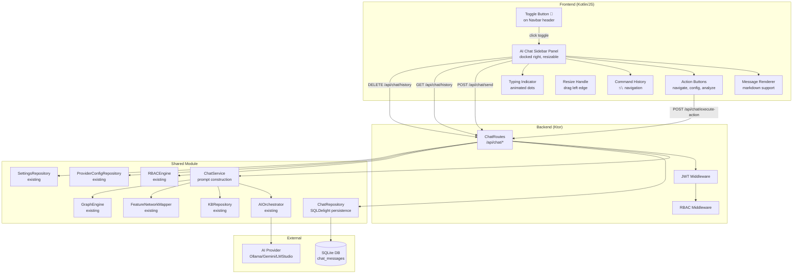
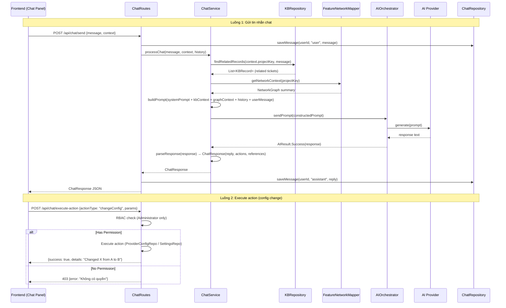
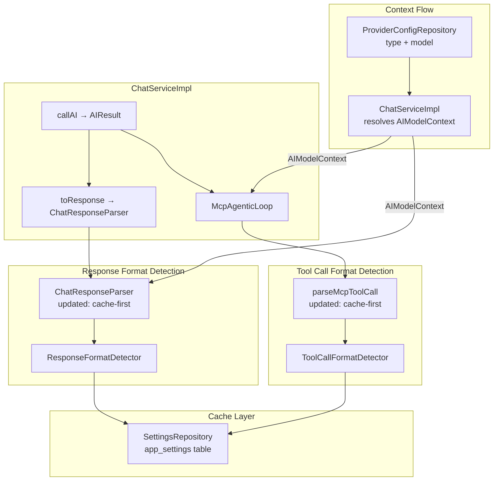
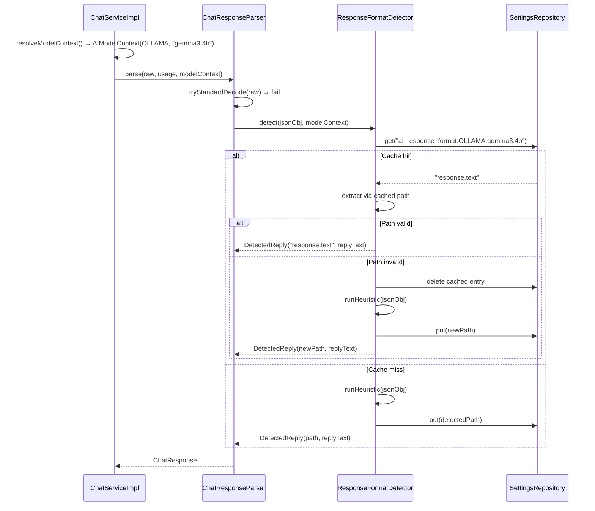

# AI Chat Sidebar — Design

# Thiết kế AI Chat Sidebar — Trợ lý AI Tương tác

## Tổng quan (Overview)

AI Chat Sidebar là panel chat AI docked bên phải trong Shell layout, có thể resize bằng drag handle. Cho phép người dùng tương tác với hệ thống qua ngôn ngữ tự nhiên. Sidebar tích hợp sâu với AI_Orchestrator (OllamaAgent), Knowledge_Base, và Relationship Network để cung cấp câu trả lời có ngữ cảnh dự án. Ngoài ra, sidebar hỗ trợ điều hướng ứng dụng và thay đổi cấu hình (với RBAC check).

### Quyết định thiết kế chính

1. **Panel docked bên phải trong Shell**: AI Chat Sidebar nằm trong flexbox layout của Shell (Sidebar | MainContent | ChatPanel). Không phải fixed overlay. Toggle button 💬 trên Navbar header, bên cạnh project badge
2. **Resizable**: Drag handle ở cạnh trái panel, width 280–600px (default 380px). CSS `display:none/flex` thay vì transform
3. **Textarea multiline**: Input dùng `<textarea rows="3">`, Shift+Enter xuống dòng, Enter gửi. Resize vertical, min-height 60px, max-height 160px
4. **ChatService dùng OllamaAgent trực tiếp**: ChatServiceImpl inject `aiAgentProvider` lambda tạo OllamaAgent từ DB config mỗi lần gọi (không qua Koin `get<AIAgent>()`)
5. **Per-user chat history trong SQLDelight**: Bảng `chat_messages` lưu toàn bộ tin nhắn per-user, hỗ trợ phân trang và xóa lịch sử. DB cũ cần xóa khi thêm bảng mới
6. **Action system**: AI response chứa `actions` — hành động đề xuất (navigate, changeConfig, triggerAnalysis). Frontend render action buttons, backend validate RBAC
7. **KB-First strategy cho chat**: Khi user hỏi về ticket cụ thể, ChatService truy vấn KB trước, inject kết quả vào prompt context
8. **Command history navigation**: Frontend lưu danh sách user messages, phím ↑/↓ điều hướng

---

## Kiến trúc (Architecture)



### Luồng dữ liệu chính



---

## Thành phần & Giao diện (Components and Interfaces)

### 1. ChatService Interface

```kotlin
// shared/.../chat/ChatService.kt
interface ChatService {
    /**
     * Xử lý tin nhắn chat: xây dựng prompt với KB context + graph context + history,
     * gửi đến AI provider, parse response thành ChatResponse.
     */
    suspend fun processChat(
        message: String,
        context: ChatContext,
        conversationHistory: List<ChatMessage>
    ): ChatResponse

    /**
     * Xây dựng system prompt cho AI chat.
     */
    fun buildSystemPrompt(context: ChatContext): String
}

@Serializable
data class ChatContext(
    val projectKey: String,
    val currentScreen: String,    // "dashboard", "knowledge_graph", etc.
    val userRole: String,         // "ADMINISTRATOR", "NEURAL_ARCHITECT", "READER"
    val userId: String,
    val graphContext: GraphChatContext? = null  // Graph view state from frontend
)

/**
 * Graph state context gửi kèm khi user ở trang Knowledge Graph.
 * Chứa thông tin về focused node, active filters, visible nodes.
 * Requirements: 8.1, 8.2, 8.3
 */
@Serializable
data class GraphChatContext(
    val focusedNodeKey: String? = null,
    val activeTypeFilters: List<String> = emptyList(),
    val selectedClusterId: Int? = null,
    val depthValue: Int = 1,
    val visibleNodeCount: Int = 0,
    val searchQuery: String = ""
)
```

### 2. ChatServiceImpl

ChatServiceImpl delegate các helper methods sang extracted helper objects để tuân thủ giới hạn 200 dòng/file:

| Helper Object | Phương thức | Mô tả | Req |
|---|---|---|---|
| `ChatPersonalization` | `build(userId, repo)` | Format skills/workflow/instructions/rules thành prompt text | 19.41, 19.42 |
| `ChatLocalKBContext` | `isEnabled(settingsRepo)` | Check local KB tool enabled state | 19.76 |
| `ChatLocalKBContext` | `buildToolsContext(enabled)` | Build tool descriptions cho 3 local KB operations | 19.61, 19.72 |
| `ChatLocalKBContext` | `buildPriorityHint(enabled)` | Build priority guidance text | 19.71 |
| `ChatMcpToolsContext` | `build(bridge, pm, localLines, userId, permService)` | Build MCP tools context with per-user filtering | 1.3, 6.4 |
| `ChatPromptBuilder` | `buildBasePrompt(ctx)` | Build base system prompt với project context + actions | 19.5, 19.6 |
| `ChatResponseParser` | `parse(raw, usage, modelCtx?, settingsRepo?)` | Parse AI response: cache-first format detection via `ResponseFormatDetector`, standard `"reply"` key, alternative keys, raw text fallback. `ensureNonEmptyReply()` guarantees non-blank reply — fallback message khi reply trống. Backward-compatible `parse(raw, usage)` overload vẫn hoạt động | 19.5, 19.8, 19.18, 19.87–19.91, 19.100–19.102 |
| `McpToolCallFallback` | `parseJsonToolName(response)`, `parseTextPattern(response)` | Fallback parsers cho AI-hallucinated tool call formats | 19.67 |

```kotlin
// server/.../chat/ChatServiceImpl.kt
class ChatServiceImpl(
    private val aiAgentProvider: () -> AIAgent,
    private val kbRepository: KBRepository,
    private val graphEngine: GraphEngine,
    private val userAIConfigRepository: UserAIConfigRepository? = null,
    private val mcpProcessManager: McpProcessManager? = null,
    private val embeddingService: EmbeddingService? = null,
    private val vectorStore: VectorStore? = null,
    private val indexingPipeline: IndexingPipeline? = null,
    private val settingsRepository: SettingsRepository? = null,
    private val localKBToolExecutor: LocalKBToolExecutor? = null,
    private val providerConfigRepository: ProviderConfigRepository? = null,
    private val internalMcpBridge: com.assistant.server.mcp.internal.InternalMcpBridge? = null,
    private val mcpServerRepository: com.assistant.mcp.McpServerRepository? = null,
    private val userToolPermissionService: UserToolPermissionService? = null
) : ChatService {

    /** Sync handler for Jira MCP tool responses → graph updates. Req: 18.1 */
    internal val jiraSyncHandler: JiraMcpSyncHandler? by lazy { ... }
    /** Sync handler for Confluence MCP tool responses → VectorStore indexing. Req: 19.4 */
    internal val confluenceSyncHandler: ConfluenceMcpSyncHandler by lazy { ... }

    override suspend fun processChat(
        message: String, context: ChatContext,
        conversationHistory: List<ChatMessage>
    ): ChatResponse {
        val prompt = buildFullPrompt(message, context, conversationHistory)
        val executor = if (isLocalKBToolEnabled()) localKBToolExecutor else null
        val modelCtx = resolveModelContext()
        return McpAgenticLoop.execute(
            prompt, mcpProcessManager, ::callAI, ::toResponse,
            jiraSyncHandler, context.projectKey, confluenceSyncHandler,
            executor, modelCtx, settingsRepository,
            userId = context.userId,
            permService = userToolPermissionService
        )
    }

    private suspend fun buildFullPrompt(
        message: String, context: ChatContext, history: List<ChatMessage>
    ): String {
        val base = buildBasePrompt(context)                          // → ChatPromptBuilder
        val personalization = buildPersonalization(context.userId)    // → ChatPersonalization
        val kb = buildKBContext(context.projectKey, message)
        // Deep Analysis context (từ spec ticket-intelligence Req 24):
        // Khi ticket đã có Deep Analysis, inject extracted_requirements, technical_details,
        // acceptance_criteria, dependencies vào prompt thay vì chỉ RequirementSummary đơn giản
        val graph = buildGraphContext(context.projectKey)
        val graphState = buildGraphStateContext(context.graphContext) // Graph view state
        val mcpTools = buildMcpToolsContext(context.userId)
        val knowledgeCtx = buildKnowledgeContext(context.projectKey, message)
        val hist = formatHistory(history)
        return "$base\n$personalization\n--- KB ---\n$kb\n--- GRAPH ---\n$graph\n$graphState\n--- MCP TOOLS ---\n$mcpTools\n--- KNOWLEDGE CONTEXT ---\n$knowledgeCtx\n--- HISTORY ---\n$hist\n--- USER ---\n$message"
    }

    /** Build context string from frontend graph state (focused node, filters, etc.) */
    private fun buildGraphStateContext(gc: GraphChatContext?): String {
        if (gc == null) return "User is NOT on the Knowledge Graph page."
        val parts = mutableListOf("User is viewing the Knowledge Graph.")
        gc.focusedNodeKey?.let { key ->
            parts.add(
                "The user is currently focused on Jira ticket \"$key\". " +
                "\"$key\" is the COMPLETE Jira issue key (project prefix + number). " +
                "Use this EXACT value \"$key\" as the issueId/issue key when calling any Jira tools. " +
                "Do NOT split, truncate, or extract only the project prefix from this key."
            )
        }
        if (gc.activeTypeFilters.isNotEmpty()) parts.add("Active type filters: ${gc.activeTypeFilters.joinToString(", ")}")
        gc.selectedClusterId?.let { parts.add("Selected cluster: $it") }
        if (gc.searchQuery.isNotBlank()) parts.add("Search query: ${gc.searchQuery}")
        parts.add("Visible nodes: ${gc.visibleNodeCount}, Depth: ${gc.depthValue}")
        return parts.joinToString(" ")
    }

    // Delegate methods → helper objects:
    private fun buildBasePrompt(ctx: ChatContext) = ChatPromptBuilder.buildBasePrompt(ctx)
    private suspend fun buildPersonalization(userId: String) = ChatPersonalization.build(userId, userAIConfigRepository)
    internal fun isLocalKBToolEnabled() = ChatLocalKBContext.isEnabled(settingsRepository)
    internal fun buildLocalKBToolsContext() = ChatLocalKBContext.buildToolsContext(isLocalKBToolEnabled())
    internal fun buildLocalKBPriorityHint() = ChatLocalKBContext.buildPriorityHint(isLocalKBToolEnabled())
    internal fun parseAIResponse(raw: String, usage: Int) = ChatResponseParser.parse(raw, usage, resolveModelContext(), settingsRepository)

    // formatKnowledgeChunks delegates to top-level function:
    internal fun formatKnowledgeChunks(chunks: List<AttachmentChunk>) =
        com.assistant.server.chat.formatKnowledgeChunks(chunks)
}
```

#### Helper Objects (extracted từ ChatServiceImpl)

**ChatPromptBuilder** — Build base system prompt:
```kotlin
// server/.../chat/ChatPromptBuilder.kt
internal object ChatPromptBuilder {
    fun buildBasePrompt(ctx: ChatContext): String { /* project context + available actions */ }
}
```

**ChatPersonalization** — Format user AI config thành prompt text:
```kotlin
// server/.../chat/ChatPersonalization.kt
internal object ChatPersonalization {
    suspend fun build(userId: String, repo: UserAIConfigRepository?): String { /* skills, workflow, instructions, rules */ }
}
```

**ChatResponseParser** — Parse AI response text thành ChatResponse:
```kotlin
// server/.../chat/ChatResponseParser.kt
internal object ChatResponseParser {
    internal const val EMPTY_REPLY_FALLBACK = "Tôi đã thu thập thông tin nhưng không thể tổng hợp câu trả lời. Vui lòng thử lại hoặc đặt câu hỏi cụ thể hơn."
    fun parse(raw, usage): ChatResponse = parse(raw, usage, null, null)  // backward-compatible
    fun parse(raw, usage, modelCtx?, settingsRepo?): ChatResponse {
        // blank → "AI đang khởi động, vui lòng thử lại"
        // try standard {"reply":"..."} format → ensureNonEmptyReply()
        // try ResponseFormatDetector (cache-first detection, Req: 19.87–19.91)
        // try alternative JSON keys: "response.text", "text", "content", "message"
        // fallback: raw text as reply
        // ALL paths wrapped with ensureNonEmptyReply() — guarantees non-blank reply
    }
    private fun ensureNonEmptyReply(response: ChatResponse): ChatResponse =
        if (response.reply.isBlank()) response.copy(reply = EMPTY_REPLY_FALLBACK) else response
}
```

**McpToolCallFallback** — Fallback parsers cho AI-hallucinated tool call formats:
```kotlin
// server/.../chat/McpToolCallFallback.kt
internal object McpToolCallFallback {
    fun parseJsonToolName(response): McpToolCallRequest? { /* {"tool_name":"...","tool_input":{...}} */ }
    fun parseTextPattern(response): McpToolCallRequest? { /* "Tool Call: name(args)" */ }
}
```

**ChatLocalKBContext** — Local KB tool context helpers:
```kotlin
// server/.../chat/ChatLocalKBContext.kt
internal object ChatLocalKBContext {
    fun isEnabled(settingsRepository: SettingsRepository?): Boolean
    fun buildToolsContext(enabled: Boolean): List<String>
    fun buildPriorityHint(enabled: Boolean): String
}
```

**ChatMcpToolsContext** — MCP tools context with per-user permission filtering:
```kotlin
// server/.../chat/ChatMcpToolsContext.kt
internal object ChatMcpToolsContext {
    /** Build full MCP tools context, filtering disabled tools per-user. Req: 1.3, 6.4 */
    fun build(
        internalMcpBridge: InternalMcpBridge?,
        mcpProcessManager: McpProcessManager?,
        localLines: List<String>,
        userId: String?,
        permService: UserToolPermissionService?
    ): String
}
```

> ✅ **Thêm bởi spec `per-user-tool-permissions`**: `ChatMcpToolsContext` filter disabled tools khỏi system prompt injection. Gọi `UserToolPermissionService.getDisabledTools(userId)` và loại bỏ tools có key `serverId::toolName` trong disabled set.

### 3. ChatRepository Interface

```kotlin
// shared/.../chat/ChatRepository.kt
interface ChatRepository {
    suspend fun saveMessage(userId: String, role: String, message: String, context: String? = null): Long
    suspend fun saveMessageWithConversation(
        userId: String, conversationId: String, role: String, message: String, context: String? = null
    ): Long
    suspend fun getHistory(userId: String, page: Int = 0, size: Int = 50): List<ChatMessage>
    suspend fun getHistoryByConversation(
        userId: String, conversationId: String, page: Int = 0, size: Int = 50
    ): List<ChatMessage>
    suspend fun getHistoryCount(userId: String): Long
    suspend fun getHistoryCountByConversation(userId: String, conversationId: String): Long
    suspend fun deleteHistory(userId: String): Boolean
    suspend fun deleteHistoryByConversation(conversationId: String)
    suspend fun getUserMessageList(userId: String): List<String>  // For command history
}
```

### 4. ChatRepositoryImpl (SQLDelight)

```kotlin
// shared/.../chat/ChatRepositoryImpl.kt
class ChatRepositoryImpl(
    private val database: JiraDatabase
) : ChatRepository {

    override suspend fun saveMessage(userId: String, role: String, message: String, context: String?): Long {
        return saveMessageWithConversation(userId, "", role, message, context)
    }

    override suspend fun saveMessageWithConversation(
        userId: String, conversationId: String,
        role: String, message: String, context: String?
    ): Long {
        val timestamp = Clock.System.now().toString()
        database.knowledgeBaseQueries.insertChatMessage(
            user_id = userId, conversation_id = conversationId,
            role = role, message = message, context = context, timestamp = timestamp
        )
        return database.knowledgeBaseQueries.lastInsertRowId().executeAsOne()
    }

    override suspend fun getHistory(userId: String, page: Int, size: Int): List<ChatMessage> { /* ... */ }
    override suspend fun getHistoryByConversation(
        userId: String, conversationId: String, page: Int, size: Int
    ): List<ChatMessage> { /* filter by conversation_id */ }
    override suspend fun getHistoryCount(userId: String): Long { /* ... */ }
    override suspend fun getHistoryCountByConversation(userId: String, conversationId: String): Long { /* ... */ }
    override suspend fun deleteHistory(userId: String): Boolean { /* ... */ }
    override suspend fun deleteHistoryByConversation(conversationId: String) { /* ... */ }
    override suspend fun getUserMessageList(userId: String): List<String> { /* ... */ }
    }
}
```

### 5. ChatRoutes (Backend API)

```kotlin
// server/.../routes/ChatRoutes.kt
fun Routing.chatRoutes() {
    val chatService by inject<ChatService>()
    val chatRepository by inject<ChatRepository>()
    val rbacEngine by inject<RBACEngine>()
    val providerConfigRepo by inject<ProviderConfigRepository>()
    val settingsRepo by inject<SettingsRepository>()

    route("/api/chat") {
        authenticate("auth-jwt") {

            // POST /api/chat/send — Gửi tin nhắn chat
            post("/send") {
                // Extract user claims, receive ChatRequest
                val convId = request.conversationId ?: ""

                // Save user message with conversation_id
                chatRepository.saveMessageWithConversation(userId, convId, "user", request.message, request.context?.currentScreen)

                // Auto-title conversation from first message
                if (convId.isNotBlank()) autoTitleConversation(convRepo, convId, request.message)

                // Load recent history (filtered by conversation if provided)
                val history = if (convId.isNotBlank()) {
                    chatRepository.getHistoryByConversation(userId, convId, 0, 20)
                } else {
                    chatRepository.getHistory(userId, 0, 20)
                }

                // Process via ChatService → AI response
                val response = chatService.processChat(request.message, context, history)

                // Save assistant response with conversation_id
                chatRepository.saveMessageWithConversation(userId, convId, "assistant", response.reply)

                if (convId.isNotBlank()) convRepo.updateTimestamp(convId)
                call.respond(response)
            }

            // POST /api/chat/execute-action — Thực hiện hành động AI đề xuất
            post("/execute-action") {
                val principal = call.principal<JWTPrincipal>()!!
                val userId = principal.getClaim("userId", String::class)!!
                val userRole = principal.getClaim("role", String::class)!!
                val request = call.receive<ChatActionRequest>()

                when (request.actionType) {
                    "changeConfig" -> {
                        // RBAC check: Administrator only
                        if (userRole != "ADMINISTRATOR") {
                            call.respond(HttpStatusCode.Forbidden,
                                mapOf("error" to "Bạn không có quyền thực hiện thao tác này."))
                            return@post
                        }
                        val result = executeConfigChange(request.parameters, providerConfigRepo, settingsRepo)
                        call.respond(result)
                    }
                    "navigate" -> {
                        // Navigation actions don't need special permissions
                        call.respond(ChatActionResponse(success = true, details = "Navigate to ${request.parameters["screen"]}"))
                    }
                    "triggerAnalysis" -> {
                        // Requires Neural_Architect+
                        val role = UserRole.valueOf(userRole)
                        if (!rbacEngine.hasPermission(role, Permission.ANALYZE_AI)) {
                            call.respond(HttpStatusCode.Forbidden,
                                mapOf("error" to "Bạn không có quyền thực hiện thao tác này."))
                            return@post
                        }
                        call.respond(ChatActionResponse(success = true, details = "Analysis triggered"))
                    }
                    else -> call.respond(HttpStatusCode.BadRequest, mapOf("error" to "Unknown action type"))
                }
            }

            // GET /api/chat/history — Lấy lịch sử hội thoại (hỗ trợ filter theo conversationId)
            get("/history") {
                val convId = call.request.queryParameters["conversationId"]
                val messages = if (!convId.isNullOrBlank()) {
                    chatRepository.getHistoryByConversation(userId, convId, page, size)
                } else {
                    chatRepository.getHistory(userId, page, size)
                }
                val total = if (!convId.isNullOrBlank()) {
                    chatRepository.getHistoryCountByConversation(userId, convId)
                } else {
                    chatRepository.getHistoryCount(userId)
                }
                call.respond(ChatHistoryResponse(messages, total, page, size))
            }

            // DELETE /api/chat/history — Xóa lịch sử hội thoại
            delete("/history") {
                val principal = call.principal<JWTPrincipal>()!!
                val userId = principal.getClaim("userId", String::class)!!
                chatRepository.deleteHistory(userId)
                call.respond(mapOf("success" to true, "message" to "Chat history deleted"))
            }
        }
    }
}
```

### Route Summary

| Endpoint | Method | Auth | RBAC | Mô tả |
|---|---|---|---|---|
| `/api/chat/send` | POST | JWT | Reader+ | Gửi tin nhắn, nhận phản hồi AI |
| `/api/chat/execute-action` | POST | JWT | Tùy action type | Thực hiện hành động AI đề xuất |
| `/api/chat/history` | GET | JWT | Reader+ | Lấy lịch sử hội thoại (phân trang, filter theo `conversationId` query param) |
| `/api/chat/history` | DELETE | JWT | Reader+ | Xóa lịch sử hội thoại của user |

---


---

## Thiết kế bổ sung — Context Indicator, Voice Input, File Upload

### Context Window Indicator

Circular progress indicator (SVG circle) bên dưới nút Send:
- Tính toán: `(totalChars / maxContextChars) * 100%`
- `totalChars` = system prompt + KB context + graph context + conversation history + current message
- `maxContextChars` ≈ `maxTokens * 4` (ước lượng 4 chars/token)
- Màu: primary (<80%), warning (80-95%), danger (>95%)
- Tooltip hiển thị "Context: X% used (Y/Z tokens)"
- Backend trả `contextUsage` trong `ChatResponse` để frontend cập nhật

### Voice Input (Web Speech API)

- Sử dụng `window.asDynamic().SpeechRecognition` hoặc `webkitSpeechRecognition`
- `continuous = false`, `interimResults = true`, `lang = "vi-VN"` (fallback "en-US")
- Nút 🎤 toggle recording state
- Recording state: nút đổi màu đỏ + CSS animation pulse
- `onresult` → append transcript vào textarea
- `onend` hoặc silence timeout 3s → stop recording
- Fallback: nếu browser không hỗ trợ → ẩn nút microphone

### File Upload

- `POST /api/chat/upload` — multipart/form-data, max 10MB
- Server lưu file vào `data/chat-uploads/{userId}/{timestamp}-{filename}`
- Response: `{ fileId, fileName, fileType, fileUrl, textContent? }`
- Text extraction:
  - PDF: Apache PDFBox `PDDocument.load()` → `PDFTextStripper`
  - Word (.docx): Apache POI `XWPFDocument` → `XWPFWordExtractor`
  - Excel (.xlsx): Apache POI `XSSFWorkbook` → iterate sheets/rows/cells
  - Image: không extract text (gửi URL cho multimodal AI nếu hỗ trợ)
- `ChatRequest.attachments: List<ChatAttachment>` — fileId, fileName, fileType, fileUrl
- `ChatServiceImpl` inject extracted text vào prompt context

### Clipboard Paste

- Listen `paste` event trên textarea
- Check `event.clipboardData.items` cho `type.startsWith("image/")`
- Convert clipboard item → Blob → FormData → upload via `POST /api/chat/upload`
- Hiển thị thumbnail preview trong input area

### Drag & Drop

- Listen `dragover`, `drop` events trên `.ai-chat-sidebar`
- `event.dataTransfer.files` → validate MIME type → upload
- Visual feedback: border highlight khi dragging over

### Input Area Layout (updated)

```
┌─────────────────────────────────────────┐
│  [textarea - multiline input]           │
├─────────────────────────────────────────┤
│  [📎 attach] [🎤 voice] [➤ send]  ◯%  │
│                                   ctx   │
└─────────────────────────────────────────┘
```


### AI Personalization — Per-User Config (Table-Based)

SQLDelight schema:
```sql
CREATE TABLE user_ai_config (
    user_id TEXT NOT NULL PRIMARY KEY,
    skills_json TEXT NOT NULL DEFAULT '[]',
    workflow_json TEXT NOT NULL DEFAULT '[]',
    instructions_json TEXT NOT NULL DEFAULT '[]',
    rules_json TEXT NOT NULL DEFAULT '[]',
    updated_at TEXT NOT NULL
);
```

Mỗi trường `*_json` lưu JSON array of objects:
- `skills_json`: `[{"name":"Java","level":"Expert","description":"5 năm Spring Boot"}]`
- `workflow_json`: `[{"step":1,"name":"Review PR","description":"Review trước khi merge"}]`
- `instructions_json`: `[{"instruction":"Luôn trả lời tiếng Việt","priority":"Cao"}]`
- `rules_json`: `[{"rule":"Không xóa dữ liệu","type":"Cấm"}]`

Data model (`UserAIConfig.kt`):
```kotlin
@Serializable
data class UserAIConfig(
    val userId: String = "",
    val skills: List<SkillEntry> = emptyList(),
    val workflow: List<WorkflowEntry> = emptyList(),
    val instructions: List<InstructionEntry> = emptyList(),
    val rules: List<RuleEntry> = emptyList(),
    val updatedAt: String = ""
)

@Serializable data class SkillEntry(val name: String, val level: String = "Intermediate", val description: String = "")
@Serializable data class WorkflowEntry(val step: Int, val name: String, val description: String = "")
@Serializable data class InstructionEntry(val instruction: String, val priority: String = "Trung bình")
@Serializable data class RuleEntry(val rule: String, val type: String = "Bắt buộc")
```

API endpoints:
- `GET /api/chat/config` — JWT auth, trả về `UserAIConfig` (JSON arrays cho 4 bảng)
- `PUT /api/chat/config` — JWT auth, nhận `UserAIConfig` body (4 arrays), lưu vào DB

System prompt injection order:
1. Base system prompt (project key, screen, role)
2. **User skills** → format: liệt kê skills kèm mức độ (Expert/Intermediate/Beginner)
3. **User workflow** → format: liệt kê theo thứ tự bước (step number)
4. **User instructions** → format: liệt kê theo độ ưu tiên (Cao → Thấp)
5. **User rules** → format: liệt kê theo loại (Cấm/Bắt buộc/Khuyến nghị)
6. MCP Tools context
7. KB context
8. Graph context
9. Knowledge context (vector search)
10. Conversation history
11. User message

`buildPersonalization()` delegate sang `ChatPersonalization.build()`:
```kotlin
// server/.../chat/ChatPersonalization.kt
internal object ChatPersonalization {
    suspend fun build(userId: String, repo: UserAIConfigRepository?): String {
        val config = repo?.findByUserId(userId) ?: return ""
        return buildString {
            if (config.skills.isNotEmpty()) {
                appendLine("Skills: " + config.skills.joinToString(", ") { "${it.name} (${it.level})" })
            }
            if (config.workflow.isNotEmpty()) {
                appendLine("Workflow: " + config.workflow.sortedBy { it.step }.joinToString(" → ") { "${it.step}. ${it.name}" })
            }
            if (config.instructions.isNotEmpty()) {
                val sorted = config.instructions.sortedByDescending { priorityOrder(it.priority) }
                appendLine("Instructions: " + sorted.joinToString("; ") { "[${it.priority}] ${it.instruction}" })
            }
            if (config.rules.isNotEmpty()) {
                appendLine("RULES: " + config.rules.joinToString("; ") { "[${it.type}] ${it.rule}" })
            }
        }
    }
    private fun priorityOrder(priority: String): Int = when (priority) {
        "Cao" -> 3; "Trung bình" -> 2; "Thấp" -> 1; else -> 0
    }
}
```

UI: Panel config mở từ ⚙️ button trên chat header. `AIConfigPanel` hiển thị 4 editable tables (Skills, Workflow, Instructions, Rules) sử dụng `AIConfigTableBuilder` cho inline editing. Mỗi bảng có nút "➕ Thêm" thêm dòng mới trực tiếp vào table (inline row), nút 🗑️ xóa dòng (với confirm dialog). Nút SAVE thu thập dữ liệu từ tất cả tables qua `AIConfigTableBuilder.collectSkills/Workflow/Instructions/Rules()` và gửi lên server.

#### Inline Table Editing (Thực tế triển khai)

Thay vì popup modal forms (mô tả trong requirements 19.38a-19.38i), implementation sử dụng inline table editing cho UX nhanh hơn:

- **`AIConfigTableBuilder`** — Object helper build HTML tables và collect data từ table rows
- **`addRowToTable(tableId)`** — Thêm dòng mới trực tiếp vào `<tbody>` của table tương ứng, không mở popup
- **`addSkillRow/addWorkflowRow/addInstructionRow/addRuleRow`** — Tạo `<tr>` với inline `<input>` và `<select>` elements
- **`collectSkills/collectWorkflow/collectInstructions/collectRules`** — Thu thập dữ liệu từ table rows qua DOM queries
- **`saveConfig()`** — Gọi `AIConfigTableBuilder.collect*()` cho mỗi table, tạo `UserAIConfig`, gửi `PUT /api/chat/config`
- **Delete**: Nút 🗑️ trên mỗi row, `window.confirm()` trước khi `row.remove()`

Mỗi table có cấu trúc:
- **Skills Table**: columns `Tên kỹ năng` (input), `Mức độ` (select: Beginner/Intermediate/Expert), `Mô tả` (input), `🗑️`
- **Workflow Table**: columns `Bước` (auto-increment), `Tên quy trình` (input), `Mô tả` (input), `🗑️`
- **Instructions Table**: columns `Hướng dẫn` (input), `Độ ưu tiên` (select: Cao/Trung bình/Thấp), `🗑️`
- **Rules Table**: columns `Quy tắc` (input), `Loại` (select: Cấm/Bắt buộc/Khuyến nghị), `🗑️`


### Multi-Conversation Management

SQLDelight schema:
```sql
CREATE TABLE chat_conversations (
    id TEXT NOT NULL PRIMARY KEY,
    user_id TEXT NOT NULL,
    title TEXT NOT NULL DEFAULT 'New Chat',
    created_at TEXT NOT NULL,
    updated_at TEXT NOT NULL
);
CREATE INDEX idx_chat_conv_user ON chat_conversations(user_id, updated_at DESC);

-- Update chat_messages: add conversation_id
ALTER TABLE chat_messages ADD COLUMN conversation_id TEXT NOT NULL DEFAULT '';
CREATE INDEX idx_chat_msg_conv ON chat_messages(conversation_id, timestamp ASC);
```

API endpoints:
- `GET /api/chat/conversations` — list conversations (newest first)
- `POST /api/chat/conversations` — create new, return `{id, title}`
- `DELETE /api/chat/conversations/{id}` — delete conversation + messages
- `PUT /api/chat/conversations/{id}` — rename
- `GET /api/chat/history?conversationId={id}` — messages for specific conversation
- `POST /api/chat/send` — updated: include `conversationId` in request

UI Layout:
```
┌─────────────────────────────────┐
│ AI Assistant  [⚙️] [✕]         │
├─────────────────────────────────┤
│ [➕ New Chat]                   │
│ ▸ How to fix ICL2-1407  (today)│ ← active (highlighted)
│ ▸ Sprint velocity analysis (2d)│
│ ▸ Jira config help      (5d)  │
├─────────────────────────────────┤
│                                 │
│  [chat messages area]           │
│                                 │
├─────────────────────────────────┤
│  [textarea] [📎][🎤][➤] ◯%    │
└─────────────────────────────────┘
```


### Model-Aware Chat UI

Model info endpoint: `GET /api/chat/model-info`
```json
{
  "modelName": "gemma4:e2b",
  "provider": "ollama",
  "supportsVision": false,
  "supportsTools": true,
  "maxTokens": 8192
}
```

Capability detection logic (server-side):
- `supportsVision`: true nếu model name chứa "vision", "4o", "gpt-4", "gemini-1.5-pro", "llava", hoặc provider config có `vision: true`
- `supportsTools`: true nếu có ít nhất 1 MCP server ACTIVE với tools available

Tools endpoint: `GET /api/chat/tools`
```json
[
  { "toolName": "aws-docs", "serverName": "aws-documentation", "description": "Search AWS docs" },
  { "toolName": "query-db", "serverName": "postgres-mcp", "description": "Run SQL queries" }
]
```

### MCP Tools Available Section

Collapsible panel trong AI_Chat_Sidebar (phía trên input area hoặc trong sidebar header area):
- Auto-load khi sidebar mở: gọi `GET /api/chat/tools`
- Hiển thị danh sách tools nhóm theo server name
- Mỗi tool hiển thị: tên tool, tên server nguồn, mô tả ngắn
- Empty state: "Không có MCP tools khả dụng" khi không có server ACTIVE
- Click vào tool → chèn `@tên_tool` vào textarea tại vị trí cursor

```
┌─────────────────────────────────┐
│ ▸ MCP Tools Available (3)       │ ← collapsible, số lượng tools
│   aws-documentation:            │
│     • aws-docs — Search AWS docs│
│   postgres-mcp:                 │
│     • query-db — Run SQL queries│
└─────────────────────────────────┘
```

@mention parsing in ChatService:
- Regex: `@([a-zA-Z0-9_-]+)` → extract tool names
- Route to MCP server: `McpServerManager.callTool(toolName, context)`
- Combine tool result + AI response
- Autocomplete dropdown khi user gõ `@` trong textarea

Input area layout (updated):
```
┌─────────────────────────────────────────┐
│  [textarea - multiline input]           │
│  @aws-docs ← autocomplete dropdown     │
├─────────────────────────────────────────┤
│  [📎][🎤][🔧 tools][➤ send]  ◯% ctx   │
│                          gemma4:e2b     │
└─────────────────────────────────────────┘
```


---

## Thiết kế bổ sung — Local Knowledge Base MCP Tool

### Tổng quan

Local KB Tool là bộ 3 MCP-style tools chạy in-process (không qua stdio/network), cho phép AI chủ động truy vấn VectorStore và KBRepository để lấy dữ liệu đã vectorize. Mục tiêu: giảm latency so với external Jira MCP (< 100ms vs vài giây), cung cấp dữ liệu pre-analyzed cho AI.

Khác biệt với `buildKnowledgeContext()` (auto-inject top 10 results mỗi prompt): Local KB Tool cho phép AI **chủ động** quyết định khi nào cần truy vấn thêm, với query cụ thể hơn và chunkType filter.

Requirements: 19.61–19.76

### Kiến trúc

```mermaid
graph TB
    subgraph "McpAgenticLoop"
        PARSE[parseMcpToolCall<br>detect serverId]
        ROUTE{serverId == <br>"local-knowledge-base"?}
        EXT_MCP[McpProcessManager<br>external MCP protocol]
        LOCAL_EXEC[LocalKBToolExecutor<br>in-process execution]
    end

    subgraph "LocalKBToolExecutor"
        SEARCH_K[search_knowledge<br>query, chunkType?, topK?]
        GET_TKT[get_ticket_info<br>ticketId]
        SEARCH_R[search_relationships<br>query]
    end

    subgraph "Dependencies"
        EMB[EmbeddingService<br>embed query → FloatArray]
        VS[VectorStore<br>cosine similarity search]
        KB[KBRepository<br>findByTicketId]
    end

    PARSE --> ROUTE
    ROUTE -->|Yes| LOCAL_EXEC
    ROUTE -->|No| EXT_MCP
    SEARCH_K --> EMB --> VS
    GET_TKT --> KB
    SEARCH_R --> EMB --> VS
```

### Luồng dữ liệu

```mermaid
sequenceDiagram
    participant AI as AI Provider
    participant LOOP as McpAgenticLoop
    participant LOCAL as LocalKBToolExecutor
    participant EMB as EmbeddingService
    participant VS as VectorStore
    participant KB as KBRepository

    AI->>LOOP: Response chứa {"mcpToolCall": {"serverId": "local-knowledge-base", ...}}
    LOOP->>LOOP: parseMcpToolCall() → detect serverId
    LOOP->>LOCAL: executeTool(toolName, arguments)

    alt search_knowledge
        LOCAL->>EMB: embed(query)
        EMB-->>LOCAL: FloatArray
        LOCAL->>VS: search(embedding, topK, chunkType)
        VS-->>LOCAL: List<AttachmentChunk>
        LOCAL->>LOCAL: formatKnowledgeChunks(chunks)
        LOCAL-->>LOOP: formatted string
    else get_ticket_info
        LOCAL->>KB: findByTicketId(ticketId)
        KB-->>LOCAL: KBRecord?
        LOCAL-->>LOOP: formatted ticket info hoặc "Ticket không tìm thấy"
    else search_relationships
        LOCAL->>EMB: embed(query)
        EMB-->>LOCAL: FloatArray
        LOCAL->>VS: search(embedding, topK=10, chunkType="RELATIONSHIP")
        VS-->>LOCAL: List<AttachmentChunk>
        LOCAL-->>LOOP: formatted relationships
    end

    LOOP->>LOOP: appendToolResult(prompt, toolResult)
    LOOP->>AI: Prompt + tool result → tiếp tục agentic loop
```

---

### Thành phần & Giao diện (Components and Interfaces)

#### 1. LocalKBToolExecutor

Class mới xử lý in-process execution cho 3 operations. Không implement MCP protocol — chỉ nhận toolName + arguments map, trả về formatted string.

```kotlin
// server/.../chat/LocalKBToolExecutor.kt
// Requirements: 19.64, 19.65, 19.66, 19.67, 19.74
class LocalKBToolExecutor(
    private val embeddingService: EmbeddingService,
    private val vectorStore: VectorStore,
    private val kbRepository: KBRepository
) {
    companion object {
        const val SERVER_ID = "local-knowledge-base"
        private const val DEFAULT_TOP_K = 10
    }

    /** Route tool call to appropriate operation. */
    suspend fun execute(toolName: String, arguments: Map<String, String>): String =
        when (toolName) {
            "search_knowledge" -> searchKnowledge(arguments)
            "get_ticket_info" -> getTicketInfo(arguments)
            "search_relationships" -> searchRelationships(arguments)
            else -> "Tool error: Unknown tool '$toolName'"
        }

    /** Semantic search across all chunk types. Req: 19.64 */
    private suspend fun searchKnowledge(args: Map<String, String>): String {
        val query = args["query"] ?: return "Tool error: missing 'query'"
        val chunkType = args["chunkType"]  // nullable
        val topK = args["topK"]?.toIntOrNull() ?: DEFAULT_TOP_K
        val embedding = embeddingService.embed(query)
            ?: return "Tool error: EmbeddingService unavailable"
        val chunks = vectorStore.search(embedding, topK, chunkType)
        if (chunks.isEmpty()) return "No results found for query: $query"
        return formatKnowledgeChunks(chunks)
    }

    /** Lookup ticket analysis from KBRepository. Req: 19.65 */
    private suspend fun getTicketInfo(args: Map<String, String>): String {
        val ticketId = args["ticketId"]
            ?: return "Tool error: missing 'ticketId'"
        val record = kbRepository.findByTicketId(ticketId)
            ?: return "Ticket không tìm thấy trong Knowledge Base."
        return formatKBRecord(record)
    }

    /** Search relationships only. Req: 19.66 */
    private suspend fun searchRelationships(args: Map<String, String>): String {
        val query = args["query"] ?: return "Tool error: missing 'query'"
        val embedding = embeddingService.embed(query)
            ?: return "Tool error: EmbeddingService unavailable"
        val chunks = vectorStore.search(embedding, DEFAULT_TOP_K, "RELATIONSHIP")
        if (chunks.isEmpty()) return "No relationships found for: $query"
        return formatKnowledgeChunks(chunks)
    }
}
```

`formatKnowledgeChunks()` là **top-level internal function** trong `LocalKBToolExecutor.kt` (không phải method trên class), dùng chung bởi cả `LocalKBToolExecutor` và `ChatServiceImpl` qua `com.assistant.server.chat.formatKnowledgeChunks(chunks)`. Nhóm theo chunkType section (RELEVANT TICKETS, RELATIONSHIPS, ANALYSIS, CONFLUENCE DOCS, ATTACHMENTS). Req: 19.74.

Helper functions cũng là top-level:
- `mapChunkTypeToSection(chunkType: String): String` — Map ChunkType → section header
- `SECTION_ORDER: List<String>` — Thứ tự hiển thị sections

```kotlin
// server/.../chat/LocalKBToolExecutor.kt — top-level functions

/** Format chunks grouped by chunkType section. Req: 19.74 */
internal fun formatKnowledgeChunks(chunks: List<AttachmentChunk>): String {
    val grouped = chunks.groupBy { mapChunkTypeToSection(it.chunkType) }
    return SECTION_ORDER
        .filter { grouped.containsKey(it) }
        .joinToString("\n") { section ->
            val items = grouped[section]!!.joinToString("\n") { "[${it.filename}] ${it.chunkText}" }
            "$section\n$items"
        }
}

private val SECTION_ORDER = listOf(
    "--- RELEVANT TICKETS ---", "--- RELATIONSHIPS ---",
    "--- ANALYSIS ---", "--- CONFLUENCE DOCS ---", "--- ATTACHMENTS ---"
)

private fun mapChunkTypeToSection(chunkType: String): String = when (chunkType) {
    ChunkType.TICKET, ChunkType.CLUSTER -> "--- RELEVANT TICKETS ---"
    ChunkType.RELATIONSHIP -> "--- RELATIONSHIPS ---"
    ChunkType.ANALYSIS, ChunkType.EVOLUTION -> "--- ANALYSIS ---"
    ChunkType.CONFLUENCE -> "--- CONFLUENCE DOCS ---"
    else -> "--- ATTACHMENTS ---"
}
```

`formatKBRecord()` format KBRecord thành text:
```kotlin
private fun formatKBRecord(r: KBRecord): String = buildString {
    appendLine("Ticket: ${r.ticketId}")
    appendLine("Summary: ${r.requirementSummary}")
    appendLine("Scrum Points: ${r.scrumPoints}")
    appendLine("Confidence: ${r.confidenceScore}")
    appendLine("Rationale: ${r.rationale}")
    if (r.evolutionHistory.isNotEmpty()) {
        appendLine("Evolution: ${r.evolutionHistory.joinToString(" → ")}")
    }
    if (r.similarTicketRefs.isNotEmpty()) {
        appendLine("Similar: ${r.similarTicketRefs.joinToString(", ")}")
    }
}
```

#### 2. McpAgenticLoop — Routing Logic

McpAgenticLoop xử lý tool calls trong AI response với routing giữa local KB và external MCP. Req: 19.67, 19.68, 19.69, 19.70.

**Phương thức chính:**
- `execute(initialPrompt, mcpProcessManager, callAI, toResponse, localKBExecutor)` — Backward-compatible overload không có sync handlers
- `execute(initialPrompt, mcpProcessManager, callAI, toResponse, syncHandler, projectKey, confluenceHandler, localKBExecutor)` — Full overload với Jira/Confluence sync handlers
- `executeToolWithLocalRouting(pm, req, localKBExecutor)` — Route giữa local KB (in-process) và external MCP
- `executeLocalKBTool(executor, req)` — Thực thi local KB tool với error handling + argument conversion
- `executeTool(pm, req)` — Thực thi external MCP tool only
- `isLocalKBCall(req, executor)` — Helper check nếu tool call target local KB

**Argument conversion** (JsonElement → Map<String, String>):
```kotlin
// McpAgenticLoop.executeLocalKBTool()
val args = req.arguments.mapValues { (_, v) ->
    v.jsonPrimitive.contentOrNull ?: v.toString()
}
executor.execute(req.toolName, args)
```
AI response chứa `arguments` dạng `JsonElement` (từ JSON parsing). `LocalKBToolExecutor.execute()` nhận `Map<String, String>`, nên McpAgenticLoop convert qua `jsonPrimitive.contentOrNull`.

**Sync integration:**
- `McpLoopSyncHelpers.trySyncGraph()` — Sync Jira tool results vào Knowledge Graph (Req: 18.1, 18.5)
- `McpLoopSyncHelpers.trySyncConfluence()` — Index Confluence pages vào VectorStore (Req: 19.4)
- `McpLoopSyncHelpers.finalizeResponse()` — Append sync warnings + Confluence openUrl actions vào ChatResponse

```kotlin
// McpAgenticLoop.kt — execute() with full sync support
object McpAgenticLoop {
    suspend fun execute(
        initialPrompt: String,
        mcpProcessManager: McpProcessManager?,
        callAI: suspend (String) -> AIResult,
        toResponse: (AIResult, Int) -> ChatResponse,
        syncHandler: JiraMcpSyncHandler?,
        projectKey: String?,
        confluenceHandler: ConfluenceMcpSyncHandler? = null,
        localKBExecutor: LocalKBToolExecutor? = null,
        modelCtx: AIModelContext? = null,
        settingsRepo: SettingsRepository? = null,
        userId: String? = null,
        permService: UserToolPermissionService? = null
    ): ChatResponse {
        val syncResults = mutableListOf<SyncResult>()
        val confluencePages = mutableListOf<ConfluencePage>()
        var prompt = initialPrompt
        for (round in 1..MAX_ROUNDS) {
            val aiResult = callAI(prompt)
            val responseText = extractText(aiResult)
            val toolCall = parseMcpToolCall(responseText, modelCtx, settingsRepo)
            val canExecute = toolCall != null && (mcpProcessManager != null || isLocalKBCall(toolCall, localKBExecutor))
            if (toolCall == null || !canExecute) {
                val resp = toResponse(aiResult, prompt.length)
                return McpLoopSyncHelpers.finalizeResponse(resp, syncResults, confluencePages)
            }
            val toolResult = executeToolWithLocalRouting(mcpProcessManager, toolCall, localKBExecutor, userId, permService)
            McpLoopSyncHelpers.trySyncGraph(syncHandler, projectKey, toolCall, toolResult, syncResults)
            McpLoopSyncHelpers.trySyncConfluence(confluenceHandler, projectKey, toolCall, toolResult, confluencePages)
            prompt = appendToolResult(prompt, responseText, toolCall, toolResult)
        }
        val finalResult = callAI(prompt)
        val resp = toResponse(finalResult, prompt.length)
        return McpLoopSyncHelpers.finalizeResponse(resp, syncResults, confluencePages)
    }

    /** Route: local KB in-process or external MCP. Req: 19.67, 19.69 */
    private suspend fun executeToolWithLocalRouting(
        pm: McpProcessManager?, req: McpToolCallRequest, localKBExecutor: LocalKBToolExecutor?
    ): String {
        if (req.serverId == LocalKBToolExecutor.SERVER_ID && localKBExecutor != null) {
            return executeLocalKBTool(localKBExecutor, req)
        }
        if (pm == null) return "Error: no MCP process manager available"
        return executeTool(pm, req)
    }

    /** Execute local KB tool with JsonElement → Map<String, String> conversion. */
    private suspend fun executeLocalKBTool(executor: LocalKBToolExecutor, req: McpToolCallRequest): String = try {
        val args = req.arguments.mapValues { (_, v) -> v.jsonPrimitive.contentOrNull ?: v.toString() }
        executor.execute(req.toolName, args)
    } catch (e: Exception) {
        "Tool error: ${e.message}"
    }

    /** Execute external MCP tool via McpProcessManager. */
    private suspend fun executeTool(pm: McpProcessManager, req: McpToolCallRequest): String = try {
        val client = pm.getClient(req.serverId) ?: return "Error: server '${req.serverId}' not running"
        val resp = client.callTool(req.toolName, req.arguments)
        if (resp.isError) "Tool error: ${resp.content.firstOrNull()?.text ?: "unknown"}"
        else resp.content.mapNotNull { it.text }.joinToString("\n")
    } catch (e: Exception) {
        "Tool execution failed: ${e.message}"
    }
}
```

**McpLoopSyncHelpers** — Extracted helper cho sync operations:
```kotlin
// server/.../chat/McpLoopSyncHelpers.kt
internal object McpLoopSyncHelpers {
    fun finalizeResponse(response: ChatResponse, syncResults: List<SyncResult>, confluencePages: List<ConfluencePage>): ChatResponse
    suspend fun trySyncGraph(handler: JiraMcpSyncHandler?, projectKey: String?, toolCall: McpToolCallRequest, toolResult: String, results: MutableList<SyncResult>)
    suspend fun trySyncConfluence(handler: ConfluenceMcpSyncHandler?, projectKey: String?, toolCall: McpToolCallRequest, toolResult: String, pages: MutableList<ConfluencePage>)
    fun appendConfluenceActions(response: ChatResponse, pages: List<ConfluencePage>): ChatResponse
    fun appendSyncWarnings(response: ChatResponse, syncResults: List<SyncResult>): ChatResponse
}
```

**ConfluencePage** — Data class cho Confluence page extracted từ MCP tool result:
```kotlin
data class ConfluencePage(val id: String, val title: String, val url: String?, val summary: String)
```

Kết quả tool inject vào prompt theo cùng format hiện tại:
```
--- TOOL RESULT [search_knowledge] ---
--- RELEVANT TICKETS ---
[ITCM-129.ticket] Requirement summary...
--- RELATIONSHIPS ---
[ITCM-129.rel] depends on ITCM-130...
--- USER ---
Please incorporate the tool result above.
```

#### 3. buildMcpToolsContext() — Tool Registration

`ChatServiceImpl.buildMcpToolsContext()` delegate sang `ChatLocalKBContext` cho local KB tool context. Req: 19.61, 19.71, 19.72.

```kotlin
// ChatServiceImpl.kt — buildMcpToolsContext() delegates to ChatLocalKBContext
internal fun buildMcpToolsContext(): String {
    val pm = mcpProcessManager
    val tools = pm?.getActiveTools() ?: emptyList()
    if (tools.isEmpty() && !isLocalKBToolEnabled()) return "Available MCP Tools: none (0 tools)"
    val lines = tools.joinToString("\n") { "[MCP:${it.serverName}] ${it.name}: ${it.description}" }
    val localLines = buildLocalKBToolsContext()  // → ChatLocalKBContext.buildToolsContext()
    val allLines = if (localLines.isNotEmpty()) lines + "\n" + localLines.joinToString("\n") else lines
    val count = tools.size + localLines.size
    val instruction = """You have $count MCP tools available. ..."""
    val confluenceHint = buildConfluenceHint(tools)
    val priorityHint = buildLocalKBPriorityHint()  // → ChatLocalKBContext.buildPriorityHint()
    return "Available MCP Tools ($count):\n$allLines\n$instruction$confluenceHint$priorityHint"
}

// Delegate methods:
internal fun isLocalKBToolEnabled() = ChatLocalKBContext.isEnabled(settingsRepository)
internal fun buildLocalKBToolsContext() = ChatLocalKBContext.buildToolsContext(isLocalKBToolEnabled())
internal fun buildLocalKBPriorityHint() = ChatLocalKBContext.buildPriorityHint(isLocalKBToolEnabled())
```

**ChatLocalKBContext** — Extracted helper:
```kotlin
// server/.../chat/ChatLocalKBContext.kt
internal object ChatLocalKBContext {
    /** Check setting từ SettingsRepository. Default: enabled (trả false nếu repo null). */
    fun isEnabled(settingsRepository: SettingsRepository?): Boolean {
        val repo = settingsRepository ?: return false
        val value = runBlocking { repo.get("local_kb_tool_enabled") }
        return value != "false"
    }

    /** Trả về 3 tool descriptions nếu enabled. Req: 19.61, 19.72 */
    fun buildToolsContext(enabled: Boolean): List<String> {
        if (!enabled) return emptyList()
        return listOf(
            "[MCP:local-knowledge-base] search_knowledge: Semantic search trong KB (params: query, chunkType?, topK?)",
            "[MCP:local-knowledge-base] get_ticket_info: Tra cứu phân tích ticket từ KB (params: ticketId)",
            "[MCP:local-knowledge-base] search_relationships: Tìm mối quan hệ/dependency (params: query)"
        )
    }

    /** Hướng dẫn ưu tiên local tools. Req: 19.71 */
    fun buildPriorityHint(enabled: Boolean): String {
        if (!enabled) return ""
        return "\nBẮT BUỘC sử dụng local knowledge_base tools ... TRƯỚC KHI gọi external Jira/Atlassian MCP tools."
    }
}
```

#### 4. GET /api/chat/tools — Cập nhật

Thay đổi trong `ChatConfigRoutes.handleGetTools()`: thêm local KB tools vào response. Req: 19.62.

```kotlin
// ChatConfigRoutes.kt — cập nhật handleGetTools()
internal suspend fun RoutingContext.handleGetTools() {
    extractUserClaims() ?: return
    val processManager by call.application.inject<McpProcessManager>()
    val settingsRepo by call.application.inject<SettingsRepository>()

    val activeTools = processManager.getActiveTools()
    val tools = activeTools.map { ToolInfo(it.name, it.serverName, it.description) }
        .toMutableList()

    // Thêm local KB tools nếu enabled. Req: 19.62
    tools.addAll(buildLocalKBToolInfos(settingsRepo))

    call.respond(HttpStatusCode.OK, tools)
}

// buildLocalKBToolInfos() trả về 4 tools khi enabled (thêm ingest_knowledge cho BRD pipeline)
internal suspend fun buildLocalKBToolInfos(settingsRepo: SettingsRepository): List<ToolInfo> {
    val value = settingsRepo.get("local_kb_tool_enabled")
    if (value == "false") return emptyList()
    return listOf(
        ToolInfo("search_knowledge", "local-knowledge-base",
            "Tìm kiếm semantic trong Knowledge Base cục bộ"),
        ToolInfo("get_ticket_info", "local-knowledge-base",
            "Tra cứu thông tin phân tích ticket từ KB"),
        ToolInfo("search_relationships", "local-knowledge-base",
            "Tìm kiếm mối quan hệ/dependency giữa tickets"),
        ToolInfo("ingest_knowledge", "local-knowledge-base",
            "Ghi nội dung vào KB để chia sẻ dữ liệu giữa các phases")
    )
}
```

#### 5. ServerModule — DI Registration

Thay đổi trong `serverModule()`: tạo `LocalKBToolExecutor` và inject vào `ChatServiceImpl`. Req: 19.67.

```kotlin
// ServerModule.kt — thêm LocalKBToolExecutor
single {
    LocalKBToolExecutor(
        embeddingService = get(),
        vectorStore = get(),
        kbRepository = get()
    )
}

// Cập nhật ChatService: thêm settingsRepository + localKBToolExecutor
single<ChatService> {
    ChatServiceImpl(
        aiAgentProvider = { /* existing */ },
        kbRepository = get(),
        graphEngine = get(),
        userAIConfigRepository = get(),
        mcpProcessManager = get(),
        embeddingService = get(),
        vectorStore = get(),
        indexingPipeline = get(),
        settingsRepository = get(),
        localKBToolExecutor = get()
    )
}
```

#### 6. Integrations Page — Local KB Tool Card

Card hiển thị trong section MCP Servers, type "local". Req: 19.75, 19.76.

```
┌─────────────────────────────────────────┐
│ ● Local Knowledge Base          [ON/OFF]│
│ local · 3 tools                         │
│                                         │
│ Knowledge Base cục bộ — tìm kiếm dữ    │
│ liệu đã vectorize từ Jira tickets,     │
│ attachments, Confluence pages.          │
│                                         │
│ (không có command/args/env)             │
└─────────────────────────────────────────┘
```

Frontend (`LocalKBCard.kt`, gọi từ `McpServerCards.kt`):
- Render card đặc biệt cho Local KB Tool — không có command/args/env, không có TEST/CONFIGURE/REMOVE buttons
- Toggle ON/OFF gọi `PUT /api/settings/feature` với body `{ "key": "local_kb_tool_enabled", "value": "true"|"false" }`
- Status dot: xanh (enabled) hoặc xám (disabled)
- Load trạng thái từ `GET /api/settings/feature?key=local_kb_tool_enabled` → đọc `value` từ response

Backend: endpoint mới `GET/PUT /api/settings/feature` trong `SettingsRoutes.kt` — dùng `CONFIG_INTEGRATIONS` permission (nhẹ hơn `MANAGE_SETTINGS`). Internally gọi `SettingsRepository.get/put()` cho generic key-value feature toggles.

---

### Mô hình dữ liệu (Data Models)

Không cần schema DB mới. Sử dụng:
- `app_settings` table: key `local_kb_tool_enabled`, value `"true"` | `"false"` (default `"true"`)
- Existing `attachment_chunks` table (VectorStore)
- Existing `knowledge_base` table (KBRepository)

Tool call JSON format (AI → McpAgenticLoop):
```json
{
  "mcpToolCall": {
    "serverId": "local-knowledge-base",
    "toolName": "search_knowledge",
    "arguments": {
      "query": "ITCM-129 dependency analysis",
      "chunkType": "RELATIONSHIP",
      "topK": "5"
    }
  }
}
```

---

### Correctness Properties

*A property is a characteristic or behavior that should hold true across all valid executions of a system — essentially, a formal statement about what the system should do. Properties serve as the bridge between human-readable specifications and machine-verifiable correctness guarantees.*

#### Property 1: Tool registration reflects enabled state

*For any* boolean enabled state (true/false) of `local_kb_tool_enabled` setting, `buildMcpToolsContext()` SHALL include all 3 local KB tool descriptions AND priority guidance text when enabled, and SHALL exclude both tool descriptions AND priority guidance when disabled.

**Validates: Requirements 19.61, 19.71, 19.76**

#### Property 2: search_knowledge format consistency

*For any* valid query string and list of AttachmentChunks returned by VectorStore, `LocalKBToolExecutor.searchKnowledge()` SHALL produce output formatted via the shared top-level `formatKnowledgeChunks()` function — grouped by chunkType sections (RELEVANT TICKETS, RELATIONSHIPS, ANALYSIS, CONFLUENCE DOCS, ATTACHMENTS). Both `LocalKBToolExecutor` and `ChatServiceImpl` use the same `com.assistant.server.chat.formatKnowledgeChunks()` function.

**Validates: Requirements 19.64, 19.74**

#### Property 3: get_ticket_info correctness

*For any* ticketId, if `KBRepository.findByTicketId(ticketId)` returns a non-null KBRecord, then `get_ticket_info` output SHALL contain the record's `requirementSummary`, `scrumPoints`, and `confidenceScore`. If null, output SHALL equal "Ticket không tìm thấy trong Knowledge Base."

**Validates: Requirements 19.65**

#### Property 4: search_relationships uses RELATIONSHIP chunkType

*For any* query string, `LocalKBToolExecutor.searchRelationships()` SHALL call `VectorStore.search()` with `chunkType = "RELATIONSHIP"` and `topK = 10`, never with any other chunkType value.

**Validates: Requirements 19.66**

#### Property 5: McpAgenticLoop routing by serverId

*For any* McpToolCallRequest, if `serverId == "local-knowledge-base"` then McpAgenticLoop SHALL route execution to `LocalKBToolExecutor` (in-process), and SHALL NOT invoke `McpProcessManager.getClient()`. For any other serverId, execution SHALL route to McpProcessManager as before.

**Validates: Requirements 19.67**

#### Property 6: buildKnowledgeContext independence

*For any* `local_kb_tool_enabled` state (true/false) and any projectKey + message combination, `buildKnowledgeContext()` SHALL produce identical output — the auto-inject mechanism is unaffected by Local KB Tool state.

**Validates: Requirements 19.73**

---

### Xử lý lỗi (Error Handling)

| Tình huống | Xử lý | Req |
|---|---|---|
| EmbeddingService trả về null | Return "Tool error: EmbeddingService unavailable" | 19.69 |
| VectorStore.search() throw exception | Catch, return "Tool error: {message}" | 19.69 |
| KBRepository.findByTicketId() trả về null | Return "Ticket không tìm thấy trong Knowledge Base." | 19.65 |
| Unknown toolName | Return "Tool error: Unknown tool '{name}'" | 19.67 |
| Missing required argument (query, ticketId) | Return "Tool error: missing '{param}'" | 19.64–19.66 |
| SettingsRepository unavailable | Default `local_kb_tool_enabled = true` | 19.76 |
| Local KB tool + external MCP tool cùng loop | Xử lý bình thường, tuân thủ MAX_ROUNDS = 5 | 19.70 |
| AI dùng hết MAX_ROUNDS gọi tools mà không trả lời text | `FINAL_ROUND_INSTRUCTION` injected trước `callAI()` cuối cùng — yêu cầu AI tổng hợp câu trả lời, không gọi thêm tool. Nếu reply vẫn trống, `ChatResponseParser.ensureNonEmptyReply()` trả fallback message | 19.70 |
| AI hallucinate tool call format (ví dụ `Tool Call: get_ticket_details(node_id="X")`) | `McpToolCallFallback` detect pattern `Tool Call: name(args)`, map tên tool sai → tên đúng, route đến local-knowledge-base | 19.67 |
| AI dùng JSON format khác (ví dụ `{"tool_name":"local_knowledge_base","tool_input":{"ticket_id":"ICL2-339"}}`) | `McpToolCallFallback.parseJsonToolName()` detect `"tool_name"` key, map tool name + arg names, route đến local-knowledge-base | 19.67 |
| AI trả về empty/blank response (Ollama đang load model) | `ChatResponseParser` trả về "AI đang khởi động, vui lòng thử lại sau vài giây." | 19.18 |
| AI timeout hoặc provider unavailable | `ChatServiceImpl.toResponse()` trả về message tiếng Việt thân thiện thay vì raw error | 19.19 |

Graceful degradation: nếu Local KB Tool fail, AI tiếp tục agentic loop bình thường — có thể fall back sang external MCP tools.

Fallback tool call parsing (`McpToolCallFallback.kt`): `McpAgenticLoop.parseMcpToolCall()` thử primary JSON format trước (`{"mcpToolCall": {...}}`). Nếu không tìm thấy, thử 2 fallback qua `McpToolCallFallback`:
1. `parseJsonToolName()` — detect `{"tool_name":"...","tool_input":{...}}` JSON format
2. `parseTextPattern()` — detect `Tool Call: tool_name(param=value)` text pattern
Cả 2 fallback đều map hallucinated tool/param names sang đúng format và tạo `McpToolCallRequest` với `serverId = "local-knowledge-base"`.

---

### Chiến lược kiểm thử (Testing Strategy)

**Dual approach**: Unit tests cho specific examples + Property-based tests cho universal properties.

**Property-based testing**: Sử dụng `kotlin-test` + `kotlinx-coroutines-test` với custom generators. Mỗi property test chạy tối thiểu 100 iterations.

**Unit tests** (example-based):
- `handleGetTools()` trả về 3 ToolInfo entries khi enabled (Req: 19.62)
- Tool description chứa keywords đúng (Req: 19.63)
- System prompt liệt kê 3 operations với mô tả tham số (Req: 19.72)
- Integrations page render Local KB card đúng format (Req: 19.75)
- Toggle ON/OFF persist vào app_settings (Req: 19.76)

**Property tests** (100+ iterations each):
- Property 1: Tag `Feature: ai-chat-sidebar, Property 1: Tool registration reflects enabled state`
- Property 2: Tag `Feature: ai-chat-sidebar, Property 2: search_knowledge format consistency`
- Property 3: Tag `Feature: ai-chat-sidebar, Property 3: get_ticket_info correctness`
- Property 4: Tag `Feature: ai-chat-sidebar, Property 4: search_relationships uses RELATIONSHIP chunkType`
- Property 5: Tag `Feature: ai-chat-sidebar, Property 5: McpAgenticLoop routing by serverId`
- Property 6: Tag `Feature: ai-chat-sidebar, Property 6: buildKnowledgeContext independence`

**Integration tests**:
- End-to-end: gửi chat message → AI response chứa local KB tool call → tool executed → result injected → AI continues (Req: 19.67, 19.68, 19.70)
- GET /api/chat/tools returns local KB tools when enabled (Req: 19.62)

**Edge case tests**:
- EmbeddingService unavailable → error message (Req: 19.69)
- VectorStore empty → "No results found" (Req: 19.69)
- Invalid toolName → error message
- Missing required arguments → error message


---

## Thiết kế bổ sung — Focus Ticket Parsing Fix (AC 19.77–19.86)

### Tổng quan

Sửa lỗi AI trích xuất sai Jira ticket ID khi user focus vào node trên Knowledge Graph. Nguyên nhân: `buildGraphStateContext()` chỉ ghi `"Focused on node: ICL2-400"` mà không giải thích rõ ràng rằng giá trị này là Jira issue key đầy đủ. AI/LLM tự suy luận sai, tách theo dấu gạch ngang và chỉ lấy phần project key.

Fix: Thay đổi prompt text trong `buildGraphStateContext()` để chỉ dẫn rõ ràng cho AI rằng focused node key là Jira issue key đầy đủ, không được tách/cắt ngắn.

Requirements: 19.80, 19.81, 19.82 (fix), 19.83, 19.84, 19.85, 19.86 (regression)

### Thay đổi trong ChatServiceImpl.buildGraphStateContext()

File: `server/src/jvmMain/kotlin/com/assistant/server/chat/ChatServiceImpl.kt`

**Trước (lỗi):**
```kotlin
gc.focusedNodeKey?.let { parts.add("Focused on node: $it") }
```

**Sau (sửa):**
```kotlin
gc.focusedNodeKey?.let { key ->
    parts.add(
        "The user is currently focused on Jira ticket \"$key\". " +
        "\"$key\" is the COMPLETE Jira issue key (project prefix + number). " +
        "Use this EXACT value \"$key\" as the issueId/issue key when calling any Jira tools. " +
        "Do NOT split, truncate, or extract only the project prefix from this key."
    )
}
```

Prompt mới đảm bảo:
1. Nêu rõ `key` là Jira ticket ID đầy đủ (complete issue key)
2. Nhấn mạnh sử dụng EXACT value — không tách, không cắt ngắn
3. Chỉ dẫn cụ thể cho tool call: dùng làm `issueId` / `issue key`
4. Lặp lại giá trị key 3 lần trong prompt để tăng khả năng AI sử dụng đúng

**Các phần không thay đổi:**
- `gc == null` → vẫn trả `"User is NOT on the Knowledge Graph page."` (Req: 19.83)
- `focusedNodeKey == null` → vẫn không thêm focused node info (Req: 19.84)
- `activeTypeFilters`, `selectedClusterId`, `searchQuery`, `visibleNodeCount`, `depthValue` → vẫn inject như cũ (Req: 19.85)
- Toàn bộ `buildFullPrompt()` pipeline (KB, graph, MCP tools, knowledge context, history) → không thay đổi (Req: 19.86)

### Correctness Properties (Focus Ticket Parsing)

*A property is a characteristic or behavior that should hold true across all valid executions of a system — essentially, a formal statement about what the system should do. Properties serve as the bridge between human-readable specifications and machine-verifiable correctness guarantees.*

#### Property 7: Focused node prompt contains exact key with explicit instruction

*For any* valid Jira-style ticket ID matching the pattern `PROJECT-NUMBER` (e.g., ICL2-400, ITCM-129, ABC-42), when `buildGraphStateContext()` is called with a `GraphChatContext` having that ticket ID as `focusedNodeKey`, the output string SHALL contain: (1) the exact ticket ID at least once, (2) the word "EXACT", and (3) instruction text indicating the value should not be split or truncated.

**Validates: Requirements 19.80, 19.81, 19.82**

#### Property 8: No-focus context preserves other graph state without focused node instruction

*For any* `GraphChatContext` with `focusedNodeKey = null` and arbitrary values for `activeTypeFilters`, `selectedClusterId`, `searchQuery`, `visibleNodeCount`, and `depthValue`, the output of `buildGraphStateContext()` SHALL NOT contain any focused node instruction text, AND SHALL contain all provided filter/cluster/search values in the output string.

**Validates: Requirements 19.84, 19.85**

### Xử lý lỗi (Error Handling)

| Tình huống | Xử lý | Req |
|---|---|---|
| `GraphChatContext` is null | Return "User is NOT on the Knowledge Graph page." | 19.83 |
| `focusedNodeKey` is null | Không thêm focused node info, các context khác vẫn inject | 19.84 |
| `focusedNodeKey` chứa ký tự đặc biệt | Inject nguyên vẹn vào prompt (không escape) | 19.80 |

### Chiến lược kiểm thử (Testing Strategy)

**Property-based tests** (100+ iterations each):
- Property 7: Tag `Feature: ai-chat-sidebar, Property 7: Focused node prompt contains exact key with explicit instruction`
  - Generator: random Jira ticket IDs (`[A-Z]{2,5}-[0-9]{1,5}`)
  - Verify: output contains exact key, "EXACT", "Do NOT split"
- Property 8: Tag `Feature: ai-chat-sidebar, Property 8: No-focus context preserves other graph state`
  - Generator: random GraphChatContext with focusedNodeKey = null, random filters/search/cluster
  - Verify: output does NOT contain focused node instruction, output DOES contain filter/search/cluster values

**Unit tests** (example-based):
- `buildGraphStateContext(null)` → "User is NOT on the Knowledge Graph page." (Req: 19.83)
- `buildGraphStateContext(GraphChatContext(focusedNodeKey = "ICL2-400"))` → output contains "ICL2-400" and "EXACT" (Req: 19.80)
- `buildGraphStateContext(GraphChatContext(focusedNodeKey = null, activeTypeFilters = listOf("Bug")))` → output contains "Bug", does NOT contain focused instruction (Req: 19.84, 19.85)

**Regression**: Existing unit tests cho `buildGraphStateContext` phải tiếp tục pass (Req: 19.83, 19.85, 19.86).


---

## Thiết kế bổ sung — Auto-Detect AI Response Format

### Tổng quan (Overview)

Hiện tại `ChatResponseParser` và `McpToolCallFallback` dùng hardcoded danh sách keys/patterns để parse AI response. Khi user đổi provider/model, format phản hồi có thể khác nhau — dẫn đến parse thất bại hoặc fallback về raw text.

Module mới **ResponseFormatDetector** và **ToolCallFormatDetector** sẽ:
1. Tự động phát hiện JSON path chứa reply text / tool call structure bằng heuristic
2. Cache kết quả vào `app_settings` theo `provider:model` key
3. Ưu tiên cached path cho lần gọi sau → giảm thời gian parse
4. Tự invalidate cache khi path không còn hợp lệ

Không thay thế logic fallback hiện có — bổ sung thêm cache layer phía trước.

Requirements: 19.87–19.102

### Kiến trúc (Architecture)



### Luồng dữ liệu — Reply Detection



### Thành phần & Giao diện (Components and Interfaces)

#### 1. AIModelContext — Provider + Model info

Data class truyền provider/model context qua các module. Resolved trong `ChatServiceImpl` từ `ProviderConfigRepository`.

```kotlin
// server/.../chat/models/AIModelContext.kt
data class AIModelContext(
    val providerType: String,  // "OLLAMA", "GEMINI", "LM_STUDIO"
    val modelName: String      // "gemma3:4b", "gemini-2.0-flash"
) {
    /** Cache key suffix: "OLLAMA:gemma3:4b" */
    val cacheKeySuffix: String get() = "$providerType:$modelName"
}
```

#### 2. ResponseFormatDetector — Reply field detection + cache

```kotlin
// server/.../chat/ResponseFormatDetector.kt
// Requirements: 19.87, 19.88, 19.89, 19.90, 19.91
internal object ResponseFormatDetector {

    private const val CACHE_PREFIX = "ai_response_format:"

    data class DetectedReply(val path: String, val text: String)

    /** Detect reply field: cached path → known keys → longest string. */
    suspend fun detect(
        jsonObj: JsonObject,
        modelCtx: AIModelContext?,
        settingsRepo: SettingsRepository?
    ): DetectedReply? {
        // Step 1: try cached path (Req: 19.89)
        val cached = tryCache(jsonObj, modelCtx, settingsRepo)
        if (cached != null) return cached
        // Step 2: known keys (Req: 19.87 step 2)
        val known = tryKnownKeys(jsonObj)
        if (known != null) {
            saveCache(modelCtx, settingsRepo, known.path)
            return known
        }
        // Step 3: longest string field (Req: 19.87 step 3)
        val longest = findLongestString(jsonObj)
        if (longest != null) {
            saveCache(modelCtx, settingsRepo, longest.path)
            return longest
        }
        return null // → fallback to raw text (Req: 19.91)
    }

    /** Try cached JSON path. Invalidate if stale (Req: 19.90). */
    private suspend fun tryCache(
        obj: JsonObject, ctx: AIModelContext?, repo: SettingsRepository?
    ): DetectedReply? {
        if (ctx == null || repo == null) return null
        val key = "$CACHE_PREFIX${ctx.cacheKeySuffix}"
        val path = repo.get(key) ?: return null
        val text = extractByPath(obj, path)
        if (text != null) return DetectedReply(path, text)
        // Invalidate stale cache (Req: 19.90)
        repo.put(key, "") // clear; will be overwritten by detect()
        return null
    }

    /** Try known keys: reply, text, content, message, answer, output, response.* */
    private fun tryKnownKeys(obj: JsonObject): DetectedReply? {
        for (k in listOf("reply", "text", "content", "message", "answer", "output")) {
            obj[k]?.jsonPrimitive?.contentOrNull?.let {
                if (it.isNotBlank()) return DetectedReply(k, it)
            }
        }
        // Nested: response.text, response.content, etc.
        val resp = obj["response"]
        if (resp is JsonPrimitive) resp.contentOrNull?.let {
            if (it.isNotBlank()) return DetectedReply("response", it)
        }
        if (resp is JsonObject) {
            for (k in listOf("text", "content", "reply", "message")) {
                resp[k]?.jsonPrimitive?.contentOrNull?.let {
                    if (it.isNotBlank()) return DetectedReply("response.$k", it)
                }
            }
        }
        return null
    }

    /** Find longest string field in top-level + 1-level nested objects. */
    private fun findLongestString(obj: JsonObject): DetectedReply? {
        var best: DetectedReply? = null
        for ((k, v) in obj) {
            val text = v.jsonPrimitive?.contentOrNull
            if (text != null && text.length > (best?.text?.length ?: 0)) {
                best = DetectedReply(k, text)
            }
            if (v is JsonObject) {
                for ((nk, nv) in v) {
                    val nt = nv.jsonPrimitive?.contentOrNull
                    if (nt != null && nt.length > (best?.text?.length ?: 0)) {
                        best = DetectedReply("$k.$nk", nt)
                    }
                }
            }
        }
        return best
    }

    /** Extract string value by dot-separated path (e.g. "response.text"). */
    fun extractByPath(obj: JsonObject, path: String): String? {
        val parts = path.split(".")
        var current: JsonElement = obj
        for (part in parts) {
            current = (current as? JsonObject)?.get(part) ?: return null
        }
        return (current as? JsonPrimitive)?.contentOrNull
    }

    private suspend fun saveCache(
        ctx: AIModelContext?, repo: SettingsRepository?, path: String
    ) {
        if (ctx == null || repo == null) return
        repo.put("$CACHE_PREFIX${ctx.cacheKeySuffix}", path)
    }
}
```

#### 3. ToolCallFormatDetector — Tool call format detection + cache

```kotlin
// server/.../chat/ToolCallFormatDetector.kt
// Requirements: 19.92, 19.93, 19.94, 19.95
internal object ToolCallFormatDetector {

    private const val CACHE_PREFIX = "ai_tool_call_format:"

    /** Known format identifiers stored in cache. */
    object Formats {
        const val MCP_TOOL_CALL = "mcpToolCall"
        const val TOOL_NAME_INPUT = "tool_name_input"
        const val TOOL_CALLS_ARRAY = "tool_calls_array"
        const val FUNCTION_CALL = "function_call"
        const val TEXT_PATTERN = "text_pattern"
    }

    /** Try cached format first, then all known patterns. */
    suspend fun detect(
        response: String,
        modelCtx: AIModelContext?,
        settingsRepo: SettingsRepository?
    ): McpToolCallRequest? {
        // Step 1: try cached format (Req: 19.94)
        val cached = tryCachedFormat(response, modelCtx, settingsRepo)
        if (cached != null) return cached
        // Step 2: try all known patterns (Req: 19.92)
        return tryAllPatterns(response, modelCtx, settingsRepo)
    }

    private suspend fun tryCachedFormat(
        response: String, ctx: AIModelContext?, repo: SettingsRepository?
    ): McpToolCallRequest? {
        if (ctx == null || repo == null) return null
        val key = "$CACHE_PREFIX${ctx.cacheKeySuffix}"
        val format = repo.get(key) ?: return null
        val result = parseByFormat(response, format)
        if (result != null) return result
        // Invalidate stale cache (Req: 19.95)
        repo.put(key, "")
        return null
    }

    private suspend fun tryAllPatterns(
        response: String, ctx: AIModelContext?, repo: SettingsRepository?
    ): McpToolCallRequest? {
        // mcpToolCall (primary)
        parseMcpToolCallJson(response)?.let {
            saveCache(ctx, repo, Formats.MCP_TOOL_CALL); return it
        }
        // tool_name + tool_input
        McpToolCallFallback.parseJsonToolName(response)?.let {
            saveCache(ctx, repo, Formats.TOOL_NAME_INPUT); return it
        }
        // Tool Call: text pattern
        McpToolCallFallback.parseTextPattern(response)?.let {
            saveCache(ctx, repo, Formats.TEXT_PATTERN); return it
        }
        return null
    }

    private fun parseByFormat(response: String, format: String): McpToolCallRequest? =
        when (format) {
            Formats.MCP_TOOL_CALL -> parseMcpToolCallJson(response)
            Formats.TOOL_NAME_INPUT -> McpToolCallFallback.parseJsonToolName(response)
            Formats.TEXT_PATTERN -> McpToolCallFallback.parseTextPattern(response)
            else -> null
        }

    /** Parse {"mcpToolCall": {...}} — same logic as McpAgenticLoop primary. */
    private fun parseMcpToolCallJson(response: String): McpToolCallRequest? {
        val idx = response.indexOf("\"mcpToolCall\"")
        if (idx < 0) return null
        return try {
            val braceStart = response.lastIndexOf('{', idx)
            if (braceStart < 0) return null
            val json = Json { ignoreUnknownKeys = true }
            val outer = extractJsonObject(response, braceStart) ?: return null
            val parsed = json.parseToJsonElement(outer).jsonObject
            val inner = parsed["mcpToolCall"]?.jsonObject ?: return null
            json.decodeFromJsonElement<McpToolCallRequest>(inner)
        } catch (_: Exception) { null }
    }

    private fun extractJsonObject(text: String, start: Int): String? {
        var depth = 0
        for (i in start until text.length) {
            when (text[i]) {
                '{' -> depth++
                '}' -> { depth--; if (depth == 0) return text.substring(start, i + 1) }
            }
        }
        return null
    }

    private suspend fun saveCache(
        ctx: AIModelContext?, repo: SettingsRepository?, format: String
    ) {
        if (ctx == null || repo == null) return
        repo.put("$CACHE_PREFIX${ctx.cacheKeySuffix}", format)
    }
}
```

#### 4. ChatResponseParser — Updated with cache-first detection

`ChatResponseParser.parse()` gains an optional `AIModelContext` + `SettingsRepository` parameter. Existing callers without these params continue to work (backward-compatible). Req: 19.89, 19.100, 19.101.

```kotlin
// ChatResponseParser.kt — updated signature
internal object ChatResponseParser {
    /** Original signature — backward-compatible (Req: 19.102). */
    fun parse(raw: String, usage: Int): ChatResponse =
        parse(raw, usage, null, null)

    /** New overload with model context for cache-first detection. */
    fun parse(
        raw: String, usage: Int,
        modelCtx: AIModelContext?,
        settingsRepo: SettingsRepository?
    ): ChatResponse {
        if (raw.isBlank()) return ChatResponse(reply = "AI đang khởi động...", contextUsage = usage)
        // Step 1: try standard decode (Req: 19.101)
        tryStandardDecode(raw, usage)?.let { return it }
        // Step 2: extract JSON, try detector with cache
        val jsonStr = extractJsonObject(raw)
        if (jsonStr != null) {
            tryDetectorParse(jsonStr, usage, modelCtx, settingsRepo)?.let { return it }
        }
        // Step 3: raw text fallback (Req: 19.100)
        return ChatResponse(reply = raw, contextUsage = usage)
    }

    private fun tryDetectorParse(
        jsonStr: String, usage: Int,
        modelCtx: AIModelContext?, settingsRepo: SettingsRepository?
    ): ChatResponse? {
        val obj = try { json.parseToJsonElement(jsonStr).jsonObject } catch (_: Exception) { return null }
        // Try ResponseFormatDetector (cache → known keys → longest string)
        val detected = runBlocking {
            ResponseFormatDetector.detect(obj, modelCtx, settingsRepo)
        } ?: return null
        val actions = /* extract actions as before */ emptyList<ChatAction>()
        val refs = /* extract refs as before */ emptyList<ChatReference>()
        return ChatResponse(reply = detected.text, actions = actions, references = refs, contextUsage = usage)
    }
}
```

#### 5. McpAgenticLoop — Updated with cache-first tool call detection

`McpAgenticLoop.execute()` gains `AIModelContext` + `SettingsRepository` parameters. `parseMcpToolCall()` delegates to `ToolCallFormatDetector` when context available. Req: 19.94.

```kotlin
// McpAgenticLoop.kt — updated execute() signature
object McpAgenticLoop {
    /** Full overload with model context for cache-first tool call detection. */
    suspend fun execute(
        initialPrompt: String,
        mcpProcessManager: McpProcessManager?,
        callAI: suspend (String) -> AIResult,
        toResponse: (AIResult, Int) -> ChatResponse,
        syncHandler: JiraMcpSyncHandler?,
        projectKey: String?,
        confluenceHandler: ConfluenceMcpSyncHandler? = null,
        localKBExecutor: LocalKBToolExecutor? = null,
        modelCtx: AIModelContext? = null,
        settingsRepo: SettingsRepository? = null,
        userId: String? = null,
        permService: UserToolPermissionService? = null
    ): ChatResponse {
        // ... same loop logic, but parseMcpToolCall uses detector:
        // val toolCall = parseMcpToolCall(responseText, modelCtx, settingsRepo)
    }

    /** Updated: cache-first via ToolCallFormatDetector. */
    fun parseMcpToolCall(
        response: String,
        modelCtx: AIModelContext? = null,
        settingsRepo: SettingsRepository? = null
    ): McpToolCallRequest? {
        if (modelCtx != null && settingsRepo != null) {
            return runBlocking {
                ToolCallFormatDetector.detect(response, modelCtx, settingsRepo)
            }
        }
        // Fallback: original logic without cache (Req: 19.102)
        return parseMcpToolCallLegacy(response)
    }
}
```

#### 6. ChatServiceImpl — Resolve AIModelContext + pass to parser/loop

```kotlin
// ChatServiceImpl.kt — additions
class ChatServiceImpl(
    // ... existing params ...
    private val providerConfigRepository: ProviderConfigRepository? = null  // NEW
) : ChatService {

    /** Resolve current provider type + model name. Req: 19.96 */
    private fun resolveModelContext(): AIModelContext? {
        val repo = providerConfigRepository ?: return null
        val config = repo.getAllProviders().firstOrNull()
            ?: return null
        return AIModelContext(
            providerType = config.type.name,
            modelName = config.model ?: "unknown"
        )
    }

    /** Updated: pass modelContext to parser. Req: 19.96 */
    internal fun parseAIResponse(raw: String, usage: Int): ChatResponse =
        ChatResponseParser.parse(raw, usage, resolveModelContext(), settingsRepository)

    /** Updated: pass modelContext + per-user permissions to agentic loop. Req: 19.96, 1.3, 6.4 */
    override suspend fun processChat(
        message: String, context: ChatContext,
        conversationHistory: List<ChatMessage>
    ): ChatResponse {
        val prompt = buildFullPrompt(message, context, conversationHistory)
        val executor = if (isLocalKBToolEnabled()) localKBToolExecutor else null
        val modelCtx = resolveModelContext()
        return McpAgenticLoop.execute(
            prompt, mcpProcessManager, ::callAI, ::toResponse,
            jiraSyncHandler, context.projectKey, confluenceSyncHandler,
            executor, modelCtx, settingsRepository,
            userId = context.userId,
            permService = userToolPermissionService
        )
    }
}
```

### Mô hình dữ liệu (Data Models)

Không cần schema DB mới. Sử dụng `app_settings` table hiện có.

**Cache entries format:**

| Key pattern | Value | Ví dụ |
|---|---|---|
| `ai_response_format:{type}:{model}` | JSON path string | `"response.text"`, `"content"` |
| `ai_tool_call_format:{type}:{model}` | Format identifier | `"mcpToolCall"`, `"tool_name_input"` |

**Ví dụ entries trong app_settings:**

```
ai_response_format:OLLAMA:gemma3:4b     → "content"
ai_response_format:GEMINI:gemini-2.0-flash → "reply"
ai_tool_call_format:OLLAMA:gemma3:4b     → "tool_name_input"
ai_tool_call_format:LM_STUDIO:deepseek-r1 → "mcpToolCall"
```

**Cache invalidation strategy:**
- Automatic: khi cached path/format parse thất bại → xóa entry, re-detect (Req: 19.90, 19.95)
- Manual: admin xóa qua `DELETE /api/settings/{key}` (Req: 19.98)
- Provider change: hệ thống tự dùng cache entry mới theo provider+model key (Req: 19.97)

**AIModelContext** (không persist, resolved mỗi request):
```kotlin
data class AIModelContext(
    val providerType: String,  // ProviderType.name
    val modelName: String      // ProviderConfig.model
)
```


### Correctness Properties (Auto-Detect AI Response Format)

*A property is a characteristic or behavior that should hold true across all valid executions of a system — essentially, a formal statement about what the system should do. Properties serve as the bridge between human-readable specifications and machine-verifiable correctness guarantees.*

#### Property 9: Reply format detection with cache lifecycle

*For any* valid JSON object containing at least one non-blank string field, and any AIModelContext, the ResponseFormatDetector SHALL: (1) return the cached path's value if a valid cached path exists for that provider+model, (2) if no cache or stale cache, detect via known keys then longest string heuristic, and (3) save the detected path to app_settings with key `ai_response_format:{providerType}:{modelName}`. If the cached path is stale (doesn't resolve in the JSON), the old entry SHALL be cleared and re-detection SHALL occur.

**Validates: Requirements 19.87, 19.88, 19.89, 19.90, 19.99**

#### Property 10: Tool call format detection with cache lifecycle

*For any* AI response string containing a tool call in any known format (mcpToolCall JSON, tool_name+tool_input JSON, or "Tool Call: name(args)" text pattern), and any AIModelContext, the ToolCallFormatDetector SHALL: (1) try the cached format first if one exists for that provider+model, (2) if no cache or stale cache, try all known patterns in order, and (3) save the matched format identifier to app_settings with key `ai_tool_call_format:{providerType}:{modelName}`. If the cached format fails to parse, the old entry SHALL be cleared and all patterns SHALL be retried.

**Validates: Requirements 19.92, 19.93, 19.94, 19.95, 19.99**

#### Property 11: Cache key isolation per provider+model

*For any* two distinct AIModelContext values (differing in providerType or modelName), their cache keys SHALL be different, ensuring that detection results for one provider+model do not interfere with another. Specifically, `ai_response_format:A:X` and `ai_response_format:B:Y` are independent entries when `A≠B` or `X≠Y`.

**Validates: Requirements 19.97**

#### Property 12: Standard format and plain text bypass detection

*For any* AI response that is either (a) valid ChatResponse JSON with a `"reply"` key that decodes successfully, or (b) plain text (not JSON), the ChatResponseParser SHALL return the correct result WITHOUT invoking ResponseFormatDetector or cache lookup. Standard format returns the decoded ChatResponse; plain text returns the raw string as reply.

**Validates: Requirements 19.100, 19.101**

#### Property 13: extractByPath round-trip correctness

*For any* JSON object and dot-separated path string that resolves to a string value in that object, `ResponseFormatDetector.extractByPath(obj, path)` SHALL return that exact string value. For any path that does NOT resolve (missing key or non-object intermediate), it SHALL return null.

**Validates: Requirements 19.87, 19.89, 19.90**

---

### Xử lý lỗi — Error Handling (Auto-Detect AI Response Format)

| Tình huống | Xử lý | Req |
|---|---|---|
| JSON response không chứa string field nào | ResponseFormatDetector returns null → ChatResponseParser fallback raw text | 19.91 |
| Cached JSON path không tồn tại trong response mới | Xóa cached entry, chạy lại heuristic, lưu path mới nếu tìm thấy | 19.90 |
| Cached tool call format parse thất bại | Xóa cached entry, thử tất cả known patterns từ đầu | 19.95 |
| SettingsRepository unavailable (null) | Skip cache read/write, chạy heuristic trực tiếp mỗi lần | 19.89 |
| AIModelContext unavailable (null) | Skip cache read/write, chạy heuristic trực tiếp mỗi lần | 19.96 |
| ProviderConfigRepository unavailable | resolveModelContext() returns null → no caching, detection still works | 19.96 |
| AI response là plain text (không phải JSON) | ChatResponseParser trả về raw text, KHÔNG chạy detection | 19.100 |
| AI response match format chuẩn ChatResponse | Decode trực tiếp, KHÔNG chạy detection hoặc cache lookup | 19.101 |
| JSON parse exception trong ResponseFormatDetector | Catch exception, return null → fallback raw text | 19.91 |
| JSON parse exception trong ToolCallFormatDetector | Catch exception, return null → tiếp tục thử pattern tiếp theo | 19.92 |
| runBlocking trong ChatResponseParser (sync context) | Acceptable vì SettingsRepository.get() là lightweight DB read | 19.89 |

---

### Chiến lược kiểm thử — Testing Strategy (Auto-Detect AI Response Format)

**Dual approach**: Unit tests cho specific examples + Property-based tests cho universal properties.

**Property-based testing**: Sử dụng `kotlin-test` + `kotlinx-coroutines-test` với custom generators. Mỗi property test chạy tối thiểu 100 iterations.

**Property tests** (100+ iterations each):
- Property 9: Tag `Feature: ai-chat-sidebar, Property 9: Reply format detection with cache lifecycle`
  - Generator: random JSON objects with string fields at various paths, random AIModelContext
  - Verify: cache-first → known keys → longest string priority, cache write with correct key
- Property 10: Tag `Feature: ai-chat-sidebar, Property 10: Tool call format detection with cache lifecycle`
  - Generator: random tool call responses in mcpToolCall, tool_name_input, text_pattern formats
  - Verify: cache-first priority, cache write with correct format identifier
- Property 11: Tag `Feature: ai-chat-sidebar, Property 11: Cache key isolation per provider+model`
  - Generator: pairs of distinct AIModelContext values
  - Verify: cache keys are different, detection results are independent
- Property 12: Tag `Feature: ai-chat-sidebar, Property 12: Standard format and plain text bypass detection`
  - Generator: valid ChatResponse JSON with "reply" key, and random non-JSON strings
  - Verify: standard format decoded directly, plain text returned as-is, no detection invoked
- Property 13: Tag `Feature: ai-chat-sidebar, Property 13: extractByPath round-trip correctness`
  - Generator: random JSON objects with known paths, and invalid paths
  - Verify: valid paths return correct value, invalid paths return null

**Unit tests** (example-based):
- ResponseFormatDetector: detect known keys ("text", "content", "message", "response.text") (Req: 19.87)
- ResponseFormatDetector: detect longest string when no known key matches (Req: 19.87)
- ResponseFormatDetector: cache hit returns cached path value (Req: 19.89)
- ResponseFormatDetector: stale cache invalidated and re-detected (Req: 19.90)
- ResponseFormatDetector: no string field → returns null (Req: 19.91)
- ToolCallFormatDetector: detect mcpToolCall format (Req: 19.92)
- ToolCallFormatDetector: detect tool_name+tool_input format (Req: 19.92)
- ToolCallFormatDetector: detect text pattern format (Req: 19.92)
- ToolCallFormatDetector: cache hit returns cached format result (Req: 19.94)
- ToolCallFormatDetector: stale cache invalidated (Req: 19.95)
- ChatResponseParser: standard "reply" key bypasses detection (Req: 19.101)
- ChatResponseParser: plain text bypasses detection (Req: 19.100)
- ChatResponseParser: backward-compatible parse(raw, usage) still works (Req: 19.102)
- ChatServiceImpl: resolveModelContext() returns correct AIModelContext (Req: 19.96)
- Cache entries use correct prefixes: ai_response_format: and ai_tool_call_format: (Req: 19.99)

**Integration tests**:
- End-to-end: send chat with non-standard AI response → detection → cache → subsequent request uses cache (Req: 19.87–19.89)
- Provider change: switch provider → new cache key used (Req: 19.97)
- Cache management via app_settings API (Req: 19.98)

**Regression tests**:
- All existing ChatResponseParser fallback patterns still work (Req: 19.102)
- All existing McpToolCallFallback patterns still work (Req: 19.102)
- Plain text responses unchanged (Req: 19.100)
- Standard ChatResponse decode unchanged (Req: 19.101)
