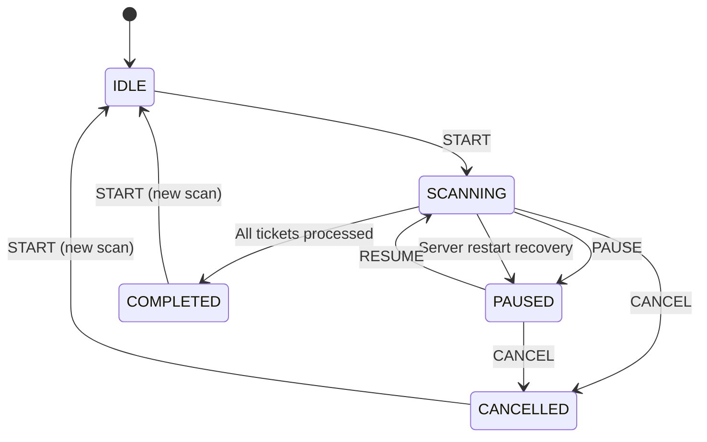
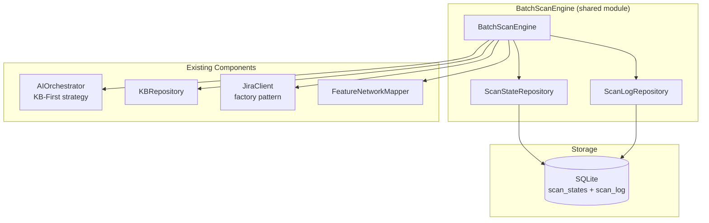
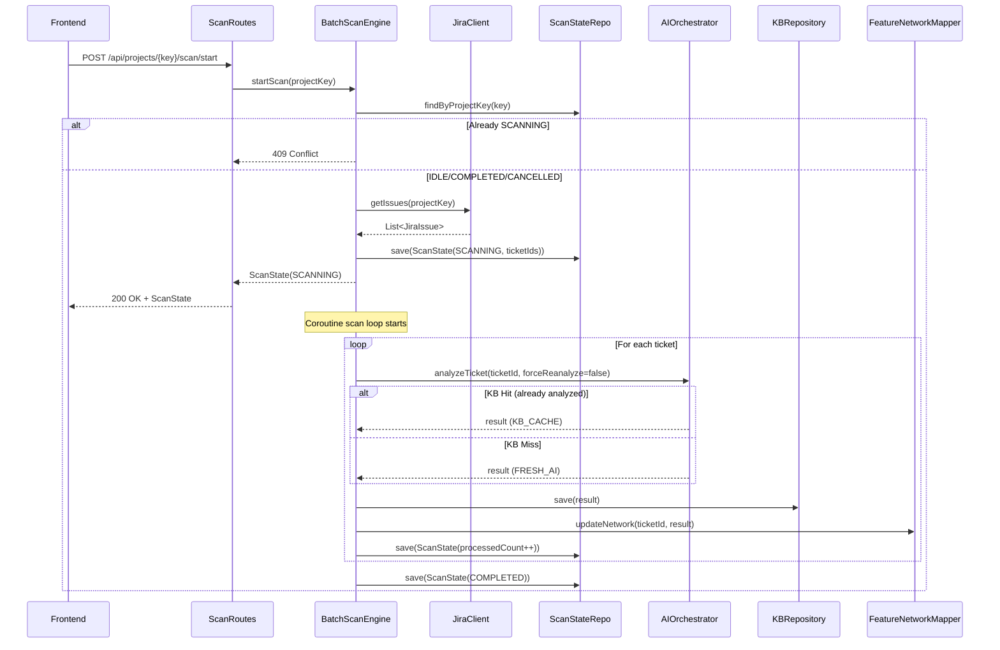
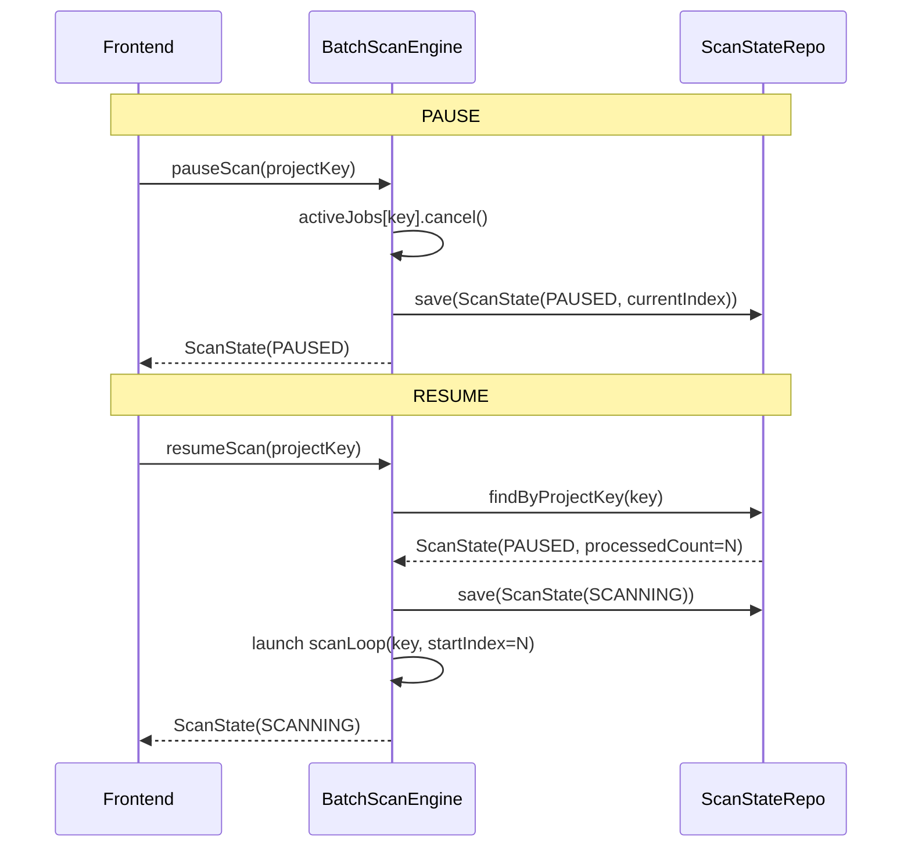
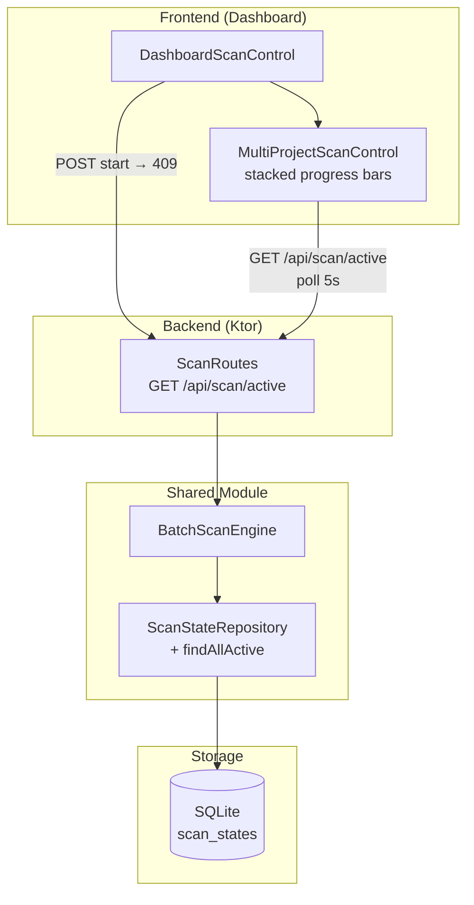
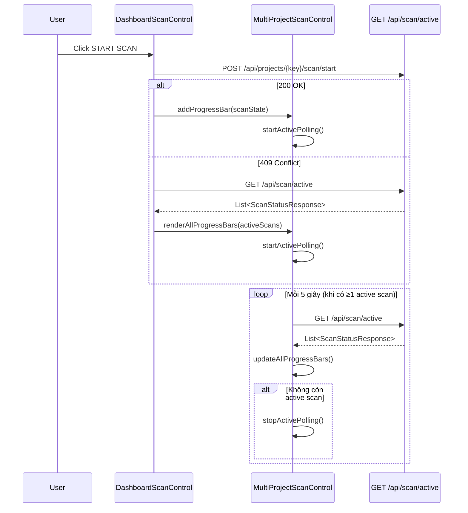
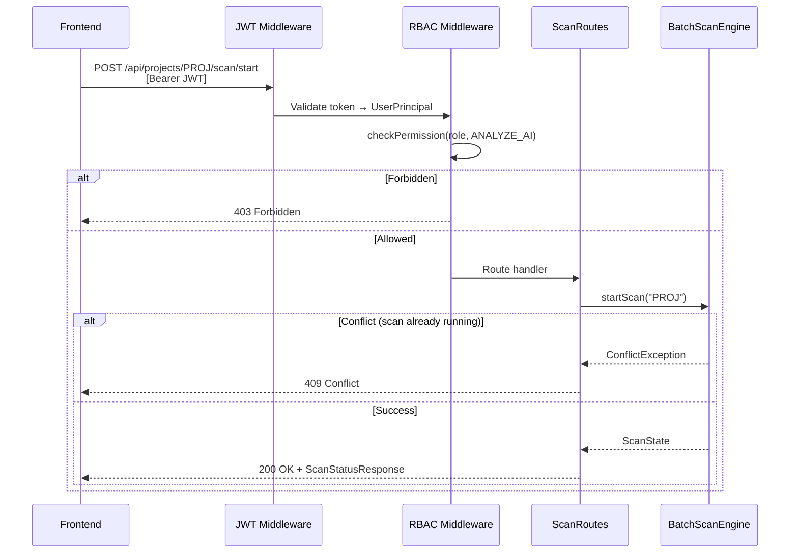
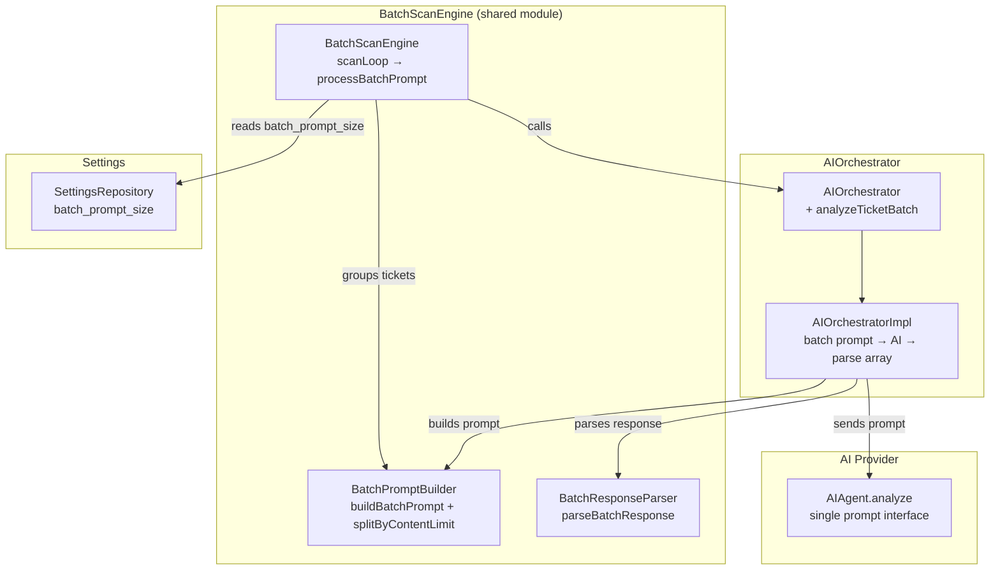
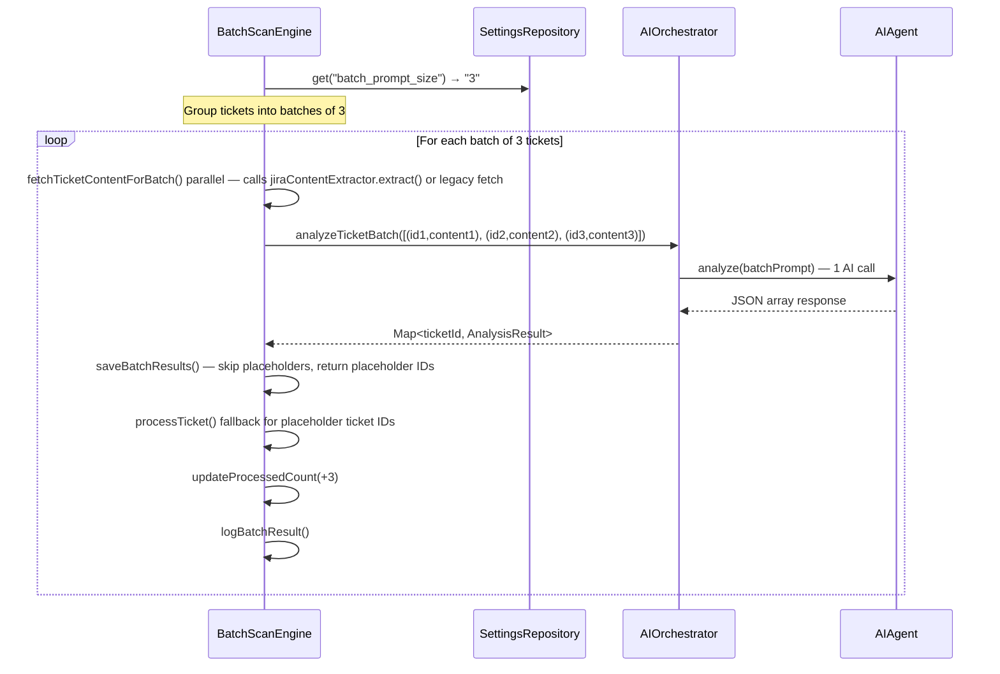

# Batch Scan Engine — Design

# Batch Scan Engine — Thiết kế Chi tiết

## Tổng quan

Batch Scan Engine là thành phần backend trong shared module, chịu trách nhiệm điều phối quá trình quét hàng loạt ticket trong một dự án Jira. Engine sử dụng coroutine-based orchestration, quản lý trạng thái quét per-project qua state machine, và tích hợp với `AIOrchestrator` (KB-First strategy) và `KBRepository` để lưu kết quả phân tích.

## State Machine



Trạng thái hợp lệ:
- **IDLE**: Chưa có scan nào hoặc scan trước đã reset
- **SCANNING**: Đang quét tuần tự từng ticket
- **PAUSED**: Tạm dừng, lưu vị trí hiện tại để RESUME
- **COMPLETED**: Đã quét xong toàn bộ ticket
- **CANCELLED**: Đã hủy, giữ lại kết quả đã phân tích

## Kiến trúc



## Interface & Class Signatures

### ScanStatus Enum

```kotlin
// shared/.../scan/ScanStatus.kt
@Serializable
enum class ScanStatus {
    IDLE, SCANNING, PAUSED, COMPLETED, CANCELLED
}
```

### ScanState Data Class

```kotlin
// shared/.../scan/ScanState.kt
@Serializable
data class ScanState(
    val projectKey: String,
    val status: ScanStatus,
    val totalTickets: Int,
    val processedCount: Int,
    val currentTicketId: String?,
    val ticketIds: List<String>,       // Toàn bộ ticket IDs cần quét
    val startedAt: String,             // ISO-8601
    val updatedAt: String              // ISO-8601
) {
    val progressPercent: Int
        get() = if (totalTickets > 0) ((processedCount.toDouble() / totalTickets) * 100).toInt() else 0
}
```

### ScanLogEntry Data Class

```kotlin
// shared/.../scan/ScanLogEntry.kt
@Serializable
data class ScanLogEntry(
    val id: Long = 0,
    val projectKey: String,
    val ticketId: String,
    val status: ScanLogStatus,         // COMPLETED, FAILED
    val message: String,
    val timestamp: String              // ISO-8601
)

@Serializable
enum class ScanLogStatus {
    ANALYZING, COMPLETED, FAILED
}
```

### ScanStateRepository Interface

```kotlin
// shared/.../scan/ScanStateRepository.kt
interface ScanStateRepository {
    suspend fun findByProjectKey(projectKey: String): ScanState?
    suspend fun save(state: ScanState): Boolean
    suspend fun delete(projectKey: String): Boolean
}
```

### ScanLogRepository Interface

```kotlin
// shared/.../scan/ScanLogRepository.kt
interface ScanLogRepository {
    suspend fun addEntry(entry: ScanLogEntry): Boolean
    suspend fun getByProjectKey(projectKey: String, limit: Int = 50): List<ScanLogEntry>
    suspend fun deleteByProjectKey(projectKey: String): Boolean
}
```

### BatchScanEngine Class

```kotlin
// shared/.../scan/BatchScanEngine.kt
class BatchScanEngine(
    private val aiOrchestrator: AIOrchestrator,
    private val kbRepository: KBRepository,
    private val jiraClientProvider: () -> JiraClient,
    private val featureNetworkMapper: FeatureNetworkMapper,
    private val scanStateRepository: ScanStateRepository,
    private val scanLogRepository: ScanLogRepository,
    // ... callback params (onScanComplete, onKBRecordSaved) ...
    /** Settings repository for reading batch_prompt_size. Req: AC 34 */
    internal val settingsRepository: SettingsRepository? = null,
    /** Deep Analysis content extractor — used by fetchTicketContentForBatch() for batch mode, and internally by analyzeTicket() for single-ticket mode. Req: 21.3 */
    internal val jiraContentExtractor: JiraContentExtractor? = null
) {
    // Active scan jobs per project — max 1 concurrent scan per project
    private val activeJobs = ConcurrentHashMap<String, Job>()

    /**
     * Start a new scan for the given project.
     * @throws ConflictException if a scan is already running for this project
     */
    suspend fun startScan(projectKey: String): ScanState

    /**
     * Pause an active scan. Saves current position to DB.
     */
    suspend fun pauseScan(projectKey: String): ScanState

    /**
     * Resume a paused scan from the last saved position.
     */
    suspend fun resumeScan(projectKey: String): ScanState

    /**
     * Cancel an active or paused scan. Keeps analyzed results.
     */
    suspend fun cancelScan(projectKey: String): ScanState

    /**
     * Get current scan status for a project.
     */
    suspend fun getStatus(projectKey: String): ScanState

    /**
     * Get scan log entries for a project.
     */
    suspend fun getLog(projectKey: String, limit: Int = 50): List<ScanLogEntry>

    /**
     * Recovery on server restart: transition SCANNING → PAUSED.
     * Called during application startup.
     */
    suspend fun recoverOnStartup()

    // --- Internal ---

    /**
     * Core scan loop: iterates through ticket list starting from offset.
     * Runs in a coroutine, checks for cancellation between tickets.
     * When batch_prompt_size > 1, uses processBatchPrompt() for multi-ticket
     * AI calls; otherwise uses processBatchParallel() for single-ticket mode.
     */
    private suspend fun scanLoop(projectKey: String, startIndex: Int)

    /**
     * Process a single ticket: call AIOrchestrator.analyzeTicket(),
     * update KB, update FeatureNetworkMapper, log result.
     * Phase 1: Content fetch (parallel, no semaphore) — for batch mode,
     *   fetchTicketContentForBatch() calls jiraContentExtractor.extract() when available,
     *   falls back to fetchLegacyBatchContent() on error or when extractor is null.
     *   For single-ticket mode, analyzeTicket() calls extractor internally.
     * Phase 2: AI analysis (semaphore-limited)
     * Phase 3: Relationships + attachments (parallel via coroutineScope)
     * On error: log failure, skip ticket, continue.
     */
    private suspend fun processTicket(projectKey: String, ticketId: String): Boolean
}
```

## Luồng xử lý chi tiết

### START Scan



### PAUSE / RESUME Flow



## Concurrency Control

- `ConcurrentHashMap<String, Job>` lưu coroutine Job cho mỗi project đang scan
- Trước khi start: kiểm tra `activeJobs[projectKey]?.isActive` → nếu true, trả 409 Conflict
- Pause: `activeJobs[projectKey]?.cancel()` → coroutine kiểm tra `isActive` giữa mỗi ticket
- Cancel: tương tự Pause nhưng set status = CANCELLED
- Max 1 scan per project, nhiều project có thể scan đồng thời

## KB-First Strategy trong Batch Scan

Engine sử dụng cùng chiến lược KB-First của `AIOrchestrator`:
- Gọi `analyzeTicket(ticketId, forceReanalyze=false)` → AIOrchestrator tự kiểm tra KB trước
- Ticket đã có trong KB → trả về ngay (KB_CACHE), không gọi AI
- Ticket chưa có → gọi AI agent, lưu vào KB
- Kết quả: scan nhanh hơn cho các ticket đã phân tích trước đó

## Error Handling

| Tình huống | Hành vi |
|---|---|
| Ticket phân tích lỗi (AI timeout, parse error) | Log FAILED vào scan_log, skip ticket, tiếp tục ticket tiếp theo |
| JiraClient lỗi khi lấy danh sách ticket | Trả về error 502, không tạo scan |
| DB write lỗi khi lưu ScanState | Retry 3 lần (pattern từ KBRepositoryImpl), log error |
| Server restart khi đang SCANNING | `recoverOnStartup()` chuyển SCANNING → PAUSED |
| Start scan khi đã có scan đang chạy | Trả về 409 Conflict |

## Server Restart Recovery

Khi server khởi động, `BatchScanEngine.recoverOnStartup()` được gọi:

```kotlin
suspend fun recoverOnStartup() {
    // Query all scan_states with status = 'SCANNING'
    // Update each to PAUSED
    // User can manually RESUME later
}
```

Đăng ký trong Koin module hoặc Application startup:

```kotlin
// ServerModule.kt hoặc Application.module()
val batchScanEngine = get<BatchScanEngine>()
runBlocking { batchScanEngine.recoverOnStartup() }
```

*(Validates: Req 18.1–18.6, 18.13–18.17)*

---

## Multi-Project Scan Visibility

### Tổng quan

Mở rộng Batch Scan Engine để hỗ trợ hiển thị tiến trình quét đồng thời nhiều project. Backend cung cấp endpoint tổng hợp `GET /api/scan/active`, frontend hiển thị stacked progress bars và xử lý graceful 409 Conflict.

### Kiến trúc



### Backend: `GET /api/scan/active` Endpoint

Endpoint mới nằm ngoài route `/api/projects/{key}/scan` vì nó trả về data cross-project.

```kotlin
// server/.../routes/ScanRoutes.kt — thêm vào scanRoutes()
route("/api/scan") {
    withPermission(Permission.VIEW_ANALYSIS) {  // Reader+
        get("/active") {
            val activeScans = batchScanEngine.getActiveScans()
            call.respond(HttpStatusCode.OK, activeScans.map { it.toResponse() })
        }
    }
}
```

**Response format:**

```kotlin
// Response: List<ScanStatusResponse>
// Mỗi entry chứa: projectKey, status, totalTickets, processedCount, progressPercent
// Chỉ trả về projects có status = SCANNING
```

### Backend: `ScanStateRepository.findAllActive()`

Thêm method mới vào interface và implementation. Tái sử dụng `findAllScanning()` đã có — rename hoặc alias.

```kotlin
// shared/.../scan/ScanStateRepository.kt
interface ScanStateRepository {
    // ... existing methods ...
    suspend fun findAllScanning(): List<ScanState>  // ĐÃ CÓ — dùng cho cả recovery và active scans
}
```

`findAllScanning()` đã tồn tại trong codebase (dùng cho `recoverOnStartup()`). Endpoint `GET /api/scan/active` sẽ gọi trực tiếp method này qua `BatchScanEngine`.

### Backend: `BatchScanEngine.getActiveScans()`

```kotlin
// shared/.../scan/BatchScanEngine.kt — thêm method mới
/**
 * Get all projects with active (SCANNING) scans.
 * Used by GET /api/scan/active endpoint.
 */
suspend fun getActiveScans(): List<ScanState> {
    return scanStateRepository.findAllScanning()
}
```

### Frontend: Multi-Project Progress Bar Architecture



### Frontend: Stacked Progress Bars Layout

Thêm container `#multi-scan-progress` vào `dashboard.html` bên trong scan control panel:

```html
<!-- Trong scan-control-panel, sau progress bar hiện tại -->
<div id="multi-scan-progress" style="display: none; margin-top: 12px;">
    <!-- Dynamic: mỗi active scan 1 progress bar -->
    <!-- Template per scan:
    <div class="scan-progress-item" data-project="{KEY}">
        <div class="scan-progress-item-label">
            [{PROJECT_KEY}] Scanning... {processed}/{total} — {percent}%
        </div>
        <div class="neural-loader" style="height: 4px;">
            <div class="neural-progress" style="width: {percent}%;"></div>
        </div>
    </div>
    -->
</div>
```

### Frontend: `DashboardMultiScanProgress.kt`

File mới tách biệt logic multi-project scan (tuân thủ SRP, ≤200 dòng):

```kotlin
// frontend/.../pages/dashboard/DashboardMultiScanProgress.kt
internal object DashboardMultiScanProgress {
    private var activePollingJob: Job? = null

    /** Render stacked progress bars cho tất cả active scans */
    fun renderActiveScans(scans: List<ScanStatusResponse>)

    /** Start polling GET /api/scan/active mỗi 5s */
    fun startActivePolling()

    /** Stop polling khi không còn active scan */
    fun stopActivePolling()

    /** Format label: "[{KEY}] Scanning... {processed}/{total} — {percent}%" */
    fun formatProgressLabel(scan: ScanStatusResponse): String
}
```

### Frontend: 409 Conflict Graceful Handling

Cập nhật `DashboardScanControl.scanAction("start")`:

```kotlin
// Trong scanAction("start"):
val response = ApiClient.post("/api/projects/$projectKey/scan/start")
when (response.status.value) {
    200 -> {
        val status = json.decodeFromString<ScanStatusResponse>(body)
        updateScanUI(status)
        DashboardMultiScanProgress.startActivePolling()
    }
    409 -> {
        // Seamless UX: fetch active scans và hiển thị progress
        val activeResponse = ApiClient.get("/api/scan/active")
        val activeScans = json.decodeFromString<List<ScanStatusResponse>>(activeBody)
        DashboardMultiScanProgress.renderActiveScans(activeScans)
        DashboardMultiScanProgress.startActivePolling()
        // KHÔNG hiển thị error — user thấy progress bar ngay lập tức
    }
}
```

### Polling Strategy

| Aspect | Giá trị |
|--------|---------|
| Endpoint | `GET /api/scan/active` |
| Interval | 5 giây |
| Start condition | ≥1 active scan (sau start thành công hoặc 409) |
| Stop condition | Response trả về empty list (không còn SCANNING) |
| Scope | `DashboardPage.scope` — auto-cancel khi navigate away |
| Cleanup | `DashboardPage.cleanup()` gọi `DashboardMultiScanProgress.stopActivePolling()` |

### Tương tác với Polling hiện tại

Hiện tại `DashboardScanControl` poll `GET /api/projects/{key}/scan/status` mỗi 3s cho project hiện tại. Với multi-project:

- **Single-project polling (3s)**: Giữ nguyên cho scan controls (PAUSE/RESUME/CANCEL) của project hiện tại
- **Multi-project polling (5s)**: Thêm mới cho stacked progress bars — hiển thị tất cả active scans
- Khi project hiện tại đang scan: cả 2 polling chạy song song (không conflict vì update DOM elements khác nhau)

## Correctness Properties

*A property is a characteristic or behavior that should hold true across all valid executions of a system — essentially, a formal statement about what the system should do. Properties serve as the bridge between human-readable specifications and machine-verifiable correctness guarantees.*

### Property 1: Active scans filter chỉ trả về SCANNING states

*For any* tập hợp ScanState objects với các status khác nhau (IDLE, SCANNING, PAUSED, COMPLETED, CANCELLED) được lưu trong repository, `findAllScanning()` SHALL chỉ trả về các ScanState có status = SCANNING, và mỗi entry trong kết quả phải chứa đầy đủ: projectKey, status, totalTickets, processedCount, progressPercent.

**Validates: Requirements 18.18**

### Property 2: Progress label format chứa đầy đủ thông tin

*For any* ScanStatusResponse với projectKey không rỗng, processedCount ≥ 0, totalTickets > 0, và progressPercent trong [0, 100], `formatProgressLabel()` SHALL trả về string chứa projectKey, processedCount, totalTickets, và progressPercent theo format "[{PROJECT_KEY}] Scanning... {processed}/{total} — {percent}%".

**Validates: Requirements 18.19**

## Error Handling (Multi-Project Scan Visibility)

| Tình huống | Hành vi |
|---|---|
| `GET /api/scan/active` trả lỗi 500 | Frontend log error, giữ progress bars hiện tại, retry ở poll tiếp theo |
| `POST start` trả 409 Conflict | Frontend fetch active scans, hiển thị progress bar seamlessly |
| Polling response trả empty list | Stop polling, ẩn multi-scan container |
| Network error khi polling | Log error, tiếp tục polling (không stop) — retry ở interval tiếp theo |
| JWT expired khi polling | `handleUnauthorized()` redirect về login, stop polling |

## Testing Strategy (Multi-Project Scan Visibility)

### Unit Tests (Example-based)
- `GET /api/scan/active` trả về đúng format khi có 0, 1, 3 active scans
- 409 Conflict handler: verify frontend gọi `GET /api/scan/active` thay vì hiển thị error
- Polling start/stop: verify polling bắt đầu khi có active scans, dừng khi empty

### Property Tests
- **Property 1**: `findAllScanning()` filter — fast-check với random ScanState sets, min 100 iterations
  - Tag: **Feature: multi-project-scan-visibility, Property 1: Active scans filter chỉ trả về SCANNING states**
- **Property 2**: `formatProgressLabel()` format — fast-check với random ScanStatusResponse, min 100 iterations
  - Tag: **Feature: multi-project-scan-visibility, Property 2: Progress label format chứa đầy đủ thông tin**

### E2E Tests
- API test: `GET /api/scan/active` với JWT Reader+ → 200, không JWT → 401
- UI test: Stacked progress bars hiển thị khi nhiều scans active

*(Validates: Req 18.18–18.22)*

---

# Scan API Routes — Thiết kế Chi tiết

## Tổng quan

Thiết kế các REST API endpoints cho Batch Scan Engine, bao gồm request/response DTOs, RBAC, và error handling.

## Route Table

| Method | Endpoint | Mô tả | RBAC |
|---|---|---|---|
| `POST` | `/api/projects/{key}/scan/start` | Khởi động quét hàng loạt | Administrator, Neural_Architect |
| `POST` | `/api/projects/{key}/scan/pause` | Tạm dừng quét | Administrator, Neural_Architect |
| `POST` | `/api/projects/{key}/scan/resume` | Tiếp tục quét đã tạm dừng | Administrator, Neural_Architect |
| `POST` | `/api/projects/{key}/scan/cancel` | Hủy bỏ quét | Administrator, Neural_Architect |
| `GET` | `/api/projects/{key}/scan/status` | Truy vấn trạng thái quét | Reader+ |
| `GET` | `/api/projects/{key}/scan/log` | Truy vấn log chi tiết | Reader+ |

## Sequence Diagram



## Request/Response DTOs

### ScanStatusResponse

```kotlin
@Serializable
data class ScanStatusResponse(
    val projectKey: String,
    val status: ScanStatus,            // IDLE, SCANNING, PAUSED, COMPLETED, CANCELLED
    val totalTickets: Int,
    val processedCount: Int,
    val progressPercent: Int,
    val currentTicketId: String?,
    val startedAt: String?,
    val updatedAt: String?,
    val recentLog: List<ScanLogEntryResponse> = emptyList()  // Last 50 entries (for status endpoint)
)
```

### ScanLogEntryResponse

```kotlin
@Serializable
data class ScanLogEntryResponse(
    val ticketId: String,
    val status: String,                // COMPLETED, FAILED
    val message: String,
    val timestamp: String
)
```

### ScanLogResponse

```kotlin
@Serializable
data class ScanLogResponse(
    val projectKey: String,
    val entries: List<ScanLogEntryResponse>,
    val totalEntries: Int
)
```

### Error Response (reuse existing)

```kotlin
@Serializable
data class ErrorResponse(val error: String)
```

## Route Implementation

```kotlin
// server/.../routes/ScanRoutes.kt
fun Routing.scanRoutes() {
    val batchScanEngine by inject<BatchScanEngine>()

    route("/api/projects/{key}/scan") {
        // START — requires ANALYZE_AI permission (Neural_Architect+)
        withPermission(Permission.ANALYZE_AI) {
            post("/start") {
                val projectKey = call.parameters["key"]
                    ?: return@post call.respond(HttpStatusCode.BadRequest, ErrorResponse("project key is required"))
                try {
                    val state = batchScanEngine.startScan(projectKey)
                    call.respond(HttpStatusCode.OK, state.toResponse())
                } catch (e: ConflictException) {
                    call.respond(HttpStatusCode.Conflict, ErrorResponse(e.message ?: "Scan already running"))
                }
            }

            post("/pause") {
                val projectKey = call.parameters["key"]
                    ?: return@post call.respond(HttpStatusCode.BadRequest, ErrorResponse("project key is required"))
                val state = batchScanEngine.pauseScan(projectKey)
                call.respond(HttpStatusCode.OK, state.toResponse())
            }

            post("/resume") {
                val projectKey = call.parameters["key"]
                    ?: return@post call.respond(HttpStatusCode.BadRequest, ErrorResponse("project key is required"))
                val state = batchScanEngine.resumeScan(projectKey)
                call.respond(HttpStatusCode.OK, state.toResponse())
            }

            post("/cancel") {
                val projectKey = call.parameters["key"]
                    ?: return@post call.respond(HttpStatusCode.BadRequest, ErrorResponse("project key is required"))
                val state = batchScanEngine.cancelScan(projectKey)
                call.respond(HttpStatusCode.OK, state.toResponse())
            }
        }

        // STATUS & LOG — requires VIEW_ANALYSIS permission (Reader+)
        withPermission(Permission.VIEW_ANALYSIS) {
            get("/status") {
                val projectKey = call.parameters["key"]
                    ?: return@get call.respond(HttpStatusCode.BadRequest, ErrorResponse("project key is required"))
                val state = batchScanEngine.getStatus(projectKey)
                val recentLog = batchScanEngine.getLog(projectKey, limit = 50)
                call.respond(HttpStatusCode.OK, state.toResponse(recentLog))
            }

            get("/log") {
                val projectKey = call.parameters["key"]
                    ?: return@get call.respond(HttpStatusCode.BadRequest, ErrorResponse("project key is required"))
                val limit = call.request.queryParameters["limit"]?.toIntOrNull() ?: 50
                val entries = batchScanEngine.getLog(projectKey, limit)
                call.respond(HttpStatusCode.OK, ScanLogResponse(
                    projectKey = projectKey,
                    entries = entries.map { it.toResponse() },
                    totalEntries = entries.size
                ))
            }
        }
    }
}

// Extension functions for DTO mapping
private fun ScanState.toResponse(recentLog: List<ScanLogEntry> = emptyList()) = ScanStatusResponse(
    projectKey = projectKey,
    status = status,
    totalTickets = totalTickets,
    processedCount = processedCount,
    progressPercent = progressPercent,
    currentTicketId = currentTicketId,
    startedAt = startedAt,
    updatedAt = updatedAt,
    recentLog = recentLog.map { it.toResponse() }
)

private fun ScanLogEntry.toResponse() = ScanLogEntryResponse(
    ticketId = ticketId,
    status = status.name,
    message = message,
    timestamp = timestamp
)
```

## RBAC Mapping

| Permission | Roles | Endpoints |
|---|---|---|
| `ANALYZE_AI` | Administrator, Neural_Architect | start, pause, resume, cancel |
| `VIEW_ANALYSIS` | Administrator, Neural_Architect, Reader | status, log |

Sử dụng `withPermission()` middleware đã có trong `AnalysisRoutes.kt`.

## Error Handling

| HTTP Status | Tình huống |
|---|---|
| 200 | Thao tác thành công |
| 400 | Thiếu project key |
| 401 | JWT missing/expired |
| 403 | Không đủ quyền RBAC |
| 404 | Project không tồn tại hoặc chưa có scan state |
| 409 | Đã có scan đang chạy cho project này |
| 502 | Lỗi kết nối Jira khi lấy danh sách ticket |

## Koin Registration

```kotlin
// ServerModule.kt — thêm vào serverModule()
single<ScanStateRepository> { ScanStateRepositoryImpl(get()) }
single<ScanLogRepository> { ScanLogRepositoryImpl(get()) }
single { BatchScanEngine(get(), get(), { get<JiraClient>() }, get(), get(), get()) }
```

## Route Registration

```kotlin
// Application.kt — thêm vào configureRouting()
routing {
    // ... existing routes
    scanRoutes()
}
```

*(Validates: Req 18.7–18.12, 18.15)*


---

# Batch Prompt Optimization — Thiết kế Chi tiết

## Tổng quan

Batch Prompt Optimization gộp nhiều ticket vào 1 AI prompt duy nhất thay vì gửi từng ticket riêng lẻ. Với 1308 tickets và batch size 3, hệ thống giảm từ 1308 xuống ~436 AI calls → giảm ~66% thời gian scan. Batch size cấu hình qua `batch_prompt_size` trong app_settings (mặc định 3, phạm vi 1–10+).

## Kiến trúc



## Components and Interfaces

### AIOrchestrator — New Batch Method

```kotlin
// shared/.../ai/AIOrchestrator.kt — thêm method mới
interface AIOrchestrator {
    // ... existing methods ...

    /**
     * Analyze multiple tickets in a single AI prompt.
     * Returns map of ticketId → AnalysisResult.
     * Falls back to single-ticket mode on parse failure.
     */
    suspend fun analyzeTicketBatch(
        tickets: List<Pair<String, String>>,
        forceReanalyze: Boolean = false
    ): Map<String, AnalysisResult>
}
```

### BatchPromptBuilder (new file, shared module)

```kotlin
// shared/.../ai/BatchPromptBuilder.kt
object BatchPromptBuilder {
    const val MAX_PROMPT_CHARS = 12000
    const val TICKET_SEPARATOR = "--- TICKET {index} ---"

    /** Build a single prompt containing multiple tickets. */
    fun buildBatchPrompt(tickets: List<Pair<String, String>>, isRetry: Boolean = false): String

    /** Split tickets into sub-batches respecting MAX_PROMPT_CHARS. */
    fun splitByContentLimit(tickets: List<Pair<String, String>>): List<List<Pair<String, String>>>
}
```

### BatchResponseParser (new file, shared module)

```kotlin
// shared/.../ai/BatchResponseParser.kt
object BatchResponseParser {
    /** Parse AI JSON array response into map of ticketId → AnalysisResult. */
    fun parseBatchResponse(
        response: String,
        expectedTicketIds: List<String>
    ): Map<String, AnalysisResult>?
}
```

### AIOrchestratorImpl — Batch Implementation

```kotlin
// shared/.../ai/AIOrchestratorImpl.kt — thêm implementation
override suspend fun analyzeTicketBatch(
    tickets: List<Pair<String, String>>,
    forceReanalyze: Boolean
): Map<String, AnalysisResult> {
    // 1. Filter out KB-cached tickets (unless forceReanalyze)
    // 2. Split remaining into sub-batches by content limit
    // 3. For each sub-batch: build prompt → send to AI → parse response
    // 4. On parse failure: retry once → fallback to single-ticket
    // 5. Return combined results
}
```

### BatchScanEngine — Integration

Thay đổi `scanLoop()` flow:



### Settings Page — Batch Prompt Size Combobox

Thêm combobox vào scan control panel trong `dashboard.html`:

```html
<!-- Trong scan-control-panel, cạnh scan-concurrency -->
<input type="text" id="scan-batch-prompt-size" title="Tickets per AI prompt (1–20)"
       value="3" list="batch-prompt-options" autocomplete="off"
       style="background:rgba(12,14,22,0.95);border:1px solid var(--glass-border);
              border-radius:6px;color:var(--primary);padding:8px 10px;
              font-size:11px;font-family:'JetBrains Mono',monospace;
              width:72px;text-align:center;" />
<datalist id="batch-prompt-options">
    <option value="1">×1</option>
    <option value="2">×2</option>
    <option value="3">×3</option>
    <option value="5">×5</option>
    <option value="8">×8</option>
    <option value="10">×10</option>
</datalist>
```

## Data Models

### BatchAnalysisRequest (internal, not serialized)

```kotlin
data class BatchAnalysisRequest(
    val tickets: List<Pair<String, String>>,  // (ticketId, ticketContent)
    val batchIndex: Int,
    val totalBatches: Int
)
```

### Batch Prompt Format

```
Analyze the following Jira tickets. Return a JSON array with one object per ticket.

--- TICKET 1 ---
Ticket ID: PROJ-1
Summary: Fix login bug
Description: Users cannot login...

--- TICKET 2 ---
Ticket ID: PROJ-2
Summary: Add search feature
Description: Implement full-text search...

--- TICKET 3 ---
Ticket ID: PROJ-3
Summary: Update dashboard
Description: Refresh dashboard layout...

Return ONLY a valid JSON array:
[
  { "ticketId": "PROJ-1", "requirementSummary": {...}, "evolution": [...], "complexity": {...} },
  { "ticketId": "PROJ-2", ... },
  { "ticketId": "PROJ-3", ... }
]
```

### Batch Response Format

```json
[
  {
    "ticketId": "PROJ-1",
    "requirementSummary": { "unified": "...", "affectedModules": [...] },
    "evolution": [...],
    "complexity": { "scrumPoints": 5.0, "description": "...", "kbReferences": [...] }
  },
  { "ticketId": "PROJ-2", ... }
]
```

## Correctness Properties

*A property is a characteristic or behavior that should hold true across all valid executions of a system — essentially, a formal statement about what the system should do. Properties serve as the bridge between human-readable specifications and machine-verifiable correctness guarantees.*

### Property 1: Batch prompt size validation always returns valid value

*For any* integer value (including negatives, zero, and large numbers), the `getBatchPromptSize()` function SHALL return a value >= 1. When the stored value is missing or < 1, it SHALL return the default value 3.

**Validates: Requirements 34, 49**

### Property 2: Batch prompt contains all tickets with correct separators

*For any* non-empty list of (ticketId, ticketContent) pairs, `buildBatchPrompt()` SHALL produce a prompt string that contains every ticketId, every non-empty ticketContent, and exactly `N-1` separator markers for N tickets.

**Validates: Requirements 37**

### Property 3: Batch splitting respects content length limit

*For any* list of tickets with varying content lengths, `splitByContentLimit()` SHALL produce sub-batches where each sub-batch's total content length (all ticket contents combined) does not exceed 12000 characters, and the union of all sub-batches equals the original list.

**Validates: Requirements 39**

### Property 4: Batch response parsing returns complete results

*For any* valid JSON array response containing N ticket results matching N expected ticket IDs, `parseBatchResponse()` SHALL return exactly N AnalysisResult entries, each with the correct ticketId. For responses with fewer results than expected, the missing ticket IDs SHALL be identifiable for single-ticket fallback.

**Validates: Requirements 40, 42**

### Property 5: Progress updates by batch granularity

*For any* batch size B and total ticket count T, after processing each batch the processedCount SHALL increment by exactly the batch size (or remaining tickets for the last batch), never by 1 within a batch.

**Validates: Requirements 44**

### Property 6: Batch log message contains all ticket IDs

*For any* completed batch of tickets, the scan log entry SHALL contain all ticket IDs from that batch, the correct count, and a valid source value (FRESH_AI or MIXED).

**Validates: Requirements 45**

## Error Handling

| Tình huống | Hành vi |
|---|---|
| batch_prompt_size < 1 hoặc missing | Sử dụng giá trị mặc định 3 |
| batch_prompt_size = 1 | Fallback về single-ticket mode (gọi analyzeTicket) |
| Tổng content vượt 12000 chars | Tự động giảm batch size cho batch đó |
| AI response không parse được JSON array | Retry 1 lần → fallback single-ticket cho toàn batch |
| AI response thiếu kết quả cho một số ticket | Fallback single-ticket cho các ticket bị thiếu |
| AI response chứa placeholder results (`"..."`, `"Placeholder"`, < 10 chars) | Skip lưu KB, fallback single-ticket cho tickets bị ảnh hưởng (Req 21.7) |
| Provider không hỗ trợ batch format | Log warning, fallback single-ticket, ghi cảnh báo |
| Settings API nhận batch_prompt_size < 1 | Trả 400 Bad Request |
| Frontend nhập giá trị < 1 | Hiển thị validation error, không gửi request |

## Testing Strategy

### Unit Tests (Example-based)
- batch_prompt_size = 1 → single-ticket mode (AC 36)
- Settings update mid-scan → next batch uses new size (AC 35)
- Invalid JSON response → retry once → fallback (AC 41)
- Provider returns non-array → fallback + warning log (AC 47)
- Settings page combobox renders with suggested values (AC 48)
- Concurrent scan count validation >= 1 (AC 50)

### Property Tests (Kotest property-based, min 100 iterations)
- **Property 1**: `getBatchPromptSize()` validation — random integers, always returns >= 1
  - Tag: **Feature: batch-prompt-optimization, Property 1: Batch prompt size validation always returns valid value**
- **Property 2**: `buildBatchPrompt()` construction — random ticket lists, all IDs and separators present
  - Tag: **Feature: batch-prompt-optimization, Property 2: Batch prompt contains all tickets with correct separators**
- **Property 3**: `splitByContentLimit()` — random content lengths, each sub-batch <= 12000 chars
  - Tag: **Feature: batch-prompt-optimization, Property 3: Batch splitting respects content length limit**
- **Property 4**: `parseBatchResponse()` — random valid JSON arrays, correct result count and IDs
  - Tag: **Feature: batch-prompt-optimization, Property 4: Batch response parsing returns complete results**
- **Property 5**: Progress update granularity — random batch sizes and ticket counts
  - Tag: **Feature: batch-prompt-optimization, Property 5: Progress updates by batch granularity**
- **Property 6**: Batch log message format — random ticket ID lists
  - Tag: **Feature: batch-prompt-optimization, Property 6: Batch log message contains all ticket IDs**

### E2E Tests
- API test: `PUT /api/settings/feature` with `batch_prompt_size` — valid and invalid values
- UI test: Batch prompt size combobox in dashboard scan control panel

*(Validates: Req 34–50)*

---

## Liên kết Spec

> **Deep Analysis Enhancement (spec `ticket-intelligence`, phần Deep Analysis)**: Nâng cấp pipeline `AIOrchestrator.analyzeTicket()` mà `BatchScanEngine.processTicket()` và `analyzeTicketBatch()` đang sử dụng:
> - `fetchTicketContentForBatch()` gọi `jiraContentExtractor.extract()` trực tiếp cho batch mode, chuyển đổi `StructuredTicketContent` → plain text qua `formatStructuredContent()` (capped 3000 chars). Fallback sang `fetchLegacyBatchContent()` khi extractor null hoặc throw. *(Cập nhật bởi bugfix `batch-scan-placeholder-analysis`)*
> - `saveBatchResults()` detect placeholder results (`"..."`, `"Placeholder"`, < 10 chars) và fallback sang single-ticket mode cho tickets bị ảnh hưởng *(Thêm bởi bugfix `batch-scan-placeholder-analysis`)*
> - `buildAnalysisPrompt()` → thay bằng `Deep_Analysis_Prompt_Builder` (6 khía cạnh phân tích)
> - `AnalysisResult`/`KBRecord` mở rộng data model
> - `BatchScanEngine.processTicket()` không cần thay đổi — vẫn gọi `analyzeTicket()` như cũ
