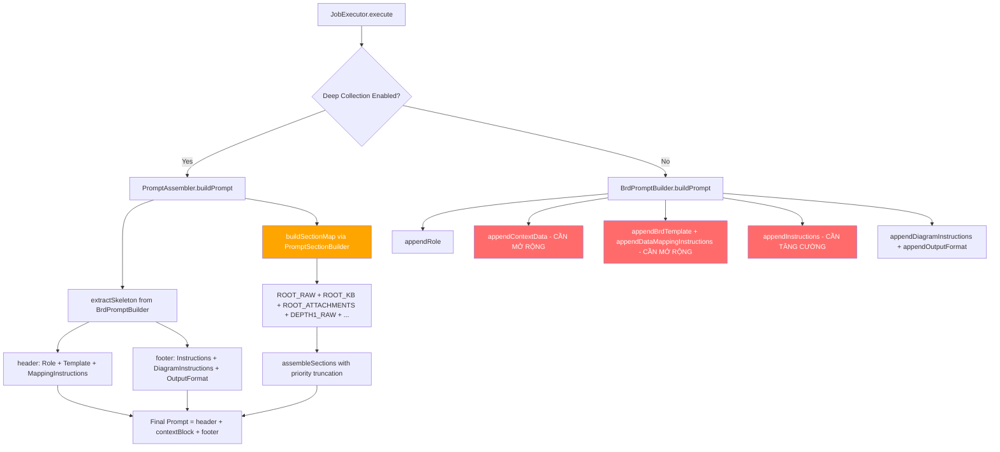
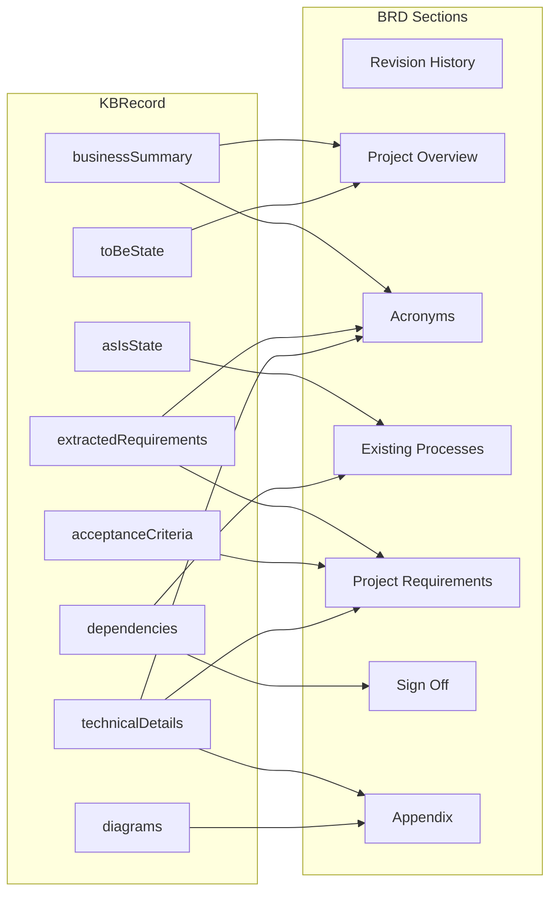

# BRD Insufficient Data Fix — Design Document

## Overview

Document này mô tả thiết kế kỹ thuật để sửa lỗi BRD sinh ra với nhiều sections hiển thị "⚠️ Insufficient data" mặc dù `EnrichedContext` chứa đầy đủ dữ liệu. Vấn đề gốc rễ nằm ở 5 tầng:

1. **Data serialization không đầy đủ**: `BrdPromptSections.appendMainTicketData()` và `appendLinkedTicketsData()` bỏ sót nhiều trường quan trọng từ `KBRecord` (technicalDetails, diagrams, affectedModules, comments).
2. **Data mapping instructions thiếu**: `BrdPromptMappingInstructions` chỉ map 4/7 BRD sections — thiếu Revision History, Acronyms, Sign Off.
3. **PromptSectionBuilder thiếu KBRecord fields**: `buildRootKb()` và `buildRootRaw()` không include technicalDetails, diagrams, status, priority.
4. **Prompt budget quá nhỏ**: 100K chars không đủ cho 36 tickets + comments + attachments → truncation cắt bỏ dữ liệu quan trọng.
5. **AI instructions yếu**: Không có hướng dẫn rõ ràng để AI tận dụng tối đa dữ liệu trước khi đánh dấu "Insufficient data".
6. **Agent pipeline dùng sai BRD template**: `MasterPromptSections.kt` (agent pipeline path) sử dụng 6 generic sections (Executive Summary, Business Objectives, Stakeholders, Requirements, Acceptance Criteria, Appendix) thay vì 7 Carleton ITS sections. `BrdResponseParser` parse theo Carleton ITS headings → không match → tất cả sections fallback "Insufficient data". Fix: `MasterPromptSections.buildBrdTemplate()` giờ dùng `BrdPromptBuilder.BRD_SECTIONS` làm single source of truth, và `BrdPromptBuilder.BRD_SECTIONS/SUB_SECTIONS/DEEP_SUB_SECTIONS` cùng `appendDataMappingInstructions()` đã được đổi từ `internal` sang `public` để agent pipeline có thể truy cập.

### Chiến lược giải quyết

Sửa đồng thời cả 2 prompt paths (Basic và Enriched) để đảm bảo AI nhận được đầy đủ dữ liệu bất kể configuration:

- **Basic Prompt Path**: `BrdPromptSections` → `BrdPromptBuilder.buildPrompt()`
- **Enriched Prompt Path**: `PromptSectionBuilder` → `PromptAssembler.buildPrompt()`
- **Agent Pipeline Path**: `MasterPromptSections` → `MasterPromptBuilder.buildPrompt()` (uses `BrdPromptBuilder.BRD_SECTIONS` as single source of truth)



## Architecture

### Tổng quan thay đổi

Thiết kế tuân thủ kiến trúc hiện tại — không thay đổi flow hay tạo component mới. Chỉ mở rộng nội dung serialize trong các component đã có:

| Layer | Component | Thay đổi |
|-------|-----------|----------|
| Shared | `BrdPromptSections.kt` | Mở rộng `appendMainTicketData()`, `appendLinkedTicketsData()` |
| Shared | `BrdPromptMappingInstructions.kt` | Thêm mapping cho 3 sections còn thiếu, mở rộng 4 sections hiện có; đổi `appendDataMappingInstructions()` từ `internal` sang `public` |
| Shared | `BrdPromptBuilder.kt` | Đổi `BRD_SECTIONS`, `BRD_SUB_SECTIONS`, `BRD_DEEP_SUB_SECTIONS` từ `internal` sang `public` để agent pipeline truy cập |
| Server | `PromptSectionBuilder.kt` | Mở rộng `buildRootKb()`, `buildRootRaw()` |
| Server | `PromptSectionHelpers.kt` | Mở rộng `appendKbFields()`, `appendTicketRaw()` |
| Server | `PromptAssemblyLogic.kt` | Cải thiện truncation annotation |
| Server | `JobExecutor.kt` | Tăng prompt budget parameter |
| Server | `MasterPromptSections.kt` | Fix BRD template dùng `BrdPromptBuilder.BRD_SECTIONS` (single source of truth); enhanced role instruction và output format cho BRD |
| Server | `JobExecutor.kt` | Tăng prompt budget parameter |

### Nguyên tắc thiết kế

1. **Backward compatible**: Tất cả thay đổi là additive — không xóa hay thay đổi behavior hiện có
2. **Graceful degradation**: Trường rỗng được skip (không serialize empty strings)
3. **Dual-path consistency**: Cả Basic và Enriched path đều serialize cùng bộ KBRecord fields
4. **Budget-aware**: Skeleton (role, template, instructions, mapping) KHÔNG bị truncate

## Components and Interfaces

### Component 1: BrdPromptSections — Mở rộng Data Serialization (Req 1, 2, 6)

**File**: `shared/src/commonMain/kotlin/com/assistant/document/BrdPromptSections.kt`

#### 1a. Mở rộng `appendMainTicketData(ticket: KBRecord)`

Hiện tại chỉ serialize 6 trường. Cần thêm:

```kotlin
// THÊM MỚI sau appendAcceptanceCriteria(ticket):
appendTechnicalDetails(ticket.technicalDetails)
appendDiagrams(ticket.diagrams)
appendLine("Requirement Summary: ${ticket.requirementSummary}")
```

#### 1b. Tạo helper functions mới (tách file riêng để giữ ≤200 dòng)

**File mới**: `shared/src/commonMain/kotlin/com/assistant/document/BrdPromptSectionsTechnical.kt`

```kotlin
/** Serialize technicalDetails fields từ KBRecord. */
internal fun StringBuilder.appendTechnicalDetails(details: TechnicalDetails) {
    appendApiSpecifications(details.apiSpecifications)
    appendDatabaseChanges(details.databaseChanges)
    appendExternalIntegrations(details.externalIntegrations)
}

/** Serialize API specifications. */
private fun StringBuilder.appendApiSpecifications(specs: List<ApiSpecification>) {
    if (specs.isEmpty()) return
    appendLine("API Specifications:")
    specs.forEach { spec ->
        appendLine("  - ${spec.method} ${spec.path}: ${spec.description}")
    }
}

/** Serialize database changes. */
private fun StringBuilder.appendDatabaseChanges(changes: List<DatabaseChange>) {
    if (changes.isEmpty()) return
    appendLine("Database Changes:")
    changes.forEach { change ->
        appendLine("  - ${change.operationType} ${change.tableName}: ${change.description}")
    }
}

/** Serialize external integrations. */
private fun StringBuilder.appendExternalIntegrations(integrations: List<ExternalIntegration>) {
    if (integrations.isEmpty()) return
    appendLine("External Integrations:")
    integrations.forEach { integration ->
        appendLine("  - ${integration.serviceName} (${integration.protocol}): ${integration.description}")
    }
}

/** Serialize diagrams. */
internal fun StringBuilder.appendDiagrams(diagrams: List<DiagramData>) {
    if (diagrams.isEmpty()) return
    appendLine("Diagrams:")
    diagrams.forEach { diagram ->
        appendLine("  - [${diagram.type}] ${diagram.title}")
    }
}
```

#### 1c. Mở rộng `appendLinkedTicketsData(linked: List<KBRecord>)`

Thêm các trường còn thiếu cho mỗi linked ticket:

```kotlin
internal fun StringBuilder.appendLinkedTicketsData(linked: List<KBRecord>) {
    if (linked.isEmpty()) return
    appendLine("--- Linked Tickets (${linked.size}) ---")
    linked.forEach { ticket ->
        appendLine("Ticket: ${ticket.ticketId}")
        appendLine("  Summary: ${ticket.businessSummary}")
        // THÊM MỚI:
        if (ticket.asIsState.isNotBlank()) appendLine("  As-Is State: ${ticket.asIsState}")
        if (ticket.toBeState.isNotBlank()) appendLine("  To-Be State: ${ticket.toBeState}")
        appendRequirements(ticket)
        appendDependencies(ticket)
        appendAcceptanceCriteria(ticket)
        // THÊM MỚI:
        appendTechnicalDetails(ticket.technicalDetails)
    }
}
```

#### 1d. Thêm fallback logic khi linkedTicketAnalyses rỗng (Req 2.2, 7.1)

Mở rộng `appendContextData()` để detect `EnrichedContext` và fallback:

```kotlin
internal fun StringBuilder.appendContextData(context: GenerationContext) {
    appendLine("=== CONTEXT ===")
    appendMainTicketData(context.mainTicket)
    appendLinkedTicketsData(context.linkedTicketAnalyses)
    // THÊM MỚI: Fallback khi linkedTicketAnalyses rỗng
    if (context.linkedTicketAnalyses.isEmpty() && context is EnrichedContext) {
        appendFallbackLinkedTickets(context)
    }
    appendAttachmentData(context.attachmentChunks)
    appendSprintData(context)
    // THÊM MỚI: Include comments từ EnrichedContext
    if (context is EnrichedContext) {
        appendEnrichedComments(context)
    }
    appendLine()
}
```

**File mới**: `shared/src/commonMain/kotlin/com/assistant/document/BrdPromptSectionsFallback.kt`

```kotlin
/** Fallback: serialize raw ticket data từ allTickets khi linkedTicketAnalyses rỗng. */
internal fun StringBuilder.appendFallbackLinkedTickets(context: EnrichedContext) {
    val nonRootTickets = context.allTickets.filter { 
        it.summary.isNotBlank() // skip empty tickets
    }.drop(1) // skip root ticket (first in allTickets)
    if (nonRootTickets.isEmpty()) return
    appendLine("--- Linked Tickets (Raw Data, ${nonRootTickets.size}) ---")
    nonRootTickets.forEach { ticket ->
        appendLine("[Note: Ticket chưa có deep analysis — sử dụng raw Jira data.]")
        appendLine("  Summary: ${ticket.summary}")
        if (ticket.description.isNotBlank()) appendLine("  Description: ${ticket.description.take(500)}")
        appendLine("  Status: ${ticket.status}, Priority: ${ticket.priority}")
    }
}

/** Include comments từ EnrichedContext rawComments. */
internal fun StringBuilder.appendEnrichedComments(context: EnrichedContext) {
    if (context.rawComments.isEmpty()) return
    appendLine("--- Comments from All Tickets ---")
    context.rawComments.forEach { (ticketId, comments) ->
        if (comments.isEmpty()) return@forEach
        appendLine("Comments for $ticketId (${comments.size}):")
        comments.forEach { comment ->
            appendLine("  [Comment by ${comment.author} on ${comment.createdDate} for $ticketId]: ${comment.body}")
        }
    }
}
```

#### 1e. Tăng cường Section Completion Instructions (Req 6)

Mở rộng `appendSectionCompletionRules()` trong `BrdPromptSections.kt`:

```kotlin
private fun StringBuilder.appendSectionCompletionRules() {
    appendLine("- NEVER leave a section empty. Provide analysis from available context.")
    appendLine("- Mark assumptions clearly with [ASSUMPTION] tag for stakeholder confirmation.")
    // THÊM MỚI (Req 6.1):
    appendLine("- Trước khi đánh dấu một section là 'Insufficient data', hãy kiểm tra TẤT CẢ nguồn dữ liệu: main ticket analysis, linked ticket data, comments, attachment content, và technical details.")
    appendLine("- Chỉ đánh dấu 'Insufficient data' khi KHÔNG CÓ bất kỳ dữ liệu nào liên quan trong toàn bộ CONTEXT.")
    // THÊM MỚI (Req 6.2):
    appendLine("- Nếu dữ liệu trực tiếp không có, hãy suy luận từ dữ liệu gián tiếp. Ví dụ: Revision History từ ticket metadata; Acronyms từ technical terms; Sign Off từ stakeholders trong dependencies.")
    // THÊM MỚI (Req 6.3):
    appendLine("- Mỗi section PHẢI có ít nhất 3 dòng nội dung thực tế. Nếu dữ liệu hạn chế, phân tích và mở rộng từ dữ liệu có sẵn, đánh dấu phần suy luận bằng [INFERRED] tag.")
    // THÊM MỚI (Req 6.4):
    appendLine("- Sử dụng comments từ linked tickets như nguồn dữ liệu bổ sung — comments chứa thảo luận về requirements, pain points, technical decisions, và stakeholder feedback.")
    appendLine("- \"⚠️ Insufficient data\" là ONLY a last resort khi absolutely no context exists.")
}
```

### Component 2: BrdPromptMappingInstructions — Mở rộng cho 7 Sections (Req 3)

**File**: `shared/src/commonMain/kotlin/com/assistant/document/BrdPromptMappingInstructions.kt`

#### Thêm 3 mapping functions mới + mở rộng 4 functions hiện có:

```kotlin
internal fun StringBuilder.appendDataMappingInstructions() {
    appendLine("=== DATA MAPPING ===")
    appendRevisionHistoryMapping()       // MỚI (Req 3.1)
    appendProjectOverviewMapping()       // MỞ RỘNG (Req 3.4)
    appendAcronymsMapping()              // MỚI (Req 3.2)
    appendExistingProcessesMapping()     // MỞ RỘNG (Req 3.5)
    appendProjectRequirementsMapping()   // MỞ RỘNG (Req 3.6)
    appendSignOffMapping()               // MỚI (Req 3.3)
    appendAppendixMapping()              // MỞ RỘNG (Req 3.7)
    appendLine()
}
```

**Mapping mới cho Revision History (Req 3.1)**:
```kotlin
private fun StringBuilder.appendRevisionHistoryMapping() {
    appendLine("Section 'Revision History':")
    appendLine("  USE: ticketId → Document identifier")
    appendLine("  USE: generated timestamp → Revision date")
    appendLine("  USE: source ticket IDs → Scope of analysis")
    appendLine("  USE: sprintMetadata → Sprint context (nếu có)")
    appendLine("  RULE: Tạo bảng revision history với Version, Date, Author, Description")
}
```

**Mapping mới cho Acronyms (Req 3.2)**:
```kotlin
private fun StringBuilder.appendAcronymsMapping() {
    appendLine("Section 'Common Project Acronyms, Names, and Descriptions':")
    appendLine("  USE: technicalDetails → Trích xuất thuật ngữ kỹ thuật (API names, protocols)")
    appendLine("  USE: extractedRequirements → Trích xuất viết tắt và tên hệ thống")
    appendLine("  USE: businessSummary → Trích xuất domain-specific terms")
    appendLine("  USE: attachment content → Trích xuất thuật ngữ từ documents")
    appendLine("  RULE: Tạo bảng Acronym, Full Name, Description cho mỗi thuật ngữ")
}
```

**Mapping mới cho Sign Off (Req 3.3)**:
```kotlin
private fun StringBuilder.appendSignOffMapping() {
    appendLine("Section 'Sign Off':")
    appendLine("  USE: dependencies.blockingIssues → Stakeholders cần approve")
    appendLine("  USE: linked ticket assignees → Project contributors cần sign off")
    appendLine("  USE: sprintMetadata → Timeline context")
    appendLine("  RULE: Tạo bảng Role, Name, Signature, Date cho mỗi stakeholder")
}
```

**Mở rộng Project Overview (Req 3.4)** — thêm:
```kotlin
appendLine("  USE: toBeState → In Scope (Deliverables) — target state deliverables")
appendLine("  USE: dependencies.externalDependencies + technicalDetails → Out of Scope boundaries")
appendLine("  USE: linked ticket assignees → Project Contributors")
```

**Mở rộng Existing Processes (Req 3.5)** — thêm:
```kotlin
appendLine("  USE: rawComments → Thảo luận về current pain points cho Problems sub-section")
appendLine("  USE: attachment content (screenshots, process docs) → Screenshots sub-section")
```

**Mở rộng Project Requirements (Req 3.6)** — thêm:
```kotlin
appendLine("  USE: technicalDetails.apiSpecifications → Functional Requirements (API-related)")
appendLine("  USE: technicalDetails.databaseChanges → Data Requirements")
appendLine("  USE: linked ticket acceptanceCriteria → Cross-ticket requirements consolidation")
```

**Mở rộng Appendix (Req 3.7)** — thêm:
```kotlin
appendLine("  USE: diagrams → Mock-ups section (Mermaid/draw.io diagrams)")
appendLine("  USE: technicalDetails → Business Rules and Procedures")
appendLine("  USE: all source ticket IDs → Document References")
```

### Component 3: PromptSectionBuilder + Helpers — Mở rộng Enriched Path (Req 4, 7)

**File**: `server/src/jvmMain/kotlin/com/assistant/server/document/prompt/PromptSectionHelpers.kt`

#### 3a. Mở rộng `appendKbFields(kb: KBRecord)` (Req 4.1)

```kotlin
internal fun StringBuilder.appendKbFields(kb: KBRecord) {
    appendLine("Business Summary: ${kb.businessSummary}")
    if (kb.asIsState.isNotBlank()) appendLine("As-Is State: ${kb.asIsState}")
    if (kb.toBeState.isNotBlank()) appendLine("To-Be State: ${kb.toBeState}")
    if (kb.extractedRequirements.isNotEmpty()) {
        appendLine("Extracted Requirements:")
        kb.extractedRequirements.forEach { appendLine("  - $it") }
    }
    if (kb.acceptanceCriteria.isNotEmpty()) {
        appendLine("Acceptance Criteria:")
        kb.acceptanceCriteria.forEach {
            appendLine("  - ${it.id}: ${it.description} (testability: ${it.testabilityAssessment})")
        }
    }
    // THÊM MỚI (Req 4.1):
    appendKbDependencies(kb)
    appendKbTechnicalDetails(kb)
    appendKbDiagrams(kb)
}
```

**Tạo helper functions mới** (có thể tách file nếu vượt 200 dòng):

```kotlin
/** Serialize dependencies từ KBRecord cho enriched path. */
internal fun StringBuilder.appendKbDependencies(kb: KBRecord) {
    val deps = kb.dependencies
    if (deps.blockingIssues.isEmpty() && deps.relatedIssues.isEmpty() 
        && deps.externalDependencies.isEmpty()) return
    appendLine("Dependencies:")
    deps.blockingIssues.forEach { appendLine("  - [BLOCKING] ${it.key}: ${it.summary}") }
    deps.relatedIssues.forEach { appendLine("  - [RELATED] ${it.key}: ${it.summary}") }
    deps.externalDependencies.forEach { appendLine("  - [EXTERNAL] $it") }
}

/** Serialize technicalDetails từ KBRecord cho enriched path. */
internal fun StringBuilder.appendKbTechnicalDetails(kb: KBRecord) {
    val td = kb.technicalDetails
    if (td.apiSpecifications.isEmpty() && td.databaseChanges.isEmpty() 
        && td.externalIntegrations.isEmpty()) return
    appendLine("Technical Details:")
    td.apiSpecifications.forEach { appendLine("  - API: ${it.method} ${it.path} — ${it.description}") }
    td.databaseChanges.forEach { appendLine("  - DB: ${it.operationType} ${it.tableName} — ${it.description}") }
    td.externalIntegrations.forEach { appendLine("  - Integration: ${it.serviceName} (${it.protocol}) — ${it.description}") }
}

/** Serialize diagrams từ KBRecord cho enriched path. */
internal fun StringBuilder.appendKbDiagrams(kb: KBRecord) {
    if (kb.diagrams.isEmpty()) return
    appendLine("Diagrams:")
    kb.diagrams.forEach { appendLine("  - [${it.type}] ${it.title}") }
}
```

#### 3b. Mở rộng `appendTicketRaw()` (Req 4.2, 4.3)

```kotlin
internal fun StringBuilder.appendTicketRaw(ticketId: String, context: EnrichedContext) {
    val kb = findKbForTicket(ticketId, context)
    val raw = findRawTicket(ticketId, context) // MỚI: lookup StructuredTicketContent
    appendLine("Ticket: $ticketId")
    if (kb != null) {
        appendLine("  Summary: ${kb.businessSummary}")
        if (kb.extractedRequirements.isNotEmpty()) {
            kb.extractedRequirements.forEach { appendLine("  - $it") }
        }
    } else if (raw != null) {
        // THÊM MỚI (Req 7.1, 7.4): Fallback to raw data
        appendLine("  [Note: Ticket $ticketId chưa có deep analysis — sử dụng raw Jira data.]")
        appendLine("  Summary: ${raw.summary}")
        if (raw.description.isNotBlank()) appendLine("  Description: ${raw.description.take(500)}")
    }
    // THÊM MỚI (Req 4.2, 4.3): Include metadata từ StructuredTicketContent
    if (raw != null) {
        if (raw.status.isNotBlank()) appendLine("  Status: ${raw.status}")
        if (raw.priority.isNotBlank()) appendLine("  Priority: ${raw.priority}")
        if (raw.labels.isNotEmpty()) appendLine("  Labels: ${raw.labels.joinToString()}")
        if (raw.components.isNotEmpty()) appendLine("  Components: ${raw.components.joinToString()}")
    }
    // THÊM MỚI (Req 4.3): Include relationship type
    appendRelationshipType(ticketId, context)
    appendComments(ticketId, context)
}

/** Lookup StructuredTicketContent từ allTickets. */
internal fun findRawTicket(ticketId: String, context: EnrichedContext): StructuredTicketContent? =
    context.allTickets.find { it.summary.isNotBlank() } // match by position or ticketId
    // NOTE: cần thêm ticketId field vào StructuredTicketContent hoặc dùng ticketDepthMap

/** Append relationship type giữa ticket và root. */
internal fun StringBuilder.appendRelationshipType(ticketId: String, context: EnrichedContext) {
    val edge = context.ticketRelationships.find { 
        it.targetId == ticketId || it.sourceId == ticketId 
    } ?: return
    val desc = if (edge.linkDescription.isNotBlank()) edge.linkDescription else edge.relationshipType.name
    appendLine("  Relationship: $desc")
}
```

### Component 4: PromptAssemblyLogic — Cải thiện Truncation (Req 5)

**File**: `server/src/jvmMain/kotlin/com/assistant/server/document/prompt/PromptAssemblyLogic.kt`

#### 4a. Cải thiện truncation annotation (Req 5.3)

```kotlin
/** Build truncation annotation với thông tin chi tiết. */
private fun buildAnnotation(
    removedTickets: Int, 
    removedChunks: Int,
    keptFullTickets: Int = 0,
    keptSummaryTickets: Int = 0,
    originalSize: Int = 0,
    budget: Int = 0
): String {
    if (removedTickets == 0 && removedChunks == 0) return ""
    return "\n[TRUNCATED: Giữ lại $keptFullTickets tickets đầy đủ, " +
        "$keptSummaryTickets tickets chỉ summary, " +
        "cắt $removedTickets tickets và $removedChunks attachment chunks. " +
        "Tổng data gốc: $originalSize chars, budget: $budget chars]\n"
}
```

#### 4b. Đảm bảo skeleton không bị truncate (Req 5.4)

Skeleton (header + footer) đã được tách riêng trong `PromptAssembler.buildPrompt()` — budget chỉ áp dụng cho context block. Thiết kế hiện tại đã đảm bảo điều này:

```kotlin
// PromptAssembler.buildPrompt() — skeleton KHÔNG nằm trong budget
val budget = maxPromptChars - skeleton.headerSize - skeleton.footerSize
val contextBlock = buildContextBlock(context, budget.coerceAtLeast(0), docType)
return skeleton.header + contextBlock + skeleton.footer
```

→ Không cần thay đổi logic, chỉ cần verify bằng test.

### Component 5: JobExecutor — Tăng Prompt Budget (Req 5.1)

**File**: `server/src/jvmMain/kotlin/com/assistant/server/jobs/JobExecutor.kt`

```kotlin
private fun buildDocPrompt(docType: String, ctx: GenerationContext): String {
    if (ctx is EnrichedContext && aggregator is FeatureFlagAggregator) {
        val deepEnabled = runBlocking { aggregator.isDeepCollectionEnabled() }
        if (deepEnabled) {
            // THAY ĐỔI: Tăng budget từ 100_000 lên 200_000
            val budget = 200_000
            return PromptAssembler.buildPrompt(ctx, budget, docType)
        }
    }
    return when (docType) {
        "BRD" -> BrdPromptBuilder.buildPrompt(ctx)
        "FSD" -> FsdPromptBuilder.buildPrompt(ctx)
        else -> error("Unsupported: $docType")
    }
}
```

> **Rationale**: Gemini models hỗ trợ 1M+ token context window. 200K chars ≈ 50K tokens — vẫn rất nhỏ so với capacity. Tăng budget giúp giữ lại nhiều dữ liệu hơn cho AI.

## Data Models

### Không tạo model mới

Thiết kế này KHÔNG tạo data model mới. Tất cả models đã tồn tại:

| Model | Package | Vai trò |
|-------|---------|---------|
| `KBRecord` | `com.assistant.kb` | Chứa deep analysis fields: technicalDetails, diagrams, dependencies, acceptanceCriteria |
| `TechnicalDetails` | `com.assistant.ai.deepanalysis.models` | apiSpecifications, databaseChanges, externalIntegrations |
| `DiagramData` | `com.assistant.ai.deepanalysis.models` | type, title, mermaidCode, format |
| `DependencyInfo` | `com.assistant.ai.deepanalysis.models` | blockingIssues, relatedIssues, externalDependencies |
| `AcceptanceCriterion` | `com.assistant.ai.deepanalysis.models` | id, description, testabilityAssessment |
| `EnrichedContext` | `com.assistant.server.document.models` | allTickets, rawComments, allAttachmentChunks, ticketDepthMap |
| `StructuredTicketContent` | `com.assistant.ai.deepanalysis.models` | Raw Jira data: summary, description, status, priority, labels, components |
| `FullComment` | `com.assistant.server.document.models` | author, createdDate, body |

### Data Flow Diagram



## Correctness Properties

*A property is a characteristic or behavior that should hold true across all valid executions of a system — essentially, a formal statement about what the system should do. Properties serve as the bridge between human-readable specifications and machine-verifiable correctness guarantees.*

### Property 1: KBRecord serialization completeness — Main ticket

*For any* KBRecord với các trường không rỗng (technicalDetails.apiSpecifications, technicalDetails.databaseChanges, technicalDetails.externalIntegrations, diagrams, businessSummary, asIsState, toBeState, extractedRequirements, acceptanceCriteria, dependencies), khi serialize qua `appendMainTicketData()` hoặc `appendKbFields()`, output string PHẢI chứa nội dung của TẤT CẢ các trường không rỗng đó.

**Validates: Requirements 1.1, 1.2, 1.3, 1.4, 1.5, 4.1**

### Property 2: Linked ticket serialization completeness

*For any* danh sách KBRecords không rỗng, khi serialize qua `appendLinkedTicketsData()`, output string PHẢI chứa cho mỗi ticket: businessSummary, asIsState (nếu không rỗng), toBeState (nếu không rỗng), extractedRequirements (nếu không rỗng), acceptanceCriteria (nếu không rỗng), dependencies (nếu không rỗng), và technicalDetails (nếu không rỗng).

**Validates: Requirements 2.1**

### Property 3: Fallback to raw ticket data khi linkedTicketAnalyses rỗng

*For any* EnrichedContext với linkedTicketAnalyses rỗng nhưng allTickets chứa nhiều hơn 1 ticket, khi serialize context data, output string PHẢI chứa summary và status từ raw ticket data của các tickets không phải root.

**Validates: Requirements 2.2, 7.1**

### Property 4: Comments inclusion cho tất cả tickets

*For any* EnrichedContext với rawComments chứa comments cho N tickets (N ≥ 1), khi serialize context data, output string PHẢI chứa comment body từ TẤT CẢ N tickets (không chỉ root ticket).

**Validates: Requirements 2.3, 7.2**

### Property 5: Root raw data includes StructuredTicketContent metadata

*For any* EnrichedContext với root ticket có trong allTickets với status và priority không rỗng, khi `buildRootRaw()` serialize root ticket, output string PHẢI chứa status và priority values.

**Validates: Requirements 4.2**

### Property 6: Depth-1 tickets include expanded fields

*For any* EnrichedContext với ít nhất 1 ticket ở depth 1 có status, priority, và comments, khi `buildTicketsRaw(context, 1)` serialize, output string PHẢI chứa status, priority, và comment content cho ticket đó.

**Validates: Requirements 4.3**

### Property 7: Truncation preserves priority ordering

*For any* tập hợp sections với tổng kích thước vượt budget, khi `assembleSections()` áp dụng truncation, TẤT CẢ sections có priority cao hơn section bị cắt đầu tiên PHẢI được giữ nguyên 100% trong output.

**Validates: Requirements 5.2**

### Property 8: Truncation annotation chứa thông tin chi tiết

*For any* truncation scenario (removedTickets > 0 hoặc removedChunks > 0), truncation annotation trong output PHẢI chứa số lượng tickets bị cắt và số lượng chunks bị cắt.

**Validates: Requirements 5.3**

### Property 9: Skeleton sections không bao giờ bị truncate

*For any* prompt budget (kể cả budget rất nhỏ), output từ `PromptAssembler.buildPrompt()` PHẢI luôn chứa: Role section, BRD Template section, Data Mapping Instructions, và Instructions section.

**Validates: Requirements 5.4**

### Property 10: Attachment inclusion từ tất cả tickets

*For any* EnrichedContext với allAttachmentChunks chứa N chunks (N ≥ 1), khi budget đủ, output từ prompt assembly PHẢI chứa content từ TẤT CẢ N attachment chunks.

**Validates: Requirements 7.3**

### Property 11: Fallback annotation cho tickets chưa analyze

*For any* ticket trong allTickets mà KHÔNG có KBRecord tương ứng trong linkedTicketAnalyses, khi serialize ticket đó, output PHẢI chứa annotation "[Note: Ticket ... chưa có deep analysis — sử dụng raw Jira data.]".

**Validates: Requirements 7.4**

## Error Handling

### Graceful Degradation cho Empty Fields

Tất cả serialize functions PHẢI skip trường rỗng thay vì serialize empty string:

```kotlin
// Pattern áp dụng cho mọi optional field:
if (field.isNotBlank()) appendLine("Field: $field")
if (list.isNotEmpty()) { appendLine("List:"); list.forEach { ... } }
```

### Fallback Chain

Khi dữ liệu không đầy đủ, hệ thống áp dụng fallback chain:

1. **KBRecord fields** (deep analysis) → ưu tiên cao nhất
2. **StructuredTicketContent** (raw Jira data) → fallback khi KBRecord không có
3. **rawComments** → bổ sung context từ discussions
4. **allAttachmentChunks** → bổ sung context từ documents

### Truncation Safety

- Skeleton (role, template, mapping, instructions) KHÔNG BAO GIỜ bị truncate
- Context block bị truncate từ priority thấp nhất (DEEPER_ATTACHMENTS → DEEPER_TICKETS → ...)
- Truncation annotation luôn được thêm khi có content bị cắt

### Import Safety

Khi `BrdPromptSections.kt` (shared module) cần access `EnrichedContext` (server module), sử dụng runtime type check:

```kotlin
if (context is EnrichedContext) { ... }
```

> **Lưu ý quan trọng**: `EnrichedContext` nằm trong server module, nhưng `BrdPromptSections` nằm trong shared module. Cần kiểm tra dependency direction. Nếu shared không thể import server, fallback logic phải được implement trong server module (ví dụ: trong `PromptAssembler` hoặc `JobExecutor`).

**Giải pháp**: Tạo interface `EnrichedContextProvider` trong shared module, implement trong server module. Hoặc đơn giản hơn: thực hiện fallback logic trong `PromptSectionBuilder` (server module) thay vì `BrdPromptSections` (shared module).

## Testing Strategy

### Unit Tests (Example-based)

| Test | File | Validates |
|------|------|-----------|
| `appendMainTicketData` includes technicalDetails | `BrdPromptSectionsTest.kt` | Req 1.1-1.5 |
| `appendLinkedTicketsData` includes expanded fields | `BrdPromptSectionsTest.kt` | Req 2.1 |
| `appendDataMappingInstructions` covers all 7 sections | `BrdPromptMappingInstructionsTest.kt` | Req 3.1-3.7 |
| `appendSectionCompletionRules` includes new instructions | `BrdPromptSectionsTest.kt` | Req 6.1-6.4 |
| Budget = 200K for enriched path | `JobExecutorTest.kt` | Req 5.1 |

### Property-Based Tests (Kotest + Arb)

Sử dụng **Kotest Property Testing** (đã có trong project) với minimum **100 iterations** mỗi property.

| Property | Test File | Tag |
|----------|-----------|-----|
| Property 1: KBRecord serialization completeness | `BrdPromptSerializationPropertyTest.kt` | Feature: brd-insufficient-data-fix, Property 1 |
| Property 2: Linked ticket serialization | `BrdPromptSerializationPropertyTest.kt` | Feature: brd-insufficient-data-fix, Property 2 |
| Property 3: Fallback to raw data | `BrdPromptFallbackPropertyTest.kt` | Feature: brd-insufficient-data-fix, Property 3 |
| Property 4: Comments inclusion | `BrdPromptFallbackPropertyTest.kt` | Feature: brd-insufficient-data-fix, Property 4 |
| Property 5: Root raw metadata | `PromptSectionBuilderPropertyTest.kt` | Feature: brd-insufficient-data-fix, Property 5 |
| Property 6: Depth-1 expanded fields | `PromptSectionBuilderPropertyTest.kt` | Feature: brd-insufficient-data-fix, Property 6 |
| Property 7: Truncation priority | `PromptAssemblyPropertyTest.kt` | Feature: brd-insufficient-data-fix, Property 7 |
| Property 8: Truncation annotation | `PromptAssemblyPropertyTest.kt` | Feature: brd-insufficient-data-fix, Property 8 |
| Property 9: Skeleton preservation | `PromptAssemblyPropertyTest.kt` | Feature: brd-insufficient-data-fix, Property 9 |
| Property 10: Attachment inclusion | `PromptSectionBuilderPropertyTest.kt` | Feature: brd-insufficient-data-fix, Property 10 |
| Property 11: Fallback annotation | `PromptSectionBuilderPropertyTest.kt` | Feature: brd-insufficient-data-fix, Property 11 |

### Integration Tests

| Test | Validates |
|------|-----------|
| Full prompt generation với EnrichedContext chứa 5+ tickets → prompt chứa data cho tất cả 7 BRD sections | Req 8.1-8.8 |
| Prompt generation với empty linkedTicketAnalyses nhưng populated allTickets → fallback data present | Req 7.1, 2.2 |
| Prompt generation với budget nhỏ → skeleton preserved, context truncated | Req 5.4 |

### Generator Strategy cho Property Tests

```kotlin
// Arb cho KBRecord với random non-empty fields
fun arbKBRecord(): Arb<KBRecord> = arbitrary {
    KBRecord(
        ticketId = Arb.string(5..10).bind(),
        requirementSummary = Arb.string(10..100).bind(),
        businessSummary = Arb.string(10..200).bind(),
        asIsState = Arb.string(0..200).bind(),
        toBeState = Arb.string(0..200).bind(),
        extractedRequirements = Arb.list(Arb.string(5..50), 0..5).bind(),
        technicalDetails = arbTechnicalDetails().bind(),
        diagrams = Arb.list(arbDiagramData(), 0..3).bind(),
        // ... other fields with defaults
    )
}

// Arb cho TechnicalDetails
fun arbTechnicalDetails(): Arb<TechnicalDetails> = arbitrary {
    TechnicalDetails(
        apiSpecifications = Arb.list(arbApiSpec(), 0..3).bind(),
        databaseChanges = Arb.list(arbDbChange(), 0..3).bind(),
        externalIntegrations = Arb.list(arbExtIntegration(), 0..2).bind()
    )
}
```
