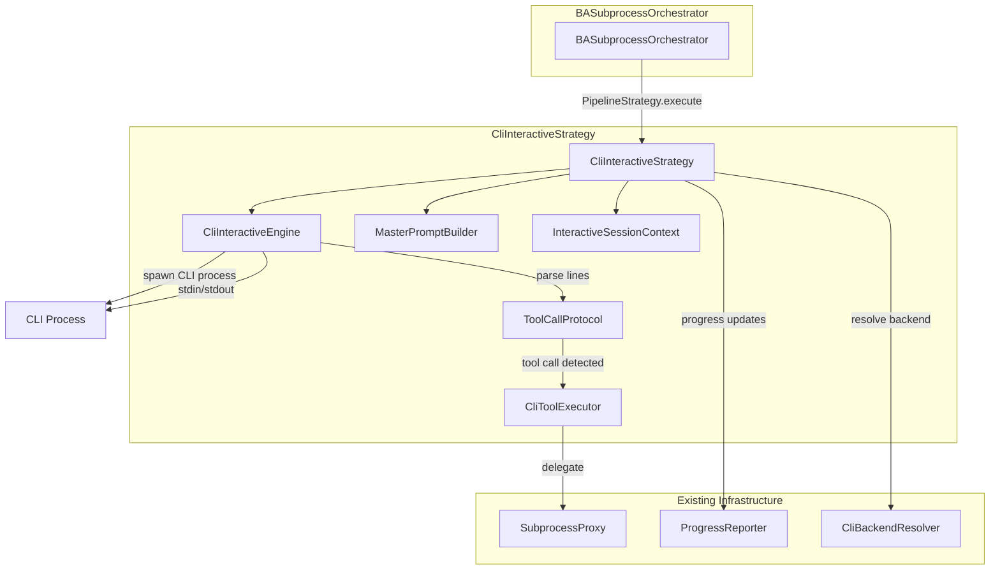
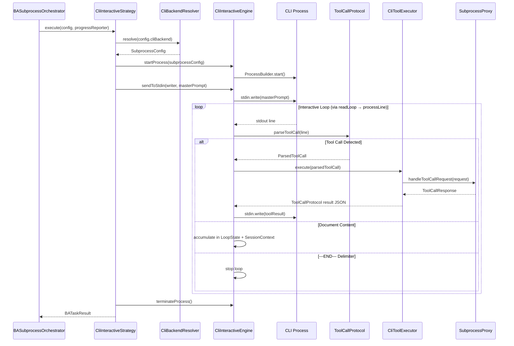
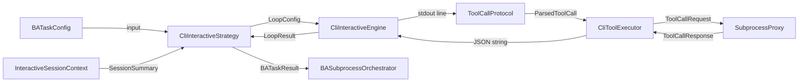

# Design Document: CLI Interactive BA Agent

## Overview

This design describes a new `CliInteractiveStrategy` that implements the existing `PipelineStrategy` interface, replacing the multi-turn `DataCollector → AI loop → DocumentAssembler` pipeline with a single-prompt, interactive CLI approach proven in the `GeminiCliInteractiveTest` POC.

The core idea: spawn a CLI process (Gemini, Copilot, Kiro, or Ollama) via `ProcessBuilder`, send a single master prompt containing role instructions, available tools, and task description, then run a line-by-line interactive loop where the AI requests tool calls via JSON and receives results back via stdin. The AI autonomously decides which tools to call, in what order, and when it has enough data to produce the final document.

**Key advantages over the current `MultiTurnPipelineStrategy`:**
- AI controls data collection strategy (no hardcoded 4-tool sequence)
- Single prompt context window (no multi-turn context fragmentation)
- Simpler architecture (no `DataCollector`, `StepPromptBuilder`, `DocumentAssembler`)
- Drop-in replacement via `PipelineStrategy` interface

## Architecture

### Component Diagram



### Sequence Diagram



### Design Decisions

1. **Direct ProcessBuilder over SubprocessManager**: The POC proved that direct `ProcessBuilder` with stdin/stdout piping is simpler and more reliable for interactive sessions. `SubprocessManager` was designed for command-response patterns, not continuous interactive loops.

2. **Simple JSON protocol over MessageProtocol**: The POC's `{"toolCall":...}` / `{"toolResult":...}` protocol is simpler than the existing `SubprocessMessage` envelope. We use substring detection (`contains("\"toolCall\"")`) for robustness against CLI output noise (progress indicators, ANSI codes).

3. **Single master prompt over multi-step prompts**: Instead of 4 separate prompts (analysis → requirements → writing → review), one comprehensive prompt lets the AI decide its own data collection and writing strategy. This produces better documents because the AI has full context throughout.

4. **Reuse SubprocessProxy for tool execution**: All MCP tools (Jira, KB) are already registered in `SubprocessProxy`. We delegate tool calls there rather than reimplementing tool routing.

5. **Session context as immutable snapshot**: `InteractiveSessionContext` accumulates mutable state during the loop, then produces an immutable summary at completion. This prevents post-session mutation bugs.

## Components and Interfaces

### 1. CliInteractiveStrategy (PipelineStrategy implementation)

**File:** `server/src/jvmMain/kotlin/com/assistant/server/agent/ba/subprocess/pipeline/CliInteractiveStrategy.kt`

**Responsibility:** Orchestrates the full CLI interactive pipeline: resolve backend → build prompt → spawn CLI → run interactive loop → return result.

```kotlin
class CliInteractiveStrategy(
    private val subprocessProxy: SubprocessProxy,
    private val cliBackendResolver: CliBackendResolver
) : PipelineStrategy {
    override suspend fun execute(
        config: BATaskConfig,
        progressReporter: ProgressReporter
    ): BATaskResult
}
```

### 2. CliInteractiveEngine

**File:** `server/src/jvmMain/kotlin/com/assistant/server/agent/ba/subprocess/pipeline/cli/CliInteractiveEngine.kt`

**Responsibility:** Manages CLI process lifecycle (spawn, stdin/stdout I/O, termination) and runs the interactive loop.

```kotlin
class CliInteractiveEngine {
    fun startProcess(config: SubprocessConfig): Process
    suspend fun sendToStdin(writer: BufferedWriter, text: String)
    suspend fun runInteractiveLoop(
        reader: BufferedReader,
        writer: BufferedWriter,
        toolExecutor: CliToolExecutor,
        sessionContext: InteractiveSessionContext,
        config: LoopConfig
    ): LoopResult
    fun terminateProcess(process: Process)
}
```

Internally, the engine uses a private `LoopState` helper class to accumulate loop metrics (tool call counts, document lines) independently from `InteractiveSessionContext`. This separation keeps the engine's internal bookkeeping decoupled from the session-level state that the strategy consumes. Tool call success is detected via `result.contains("\"success\":true")` string matching on the formatted JSON result from `CliToolExecutor`.

The interactive loop is decomposed into private helper functions (`readLoop`, `processLine`, `handleToolCall`, `executeAndRecord`, `handleToolCallLimitExceeded`) to keep each function under 20 lines per Kotlin code standards.

### 3. ToolCallProtocol

**File:** `server/src/jvmMain/kotlin/com/assistant/server/agent/ba/subprocess/pipeline/cli/ToolCallProtocol.kt`

**Responsibility:** Parses tool call JSON from stdout lines and formats tool result JSON for stdin.

```kotlin
object ToolCallProtocol {
    fun parseToolCall(line: String): ParsedToolCall?
    fun formatToolResult(name: String, success: Boolean, data: String, error: String): String
}
```

Uses internal `@Serializable` DTOs (`ToolResultEnvelope`, `ToolResultPayload`) for JSON serialization via `kotlinx.serialization.json.Json` with `encodeDefaults = true`. The `parseToolCall` function uses manual `JsonObject` traversal (not deserialization into a DTO) for robustness against unexpected JSON structures.

### 4. CliToolExecutor

**File:** `server/src/jvmMain/kotlin/com/assistant/server/agent/ba/subprocess/pipeline/cli/CliToolExecutor.kt`

**Responsibility:** Executes tool calls by delegating to `SubprocessProxy.handleToolCallRequest()` and converting responses to protocol format.

```kotlin
class CliToolExecutor(
    private val subprocessProxy: SubprocessProxy
) {
    suspend fun execute(toolCall: ParsedToolCall): String
}
```

### 5. MasterPromptBuilder

**File:** `server/src/jvmMain/kotlin/com/assistant/server/agent/ba/subprocess/pipeline/cli/MasterPromptBuilder.kt`

**Responsibility:** Builds the single master prompt containing role, tools, format, and task.

```kotlin
object MasterPromptBuilder {
    fun build(
        ticketId: String,
        docType: String,
        availableTools: List<ToolDescriptor>,
        customInstructions: String?
    ): String
}
```

### 6. InteractiveSessionContext

**File:** `server/src/jvmMain/kotlin/com/assistant/server/agent/ba/subprocess/pipeline/cli/models/InteractiveSessionContext.kt`

**Responsibility:** Tracks session state: tool call log, document lines, timing, failure counts.

```kotlin
class InteractiveSessionContext {
    fun recordToolCall(entry: ToolCallLogEntry)
    fun appendDocumentLine(line: String)
    fun recordConsecutiveFailure()
    fun resetConsecutiveFailures()
    val currentConsecutiveFailures: Int  // read-only property
    fun toSummary(): SessionSummary
    fun toBATaskResult(status: BATaskStatus): BATaskResult
}
```

Note: `recordToolCall` also updates the consecutive failure tracker — resets to 0 on success, increments on failure. Both `toSummary()` and `toBATaskResult()` mark the session as completed, after which all mutation methods throw `IllegalStateException`.

### 7. Supporting Models

**File:** `server/src/jvmMain/kotlin/com/assistant/server/agent/ba/subprocess/pipeline/cli/models/CliInteractiveModels.kt`

```kotlin
// Parsed tool call from CLI stdout
data class ParsedToolCall(
    val name: String,
    val arguments: Map<String, String>
)

// Configuration for the interactive loop
data class LoopConfig(
    val maxToolCalls: Int,
    val timeoutSeconds: Int
)

// Result of the interactive loop
data class LoopResult(
    val document: String,
    val timedOut: Boolean,
    val toolCallsExecuted: Int,
    val toolCallsFailed: Int
)

// Session summary after completion
data class SessionSummary(
    val totalToolCalls: Int,
    val failedToolCalls: Int,
    val documentSizeChars: Int,
    val totalDurationMs: Long,
    val consecutiveFailures: Int
)
```

### Package Structure

```
server/src/jvmMain/kotlin/com/assistant/server/agent/ba/subprocess/pipeline/
├── PipelineStrategy.kt                    (existing)
├── MultiTurnPipelineStrategy.kt           (existing, unchanged)
├── CliInteractiveStrategy.kt              (NEW — PipelineStrategy impl)
└── cli/
    ├── CliInteractiveEngine.kt            (NEW — process lifecycle + loop)
    ├── ToolCallProtocol.kt                (NEW — JSON parse/format)
    ├── CliToolExecutor.kt                 (NEW — tool execution bridge)
    ├── MasterPromptBuilder.kt             (NEW — prompt construction)
    └── models/
        ├── InteractiveSessionContext.kt   (NEW — session state)
        └── CliInteractiveModels.kt        (NEW — data classes)
```

## Data Models

### Existing Models (Reused As-Is)

| Model | Location | Usage |
|-------|----------|-------|
| `BATaskConfig` | `shared/.../ba/models/BATaskConfig.kt` | Input config: ticketId, docType, maxToolCalls, timeout, cliBackend |
| `BATaskResult` | `shared/.../ba/models/BATaskResult.kt` | Output: document, metrics, status, toolCallLog |
| `BATaskStatus` | `shared/.../ba/models/BATaskResult.kt` | Enum: SUCCESS, PARTIAL, TIMEOUT, FAILED |
| `ToolCallLogEntry` | `shared/.../ba/models/ToolCallLogEntry.kt` | Per-tool-call metrics: name, duration, success, responseSize |
| `ToolCallRequest` | `shared/.../subprocess/SubprocessModels.kt` | Tool call request: id, name, arguments |
| `ToolCallResponse` | `shared/.../subprocess/SubprocessModels.kt` | Tool call response: id, success, data, error |
| `SubprocessConfig` | `shared/.../subprocess/SubprocessConfig.kt` | CLI config: agentType, cliCommand, cliArgs |
| `ToolDescriptor` | `shared/.../agent/models/ToolDescriptor.kt` | Tool metadata for prompt building |

### New Models

#### ParsedToolCall
Lightweight representation of a tool call extracted from CLI stdout. Unlike `ToolCallRequest`, this has no `id` field — the ID is generated internally when delegating to `SubprocessProxy`.

```kotlin
data class ParsedToolCall(
    val name: String,
    val arguments: Map<String, String>
)
```

#### LoopConfig
Immutable configuration for the interactive loop, extracted from `BATaskConfig` to decouple the engine from BA-specific config.

```kotlin
data class LoopConfig(
    val maxToolCalls: Int,
    val timeoutSeconds: Int
)
```

#### LoopResult
Outcome of the interactive loop — raw data before conversion to `BATaskResult`.

```kotlin
data class LoopResult(
    val document: String,
    val timedOut: Boolean,
    val toolCallsExecuted: Int,
    val toolCallsFailed: Int
)
```

#### SessionSummary
Immutable snapshot of session metrics after completion.

```kotlin
data class SessionSummary(
    val totalToolCalls: Int,
    val failedToolCalls: Int,
    val documentSizeChars: Int,
    val totalDurationMs: Long,
    val consecutiveFailures: Int
)
```

### Data Flow



### JSON Protocol Wire Format

**Tool Call Request** (CLI stdout → parsed by `ToolCallProtocol`):
```json
{"toolCall":{"name":"mcp_jira_get_issue","arguments":{"issue_key":"ICL2-15"}}}
```

**Tool Call Response** (formatted by `ToolCallProtocol` → CLI stdin):
```json
{"toolResult":{"name":"mcp_jira_get_issue","success":true,"data":"{\"key\":\"ICL2-15\",\"summary\":\"...\"}","error":""}}
```

**End Delimiter** (CLI stdout):
```
---END---
```


## Correctness Properties

*A property is a characteristic or behavior that should hold true across all valid executions of a system — essentially, a formal statement about what the system should do. Properties serve as the bridge between human-readable specifications and machine-verifiable correctness guarantees.*

### Property 1: Tool call parsing extracts correct fields from noisy lines

*For any* valid tool call JSON (with random tool name and argument map) preceded by *any* arbitrary prefix string, `ToolCallProtocol.parseToolCall()` SHALL extract a `ParsedToolCall` whose `name` and `arguments` match the original values.

**Validates: Requirements 2.1, 2.3**

### Property 2: Tool result formatting round-trip preserves data

*For any* tool result inputs (random name, success boolean, data string containing special characters like quotes/backslashes/newlines/unicode, and error string), formatting via `ToolCallProtocol.formatToolResult()` then parsing the output as JSON SHALL produce a valid JSON object whose fields match the original inputs exactly.

**Validates: Requirements 2.2, 2.5, 2.6**

### Property 3: Malformed input produces null without exceptions

*For any* string that is NOT valid tool call JSON (random strings, partial JSON, wrong structure), `ToolCallProtocol.parseToolCall()` SHALL return `null` and SHALL NOT throw any exception.

**Validates: Requirements 2.4**

### Property 4: Interactive loop correctly separates tool calls from content

*For any* sequence of stdout lines consisting of a mix of tool call lines, document content lines, and a terminating `---END---` delimiter, the interactive loop SHALL:
- Execute exactly the tool calls present in the sequence (count matches)
- Accumulate exactly the non-tool-call, non-delimiter lines as document content
- Stop at the `---END---` delimiter
- Report accurate `toolCallsExecuted` and `toolCallsFailed` counts matching the actual outcomes

**Validates: Requirements 3.1, 3.2, 3.3, 3.4, 3.5**

### Property 5: Tool executor converts any response to valid protocol JSON

*For any* `ToolCallResponse` (random id, success/failure boolean, random data string, random error string), `CliToolExecutor.execute()` SHALL produce a string that is valid JSON matching the `{"toolResult":{...}}` protocol format, with `success`, `data`, and `error` fields reflecting the original response. When `SubprocessProxy` throws an exception, the result SHALL have `success=false` with the exception message in `error`.

**Validates: Requirements 4.2, 4.3, 9.2**

### Property 6: Master prompt contains all required sections for any input

*For any* valid combination of ticket ID (non-blank string), document type ("BRD" or "FSD"), list of tool descriptors (0 or more), and optional custom instructions string, `MasterPromptBuilder.build()` SHALL produce a prompt that contains:
- The ticket ID
- Each tool descriptor's name
- The `---END---` delimiter instruction
- The custom instructions (when provided)

**Validates: Requirements 5.1, 5.2, 5.3, 5.6**

### Property 7: Session context accurately tracks all state

*For any* sequence of operations (recording tool calls with random name/duration/success, appending random document lines, recording consecutive failures and resets), `InteractiveSessionContext` SHALL produce a `SessionSummary` where:
- `totalToolCalls` equals the number of `recordToolCall` invocations
- `failedToolCalls` equals the number of failed tool call recordings
- `documentSizeChars` equals the total characters of all appended lines
- `consecutiveFailures` equals the length of the current unbroken failure streak

**Validates: Requirements 8.1, 8.2, 8.4, 8.5**

## Error Handling

### Error Categories and Strategies

| Error | Component | Strategy | Recovery |
|-------|-----------|----------|----------|
| CLI path not configured | CliInteractiveStrategy | Return FAILED BATaskResult | User configures CLI path |
| CLI process fails to start | CliInteractiveEngine | Catch IOException, return FAILED | Log error with process details |
| CLI process exits unexpectedly | CliInteractiveEngine | Detect via `Process.isAlive()`, return partial result | Include exit code in error |
| Malformed JSON in stdout | ToolCallProtocol | Return null, skip line | Line treated as document content |
| Tool call throws exception | CliToolExecutor | Catch all exceptions, return `success=false` toolResult | AI receives error, can retry or proceed |
| Tool not found | CliToolExecutor (via SubprocessProxy) | SubprocessProxy returns `success=false` | AI receives error message |
| Session timeout | CliInteractiveEngine | `withTimeoutOrNull` returns null | Return partial document with TIMEOUT status |
| Tool call limit exceeded | CliInteractiveEngine | Send error toolResult instructing final output | AI produces document with available data |
| Consecutive failures (circuit breaker) | InteractiveSessionContext | Track count, strategy can abort if threshold exceeded | Return partial result with FAILED status |
| Coroutine cancellation | CliInteractiveEngine | `CancellationException` propagates naturally | Process terminated in finally block |

### Error Propagation Rules

1. **No uncaught exceptions from the interactive loop** — all exceptions caught and converted to error results
2. **Process cleanup in finally block** — `terminateProcess()` always called regardless of how the loop exits
3. **Partial results preferred over empty results** — if some document content was accumulated before failure, return it with appropriate status
4. **Error context in logs** — every error logged with session ID, tool name (if applicable), and error message

### Status Determination Logic

```
if process_failed_to_start → FAILED
if timeout → TIMEOUT
if any_tool_calls_failed AND document_not_empty → PARTIAL
if document_empty → FAILED
if all_tool_calls_succeeded AND document_not_empty → SUCCESS
```

## Testing Strategy

### Testing Approach

This feature is well-suited for a **dual testing approach**:

1. **Property-based tests** for the pure logic components (protocol parsing/formatting, session context tracking, prompt building)
2. **Unit tests with mocks** for integration points (tool executor delegation, strategy orchestration, process lifecycle)
3. **Integration tests** for end-to-end CLI interaction (existing `GeminiCliInteractiveTest` pattern)

### Property-Based Testing

**Library:** [Kotest Property Testing](https://kotest.io/docs/proptest/property-based-testing.html) — already available in the Kotlin ecosystem, integrates with JUnit 5.

**Configuration:**
- Minimum 100 iterations per property test (implementation uses 200 for most, 75 for I/O-heavy engine tests)
- Each test tagged with: `@Tag("cli-interactive-ba-agent")`

**Properties to implement:**

| Property | Component Under Test | Generator Strategy |
|----------|---------------------|-------------------|
| P1: Tool call parsing | `ToolCallProtocol.parseToolCall()` | Random alphanumeric tool names + random string→string argument maps + random prefix strings |
| P2: Tool result round-trip | `ToolCallProtocol.formatToolResult()` | Random strings with special chars (quotes, backslashes, newlines, unicode) |
| P3: Malformed input → null | `ToolCallProtocol.parseToolCall()` | Random strings, partial JSON, wrong-structure JSON |
| P4: Loop correctness | `CliInteractiveEngine.runInteractiveLoop()` | Random sequences of tool-call lines + content lines + delimiter, with mock tool executor |
| P5: Executor conversion | `CliToolExecutor.execute()` | Random ToolCallResponse values + random exceptions |
| P6: Prompt completeness | `MasterPromptBuilder.build()` | Random ticket IDs, doc types, tool descriptor lists, optional instructions |
| P7: Session context | `InteractiveSessionContext` | Random sequences of recordToolCall/appendDocumentLine/recordConsecutiveFailure operations |

### Unit Tests (Example-Based)

| Test | What It Verifies |
|------|-----------------|
| Strategy returns FAILED when CLI path missing | Req 7.6, 9.1 |
| Strategy returns FAILED for all backends when paths not configured | Req 7.6, 9.1 |
| Strategy reports no progress before failing on missing path | Req 6.3 |
| Strategy implements PipelineStrategy interface | Req 10.1 |

### Integration Tests

| Test | What It Verifies |
|------|-----------------|
| Full CLI interactive loop with mock process (PipedInputStream/PipedOutputStream) | Req 6.2 (end-to-end orchestration) |
| Process termination does not throw on already-dead process | Req 1.7 |
| Interactive loop returns timedOut when END delimiter missing | Req 1.7, 9.4 |
| createDefaultStrategy returns CliInteractiveStrategy | Req 10.1 |

### Test File Organization

```
server/src/jvmTest/kotlin/com/assistant/server/agent/ba/subprocess/pipeline/cli/
├── ToolCallProtocolPropertyTest.kt     (P1, P2, P3)
├── CliInteractiveEnginePropertyTest.kt (P4)
├── CliToolExecutorPropertyTest.kt      (P5)
├── MasterPromptBuilderPropertyTest.kt  (P6)
├── InteractiveSessionContextPropertyTest.kt (P7)
├── CliInteractiveStrategyTest.kt       (unit tests with mocks)
└── CliInteractiveIntegrationTest.kt    (integration tests)
```
