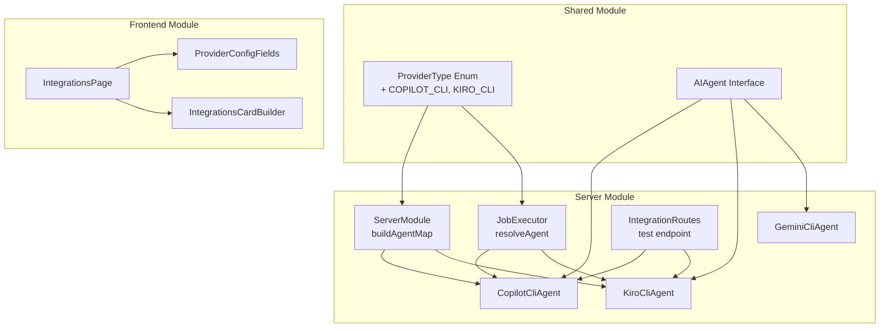
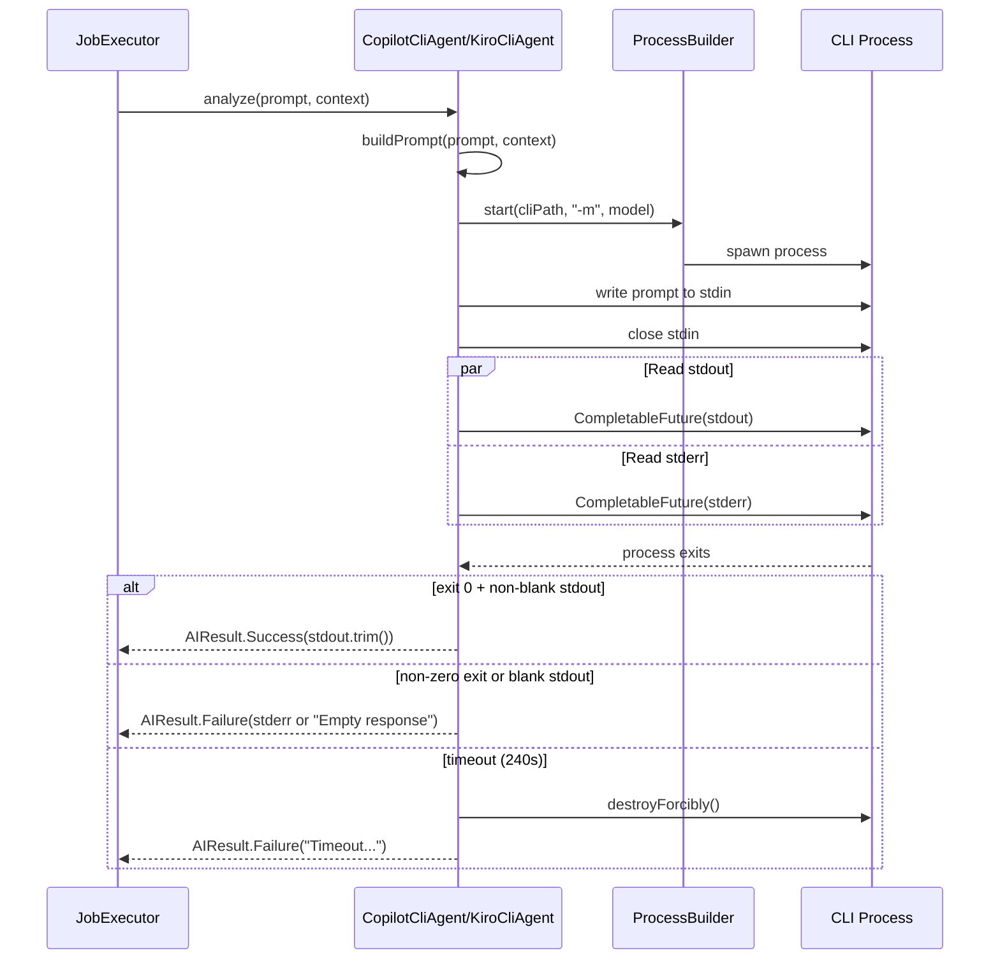

# Design Document — Copilot CLI & Kiro CLI Integration

## Overview

This design extends the Jira Assistant AI provider system with two new CLI-based providers: **Copilot CLI** (GitHub) and **Kiro CLI** (Amazon). Both follow the established `GeminiCliAgent` pattern: spawn a CLI process per request, send prompt via stdin, read response from stdout, handle timeout.

The implementation spans three modules:
- **shared** — `ProviderType` enum extension
- **server** — `CopilotCliAgent` and `KiroCliAgent` implementations, `ServerModule` agent resolution, `JobExecutor` provider selection, `IntegrationRoutes` test connection
- **frontend** — Provider cards, config modal fields

### Design Rationale

The GeminiCliAgent pattern is proven and well-tested in production. Reusing this pattern for new CLI providers minimizes risk and ensures consistency. The key architectural decision is to create separate agent classes (rather than a generic `CliAgent`) to allow provider-specific customization (different default models, different CLI flags, different error messages) while maintaining the same process lifecycle.

## Architecture



### Process Lifecycle (per request)



## Components and Interfaces

### 1. ProviderType Enum (shared module)

**File:** `shared/src/commonMain/kotlin/com/assistant/ai/AIOrchestrator.kt`

```kotlin
@Serializable
enum class ProviderType { JIRA, OLLAMA, GEMINI, LM_STUDIO, GEMINI_CLI, COPILOT_CLI, KIRO_CLI, EMBEDDING }
```

### 2. CopilotCliAgent (server module)

**File:** `server/src/jvmMain/kotlin/com/assistant/server/ai/CopilotCliAgent.kt`

```kotlin
class CopilotCliAgent(
    private val cliPath: String,
    private val model: String = "copilot"
) : AIAgent {
    companion object {
        private const val TIMEOUT_MS = 240_000L
    }
    
    override suspend fun analyze(prompt: String, context: AIContext?): AIResult
    override fun getAgentName(): String = "Copilot CLI - $model"
    suspend fun testConnection(): String?  // --version with 15s timeout
}
```

Internally reuses the same `executeCliCommand` pattern as `GeminiCliAgent`:
- `ProcessBuilder` with OS-aware command (prepend `cmd /c` on Windows)
- `CompletableFuture.supplyAsync` for stdout/stderr reading
- `process.waitFor(timeout, TimeUnit.MILLISECONDS)` with `destroyForcibly()` on timeout
- Timeout handling extracted into `handleProcessCompletion()` private method to comply with 20-line function limit

### 3. KiroCliAgent (server module)

**File:** `server/src/jvmMain/kotlin/com/assistant/server/ai/KiroCliAgent.kt`

```kotlin
class KiroCliAgent(
    private val cliPath: String,
    private val model: String = "kiro"
) : AIAgent {
    companion object {
        private const val TIMEOUT_MS = 240_000L
    }
    
    override suspend fun analyze(prompt: String, context: AIContext?): AIResult
    override fun getAgentName(): String = "Kiro CLI - $model"
    suspend fun testConnection(): String?  // --version with 15s timeout
}
```

Identical structure to `CopilotCliAgent` with different default model and agent name prefix. Also includes `handleProcessCompletion()` extraction.

### 4. ServerModule Agent Resolution

**File:** `server/src/jvmMain/kotlin/com/assistant/server/di/ServerModule.kt`

Add cases to `buildAgentMap`:

```kotlin
ProviderType.COPILOT_CLI ->
    agents[config.providerId] = CopilotCliAgent(config.endpoint, config.model ?: "copilot")
ProviderType.KIRO_CLI ->
    agents[config.providerId] = KiroCliAgent(config.endpoint, config.model ?: "kiro")
```

Add to `ChatServiceImpl` agent provider filter:

```kotlin
.filter { it.type in listOf(ProviderType.OLLAMA, ProviderType.LM_STUDIO, ProviderType.GEMINI, ProviderType.GEMINI_CLI, ProviderType.COPILOT_CLI, ProviderType.KIRO_CLI) }
```

### 5. JobExecutor Agent Selection

**File:** `server/src/jvmMain/kotlin/com/assistant/server/jobs/JobExecutor.kt`

Update `resolveAgent()` filter and when block:

```kotlin
.filter { it.type in listOf(ProviderType.OLLAMA, ProviderType.LM_STUDIO, ProviderType.GEMINI, ProviderType.GEMINI_CLI, ProviderType.COPILOT_CLI, ProviderType.KIRO_CLI) }

when (c.type) {
    ProviderType.GEMINI_CLI -> GeminiCliAgent(c.endpoint, c.model ?: "gemini-2.0-flash")
    ProviderType.COPILOT_CLI -> CopilotCliAgent(c.endpoint, c.model ?: "copilot")
    ProviderType.KIRO_CLI -> KiroCliAgent(c.endpoint, c.model ?: "kiro")
    else -> OllamaAgent(httpClient, c.model ?: "llama3", c.endpoint)
}
```

### 6. IntegrationRoutes Test Connection

**File:** `server/src/jvmMain/kotlin/com/assistant/server/routes/IntegrationRoutes.kt`

Add handling for COPILOT_CLI and KIRO_CLI in the `post("/{providerId}/test")` route, following the same pattern as GEMINI_CLI:

```kotlin
val isCopilotCli = providerId == "copilot_cli" ||
    providerConfigRepo.findById(providerId)?.type == ProviderType.COPILOT_CLI
val isKiroCli = providerId == "kiro_cli" ||
    providerConfigRepo.findById(providerId)?.type == ProviderType.KIRO_CLI
```

A shared `respondCliTest()` helper function was extracted to DRY up the CLI test connection logic across GeminiCli, CopilotCli, and KiroCli providers. It accepts an `agentFactory` lambda and dispatches `testConnection()` via a `when` block on the agent type:

```kotlin
private suspend fun respondCliTest(
    call: ApplicationCall, providerId: String,
    providerConfigRepo: ProviderConfigRepository, cliPath: String,
    agentFactory: () -> AIAgent
) {
    val agent = agentFactory()
    val connResult = when (agent) {
        is GeminiCliAgent -> agent.testConnection()
        is CopilotCliAgent -> agent.testConnection()
        is KiroCliAgent -> agent.testConnection()
        else -> null
    }
    // ... respond with success/failure
}
```

### 7. Frontend — Provider Cards & Config

**IntegrationsPage.kt** — Add to `defaultProviders()`:
```kotlin
ProviderInfo("copilot_cli", "Copilot CLI (GitHub)", "COPILOT_CLI", "OFFLINE", priority = 5),
ProviderInfo("kiro_cli", "Kiro CLI (Amazon)", "KIRO_CLI", "OFFLINE", priority = 6),
```

**IntegrationsCardBuilder.kt** — Add logos:
```kotlin
"COPILOT_CLI" -> "🤖"; "KIRO_CLI" -> "🔮"
```

**ProviderConfigFields.kt** — Add config field builders:
```kotlin
"COPILOT_CLI" -> buildCopilotCLIFields(provider, disabled)
"KIRO_CLI" -> buildKiroCLIFields(provider, disabled)
```

Both show CLI Path (text input) and Model Name (text input), following the same pattern as `buildGeminiCLIFields`.

**IntegrationRoutes.kt** — Add to defaults list in GET handler:
```kotlin
ProviderConfig(providerId = "copilot_cli", name = "Copilot CLI (GitHub)", type = ProviderType.COPILOT_CLI, endpoint = "", priority = 5, status = ConnectionStatus.OFFLINE),
ProviderConfig(providerId = "kiro_cli", name = "Kiro CLI (Amazon)", type = ProviderType.KIRO_CLI, endpoint = "", priority = 6, status = ConnectionStatus.OFFLINE),
```

## Data Models

### ProviderConfig (existing — no schema change)

The existing `provider_configs` table stores all provider configurations. New providers use the same schema:

| Column | Type | COPILOT_CLI Example | KIRO_CLI Example |
|--------|------|---------------------|------------------|
| provider_id | VARCHAR | "copilot_cli" | "kiro_cli" |
| name | VARCHAR | "Copilot CLI (GitHub)" | "Kiro CLI (Amazon)" |
| type | VARCHAR | "COPILOT_CLI" | "KIRO_CLI" |
| endpoint | VARCHAR | "/usr/local/bin/gh" | "/usr/local/bin/kiro" |
| model | VARCHAR | "copilot" | "kiro" |
| priority | INT | 5 | 6 |
| status | VARCHAR | "OFFLINE" | "OFFLINE" |

No database migration needed — the existing table structure supports arbitrary provider types via the VARCHAR type column.

## Correctness Properties

*A property is a characteristic or behavior that should hold true across all valid executions of a system — essentially, a formal statement about what the system should do. Properties serve as the bridge between human-readable specifications and machine-verifiable correctness guarantees.*

### Property 1: ProviderType Serialization Round-Trip

*For any* valid ProviderType enum value (including COPILOT_CLI and KIRO_CLI), serializing to JSON and then deserializing back SHALL produce the same enum value.

**Validates: Requirements 1.4**

### Property 2: CLI Agent Success Mapping

*For any* CLI agent (CopilotCliAgent or KiroCliAgent) and any non-blank stdout string produced by a process that exits with code 0, the agent SHALL return `AIResult.Success` containing the trimmed stdout content.

**Validates: Requirements 2.4, 3.4**

### Property 3: CLI Agent Failure Mapping

*For any* CLI agent (CopilotCliAgent or KiroCliAgent) and any process that exits with a non-zero exit code OR produces blank stdout, the agent SHALL return `AIResult.Failure` with an error message containing either the stderr content or "Empty response".

**Validates: Requirements 2.5, 3.5**

### Property 4: CLI Agent Name Format

*For any* model string, `CopilotCliAgent(path, model).getAgentName()` SHALL return `"Copilot CLI - $model"` and `KiroCliAgent(path, model).getAgentName()` SHALL return `"Kiro CLI - $model"`.

**Validates: Requirements 2.9, 3.9**

### Property 5: Test Connection Success Format

*For any* non-blank version string returned by the CLI `--version` command with exit code 0, `testConnection()` SHALL return a string containing that version string (format: `"Connected — {version}"`).

**Validates: Requirements 4.2, 4.5**

## Error Handling

| Scenario | Handling | User-Facing Message |
|----------|----------|---------------------|
| CLI binary not found | `IOException` caught → `AIResult.Failure` | "CLI error: Cannot run program '{path}'" |
| CLI process timeout (240s) | `destroyForcibly()` → `AIResult.Failure` | "Timeout after 240000ms" |
| CLI exits with non-zero code | stderr captured → `AIResult.Failure` | "CLI error (exit {code}): {stderr}" |
| CLI produces blank output | Detected post-process → `AIResult.Failure` | "CLI error (exit 0): Empty response" |
| Test connection timeout (15s) | `destroyForcibly()` → return `null` | "CLI not found or not executable: {path}" |
| Test connection failure | Exception caught → return `null` | "CLI not found or not executable: {path}" |
| Config save API failure | HTTP error → frontend shows error | "Error: {message}" in modal |
| Pipe buffer deadlock | Prevented by `CompletableFuture.supplyAsync` for stdout/stderr | N/A (design prevents this) |

### Logging Strategy

- `INFO` — CLI call start (model, prompt length), CLI call success (response length)
- `WARN` — CLI failure (exit code, stderr), CLI timeout (partial output length)
- `ERROR` — Unexpected exceptions during process execution

## Testing Strategy

### Unit Tests (Example-Based)

| Test | What it verifies |
|------|-----------------|
| `CopilotCliAgent returns Success for valid output` | Exit 0 + non-blank stdout → Success |
| `CopilotCliAgent returns Failure for non-zero exit` | Exit 1 + stderr → Failure with stderr |
| `CopilotCliAgent returns Failure for blank stdout` | Exit 0 + blank → Failure "Empty response" |
| `CopilotCliAgent handles timeout` | Hanging process → destroyForcibly + Failure |
| `CopilotCliAgent prepends cmd /c on Windows` | Windows OS → command starts with cmd /c |
| `KiroCliAgent` (same set as above) | Mirror tests for KiroCliAgent |
| `ServerModule creates CopilotCliAgent for COPILOT_CLI` | buildAgentMap resolution |
| `ServerModule creates KiroCliAgent for KIRO_CLI` | buildAgentMap resolution |
| `JobExecutor selects CopilotCliAgent by priority` | resolveAgent with COPILOT_CLI highest |
| `JobExecutor selects KiroCliAgent by priority` | resolveAgent with KIRO_CLI highest |
| `JobExecutor fallback unchanged` | No active providers → OllamaAgent |

### Property-Based Tests (Kotest)

**Library:** Kotest Property Testing (`io.kotest:kotest-property`)
**Minimum iterations:** 100 per property

| Property | Generator | Assertion |
|----------|-----------|-----------|
| Property 1: ProviderType round-trip | `Arb.enum<ProviderType>()` | `Json.decodeFromString(Json.encodeToString(value)) == value` |
| Property 2: CLI success mapping | `Arb.string(1..10000).filter { it.isNotBlank() }` | Mock process exit 0 + stdout → `AIResult.Success(stdout.trim())` |
| Property 3: CLI failure mapping | `Arb.int(1..255)` + `Arb.string()` | Mock process non-zero exit → `AIResult.Failure` containing stderr |
| Property 4: Agent name format | `Arb.string(1..100).filter { it.isNotBlank() }` | `getAgentName() == "Copilot CLI - $model"` |
| Property 5: Test connection format | `Arb.string(1..200).filter { it.isNotBlank() }` | `testConnection()` contains version string |

**Tag format:** `Feature: copilot-kiro-cli-integration, Property {N}: {description}`

### Integration Tests

| Test | Scope |
|------|-------|
| Test connection route for COPILOT_CLI | API endpoint + agent instantiation |
| Test connection route for KIRO_CLI | API endpoint + agent instantiation |
| Config save + reload for COPILOT_CLI | DB persistence round-trip |
| Config save + reload for KIRO_CLI | DB persistence round-trip |
| Provider list includes new providers | GET /api/integrations response |

### E2E Tests (Serenity BDD)

| Scenario | Steps |
|----------|-------|
| Copilot CLI card visible on Integrations page | Navigate → verify card rendered |
| Kiro CLI card visible on Integrations page | Navigate → verify card rendered |
| Configure modal shows CLI Path field | Click CONFIGURE → verify fields |
| Test connection shows result | Click TEST LINK → verify feedback |
