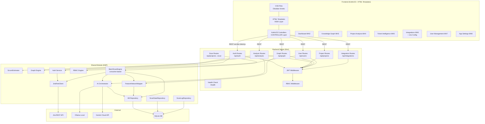
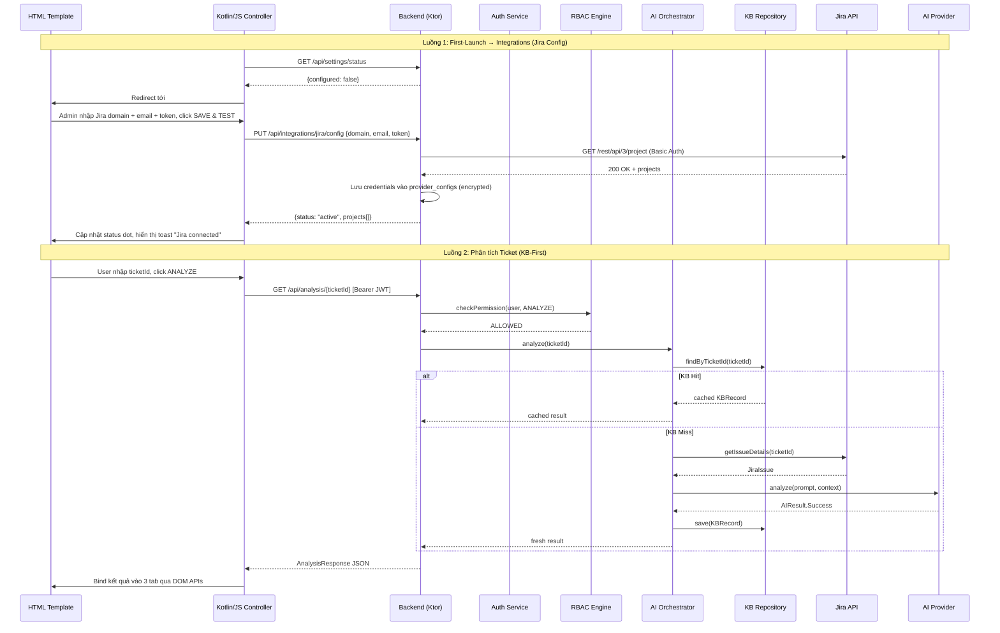
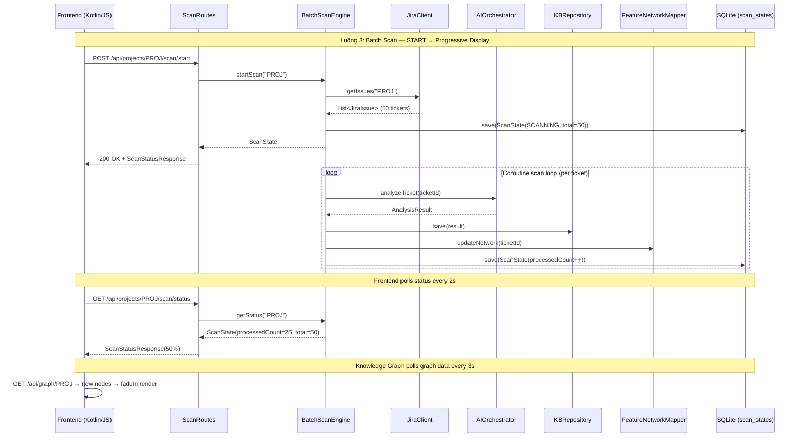
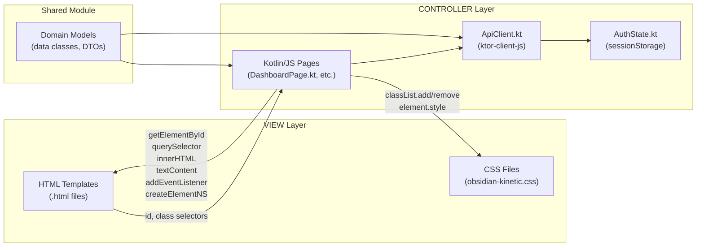

# Cross-cutting Concerns — Design

# Kiến trúc (Architecture)

## Tổng quan

Hệ thống được xây dựng trên Kotlin Multiplatform (KMP) với kiến trúc Clean Architecture, bao gồm:

- **Frontend_App**: Kotlin/JS + HTML Templates, 8 màn hình sử dụng design system Obsidian Kinetic. Tầng VIEW (HTML templates + CSS files) tách biệt hoàn toàn với tầng CONTROLLER (Kotlin/JS). Data binding qua DOM APIs. Không có trang Onboarding riêng — first-launch redirect tới Integrations
- **Backend_Server**: Ktor REST API server cung cấp tất cả endpoint
- **shared module**: Business logic dùng chung (AI agents, Jira client, domain models)
- **Knowledge_Base**: SQLDelight persistence layer cho kết quả phân tích AI
- **Auth_Service**: JWT-based session management — JWT chỉ chứa user identity, không chứa Jira credentials. Jira credentials lưu trong DB dùng chung cho toàn hệ thống
- **RBAC_Engine**: Phân quyền 3 vai trò (Administrator, Neural_Architect, Reader)
- **AI_Orchestrator**: Điều phối multi-provider AI với KB-First strategy và failover tự động

## Kiến trúc Diagram



## Frontend Module Architecture (Kotlin/JS + HTML Templates)

Frontend sử dụng kiến trúc phân tách VIEW/CONTROLLER rõ ràng:
- **VIEW Layer**: HTML template files (.html) cho layout/structure + CSS files cho styling/animations theo design system Obsidian Kinetic
- **CONTROLLER Layer**: Kotlin/JS files cho business logic, state management, API calls (ktor-client-js), và data binding qua DOM APIs
- **Shared Module**: Type-safe domain models từ `:shared` KMP module

Module nằm trong `frontend/`:

```
frontend/
├── build.gradle.kts              # Kotlin/JS plugin, depends on :shared
├── package.json                  # Vite, dev dependencies
├── vite.config.js                # Vite bundler config
├── index.html                    # Entry HTML (SPA shell, Vite injects JS bundle)
├── src/
│   ├── jsMain/kotlin/com/assistant/frontend/
│   │   ├── App.kt               # Entry point, router setup, DOM ready handler
│   │   ├── router/
│   │   │   └── Router.kt        # Hash-based SPA routing (window.onhashchange)
│   │   ├── state/
│   │   │   ├── AuthState.kt     # JWT token management (sessionStorage)
│   │   │   └── ApiClient.kt     # ktor-client-js wrapper, error handling, toast
│   │   ├── components/
│   │   │   ├── Shell.kt         # App shell: load sidebar + navbar + content area
│   │   │   ├── Sidebar.kt       # Sidebar DOM builder
│   │   │   └── Navbar.kt        # Navbar DOM builder
│   │   └── pages/
│   │       ├── DashboardPage.kt        # Dashboard controller
│   │       ├── KnowledgeGraphPage.kt   # Graph controller (SVG via createElementNS)
│   │       ├── AnalysisPage.kt         # Sprint analysis controller
│   │       ├── TicketIntelligencePage.kt # AI analysis controller
│   │       ├── IntegrationsPage.kt     # Provider management controller (Jira + AI)
│   │       ├── UserManagementPage.kt   # RBAC management controller
│   │       └── SettingsPage.kt         # App settings controller
│   └── jsMain/resources/
│       ├── templates/            # HTML templates cho từng màn hình
│       │   ├── dashboard.html
│       │   ├── knowledge-graph.html
│       │   ├── analysis.html
│       │   ├── ticket-intelligence.html
│       │   ├── integrations.html
│       │   ├── user-management.html
│       │   └── settings.html
│       └── styles/
│           ├── obsidian-kinetic.css  # Design system CSS (glassmorphism, animations)
│           └── components.css        # Component-specific CSS (cards, tooltips, buttons)
```


**Quyết định thiết kế frontend (Kotlin/JS + HTML Templates):**

1. **Kotlin/JS + HTML Templates thay vì Compose for Web**: Chọn kiến trúc VIEW/CONTROLLER phân tách vì:
   - Design system Obsidian Kinetic dựa trên CSS thuần (glassmorphism, `backdrop-filter`, `blur()`, `:hover`, `::after`) — HTML + CSS xử lý tự nhiên hơn
   - SVG knowledge graph tạo qua `document.createElementNS` — DOM API trực tiếp, linh hoạt hơn
   - Accessibility tốt: real DOM elements hỗ trợ screen readers, keyboard navigation
   - Tách biệt rõ ràng giữa markup (HTML) và logic (Kotlin/JS) — dễ maintain, designer có thể chỉnh HTML/CSS độc lập
   - Vite bundler cho HMR nhanh, dev experience tốt

2. **Navigation**: Hash-based routing qua Kotlin/JS `window.onhashchange` listener. Router.kt quản lý mapping giữa hash và page controllers.

3. **State Management**: Kotlin objects quản lý state, cập nhật DOM trực tiếp khi state thay đổi. Coroutines cho async operations (API calls). Navbar project badge được refresh qua `NavbarDropdown.refreshProjectSelector()` khi project key thay đổi — method này xóa selector cũ khỏi DOM và gọi lại `renderProjectSelector()` để tạo mới với project key hiện tại, không cần re-render toàn bộ navbar. Breadcrumb được cập nhật qua `Navbar.updateBreadcrumb(route)` khi Router navigate sang route mới. Cả hai được gọi tự động trong `Router.handleRoute()` cho non-standalone routes.

4. **API Client**: `ktor-client-js` với JWT token từ `sessionStorage`. Shared data models từ `:shared` module — type-safe end-to-end, không cần manual JSON parsing.

5. **Styling**: CSS files thuần cho tất cả styles. Kotlin/JS tương tác với CSS qua `classList.add/remove/toggle` và `element.style` cho dynamic values.

6. **Shared Module Integration**: `frontend/build.gradle.kts` depends on `project(":shared")`. Import trực tiếp shared data models — type-safe end-to-end.

7. **Build & Deploy**:
   - Dev: `./gradlew :frontend:jsBrowserDevelopmentRun` hoặc `npx vite` (Vite dev server với HMR)
   - Production: `./gradlew :frontend:jsBrowserProductionWebpack` → output JS bundle
   - Vite config trỏ tới Kotlin/JS compiler output: `build/js/packages/frontend/kotlin/`
   - Ktor serves production bundle như static files

## Luồng dữ liệu chính





## Luồng VIEW/CONTROLLER



---

# Xử lý Lỗi (Error Handling)

## Backend Server Error Strategy

| Tình huống | HTTP Status | Response Body | Hành động |
|---|---|---|---|
| Request hợp lệ, xử lý thành công | 200/201 | JSON data | — |
| Thiếu/sai trường bắt buộc | 400 | `{"error": "field_name is required"}` | Log warning |
| JWT missing/expired/invalid | 401 | `{"error": "Unauthorized"}` | Redirect to onboarding |
| Không đủ quyền RBAC | 403 | `{"error": "Forbidden"}` | Log audit event |
| Resource không tồn tại | 404 | `{"error": "Not found"}` | — |
| Lỗi nội bộ server | 500 | `{"error": "Internal server error"}` | Log full stack trace, KHÔNG tiết lộ chi tiết |

## AI Orchestrator Error Strategy

1. **AI JSON parse error**: Retry tối đa 2 lần với prompt điều chỉnh, sau đó trả về `AnalysisResult` với thông báo lỗi
2. **AI provider timeout (30s)**: Tự động failover sang provider tiếp theo trong danh sách priority
3. **Tất cả provider offline**: Trả về lỗi rõ ràng cho user, ghi log cảnh báo
4. **KB write failure**: Retry tối đa 3 lần, ghi log chi tiết, trả về kết quả phân tích (không block user)

## Batch Scan Engine Error Strategy

| Tình huống | HTTP Status | Hành vi |
|---|---|---|
| Start scan khi đã có scan đang chạy | 409 Conflict | Trả về error, không tạo scan mới |
| Ticket phân tích lỗi (AI timeout/parse error) | — | Log FAILED vào scan_log, skip ticket, tiếp tục ticket tiếp theo |
| JiraClient lỗi khi lấy danh sách ticket | 502 Bad Gateway | Trả về error, không tạo scan |
| DB write lỗi khi lưu ScanState | — | Retry 3 lần, log error, tiếp tục scan |
| Pause/Resume/Cancel scan không tồn tại | 404 Not Found | Trả về error |
| Server restart khi đang SCANNING | — | `recoverOnStartup()` chuyển SCANNING → PAUSED |
| Pause scan đã COMPLETED/CANCELLED | 400 Bad Request | Trả về error, trạng thái không hợp lệ |

## Frontend Error Strategy (Kotlin/JS + HTML Templates)

Errors xử lý qua Kotlin/JS ApiClient. Toast notification inject vào DOM hiển thị thông báo lỗi. Mỗi page controller xử lý errors trong coroutine catch blocks:

| HTTP Error | Thông báo hiển thị | Hành động |
|---|---|---|
| 400 | "Dữ liệu không hợp lệ: {field}" | Highlight trường lỗi qua `classList.add("error")` |
| 401 | "Phiên đăng nhập đã hết hạn" | `Router.navigateTo("onboarding")`, clear sessionStorage |
| 403 | "Bạn không có quyền thực hiện thao tác này" | Disable action qua `element.setAttribute("disabled", "true")` |
| 404 | "Không tìm thấy dữ liệu" | Show empty state qua `container.innerHTML = emptyStateHtml` |
| 500 | "Lỗi hệ thống, vui lòng thử lại" | Show retry button qua DOM, bind click handler |
| Network error | "Không thể kết nối đến máy chủ" | Show retry button qua DOM, bind click handler |

---

# Bảo mật — Encryption at Rest cho Secrets

Backend_Server đảm bảo bảo mật secrets theo các nguyên tắc:
- **JWT_SECRET**: Đọc từ biến môi trường `JWT_SECRET`, không bao giờ lưu trong source code hoặc config file. Trong Docker deployment, truyền qua `docker-compose.yml` environment hoặc Docker secrets.
- **API tokens**: Jira API token chỉ tồn tại trong memory (RAM) trong suốt session. Token được truyền từ Frontend qua HTTPS, Backend sử dụng để gọi Jira API, không lưu xuống database hay filesystem.
- **Provider API keys** (Gemini): Lưu trong bảng `provider_configs` với trường `api_key` được mã hóa bằng AES-256-GCM trước khi ghi vào SQLite. Key mã hóa lấy từ biến môi trường `ENCRYPTION_KEY`. Khi đọc, giải mã trong memory trước khi sử dụng.
- **Client-side**: Frontend (Kotlin/JS) lưu JWT token trong `sessionStorage` qua `kotlinx.browser.window.sessionStorage` (không `localStorage`), tự động xóa khi đóng tab/browser. Không lưu bất kỳ API token hay secret nào ở client.

*(Validates: Req 16.3)*

---

# Chiến lược Kiểm thử (Testing Strategy)

## Phương pháp kiểm thử kép (Dual Testing Approach)

Dự án sử dụng kết hợp **unit tests** (ví dụ cụ thể, edge cases) và **property-based tests** (kiểm chứng tính đúng đắn phổ quát) để đạt coverage toàn diện.

## Property-Based Testing

- **Thư viện**: [Kotest Property Testing](https://kotest.io/docs/proptest/property-based-testing.html) (`io.kotest:kotest-property`)
- **Cấu hình**: Tối thiểu 100 iterations mỗi property test
- **Tag format**: `Feature: jira-assistant-app, Property {number}: {property_text}`
- Mỗi correctness property (1-13) được triển khai bằng MỘT property-based test
- Generators tùy chỉnh cho: `AuthenticatedUser`, `KBRecord`, `NetworkGraph`, `ScrumEstimation`, `JiraIssue`, `AIResult`, `ProviderConfig`

## Unit Tests (Example-Based)

Tập trung vào:
- Frontend logic: Kotlin/JS test runner kiểm tra page controller logic, state management, DOM manipulation
- Shared models: commonTest kiểm tra serialization, validation (đã có)
- Navigation flows: Hash-based routing chuyển trang đúng khi hash thay đổi (Router.kt)
- Specific behaviors: Sign out invalidates token, RE-ANALYZE updates timestamp
- Edge cases: Expired JWT returns 401, all providers offline returns error
- Integration points: ApiClient (ktor-client-js) gọi đúng endpoint, Backend trả đúng format

## E2E Tests (Serenity BDD)

Sử dụng framework Serenity BDD + Cucumber đã có trong `e2e-tests/`:
- User journeys end-to-end (Administrator setup, Scrum Master analysis, Reader view-only)
- Cross-screen navigation verification
- RBAC enforcement across all screens

## Test Organization

```
shared/src/commonTest/
├── kotlin/com/assistant/
│   ├── auth/AuthServiceTest.kt          -- Property 1 (JWT round-trip)
│   ├── rbac/RBACEngineTest.kt           -- Property 2, 3 (permission matrix, audit log)
│   ├── ai/AIOrchestatorTest.kt          -- Property 4, 13 (KB-First, failover)
│   ├── domain/ScrumEstimatorTest.kt     -- Property 5 (point scale)
│   ├── kb/KBRepositoryTest.kt           -- Property 6, 7 (KB round-trip, graph round-trip)
│   ├── serialization/RoundTripTest.kt   -- Property 8, 9 (serialization, missing fields)
│   ├── graph/GraphEngineTest.kt         -- Property 10, 11, 12 (layout, clusters, search)
│   ├── graph/ForceDirectedLayoutTest.kt -- Property 10 dedicated
│   └── scan/BatchScanEngineTest.kt      -- Property 14-18 (scan state machine, persistence, error handling)

frontend/src/jsTest/
├── kotlin/com/assistant/frontend/
│   ├── router/RouterTest.kt            -- Hash-based routing tests
│   ├── state/ApiClientTest.kt          -- HTTP client, JWT management tests
│   └── pages/                           -- Page controller logic tests

server/src/test/
├── kotlin/com/assistant/server/
│   ├── routes/AuthRoutesTest.kt
│   ├── routes/AnalysisRoutesTest.kt
│   ├── routes/GraphRoutesTest.kt
│   ├── routes/UserRoutesTest.kt
│   ├── routes/ScanRoutesTest.kt         -- Scan API endpoint tests
│   └── middleware/RBACMiddlewareTest.kt

e2e-tests/src/test/
├── resources/features/
│   ├── 001-Initialization.feature       -- (existing)
│   ├── 002-AIAnalysis.feature           -- (existing)
│   ├── 003-Estimation.feature           -- (existing)
│   ├── 004-Onboarding.feature           -- (new)
│   ├── 005-Dashboard.feature            -- (new)
│   ├── 006-KnowledgeGraph.feature       -- (new)
│   ├── 007-TicketIntelligence.feature   -- (new)
│   ├── 008-Integrations.feature         -- (new)
│   ├── 009-UserManagement.feature       -- (new)
│   └── 010-BatchScan.feature            -- (new) Batch scan E2E tests
```
