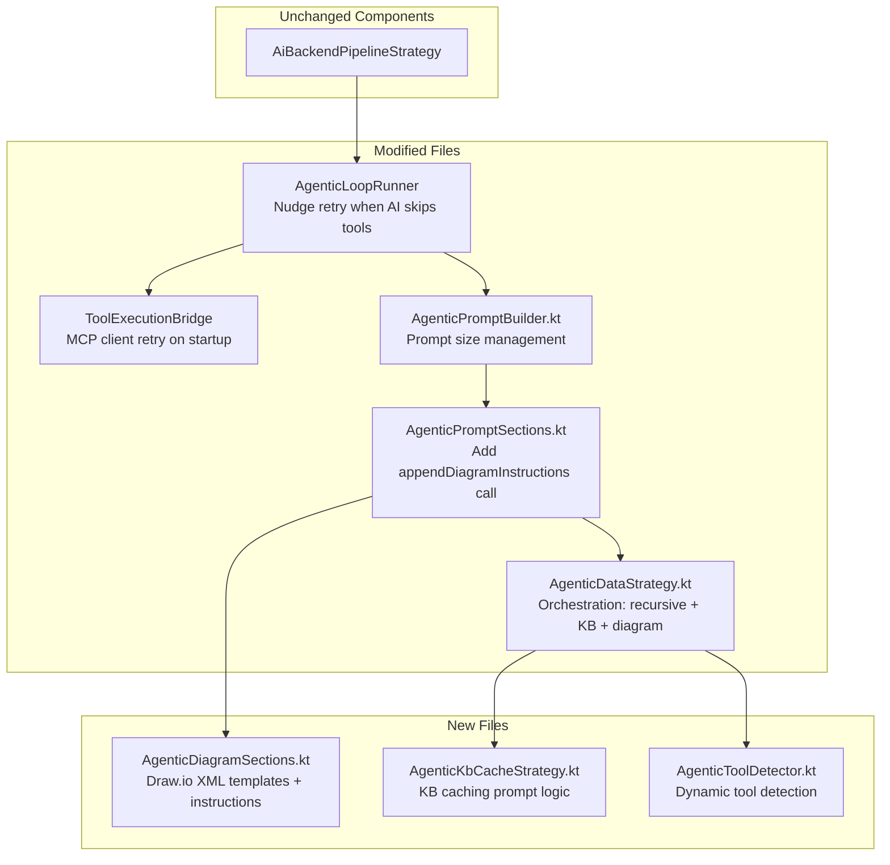
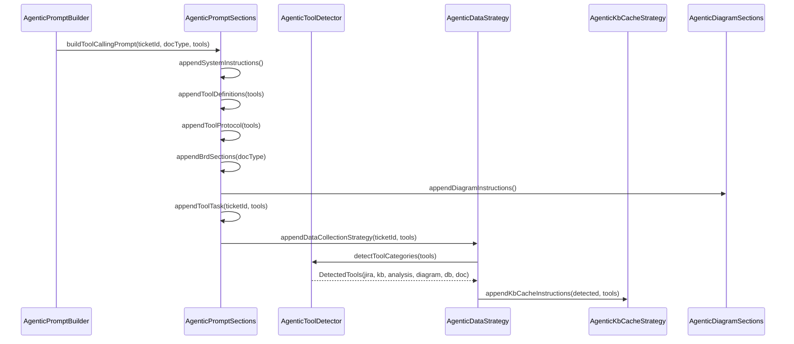

# Deep BRD Generation — Design

## Overview

Feature này cải thiện chất lượng BRD bằng cách thay đổi **prompt content** gửi cho AI agent. Kiến trúc core (AiBackendPipelineStrategy) **không thay đổi**. `AgenticLoopRunner` có thêm nudge retry mechanism, `ToolExecutionBridge` có thêm MCP client retry. Tất cả cải tiến chính nằm trong prompt building layer:

1. **Recursive Deep Exploration** — Thay thế 5-step strategy hiện tại bằng recursive exploration strategy với depth limit 3, max 30 tickets, visited set tracking, và priority-based exploration order.
2. **KB Cache Strategy** — Hướng dẫn AI agent kiểm tra Knowledge Base trước khi gọi Jira API, lưu kết quả mới vào KB cho lần sau.
3. **Draw.io Diagrams** — Cung cấp XML templates cho 4 loại diagram (Sequence, Class, Activity, Deployment) và hướng dẫn AI nhúng diagrams vào BRD sections phù hợp.
4. **Dynamic Tool Detection** — Phát hiện tool categories từ `List<ToolDescriptor>` bằng pattern matching, không hardcode tên tool.
5. **Prompt Size Management** — Truncation strategy cho continuation prompts khi collected data vượt 80,000 ký tự.

### Design Rationale

Tất cả thay đổi chính là **prompt-level** vì:
- AgenticLoopRunner đã có mechanism hoàn chỉnh: gửi prompt → parse tool call → execute → send continuation → lặp lại. Thay đổi duy nhất: thêm nudge retry khi AI bỏ qua tool calls (safety net, không thay đổi core loop logic)
- ToolExecutionBridge đã route được cả internal MCP tools (30 tools) và external MCP tools (KB, database). Thay đổi duy nhất: thêm 3s retry khi MCP client chưa ready (race condition lúc server startup)
- AI agent quyết định gọi tool nào dựa trên prompt instructions — thay đổi instructions = thay đổi behavior
- Không cần thay đổi loop logic hay tool routing

## Architecture

### Component Diagram



### Data Flow (Prompt Building)



### File Organization

Tất cả files nằm trong package `com.assistant.server.agent.ba.subprocess.pipeline.aibackend`:

| File | Lines (est.) | Responsibility |
|------|-------------|----------------|
| `AgenticToolDetector.kt` (new) | 95 | Pattern matching trên ToolDescriptor name, trả về DetectedTools with jira, kb, diagram, db, doc categories |
| `AgenticDataStrategy.kt` (modified) | 104 | Orchestrate: tool detection → KB cache → recursive exploration → final write |
| `AgenticKbCacheStrategy.kt` (new) | 67 | KB-first-Jira-fallback prompt instructions |
| `AgenticDiagramSections.kt` (new) | 170 | Dynamic tool-aware diagram instructions: prefers MCP diagram tool when available, falls back to inline draw.io XML templates |
| `AgenticPromptSections.kt` (modified) | 149 | `buildToolCallingPrompt` calls `detectToolCategories(tools)` and passes `DetectedTools` to `appendDiagramInstructions(detected)`, AS-IS/TO-BE guidance |
| `AgenticPromptBuilder.kt` (modified) | 143 | Prompt size management, truncation logic |

## Components and Interfaces

### 1. AgenticToolDetector — Dynamic Tool Detection

```kotlin
// AgenticToolDetector.kt (~80 lines)
package com.assistant.server.agent.ba.subprocess.pipeline.aibackend

import com.assistant.agent.models.ToolDescriptor

/**
 * Result of dynamic tool detection from available ToolDescriptors.
 * All fields contain actual tool names from the descriptor list.
 */
internal data class DetectedTools(
    val getIssueTool: String?,        // Jira get_issue tool
    val searchTool: String?,          // Jira search tool
    val analyzeTool: String?,         // analyze_ticket tool
    val getAnalysisTool: String?,     // get_ticket_analysis tool
    val kbSearchTool: String?,        // kb_search or kb_search_smart
    val kbReadTool: String?,          // kb_read
    val kbContextTool: String?,       // kb_context
    val kbIngestTool: String?,        // kb_ingest or kb_write
    val hasKbTools: Boolean,          // Any KB tool available
    val hasJiraTools: Boolean,        // Any Jira tool available
    val hasAnalysisTools: Boolean     // Any analysis tool available
)

/**
 * Detect tool categories from available ToolDescriptors.
 * Uses case-insensitive pattern matching on tool name only.
 * Deterministic: sorts by name first so input order is irrelevant.
 */
internal fun detectToolCategories(
    tools: List<ToolDescriptor>
): DetectedTools
```

**Algorithm**: Sort tools by name first (deterministic ordering), then scan with pattern matching:
- Jira tools: name contains `"get_issue"`, `"search"` + `"jira"`, `"analyze_ticket"`, `"get_ticket_analysis"`
- KB tools: name contains `"kb_search"`, `"kb_read"`, `"kb_context"`, `"kb_ingest"`, `"kb_write"`
- Prefer `kb_search_smart` over `kb_search` when both available

### 2. AgenticDataStrategy — Recursive Exploration Orchestration

```kotlin
// AgenticDataStrategy.kt (104 lines)

/** Constants defined as code, not hardcoded in prompt text. */
internal const val DEPTH_LIMIT = 3
internal const val MAX_TICKETS = 30

/**
 * New entry point replacing current appendDataCollectionStrategy.
 * Orchestrates: tool detection → KB cache → recursive exploration → BRD writing.
 */
internal fun StringBuilder.appendDataCollectionStrategy(
    ticketId: String,
    tools: List<ToolDescriptor>
)

// Delegates to sub-functions:
private fun StringBuilder.appendRecursiveExplorationInstructions(
    ticketId: String,
    detected: DetectedTools,
    tools: List<ToolDescriptor>
)

private fun StringBuilder.appendExplorationInit(
    ticketId: String,
    detected: DetectedTools
)

private fun StringBuilder.appendExplorationPriority()

private fun StringBuilder.appendDepthGuidelines()

private fun StringBuilder.appendExplorationLimits()

private fun StringBuilder.appendFinalWriteStep()
```

**Recursive Exploration Prompt Structure**:
1. **Preamble**: Explicit instruction "You MUST collect comprehensive data before writing. Do NOT write the BRD after just one tool call. Follow these steps IN ORDER."
2. **Initialize**: Directive "**START NOW:** Call `get_issue`..." to ensure AI model calls the tool immediately, then extract linked ticket IDs from response
3. **Maintain visited set**: Track explored ticket IDs to avoid cycles
4. **Priority order**: parent/epic → blocking/blocked-by → relates-to → sub-tasks → mentioned IDs
5. **Depth rules**: depth 0-1 = full details + attachments, depth 2+ = summary only
6. **Limits**: max 30 tickets total, depth limit 3
7. **Early termination**: Stop when no new tickets found

### 3. AgenticKbCacheStrategy — KB-First, Jira-Fallback

```kotlin
// AgenticKbCacheStrategy.kt (~90 lines)

/**
 * Append KB caching instructions when KB tools are available.
 * Strategy: kb_context → kb_search_smart → if insufficient → Jira API → kb_ingest
 */
internal fun StringBuilder.appendKbCacheInstructions(
    detected: DetectedTools,
    tools: List<ToolDescriptor>
)

private fun StringBuilder.appendKbLookupStep(detected: DetectedTools)

private fun StringBuilder.appendJiraFallbackStep(detected: DetectedTools)

private fun StringBuilder.appendKbSaveStep(detected: DetectedTools)
```

**KB Cache Flow** (per ticket):
1. Call `kb_context` (if available) for token-efficient briefing
2. Call `kb_search_smart` or `kb_search` with ticket ID as query
3. Evaluate result: has summary + description + requirements? → use KB data
4. If insufficient → call Jira `get_issue` → get full data
5. After Jira call → call `kb_ingest` or `kb_write` to cache for next time

**Fallback**: When `detected.hasKbTools == false`, skip KB instructions entirely → direct Jira calls (backward compatible).

### 4. AgenticDiagramSections — Dynamic Tool-Aware Diagram Instructions

```kotlin
// AgenticDiagramSections.kt

/**
 * Append diagram generation instructions dynamically based on available tools.
 * When a diagram MCP tool (e.g., draw.io) is available, instructs AI to PREFER
 * using the tool. Otherwise, falls back to inline draw.io XML generation.
 */
internal fun StringBuilder.appendDiagramInstructions(detected: DetectedTools)

// Dynamic strategy selection:
private fun StringBuilder.appendMcpDiagramInstructions(detected: DetectedTools)
private fun StringBuilder.appendInlineDiagramInstructions()
private fun StringBuilder.appendInlineXmlFallbackNote()

// XML templates (used for inline fallback only):
private fun StringBuilder.appendSequenceDiagramTemplate()
private fun StringBuilder.appendActivityDiagramTemplate()
private fun StringBuilder.appendActivityDiagramEndAndEdges()
private fun StringBuilder.appendDiagramPlacementRules()
private fun StringBuilder.appendDiagramFallbackRules()
```

**Dynamic Diagram Strategy**:

| Condition | Behavior |
|-----------|----------|
| `detected.hasDiagramTools == true` | "PREFER using `{diagramTool}` to generate diagrams" + fallback to inline XML |
| `detected.hasDiagramTools == false` | "Generate draw.io XML directly" with Activity + Sequence templates |

Both paths require at least 2 diagrams: Process Flow + System/Data diagram.

**Critical placement rule**: Diagrams MUST be embedded INSIDE the 7 standard BRD sections (not as separate `##` headings). `BrdResponseParser` only keeps the 7 standard sections — any content under non-standard headings is lost.

**Fallback**: When AI lacks data for a diagram type, output `[Diagram không khả dụng: thiếu dữ liệu về {topic}]` instead of empty/invalid XML.

### 5. AgenticPromptBuilder — Prompt Size Management

```kotlin
// AgenticPromptBuilder.kt (modified, ~130 lines)

/** Maximum total chars for collected tool results in continuation prompt. */
internal const val MAX_TOOL_RESULTS_CHARS = 80_000

/**
 * Updated buildStatelessContinuation with:
 * - Diagram instructions included
 * - Prompt size management with truncation
 */
fun buildStatelessContinuation(
    ticketId: String,
    docType: String,
    toolResults: List<String>
): String

/**
 * Truncate tool results to fit within MAX_TOOL_RESULTS_CHARS.
 * Strategy: keep latest result + main ticket data, truncate oldest first.
 * Adds annotation: "[TRUNCATED: N earlier tool results omitted]"
 */
internal fun truncateToolResults(
    toolResults: List<String>,
    maxChars: Int = MAX_TOOL_RESULTS_CHARS
): List<String>
```

**Truncation Algorithm**:
1. Calculate total chars of all tool results
2. If total ≤ `MAX_TOOL_RESULTS_CHARS` → return as-is
3. Always keep: first result (main ticket) + last result (latest)
4. Remove results from index 1 upward until under limit
5. Insert annotation at truncation point: `"[TRUNCATED: {N} earlier tool results omitted due to prompt size limit]"`

**Protected Sections** (never truncated):
- System instructions
- Tool definitions
- Tool protocol
- BRD structure
- Diagram instructions
- Main ticket data (first tool result)

### 6. AgenticPromptSections — Integration Point

```kotlin
// AgenticPromptSections.kt (modified, 149 lines)

/**
 * Updated buildToolCallingPrompt — adds appendDiagramInstructions()
 * between appendBrdSections and appendToolTask.
 */
internal fun AgenticPromptBuilder.buildToolCallingPrompt(
    ticketId: String,
    docType: String,
    tools: List<ToolDescriptor>
): String = buildString {
    appendSystemInstructions()
    appendLine()
    appendToolDefinitions(tools)
    appendLine()
    appendToolProtocol(tools)
    appendLine()
    appendBrdSections(docType)  // includes AS-IS vs TO-BE guidance
    appendLine()
    appendDiagramInstructions()  // NEW
    appendLine()
    appendToolTask(ticketId, tools)
}

/**
 * Updated appendBrdSections — adds appendProcessGuidance() after
 * sub-section hints to explicitly instruct AI about AS-IS vs TO-BE:
 * - "Existing Processes" = AS-IS (current process before change)
 * - "Project Requirements > Process Overview" = TO-BE (proposed process after change)
 */
private fun StringBuilder.appendProcessGuidance()

/**
 * Updated appendToolTask — uses new appendDataCollectionStrategy
 * with full tools list for dynamic detection.
 */
internal fun StringBuilder.appendToolTask(
    ticketId: String,
    tools: List<ToolDescriptor>
)
```

## Data Models

### DetectedTools

```kotlin
internal data class DetectedTools(
    val getIssueTool: String?,
    val searchTool: String?,
    val analyzeTool: String?,
    val getAnalysisTool: String?,
    val kbSearchTool: String?,
    val kbReadTool: String?,
    val kbContextTool: String?,
    val kbIngestTool: String?,
    val diagramTool: String?,         // draw.io / diagram generation tool
    val dbQueryTool: String?,         // SQL / database query tool
    val docConvertTool: String?,      // markitdown / document conversion tool
    val hasKbTools: Boolean,
    val hasJiraTools: Boolean,
    val hasAnalysisTools: Boolean,
    val hasDiagramTools: Boolean,     // Any diagram tool available
    val hasDbTools: Boolean,          // Any database tool available
    val hasDocConvertTools: Boolean   // Any document conversion tool available
)
```

### Constants

```kotlin
// AgenticDataStrategy.kt
internal const val DEPTH_LIMIT = 3
internal const val MAX_TICKETS = 30

// AgenticPromptBuilder.kt
internal const val MAX_TOOL_RESULTS_CHARS = 80_000
```

### Existing Models (unchanged)

- `ToolDescriptor(name: String, description: String, parameterNames: List<String>)` — Input for tool detection
- `AgenticLoopConfig` — Loop configuration (unchanged)
- `AgenticLoopResult` — Loop output (unchanged)
- `ToolRequest` — Parsed tool call from AI response (unchanged)

### Tool Detection Patterns

| Category | Pattern on `name` (case-insensitive) | Example Match |
|----------|--------------------------------------|---------------|
| Jira get_issue | contains `"get_issue"` | `mcp_jira_get_issue` |
| Jira search | contains `"search"` AND `"jira"` | `mcp_jira_search_jira` |
| Analyze ticket | contains `"analyze_ticket"` | `mcp_jira_analyze_ticket` |
| Get analysis | contains `"get_ticket_analysis"` | `mcp_jira_get_ticket_analysis` |
| KB search smart | contains `"kb_search_smart"` | `mcp_knowledge_base_kb_search_smart` |
| KB search | contains `"kb_search"` (not smart) | `mcp_knowledge_base_kb_search` |
| KB read | contains `"kb_read"` | `mcp_knowledge_base_kb_read` |
| KB context | contains `"kb_context"` | `mcp_knowledge_base_kb_context` |
| KB ingest | contains `"kb_ingest"` | `mcp_knowledge_base_kb_ingest` |
| KB write | contains `"kb_write"` | `mcp_knowledge_base_kb_write` |


## Correctness Properties

*A property is a characteristic or behavior that should hold true across all valid executions of a system — essentially, a formal statement about what the system should do. Properties serve as the bridge between human-readable specifications and machine-verifiable correctness guarantees.*

### Property 1: Recursive exploration prompt completeness

*For any* valid ticketId and any tools list containing at least one Jira tool (name contains "get_issue"), the output of `appendDataCollectionStrategy(ticketId, tools)` SHALL contain all recursive exploration elements: depth tracking instructions, visited set maintenance, attachment reading for linked tickets, priority-based exploration order (parent → blocking → relates-to → subtasks → mentioned), early termination condition, depth-based summarization rules (depth ≥ 2 = summary only), and data priority ordering.

**Validates: Requirements 1.1, 1.2, 1.3, 1.5, 1.6, 6.1, 6.2**

### Property 2: KB cache prompt completeness

*For any* tools list containing at least one KB tool (name contains "kb_search" or "kb_read"), the output of `appendDataCollectionStrategy(ticketId, tools)` SHALL contain complete KB cache instructions: KB lookup step (search KB first), data evaluation criteria (sufficient vs insufficient), Jira fallback step, KB save step (ingest after Jira call), and actual detected KB tool names from the input list.

**Validates: Requirements 2.1, 2.3, 2.4, 2.5, 2.7**

### Property 3: Tool detection correctness

*For any* list of ToolDescriptors containing tools with KB patterns (name contains "kb_search", "kb_read", "kb_ingest", "kb_write", "kb_context" in any case), `detectToolCategories(tools)` SHALL correctly identify those tools in the corresponding DetectedTools fields, using case-insensitive matching. Similarly for Jira patterns ("get_issue", "search" + "jira", "analyze_ticket") and analysis patterns ("get_ticket_analysis").

**Validates: Requirements 2.2, 3.1, 3.4**

### Property 4: Tool detection determinism

*For any* list of ToolDescriptors, calling `detectToolCategories(tools)` SHALL produce the same DetectedTools result regardless of the ordering of tools in the input list. Specifically, `detectToolCategories(tools) == detectToolCategories(tools.shuffled())` for any permutation.

**Validates: Requirements 3.5**

### Property 5: KB fallback backward compatibility

*For any* tools list that does NOT contain any KB tools (no tool name contains "kb_search", "kb_read", "kb_ingest", "kb_write", "kb_context"), the output of `appendDataCollectionStrategy(ticketId, tools)` SHALL NOT contain KB-specific instructions (no "kb_search", "kb_read", "kb_ingest" references) and SHALL contain direct Jira call instructions, producing behavior equivalent to the current strategy.

**Validates: Requirements 2.6, 7.1**

### Property 6: No hardcoded tool names in prompt

*For any* tools list, every tool name referenced in the output of `appendDataCollectionStrategy(ticketId, tools)` (excluding generic pattern descriptions) SHALL be present in the input tools list. The prompt SHALL NOT contain hardcoded tool names like `"mcp_jira_get_issue"` — only actual names from the ToolDescriptor list.

**Validates: Requirements 3.3**

### Property 7: Draw.io XML template validity

*For each* of the 4 draw.io XML templates embedded in `appendDiagramInstructions()` output, the XML SHALL be well-formed with: (a) `<mxGraphModel>` as root element, (b) every `<mxCell>` having a unique `id` attribute, (c) every `<mxCell>` with `edge="1"` having `source` and `target` attributes that reference `id` values of other `<mxCell>` elements in the same template.

**Validates: Requirements 4.2, 4.4, 4.8**

### Property 8: Prompt section ordering

*For any* valid ticketId, docType, and non-empty tools list, the output of `buildToolCallingPrompt(ticketId, docType, tools)` SHALL contain BRD section headings appearing before diagram instructions, which appear before the data collection strategy section. The ordering invariant is: `indexOf("BRD STRUCTURE") < indexOf("DIAGRAM") < indexOf("DATA COLLECTION")`.

**Validates: Requirements 5.3**

### Property 9: Continuation prompt includes diagram instructions

*For any* valid ticketId, docType, and list of tool results, the output of `buildStatelessContinuation(ticketId, docType, toolResults)` SHALL contain diagram instruction keywords, ensuring the AI agent retains diagram generation requirements across multiple tool call iterations.

**Validates: Requirements 5.7**

### Property 10: Truncation preserves size limit and key data

*For any* list of 2+ tool result strings whose combined length exceeds `MAX_TOOL_RESULTS_CHARS` (80,000), `truncateToolResults(toolResults)` SHALL return a list where: (a) the combined length of all elements is ≤ `MAX_TOOL_RESULTS_CHARS`, (b) the first element (main ticket data) is preserved, (c) the last element (latest tool result) is preserved, and (d) a truncation annotation is included.

**Validates: Requirements 6.3, 6.4**

### Property 11: Protected sections invariant

*For any* valid inputs (ticketId, docType, toolResults of any size including very large), the output of `buildStatelessContinuation(ticketId, docType, toolResults)` SHALL always contain: system/context instructions, tool definitions section, tool protocol section, BRD structure section, and diagram instructions. These sections are never truncated regardless of tool results size.

**Validates: Requirements 6.5**

### Property 12: KB tools not excluded by filter

*For any* ToolDescriptor whose name contains KB patterns ("kb_search", "kb_read", "kb_ingest", "kb_write", "kb_context", "kb_search_smart"), `filterExcludedTools(listOf(tool))` SHALL include that tool in the output. KB tool names do not match any pattern in `EXCLUDED_PATTERNS`.

**Validates: Requirements 7.5**

## Error Handling

### Tool Detection Errors

| Scenario | Handling |
|----------|----------|
| Empty tools list | `detectToolCategories` returns DetectedTools with all fields null/false. Strategy falls back to direct prompt (no tools). |
| Tools with empty names | Pattern matching on empty string returns no match. Tool is ignored in detection. |
| Duplicate tool names | First match wins (sorted order). No error — duplicates are harmless. |
| Tools with very long names | Pattern matching still works. No truncation of tool names. |

### Prompt Size Errors

| Scenario | Handling |
|----------|----------|
| Single tool result > 80,000 chars | `truncateToolResults` keeps it (can't split a single result). Prompt may be large but functional. |
| Zero tool results | No truncation needed. Prompt contains only static sections. |
| All tool results are empty strings | Total size = 0, no truncation. Prompt is valid. |

### XML Template Errors

| Scenario | Handling |
|----------|----------|
| AI generates invalid XML | Not our code's problem — templates in prompt are valid. AI output parsing is handled by existing BrdResponseParser. |
| AI skips diagrams | Acceptable — recursive exploration is prompt guidance, not enforced logic. Loop completes normally (Req 7.6). |

### Backward Compatibility Errors

| Scenario | Handling |
|----------|----------|
| No KB tools available | Strategy omits KB instructions entirely. Direct Jira calls only. |
| No Jira tools available | Strategy omits Jira instructions. KB-only mode if KB tools present, or direct generation prompt if no tools at all. |
| No tools at all | `buildInitialPrompt` falls through to `buildDirectGenerationPrompt` (existing behavior, unchanged). |

## Testing Strategy

### Property-Based Tests (Kotest + Arbs)

The project uses Kotlin with Kotest for testing. Property-based tests will use **Kotest property testing** (`io.kotest.property`) with **20 iterations** per property.

**Test file**: `server/src/jvmTest/kotlin/com/assistant/server/agent/ba/subprocess/pipeline/aibackend/DeepBrdGenerationPropertyTest.kt`

Each property test references its design document property:

```kotlin
// Feature: deep-brd-generation, Property 1: Recursive exploration prompt completeness
// Feature: deep-brd-generation, Property 3: Tool detection correctness
// Feature: deep-brd-generation, Property 4: Tool detection determinism
// etc.
```

**Generators needed**:
- `Arb.string()` for ticketId (format: `"PROJ-{1..9999}"`)
- `Arb.list(toolDescriptorArb)` for random tool lists
- Custom `toolDescriptorArb` generating ToolDescriptor with realistic names (mix of KB, Jira, analysis, and unrelated tools)
- `Arb.string()` for tool result strings of varying sizes (for truncation tests)

**Properties to implement as PBT** (12 properties from Correctness Properties section):
1. Recursive exploration prompt completeness
2. KB cache prompt completeness
3. Tool detection correctness
4. Tool detection determinism
5. KB fallback backward compatibility
6. No hardcoded tool names
7. Draw.io XML template validity
8. Prompt section ordering
9. Continuation includes diagrams
10. Truncation preserves limits and key data
11. Protected sections invariant
12. KB tools not excluded by filter

### Unit Tests (Example-Based)

**Test file**: `server/src/jvmTest/kotlin/com/assistant/server/agent/ba/subprocess/pipeline/aibackend/DeepBrdGenerationUnitTest.kt`

| Test | What it verifies |
|------|-----------------|
| `DEPTH_LIMIT equals 3` | Constant value (Req 1.4) |
| `MAX_TICKETS equals 30` | Constant value (Req 1.7) |
| `MAX_TOOL_RESULTS_CHARS equals 80000` | Constant value (Req 6.3) |
| `appendDiagramInstructions contains 4 diagram types` | All 4 types present (Req 4.1) |
| `diagram XML templates are parseable` | Each template parses as valid XML (Req 4.4) |
| `diagram placement rules map to BRD sections` | Correct section mapping (Req 4.5) |
| `diagram fallback text pattern present` | Contains "[Diagram không khả dụng...]" (Req 4.7) |
| `new appendDataCollectionStrategy accepts tools param` | API compatibility (Req 1.8) |

### Integration Tests

| Test | What it verifies |
|------|-----------------|
| `buildInitialPrompt with real tool list` | End-to-end prompt building with realistic tools |
| `buildStatelessContinuation with large data` | Truncation works in full prompt context |
| `existing AgenticPromptBuilder tests still pass` | Backward compatibility (Req 7.7) |

### Test Configuration

- Property tests: **20 iterations** per property (reduced from 100 for faster execution)
- All tests run with `./gradlew :server:jvmTest`
- No external dependencies needed (all tests use in-memory string operations)
