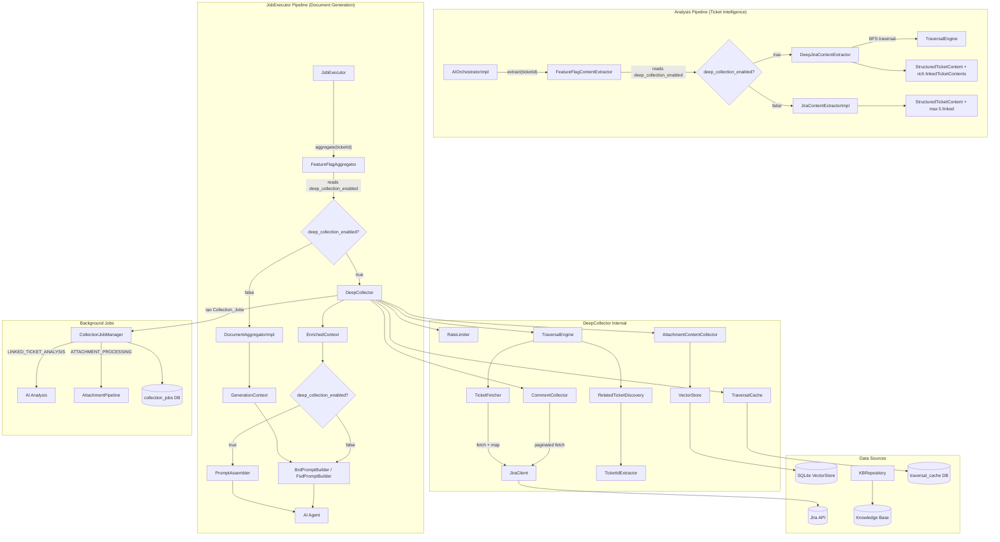
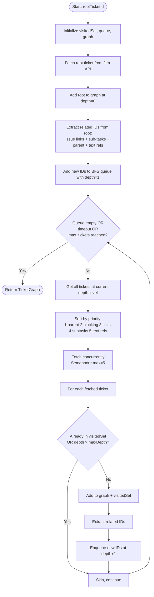
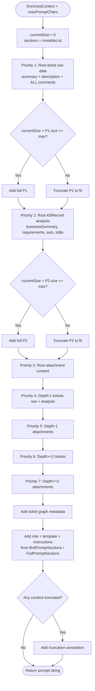
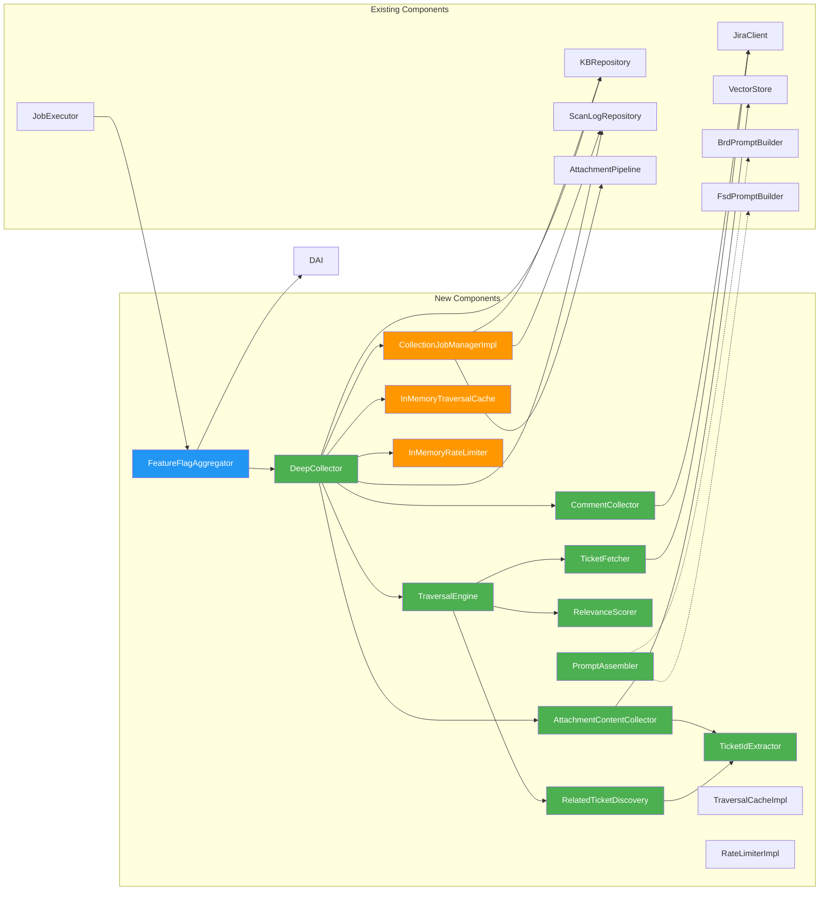
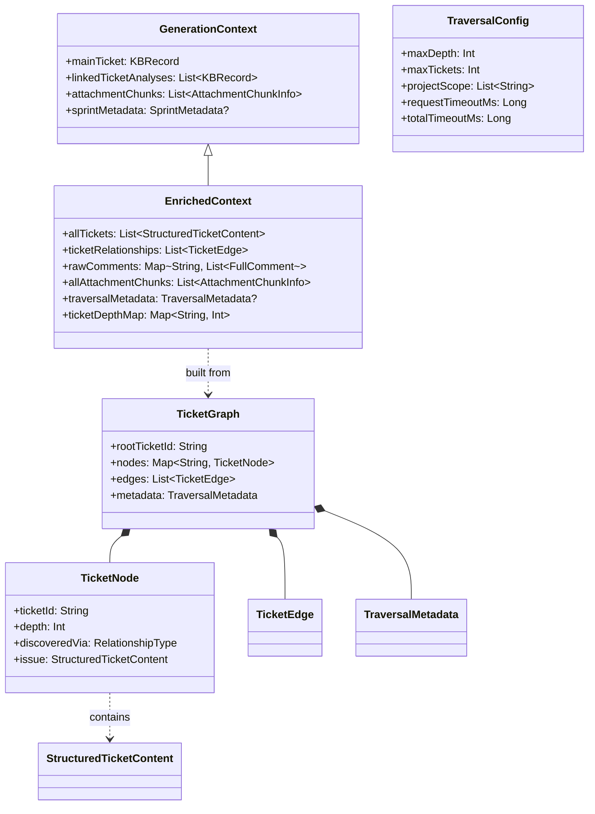
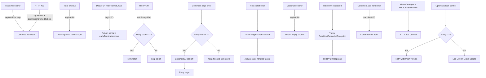

# Deep Ticket Data Collection — Design

## Overview

### Mục tiêu

Thiết kế hệ thống **Deep Ticket Data Collection** thay thế `DocumentAggregatorImpl` hiện tại, giải quyết 4 vấn đề mất dữ liệu nghiêm trọng:

1. **Comments bị cắt** (chỉ 20 comment cuối) → Thu thập TẤT CẢ comments qua Jira API pagination
2. **Attachment chỉ có metadata** (top-10 semantic search) → Lấy TẤT CẢ chunks từ VectorStore theo ticketId
3. **Linked tickets bị giới hạn** (1 level, max 5/20) → BFS traversal đệ quy với cycle detection
4. **Text references bị bỏ qua** → Regex extraction ticket IDs từ mọi text field

### Phạm vi thay đổi

- **Thêm mới**: `DeepCollector` (+ `DeepCollectorPhases`, `DeepCollectorContext`, `DeepCollectorLogging`), `TraversalEngine` (+ `TraversalState`, `TicketFetcher`, `RelatedTicketDiscovery`, `RelevanceScorer`), `TicketIdExtractor`, `CommentCollector`, `AttachmentContentCollector`, `PromptAssembler` (+ `PromptAssemblyLogic`, `PromptSectionBuilder`, `PromptSectionHelpers`, `PromptPriorityConfig`), `EnrichedContext` (+ `EnrichedContextSerializer`), `TraversalConfig`, `CollectionJobManager` (+ `CollectionJobManagerImpl`, `CollectionJobExecutor`, `CollectionJobItemUpdater`), `CollectionJobRepository` interface (+ `PgCollectionJobRepository` JDBC production impl, `InMemoryCollectionJobRepository` test impl), `TraversalCache` interface (+ `TraversalCacheImpl`, `TraversalCacheRepository`, `InMemoryTraversalCache`), `RateLimiter` interface (+ `RateLimiterImpl`, `RateLimitRepository`, `InMemoryRateLimiter`), `FeatureFlagAggregator`, `DeepCollectionSettings`, `DeepCollectionModule` (Koin DI), `DeepJiraContentExtractor` (BFS-based analysis extraction, maxDepth=20, maxTickets=1000, timeout=600s, disableEarlyTermination=true — for map-reduce pipeline), `FeatureFlagContentExtractor` (switches deep/legacy extraction based on feature flag)
- **Mở rộng**: `JiraClient` (thêm `getIssueComments` với default implementation), `GenerationContext` (từ `data class` → `open class` với manual `copy()`/`equals()`/`hashCode()`), `AnalysisRoutes` (conflict resolution check + preemption), `JobExecutor` (PromptAssembler integration + source ticket IDs from TicketGraph), `ServerModule` (includes `deepCollectionModule`, wires `FeatureFlagContentExtractor` as `JiraContentExtractor`), `PostgresModule` (registers `PgCollectionJobRepository` as `CollectionJobRepository`)
- **Thay thế**: `DocumentAggregatorImpl` → `DeepCollector` (qua `FeatureFlagAggregator` + feature flag), `JiraContentExtractorImpl` → `DeepJiraContentExtractor` (qua `FeatureFlagContentExtractor` + feature flag)
- **Giữ nguyên**: `BrdPromptBuilder`, `FsdPromptBuilder` (backward compatible)
- **API mới**: `GET /api/collection-jobs?ticketId={}`, `GET /api/collection-jobs/active` (+ `PgCollectionJobRepository`, `PgCollectionJobSql`, `CollectionJobRoutes`)
- **Frontend mới**: `CollectionJobPanel`, `CollectionJobPoller`, `ConflictBannerManager`, `CollectionJobModels` (frontend DTOs), HTML templates + CSS cho monitoring panel và conflict banners

### Quyết định thiết kế chính

| Quyết định | Lựa chọn | Lý do |
|---|---|---|
| Traversal algorithm | BFS (Breadth-First Search) | Ưu tiên tickets gần root trước, phù hợp priority-based truncation |
| Concurrency model | Kotlin coroutines + Semaphore(5) | Native Kotlin, không cần thêm dependency, kiểm soát rate limit |
| Feature toggle | Runtime setting `deep_collection_enabled` via `FeatureFlagAggregator` | Rollback không cần restart, tương thích cơ chế settings hiện tại |
| Context model | `EnrichedContext` extends `GenerationContext` (regular class, not data class) | Backward compatible, Liskov Substitution Principle. Dùng surrogate serializer pattern do kotlinx.serialization không hỗ trợ duplicate serial names khi subclass override parent properties |
| Prompt strategy | Priority-based truncation | Giữ thông tin quan trọng nhất khi vượt context window |
| Background jobs | Collection_Job_Manager + DB persistence | Tách công việc nặng (linked analysis, attachment processing) ra background, trả kết quả nhanh |
| Traversal cache | Dual implementation: `InMemoryTraversalCache` (runtime default) + `TraversalCacheImpl` (DB-backed via `TraversalCacheRepository`) | In-memory cho single-instance, DB-backed cho multi-instance |
| Rate limiting | Dual implementation: `InMemoryRateLimiter` (runtime default) + `RateLimiterImpl` (DB-backed via `RateLimitRepository`) | In-memory cho single-instance, DB-backed cho multi-instance |
| Concurrency | Dual semaphores (Jira API=5 + AI=3) via Koin named qualifiers | Jira calls và AI calls không block lẫn nhau |
| TraversalEngine decomposition | 5 files: `TraversalEngine`, `TraversalState`, `TicketFetcher`, `RelatedTicketDiscovery`, `RelevanceScorer` | Tuân thủ 200-line file limit, SRP |
| DeepCollector decomposition | 4 files: `DeepCollector`, `DeepCollectorPhases`, `DeepCollectorContext`, `DeepCollectorLogging` | Tuân thủ 200-line file limit, SRP |
| PromptAssembler decomposition | 5 files: `PromptAssembler`, `PromptAssemblyLogic`, `PromptSectionBuilder`, `PromptSectionHelpers`, `PromptPriorityConfig` | Tuân thủ 200-line file limit, SRP |
| Conflict resolution | KB-First + manual preemption | Tránh duplicate work giữa manual analysis và background jobs |
| Relevance scoring | Multi-factor scoring (depth, type, recency, status) | Truncation thông minh hơn — giữ tickets quan trọng nhất |
| Analysis deep traversal | `DeepJiraContentExtractor` reuses `TraversalEngine` with high-limit config (maxDepth=20, maxTickets=1000, timeout=600s) | Map-reduce mode: early termination disabled (`disableEarlyTermination=true`), data split into batches by `MapReduceOrchestrator`. Feature flag switching qua `FeatureFlagContentExtractor` |

## Architecture

### Tổng quan kiến trúc



### Luồng dữ liệu chi tiết

```mermaid
sequenceDiagram
    participant JE as JobExecutor
    participant DC as DeepCollector
    participant TE as TraversalEngine
    participant TIE as TicketIdExtractor
    participant CC as CommentCollector
    participant ACC as AttachmentContentCollector
    participant JC as JiraClient
    participant VS as VectorStore
    participant KB as KBRepository
    participant CJM as CollectionJobManager
    participant CJD as CollectionJobDB
    participant AIAgent2 as AI Analysis
    participant AP as AttachmentPipeline
    participant SLR as ScanLogRepository

    JE->>DC: aggregate(ticketId)
    DC->>DC: Load TraversalConfig
    DC->>DC: Log "Deep collection started"

    rect rgb(255, 230, 230)
        Note over DC: Phase 0: Rate Limit + Cache Check
        DC->>DC: RateLimiter.check(userId) — reject if > 10/hour
        DC->>DC: TraversalCache.get(rootTicketId)
        alt Cache hit (within TTL + root updated_at unchanged)
            DC->>DC: Reuse cached TicketGraph
            DC->>DC: Log "Reusing cached TicketGraph"
        else Cache miss or expired
            Note over DC,JC: Phase 1: BFS Traversal (5-25%)
            DC->>TE: traverse(rootTicketId, config)
            TE->>JC: getIssueDetails(rootTicketId)
            JC-->>TE: JiraIssue
            TE->>TE: Compute relevance score for root
            TE->>TIE: extract(summary + description)
            TIE-->>TE: List TicketId
            loop BFS levels (depth 1..max_depth)
                TE->>TE: Check early termination (data > 3× maxPromptChars?)
                TE->>TE: Collect next level ticket IDs
                par Concurrent fetch (jiraApiSemaphore, max 5)
                    TE->>JC: getIssueDetails(ticketId_1)
                    TE->>JC: getIssueDetails(ticketId_2)
                    TE->>JC: getIssueDetails(ticketId_N)
                end
                TE->>TE: Track 403 → permissionDeniedTickets
                TE->>TE: Compute relevance scores
                TE->>TIE: extract IDs from fetched tickets
            end
            TE-->>DC: TicketGraph
            DC->>DC: TraversalCache.put(rootTicketId, graph)
        end
    end
        end
        TE-->>DC: TicketGraph
    end

    rect rgb(255, 245, 230)
        Note over DC,VS: Phase 2: Collect Comments & Attachments (25-30%)
        par For each ticket in graph
            DC->>CC: collectAll(ticketId, maxCommentsPerTicket)
            CC->>JC: getIssueComments(ticketId, startAt=0)
            loop Pagination (capped at max_comments_per_ticket)
                JC-->>CC: JiraCommentResponse (page)
                CC->>TIE: extract IDs from comment bodies
            end
            CC-->>DC: List FullComment
        and
            DC->>ACC: collectAll(ticketId)
            ACC->>VS: findByTicketId(ticketId)
            VS-->>ACC: List AttachmentChunk
            ACC->>TIE: extract IDs from chunk text
            ACC-->>DC: List AttachmentChunk (deduplicated)
        end
    end

    rect rgb(230, 255, 230)
        Note over DC,KB: Phase 3: Build EnrichedContext + Create Background Jobs
        DC->>KB: findByTicketId (for each ticket)
        KB-->>DC: KBRecord? (optional bonus data)
        DC->>DC: Build EnrichedContext
        DC->>CJM: createJobs(ticketGraph, missingKBTickets, unprocessedAttachments)
        CJM->>CJD: Persist Collection_Jobs (QUEUED)
        DC-->>JE: EnrichedContext (immediate return)
    end

    rect rgb(245, 230, 255)
        Note over CJM: Phase 4: Background Processing (async)
        par LINKED_TICKET_ANALYSIS
            CJM->>CJM: For each linked ticket without KBRecord
            CJM->>CJM: KB-First check (skip if already in KB)
            CJM->>AIAgent2: analyze(ticket)
            AIAgent2-->>CJM: KBRecord
            CJM->>KB: save(KBRecord)
            CJM->>SLR: addEntry(COMPLETED)
        and ATTACHMENT_PROCESSING
            CJM->>CJM: For each unprocessed attachment
            CJM->>AP: processSingleAttachment(attachment)
            AP-->>CJM: chunks saved
            CJM->>SLR: addEntry(COMPLETED)
        end
    end
```

## Components and Interfaces

### 1. TraversalConfig — Cấu hình traversal

```kotlin
// Package: com.assistant.server.document.models
@Serializable
data class TraversalConfig(
    val maxDepth: Int = 5,          // 1..20, clamp ngoài phạm vi (mở rộng bởi map-reduce-analysis)
    val maxTickets: Int = 50,       // 1..1000, clamp ngoài phạm vi (mở rộng bởi map-reduce-analysis)
    val projectScope: List<String> = emptyList(), // empty = all projects
    val requestTimeoutMs: Long = 10_000,
    val totalTimeoutMs: Long = 120_000,
    val maxConcurrency: Int = 5,
    val commentPageSize: Int = 50,
    val maxPromptChars: Int = 100_000,
    val maxCommentsPerTicket: Int = 200,  // 10..1000, Req 3.7
    val cacheTtlMinutes: Int = 60,        // 5..1440, Req 15.2
    val disableEarlyTermination: Boolean = false  // map-reduce mode skips early termination
) {
    /** Clamp values to valid ranges, log warnings for out-of-range. */
    fun validated(): TraversalConfig = copy(
        maxDepth = maxDepth.coerceIn(1, 20),
        maxTickets = maxTickets.coerceIn(1, 1000),
        maxCommentsPerTicket = maxCommentsPerTicket.coerceIn(10, 1000),
        cacheTtlMinutes = cacheTtlMinutes.coerceIn(5, 1440)
    )
}
```

### 2. TicketIdExtractor — Pure function trích xuất ticket IDs

```kotlin
// Package: com.assistant.server.document.extraction
object TicketIdExtractor {
    // Regex: 1+ uppercase letters, dash, 1+ digits
    private val TICKET_ID_PATTERN = Regex("[A-Z][A-Z0-9]+-\\d+")

    /**
     * Extract ticket IDs from text. Pure function — no I/O.
     * @param text Input text to scan
     * @param excludeIds IDs to exclude (self-reference, already visited)
     * @param projectScope Allowed project keys (empty = all)
     * @return Deduplicated, filtered list of ticket IDs
     */
    fun extract(
        text: String,
        excludeIds: Set<String> = emptySet(),
        projectScope: List<String> = emptyList()
    ): List<String>

    /** Extract project key from ticket ID (e.g., "ICL2-100" → "ICL2"). */
    internal fun projectKey(ticketId: String): String
}
```

### 3. TraversalEngine — BFS traversal với cycle detection

```kotlin
// Package: com.assistant.server.document.traversal
// Decomposed into 5 files: TraversalEngine.kt, TraversalState.kt,
// TicketFetcher.kt, RelatedTicketDiscovery.kt, RelevanceScorer.kt

class TraversalEngine(
    private val ticketFetcher: TicketFetcher,  // Abstraction over JiraClient + JiraFieldMappers
    private val config: TraversalConfig,
    private val jiraApiSemaphore: Semaphore  // Req 10.6 — shared Jira API semaphore
) {
    /**
     * BFS traversal từ rootTicketId, trả về TicketGraph.
     * - Concurrent fetch per BFS level (jiraApiSemaphore)
     * - Cycle detection via visitedSet
     * - Respects max_depth, max_tickets, total_timeout
     * - Priority: parent > blocking > other links > sub-tasks > text refs
     * - Relevance scoring per node (Req 1.9)
     * - 403 tracking → permissionDeniedTickets (Req 1.10)
     * - Early termination when data > 3× maxPromptChars (Req 7.6)
     */
    suspend fun traverse(rootTicketId: String): TicketGraph

    /**
     * Compute relevance score for a TicketNode (Req 1.9).
     * Factors: depth (closer=higher), relationship type weight,
     * recency (recently updated=higher), status (active>closed).
     */
    internal fun computeRelevanceScore(node: TicketNode): Double
}
```

**Thuật toán BFS chi tiết:**



### 4. CommentCollector — Thu thập toàn bộ comments qua pagination

```kotlin
// Package: com.assistant.server.document.collection
class CommentCollector(
    private val jiraClient: JiraClient,
    private val config: TraversalConfig
) {
    /**
     * Fetch ALL comments for a ticket via Jira API pagination.
     * - Page size: config.commentPageSize (default 50)
     * - Cap: config.maxCommentsPerTicket (default 200, Req 3.7)
     *   → Lấy N comments gần nhất, log warning nếu total > cap
     * - Retry: max 2 retries with exponential backoff per page
     * - Partial success: keep fetched comments on page failure
     * - Returns comments sorted chronologically (oldest first)
     */
    suspend fun collectAll(ticketId: String): CommentCollectionResult
}

@Serializable
data class FullComment(
    val author: String,
    val createdDate: String,
    val updatedDate: String = "",
    val body: String  // Full text, no truncation
)

data class CommentCollectionResult(
    val comments: List<FullComment>,
    val totalReported: Int,
    val totalFetched: Int,
    val hasPartialFailure: Boolean = false
)
```

### 5. AttachmentContentCollector — Thu thập toàn bộ attachment chunks

```kotlin
// Package: com.assistant.server.document.collection
class AttachmentContentCollector(
    private val vectorStore: VectorStore,
    private val ticketIdExtractor: TicketIdExtractor
) {
    /**
     * Fetch ALL attachment chunks for a ticket from VectorStore.
     * - Uses findByTicketId (not semantic search)
     * - Groups by filename, sorts by chunkIndex
     * - Deduplicates by attachmentId across tickets
     * - Extracts ticket IDs from chunk text for further traversal
     */
    suspend fun collectAll(ticketId: String): AttachmentCollectionResult
}

data class AttachmentCollectionResult(
    val chunks: List<AttachmentChunk>,
    val discoveredTicketIds: List<String>
)
```

### 6. DeepCollector — Orchestrator chính (implements DocumentAggregator)

```kotlin
// Package: com.assistant.server.document
class DeepCollector(
    private val jiraClientProvider: () -> JiraClient,  // Lambda — fresh client per request (avoids stale auth tokens)
    private val kbRepository: KBRepository,
    private val vectorStore: VectorStore,
    private val scanLogRepository: ScanLogRepository,
    private val configProvider: () -> TraversalConfig,
    private val traversalCache: TraversalCache,           // Req 15
    private val rateLimiter: RateLimiter,                 // Req 16.1
    private val collectionJobManager: CollectionJobManager, // Req 13
    private val jiraApiSemaphore: Semaphore,              // Req 10.6
    private val aiAnalysisSemaphore: Semaphore            // Req 10.6
) : DocumentAggregator {

    // Collection-level lock: coalesce concurrent requests for same root ticket (Req 10.7)
    private val activeLocks = ConcurrentHashMap<String, Deferred<GenerationContext>>()

    /**
     * Main entry point — replaces DocumentAggregatorImpl.aggregate().
     * Returns EnrichedContext (subtype of GenerationContext).
     *
     * Phases:
     * 0. Rate limit check + cache check (Req 15, 16.1)
     * 1. BFS Traversal → TicketGraph (with early termination Req 7.6)
     * 2. Collect comments (capped at maxCommentsPerTicket) + attachments
     * 3. Build EnrichedContext + create Collection_Jobs for background work
     *
     * Progress callback: (progressPercent: Int, phase: String) -> Unit (Req 8.3)
     * Maps to AGGREGATING_DATA phase (0-30%) in document-job-manager.
     */
    override suspend fun aggregate(ticketId: String): GenerationContext

    /**
     * Aggregate with progress callback for document-job-manager integration (Req 8.3).
     */
    suspend fun aggregate(
        ticketId: String,
        progressCallback: ((progressPercent: Int, phase: String) -> Unit)? = null
    ): GenerationContext
}
```

### 7. PromptAssembler — Xây dựng prompt với quản lý kích thước

```kotlin
// Package: com.assistant.server.document.prompt
object PromptAssembler {
    /**
     * Build prompt from EnrichedContext with priority-based truncation.
     *
     * Priority order phụ thuộc docType (Req 6.9):
     *
     * **BRD priority** (business-first):
     * 1. Root ticket raw data (summary, description, full comments)
     * 2. Root ticket KBRecord analysis (businessSummary, extractedRequirements)
     * 3. Depth-1 tickets raw data + analysis (stakeholder discussions)
     * 4. Root ticket attachment content
     * 5. Depth-1 attachment content
     * 6. Depth>=2 tickets raw data + analysis
     * 7. Depth>=2 attachment content
     *
     * **FSD priority** (technical-first):
     * 1. Root ticket raw data (summary, description, full comments)
     * 2. Root ticket attachment content (design docs, wireframes, API specs)
     * 3. Root ticket KBRecord analysis
     * 4. Depth-1 tickets raw data + analysis (technical details)
     * 5. Depth-1 attachment content
     * 6. Depth>=2 tickets raw data + analysis
     * 7. Depth>=2 attachment content
     *
     * Within each priority level, tickets sorted by relevance score (Req 1.9).
     * Truncation: cut from lowest priority first.
     * Annotation: "[TRUNCATED: N tickets, M chunks removed]"
     */
    fun buildPrompt(
        context: EnrichedContext,
        maxPromptChars: Int,
        docType: String
    ): String
}
```

**Thuật toán Prompt Assembly:**



### 8. JiraClient Extension — Thêm comment pagination API

```kotlin
// Mở rộng interface JiraClient — sử dụng default implementation
// để không break 14+ existing JiraClient implementations
interface JiraClient {
    // ... existing methods ...

    /**
     * Fetch comments for an issue with pagination.
     * Default implementation returns empty response — overridden in JiraRestClient.
     */
    suspend fun getIssueComments(
        issueKey: String,
        startAt: Int = 0,
        maxResults: Int = 50
    ): JiraCommentPageResponse = JiraCommentPageResponse()
}

@Serializable
data class JiraCommentPageResponse(
    val startAt: Int = 0,
    val maxResults: Int = 50,
    val total: Int = 0,
    val comments: List<JiraComment> = emptyList()
)
```

### 8b. FeatureFlagAggregator — Runtime feature flag switching (Req 12.1, 12.2)

```kotlin
// Package: com.assistant.server.document
// NOT in original design — added during implementation for clean feature flag switching
class FeatureFlagAggregator(
    private val deepCollector: DeepCollector,
    private val legacyAggregator: DocumentAggregatorImpl,
    private val settingsRepository: SettingsRepository
) : DocumentAggregator {
    /** Reads deep_collection_enabled from DB on every call — no restart required. */
    override suspend fun aggregate(ticketId: String): GenerationContext
    /** Expose deep collection status for prompt builder selection in JobExecutor. */
    suspend fun isDeepCollectionEnabled(): Boolean
}
```

### 8c. DeepCollectionModule — Koin DI wiring (Req 8.1, 10.6, 12.1)

```kotlin
// Package: com.assistant.server.di
// Registers all deep collection components in Koin:
// - Dual semaphores: jiraApiSemaphore(5), aiAnalysisSemaphore(3) via named qualifiers
// - InMemoryTraversalCache (default) and InMemoryRateLimiter (default)
// - CollectionJobManagerImpl
// - DeepCollector
// - DocumentAggregatorImpl (legacy)
// - FeatureFlagAggregator as DocumentAggregator binding
val deepCollectionModule = module { ... }
```

### 8d. TicketFetcher — Abstraction over JiraClient + JiraFieldMappers

```kotlin
// Package: com.assistant.server.document.traversal
// NOT in original design — extracted for SRP and testability
// TraversalEngine depends on TicketFetcher instead of raw JiraClient
open class TicketFetcher(
    private val jiraClient: JiraClient,
    private val sectionClassifier: SectionClassifier
) {
    /** Fetch and map JiraIssue → StructuredTicketContent. Open for test overrides. */
    open suspend fun fetch(ticketId: String): FetchResult
}

sealed class FetchResult {
    data class Success(val content: StructuredTicketContent) : FetchResult()
    data class PermissionDenied(val ticketId: String) : FetchResult()
    data class Failed(val ticketId: String, val error: String) : FetchResult()
}
```

### 8e. RelatedTicketDiscovery — Priority-ordered ticket extraction

```kotlin
// Package: com.assistant.server.document.traversal
// NOT in original design — extracted from TraversalEngine for SRP
object RelatedTicketDiscovery {
    /** Discover related tickets with priority ordering.
     * Uses TicketIdExtractor internally for text references. */
    fun discover(
        content: StructuredTicketContent,
        sourceTicketId: String,
        visitedIds: Set<String>,
        projectScope: List<String>
    ): List<DiscoveredTicket>
}
```

### 8f. DeepJiraContentExtractor — BFS-based analysis extraction

```kotlin
// Package: com.assistant.server.document
// Integrates TraversalEngine into the ticket analysis flow.
// Replaces JiraContentExtractorImpl's shallow 5-ticket fetch with
// recursive BFS traversal for richer AI analysis context.
class DeepJiraContentExtractor(
    private val jiraClientProvider: () -> JiraClient,
    private val sectionClassifier: SectionClassifier,
    private val traversalConfigProvider: () -> TraversalConfig,
    private val jiraApiSemaphore: Semaphore
) : JiraContentExtractor {
    /** BFS traversal → convert TicketGraph nodes → LinkedTicketContent list. */
    override suspend fun extract(ticketId: String): StructuredTicketContent

    companion object {
        /** Analysis config for map-reduce mode: maxDepth=20, maxTickets=1000.
         *  BFS traverses all reachable tickets until timeout (10 minutes).
         *  Early termination disabled — data split into batches by MapReduceOrchestrator. */
        fun analysisConfig(): TraversalConfig
    }
}
```

### 8g. FeatureFlagContentExtractor — Runtime switching for analysis extraction

```kotlin
// Package: com.assistant.server.document
// Delegates to DeepJiraContentExtractor or JiraContentExtractorImpl
// based on deep_collection_enabled setting. Same pattern as FeatureFlagAggregator.
// IMPORTANT: Includes try-catch fallback — if deep extraction fails for any
// reason (e.g., JiraClient not configured, network error), automatically
// falls back to legacy JiraContentExtractorImpl instead of crashing.
class FeatureFlagContentExtractor(
    private val deepExtractor: DeepJiraContentExtractor,
    private val legacyExtractor: JiraContentExtractorImpl,
    private val settingsRepository: SettingsRepository
) : JiraContentExtractor {
    /** Falls back to legacy on deep extraction failure. */
    override suspend fun extract(ticketId: String): StructuredTicketContent
}
```

### Component Dependency Diagram



### 9. CollectionJobManager — Quản lý background jobs (Req 13)

```kotlin
// Package: com.assistant.server.document.jobs

// CollectionJobRepository is an INTERFACE — production uses PgCollectionJobRepository (JDBC),
// tests use InMemoryCollectionJobRepository. Registered in Koin via PostgresModule.
interface CollectionJobRepository {
    fun save(job: CollectionJob)
    fun findById(jobId: String): CollectionJob?
    fun findByParentTicketId(parentTicketId: String): List<CollectionJob>
    fun findActive(): List<CollectionJob>
    fun updateJobStatus(jobId: String, newStatus: CollectionJobStatus, updatedAt: String, expectedVersion: Int): Boolean
    fun updateItemStatus(jobId: String, completedItems: Int, failedItems: Int, items: List<CollectionJobItem>, updatedAt: String, expectedVersion: Int): Boolean
    fun delete(jobId: String)
}

class CollectionJobManagerImpl(
    private val collectionJobRepository: CollectionJobRepository,
    private val kbRepository: KBRepository,
    private val scanLogRepository: ScanLogRepository,
    private val attachmentPipeline: AttachmentPipeline,
    private val aiAnalysisSemaphore: Semaphore,  // Shared with BatchScanEngine
    private val jiraApiSemaphore: Semaphore
) : CollectionJobManager {
    /**
     * Tạo Collection_Jobs cho linked tickets chưa có KB và
     * attachments chưa được xử lý (Req 13.1, 13.2).
     */
    suspend fun createJobs(
        parentTicketId: String,
        ticketGraph: TicketGraph,
        missingKBTicketIds: List<String>,
        unprocessedAttachments: List<AttachmentJobItem>
    ): List<CollectionJob>

    /**
     * Xử lý một Collection_Job (chạy async, Req 13.10).
     * Mỗi item xử lý độc lập — failure không ảnh hưởng items khác.
     * KB-First check trước mỗi item (Req 14.2).
     */
    suspend fun executeJob(jobId: String)

    /**
     * Preempt PENDING items khi manual analysis triggered (Req 14.1).
     */
    suspend fun preemptItem(jobId: String, ticketId: String)

    /**
     * Preempt all PENDING items for a ticket across active jobs (Req 14.1).
     * Called from AnalysisRoutes when manual analysis is triggered.
     */
    suspend fun preemptPendingForTicket(ticketId: String)

    /**
     * Check if ticket is currently PROCESSING in any active job (Req 14.4).
     */
    suspend fun isTicketProcessing(ticketId: String): Boolean
}
```

### 10. TraversalCache — Cache TicketGraph (Req 15)

```kotlin
// Package: com.assistant.server.document.cache
class TraversalCache(
    private val cacheRepository: TraversalCacheRepository,
    private val jiraClient: JiraClient
) {
    /**
     * Get cached TicketGraph nếu còn valid (Req 15.2).
     * Valid = cached_at + cacheTtlMinutes > now
     *       AND root ticket updated_at <= cached_at (Req 15.4)
     */
    suspend fun get(
        rootTicketId: String,
        cacheTtlMinutes: Int
    ): TicketGraph?

    /**
     * Cache TicketGraph sau traversal thành công (Req 15.1).
     */
    suspend fun put(rootTicketId: String, graph: TicketGraph)

    /**
     * Invalidate cache cho root ticket (Req 15.3 — RE-ANALYZE).
     */
    suspend fun invalidate(rootTicketId: String)
}
```

### 11. RateLimiter — Per-user rate limiting (Req 16)

```kotlin
// Package: com.assistant.server.document.security
class RateLimiter(
    private val rateLimitRepository: RateLimitRepository,
    private val maxPerUserPerHour: Int = 10  // Req 16.1
) {
    /**
     * Check rate limit cho user. Throw nếu vượt limit (Req 16.1).
     * @throws RateLimitExceededException with remaining seconds
     */
    suspend fun check(userId: String)

    /**
     * Record một deep collection request cho user.
     */
    suspend fun record(userId: String)

    /**
     * Validate project_scope against user permissions (Req 16.2).
     * Filter ra projects user không có quyền truy cập.
     */
    suspend fun filterProjectScope(
        projectScope: List<String>,
        userId: String
    ): List<String>
}

class RateLimitExceededException(
    val limit: Int,
    val remainingSeconds: Long,
    message: String
) : RuntimeException(message)
```

### 12. Collection Job API Endpoints (Req 13.5, 13.6)

```kotlin
// Package: com.assistant.server.routes
// Trong Ktor routing module

// GET /api/collection-jobs?ticketId={ticketId} (Req 13.5)
// Response: List<CollectionJobResponse>

// GET /api/collection-jobs/active (Req 13.6)
// Response: List<CollectionJobResponse> (status = RUNNING | QUEUED)

@Serializable
data class CollectionJobResponse(
    val jobId: String,
    val parentTicketId: String,
    val jobType: String,  // LINKED_TICKET_ANALYSIS | ATTACHMENT_PROCESSING
    val status: String,   // QUEUED | RUNNING | COMPLETED | FAILED
    val totalItems: Int,
    val completedItems: Int,
    val failedItems: Int,
    val progressPercent: Int,
    val items: List<CollectionJobItemResponse>,
    val createdAt: String,
    val updatedAt: String
)

@Serializable
data class CollectionJobItemResponse(
    val itemId: String,       // ticketId or filename
    val status: String,       // PENDING | PROCESSING | COMPLETED | FAILED | SKIPPED
    val skipReason: String?,  // "already in KB", "preempted by manual analysis"
    val errorMessage: String?
)
```

## Data Models

### TicketGraph — Đồ thị ticket

```kotlin
// Package: com.assistant.server.document.models
@Serializable
data class TicketGraph(
    val rootTicketId: String,
    val nodes: Map<String, TicketNode>,
    val edges: List<TicketEdge>,
    val metadata: TraversalMetadata
)

@Serializable
data class TicketNode(
    val ticketId: String,
    val depth: Int,
    val discoveredVia: RelationshipType,
    val parentDiscoveryId: String,  // Ticket that led to this one
    val issue: StructuredTicketContent,  // Full Jira data
    val relevanceScore: Double = 0.0  // Req 1.9 — computed by TraversalEngine
)

@Serializable
enum class RelationshipType {
    ROOT, ISSUE_LINK, SUB_TASK, PARENT, TEXT_REFERENCE
}

@Serializable
data class TicketEdge(
    val sourceId: String,
    val targetId: String,
    val relationshipType: RelationshipType,
    val linkDescription: String = ""  // e.g., "blocks", "is blocked by"
)

@Serializable
data class TraversalMetadata(
    val totalDiscovered: Int,
    val totalFetched: Int,
    val totalSkipped: Int,
    val maxDepthReached: Int,
    val traversalTimeMs: Long,
    val skippedTicketIds: List<String> = emptyList(),
    val permissionDeniedCount: Int = 0,  // Req 1.10 — count only, no IDs exposed
    val earlyTerminated: Boolean = false  // Req 7.6
)
```

### EnrichedContext — Mở rộng GenerationContext

```kotlin
// Package: com.assistant.server.document.models
// NOTE: Regular class (not data class) with custom surrogate serializer
// due to kotlinx.serialization inheritance constraints.
// EnrichedContextSerializer.kt provides the surrogate pattern.
@Serializable(with = EnrichedContextSerializer::class)
class EnrichedContext(
    // === Backward-compatible fields (from GenerationContext) ===
    mainTicket: KBRecord,
    linkedTicketAnalyses: List<KBRecord> = emptyList(),
    attachmentChunks: List<AttachmentChunkInfo> = emptyList(),
    sprintMetadata: SprintMetadata? = null,

    // === New deep collection fields ===
    val allTickets: List<StructuredTicketContent> = emptyList(),
    val ticketRelationships: List<TicketEdge> = emptyList(),
    val rawComments: Map<String, List<FullComment>> = emptyMap(),
    val allAttachmentChunks: List<AttachmentChunkInfo> = emptyList(),
    val traversalMetadata: TraversalMetadata? = null,
    val ticketDepthMap: Map<String, Int> = emptyMap()
) : GenerationContext(mainTicket, linkedTicketAnalyses, attachmentChunks, sprintMetadata) {
    // Manual copy(), equals(), hashCode(), toString() implementations
    // (cannot use data class due to kotlinx.serialization + inheritance)
}
```

> **Lưu ý thiết kế**: `EnrichedContext` kế thừa `GenerationContext`. `GenerationContext` hiện tại là `data class` — đã chuyển thành `open class` với manual `copy()`, `equals()`, `hashCode()`, `toString()` implementations (Req 5.2). `EnrichedContext` là regular class (không phải data class) do kotlinx.serialization không hỗ trợ `@Serializable` data class kế thừa `@Serializable` parent với `override val` (duplicate serial names). Giải pháp: sử dụng **surrogate serializer pattern** (`EnrichedContextSerializer.kt` + `EnrichedContextSurrogate` data class) để flatten tất cả fields vào một serializable structure. Điều này đảm bảo:
> - Liskov Substitution — `JobExecutor`, `BrdPromptBuilder`, `FsdPromptBuilder` nhận `GenerationContext` vẫn hoạt động đúng với `EnrichedContext`
> - Code hiện tại sử dụng `copy()` không bị break (manual `copy()` method)
> - `equals()`/`hashCode()` behavior giống hệt data class behavior trước đó
> - Serialization round-trip hoạt động đúng (Property 8 verified)

### Quan hệ giữa các models



### CollectionJob — Background job model (Req 13.3)

```kotlin
// Package: com.assistant.server.document.models
@Serializable
data class CollectionJob(
    val jobId: String,                    // UUID
    val parentTicketId: String,           // Root ticket ID
    val jobType: CollectionJobType,
    val status: CollectionJobStatus = CollectionJobStatus.QUEUED,
    val totalItems: Int,
    val completedItems: Int = 0,
    val failedItems: Int = 0,
    val items: List<CollectionJobItem> = emptyList(),
    val createdAt: String,
    val updatedAt: String,
    val version: Int = 1                  // Optimistic locking (Req 14.7)
) {
    val progressPercent: Int
        get() = if (totalItems > 0)
            (completedItems + failedItems) * 100 / totalItems
        else 0
}

@Serializable
enum class CollectionJobType {
    LINKED_TICKET_ANALYSIS,
    ATTACHMENT_PROCESSING
}

@Serializable
enum class CollectionJobStatus {
    QUEUED, RUNNING, COMPLETED, FAILED
}

@Serializable
data class CollectionJobItem(
    val itemId: String,                   // ticketId or filename
    val status: CollectionJobItemStatus = CollectionJobItemStatus.PENDING,
    val skipReason: String? = null,       // "already in KB", "preempted"
    val errorMessage: String? = null,
    val updatedAt: String? = null
)

@Serializable
enum class CollectionJobItemStatus {
    PENDING, PROCESSING, COMPLETED, FAILED, SKIPPED
}
```

### CachedTicketGraph — Traversal cache model (Req 15.1)

```kotlin
// Package: com.assistant.server.document.models
@Serializable
data class CachedTicketGraph(
    val rootTicketId: String,
    val graph: TicketGraph,
    val cachedAt: String,                 // ISO timestamp
    val rootUpdatedAt: String             // Jira updated_at of root ticket at cache time
)
```

### Database Schema — collection_jobs table (Req 13.3)

```sql
CREATE TABLE IF NOT EXISTS collection_jobs (
    job_id TEXT PRIMARY KEY,
    parent_ticket_id TEXT NOT NULL,
    job_type TEXT NOT NULL,               -- LINKED_TICKET_ANALYSIS | ATTACHMENT_PROCESSING
    status TEXT NOT NULL DEFAULT 'QUEUED', -- QUEUED | RUNNING | COMPLETED | FAILED
    total_items INTEGER NOT NULL,
    completed_items INTEGER NOT NULL DEFAULT 0,
    failed_items INTEGER NOT NULL DEFAULT 0,
    items_json TEXT NOT NULL DEFAULT '[]', -- JSON array of CollectionJobItem
    created_at TEXT NOT NULL,
    updated_at TEXT NOT NULL,
    version INTEGER NOT NULL DEFAULT 1    -- Optimistic locking (Req 14.7)
);

CREATE INDEX idx_collection_jobs_parent ON collection_jobs(parent_ticket_id);
CREATE INDEX idx_collection_jobs_status ON collection_jobs(status);
```

### Database Schema — traversal_cache table (Req 15.1)

```sql
CREATE TABLE IF NOT EXISTS traversal_cache (
    root_ticket_id TEXT PRIMARY KEY,
    graph_json TEXT NOT NULL,              -- Serialized TicketGraph
    cached_at TEXT NOT NULL,
    root_updated_at TEXT NOT NULL
);
```

### Database Schema — rate_limits table (Req 16.1)

```sql
CREATE TABLE IF NOT EXISTS deep_collection_rate_limits (
    user_id TEXT NOT NULL,
    requested_at TEXT NOT NULL,
    PRIMARY KEY (user_id, requested_at)
);

CREATE INDEX idx_rate_limits_user ON deep_collection_rate_limits(user_id);
```


## Correctness Properties

*A property is a characteristic or behavior that should hold true across all valid executions of a system — essentially, a formal statement about what the system should do. Properties serve as the bridge between human-readable specifications and machine-verifiable correctness guarantees.*

### Property 1: BFS Traversal — Cycle Detection và Node Metadata Invariant

*For any* ticket graph (bao gồm cả graph có cycles), khi TraversalEngine thực hiện BFS traversal, mỗi ticket ID SHALL xuất hiện tối đa một lần trong kết quả TicketGraph.nodes, VÀ mỗi TicketNode SHALL có: ticketId không rỗng, depth >= 0, relationship_type hợp lệ, và parentDiscoveryId hợp lệ (trừ root node có discoveredVia = ROOT).

**Validates: Requirements 1.2, 1.3**

### Property 2: Traversal Config Limits — Không vượt max_depth và max_tickets

*For any* TraversalConfig và *for any* ticket graph, kết quả traversal SHALL thỏa mãn: `graph.nodes.size <= config.maxTickets` VÀ `graph.nodes.values.all { it.depth <= config.maxDepth }`. Tickets đã phát hiện nhưng không fetch (do limit) được ghi nhận trong metadata.skippedTicketIds.

**Validates: Requirements 1.5**

### Property 3: TicketIdExtractor — Comprehensive Filter

*For any* text input, *for any* excludeIds set, và *for any* projectScope list, kết quả của `TicketIdExtractor.extract(text, excludeIds, projectScope)` SHALL thỏa mãn đồng thời:
- Mỗi ID trong kết quả match regex `[A-Z][A-Z0-9]+-\d+`
- Không có ID nào thuộc excludeIds
- Nếu projectScope không rỗng, mọi ID có project key nằm trong projectScope
- Không có ID trùng lặp (deduplicated)

**Validates: Requirements 2.1, 2.4, 2.5, 2.6**

### Property 4: TicketIdExtractor — Round-trip

*For any* danh sách ticket IDs hợp lệ, khi format thành text (ví dụ: join bằng space) rồi parse lại bằng `TicketIdExtractor.extract()`, kết quả SHALL chứa đúng tập ticket IDs ban đầu (cùng set, không quan tâm thứ tự).

**Validates: Requirements 2.7**

### Property 5: Comment Collection — Pagination Completeness và Ordering

*For any* ticket có N comments (N >= 0) và *for any* pageSize > 0, CommentCollector SHALL:
- Gọi API đúng `ceil(N / pageSize)` lần với startAt tăng dần (0, pageSize, 2*pageSize, ...)
- Trả về tất cả comments với đầy đủ fields (author, createdDate, body không rỗng)
- Comments được sắp xếp theo createdDate tăng dần (oldest first)

**Validates: Requirements 3.2, 3.3, 3.4, 9.2**

### Property 6: Comment Count Metamorphic — Không thu thập nhiều hơn tồn tại

*For any* comment collection result, `result.totalFetched <= result.totalReported` — số comments thu thập được không bao giờ vượt quá số total được Jira API báo cáo.

**Validates: Requirements 9.5**

### Property 7: Attachment Collection — Grouping, Sorting, và Deduplication

*For any* tập attachment chunks thu thập từ nhiều tickets, kết quả SHALL thỏa mãn:
- Chunks của cùng filename được nhóm liền nhau
- Trong mỗi nhóm, chunks được sắp xếp theo chunkIndex tăng dần
- Không có hai chunks nào có cùng (attachmentId, chunkIndex) — deduplicated across tickets

**Validates: Requirements 4.3, 4.5**

### Property 8: EnrichedContext — Serialization Round-trip

*For any* EnrichedContext hợp lệ, `Json.decodeFromString(Json.encodeToString(context))` SHALL cho ra object tương đương với context ban đầu (tất cả fields bằng nhau).

**Validates: Requirements 5.5**

### Property 9: Prompt Size Limit và No Unnecessary Truncation

*For any* EnrichedContext và *for any* maxPromptChars > 0:
- `PromptAssembler.buildPrompt(context, maxPromptChars).length <= maxPromptChars`
- NẾU tổng content size < maxPromptChars, THEN prompt KHÔNG chứa annotation "[TRUNCATED...]" (idempotence — không truncate khi không cần)

**Validates: Requirements 6.2, 6.8**

### Property 10: Prompt Priority-based Truncation

*For any* EnrichedContext có tổng content vượt maxPromptChars, khi PromptAssembler truncate:
- Root ticket raw data (priority 1) SHALL luôn được giữ nguyên (hoặc là phần cuối cùng bị cắt)
- Nếu depth>=2 tickets bị truncate, thì depth-1 tickets SHALL vẫn còn trong prompt
- Content ở priority thấp hơn bị cắt trước content ở priority cao hơn

**Validates: Requirements 6.1, 6.3**

### Property 11: Prompt Formatting — Comment và Attachment Format

*For any* FullComment với author, date, body không rỗng, formatted output SHALL chứa cả 3 fields. *For any* AttachmentChunk với filename, ticketId, content không rỗng, formatted output SHALL chứa cả 3 fields.

**Validates: Requirements 6.4, 6.5**

### Property 12: TraversalConfig Validation — Clamping

*For any* integer values cho maxDepth, maxTickets, maxCommentsPerTicket, và cacheTtlMinutes, `TraversalConfig(...).validated()` SHALL trả về config với `maxDepth in 1..20`, `maxTickets in 1..1000`, `maxCommentsPerTicket in 10..1000`, và `cacheTtlMinutes in 5..1440`. _(Ranges mở rộng bởi map-reduce-analysis spec)_

**Validates: Requirements 7.1, 7.3, 3.7, 15.2**

### Property 13: BFS Traversal Priority Ordering

*For any* BFS level chứa tickets được phát hiện qua nhiều loại quan hệ khác nhau, thứ tự xử lý SHALL tuân theo: parent > blocking issue links > other issue links > sub-tasks > text-referenced tickets.

**Validates: Requirements 1.7**

### Property 14: Backward Compatibility — linkedTicketAnalyses Populated

*For any* EnrichedContext được tạo bởi DeepCollector, trường `linkedTicketAnalyses` SHALL chứa KBRecords của tất cả tickets trong TicketGraph mà có KBRecord tương ứng trong KBRepository (giống behavior của DocumentAggregatorImpl).

**Validates: Requirements 12.3**

### Property 15: Collection_Job Progress Tracking — Invariant

*For any* CollectionJob với N total items, sau khi xử lý K items (bất kể completed hay failed), `job.completedItems + job.failedItems == K` VÀ `job.progressPercent == K * 100 / N`. Khi tất cả items đã xử lý, `completedItems + failedItems == totalItems`.

**Validates: Requirements 13.3, 13.4**

### Property 16: Conflict Resolution — Manual Preemption và KB-First

*For any* CollectionJob LINKED_TICKET_ANALYSIS item ở trạng thái PENDING, nếu manual analysis được trigger cho ticket đó HOẶC ticket đã có KBRecord hợp lệ trong KB, item đó SHALL được đánh dấu SKIPPED (không xử lý). Cụ thể: *for any* ticket ID trong job items, nếu `kbRepository.findByTicketId(ticketId) != null` tại thời điểm xử lý, item SHALL bị skip.

**Validates: Requirements 14.1, 14.2**

### Property 17: Cache TTL và Invalidation

*For any* cached TicketGraph với `cachedAt` timestamp:
- Nếu `now - cachedAt < cacheTtlMinutes` VÀ root ticket `updated_at <= cachedAt`, `TraversalCache.get()` SHALL trả về cached graph
- Nếu `now - cachedAt >= cacheTtlMinutes` HOẶC root ticket `updated_at > cachedAt`, `TraversalCache.get()` SHALL trả về null (cache miss)
- Sau `TraversalCache.invalidate(rootTicketId)`, `TraversalCache.get()` SHALL trả về null

**Validates: Requirements 15.1, 15.2, 15.3, 15.4**

### Property 18: Rate Limiting — Per-user Hourly Cap

*For any* user, nếu user đã thực hiện N deep collections trong 1 giờ qua (N >= maxPerUserPerHour), `RateLimiter.check(userId)` SHALL throw `RateLimitExceededException`. Nếu N < maxPerUserPerHour, check SHALL pass thành công.

**Validates: Requirements 16.1**

### Property 19: Early Termination — Data Size Threshold

*For any* traversal đang thu thập data, WHEN tổng kích thước collected data (comments + attachments + ticket metadata) vượt `3 × maxPromptChars`, TraversalEngine SHALL dừng thu thập thêm data cho tickets ở depth cao hơn. Kết quả: `traversalMetadata.earlyTerminated == true` VÀ không có ticket nào ở depth > current depth được fetch sau thời điểm early termination.

**Validates: Requirements 7.6**

### Property 20: Relevance Scoring — Monotonicity

*For any* hai TicketNodes A và B trong cùng TicketGraph:
- Nếu A.depth < B.depth (A gần root hơn), `A.relevanceScore >= B.relevanceScore` (giả sử các yếu tố khác bằng nhau)
- Nếu A.discoveredVia = ISSUE_LINK (blocking) và B.discoveredVia = TEXT_REFERENCE, `A.relevanceScore > B.relevanceScore` (giả sử depth và các yếu tố khác bằng nhau)

**Validates: Requirements 1.9**

### Property 21: Permission-Denied Isolation — 403 Ticket IDs Not Exposed

*For any* traversal gặp HTTP 403 cho K tickets, `traversalMetadata.permissionDeniedCount == K` VÀ không có ticket ID nào bị 403 xuất hiện trong bất kỳ field nào của API response trả về frontend (chỉ count, không có IDs). Server-side log SHALL chứa các ticket IDs cụ thể.

**Validates: Requirements 1.10, 16.3**

### Property 22: Comment Capping — maxCommentsPerTicket

*For any* ticket có N comments và *for any* maxCommentsPerTicket value M (10 <= M <= 1000), CommentCollector SHALL trả về `min(N, M)` comments. Nếu N > M, chỉ M comments gần nhất (theo createdDate) được giữ lại.

**Validates: Requirements 3.7**

### Property 23: Collection_Job Fault Isolation — Independent Item Processing

*For any* CollectionJob với N items, nếu K items thất bại (K < N), các items còn lại (N - K) SHALL vẫn được xử lý. Job chỉ chuyển sang FAILED khi K == N (tất cả items đều thất bại).

**Validates: Requirements 13.10**

### Property 24: GenerationContext Open Class Compatibility

*For any* GenerationContext instance, `copy()` SHALL tạo ra object mới với `equals()` trả về true so với original. `hashCode()` SHALL nhất quán với `equals()` — hai objects equal phải có cùng hashCode. Behavior này phải giống hệt data class behavior trước khi chuyển sang open class.

**Validates: Requirements 5.2**

## Error Handling

### Chiến lược xử lý lỗi theo tầng

| Component | Loại lỗi | Xử lý | Requirement |
|---|---|---|---|
| **TraversalEngine** | Fetch ticket thất bại (404, 403, network) | Log WARN, skip ticket, tiếp tục traversal. 403 → permissionDeniedTickets | 1.6, 1.10 |
| **TraversalEngine** | Total timeout | Dừng ngay, giữ tickets đã fetch, log WARN | 7.4 |
| **TraversalEngine** | HTTP 429 Rate Limit | Đọc Retry-After header, chờ, retry max 3 lần | 10.5 |
| **TraversalEngine** | Early termination (data > 3× maxPromptChars) | Dừng fetch deeper tickets, log INFO, set earlyTerminated=true | 7.6 |
| **CommentCollector** | Page fetch thất bại | Retry 2 lần (exponential backoff 1s, 2s), skip page nếu vẫn fail | 9.3 |
| **CommentCollector** | Total thay đổi giữa pages | Dùng `startAt + maxResults` thay vì `total` cố định | 9.4 |
| **CommentCollector** | Comments vượt maxCommentsPerTicket | Lấy N comments gần nhất, log WARN | 3.7 |
| **AttachmentContentCollector** | VectorStore query thất bại | Log WARN, trả về empty list cho ticket đó | 4.4 |
| **DeepCollector** | Root ticket fetch thất bại | Throw `IllegalStateException` — job fails | 8.6 |
| **DeepCollector** | Jira API hoàn toàn không khả dụng | Throw exception, JobExecutor xử lý retry/fail | 8.6 |
| **DeepCollector** | Rate limit exceeded | Throw `RateLimitExceededException` → HTTP 429 | 16.1 |
| **CollectionJobManager** | Item processing thất bại | Log WARN, mark item FAILED, tiếp tục items khác | 13.10 |
| **CollectionJobManager** | Optimistic locking conflict | Retry update với fresh version, max 3 retries | 14.7 |
| **CollectionJobManager** | Ticket đang PROCESSING + manual analyze | Return HTTP 409 Conflict với job_id | 14.4 |
| **TraversalCache** | Cache miss (expired hoặc invalidated) | Chạy traversal mới, log INFO | 15.2 |
| **TraversalCache** | Root ticket updated_at changed | Invalidate cache, chạy traversal mới | 15.4 |
| **RateLimiter** | User vượt 10 requests/hour | Throw RateLimitExceededException → HTTP 429 | 16.1 |
| **PromptAssembler** | Content vượt maxPromptChars | Truncate từ priority thấp nhất, thêm annotation | 6.3 |

### Error Propagation Flow



### Nguyên tắc thiết kế Error Handling

1. **Fail-fast cho lỗi nghiêm trọng**: Root ticket không fetch được → throw ngay, không cố gắng tiếp tục
2. **Graceful degradation cho lỗi không nghiêm trọng**: Linked ticket fail → skip, giữ phần đã có
3. **Retry với backoff cho lỗi tạm thời**: Network timeout, rate limit → retry có giới hạn
4. **Partial results tốt hơn no results**: Timeout → trả về những gì đã thu thập được
5. **Logging chi tiết**: Mọi lỗi đều được log với context (ticketId, error type, retry count)

## Testing Strategy

### Dual Testing Approach

Feature này sử dụng kết hợp **property-based testing** và **example-based testing**:

- **Property-based tests (PBT)**: Verify 24 correctness properties ở trên, mỗi property chạy tối thiểu 100 iterations
- **Example-based unit tests**: Verify specific scenarios, edge cases, error handling, integration points
- **Integration tests**: Verify end-to-end pipeline với mocked Jira API

### Property-Based Testing

**Library**: [Kotest Property Testing](https://kotest.io/docs/proptest/property-based-testing.html) — đã được sử dụng trong project (xem `DocumentPreservationPropertyTest`)

**Cấu hình**:
- Minimum 100 iterations per property
- Custom generators cho: `TraversalConfig`, `TicketGraph`, `FullComment`, `EnrichedContext`, `TicketIdExtractor` inputs
- Tag format: `Feature: deep-ticket-data-collection, Property {N}: {title}`

**Generators cần tạo**:

| Generator | Mô tả |
|---|---|
| `arbTraversalConfig` | Random config với maxDepth 1..20, maxTickets 1..1000, maxCommentsPerTicket 10..1000, cacheTtlMinutes 5..1440 |
| `arbTicketId` | Random ticket ID matching `[A-Z]{1,5}-\d{1,5}` |
| `arbTicketGraph` | Random graph với cycles, multiple depths, mixed relationship types, relevance scores |
| `arbFullComment` | Random comment với author, date, body |
| `arbEnrichedContext` | Random context với allTickets, rawComments, attachmentChunks |
| `arbTextWithTicketIds` | Random text với embedded ticket IDs |
| `arbCollectionJob` | Random Collection_Job với items ở various statuses |
| `arbCachedTicketGraph` | Random cached graph với cachedAt, rootUpdatedAt timestamps |
| `arbTicketNodePair` | Pair of TicketNodes với varying depth, relationship type, recency, status — cho relevance scoring tests |

**Property test mapping**:

| Property | Test Class | Component Under Test |
|---|---|---|
| P1: Cycle detection + metadata | `TraversalEnginePropertyTest` | TraversalEngine |
| P2: Config limits | `TraversalEnginePropertyTest` | TraversalEngine |
| P3: Extractor filter | `TicketIdExtractorPropertyTest` | TicketIdExtractor |
| P4: Extractor round-trip | `TicketIdExtractorPropertyTest` | TicketIdExtractor |
| P5: Comment completeness | `CommentCollectorPropertyTest` | CommentCollector |
| P6: Comment count metamorphic | `CommentCollectorPropertyTest` | CommentCollector |
| P7: Attachment grouping | `AttachmentCollectorPropertyTest` | AttachmentContentCollector |
| P8: Serialization round-trip | `EnrichedContextPropertyTest` | EnrichedContext |
| P9: Prompt size limit | `PromptAssemblerPropertyTest` | PromptAssembler |
| P10: Priority truncation | `PromptAssemblerPropertyTest` | PromptAssembler |
| P11: Format fields | `PromptAssemblerPropertyTest` | PromptAssembler |
| P12: Config clamping | `TraversalConfigPropertyTest` | TraversalConfig |
| P13: BFS priority | `TraversalEnginePropertyTest` | TraversalEngine |
| P14: Backward compat | `DeepCollectorPropertyTest` | DeepCollector |
| P15: Job progress tracking | `CollectionJobManagerPropertyTest` | CollectionJobManager |
| P16: Conflict resolution | `CollectionJobManagerPropertyTest` | CollectionJobManager |
| P17: Cache TTL + invalidation | `TraversalCachePropertyTest` | TraversalCache |
| P18: Rate limiting | `RateLimiterPropertyTest` | RateLimiter |
| P19: Early termination | `TraversalEnginePropertyTest` | TraversalEngine |
| P20: Relevance scoring | `TraversalEnginePropertyTest` | TraversalEngine |
| P21: Permission-denied isolation | `TraversalEnginePropertyTest` | TraversalEngine |
| P22: Comment capping | `CommentCollectorPropertyTest` | CommentCollector |
| P23: Job fault isolation | `CollectionJobManagerPropertyTest` | CollectionJobManager |
| P24: Open class compat | `GenerationContextPropertyTest` | GenerationContext |

### Example-Based Unit Tests

| Test Class | Scenarios |
|---|---|
| `TraversalEngineTest` | Single ticket (no links), linear chain, diamond graph, error recovery, timeout, early termination, 403 tracking |
| `TicketIdExtractorTest` | Empty text, no matches, self-reference exclusion, project scope filter |
| `CommentCollectorTest` | Zero comments, single page, multi-page, page failure mid-pagination, changing total, maxCommentsPerTicket cap |
| `AttachmentContentCollectorTest` | No chunks, single file, multi-file grouping, cross-ticket dedup |
| `DeepCollectorTest` | Root ticket not found (exception), empty KB, full pipeline with mocks, cache hit, cache miss, rate limit exceeded |
| `PromptAssemblerTest` | Small context (no truncation), exact limit, over limit, empty context, BRD vs FSD priority order |
| `TraversalConfigTest` | Default values, boundary values, out-of-range clamping (including maxCommentsPerTicket, cacheTtlMinutes) |
| `CollectionJobManagerTest` | Create jobs, execute job, preempt item, KB-First skip, all items fail → FAILED, partial fail → COMPLETED |
| `TraversalCacheTest` | Cache hit within TTL, cache miss (expired), invalidate, root updated_at changed |
| `RateLimiterTest` | Under limit, at limit, over limit, window expiry |
| `ConflictResolutionTest` | Manual analyze + PENDING item → SKIPPED, manual analyze + PROCESSING item → 409, parallel attachment + analysis |

### Integration Tests

| Test | Scope |
|---|---|
| `DeepCollectorIntegrationTest` | Full pipeline: DeepCollector → EnrichedContext → PromptAssembler → prompt string |
| `FeatureFlagIntegrationTest` | Toggle `deep_collection_enabled`, verify correct aggregator is used |
| `BackwardCompatibilityTest` | EnrichedContext used with existing BrdPromptBuilder/FsdPromptBuilder |
| `CollectionJobIntegrationTest` | Full background job lifecycle: create → execute → complete, with ScanLogRepository integration |
| `ConflictResolutionIntegrationTest` | Manual analysis + Collection_Job concurrent scenarios, KB-First dedup |
| `CacheIntegrationTest` | Cache hit/miss/invalidation with real DB |
| `RateLimitIntegrationTest` | Rate limiting with real DB, window expiry |
| `DualSemaphoreIntegrationTest` | Jira API + AI semaphores don't block each other |
| `CoalescePatternIntegrationTest` | Concurrent deep collection for same root ticket → single traversal |

### Test File Organization

```
server/src/jvmTest/kotlin/com/assistant/server/document/
├── extraction/
│   └── TicketIdExtractorPropertyTest.kt
├── traversal/
│   ├── TraversalEnginePropertyTest.kt
│   ├── TraversalEngineTerminationPropertyTest.kt
│   ├── TraversalEngineSecurityPropertyTest.kt
│   ├── RelevanceScorerPropertyTest.kt
│   ├── TraversalTestGenerators.kt
│   ├── FakeTicketFetcher.kt
│   └── DummyTestDependencies.kt
├── collection/
│   ├── CommentCollectorPropertyTest.kt
│   ├── FakeCommentJiraClient.kt
│   ├── AttachmentCollectorPropertyTest.kt
│   └── FakeVectorStore.kt
├── prompt/
│   ├── PromptAssemblerPropertyTest.kt
│   └── PromptTestGenerators.kt
├── models/
│   ├── TraversalConfigPropertyTest.kt
│   ├── EnrichedContextPropertyTest.kt
│   └── EnrichedContextGenerators.kt
├── jobs/
│   ├── CollectionJobManagerPropertyTest.kt
│   ├── CollectionJobTestFakes.kt
│   └── NoOpTestDependencies.kt
├── cache/
│   ├── TraversalCachePropertyTest.kt
│   └── TraversalCacheTestFakes.kt
├── security/
│   └── RateLimiterPropertyTest.kt
├── DeepCollectorPropertyTest.kt
├── DeepCollectorIntegrationTest.kt
├── DeepCollectorTestFakes.kt
└── IntegrationTestHelpers.kt

shared/src/jvmTest/kotlin/com/assistant/document/models/
└── GenerationContextPropertyTest.kt
```
