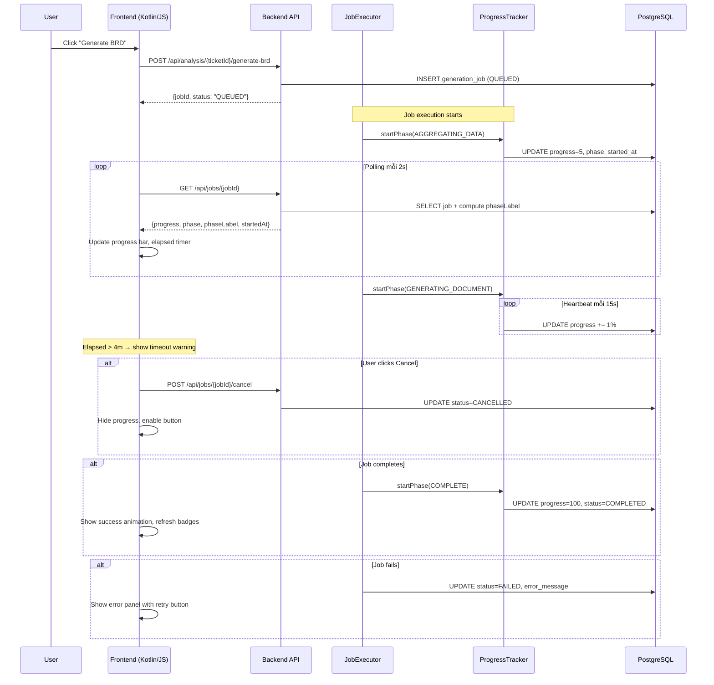
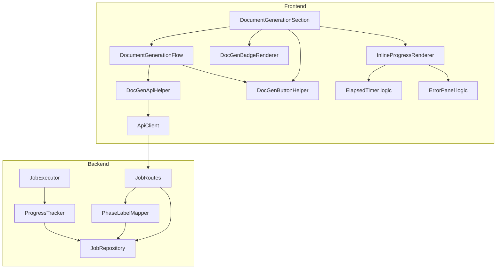

# Design Document — Document Generation UX Improvement

## Overview

Feature này cải thiện UX của quá trình sinh tài liệu (BRD/FSD/Slides) trên trang Ticket Intelligence. Hiện tại, progress bar hiển thị "GENERATING_DOCUMENT 35%" rồi đứng yên 1-5 phút — user không biết hệ thống đang làm gì, không thể hủy, và nút Generate bị kẹt khi fail.

Giải pháp bao gồm 3 lớp thay đổi:

1. **Backend**: Thêm `ProgressTracker` vào `JobExecutor` để cập nhật progress granular qua nhiều sub-phase, heartbeat mỗi 15s trong phase GENERATING_DOCUMENT, ghi `startedAt` khi job bắt đầu, và thêm `phaseLabel` tiếng Việt vào API response.

2. **Shared Models**: Mở rộng `GenerationJob` và `GenerationJobDto` với trường `startedAt` và `phaseLabel`.

3. **Frontend**: Nâng cấp `Inline_Progress_UI` trong `DocGenBadgeRenderer` với elapsed timer, timeout warning, cancel button, error panel, animated progress bar, và button state recovery.

### Phạm vi thay đổi

| Layer | Files bị ảnh hưởng | Thay đổi |
|-------|-------------------|----------|
| Backend | `JobExecutor.kt`, `ProgressTracker.kt` (mới), `PhaseLabelMapper.kt` (mới) | Granular progress, heartbeat, phaseLabel |
| Backend | `PgJobRepository.kt`, `JobRoutes.kt`, `DocumentRoutes.kt` | Thêm `started_at` column, trả `JobResponseDto` với phaseLabel trong response |
| Shared | `GenerationJob.kt` | Thêm `startedAt` field |
| Frontend | `DocumentModels.kt` | Thêm `startedAt`, `phaseLabel` vào `GenerationJobDto` |
| Frontend | `InlineProgressRenderer.kt` (mới) | Elapsed timer, cancel, error panel, animations |
| Frontend | `DocGenBadgeRenderer.kt` | Delegate progress rendering sang InlineProgressRenderer |
| Frontend | `DocumentGenerationFlow.kt` | Cập nhật polling sử dụng phaseLabel, startedAt, cancelJob |
| Frontend | `DocGenButtonHelper.kt` (mới) | Pure button state logic (extracted từ Flow) |
| Frontend | `DocGenApiHelper.kt` (mới) | API calls + toast management (extracted từ Flow) |
| Frontend | `DocumentGenerationSection.kt` | Button state recovery, cancel button wiring |
| HTML | `ticket-intelligence.html` | Mở rộng `tmpl-inline-progress`, thêm `tmpl-error-panel` |
| CSS | `ticket-intelligence.css` | Shimmer animation, timeout warning, error panel styles |

## Architecture

### Luồng dữ liệu tổng quan



### Component Architecture



### Design Decisions

1. **ProgressTracker tách riêng khỏi JobExecutor** — JobExecutor hiện tại gọi `updateProgress()` trực tiếp. Tách ProgressTracker ra giúp: (a) quản lý heartbeat coroutine riêng, (b) tính toán progress mapping cho sub-phases, (c) giữ JobExecutor dưới 200 dòng. ProgressTracker nhận `jobId` và `JobRepository`, cung cấp API `startPhase(phase)` và `incrementProgress(delta)`.

2. **PhaseLabelMapper thay vì lưu phaseLabel vào DB** — phaseLabel là derived data từ phase. Lưu vào DB tạo redundancy. Thay vào đó, `PhaseLabelMapper` map phase → label tại API layer khi trả response. Nếu cần thay đổi label text, chỉ sửa mapper mà không cần migration.

3. **InlineProgressRenderer tách từ DocGenBadgeRenderer** — DocGenBadgeRenderer hiện đã ~120 dòng. Thêm elapsed timer, cancel button, error panel, animations sẽ vượt 200 dòng. Tách `InlineProgressRenderer` chuyên render inline progress UI (Req 1-6), giữ `DocGenBadgeRenderer` chỉ lo badges.

4. **Heartbeat dùng coroutine riêng trong ProgressTracker** — Khi JobExecutor gọi AI (blocking call), heartbeat coroutine chạy song song tăng progress 1% mỗi 15s. Khi AI response về, heartbeat bị cancel và progress nhảy lên 85%.

5. **Frontend elapsed timer dùng `setInterval` thay vì poll** — Poll mỗi 2s không đủ smooth cho timer hiển thị giây. `setInterval(1000)` tính elapsed = `Date.now() - startedAt` mỗi giây, independent với polling cycle.

## Components and Interfaces

### Backend Components

#### ProgressTracker (mới)
```kotlin
// server/src/jvmMain/kotlin/com/assistant/server/jobs/ProgressTracker.kt
class ProgressTracker(
    private val jobId: String,
    private val jobRepository: JobRepository,
    private val scope: CoroutineScope
) {
    private var heartbeatJob: Job? = null
    
    suspend fun markStarted()
    // Ghi startedAt = Instant.now() vào DB khi job chuyển QUEUED → RUNNING
    
    suspend fun updateProgress(percent: Int, phase: String)
    // Cập nhật progress_percent và phase vào DB
    
    fun startHeartbeat(fromPercent: Int, maxPercent: Int, intervalMs: Long)
    // Launch coroutine tăng progress 1% mỗi intervalMs, dừng tại maxPercent
    
    fun stopHeartbeat()
    // Cancel heartbeat coroutine
}
```

#### PhaseLabelMapper (mới)
```kotlin
// server/src/jvmMain/kotlin/com/assistant/server/jobs/PhaseLabelMapper.kt
object PhaseLabelMapper {
    fun getLabel(phase: String): String
    // AGGREGATING_DATA → "Thu thập dữ liệu ticket..."
    // GENERATING_DOCUMENT → "Đang gọi AI sinh tài liệu..."
    // PARSING_RESPONSE → "Phân tích kết quả AI..."
    // SAVING → "Đang lưu tài liệu..."
    // COMPLETE → "Hoàn tất"
    // QUEUED → "Đang chờ xử lý..."
    // FAILED → "Thất bại"
    // else → phase
}
```

#### JobExecutor (sửa)
```kotlin
// Thay đổi: inject ProgressTracker thay vì gọi updateProgress trực tiếp
open class JobExecutor(...) {
    open suspend fun execute(jobId: String, ticketId: String, docType: String) {
        val tracker = ProgressTracker(jobId, jobRepository, scope)
        tracker.markStarted()
        tracker.updateProgress(0, "AGGREGATING_DATA")
        // ... aggregation steps with granular progress ...
        tracker.updateProgress(35, "GENERATING_DOCUMENT")
        tracker.startHeartbeat(fromPercent = 35, maxPercent = 80, intervalMs = 15_000)
        try {
            val aiResponse = callAI(...)
            tracker.stopHeartbeat()
            tracker.updateProgress(85, "PARSING_RESPONSE")
            // ... parse, save ...
        } finally {
            tracker.stopHeartbeat()
        }
    }
}
```

#### JobRoutes (sửa)
```kotlin
// Server-side DTO cho job responses — @Serializable để Ktor serialize đúng mixed types
@Serializable
data class JobResponseDto(
    val jobId: String, val ticketId: String, val documentType: String,
    val status: String, val progressPercent: Int = 0, val phase: String = "QUEUED",
    val chainId: String? = null, val errorMessage: String? = null,
    val startedAt: String? = null, val phaseLabel: String? = null
)

// GET /api/jobs/{jobId} và GET /api/jobs đều dùng jobResponse() converter
private fun jobResponse(job: GenerationJob): JobResponseDto = JobResponseDto(
    jobId = job.jobId, ticketId = job.ticketId, documentType = job.documentType,
    status = job.status, progressPercent = job.progressPercent, phase = job.phase,
    chainId = job.chainId, errorMessage = job.errorMessage, startedAt = job.startedAt,
    phaseLabel = PhaseLabelMapper.getLabel(job.phase)
)
```

#### DocumentRoutes (sửa)
```kotlin
// GET /api/analysis/{ticketId}/active-jobs cũng dùng JobResponseDto
// để frontend nhận được phaseLabel cho inline progress UI
get("/{ticketId}/active-jobs") {
    val jobs = jobRepository.findActiveByTicketId(ticketId)
    call.respond(HttpStatusCode.OK, jobs.map { job -> JobResponseDto(..., phaseLabel = PhaseLabelMapper.getLabel(job.phase)) })
}
```

#### JobRepository (sửa)
```kotlin
// Thêm method updateStartedAt hoặc mở rộng updateStatus
interface JobRepository {
    // existing methods...
    suspend fun updateStartedAt(jobId: String, startedAt: String)
}
```

#### PgJobRepository (sửa)
```kotlin
// Thêm started_at column vào SQL queries
// mapRow bổ sung startedAt = rs.getString("started_at")
// updateStartedAt: UPDATE generation_jobs SET started_at = ? WHERE job_id = ?
```

### Frontend Components

#### GenerationJobDto (sửa)
```kotlin
// frontend/src/jsMain/kotlin/com/assistant/frontend/models/DocumentModels.kt
@Serializable
data class GenerationJobDto(
    val jobId: String,
    val ticketId: String,
    val documentType: String,
    val status: String,
    val progressPercent: Int = 0,
    val phase: String = "QUEUED",
    val chainId: String? = null,
    val errorMessage: String? = null,
    val startedAt: String? = null,    // NEW — ISO timestamp
    val phaseLabel: String? = null     // NEW — Vietnamese label
)
```

#### InlineProgressRenderer (mới)
```kotlin
// frontend/src/jsMain/kotlin/com/assistant/frontend/pages/ticket/InlineProgressRenderer.kt
internal object InlineProgressRenderer {
    
    fun renderProgress(areaId: String, job: GenerationJobDto)
    // Clone tmpl-inline-progress, populate:
    // - progress bar fill width (CSS transition)
    // - phaseLabel text (with animated dots for GENERATING_DOCUMENT)
    // - elapsed timer (computed from startedAt)
    // - cancel button (calls DocumentGenerationFlow.cancelJob)
    // - timeout warning (if elapsed > 240s)
    // - shimmer animation class (if phase == GENERATING_DOCUMENT)
    
    fun renderError(areaId: String, job: GenerationJobDto, onRetry: () -> Unit)
    // Clone tmpl-error-panel, populate:
    // - error icon + errorMessage
    // - retry button → onRetry callback
    // - integrations link (if error contains "provider")
    // - auto-dismiss after 30s
    
    fun renderSuccess(areaId: String, onComplete: () -> Unit)
    // Show 100% green bar for 1.5s, then call onComplete
    
    fun startElapsedTimer(areaId: String, startedAt: String): Int
    // setInterval(1000) updating elapsed display, returns intervalId
    
    fun stopElapsedTimer(intervalId: Int)
    // clearInterval
    
    fun clearProgress(areaId: String)
    // Remove all progress UI from area
    
    // Pure functions for property testing:
    fun formatElapsed(totalSeconds: Int): String
    // Returns "${minutes}m ${seconds}s" format
    
    fun shouldShowTimeoutWarning(elapsedSeconds: Int): Boolean
    // Returns true iff elapsedSeconds > 240
}
```

#### DocumentGenerationFlow (sửa — tách thành 3 files)

Implementation tách `DocumentGenerationFlow` thành 3 files để giữ dưới 200 dòng:

```kotlin
// frontend/src/jsMain/kotlin/com/assistant/frontend/pages/ticket/DocumentGenerationFlow.kt
internal object DocumentGenerationFlow {
    fun startGeneration(ticketId: String, documentType: String)
    fun startGenerateAll(ticketId: String)
    fun cancelJob(jobId: String, ticketId: String, documentType: String)
    fun fetchAndPreview(ticketId: String, docType: String)
    fun fetchDraftAndPreview(ticketId: String, docType: String)
    fun cancelPolling()
    // Private: pollJobUntilComplete, handleTerminalStatus, handleCompleted,
    //          handleFailed, handleCancelled, handlePollFailure, handleCancelResponse
}
```

```kotlin
// frontend/src/jsMain/kotlin/com/assistant/frontend/pages/ticket/DocGenButtonHelper.kt
internal object DocGenButtonHelper {
    fun shouldEnableButton(jobStatus: String): Boolean  // Pure logic for testing
    fun buttonIdForDocType(docType: String): String?
    fun progressAreaId(docType: String): String
    fun enableGenerateButton(docType: String)
    fun enableCancelButton(docType: String)
    fun disableButton(btn: HTMLElement)
    fun enableButton(btn: HTMLElement)
}
```

```kotlin
// frontend/src/jsMain/kotlin/com/assistant/frontend/pages/ticket/DocGenApiHelper.kt
internal object DocGenApiHelper {
    suspend fun postGenerate(ticketId: String, docType: String): String
    suspend fun postGenerateAll(ticketId: String): ChainResponse
    suspend fun fetchJobStatus(jobId: String): GenerationJobDto
    suspend fun fetchJobStatusSafe(jobId: String): GenerationJobDto?  // returns null on error/404
    suspend fun fetchFullDocument(ticketId: String, docType: String, status: String? = null): GeneratedDocumentFull?
    fun showErrorToast(sectionId: String, message: String)
    fun dismissErrorToast()
}
```

#### DocumentGenerationSection (sửa)
```kotlin
// frontend/src/jsMain/kotlin/com/assistant/frontend/pages/ticket/DocumentGenerationSection.kt
internal object DocumentGenerationSection {
    fun render(ticketId: String, isAnalyzed: Boolean, isReader: Boolean)
    fun hide()
    fun refreshBadges(ticketId: String)
    // Private: fetchActiveJobsAndDocs, recoverTerminalButtonStates, restoreButtonLabel,
    //          bindButtons, bindCancelButtons, applyGenerationLock, applyDependencyTooltips,
    //          applyCascadeLock, removeCascadeLock, startCascadeUnlockPolling
}
```

### HTML Template Changes

#### tmpl-inline-progress (mở rộng)
```html
<template id="tmpl-inline-progress">
    <div class="inline-job-progress">
        <div class="inline-progress-info">
            <span class="inline-progress-phase-label"></span>
            <span class="inline-progress-elapsed"></span>
        </div>
        <div class="inline-progress-bar-track">
            <div class="inline-progress-bar-fill"></div>
        </div>
        <div class="inline-progress-actions">
            <button class="btn-cancel-job" title="Hủy">✕</button>
        </div>
        <div class="inline-progress-timeout-warning" style="display:none;">
            ⚠️ Job sắp hết thời gian (5 phút). Cân nhắc hủy và thử lại.
        </div>
    </div>
</template>
```

#### tmpl-error-panel (mới)
```html
<template id="tmpl-error-panel">
    <div class="docgen-error-panel">
        <div class="error-panel-header">
            <span class="error-panel-icon">❌</span>
            <span class="error-panel-message"></span>
            <button class="btn-error-close" title="Đóng">✕</button>
        </div>
        <div class="error-panel-actions">
            <button class="btn-error-retry">Thử lại</button>
            <a class="error-panel-link" style="display:none;"></a>
        </div>
    </div>
</template>
```

### CSS Changes

```css
/* Shimmer animation for GENERATING_DOCUMENT phase */
.inline-progress-bar-fill.shimmer {
    background: linear-gradient(
        90deg, 
        var(--primary), 
        rgba(45, 254, 207, 0.6), 
        var(--primary)
    );
    background-size: 200% 100%;
    animation: shimmer 2s ease-in-out infinite;
}

@keyframes shimmer {
    0% { background-position: -200% 0; }
    100% { background-position: 200% 0; }
}

/* Smooth transition for progress bar */
.inline-progress-bar-fill {
    transition: width 0.5s ease-in-out;
}

/* Success state */
.inline-progress-bar-fill.success {
    background: var(--accent-green);
}

/* Failed state */
.inline-progress-bar-fill.failed {
    background: var(--accent-red);
}

/* Timeout warning */
.inline-progress-timeout-warning {
    color: var(--warning-color);
    font-size: 10px;
    margin-top: 4px;
}

/* Error panel */
.docgen-error-panel {
    background: rgba(255, 80, 80, 0.08);
    border: 1px solid rgba(255, 80, 80, 0.3);
    border-radius: 8px;
    padding: 10px 14px;
    margin-top: 6px;
}
```

## Data Models

### Database Schema Changes

#### generation_jobs table — thêm column `started_at`

```sql
ALTER TABLE generation_jobs ADD COLUMN started_at TEXT;
```

| Column | Type | Description |
|--------|------|-------------|
| started_at | TEXT (nullable) | ISO timestamp khi job chuyển QUEUED → RUNNING |

Các column hiện có không thay đổi: `job_id`, `ticket_id`, `document_type`, `status`, `progress_percent`, `phase`, `chain_id`, `created_by`, `created_at`, `updated_at`, `error_message`.

### Shared Model Changes

#### GenerationJob (shared module)
```kotlin
@Serializable
data class GenerationJob(
    val jobId: String,
    val ticketId: String,
    val documentType: String,
    val status: String,
    val progressPercent: Int = 0,
    val phase: String = "QUEUED",
    val chainId: String? = null,
    val createdBy: String = "",
    val createdAt: String = "",
    val updatedAt: String = "",
    val errorMessage: String? = null,
    val startedAt: String? = null      // NEW
)
```

### Frontend DTO Changes

#### GenerationJobDto
```kotlin
@Serializable
data class GenerationJobDto(
    val jobId: String,
    val ticketId: String,
    val documentType: String,
    val status: String,
    val progressPercent: Int = 0,
    val phase: String = "QUEUED",
    val chainId: String? = null,
    val errorMessage: String? = null,
    val startedAt: String? = null,     // NEW — ISO timestamp
    val phaseLabel: String? = null      // NEW — derived, not stored in DB
)
```

### API Response Changes

#### GET /api/jobs/{jobId} — response bổ sung

```json
{
    "jobId": "uuid",
    "ticketId": "PROJ-123",
    "documentType": "BRD",
    "status": "RUNNING",
    "progressPercent": 42,
    "phase": "GENERATING_DOCUMENT",
    "chainId": null,
    "errorMessage": null,
    "startedAt": "2025-01-15T10:30:00Z",
    "phaseLabel": "Đang gọi AI sinh tài liệu..."
}
```

### Progress Mapping

| Phase | Progress Range | Sub-milestones |
|-------|---------------|----------------|
| AGGREGATING_DATA | 0% → 30% | 5% start, 15% main ticket, 25% linked tickets, 30% done |
| GENERATING_DOCUMENT | 35% → 85% | 35% start, +1%/15s heartbeat (max 80%), 85% AI response received |
| PARSING_RESPONSE | 85% → 90% | 85% start, 90% parse complete |
| SAVING | 90% → 100% | 90% start save, 95% saved, 100% complete |

### Phase Label Mapping

| Phase | phaseLabel |
|-------|-----------|
| QUEUED | "Đang chờ xử lý..." |
| AGGREGATING_DATA | "Thu thập dữ liệu ticket..." |
| GENERATING_DOCUMENT | "Đang gọi AI sinh tài liệu..." |
| PARSING_RESPONSE | "Phân tích kết quả AI..." |
| SAVING | "Đang lưu tài liệu..." |
| COMPLETE | "Hoàn tất" |
| FAILED | "Thất bại" |

### Error Message Mapping

| Error Type | errorMessage (Vietnamese) |
|-----------|--------------------------|
| Connection error | "AI provider không phản hồi — kiểm tra kết nối Integrations" |
| Parse error | "AI response không hợp lệ — thử lại" |
| Timeout | "Job đã hết thời gian sau 5 phút — thử lại" |
| Dependency error | "Không tìm thấy BRD — cần sinh BRD trước" |


## Correctness Properties

*A property is a characteristic or behavior that should hold true across all valid executions of a system — essentially, a formal statement about what the system should do. Properties serve as the bridge between human-readable specifications and machine-verifiable correctness guarantees.*

### Property 1: Aggregation progress is monotonically increasing and bounded

*For any* sequence of aggregation sub-steps (start, main ticket loaded, linked tickets loaded, aggregation complete), the progress_percent values emitted by ProgressTracker SHALL be strictly monotonically increasing and always within the range [0, 30].

**Validates: Requirements 1.1**

### Property 2: Heartbeat progress is bounded and never exceeds cap

*For any* starting progress percent in [35, 80] and *for any* number of heartbeat ticks (0 to 100), the resulting progress_percent SHALL equal `min(startPercent + ticks, 80)` — never exceeding 80% regardless of how many ticks occur.

**Validates: Requirements 1.2**

### Property 3: startedAt is set on RUNNING transition

*For any* GenerationJob that transitions from QUEUED to RUNNING status, the `startedAt` field SHALL be non-null and contain a valid ISO-8601 timestamp that is not in the future (relative to current time).

**Validates: Requirements 1.6**

### Property 4: Phase label mapping is total and correct

*For any* valid phase value in the set {QUEUED, AGGREGATING_DATA, GENERATING_DOCUMENT, PARSING_RESPONSE, SAVING, COMPLETE, FAILED}, `PhaseLabelMapper.getLabel(phase)` SHALL return a non-empty Vietnamese string that is not equal to the phase code itself.

**Validates: Requirements 2.1**

### Property 5: Elapsed time formatting

*For any* duration in seconds from 0 to 600 (inclusive), the elapsed time format function SHALL produce a string matching the pattern "Xm Ys" where X = floor(seconds / 60) and Y = seconds mod 60, with both X and Y being non-negative integers.

**Validates: Requirements 3.1**

### Property 6: Timeout warning threshold

*For any* elapsed time value in seconds (0 to 600), the timeout warning SHALL be visible if and only if elapsed > 240 seconds. The function `shouldShowTimeoutWarning(elapsedSeconds)` SHALL return true when elapsedSeconds > 240 and false otherwise.

**Validates: Requirements 3.2**

### Property 7: Button recovery on terminal job status

*For any* GenerationJob with status in {COMPLETED, FAILED, CANCELLED} and *for any* document type in {BRD, FSD, REQUIREMENT_SLIDES}, the corresponding Generate button SHALL be in enabled state (not disabled, opacity 1, cursor pointer) — both when the status transition occurs at runtime and when the page loads with a pre-existing terminal job.

**Validates: Requirements 8.1, 8.2**

## Error Handling

### Backend Error Handling

| Error Scenario | Handling | errorMessage |
|---------------|----------|-------------|
| AI provider connection timeout | Catch `ConnectTimeoutException`, set job FAILED, **preserve current phase** | "AI provider không phản hồi — kiểm tra kết nối Integrations" |
| AI response parse failure | Catch parse exceptions in `parseResponse()`, set job FAILED, **preserve current phase** | "AI response không hợp lệ — thử lại" |
| Job execution timeout (5 min) | `withTimeout` in JobManager catches `TimeoutCancellationException`, **preserve current phase and progressPercent** | "Job đã hết thời gian sau 5 phút — thử lại" |
| BRD dependency missing | `DependencyChecker` rejects, HTTP 400 | "Không tìm thấy BRD — cần sinh BRD trước" |
| Heartbeat DB write failure | Log warning, continue — heartbeat is best-effort | N/A (silent, non-critical) |
| ProgressTracker DB write failure | Log error, continue execution — progress display degrades gracefully | N/A (job continues) |

**Phase preservation rule**: Khi job chuyển sang FAILED, cột `phase` PHẢI giữ nguyên giá trị phase cuối cùng (ví dụ `GENERATING_DOCUMENT`, `AGGREGATING_DATA`) — KHÔNG được set thành `"FAILED"`. Điều này đảm bảo `PhaseLabelMapper` trả về phaseLabel đúng cho error UI (ví dụ "Đang gọi AI sinh tài liệu..." thay vì "Thất bại").

### Frontend Error Handling

| Error Scenario | Handling | User Feedback |
|---------------|----------|--------------|
| Poll returns HTTP 404 (job deleted) | Stop polling, enable button | Toast: "Mất kết nối — vui lòng thử lại" |
| Poll network error | Stop polling after 3 consecutive failures, enable button | Toast: "Mất kết nối — vui lòng thử lại" |
| Cancel returns HTTP 409 | Show info toast, refresh badges | Toast: "Job đã hoàn tất, không thể hủy" |
| Cancel network error | Re-enable cancel button after 2s | Toast: "Không thể hủy — thử lại" |
| Job FAILED with provider error | Show error panel with Integrations link | Error panel + link "Kiểm tra Integrations" |
| Job FAILED with timeout | Show timeout-specific message | "⏱️ Job đã hết thời gian sau 5 phút. Vui lòng thử lại." |
| Job FAILED generic | Show error panel with retry | Error panel + "Thử lại" button |
| Error panel auto-dismiss | `setTimeout(30000)` removes panel, enables button | Panel disappears after 30s |

### Graceful Degradation

- Nếu `startedAt` null (job cũ chưa có field) → elapsed timer hiển thị "—" thay vì crash
- Nếu `phaseLabel` null → fallback hiển thị phase code (behavior hiện tại)
- Nếu heartbeat DB write fail → progress bar đứng yên nhưng job vẫn chạy
- Nếu cancel API fail → button re-enable sau 2s, user có thể thử lại

## Testing Strategy

### Unit Tests (Example-based)

| Test | Validates | Description |
|------|----------|-------------|
| ProgressTracker milestone transitions | 1.3, 1.4, 1.5 | Verify specific progress values at each phase transition |
| PhaseLabelMapper all phases | 2.1 | Verify each phase maps to correct Vietnamese label |
| Error message classification | 5.2 | Verify each error type produces correct Vietnamese message |
| Cancel button visibility by status | 4.1 | Verify cancel visible for QUEUED/RUNNING, hidden for others |
| Cancel success flow | 4.3 | Verify progress hidden, button enabled, toast shown |
| Cancel 409 handling | 4.4 | Verify toast message and badge refresh |
| Error panel rendering | 5.1 | Verify panel contains icon, message, retry button |
| Error panel auto-dismiss | 5.4 | Verify panel hides after 30s |
| Integrations link for provider error | 5.5 | Verify link shown when error contains "provider" |
| Shimmer animation toggle | 6.2 | Verify shimmer class for GENERATING_DOCUMENT phase |
| Success animation | 6.3 | Verify green bar shown for 1.5s |
| Polling start/stop | 7.4, 7.5 | Verify 2s interval, stops on terminal status |
| Button state on section render | 8.4 | Verify recovery check runs on every render |

### Property-Based Tests

Sử dụng **Kotest** property testing library (đã có trong project) với minimum **100 iterations** mỗi property.

| Property | Test Tag | Generator |
|----------|---------|-----------|
| Property 1: Aggregation monotonic | `Feature: docgen-ux-improvement, Property 1: Aggregation progress monotonic and bounded` | Random subsequences of [5, 15, 25, 30] |
| Property 2: Heartbeat bounded | `Feature: docgen-ux-improvement, Property 2: Heartbeat bounded` | `Arb.int(35..80)` × `Arb.int(0..100)` |
| Property 3: startedAt on RUNNING | `Feature: docgen-ux-improvement, Property 3: startedAt set on RUNNING` | Random job creation + transition |
| Property 4: Phase label total | `Feature: docgen-ux-improvement, Property 4: Phase label mapping total` | `Arb.of(validPhases)` |
| Property 5: Elapsed format | `Feature: docgen-ux-improvement, Property 5: Elapsed time formatting` | `Arb.int(0..600)` |
| Property 6: Timeout threshold | `Feature: docgen-ux-improvement, Property 6: Timeout warning threshold` | `Arb.int(0..600)` |
| Property 7: Button recovery | `Feature: docgen-ux-improvement, Property 7: Button recovery on terminal status` | `Arb.of(COMPLETED, FAILED, CANCELLED)` × `Arb.of(BRD, FSD, REQUIREMENT_SLIDES)` |

### Edge Case Tests

| Test | Validates | Description |
|------|----------|-------------|
| Poll 404 recovery | 8.3 | Simulate job not found during polling |
| Poll network error recovery | 8.3 | Simulate network failure during polling |
| startedAt null fallback | Graceful degradation | Verify elapsed timer shows "—" when startedAt missing |
| phaseLabel null fallback | Graceful degradation | Verify phase code shown when phaseLabel missing |
| Double-click cancel prevention | 4.5 | Verify button disabled for 2s after click |

### Integration Tests

| Test | Validates | Description |
|------|----------|-------------|
| GET /api/jobs/{jobId} includes new fields | 7.1, 7.2 | Verify startedAt and phaseLabel in API response |
| POST /api/jobs/{jobId}/cancel flow | 4.2 | Verify cancel endpoint returns updated job |
| Full generation flow with progress | 1.1-1.6 | End-to-end: create job → verify progress updates → complete |
