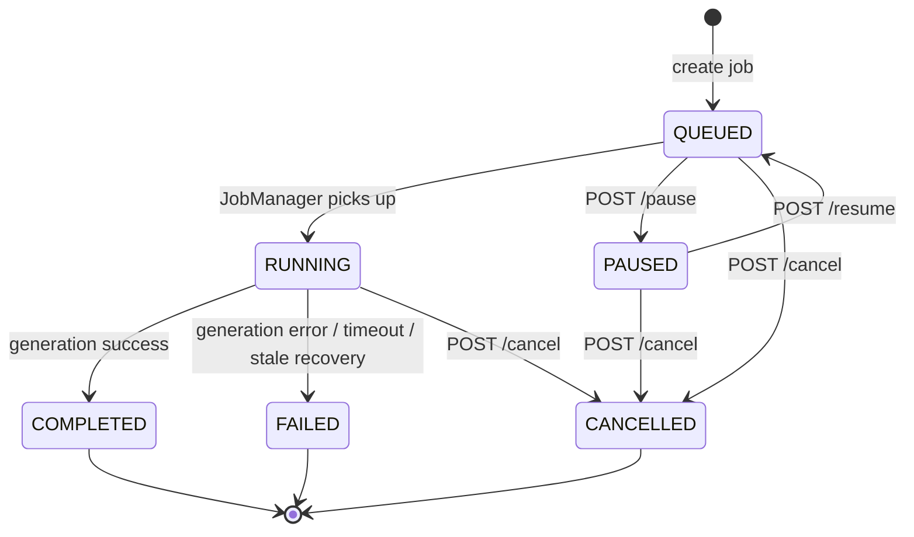

# Document Job Manager — Design

## Overview

Feature này mở rộng hệ thống sinh tài liệu BRD/FSD/Slides hiện tại (`ai-generated-brd-fsd`) bằng cách thêm:

1. **Background Job Manager** — thay thế `DocumentStatusTracker` (in-memory ConcurrentHashMap) bằng persistent PostgreSQL jobs, cho phép user navigate đi nơi khác hoặc logout mà job vẫn tiếp tục chạy
2. **Dependency Chain** (BRD → FSD → Slides) — enforce thứ tự sinh tài liệu, hỗ trợ "Generate All" chạy tuần tự
3. **Generation Lock** — ngăn duplicate generation cho cùng ticket + document type
4. **Review/Approve Workflow** — tài liệu sinh ra ở trạng thái DRAFT, user review và Approve/Reject
5. **Document Versioning** — mỗi lần approve tạo version mới, xem lịch sử và so sánh diff
6. **Global Job Indicator** — badge trên navbar hiển thị số jobs đang active, dropdown panel chi tiết

### Quyết định thiết kế chính

| # | Quyết định | Lý do |
|---|-----------|-------|
| 1 | `JobManager` là singleton server-side, inject qua Koin, dùng `CoroutineScope(Dispatchers.Default + SupervisorJob)` | Tách biệt lifecycle khỏi HTTP request, job tiếp tục khi user disconnect |
| 2 | Bảng `generation_jobs` lưu trạng thái job persistent (PostgreSQL) | Server restart không mất job — RUNNING jobs khôi phục thành QUEUED |
| 3 | Bỏ UNIQUE constraint `(ticket_id, document_type)` trên `generated_documents`, thêm `approval_status` + `version_number` | Hỗ trợ versioning — nhiều versions cho cùng ticket + type |
| 4 | `DocumentStatusTracker` bị thay thế hoàn toàn bởi `JobManager` + `JobRepository` | Một nguồn sự thật duy nhất cho trạng thái generation |
| 5 | Generation Lock kiểm tra tại database level (query active jobs) | Tránh race condition khi nhiều requests đồng thời |
| 6 | Frontend `GlobalJobIndicator` poll `GET /api/jobs?status=active` mỗi 3s | Đơn giản, không cần WebSocket, tương tự pattern polling hiện tại |
| 7 | Diff giữa versions dùng unified diff format server-side | Tránh gửi 2 full documents về frontend để diff |
| 8 | Pause chỉ áp dụng cho QUEUED jobs (không phải RUNNING) | AI generation là atomic — không thể pause mid-stream |
| 9 | Cancel cho phép cả RUNNING jobs | Cho phép user hủy zombie/stuck jobs thay vì chờ timeout |
| 10 | Stale job auto-recovery (RUNNING or QUEUED >5min → FAILED) | Tránh zombie jobs block generation vĩnh viễn |
| 11 | Job execution timeout 5 phút via `withTimeout` | Đảm bảo coroutine không chạy vô hạn |

---

## Architecture

```mermaid
graph TB
    subgraph "Frontend (Kotlin/JS)"
        NAVBAR[Navbar]
        GLOBAL_IND[GlobalJobIndicator<br>badge + dropdown panel]
        TI_PAGE[TicketIntelligencePage]
        DOC_GEN[DocumentGenerationSection<br>Generate BRD/FSD/All buttons<br>+ inline progress + lock state]
        DOC_PREVIEW[DocumentPreviewPanel<br>+ Approve/Reject buttons<br>+ Version History dropdown]
        VERSION_PANEL[VersionHistoryPanel<br>version list + diff view]
        REVIEW_PANEL[ReviewPanel<br>approve/reject actions]
    end

    subgraph "Backend (Ktor)"
        JOB_ROUTES[JobRoutes<br>GET /api/jobs<br>POST /api/jobs/{id}/pause<br>POST /api/jobs/{id}/resume<br>POST /api/jobs/{id}/cancel]
        DOC_ROUTES[DocumentRoutes<br>POST generate-brd/fsd/slides/all<br>GET documents + versions + diff<br>POST approve/reject]
        JOB_MANAGER[JobManager<br>create, execute, pause,<br>cancel, chain orchestration]
    end

    subgraph "Persistence (PostgreSQL)"
        JOBS_TABLE[(generation_jobs)]
        DOCS_TABLE[(generated_documents<br>+ approval_status<br>+ version_number)]
    end

    subgraph "Shared Module"
        JOB_MODELS[JobModels<br>GenerationJob, JobStatus,<br>JobChain, ApprovalStatus]
        DOC_MODELS[DocumentModels<br>GeneratedDocument extended]
    end

    subgraph "Existing"
        AGGREGATOR[DocumentAggregator]
        BRD_PROMPT[BrdPromptBuilder]
        FSD_PROMPT[FsdPromptBuilder]
        SLIDE_GEN[SlideGenerator]
        AI_AGENT[AIAgent]
    end

    NAVBAR --> GLOBAL_IND
    GLOBAL_IND -->|"poll GET /api/jobs"| JOB_ROUTES
    TI_PAGE --> DOC_GEN
    DOC_GEN -->|"POST generate-*"| DOC_ROUTES
    DOC_GEN -->|"GET active-jobs"| DOC_ROUTES
    DOC_PREVIEW --> REVIEW_PANEL
    DOC_PREVIEW --> VERSION_PANEL
    REVIEW_PANEL -->|"POST approve/reject"| DOC_ROUTES
    VERSION_PANEL -->|"GET versions + diff"| DOC_ROUTES

    DOC_ROUTES --> JOB_MANAGER
    JOB_ROUTES --> JOB_MANAGER
    JOB_MANAGER --> JOBS_TABLE
    JOB_MANAGER --> AGGREGATOR
    JOB_MANAGER --> BRD_PROMPT
    JOB_MANAGER --> FSD_PROMPT
    JOB_MANAGER --> SLIDE_GEN
    JOB_MANAGER --> AI_AGENT
    DOC_ROUTES --> DOCS_TABLE
```

### Job Lifecycle State Machine



---

## Components and Interfaces

### Shared Module — Job Models (`com.assistant.document.models/`)

| Component | File | Trách nhiệm |
|-----------|------|-------------|
| `GenerationJob` | `models/GenerationJob.kt` | Job data: jobId, ticketId, documentType, status, progress, phase, chainId, createdBy, timestamps, errorMessage |
| `JobStatus` | `models/JobStatus.kt` | Enum: QUEUED, RUNNING, PAUSED, COMPLETED, FAILED, CANCELLED |
| `ApprovalStatus` | `models/ApprovalStatus.kt` | Enum: DRAFT, APPROVED, REJECTED |
| `JobChainResponse` | `models/JobChainResponse.kt` | Response cho generate-all: chainId + list jobs |

### Shared Module — Extended Document Models

| Component | File | Thay đổi |
|-----------|------|----------|
| `GeneratedDocument` | `models/GeneratedDocument.kt` | Thêm: approvalStatus, versionNumber, rejectReason, reviewedBy, reviewedAt |
| `DocumentType` | `models/DocumentType.kt` | Không đổi (BRD, FSD, REQUIREMENT_SLIDES) |

### Server Module — Job Management (`com.assistant.server.jobs/`)

| Component | File | Trách nhiệm |
|-----------|------|-------------|
| `JobManager` | `jobs/JobManager.kt` | Singleton — tạo job, execute pipeline, chain orchestration, pause/cancel (including RUNNING jobs), server restart recovery, stale job auto-recovery (RUNNING or QUEUED >5min → FAILED), job execution timeout (5min via `withTimeout`). Inject: JobRepository, DocumentRepository, JobExecutor, JobChainOrchestrator, DependencyChecker |
| `JobExecutor` | `jobs/JobExecutor.kt` | Thực thi một job: aggregate → prompt → AI → parse → save. Tách từ DocumentRouteHandlers hiện tại |
| `JobChainOrchestrator` | `jobs/JobChainOrchestrator.kt` | Quản lý Job_Chain: khi job COMPLETED → start next job trong chain, khi FAILED → cancel remaining |
| `JobRepository` | `db/JobRepository.kt` | Interface: CRUD cho generation_jobs table |
| `PgJobRepository` | `db/pg/PgJobRepository.kt` | PostgreSQL implementation |
| `PgJobSql` | `db/pg/PgJobSql.kt` | SQL constants cho job queries |

### Server Module — Updated Routes

| Component | File | Thay đổi |
|-----------|------|----------|
| `DocumentRoutes` | `routes/DocumentRoutes.kt` | Cập nhật generate-* endpoints tạo job thay vì chạy trực tiếp. Thêm: generate-all, active-jobs, versions, diff, approve, reject |
| `DocumentRouteHandlers` | `routes/DocumentRouteHandlers.kt` | Refactor: logic generation chuyển sang JobExecutor. Thêm handlers cho approve, reject, versions, diff |
| `JobRoutes` | `routes/JobRoutes.kt` | Mới: GET /api/jobs, GET /api/jobs/{id}, POST pause/resume/cancel |
| `DocumentStatusTracker` | `routes/DocumentStatusTracker.kt` | **XÓA** — thay thế bởi JobManager + JobRepository |

### Server Module — Updated Repository

| Component | File | Thay đổi |
|-----------|------|----------|
| `DocumentRepository` | `db/DocumentRepository.kt` | Thêm methods: findLatestApprovedOrDraft, findAllVersions, findByVersion, updateApprovalStatus, getNextVersionNumber |
| `PgDocumentRepository` | `db/pg/PgDocumentRepository.kt` | Cập nhật queries cho versioning + approval |
| `PgDocumentSql` | `db/pg/PgDocumentSql.kt` | Cập nhật SQL: bỏ ON CONFLICT upsert, thêm version queries |

### Frontend — New Components

| Component | File | Trách nhiệm |
|-----------|------|-------------|
| `GlobalJobIndicator` | `components/GlobalJobIndicator.kt` | Badge trên navbar + dropdown panel. Poll active jobs mỗi 3s. Toast notifications cho COMPLETED/FAILED |
| `GlobalJobIndicatorPanel` | `components/GlobalJobIndicatorPanel.kt` | Dropdown panel: list jobs, pause/resume/cancel buttons |
| `VersionHistoryPanel` | `pages/ticket/VersionHistoryPanel.kt` | Dropdown version list + side-by-side diff view |
| `ReviewPanel` | `pages/ticket/ReviewPanel.kt` | Approve/Reject buttons + reject reason dialog |

### Frontend — Updated Components

| Component | File | Thay đổi |
|-----------|------|----------|
| `Navbar` | `components/Navbar.kt` | Thêm GlobalJobIndicator vào nav-actions |
| `DocumentGenerationSection` | `pages/ticket/DocumentGenerationSection.kt` | Thêm: "Generate All" button, inline progress bars, generation lock, dependency tooltips, approval badges (DRAFT/APPROVED/REJECTED). Khi document có APPROVED + hasDraft=true → hiện 2 badges: APPROVED badge + DRAFT badge (click DRAFT → fetchDraftAndPreview) |
| `DocumentPreviewPanel` | `pages/ticket/DocumentPreviewPanel.kt` | Thêm: Approve/Reject buttons (delegate to ReviewPanel), Version History dropdown |
| `DocumentGenerationFlow` | `pages/ticket/DocumentGenerationFlow.kt` | Cập nhật: POST trả về jobId, poll qua GET /api/jobs/{id}. Sau generation complete, fetch DRAFT cụ thể (`?status=DRAFT`) thay vì latest (APPROVED-first). Thêm `fetchDraftAndPreview()` cho DRAFT badge clicks. |
| `DocumentModels` | `models/DocumentModels.kt` | Thêm: GenerationJobDto, JobStatusDto, approval fields, version fields |

### Frontend — HTML Template Updates

| Resource | Thay đổi |
|----------|----------|
| `ticket-intelligence.html` | Thêm: "Generate All" button, inline progress areas, approval badges, version history dropdown trong preview modal, approve/reject buttons, reject reason dialog |
| `ticket-intelligence.css` | Thêm: styles cho job progress bars, approval badges, version history panel, diff view |

### Database Migration

| File | Nội dung |
|------|---------|
| `V4__add_job_manager_and_versioning.sql` | CREATE TABLE generation_jobs, ALTER TABLE generated_documents (bỏ UNIQUE, thêm approval_status, version_number, reject_reason, reviewed_by, reviewed_at) |

---

## Data Models

### Database Schema — `generation_jobs` table (Req 2.1)

```sql
CREATE TABLE generation_jobs (
    job_id UUID PRIMARY KEY DEFAULT gen_random_uuid(),
    ticket_id TEXT NOT NULL,
    document_type TEXT NOT NULL,
    status TEXT NOT NULL DEFAULT 'QUEUED',
    progress_percent INTEGER NOT NULL DEFAULT 0,
    phase TEXT NOT NULL DEFAULT 'QUEUED',
    chain_id UUID,
    created_by TEXT NOT NULL DEFAULT '',
    created_at TEXT NOT NULL,
    updated_at TEXT NOT NULL,
    error_message TEXT
);

CREATE INDEX idx_jobs_ticket ON generation_jobs(ticket_id);
CREATE INDEX idx_jobs_status ON generation_jobs(status);
CREATE INDEX idx_jobs_chain ON generation_jobs(chain_id);
```

### Database Schema — `generated_documents` table (updated, Req 7.1)

```sql
-- Bỏ UNIQUE constraint cũ
ALTER TABLE generated_documents DROP CONSTRAINT IF EXISTS generated_documents_ticket_id_document_type_key;

-- Thêm columns mới
ALTER TABLE generated_documents ADD COLUMN approval_status TEXT NOT NULL DEFAULT 'DRAFT';
ALTER TABLE generated_documents ADD COLUMN version_number INTEGER;
ALTER TABLE generated_documents ADD COLUMN reject_reason TEXT;
ALTER TABLE generated_documents ADD COLUMN reviewed_by TEXT;
ALTER TABLE generated_documents ADD COLUMN reviewed_at TEXT;

CREATE INDEX idx_docs_approval ON generated_documents(ticket_id, document_type, approval_status);
CREATE INDEX idx_docs_version ON generated_documents(ticket_id, document_type, version_number);
```

### GenerationJob — `shared/.../document/models/GenerationJob.kt` (Req 2.1)

```kotlin
@Serializable
data class GenerationJob(
    val jobId: String,
    val ticketId: String,
    val documentType: String,
    val status: String,           // QUEUED, RUNNING, PAUSED, COMPLETED, FAILED, CANCELLED
    val progressPercent: Int = 0,
    val phase: String = "QUEUED", // QUEUED, AGGREGATING_DATA, GENERATING_DOCUMENT, SAVING, COMPLETE
    val chainId: String? = null,
    val createdBy: String = "",
    val createdAt: String = "",
    val updatedAt: String = "",
    val errorMessage: String? = null
)
```

### JobStatus — `shared/.../document/models/JobStatus.kt`

```kotlin
@Serializable
enum class JobStatus {
    QUEUED, RUNNING, PAUSED, COMPLETED, FAILED, CANCELLED
}
```

### ApprovalStatus — `shared/.../document/models/ApprovalStatus.kt`

```kotlin
@Serializable
enum class ApprovalStatus {
    DRAFT, APPROVED, REJECTED
}
```

### GeneratedDocument (extended) — `shared/.../document/models/GeneratedDocument.kt`

```kotlin
@Serializable
data class GeneratedDocument(
    val documentType: String,
    val ticketId: String,
    val generatedAt: String,
    val markdownContent: String,
    val sourceTicketIds: List<String> = emptyList(),
    val attachmentSources: List<String> = emptyList(),
    val aiProviderUsed: String = "",
    val approvalStatus: String = "DRAFT",
    val versionNumber: Int? = null,
    val rejectReason: String? = null,
    val reviewedBy: String? = null,
    val reviewedAt: String? = null
)
```

### JobChainResponse — `shared/.../document/models/JobChainResponse.kt`

```kotlin
@Serializable
data class JobChainResponse(
    val chainId: String,
    val jobs: List<GenerationJob>
)
```

### JobRepository Interface — `server/.../db/JobRepository.kt`

```kotlin
interface JobRepository {
    suspend fun create(job: GenerationJob)
    suspend fun findById(jobId: String): GenerationJob?
    suspend fun findByTicketIdAndTypeActive(ticketId: String, documentType: String): GenerationJob?
    suspend fun findActiveByTicketId(ticketId: String): List<GenerationJob>
    suspend fun findByUser(userId: String, statusFilter: List<String>?): List<GenerationJob>
    suspend fun findByChainId(chainId: String): List<GenerationJob>
    suspend fun updateStatus(jobId: String, status: String, progress: Int, phase: String, error: String? = null)
    suspend fun findRunningJobs(): List<GenerationJob>
}
```

### DocumentRepository Interface (extended)

```kotlin
interface DocumentRepository {
    suspend fun save(document: GeneratedDocument)
    suspend fun findByTicketId(ticketId: String): List<GeneratedDocument>
    suspend fun findByTicketIdAndType(ticketId: String, documentType: String): GeneratedDocument?
    suspend fun listByTicketId(ticketId: String): List<GeneratedDocumentMeta>
    // New methods for versioning + approval
    suspend fun findLatestByTicketIdAndType(ticketId: String, documentType: String): GeneratedDocument?
    suspend fun findLatestDraftByTicketIdAndType(ticketId: String, documentType: String): GeneratedDocument?
    suspend fun findAllVersions(ticketId: String, documentType: String): List<GeneratedDocumentMeta>
    suspend fun findByVersion(ticketId: String, documentType: String, versionNumber: Int): GeneratedDocument?
    suspend fun updateApprovalStatus(id: Long, status: String, reviewedBy: String?, reviewedAt: String?, rejectReason: String?)
    suspend fun getNextVersionNumber(ticketId: String, documentType: String): Int
}
```

### Frontend Models (extended) — `frontend/.../models/DocumentModels.kt`

```kotlin
@Serializable
data class GeneratedDocumentMeta(
    val documentType: String,
    val generatedAt: String,
    val aiProviderUsed: String = "",
    val approvalStatus: String = "DRAFT",
    val versionNumber: Int? = null,
    val hasDraft: Boolean = false
)

@Serializable
data class GeneratedDocumentFull(
    val documentType: String,
    val ticketId: String,
    val generatedAt: String,
    val markdownContent: String,
    val sourceTicketIds: List<String> = emptyList(),
    val attachmentSources: List<String> = emptyList(),
    val aiProviderUsed: String = "",
    val approvalStatus: String = "DRAFT",
    val versionNumber: Int? = null,
    val rejectReason: String? = null,
    val reviewedBy: String? = null,
    val reviewedAt: String? = null
)

@Serializable
data class GenerationJobDto(
    val jobId: String,
    val ticketId: String,
    val documentType: String,
    val status: String,
    val progressPercent: Int = 0,
    val phase: String = "QUEUED",
    val chainId: String? = null,
    val errorMessage: String? = null
)

@Serializable
data class VersionMeta(
    val versionNumber: Int,
    val generatedAt: String,
    val reviewedBy: String? = null,
    val reviewedAt: String? = null,
    val aiProviderUsed: String = ""
)
```

### API Endpoints Summary

| Method | Path | Request | Response | Req |
|--------|------|---------|----------|-----|
| POST | `/api/analysis/{ticketId}/generate-brd` | — | `{"jobId":"uuid","status":"QUEUED"}` | 8.1 |
| POST | `/api/analysis/{ticketId}/generate-fsd` | — | `{"jobId":"uuid","status":"QUEUED"}` | 8.2 |
| POST | `/api/analysis/{ticketId}/generate-slides` | — | `{"jobId":"uuid","status":"QUEUED"}` | 8.3 |
| POST | `/api/analysis/{ticketId}/generate-all` | — | `JobChainResponse` | 8.4 |
| GET | `/api/analysis/{ticketId}/documents` | — | `List<GeneratedDocumentMeta>` (with approval_status, version_number, has_draft) | 8.6 |
| GET | `/api/analysis/{ticketId}/documents/{type}` | — | `GeneratedDocumentFull` (active version or latest draft) | 8.5 |
| GET | `/api/analysis/{ticketId}/documents/{type}/versions` | — | `List<VersionMeta>` | 7.3 |
| GET | `/api/analysis/{ticketId}/documents/{type}/versions/{n}` | — | `GeneratedDocumentFull` | 7.4 |
| GET | `/api/analysis/{ticketId}/documents/{type}/diff?v1=X&v2=Y` | — | `{"diff":"unified diff string"}` | 7.8 |
| GET | `/api/analysis/{ticketId}/active-jobs` | — | `List<GenerationJobDto>` | 8.7 |
| POST | `/api/documents/{documentId}/approve` | — | `GeneratedDocumentFull` | 6.6 |
| POST | `/api/documents/{documentId}/reject` | `{"reason":"..."}` | `GeneratedDocumentFull` | 6.6 |
| GET | `/api/jobs` | `?status=active\|completed\|all` | `List<GenerationJobDto>` | 2.5 |
| GET | `/api/jobs/{jobId}` | — | `GenerationJobDto` | 2.6 |
| POST | `/api/jobs/{jobId}/pause` | — | `GenerationJobDto` | 3.1 |
| POST | `/api/jobs/{jobId}/resume` | — | `GenerationJobDto` | 3.2 |
| POST | `/api/jobs/{jobId}/cancel` | — | `GenerationJobDto` | 3.3 |


---

## Correctness Properties

*A property is a characteristic or behavior that should hold true across all valid executions of a system — essentially, a formal statement about what the system should do. Properties serve as the bridge between human-readable specifications and machine-verifiable correctness guarantees.*

### Property 1: Dependency chain enforcement

*For any* ticket state (no documents, BRD with DRAFT status, BRD with APPROVED status, BRD with REJECTED status, FSD exists, Slides exists) and *for any* requested document type (BRD, FSD, REQUIREMENT_SLIDES), the dependency check function SHALL allow FSD generation only when a BRD with status APPROVED or DRAFT exists, allow Slides generation only when a BRD with status APPROVED or DRAFT exists, and always allow BRD generation regardless of other documents.

**Validates: Requirements 1.1, 1.2, 1.3**

### Property 2: Job chain creation structure

*For any* valid ticketId, creating a Job_Chain via "Generate All" SHALL produce exactly 3 GenerationJobs with documentTypes `["BRD", "FSD", "REQUIREMENT_SLIDES"]` in that order, all sharing the same non-null chainId, with the first job (BRD) having status RUNNING and the remaining jobs having status QUEUED.

**Validates: Requirements 1.4**

### Property 3: Chain failure and cancellation propagation

*For any* Job_Chain with N jobs (N ≥ 1) where job at position K transitions to FAILED or is cancelled by user, all jobs in the chain with status QUEUED or PAUSED at positions after K SHALL be marked CANCELLED, and all jobs with status COMPLETED at positions before K SHALL remain COMPLETED.

**Validates: Requirements 1.5, 3.4**

### Property 4: Job state transition validity

*For any* GenerationJob with a given status, the following state transitions SHALL be the only valid transitions: QUEUED → RUNNING (by JobManager), QUEUED → PAUSED (by pause), QUEUED → CANCELLED (by cancel), PAUSED → QUEUED (by resume), PAUSED → CANCELLED (by cancel), RUNNING → COMPLETED (by success), RUNNING → FAILED (by error or timeout), RUNNING → CANCELLED (by cancel). All other transitions (e.g., RUNNING → PAUSED, COMPLETED → anything, FAILED → anything, CANCELLED → anything) SHALL be rejected with HTTP 409.

**Validates: Requirements 3.1, 3.2, 3.3, 3.5**

### Property 5: GenerationJob serialization round-trip

*For any* valid GenerationJob with random jobId, ticketId, documentType, status, progressPercent, phase, chainId, createdBy, timestamps, and errorMessage, serializing to JSON then deserializing SHALL produce an equivalent object.

**Validates: Requirements 2.1**

### Property 6: New jobs always start as QUEUED

*For any* valid (ticketId, documentType) pair, when a new GenerationJob is created via the generate endpoint, the resulting job SHALL have status QUEUED, progressPercent 0, and phase "QUEUED".

**Validates: Requirements 2.2**

### Property 7: Server recovery restores RUNNING jobs to QUEUED

*For any* set of GenerationJobs in the database with mixed statuses (QUEUED, RUNNING, PAUSED, COMPLETED, FAILED, CANCELLED), after server recovery, all jobs that were RUNNING SHALL have status QUEUED, and all jobs with other statuses SHALL remain unchanged.

**Validates: Requirements 2.7**

### Property 8: Job filter returns correct results

*For any* list of GenerationJobs with mixed statuses belonging to a user, querying with filter "active" SHALL return only jobs with status QUEUED, RUNNING, or PAUSED; querying with filter "completed" SHALL return only jobs with status COMPLETED, FAILED, or CANCELLED; querying with filter "all" SHALL return all jobs.

**Validates: Requirements 2.5**

### Property 9: Generation lock prevents duplicate jobs

*For any* (ticketId, documentType) pair, if a GenerationJob with status QUEUED or RUNNING exists for that pair, attempting to create another GenerationJob for the same pair SHALL be rejected — UNLESS the existing RUNNING or QUEUED job is stale (updatedAt older than 5 minutes), in which case the stale job SHALL be auto-failed and the new job SHALL proceed. Creating a job for a different ticketId or different documentType SHALL succeed independently.

**Validates: Requirements 5.1, 5.4**

### Property 10: Approve increments version number monotonically

*For any* sequence of N approve operations on documents with the same (ticketId, documentType), the resulting version_numbers SHALL be exactly 1, 2, 3, ..., N — strictly monotonically increasing starting from 1.

**Validates: Requirements 6.4, 7.2**

### Property 11: Active version selection

*For any* set of documents for a given (ticketId, documentType) with mixed approval statuses, the "active version" query SHALL return the document with the highest version_number among APPROVED documents. If no APPROVED document exists, it SHALL return the most recently created DRAFT document.

**Validates: Requirements 7.5, 8.5**

---

## Error Handling

| Tình huống | HTTP Status | Response | Req |
|-----------|-------------|----------|-----|
| Generate FSD/Slides khi chưa có BRD (hoặc BRD REJECTED) | 400 | `{"error": "BRD phải được sinh trước khi tạo FSD/Slides"}` | 1.2, 1.3 |
| Generate document khi đã có active job cho cùng ticket+type | 409 (or auto-recover if stale >5min) | `{"error": "Tài liệu đang được sinh", "jobId": "uuid"}` — stale RUNNING jobs (>5min) are auto-failed and new job proceeds | 5.1 |
| Pause/Cancel job đang COMPLETED, FAILED, CANCELLED | 409 | `{"error": "Job status {status} không cho phép thao tác {action}"}` | 3.5 |
| Resume job không phải PAUSED | 409 | `{"error": "Chỉ job PAUSED mới có thể resume"}` | 3.2 |
| Job không tồn tại | 404 | `{"error": "Job not found"}` | 2.6 |
| Document không tồn tại | 404 | `{"error": "Document not found"}` | 7.4 |
| Version không tồn tại | 404 | `{"error": "Version not found"}` | 7.4 |
| Reject reason < 10 ký tự | 400 | `{"error": "Lý do reject phải có ít nhất 10 ký tự"}` | 6.5 |
| Approve/Reject document không phải DRAFT | 409 | `{"error": "Chỉ document DRAFT mới có thể approve/reject"}` | 6.4 |
| Ticket chưa có deep analysis | Auto-analyze triggered by `JobExecutor.ensureTicketAnalyzed()` before BRD generation | (inherited) |
| AI generation thất bại sau retries | Job status → FAILED | `errorMessage` lưu trong job | (inherited) |
| Job execution timeout (>5 phút) | Job status → FAILED | `errorMessage`: "Job timed out after 5m" | 5.1 |
| Stale zombie job detected on new create | Stale job → FAILED, new job created | Auto-recovery, log warning | 5.1 |
| Reader role gọi generate/approve/reject | 403 | `{"error": "Insufficient permissions"}` | 6.8 |
| Server restart — RUNNING jobs | Auto-recovery → QUEUED | Log warning, re-queue | 2.7 |
| Chain job failure | Remaining QUEUED/PAUSED → CANCELLED | Toast notification qua GlobalJobIndicator | 1.5 |
| Database connection failure khi save job | Job status → FAILED | Log error, errorMessage in job | — |

---

## Testing Strategy

### Dual Testing Approach

Feature này phù hợp cho property-based testing vì:
- Có pure functions với input/output rõ ràng: dependency check, state transition validation, generation lock check, version numbering, active version selection, job filtering
- Có universal properties: state machine invariants, monotonic versioning, chain propagation, round-trip serialization
- Input space lớn: random job statuses, random chain configurations, random document sets with mixed approval statuses

### Property-Based Tests

- **Library**: [Kotest Property Testing](https://kotest.io/docs/proptest/property-based-testing.html) — Kotlin multiplatform PBT library
- **Minimum iterations**: 100 per property
- **Tag format**: `Feature: document-job-manager, Property {N}: {title}`

Mỗi correctness property (Property 1–11) sẽ được implement bằng 1 property-based test với custom generators:

| Generator | Mô tả |
|-----------|-------|
| `Arb.jobStatus()` | Random JobStatus enum value |
| `Arb.generationJob()` | Random GenerationJob with random fields, valid status |
| `Arb.jobChain(size)` | Random list of GenerationJobs sharing same chainId, with valid sequential statuses |
| `Arb.ticketDocState()` | Random ticket document state: list of documents with random approval statuses |
| `Arb.documentType()` | Random DocumentType (BRD, FSD, REQUIREMENT_SLIDES) |
| `Arb.approvalStatus()` | Random ApprovalStatus enum value |
| `Arb.generatedDocumentExtended()` | Random GeneratedDocument with approval/version fields |

### Unit Tests (Example-Based)

| Test | Mô tả | Req |
|------|-------|-----|
| Chain creation with valid ticket | Verify 3 jobs created in order | 1.4 |
| FSD blocked without BRD | HTTP 400 response | 1.2 |
| Slides blocked without BRD | HTTP 400 response | 1.3 |
| Pause QUEUED job succeeds | Status → PAUSED | 3.1 |
| Cancel RUNNING job succeeds | Status → CANCELLED | 3.3 |
| Approve DRAFT document | Status → APPROVED, version assigned | 6.4 |
| Reject with short reason | HTTP 400 (< 10 chars) | 6.5 |
| Reject with valid reason | Status → REJECTED, reason saved | 6.5 |
| Active version returns latest approved | Correct document returned | 7.5 |
| Active version falls back to draft | When no approved exists | 7.5 |
| Diff between two versions | Valid unified diff output | 7.8 |
| Server recovery resets RUNNING to QUEUED | Recovery function test | 2.7 |
| Generation lock blocks duplicate | HTTP 409 with existing jobId | 5.1 |
| Lock allows different ticket | No conflict | 5.4 |

### Integration Tests (E2E)

| Test | Mô tả | Req |
|------|-------|-----|
| POST generate-brd returns jobId | Full pipeline: job created, eventually COMPLETED | 8.1 |
| POST generate-all creates chain | 3 jobs, sequential execution | 8.4 |
| GET /api/jobs returns active jobs | Filter verification | 2.5 |
| Approve → version created in DB | End-to-end approval flow | 6.4, 7.2 |
| GET versions returns history | Multiple versions listed | 7.3 |
| GET diff returns valid diff | Compare two versions | 7.8 |
| GlobalJobIndicator shows badge | UI integration test | 4.1 |
| Generation lock prevents double-click | Concurrent request test | 5.1 |
| Reader role blocked from approve | RBAC test | 6.8 |
| Chain failure cancels remaining | Chain with simulated AI failure | 1.5 |
