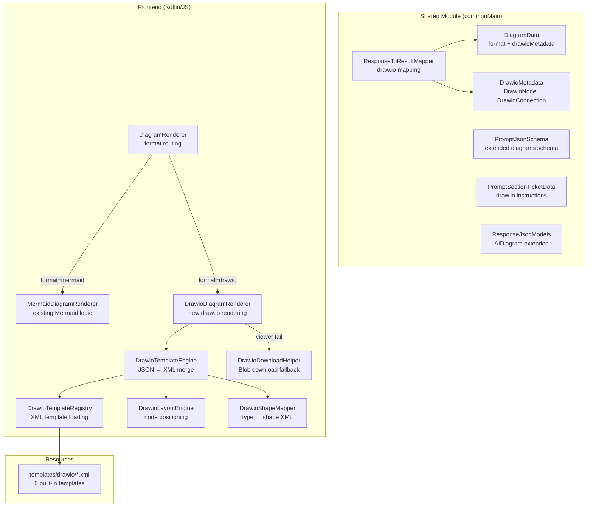
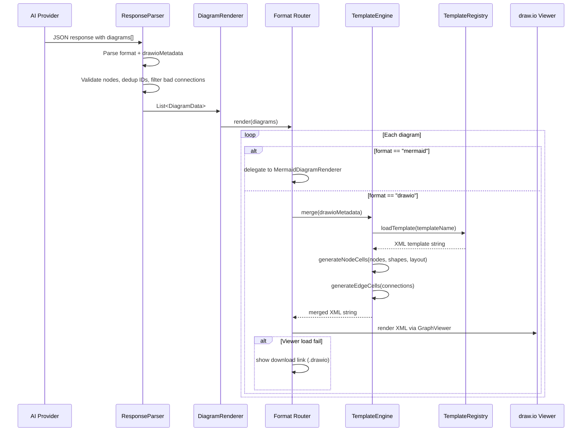

# Draw.io Template-Based Diagrams — Design

## Tổng quan (Overview)

Mở rộng hệ thống sinh sơ đồ trực quan trong Deep Analysis (Req 28) bằng cách thêm hỗ trợ draw.io diagrams sử dụng phương pháp template-based. Phương pháp hybrid: giữ Mermaid cho flow/component/dependency đơn giản, thêm draw.io cho deployment, infrastructure, và business process diagrams cần shapes/icons phong phú hơn.

### Quyết định thiết kế chính

1. **AI sinh JSON metadata, KHÔNG sinh raw XML** — Đảm bảo output luôn hợp lệ, dễ validate, dễ merge vào template. AI chỉ cần chọn template + liệt kê nodes/connections.
2. **Template-based rendering** — Frontend merge JSON metadata vào built-in XML templates, tạo draw.io XML hoàn chỉnh. Templates chứa shape definitions, layout strategy, styling.
3. **Dual format backward compatible** — `DiagramData` thêm trường `format` (default `"mermaid"`) và `drawioMetadata` (nullable). Mermaid diagrams hiện tại không bị ảnh hưởng.
4. **Lazy loading per-format** — Chỉ load Mermaid.js khi có Mermaid diagrams, chỉ load draw.io viewer khi có draw.io diagrams. Tiết kiệm bandwidth.
5. **Format routing tại DiagramRenderer** — Refactor `DiagramRenderer` thành router, delegate sang `MermaidDiagramRenderer` (code hiện tại) và `DrawioDiagramRenderer` (mới).
6. **Templates là XML resource files** — Lưu trong `frontend/src/jsMain/resources/templates/drawio/`, load via fetch on-demand.
7. **Download fallback** — Khi draw.io viewer không khả dụng, tạo Blob download link cho file `.drawio`.
8. **Tách file theo Kotlin code standards** — Max 200 dòng/file, max 20 dòng/function, models ở package riêng.

---

## Kiến trúc (Architecture)

### High-Level Architecture



### Low-Level Data Flow



---

## Components và Interfaces

### Shared Module — Data Models (mở rộng)

| Component | File | Trách nhiệm |
|-----------|------|-------------|
| `DiagramData` | `models/DiagramData.kt` | Mở rộng: thêm `format`, `drawioMetadata` (Req 1.1-1.2) |
| `DrawioMetadata` | `models/DrawioModels.kt` | `template`, `nodes: List<DrawioNode>`, `connections: List<DrawioConnection>` (Req 1.3) |
| `DrawioNode` | `models/DrawioModels.kt` | `id`, `label`, `type` (Req 1.4) |
| `DrawioConnection` | `models/DrawioModels.kt` | `from`, `to`, `label` (Req 1.5) |

### Shared Module — Prompt & Parser (mở rộng)

| Component | File | Trách nhiệm |
|-----------|------|-------------|
| `PromptJsonSchema` | `PromptJsonSchema.kt` | Mở rộng `diagrams` array schema: thêm `format`, `drawioMetadata` (Req 3.6) |
| `PromptSectionTicketData` | `PromptSectionTicketData.kt` | Mở rộng `appendDiagramInstructions()`: thêm draw.io metadata instructions (Req 3.1-3.5) |
| `ResponseJsonModels` | `ResponseJsonModels.kt` | Mở rộng `AIDiagram`: thêm `format`, `drawioMetadata` (Req 7.1) |
| `ResponseToResultMapper` | `ResponseToResultMapper.kt` | Mở rộng `mapDiagram()`: map draw.io metadata, validate, dedup (Req 7.2-7.5) |

### Frontend — Diagram Rendering (refactor + mới)

| Component | File | Trách nhiệm |
|-----------|------|-------------|
| `DiagramRenderer` | `pages/ticket/DiagramRenderer.kt` | **Refactor**: format routing — delegate sang Mermaid hoặc Drawio renderer (Req 6.1-6.4) |
| `MermaidDiagramRenderer` | `pages/ticket/MermaidDiagramRenderer.kt` | **Extract**: toàn bộ Mermaid logic hiện tại từ DiagramRenderer (Req 28.3-28.5 giữ nguyên) |
| `DrawioDiagramRenderer` | `pages/ticket/DrawioDiagramRenderer.kt` | **Mới**: render draw.io diagrams — load viewer, truyền XML, fallback (Req 5.1-5.7) |
| `DrawioTemplateEngine` | `pages/ticket/drawio/DrawioTemplateEngine.kt` | **Mới**: merge JSON metadata vào XML template — async callback `merge(metadata, onReady)` + internal `mergeSync()` (Req 4.1-4.6) |
| `DrawioTemplateRegistry` | `pages/ticket/drawio/DrawioTemplateRegistry.kt` | **Mới**: load/cache XML templates từ resources — async callback `load(name, onReady)` + `resolveTemplateName(name)` cho sync fallback resolution (Req 2.1-2.5) |
| `DrawioLayoutEngine` | `pages/ticket/drawio/DrawioLayoutEngine.kt` | **Mới**: tính toán vị trí nodes theo layout strategy — `calculate(template, nodeCount: Int)` (Req 4.4) |
| `DrawioShapeMapper` | `pages/ticket/drawio/DrawioShapeMapper.kt` | **Mới**: map node type → draw.io shape/style XML — `toCell(id, label, type, x, y, cellId)` + `styleFor(type)` (Req 2.6, 4.2, 4.5) |
| `DrawioDownloadHelper` | `pages/ticket/drawio/DrawioDownloadHelper.kt` | **Mới**: tạo Blob download link cho .drawio file (Req 9.1-9.3) |

### Frontend — Resources (mới)

| Resource | Path | Trách nhiệm |
|----------|------|-------------|
| `flow.xml` | `resources/templates/drawio/flow.xml` | Swimlane layout template |
| `deployment.xml` | `resources/templates/drawio/deployment.xml` | 3-tier: client → server → database |
| `component.xml` | `resources/templates/drawio/component.xml` | Boxes + arrows (generic, fallback) |
| `dependency.xml` | `resources/templates/drawio/dependency.xml` | Left-to-right graph |
| `bpmn.xml` | `resources/templates/drawio/bpmn.xml` | Business process BPMN-style |

### KB Storage (mở rộng)

| Component | File | Trách nhiệm |
|-----------|------|-------------|
| `KBDeepAnalysisData` | `kb/KBDeepAnalysisData.kt` | Không thay đổi — `diagrams: List<DiagramData>` đã serialize `format` + `drawioMetadata` tự động qua kotlinx.serialization (Req 8.1-8.2) |


---

## Data Models

### DiagramData (mở rộng) — `shared/.../models/DiagramData.kt`

```kotlin
@Serializable
data class DiagramData(
    val type: String = "",           // "flow", "component", "dependency", "deployment", "bpmn"
    val title: String = "",
    val mermaidCode: String = "",    // Mermaid syntax (khi format = "mermaid")
    val format: String = "mermaid", // "mermaid" | "drawio" — default "mermaid" cho backward compat (Req 1.1)
    val drawioMetadata: DrawioMetadata? = null  // nullable, chỉ có khi format = "drawio" (Req 1.2)
)
```

### DrawioModels — `shared/.../models/DrawioModels.kt` (mới)

```kotlin
@Serializable
data class DrawioMetadata(
    val template: String = "component",           // template name: flow, deployment, component, dependency, bpmn (Req 1.3)
    val nodes: List<DrawioNode> = emptyList(),     // danh sách nodes
    val connections: List<DrawioConnection> = emptyList()  // danh sách connections
)

@Serializable
data class DrawioNode(
    val id: String = "",      // unique identifier (Req 1.4)
    val label: String = "",   // display text
    val type: String = ""     // node type: webapp, database, external_api, server, mobile, cloud, user, service, queue, cache
)

@Serializable
data class DrawioConnection(
    val from: String = "",    // source node id (Req 1.5)
    val to: String = "",      // target node id
    val label: String = ""    // connection label (optional)
)
```

### AIDiagram (mở rộng) — `shared/.../ResponseJsonModels.kt`

```kotlin
@Serializable
internal data class AIDiagram(
    val type: String = "",
    val title: String = "",
    val mermaidCode: String = "",
    val format: String = "mermaid",                    // mới (Req 7.1)
    val drawioMetadata: AIDrawioMetadata? = null       // mới (Req 7.1)
)

@Serializable
internal data class AIDrawioMetadata(
    val template: String = "component",
    val nodes: List<AIDrawioNode> = emptyList(),
    val connections: List<AIDrawioConnection> = emptyList()
)

@Serializable
internal data class AIDrawioNode(
    val id: String = "",
    val label: String = "",
    val type: String = ""
)

@Serializable
internal data class AIDrawioConnection(
    val from: String = "",
    val to: String = "",
    val label: String = ""
)
```

### PromptJsonSchema (mở rộng) — diagrams array

```json
"diagrams": [
  {
    "type": "flow | component | dependency | deployment | bpmn",
    "title": "string — diagram title",
    "format": "mermaid | drawio",
    "mermaidCode": "string — valid Mermaid syntax (when format=mermaid)",
    "drawioMetadata": {
      "template": "flow | deployment | component | dependency | bpmn",
      "nodes": [
        { "id": "string", "label": "string", "type": "webapp | database | external_api | server | mobile | cloud | user | service | queue | cache" }
      ],
      "connections": [
        { "from": "node_id", "to": "node_id", "label": "string (optional)" }
      ]
    }
  }
]
```

### Draw.io XML Template Structure

Mỗi template XML tuân theo draw.io mxGraphModel format chuẩn. Template chứa:
- Root `<mxGraphModel>` với `<root>` container
- Cell 0 (root) và Cell 1 (default parent)
- Không chứa user cells — `DrawioTemplateEngine` sẽ generate cells từ metadata

```xml
<!-- Ví dụ: deployment.xml skeleton -->
<mxGraphModel>
  <root>
    <mxCell id="0"/>
    <mxCell id="1" parent="0"/>
    <!-- DrawioTemplateEngine sẽ inject node cells và edge cells ở đây -->
  </root>
</mxGraphModel>
```

### DrawioShapeMapper — Node Type → draw.io Style

`DrawioShapeMapper` exposes `styleFor(type): String` for style lookup and `toCell(id, label, type, x, y, cellId): String` for cell XML generation. Node dimensions: width=120, height=80.

| Node Type | draw.io Style | Mô tả |
|-----------|--------------|-------|
| `webapp` | `rounded=1;whiteSpace=wrap;html=1;fillColor=#dae8fc;strokeColor=#6c8ebf;` | Rounded rect, blue |
| `database` | `shape=cylinder3;whiteSpace=wrap;html=1;size=15;fillColor=#d5e8d4;strokeColor=#82b366;` | Database cylinder, green |
| `external_api` | `shape=cloud;whiteSpace=wrap;html=1;fillColor=#fff2cc;strokeColor=#d6b656;` | Cloud shape, yellow |
| `server` | `shape=mxgraph.cisco.servers.standard_server;html=1;fillColor=#f5f5f5;strokeColor=#666666;` | Server icon, gray |
| `mobile` | `shape=mxgraph.android.phone2;html=1;fillColor=#e1d5e7;strokeColor=#9673a6;` | Mobile device, purple |
| `cloud` | `shape=cloud;whiteSpace=wrap;html=1;fillColor=#f8cecc;strokeColor=#b85450;` | Cloud shape, red |
| `user` | `shape=mxgraph.basic.person;html=1;fillColor=#e1d5e7;strokeColor=#9673a6;` | Person icon, purple |
| `service` | `shape=hexagon;perimeter=hexagonPerimeter2;whiteSpace=wrap;html=1;fillColor=#d5e8d4;strokeColor=#82b366;` | Hexagon, green |
| `queue` | `shape=parallelogram;perimeter=parallelogramPerimeter;whiteSpace=wrap;html=1;fillColor=#fff2cc;strokeColor=#d6b656;` | Parallelogram, yellow |
| `cache` | `shape=diamond;whiteSpace=wrap;html=1;fillColor=#f8cecc;strokeColor=#b85450;` | Diamond, red |
| *(unknown)* | `rounded=1;whiteSpace=wrap;html=1;fillColor=#f5f5f5;strokeColor=#666666;` | Default rectangle (Req 4.5) |

### DrawioLayoutEngine — Layout Strategies

| Template | Layout Strategy | Mô tả |
|----------|----------------|-------|
| `deployment` | **Tiered vertical** | 3 tiers từ trên xuống: Client (y=0) → Server (y=200) → Database (y=400). Nodes cùng tier xếp ngang, spacing 160px |
| `flow` | **Swimlane horizontal** | Nodes xếp left-to-right, spacing 200px. Swimlanes theo actor type |
| `component` | **Grid** | Nodes xếp grid 3 cột, spacing 180x140px |
| `dependency` | **Left-to-right DAG** | Topological sort, nodes xếp theo depth level, spacing 200x120px |
| `bpmn` | **Horizontal flow** | Start → activities → gateways → end, spacing 180px |

Node dimensions mặc định: width=120, height=80. Edge routing: orthogonal.

### ResponseToResultMapper — Draw.io Validation Logic

Khi map `AIDiagram` sang `DiagramData` cho format `"drawio"`:

1. **Validate drawioMetadata presence** — Nếu format `"drawio"` nhưng thiếu `drawioMetadata` → skip diagram, log warning (Req 7.2)
2. **Dedup node IDs** — Nếu có node id trùng → giữ node đầu tiên (Req 7.3)
3. **Validate connections** — Nếu connection tham chiếu node id không tồn tại → skip connection, log warning (Req 7.4)
4. **Default format** — Nếu thiếu trường `format` → default `"mermaid"` (Req 7.5)

```kotlin
// Pseudo-code cho mapDiagram mở rộng
private fun mapDiagram(src: AIDiagram): DiagramData? {
    val format = src.format.ifBlank { "mermaid" }
    if (format == "drawio") {
        val meta = src.drawioMetadata ?: return null  // Req 7.2
        val dedupedNodes = meta.nodes.distinctBy { it.id }  // Req 7.3
        val nodeIds = dedupedNodes.map { it.id }.toSet()
        val validConns = meta.connections.filter {
            it.from in nodeIds && it.to in nodeIds  // Req 7.4
        }
        return DiagramData(
            type = src.type, title = src.title,
            format = "drawio",
            drawioMetadata = DrawioMetadata(
                template = meta.template.ifBlank { "component" },
                nodes = dedupedNodes.map { DrawioNode(it.id, it.label, it.type) },
                connections = validConns.map { DrawioConnection(it.from, it.to, it.label) }
            )
        )
    }
    return DiagramData(
        type = src.type, title = src.title,
        mermaidCode = src.mermaidCode, format = format
    )
}
```

### DiagramRenderer — Format Routing Logic

```kotlin
// Refactored DiagramRenderer.kt — chỉ routing
internal object DiagramRenderer {
    fun render(container: HTMLElement, diagrams: List<DiagramData>) {
        if (diagrams.isEmpty()) return
        val section = ContextTabRenderer.createSection(container, "DIAGRAMS")
        val hasMermaid = diagrams.any { it.format != "drawio" }
        val hasDrawio = diagrams.any { it.format == "drawio" }

        // Lazy load chỉ libraries cần thiết (Req 6.3, 6.4)
        for (diagram in diagrams) {
            val card = createDiagramCard(section, diagram)
            when (diagram.format) {
                "drawio" -> DrawioDiagramRenderer.renderInCard(card, diagram)
                else -> MermaidDiagramRenderer.renderInCard(card, diagram)
            }
        }
    }
}
```

### DrawioDiagramRenderer — Rendering Pipeline

```kotlin
// DrawioDiagramRenderer.kt
internal object DrawioDiagramRenderer {
    fun renderInCard(card: HTMLElement, diagram: DiagramData) {
        val metadata = diagram.drawioMetadata ?: return
        val holder = createHolder(card)
        // Async merge: template loading is async via callback
        DrawioTemplateEngine.merge(metadata) { xml ->
            ensureViewerLoaded(
                onReady = { renderWithViewer(holder, xml) },
                onFail = { DrawioDownloadHelper.showFallback(holder, xml, diagram.title) }
            )
        }
    }
}
```

### DrawioTemplateEngine — Merge Pipeline

```kotlin
// DrawioTemplateEngine.kt — async merge with callback
internal object DrawioTemplateEngine {
    fun merge(metadata: DrawioMetadata, onReady: (String) -> Unit) {
        DrawioTemplateRegistry.load(metadata.template) { templateXml ->
            val xml = mergeSync(metadata, templateXml)
            onReady(xml)
        }
    }

    private fun mergeSync(metadata: DrawioMetadata, templateXml: String): String {
        val positions = DrawioLayoutEngine.calculate(metadata.template, metadata.nodes.size)
        val nodeIdMap = metadata.nodes.mapIndexed { i, node -> node.id to (i + 2) }.toMap()
        val nodeCells = metadata.nodes.mapIndexed { i, node ->
            val (x, y) = positions.getOrElse(i) { Pair(40, 40) }
            DrawioShapeMapper.toCell(node.id, node.label, node.type, x, y, nodeIdMap[node.id] ?: (i + 2))
        }
        val edgeCells = metadata.connections.mapIndexed { i, conn ->
            toEdgeCell(conn.label, metadata.nodes.size + i + 2,
                nodeIdMap[conn.from] ?: return@mapIndexed "",
                nodeIdMap[conn.to] ?: return@mapIndexed "")
        }.filter { it.isNotEmpty() }
        return injectCells(templateXml, nodeCells + edgeCells)
    }
}
```

### draw.io Viewer Loading

Tương tự pattern Mermaid.js hiện tại:
- **Bundled locally**: `frontend/src/jsMain/resources/js/viewer-static.min.js` → served at `/js/viewer-static.min.js` (changed from CDN `https://viewer.diagrams.net/js/viewer-static.min.js` — see bugfix spec `brd-diagram-and-sections-fix`)
- Lazy load khi có draw.io diagram đầu tiên
- Sau khi load, tạo `GraphViewer` instance cho mỗi diagram
- Viewer nhận XML string qua `data-mxgraph` attribute trên container div

```javascript
// JS interop — render draw.io diagram
window.__drawioRenderOne = function(el) {
    var xml = el.getAttribute('data-drawio-xml');
    if (!xml) return;
    var config = {
        highlight: '#0000ff',
        nav: false,
        resize: true,
        toolbar: null,
        xml: xml
    };
    el.innerHTML = '';
    new GraphViewer(el, null, [config]);
};
```


---

## Correctness Properties

*A property is a characteristic or behavior that should hold true across all valid executions of a system — essentially, a formal statement about what the system should do. Properties serve as the bridge between human-readable specifications and machine-verifiable correctness guarantees.*

### Property 1: DiagramData serialization round-trip

*For any* valid `DiagramData` với format `"drawio"` và `DrawioMetadata` hợp lệ (random template, random nodes với random types, random connections), serialize sang JSON rồi deserialize SHALL tạo ra đối tượng tương đương với đối tượng gốc.

**Validates: Requirements 1.6**

### Property 2: Mermaid format invariant

*For any* valid `DiagramData` với format `"mermaid"`, trường `drawioMetadata` SHALL là `null` và trường `mermaidCode` SHALL không rỗng — đảm bảo hai format không xung đột dữ liệu.

**Validates: Requirements 1.7**

### Property 3: Template fallback for unknown names

*For any* string không thuộc tập hợp template names hợp lệ (`flow`, `deployment`, `component`, `dependency`, `bpmn`), `DrawioTemplateRegistry.load()` SHALL trả về nội dung XML của template `component` (generic fallback).

**Validates: Requirements 2.4**

### Property 4: Merge output cell counts match metadata

*For any* valid `DrawioMetadata` (random template, 1-20 nodes, 0-30 connections), sau khi `DrawioTemplateEngine.merge()`, output XML SHALL chứa đúng N mxCell elements có attribute `vertex="1"` (bằng số nodes trong metadata) và đúng M mxCell elements có attribute `edge="1"` (bằng số connections trong metadata).

**Validates: Requirements 4.2, 4.3, 4.6**

### Property 5: Layout positions non-overlapping

*For any* danh sách nodes (1-20 nodes) và bất kỳ template nào, `DrawioLayoutEngine.calculate()` SHALL trả về danh sách positions mà không có hai nodes nào có cùng tọa độ (x, y) — đảm bảo nodes không chồng lên nhau.

**Validates: Requirements 4.4**

### Property 6: Unknown node type fallback to default shape

*For any* node type string không thuộc tập hợp types hợp lệ (`webapp`, `database`, `external_api`, `server`, `mobile`, `cloud`, `user`, `service`, `queue`, `cache`), `DrawioShapeMapper.toCell()` SHALL sử dụng style mặc định (rectangle) thay vì throw error.

**Validates: Requirements 4.5**

### Property 7: Format routing correctness

*For any* danh sách `DiagramData` với format ngẫu nhiên (`"mermaid"` hoặc `"drawio"`), `DiagramRenderer` SHALL route mỗi diagram đến đúng renderer — `MermaidDiagramRenderer` cho format `"mermaid"` (hoặc rỗng) và `DrawioDiagramRenderer` cho format `"drawio"`.

**Validates: Requirements 6.1**

### Property 8: Diagram rendering order preservation

*For any* danh sách mixed-format `DiagramData`, thứ tự render trong DOM SHALL giữ nguyên thứ tự của danh sách input — không nhóm theo format.

**Validates: Requirements 6.2**

### Property 9: Parser produces valid metadata (dedup + connection filter)

*For any* AI response JSON chứa draw.io diagram với drawioMetadata có node IDs trùng lặp và connections tham chiếu node IDs không tồn tại, sau khi parse: (a) tất cả node IDs SHALL là unique, (b) tất cả connections SHALL chỉ tham chiếu node IDs tồn tại trong danh sách nodes đã dedup.

**Validates: Requirements 7.3, 7.4**

### Property 10: KB storage round-trip for draw.io diagrams

*For any* valid `KBDeepAnalysisData` chứa danh sách `DiagramData` với mix format (mermaid + drawio), serialize sang JSON rồi deserialize SHALL tạo ra đối tượng tương đương — đảm bảo draw.io metadata không bị mất khi lưu/đọc từ KB.

**Validates: Requirements 8.1**

---

## Error Handling

| Tình huống | Xử lý | Req |
|-----------|-------|-----|
| AI response format `"drawio"` nhưng thiếu `drawioMetadata` | Skip diagram, log warning | 7.2 |
| AI response drawioMetadata có node ID trùng | Dedup theo ID, giữ node đầu tiên | 7.3 |
| AI response connection tham chiếu node ID không tồn tại | Skip connection, log warning | 7.4 |
| AI response thiếu trường `format` | Default `"mermaid"` — backward compatible | 7.5 |
| Template name không tồn tại trong registry | Fallback sang template `component` | 2.4 |
| Node type không có trong shape mapper | Sử dụng shape mặc định (rectangle) | 4.5 |
| draw.io viewer load thất bại | Hiển thị download link `.drawio` + message hướng dẫn (viewer now bundled locally, CDN failure no longer applies) | 5.5, 9.1-9.3 |
| draw.io viewer render thất bại (XML lỗi) | Hiển thị raw XML trong code block + download link | 5.6 |
| KBRecord cũ không có trường `format` | Deserialize default `"mermaid"` — backward compatible | 8.2 |
| DrawioTemplateEngine merge thất bại | Log error, hiển thị fallback message trong card | 4.1 |
| Mermaid syntax error (giữ nguyên) | Fallback raw code block (Req 28.5 — không thay đổi) | 28.5 |

---

## Testing Strategy

### Dual Testing Approach

Feature này phù hợp cho property-based testing vì:
- Có pure functions với input/output rõ ràng (serialization, template merge, layout calculation, parsing)
- Có universal properties (round-trip, invariants, metamorphic)
- Input space lớn (random nodes, connections, templates, formats)

### Property-Based Tests

- **Library**: [Kotest Property Testing](https://kotest.io/docs/proptest/property-based-testing.html) — Kotlin multiplatform PBT library
- **Minimum iterations**: 100 per property
- **Tag format**: `Feature: drawio-template-diagrams, Property {N}: {title}`

Mỗi correctness property (Property 1-10) sẽ được implement bằng 1 property-based test với custom generators:

| Generator | Mô tả |
|-----------|-------|
| `Arb.drawioNode()` | Random DrawioNode: random id (alphanumeric 3-10 chars), random label (1-50 chars), random type từ valid set + 20% chance unknown type |
| `Arb.drawioConnection(nodeIds)` | Random DrawioConnection: from/to từ nodeIds set + 10% chance invalid id, random label |
| `Arb.drawioMetadata()` | Random DrawioMetadata: random template (valid + invalid), 1-20 nodes, 0-30 connections |
| `Arb.diagramData()` | Random DiagramData: 50% mermaid (random mermaidCode) / 50% drawio (random metadata) |
| `Arb.kbDeepAnalysisData()` | Random KBDeepAnalysisData: 0-5 diagrams mixed format |

### Unit Tests (Example-Based)

| Test | Mô tả | Req |
|------|-------|-----|
| Template Registry smoke test | Verify 5 templates loadable | 2.1 |
| Prompt contains draw.io instructions | Verify prompt string content | 3.1-3.5 |
| PromptJsonSchema contains drawioMetadata | Verify schema string | 3.6 |
| Parser skips drawio without metadata | Edge case | 7.2 |
| Parser defaults format to mermaid | Edge case | 7.5 |
| KB backward compat old records | Edge case | 8.2 |
| Download fallback creates Blob | Browser API test | 9.1-9.2 |
| Lazy loading: no viewer when all mermaid | Conditional loading | 6.3 |
| Lazy loading: no mermaid when all drawio | Conditional loading | 6.4 |

### Integration Tests

| Test | Mô tả | Req |
|------|-------|-----|
| Full render pipeline: metadata → template → XML → viewer | End-to-end rendering | 4.1, 5.1-5.3 |
| KB save + load with draw.io diagrams | Persistence round-trip | 8.1, 8.3 |
| AI response with mixed diagrams → correct rendering | Full pipeline | 6.1-6.2, 7.1 |
