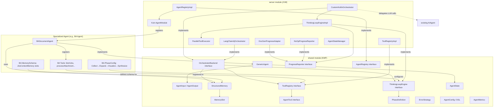
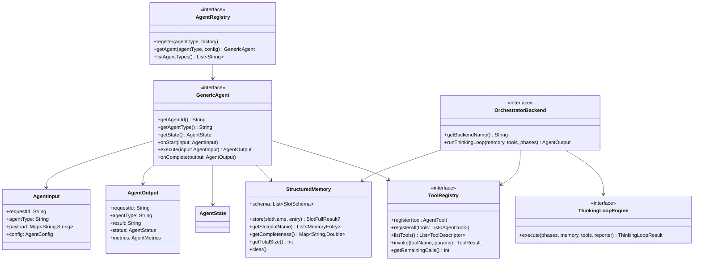
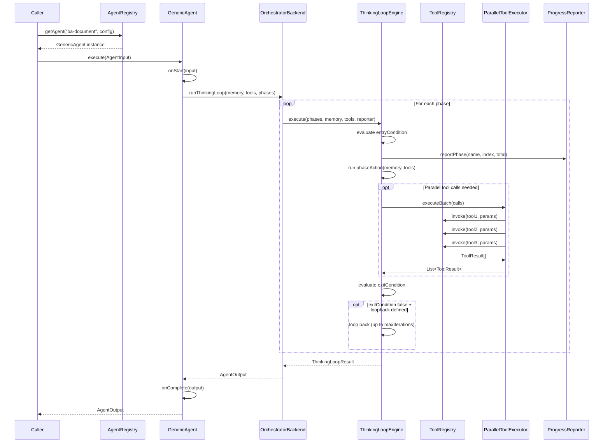
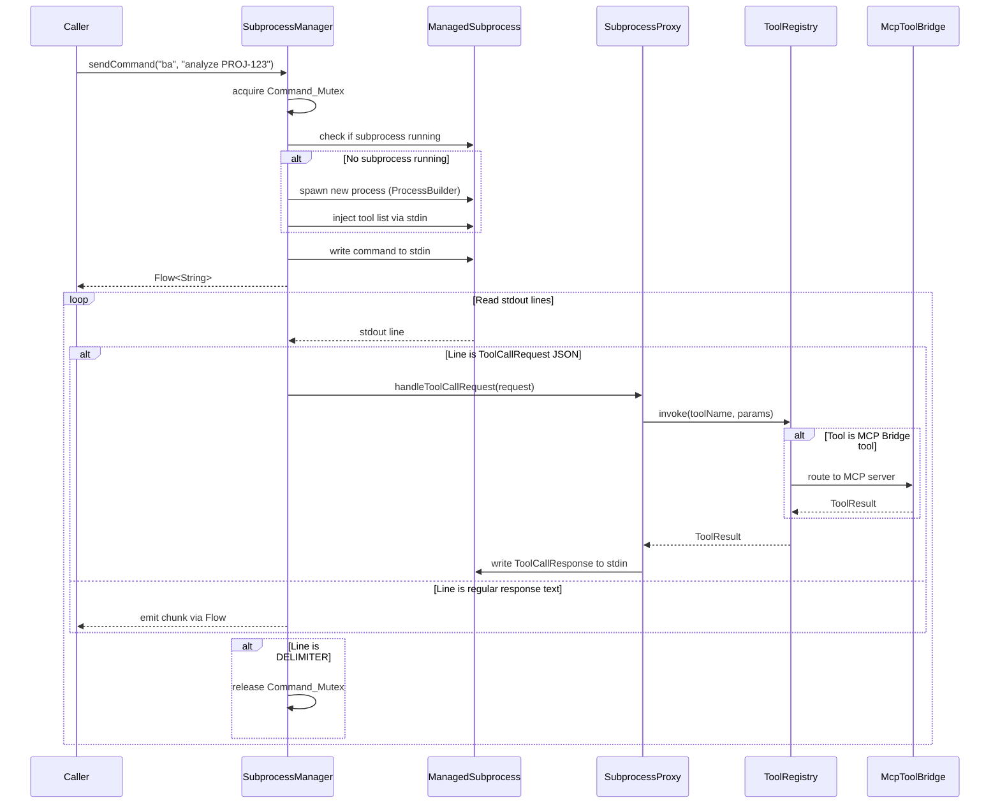
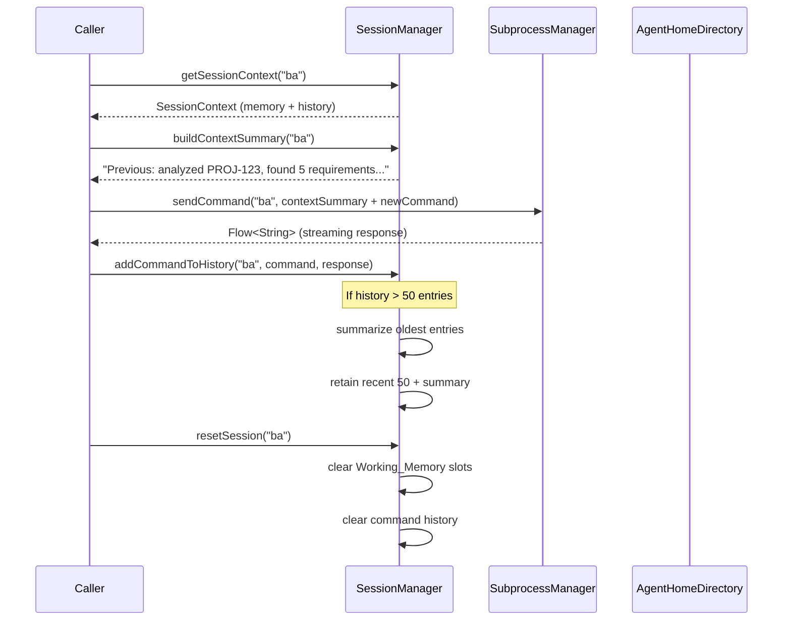
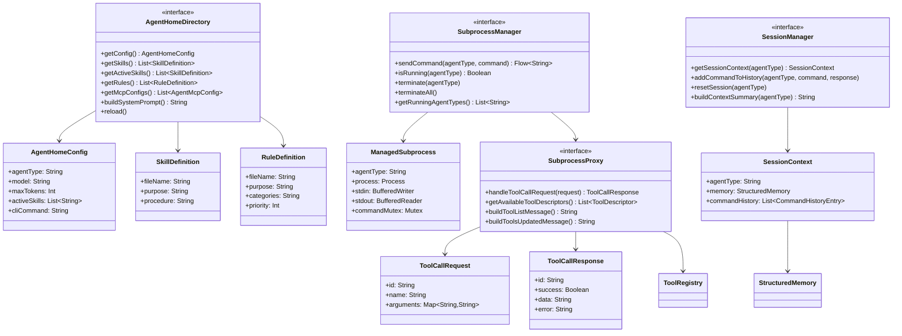
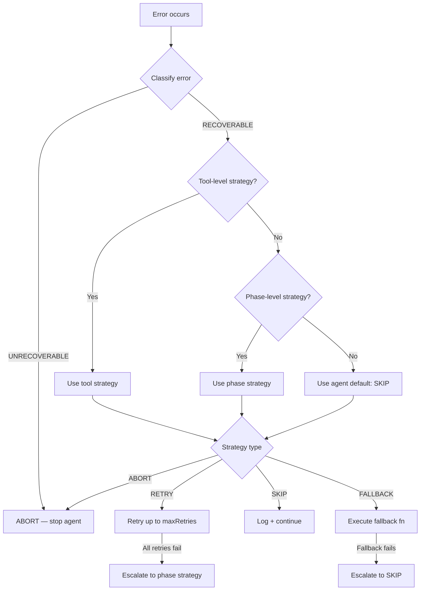
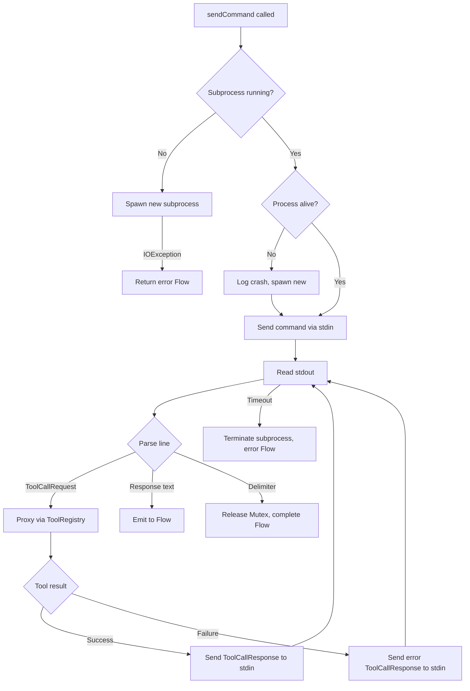

# Design Document — Generic Agent Framework

## Overview

The Generic Agent Framework provides a domain-agnostic foundation for building specialized AI agents within the Jira Assistant application. It extracts the common patterns from the planned agent-based document generation pipeline into reusable abstractions: a common agent interface, structured typed memory, a dynamic tool registry, a configurable multi-phase thinking loop engine, parallel tool execution, serializable agent state, pluggable orchestrator backends, progress reporting, and configurable error handling.

The framework follows a layered architecture:
- **Core interfaces** live in `shared/src/commonMain/kotlin/com/assistant/agent/` (KMP-compatible)
- **Runtime implementations** live in `server/src/jvmMain/kotlin/com/assistant/server/agent/`
- **Specialized agents** (e.g., BA Document Agent) implement core interfaces and register via Koin

The first consumer is the BA Document Agent (from `agent-document-generation` spec), but the framework itself contains zero domain-specific logic. New agents are created by implementing `GenericAgent`, defining a `PhaseConfig`, registering tools, and providing a memory schema — all without modifying framework code.

### Design Decisions

1. **Interfaces in shared, implementations in server** — Core contracts are KMP-compatible for potential future use in frontend or CLI modules. Runtime components that depend on JVM-only libraries (Koin, SLF4J, coroutines with IO dispatcher) live in server.

2. **Reuse existing `AIAgent` interface** — The `OrchestratorBackend` delegates to the existing `AIAgent` interface for LLM calls, avoiding a parallel abstraction. `GeminiCliAgent` and `OllamaAgent` work unchanged.

3. **Kotlin DSL for agent configuration** — Type-safe builders validate configuration at construction time, catching errors like missing tool references or duplicate phase names before runtime.

4. **`kotlinx.serialization` with `encodeDefaults = true`** — All framework data classes use the project's shared `JsonConfig.instance` for consistent serialization, matching the existing codebase pattern.

5. **Koin for DI** — Follows the existing `ServerModule.kt` pattern. Each specialized agent registers a factory function in a Koin module, and the `AgentRegistry` resolves agents via Koin.

6. **Structured concurrency** — All coroutine work uses `coroutineScope` and `supervisorScope` for proper cancellation propagation. The `ParallelToolExecutor` uses `Semaphore` for throttling, matching the existing `jiraApiSemaphore` pattern in `DeepCollector`.

## Architecture



### Package Structure

```
shared/src/commonMain/kotlin/com/assistant/agent/
├── models/
│   ├── AgentInput.kt          # AgentInput data class
│   ├── AgentOutput.kt         # AgentOutput, AgentStatus enum
│   ├── AgentState.kt          # AgentState, AgentStateStatus enum
│   ├── AgentMetrics.kt        # AgentMetrics data class
│   ├── ToolModels.kt          # ToolResult, ToolCall, ToolCallRecord, ToolDescriptor
│   └── ErrorModels.kt         # ErrorStrategy enum, ErrorClassification
├── memory/
│   ├── StructuredMemory.kt    # StructuredMemory class
│   ├── StructuredMemorySerializer.kt  # Custom serializer (surrogate pattern)
│   └── MemorySlot.kt          # SlotSchema, SlotType, MemoryEntry, SlotFullResult
├── tool/
│   ├── AgentTool.kt           # AgentTool interface
│   └── ToolRegistry.kt        # ToolRegistry interface
├── engine/
│   ├── ThinkingLoopEngine.kt  # ThinkingLoopEngine interface, ThinkingLoopResult
│   └── PhaseDefinition.kt     # PhaseDefinition class, PhaseConfig data class
├── orchestrator/
│   └── OrchestratorBackend.kt # OrchestratorBackend interface
├── progress/
│   └── ProgressReporter.kt    # ProgressReporter interface
├── config/
│   ├── AgentConfigDsl.kt      # AgentConfig, DSL entry point, AgentConfigBuilder
│   └── AgentConfigBuilders.kt # MemorySchemaBuilder, PhasesBuilder, ToolsBuilder, LimitsBuilder, ErrorStrategyBuilder
├── registry/
│   └── AgentRegistry.kt       # AgentRegistry interface, AgentNotFoundException
└── GenericAgent.kt            # GenericAgent interface

server/src/jvmMain/kotlin/com/assistant/server/agent/
├── tool/
│   ├── ToolRegistryImpl.kt    # ToolRegistry implementation
│   └── ToolRegistryHelpers.kt # Helper functions (truncateParams, result builders)
├── engine/
│   ├── ThinkingLoopEngineImpl.kt  # ThinkingLoopEngine implementation
│   ├── LoopContext.kt             # Mutable context for loop execution state
│   └── ParallelToolExecutor.kt    # Parallel batch executor
├── orchestrator/
│   ├── CustomKotlinOrchestrator.kt    # Direct API orchestrator
│   └── LangChain4jOrchestrator.kt     # LangChain4j orchestrator (stub)
├── error/
│   ├── ErrorHandler.kt           # Error classification and strategy resolution
│   └── ErrorClassifiers.kt       # Classification helpers and result builders
├── progress/
│   ├── DocGenProgressAdapter.kt   # Adapter to DocGenProgressTracker
│   └── NoOpProgressReporter.kt    # Silent reporter
├── state/
│   └── AgentStateManager.kt      # Pause/resume state management
├── registry/
│   └── AgentRegistryImpl.kt      # Singleton registry
└── di/
    └── AgentModule.kt            # Koin module for framework
```


## Components and Interfaces

### 1. GenericAgent Interface

The core contract that all specialized agents implement. Lives in `shared` module.

```kotlin
// shared/.../agent/GenericAgent.kt
interface GenericAgent {
    fun getAgentId(): String
    fun getAgentType(): String
    fun getState(): AgentState
    suspend fun onStart(input: AgentInput)
    suspend fun execute(input: AgentInput): AgentOutput
    suspend fun onComplete(output: AgentOutput)
}
```

**Design rationale:** `execute()` is the single entry point. The framework calls `onStart()` → `execute()` → `onComplete()` in sequence. `onStart()` lets agents initialize memory or validate input. `onComplete()` lets agents clean up or persist results. `getState()` enables inspection at any point during execution.

### 2. ToolRegistry Interface

Manages registration, discovery, validation, and invocation of agent tools.

```kotlin
// shared/.../agent/tool/ToolRegistry.kt
interface ToolRegistry {
    fun register(tool: AgentTool)
    fun registerAll(tools: List<AgentTool>)
    fun listTools(): List<ToolDescriptor>
    suspend fun invoke(toolName: String, params: Map<String, String>): ToolResult
    fun getRemainingCalls(): Int
    fun resetCallCount()
}
```

**Key behaviors:**
- `invoke()` never throws — all errors are returned as `ToolResult(success=false, ...)`
- Rate limiting is tracked per session via an internal counter (default: 50 calls max)
- Each invocation has a configurable timeout (default: 30s) enforced via `withTimeout`
- Tool replacement on duplicate name registration with a logged warning
- Every invocation is logged: tool name, truncated params (200 chars), execution time, result size, success/failure

### 3. ThinkingLoopEngine Interface

Drives an agent through its defined phases sequentially.

```kotlin
// shared/.../agent/engine/ThinkingLoopEngine.kt
interface ThinkingLoopEngine {
    suspend fun execute(
        phases: List<PhaseDefinition>,
        memory: StructuredMemory,
        toolRegistry: ToolRegistry,
        reporter: ProgressReporter
    ): ThinkingLoopResult
}
```

**Key behaviors:**
- Evaluates `entryCondition` before each phase — skips if false
- Runs `phaseAction` then checks `exitCondition`
- If `exitCondition` is false and a loopback target is defined, loops back (up to `maxIterations`)
- Phase timeout: cancels phase and proceeds with available data
- Total execution timeout (default: 120s): force-completes by skipping to final phase
- Reports phase transitions to `ProgressReporter`
- Maintains a reasoning log of all decisions

### 4. ParallelToolExecutor

Coroutine-based batch executor for independent tool calls.

```kotlin
// server/.../agent/engine/ParallelToolExecutor.kt
class ParallelToolExecutor(
    private val toolRegistry: ToolRegistry,
    private val maxConcurrency: Int = 5
) {
    suspend fun executeBatch(calls: List<ToolCall>): List<ToolResult>
}
```

**Key behaviors:**
- Uses `coroutineScope` + `async` for concurrent execution
- `Semaphore(maxConcurrency)` throttles concurrent calls
- Individual failures don't cancel siblings (each `async` catches its own errors)
- Returns results in the same order as input calls (order preservation)
- Excess calls beyond concurrency limit are queued FIFO
- Logs wall-clock time for each batch and individual execution times

### 5. OrchestratorBackend Interface

Abstracts the LLM interaction layer.

```kotlin
// shared/.../agent/orchestrator/OrchestratorBackend.kt
interface OrchestratorBackend {
    fun getBackendName(): String
    suspend fun runThinkingLoop(
        memory: StructuredMemory,
        tools: ToolRegistry,
        phases: List<PhaseDefinition>
    ): AgentOutput
}
```

**Two implementations:**
- **CustomKotlinOrchestrator** — Manages the thinking loop using Kotlin Coroutines and delegates LLM calls to the existing `AIAgent` interface. No external AI framework dependencies. This is the default and is registered in Koin as `factory<OrchestratorBackend> { CustomKotlinOrchestrator(get(), get()) }`.
- **LangChain4jOrchestrator** — Delegates to LangChain4j's `AiServices` and `@Tool` support. Optional, loaded only when LangChain4j is on the classpath. Falls back to `CustomKotlinOrchestrator` if initialization fails. Registered as concrete type only (`factory { LangChain4jOrchestrator(get()) }`).

**Design rationale:** The interface uses only framework-defined types — no Gemini, Ollama, or LangChain4j types leak through. `CustomKotlinOrchestrator` is bound to the `OrchestratorBackend` interface in Koin so that consumers (e.g., `BADocumentAgent`) can resolve it via `get<OrchestratorBackend>()`.

### 6. ProgressReporter Interface

Integration point with the existing progress tracking system.

```kotlin
// shared/.../agent/progress/ProgressReporter.kt
interface ProgressReporter {
    suspend fun reportPhase(phaseName: String, phaseIndex: Int, totalPhases: Int)
    suspend fun reportProgress(percent: Int, message: String)
    suspend fun reportToolCall(toolName: String, status: String)
}
```

**Two implementations:**
- **DocGenProgressAdapter** — Delegates to existing `DocGenProgressTracker`, mapping agent phases to existing labels (AGGREGATING_DATA, GENERATING_DOCUMENT, PARSING_RESPONSE, SAVING). Uses a ratio-based mapping: first 25% → AGGREGATING_DATA, 25-75% → GENERATING_DOCUMENT, 75-90% → PARSING_RESPONSE, 90%+ → SAVING.
- **NoOpProgressReporter** — Silently discards all events. Used when no reporter is provided.

Both are injectable via Koin, enabling specialized agents to provide custom implementations.

### 7. AgentRegistry Interface

Central registry for agent discovery and instantiation.

```kotlin
// shared/.../agent/registry/AgentRegistry.kt
interface AgentRegistry {
    fun register(agentType: String, factory: (AgentConfig) -> GenericAgent)
    fun getAgent(agentType: String, config: AgentConfig): GenericAgent
    fun listAgentTypes(): List<String>
}
```

**Key behaviors:**
- Singleton, initialized during Koin module setup
- `getAgent()` instantiates via factory function and injects dependencies via Koin
- Throws `AgentNotFoundException` with available types if requested type is not registered
- Duplicate registration replaces existing factory with a logged warning

### 8. AgentConfig DSL

Declarative configuration for specialized agents.

```kotlin
// Usage example:
val baAgentConfig = agentConfig {
    memorySchema {
        stringSlot("summary", maxChars = 10_000)
        listSlot("comments", maxEntries = 50)
        mapSlot("linkedTickets", maxEntries = 20)
    }
    phases {
        phase("collect") {
            entryCondition { true }
            action { memory, tools -> /* collect logic */ }
            exitCondition { memory -> memory.getCompleteness()["summary"]!! > 0.0 }
            maxDurationSeconds = 30
            errorStrategy = ErrorStrategy.RETRY
        }
        phase("expand") {
            entryCondition { memory -> memory.getSlot("summary").isNotEmpty() }
            action { memory, tools -> /* expand logic */ }
            exitCondition { memory -> memory.getCompleteness()["linkedTickets"]!! > 0.5 }
            loopbackTarget = "collect"
            maxDurationSeconds = 30
        }
    }
    tools {
        register(fetchJiraDetailsTool)
        register(processAttachmentTool)
    }
    limits {
        maxTotalDurationSeconds = 120
        maxToolCalls = 50
        maxIterations = 3
        maxConcurrentTools = 5
    }
    errorStrategy {
        default = ErrorStrategy.SKIP
        forTool("fetchJiraDetails", ErrorStrategy.RETRY)
    }
}
```

**Validation at construction time:**
- Phase names must be unique
- Memory slot names must be unique
- Throws `InvalidAgentConfigException` listing all validation errors

**Deferred to runtime** (tools and phases may not be registered at config construction time):
- Loopback targets referencing existing phases
- Referenced tool names being registered in the ToolRegistry


## Data Models

All data models use `@Serializable` from `kotlinx.serialization` and follow the project convention of using `JsonConfig.instance` (with `encodeDefaults = true`, `ignoreUnknownKeys = true`).

### AgentInput

```kotlin
@Serializable
data class AgentInput(
    val requestId: String,
    val agentType: String,
    val payload: Map<String, String> = emptyMap(),
    val config: AgentConfig
)
```

### AgentOutput

```kotlin
@Serializable
data class AgentOutput(
    val requestId: String,
    val agentType: String,
    val result: String,
    val metadata: Map<String, String> = emptyMap(),
    val reasoningLog: List<String> = emptyList(),
    val toolCallCount: Int = 0,
    val totalDurationMs: Long = 0,
    val status: AgentStatus = AgentStatus.SUCCESS,
    val metrics: AgentMetrics = AgentMetrics()
)

@Serializable
enum class AgentStatus { SUCCESS, PARTIAL, FAILED }
```

### AgentMetrics

```kotlin
@Serializable
data class AgentMetrics(
    val totalDurationMs: Long = 0,
    val phaseCount: Int = 0,
    val toolCallCount: Int = 0,
    val parallelBatchCount: Int = 0,
    val memoryTotalChars: Int = 0,
    val outputSizeChars: Int = 0,
    val retryCount: Int = 0,
    val errorCount: Int = 0
)
```

### AgentState

```kotlin
@Serializable
data class AgentState(
    val agentId: String,
    val agentType: String,
    val currentPhase: String = "",
    val phaseIndex: Int = 0,
    val iterationCount: Int = 0,
    val memorySnapshot: String = "",  // Serialized StructuredMemory JSON
    val toolCallHistory: List<ToolCallRecord> = emptyList(),
    val reasoningLog: List<String> = emptyList(),
    val elapsedTimeMs: Long = 0,
    val status: AgentStateStatus = AgentStateStatus.RUNNING
) {
    companion object {
        const val MAX_REASONING_LOG_ENTRIES = 100
    }
}

@Serializable
enum class AgentStateStatus { RUNNING, PAUSED, COMPLETED, FAILED }
```

### ToolResult and ToolCall

```kotlin
@Serializable
data class ToolResult(
    val toolName: String,
    val data: String = "",
    val executionTimeMs: Long = 0,
    val dataSizeChars: Int = 0,
    val success: Boolean = true,
    val errorType: String? = null,
    val errorMessage: String? = null
)

@Serializable
data class ToolCall(
    val toolName: String,
    val params: Map<String, String> = emptyMap()
)

@Serializable
data class ToolCallRecord(
    val toolName: String,
    val params: Map<String, String> = emptyMap(),
    val executionTimeMs: Long = 0,
    val dataSizeChars: Int = 0,
    val success: Boolean = true,
    val timestamp: String = ""
)

@Serializable
data class ToolDescriptor(
    val name: String,
    val description: String,
    val parameterNames: List<String> = emptyList()
)
```

### StructuredMemory and MemorySlot

```kotlin
@Serializable
data class SlotSchema(
    val name: String,
    val type: SlotType,
    val maxSize: Int  // maxChars for STRING, maxEntries for LIST/MAP
)

@Serializable
enum class SlotType { STRING, LIST, MAP }

@Serializable
data class MemoryEntry(
    val data: String,
    val source: String = "",
    val toolName: String = "",
    val timestamp: String = ""
)

@Serializable
data class SlotFullResult(
    val slotName: String,
    val currentSize: Int
)
```

`StructuredMemory` is a class (not a data class) that holds a schema and slot contents:

```kotlin
@Serializable
class StructuredMemory(
    val schema: List<SlotSchema>
) {
    private val slots: MutableMap<String, MutableList<MemoryEntry>> = mutableMapOf()

    fun store(slotName: String, entry: MemoryEntry): SlotFullResult?
    fun getSlot(slotName: String): List<MemoryEntry>
    fun getCompleteness(): Map<String, Double>
    fun getTotalSize(): Int
    fun clear()
    // Serialization handled via custom serializer
}
```

### ErrorStrategy

```kotlin
@Serializable
enum class ErrorStrategy { RETRY, SKIP, ABORT, FALLBACK }

@Serializable
data class RetryConfig(
    val maxRetries: Int = 2,
    val delayMs: Long = 2000
)

@Serializable
enum class ErrorClassification { RECOVERABLE, UNRECOVERABLE }
```

Recoverable errors: tool timeout, network error, rate limit exceeded.
Unrecoverable errors: authentication failure, invalid agent config, agent not found.

### PhaseDefinition and PhaseConfig

```kotlin
@Serializable
data class PhaseConfig(
    val phases: List<String> = emptyList(),
    val maxIterations: Int = 3,
    val totalTimeoutSeconds: Int = 120
)
```

`PhaseConfig` stores phase names as strings (not `PhaseDefinition` objects) because `PhaseDefinition` contains non-serializable function references (entry/exit conditions, phase action). `PhaseDefinition` is constructed via the DSL at runtime and not directly serialized. The serializable `AgentConfig` stores phase metadata (names, timeouts, error strategies) while the runtime DSL provides the function references.

```kotlin
class PhaseDefinition(
    val name: String,
    val entryCondition: (StructuredMemory) -> Boolean,
    val phaseAction: suspend (StructuredMemory, ToolRegistry) -> Unit,
    val exitCondition: (StructuredMemory) -> Boolean,
    val maxDurationSeconds: Int = 30,
    val errorStrategy: ErrorStrategy = ErrorStrategy.SKIP,
    val loopbackTarget: String? = null
)
```

### AgentConfig

```kotlin
@Serializable
data class AgentConfig(
    val memorySchema: List<SlotSchema> = emptyList(),
    val phaseNames: List<String> = emptyList(),
    val toolNames: List<String> = emptyList(),
    val maxTotalDurationSeconds: Int = 120,
    val maxToolCalls: Int = 50,
    val maxIterations: Int = 3,
    val maxConcurrentTools: Int = 5,
    val defaultErrorStrategy: ErrorStrategy = ErrorStrategy.SKIP,
    val toolErrorStrategies: Map<String, ErrorStrategy> = emptyMap()
)
```

### Class Diagram



### Sequence Diagram — Agent Execution Flow




## Correctness Properties

*A property is a characteristic or behavior that should hold true across all valid executions of a system — essentially, a formal statement about what the system should do. Properties serve as the bridge between human-readable specifications and machine-verifiable correctness guarantees.*

### Property 1: AgentInput serialization round-trip

*For any* valid `AgentInput` object with arbitrary `requestId`, `agentType`, `payload` map, and `AgentConfig`, serializing to JSON via `JsonConfig.instance` then deserializing back SHALL produce an equivalent `AgentInput` object.

**Validates: Requirements 1.4, 1.6**

### Property 2: AgentOutput serialization round-trip

*For any* valid `AgentOutput` object with arbitrary `requestId`, `agentType`, `result`, `metadata`, `reasoningLog`, `toolCallCount`, `totalDurationMs`, `status`, and `AgentMetrics`, serializing to JSON then deserializing back SHALL produce an equivalent `AgentOutput` object.

**Validates: Requirements 1.5, 1.7**

### Property 3: StructuredMemory serialization round-trip

*For any* `StructuredMemory` instance with arbitrary schema and slot contents (including metadata: source, toolName, timestamp), serializing to JSON then deserializing back SHALL produce a `StructuredMemory` with equivalent slot contents and metadata.

**Validates: Requirements 2.4, 2.8**

### Property 4: AgentState serialization round-trip

*For any* `AgentState` object with arbitrary phase, iteration count, memory snapshot, tool call history, reasoning log (up to 100 entries), elapsed time, and status, serializing to JSON then deserializing back SHALL produce an equivalent `AgentState`.

**Validates: Requirements 6.2, 6.6**

### Property 5: AgentConfig serialization round-trip

*For any* valid `AgentConfig` object built via the DSL with arbitrary memory schema, phase names, tool names, execution limits, and error strategies, serializing to JSON then deserializing back SHALL produce an equivalent `AgentConfig`.

**Validates: Requirements 10.4, 10.6**

### Property 6: StructuredMemory completeness calculation

*For any* `StructuredMemory` with a defined schema and arbitrary entries stored in its slots, `getCompleteness()` SHALL return a map where each slot's value equals `currentEntries / maxEntries` for LIST/MAP slots, or `currentChars / maxChars` for STRING slots, with values clamped to the range [0.0, 1.0].

**Validates: Requirements 2.3**

### Property 7: StructuredMemory slot capacity enforcement

*For any* `StructuredMemory` slot with `maxSize` N, after storing exactly N entries, the next `store()` call SHALL return a `SlotFullResult` containing the slot name and current size N, and the slot contents SHALL remain unchanged at N entries.

**Validates: Requirements 2.5**

### Property 8: StructuredMemory clear resets all slots

*For any* `StructuredMemory` with arbitrary data across all slots, after calling `clear()`, `getSlot(name)` SHALL return an empty list for every slot name in the schema, and `getTotalSize()` SHALL return 0.

**Validates: Requirements 2.6**

### Property 9: StructuredMemory getTotalSize invariant

*For any* `StructuredMemory` with arbitrary entries, `getTotalSize()` SHALL equal the sum of `entry.data.length` across all entries in all slots.

**Validates: Requirements 2.7**

### Property 10: ToolRegistry registration and listing

*For any* set of `AgentTool` instances registered (including duplicate names where the last registration wins), `listTools()` SHALL return exactly one `ToolDescriptor` per unique tool name, reflecting the most recently registered tool for each name.

**Validates: Requirements 3.1, 3.7, 3.8**

### Property 11: ToolRegistry invoke never throws

*For any* tool invocation — whether the tool succeeds, throws an exception, times out, or receives invalid parameters — `invoke()` SHALL return a `ToolResult` and SHALL NOT propagate exceptions to the caller.

**Validates: Requirements 3.2, 3.3**

### Property 12: ToolRegistry rate limiting

*For any* configured rate limit N, after exactly N successful tool invocations in a session, the (N+1)th invocation SHALL return a `ToolResult` with `success = false` and `errorType = "RATE_LIMIT_EXCEEDED"`.

**Validates: Requirements 3.4**

### Property 13: ThinkingLoopEngine phase execution order

*For any* `PhaseConfig` with an ordered list of phases where all entry conditions return true, the engine SHALL execute phase actions in the declared order, and the reasoning log SHALL reflect this order.

**Validates: Requirements 4.1, 4.6**

### Property 14: ThinkingLoopEngine progress reporting

*For any* `PhaseConfig` with N phases, the engine SHALL call `ProgressReporter.reportPhase()` at least N times during execution, once per phase entered.

**Validates: Requirements 4.5, 8.3**

### Property 15: ParallelToolExecutor order preservation and count

*For any* batch of N tool calls submitted to `executeBatch()`, the result SHALL contain exactly N `ToolResult` objects, and `result[i].toolName` SHALL equal `calls[i].toolName` for all i in 0..N-1.

**Validates: Requirements 5.1, 5.6**

### Property 16: ParallelToolExecutor failure isolation

*For any* batch containing a mix of succeeding and failing tool calls, all non-failing calls SHALL complete successfully and return `ToolResult(success=true)` regardless of other calls' failures.

**Validates: Requirements 5.3**

### Property 17: AgentState reasoning log cap

*For any* sequence of reasoning log additions to an `AgentState`, the reasoning log SHALL never contain more than 100 entries. When additions exceed 100, only the most recent 100 entries SHALL be retained.

**Validates: Requirements 6.5**

### Property 18: ErrorStrategy RETRY invocation count

*For any* tool with `ErrorStrategy.RETRY` and `maxRetries = N` that always fails, the framework SHALL invoke the tool exactly N+1 times (1 original attempt + N retries) before escalating to the phase-level error strategy.

**Validates: Requirements 9.4**

### Property 19: Error classification correctness

*For any* error of a known type, the framework SHALL classify tool timeouts, network errors, and rate limit errors as `RECOVERABLE`, and authentication failures and invalid agent config errors as `UNRECOVERABLE`.

**Validates: Requirements 9.7**

### Property 20: AgentConfig validation rejects invalid configurations

*For any* `AgentConfig` containing duplicate phase names, or referencing tool names not in the registry, or with loopback targets referencing non-existent phases, or with duplicate memory slot names, validation SHALL throw `InvalidAgentConfigException` listing all validation errors.

**Validates: Requirements 10.2, 10.3**

### Property 21: AgentRegistry registration and retrieval

*For any* set of agent type names registered with factory functions, `getAgent(type)` SHALL return a `GenericAgent` for each registered type, and `listAgentTypes()` SHALL return exactly the set of registered type names (with duplicates resolved to the latest registration).

**Validates: Requirements 12.1, 12.4, 12.5**

### Property 22: AgentRegistry unknown type exception

*For any* agent type name that has not been registered, `getAgent(type)` SHALL throw `AgentNotFoundException` containing the requested type name and the list of available agent types.

**Validates: Requirements 12.3**

### Property 23: AgentHomeConfig serialization round-trip

*For any* valid `AgentHomeConfig` object with arbitrary `agentType`, `model`, `maxTokens`, `apiEndpoint`, `activeSkills`, `activeRules`, `cliCommand`, `cliArgs`, and `environment`, serializing to JSON via `JsonConfig.instance` then deserializing back SHALL produce an equivalent `AgentHomeConfig` object.

**Validates: Requirements 14.5**

### Property 24: Subprocess singleton reuse

*For any* sequence of N commands (N ≥ 2) sent to the same agent type, the `SubprocessManager` SHALL reuse the same subprocess for all N commands — the total number of process spawns for that agent type SHALL be exactly 1 (assuming no crashes).

**Validates: Requirements 13.1**

### Property 25: Command_Mutex sequential execution

*For any* set of N concurrent commands submitted to the same agent subprocess, the commands SHALL execute sequentially — for all pairs of commands (i, j) where i was queued before j, command i SHALL complete before command j begins execution.

**Validates: Requirements 13.3**

### Property 26: Message protocol round-trip

*For any* valid command string, formatting it with the message protocol (adding JSON envelope and delimiter) then parsing the formatted message back SHALL recover the original command string.

**Validates: Requirements 13.2**

### Property 27: Streaming output order preservation

*For any* subprocess that produces N response chunks on stdout in order [c₁, c₂, ..., cₙ], the `Flow<String>` returned by `sendCommand()` SHALL emit chunks in the same order [c₁, c₂, ..., cₙ] with no chunks lost or reordered.

**Validates: Requirements 13.5, 17.1**

### Property 28: Agent home directory scan and load

*For any* valid agent home directory containing N skill files, M rule files, and K workflow files, after initialization the `AgentHomeDirectory` SHALL report exactly N skills, M rules, and K workflows (excluding any files that fail validation).

**Validates: Requirements 14.1, 14.2**

### Property 29: Skill parsing and prompt composition

*For any* set of N valid skill files (each containing `## Purpose` and `## Procedure` sections), the combined system prompt produced by `buildSystemPrompt()` SHALL contain the purpose and procedure content from all N skill files.

**Validates: Requirements 15.1, 15.2**

### Property 30: Skill activation filtering

*For any* agent home directory with N skill files and an `activeSkills` config listing a subset S (where S ⊆ N), `getActiveSkills()` SHALL return exactly |S| skills matching the listed file names. When `activeSkills` is empty, `getActiveSkills()` SHALL return all N skills.

**Validates: Requirements 15.3**

### Property 31: Markdown file validation — invalid files are skipped

*For any* skill file missing `## Purpose` or `## Procedure`, or any rule file missing `## Purpose` or `## Categories`, the framework SHALL skip the invalid file and load only valid files — the count of loaded files SHALL equal the count of valid files.

**Validates: Requirements 15.4, 16.4**

### Property 32: Rule parsing and priority ordering

*For any* set of N valid rule files with distinct priority values, when multiple rules match the same input, the framework SHALL apply rules in ascending priority order (lowest number first) and use the first matching rule's classification.

**Validates: Requirements 16.1, 16.2, 16.3**

### Property 33: Session memory persistence across commands

*For any* session with N sequential commands where each command stores data in a distinct memory slot, after all N commands complete, the session's `StructuredMemory` SHALL contain data from all N commands — no data from earlier commands SHALL be lost.

**Validates: Requirements 18.1**

### Property 34: Session reset clears working memory

*For any* session with arbitrary Working_Memory contents and command history, after calling `resetSession()`, all Working_Memory slots SHALL be empty and the command history SHALL be empty.

**Validates: Requirements 18.2**

### Property 35: Command history cap

*For any* session where N commands are sent (N > 50), the command history SHALL never contain more than 50 individual entries plus at most one summary entry. The most recent 50 commands SHALL be retained as individual entries.

**Validates: Requirements 18.4, 18.5**

### Property 36: MCP tool registration with server prefix

*For any* MCP server configuration with server name S containing tools [t₁, t₂, ..., tₙ], after auto-registration the `ToolRegistry` SHALL contain tools named `mcp_{S}_{t₁}`, `mcp_{S}_{t₂}`, ..., `mcp_{S}_{tₙ}`.

**Validates: Requirements 19.1, 19.3**

### Property 37: ToolCallRequest/ToolCallResponse serialization round-trip

*For any* valid `ToolCallRequest` with arbitrary `id`, `name`, and `arguments`, and for any valid `ToolCallResponse` with arbitrary `id`, `success`, `data`, and `error`, serializing to JSON then deserializing back SHALL produce equivalent objects.

**Validates: Requirements 20.1, 20.4**

### Property 38: Parallel tool call proxying with correlation ID matching

*For any* set of N concurrent `ToolCallRequest` messages emitted by a subprocess, the Orchestrator SHALL return exactly N `ToolCallResponse` messages, and each response's `id` SHALL match exactly one request's `id` — establishing a bijection between requests and responses.

**Validates: Requirements 20.5**

### Property 39: Tool call error isolation — subprocess survives failures

*For any* `ToolCallRequest` targeting a non-existent tool or a tool that fails, the Orchestrator SHALL return a `ToolCallResponse` with `success = false` and a descriptive error message, and the subprocess SHALL remain alive and able to process subsequent commands.

**Validates: Requirements 20.6**

### Property 40: Tool registration priority ordering

*For any* tool name registered from multiple sources (Local, Agent Home MCP, Shared MCP Bridge), the `ToolRegistry` SHALL resolve to the highest-priority source: Local > Agent Home MCP > Shared MCP Bridge. Lower-priority registrations with the same name SHALL be skipped.

**Validates: Requirements 20.9**

---

## Agent-as-Subprocess Architecture (Requirements 13–20)

### Overview

Requirements 13–20 introduce the **Agent-as-Subprocess** architecture, where AI agents run as long-lived CLI subprocesses (e.g., Gemini CLI, Ollama CLI) managed by the Orchestrator. This replaces the per-request process spawning pattern (seen in `GeminiCliAgent`) with persistent subprocesses that maintain context across multiple commands within a session.

The key architectural shift: instead of agents being in-process Kotlin objects with direct method calls, each agent runs as a separate OS process communicating via **stdin/stdout streaming**. The Orchestrator sends commands, receives streaming responses, manages lifecycle, and proxies tool calls between subprocesses and the application's shared MCP infrastructure.

### Design Decisions (Requirements 13–20)

7. **Singleton subprocess per agent type** — Each agent type has at most one running subprocess at a time. This avoids resource waste and simplifies context management. The `SubprocessManager` uses a `ConcurrentHashMap<String, ManagedSubprocess>` keyed by agent type, matching the `McpProcessManagerImpl.processes` pattern.

8. **Kotlin Coroutines + Dispatchers.IO for subprocess I/O** — All blocking I/O with subprocess stdin/stdout/stderr runs on `Dispatchers.IO` via `withContext`. This follows the existing pattern in `GeminiCliAgent` and `McpProcessManagerImpl`.

9. **Mutex from kotlinx.coroutines.sync for Command_Mutex** — Each subprocess gets a `Mutex` to ensure sequential command execution. This is simpler than a channel-based approach and matches the project's existing `Semaphore` usage pattern (e.g., `jiraApiSemaphore`, `aiSemaphore`).

10. **java.nio.file.WatchService for file watching** — The `AgentHomeDirectoryWatcher` uses the JDK's `WatchService` API for hot-reload of skill/rule/workflow files. This avoids external dependencies and runs on a dedicated `Dispatchers.IO` coroutine.

11. **kotlinx.serialization for Tool_Call_Request/Response** — The subprocess message protocol uses JSON with `kotlinx.serialization`, consistent with all other framework data classes. Delimiters (`---END---`) separate messages in the stdout stream.

12. **Three-tier tool priority** — Local tools > Agent Home MCP tools > Shared MCP Bridge tools. This ensures agent-specific overrides always win, matching the priority described in the `agent-mcp-tool-bridge` spec.

13. **Reuse existing McpProcessManager pattern** — The `AgentMcpManager` (for agent home directory MCP servers) follows the same lifecycle pattern as `McpProcessManagerImpl`: start → health monitor → auto-restart → graceful shutdown.

### Extended Architecture Diagram

```mermaid
graph TB
    subgraph "Orchestrator (Jira Assistant App)"
        SM[SubprocessManager]
        SPR[SubprocessProxy]
        AHD[AgentHomeDirectoryLoader]
        AHW[AgentHomeDirectoryWatcher]
        AMM[AgentMcpManager]
        SSM[SessionManager]
        TR2[ToolRegistry]
        MTB[McpToolBridge ⁽shared⁾]
    end

    subgraph "Agent Subprocess (e.g., Gemini CLI)"
        STDIN[stdin]
        STDOUT[stdout]
        STDERR[stderr]
        LLM[LLM Context]
        TC[Tool Call Requests]
    end

    subgraph "Agent Home Directory"
        SK[.agent/skills/*.md]
        RL[.agent/rules/*.md]
        WF[.agent/workflows/*.md]
        MEM[.agent/memory/]
        MCP_CFG[.agent/mcp/*.json]
        CFG[config.json]
        WS[workspace/]
    end

    subgraph "Shared MCP Servers (Tầng 2)"
        JIRA_MCP[Jira MCP Server]
        PW_MCP[Playwright MCP]
        INT_MCP[Internal MCP Server]
    end

    SM -->|spawn/reuse| STDIN
    SM -->|read| STDOUT
    SM -->|capture| STDERR
    SM -->|Command_Mutex| SM

    SPR -->|parse Tool_Call_Request| STDOUT
    SPR -->|send Tool_Call_Response| STDIN
    SPR -->|invoke| TR2
    TR2 -->|local tools| TR2
    TR2 -->|MCP bridge| MTB
    MTB -->|route| JIRA_MCP
    MTB -->|route| PW_MCP
    MTB -->|route| INT_MCP

    AHD -->|load| SK
    AHD -->|load| RL
    AHD -->|load| WF
    AHD -->|parse| CFG
    AHW -->|watch| SK
    AHW -->|watch| RL
    AHW -->|watch| WF

    AMM -->|read configs| MCP_CFG
    AMM -->|start servers| AMM
    AMM -->|register tools| TR2

    SSM -->|session context| SM
    SSM -->|command history| SSM
    SSM -->|memory| MEM
```



### Extended Package Structure

```
shared/src/commonMain/kotlin/com/assistant/agent/
├── ... (existing packages) ...
├── subprocess/
│   ├── SubprocessManager.kt          # Interface for managing agent subprocesses
│   ├── SubprocessProxy.kt            # Interface for proxying tool calls
│   ├── SubprocessConfig.kt           # Subprocess configuration data class
│   └── SubprocessModels.kt           # ToolCallRequest, ToolCallResponse, SubprocessMessage
├── home/
│   ├── AgentHomeDirectory.kt         # Interface for loading agent home directory
│   ├── AgentHomeConfig.kt            # config.json data class
│   ├── SkillDefinition.kt            # Parsed skill file model
│   ├── RuleDefinition.kt             # Parsed rule file model
│   └── WorkflowDefinition.kt         # Parsed workflow file model
├── session/
│   ├── SessionManager.kt             # Interface for multi-command session management
│   ├── SessionContext.kt             # Session state data class
│   └── CommandHistoryEntry.kt        # Command history entry model
└── streaming/
    └── StreamingOutput.kt            # Streaming callback interfaces

server/src/jvmMain/kotlin/com/assistant/server/agent/
├── ... (existing packages) ...
├── subprocess/
│   ├── SubprocessManagerImpl.kt       # Singleton subprocess lifecycle management
│   ├── ManagedSubprocess.kt           # Per-subprocess state holder
│   ├── SubprocessProxyImpl.kt         # Tool call proxying between subprocess and ToolRegistry
│   ├── MessageProtocol.kt            # stdin/stdout message formatting and parsing
│   └── SubprocessHealthMonitor.kt     # Crash detection and auto-restart
├── home/
│   ├── AgentHomeDirectoryLoader.kt    # File system scanning and loading
│   ├── AgentHomeDirectoryWatcher.kt   # File watching for hot-reload
│   ├── SkillParser.kt                # Markdown skill file parser
│   ├── RuleParser.kt                 # Markdown rule file parser
│   └── AgentMcpManager.kt            # Agent home directory MCP server lifecycle
├── session/
│   └── SessionManagerImpl.kt         # Session context and command history management
└── streaming/
    └── StreamingOutputAdapter.kt      # Flow-based streaming with onUpdate callback
```

## New Components and Interfaces (Requirements 13–20)

### 9. SubprocessManager Interface

Manages the lifecycle of agent CLI subprocesses. Singleton per agent type.

```kotlin
// shared/.../agent/subprocess/SubprocessManager.kt
interface SubprocessManager {
    suspend fun sendCommand(agentType: String, command: String): Flow<String>
    suspend fun isRunning(agentType: String): Boolean
    suspend fun terminate(agentType: String)
    suspend fun terminateAll()
    fun getRunningAgentTypes(): List<String>
}
```

**Key behaviors:**
- `sendCommand()` spawns a subprocess if none exists for the agent type (singleton pattern)
- Returns a `Flow<String>` that emits response chunks as they arrive on stdout
- Uses `Command_Mutex` per subprocess to ensure sequential command execution
- Crash detection via process exit monitoring — auto-restart on next command
- Graceful shutdown: SIGTERM → 5s wait → force-kill (matching `McpProcessManagerImpl` pattern)
- `SubprocessManagerImpl` supports dynamic config registration via `registerConfig(agentType, config)` — orchestrators resolve CLI config from the Integrations page (`ProviderConfigRepository`) at runtime and register it before spawning. The `configs` map is a `ConcurrentHashMap` that can be updated without server restart.

### 10. SubprocessProxy Interface

Proxies tool calls between agent subprocesses and the application's ToolRegistry.

```kotlin
// shared/.../agent/subprocess/SubprocessProxy.kt
interface SubprocessProxy {
    suspend fun handleToolCallRequest(request: ToolCallRequest): ToolCallResponse
    fun getAvailableToolDescriptors(): List<ToolDescriptor>
    fun buildToolListMessage(): String
    fun buildToolsUpdatedMessage(): String
}
```

**Key behaviors:**
- Parses `ToolCallRequest` JSON from subprocess stdout
- Executes tool via `ToolRegistry.invoke()` (transparent routing — local, MCP bridge, or agent MCP)
- Returns `ToolCallResponse` JSON to subprocess stdin
- Supports parallel proxying of multiple concurrent requests via `ParallelToolExecutor`
- `SubprocessProxyImpl` also provides `handleBatchRequests(requests: List<ToolCallRequest>): List<ToolCallResponse>` for parallel execution with correlation ID matching
- Error handling: returns error response, never kills subprocess

### 11. AgentHomeDirectory Interface

Loads and manages the agent home directory structure.

```kotlin
// shared/.../agent/home/AgentHomeDirectory.kt
interface AgentHomeDirectory {
    fun getConfig(): AgentHomeConfig
    fun getSkills(): List<SkillDefinition>
    fun getActiveSkills(): List<SkillDefinition>
    fun getRules(): List<RuleDefinition>
    fun getWorkflows(): List<WorkflowDefinition>
    fun getMcpConfigs(): List<AgentMcpConfig>
    fun buildSystemPrompt(): String
    fun reload()
}
```

**Key behaviors:**
- Scans `.agent/skills/`, `.agent/rules/`, `.agent/workflows/`, `.agent/mcp/` at init
- Validates directory structure, creates missing directories with defaults
- Parses `config.json` for agent type, model, token limits, active skills
- `buildSystemPrompt()` combines all active skills and rules into a single prompt string
- `reload()` re-scans all directories (called by file watcher on changes)

### 12. SkillDefinition and RuleDefinition Models

Parsed representations of markdown skill and rule files.

```kotlin
// shared/.../agent/home/SkillDefinition.kt
@Serializable
data class SkillDefinition(
    val fileName: String = "",
    val purpose: String = "",
    val availableTools: List<String> = emptyList(),
    val procedure: String = "",
    val outputFormat: String = "",
    val constraints: String = "",
    val rawContent: String = ""
)

// shared/.../agent/home/RuleDefinition.kt
@Serializable
data class RuleDefinition(
    val fileName: String = "",
    val purpose: String = "",
    val keywords: List<String> = emptyList(),
    val categories: List<String> = emptyList(),
    val priority: Int = 100,
    val conflictResolution: String = "",
    val rawContent: String = ""
)
```

**Skill required sections:** `## Purpose`, `## Procedure` — others optional.
**Rule required sections:** `## Purpose`, `## Categories` — others optional.
Files missing required sections are skipped with a logged warning.

**Implementation note:** `availableTools`, `keywords`, and `categories` are `List<String>` (not `String`) to support structured parsing of markdown list items. All fields default to empty values for kotlinx.serialization compatibility.

### 13. SessionManager Interface

Manages multi-command session context per agent subprocess.

```kotlin
// shared/.../agent/session/SessionManager.kt
interface SessionManager {
    fun getSessionContext(agentType: String): SessionContext
    fun addCommandToHistory(agentType: String, command: String, response: String)
    fun getCommandHistory(agentType: String): List<CommandHistoryEntry>
    fun resetSession(agentType: String)
    fun buildContextSummary(agentType: String): String
}
```

**Key behaviors:**
- Maintains `SessionContext` per agent type with `StructuredMemory` and command history
- `resetSession()` clears Working_Memory slots and command history
- Command history capped at 50 entries — older entries summarized when exceeded
- `buildContextSummary()` produces a text summary for inclusion in command payloads

### 14. AgentHomeConfig Data Model

```kotlin
// shared/.../agent/home/AgentHomeConfig.kt
@Serializable
data class AgentHomeConfig(
    val agentType: String,
    val model: String = "",
    val maxTokens: Int = 8192,
    val apiEndpoint: String = "",
    val activeSkills: List<String> = emptyList(),
    val activeRules: List<String> = emptyList(),
    val cliCommand: String = "",
    val cliArgs: List<String> = emptyList(),
    val environment: Map<String, String> = emptyMap()
)
```

### 15. Subprocess Message Models

```kotlin
// shared/.../agent/subprocess/SubprocessModels.kt
@Serializable
data class ToolCallRequest(
    val id: String,
    val name: String,
    val arguments: Map<String, String> = emptyMap()
)

@Serializable
data class ToolCallResponse(
    val id: String,
    val success: Boolean,
    val data: String = "",
    val error: String = ""
)

@Serializable
data class SubprocessMessage(
    val type: String,  // "command", "toolCall", "toolResult", "toolsUpdated"
    val toolCall: ToolCallRequest? = null,
    val toolResult: ToolCallResponse? = null,
    val tools: List<ToolDescriptor>? = null,
    val content: String? = null
)
```

### 16. SessionContext and CommandHistoryEntry

```kotlin
// shared/.../agent/session/SessionContext.kt
@Serializable
data class SessionContext(
    val agentType: String,
    val memory: StructuredMemory,
    val commandHistory: MutableList<CommandHistoryEntry> = mutableListOf(),
    val startedAt: String = "",
    val commandCount: Int = 0
) {
    companion object {
        const val MAX_HISTORY_SIZE = 50
    }
}

// shared/.../agent/session/CommandHistoryEntry.kt
@Serializable
data class CommandHistoryEntry(
    val command: String,
    val responseSummary: String = "",
    val timestamp: String = "",
    val isSummary: Boolean = false  // true for summarized older entries
)
```

### 17. ManagedSubprocess (Server-side state holder)

```kotlin
// server/.../agent/subprocess/ManagedSubprocess.kt
class ManagedSubprocess(
    val agentType: String,
    val process: Process,
    val stdin: BufferedWriter,
    val stdout: BufferedReader,
    val stderr: BufferedReader,
    val commandMutex: Mutex = Mutex(),
    var lastActivityTimestamp: Long = System.currentTimeMillis(),
    var restartCount: Int = 0
)
```

### 18. MessageProtocol

Handles formatting and parsing of messages between Orchestrator and subprocess.

```kotlin
// server/.../agent/subprocess/MessageProtocol.kt
object MessageProtocol {
    const val DELIMITER = "---END---"

    fun formatCommand(command: String): String
    fun formatToolResponse(response: ToolCallResponse): String
    fun formatToolList(tools: List<ToolDescriptor>): String
    fun formatToolsUpdated(tools: List<ToolDescriptor>): String
    fun parseStdoutLine(line: String): SubprocessMessage?
    fun isDelimiter(line: String): Boolean
}
```

**Protocol format:**
- Commands sent to stdin: `{"type":"command","content":"<command text>"}\n---END---\n`
- Tool responses sent to stdin: `{"type":"toolResult","toolResult":{...}}\n---END---\n`
- Tool call requests from stdout: `{"type":"toolCall","toolCall":{"id":"...","name":"...","arguments":{...}}}`
- Regular response text from stdout: plain text lines (not JSON)
- Delimiter `---END---` marks end of a complete response

### Sequence Diagram — Subprocess Command Flow



### Sequence Diagram — Session Management



### Class Diagram — New Components



## New Data Models (Requirements 13–20)

All new data models use `@Serializable` from `kotlinx.serialization` and follow the project convention of using `JsonConfig.instance`.

### AgentHomeConfig

```kotlin
@Serializable
data class AgentHomeConfig(
    val agentType: String,
    val model: String = "",
    val maxTokens: Int = 8192,
    val apiEndpoint: String = "",
    val activeSkills: List<String> = emptyList(),
    val activeRules: List<String> = emptyList(),
    val cliCommand: String = "",
    val cliArgs: List<String> = emptyList(),
    val environment: Map<String, String> = emptyMap()
)
```

### ToolCallRequest / ToolCallResponse / SubprocessMessage

```kotlin
@Serializable
data class ToolCallRequest(
    val id: String,
    val name: String,
    val arguments: Map<String, String> = emptyMap()
)

@Serializable
data class ToolCallResponse(
    val id: String,
    val success: Boolean,
    val data: String = "",
    val error: String = ""
)

@Serializable
data class SubprocessMessage(
    val type: String,
    val toolCall: ToolCallRequest? = null,
    val toolResult: ToolCallResponse? = null,
    val tools: List<ToolDescriptor>? = null,
    val content: String? = null
)
```

### SkillDefinition / RuleDefinition / WorkflowDefinition

```kotlin
@Serializable
data class SkillDefinition(
    val fileName: String = "",
    val purpose: String = "",
    val availableTools: List<String> = emptyList(),
    val procedure: String = "",
    val outputFormat: String = "",
    val constraints: String = "",
    val rawContent: String = ""
)

@Serializable
data class RuleDefinition(
    val fileName: String = "",
    val purpose: String = "",
    val keywords: List<String> = emptyList(),
    val categories: List<String> = emptyList(),
    val priority: Int = 100,
    val conflictResolution: String = "",
    val rawContent: String = ""
)

@Serializable
data class WorkflowDefinition(
    val fileName: String,
    val name: String = "",
    val description: String = "",
    val steps: String = "",
    val rawContent: String = ""
)
```

### SessionContext / CommandHistoryEntry

```kotlin
@Serializable
data class SessionContext(
    val agentType: String,
    val memory: StructuredMemory,
    val commandHistory: MutableList<CommandHistoryEntry> = mutableListOf(),
    val startedAt: String = "",
    val commandCount: Int = 0
) {
    companion object {
        const val MAX_HISTORY_SIZE = 50
    }
}

@Serializable
data class CommandHistoryEntry(
    val command: String,
    val responseSummary: String = "",
    val timestamp: String = "",
    val isSummary: Boolean = false
)
```

### SubprocessConfig

```kotlin
@Serializable
data class SubprocessConfig(
    val agentType: String,
    val cliCommand: String,
    val cliArgs: List<String> = emptyList(),
    val environment: Map<String, String> = emptyMap(),
    val workingDirectory: String = "",
    val unresponsiveTimeoutMs: Long = 60_000,
    val shutdownTimeoutMs: Long = 5_000
)
```

### AgentMcpConfig

```kotlin
@Serializable
data class AgentMcpConfig(
    val serverName: String = "",
    val command: String = "",
    val args: List<String> = emptyList(),
    val env: Map<String, String> = emptyMap(),
    val toolDescriptions: Map<String, String> = emptyMap()
)
```

**Implementation note:** `toolDescriptions` is a `Map<String, String>` (tool name → description) rather than `List<String>`, enabling the framework to register tools with both name and description without querying the MCP server at runtime.

---

## Error Handling

### Error Classification

The framework classifies all errors into two categories:

| Classification | Error Types | Eligible Strategies |
|---|---|---|
| **RECOVERABLE** | Tool timeout, network error, rate limit exceeded, transient API failure, subprocess unresponsive, MCP server unavailable, MCP transport error | RETRY, SKIP, FALLBACK |
| **UNRECOVERABLE** | Authentication failure, invalid agent config, agent not found, serialization error, subprocess spawn failure (invalid CLI command) | ABORT (forced) |

### Error Strategy Resolution Order

1. **Tool-level override** — If the specific `AgentTool` declares an `ErrorStrategy`, use it
2. **Phase-level default** — If no tool-level override, use the `PhaseDefinition.errorStrategy`
3. **Agent-level default** — If no phase-level strategy, use `AgentConfig.defaultErrorStrategy` (default: SKIP)

### Strategy Behaviors

| Strategy | Behavior | Escalation |
|---|---|---|
| **RETRY** | Retry up to `maxRetries` (default: 2) with `delayMs` (default: 2000ms) between attempts | If all retries fail → escalate to phase-level strategy |
| **SKIP** | Log the error, record in reasoning log, continue execution | N/A — execution continues |
| **ABORT** | Stop the agent, return `AgentOutput(status=FAILED)` with error details | N/A — execution stops |
| **FALLBACK** | Execute the provided fallback function, use its result | If fallback fails → escalate to SKIP |

### Error Flow



### Subprocess-Specific Error Handling (Requirements 13–20)

| Error Scenario | Detection | Response | Recovery |
|---|---|---|---|
| **Subprocess crash** | Process exit code ≠ 0, or `process.isAlive == false` | Log failure with exit code and stderr | Auto-restart on next `sendCommand()` call (Req 13.4) |
| **Subprocess unresponsive** | No stdout output within `unresponsiveTimeoutMs` (default: 60s) | Terminate process, log timeout | Spawn new subprocess on next command (Req 13.4) |
| **Tool call request for unknown tool** | `ToolRegistry.invoke()` returns `success=false` with `TOOL_NOT_FOUND` | Return `ToolCallResponse(success=false, error="Tool not found: {name}")` | Subprocess continues — does NOT terminate (Req 20.6) |
| **MCP server unavailable during proxy** | `McpToolAdapter` returns `MCP_SERVER_UNAVAILABLE` | Return `ToolCallResponse(success=false, error="MCP server unavailable")` | Subprocess continues with remaining tools (Req 19.4) |
| **Invalid skill/rule file** | Missing required markdown sections at load time | Log warning, skip invalid file | Agent continues with valid files only (Req 15.4, 16.4) |
| **Agent home directory missing** | Directory not found at configured path | Create directory structure with defaults, log warning | Agent starts with empty skills/rules (Req 14.3) |
| **Subprocess spawn failure** | `ProcessBuilder.start()` throws `IOException` | Log error with CLI command and exception | Classified as UNRECOVERABLE — `sendCommand()` returns error Flow |
| **Streaming connection interrupted** | Flow collector cancelled or client disconnects | Discard undelivered chunks | Agent execution continues to completion (Req 17.5) |

### Subprocess Error Flow



## Testing Strategy

### Property-Based Testing

The framework uses **Kotest** with its built-in property-based testing support (`kotest-property`) for all correctness properties. Kotest is already compatible with the project's Kotlin/JVM setup and provides:
- `Arb` generators for primitive types and composable generators for data classes
- `checkAll` with configurable iteration count (minimum 100 per property)
- Shrinking for minimal failing examples

**Configuration:**
- Minimum 100 iterations per property test
- Each test tagged with: `Feature: generic-agent-framework, Property {N}: {title}`
- Custom `Arb` generators for: `AgentInput`, `AgentOutput`, `AgentState`, `AgentConfig`, `StructuredMemory`, `MemoryEntry`, `SlotSchema`, `ToolResult`, `ToolCall`, `ToolCallRecord`, `AgentHomeConfig`, `ToolCallRequest`, `ToolCallResponse`, `SkillDefinition`, `RuleDefinition`, `SessionContext`, `CommandHistoryEntry`

### Unit Tests (Example-Based)

Unit tests cover specific examples, edge cases, and behaviors not suitable for PBT:

- **ThinkingLoopEngine**: Phase timeout behavior, total execution timeout, loopback mechanics
- **OrchestratorBackend**: Backend selection via config, fallback on init failure
- **ProgressReporter**: DocGenProgressAdapter phase label mapping, NoOpProgressReporter no-op behavior
- **ErrorStrategy**: FALLBACK execution, RETRY with delay timing
- **AgentConfig DSL**: Various valid configurations, validation error messages
- **SubprocessManager**: Crash detection and auto-restart, graceful shutdown with 5s timeout, stderr capture and logging
- **AgentHomeDirectoryLoader**: Missing directory creation with defaults, config.json parsing
- **AgentHomeDirectoryWatcher**: File change detection and reload triggering
- **SkillParser/RuleParser**: Edge cases — empty files, files with extra sections, malformed markdown
- **SessionManager**: Context summary generation, history summarization when exceeding 50 entries
- **SubprocessProxy**: Tool list injection at session start, toolsUpdated message on MCP server changes
- **MessageProtocol**: Delimiter handling, malformed JSON recovery
- **StreamingOutputAdapter**: onUpdate callback invocation, Progress_Reporter compatibility, interrupted connection handling

### Integration Tests

Integration tests verify component wiring and external interactions:

- **Koin DI**: Agent resolution, dependency injection completeness
- **ToolRegistry logging**: Log output format and content
- **ParallelToolExecutor concurrency**: Semaphore enforcement under load
- **AgentStateManager**: Pause/resume with database persistence
- **End-to-end**: Register agent → create config → execute → verify output
- **SubprocessManager + real process**: Spawn a simple echo process, send command, verify response
- **AgentHomeDirectoryWatcher + file system**: Create/modify/delete files, verify reload triggers
- **AgentMcpManager**: Start/stop MCP servers from agent home directory configs
- **SubprocessProxy + ToolRegistry**: End-to-end tool call proxying with mock subprocess
- **SessionManager persistence**: Multi-command session with memory accumulation across commands

### Test File Organization

```
server/src/jvmTest/kotlin/com/assistant/server/agent/
├── models/
│   ├── AgentInputPropertyTest.kt          # Property 1
│   ├── AgentOutputPropertyTest.kt         # Property 2
│   └── AgentStatePropertyTest.kt          # Properties 4, 17
├── memory/
│   ├── StructuredMemoryPropertyTest.kt    # Properties 3, 6, 7, 8, 9
│   └── StructuredMemoryTestGenerators.kt  # Arb generators for memory types
├── tool/
│   └── ToolRegistryPropertyTest.kt        # Properties 10, 11, 12
├── engine/
│   ├── ThinkingLoopEnginePropertyTest.kt      # Properties 13, 14
│   └── ParallelToolExecutorPropertyTest.kt    # Properties 15, 16
├── error/
│   └── ErrorHandlerPropertyTest.kt        # Properties 18, 19
├── config/
│   └── AgentConfigPropertyTest.kt         # Properties 5, 20
├── registry/
│   └── AgentRegistryPropertyTest.kt       # Properties 21, 22
├── subprocess/
│   ├── SubprocessSingletonPropertyTest.kt # Property 24
│   ├── CommandMutexPropertyTest.kt        # Property 25
│   ├── MessageProtocolPropertyTest.kt     # Property 26
│   ├── FakeAliveProcess.kt                # Test helper for cross-platform subprocess testing
│   ├── SubprocessProxyPropertyTest.kt     # Property 37
│   ├── CorrelationIdPropertyTest.kt       # Property 38
│   ├── ErrorIsolationPropertyTest.kt      # Property 39
│   └── ToolPriorityPropertyTest.kt        # Property 40
├── home/
│   ├── AgentHomeConfigPropertyTest.kt             # Property 23
│   ├── AgentHomeDirectoryScanPropertyTest.kt      # Property 28
│   ├── SkillParsingPromptPropertyTest.kt          # Property 29
│   ├── SkillActivationFilterPropertyTest.kt       # Property 30
│   ├── MarkdownValidationPropertyTest.kt          # Property 31
│   ├── RuleParsingPriorityPropertyTest.kt         # Property 32
│   └── McpToolRegistrationPropertyTest.kt         # Property 36
├── session/
│   └── SessionPropertyTest.kt            # Properties 33, 34, 35
├── streaming/
│   └── StreamingOrderPropertyTest.kt     # Property 27
└── generators/
    ├── AgentModelArbitraries.kt           # Arb generators for primitive/tool/metrics types
    ├── AgentArbitraries.kt                # Arb generators for AgentConfig, AgentInput, AgentOutput, AgentState
    └── SubprocessArbitraries.kt           # Arb generators for ToolCallRequest, ToolCallResponse, AgentHomeConfig, SkillDefinition, RuleDefinition, SessionContext
```
