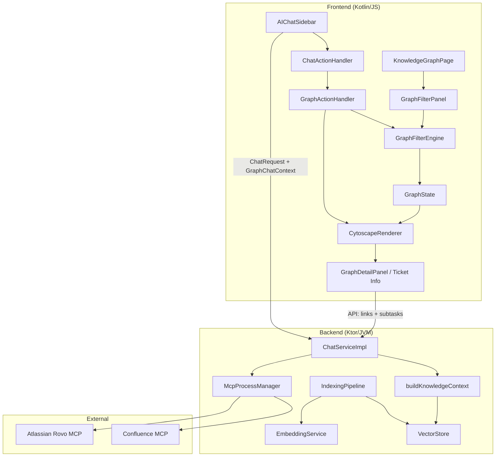
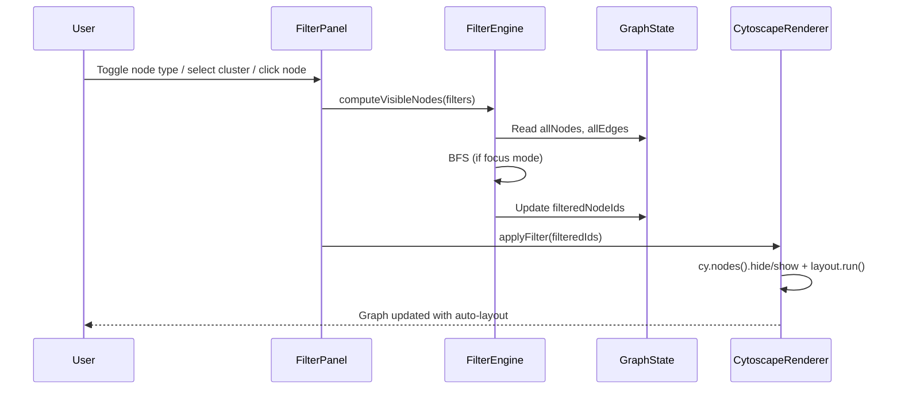
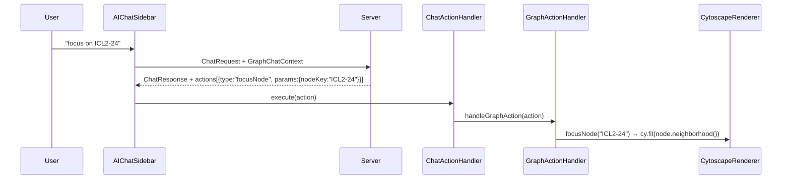
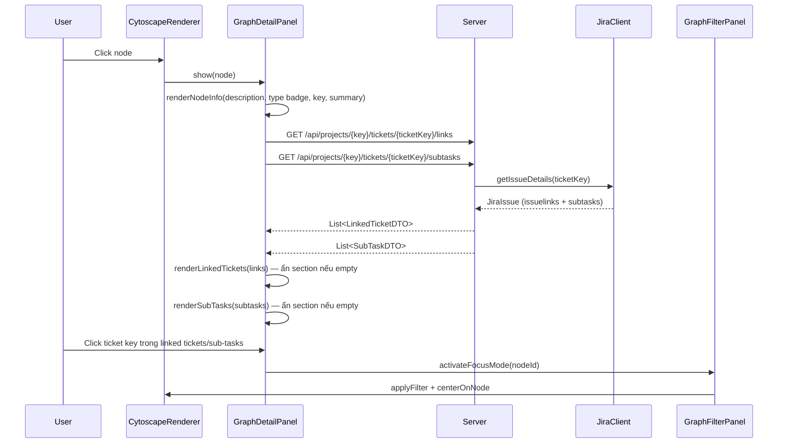

# Design Document — Graph Filter & Focus Mode

## Tổng quan (Overview)

Feature này mở rộng trang Knowledge Graph và hệ thống AI Chat với 5 nhóm chức năng chính:

1. **Graph Filters & Focus Mode** (Req 1–7): Bộ lọc nâng cao cho graph — lọc theo node type (4 types: FEATURE, DEPENDENCY, UI_MODULE, SUB_TASK), cluster, focus mode với depth slider, nút Show All, AND logic giữa tất cả filters, và tối ưu hiệu suất trên 1300+ nodes.
2. **AI Chat — Graph Integration** (Req 8–11): Mở rộng ChatContext với graph state, cho phép AI điều khiển graph qua ChatAction (focus node, filter, navigate), cross-page navigation, và truy vấn node detail từ chat.
3. **RAG Expansion — Knowledge Vector Store** (Req 12–16): Index ticket descriptions, graph relationships, analysis results vào VectorStore; mở rộng buildAttachmentContext thành buildKnowledgeContext với semantic search trên toàn bộ knowledge base.
4. **Jira MCP Integration** (Req 17–19): Tích hợp Atlassian Rovo MCP Server cho bi-directional Jira operations, graph sync, và Confluence search.
5. **Ticket Information Panel** (Req 20): Mở rộng GraphDetailPanel hiển thị description đầy đủ, danh sách linked tickets, và sub-tasks khi click node — với click-to-focus navigation trong graph.

### Quyết định thiết kế chính

| Quyết định | Lựa chọn | Lý do |
|-----------|----------|-------|
| Filter logic location | Frontend (GraphFilterEngine) | Tất cả data đã có trong GraphState, tránh round-trip API |
| BFS traversal | Cytoscape.js `eles.bfs()` | Built-in BFS, không cần implement thủ công |
| Filter rendering | Cytoscape.js `eles.hide()/show()` | Native API, không cần reducers hay graph rebuild |
| Node drag | Cytoscape.js built-in | Native drag support, không cần custom mouse event handling |
| Auto layout | Cytoscape.js `cose` / `circle` layout | Built-in layouts, tự động sắp xếp nodes khi filter |
| Graph renderer | **Cytoscape.js** (thay Sigma.js) | Sigma.js có vấn đề: node drag phải hack qua mouse events + viewportToGraph coordinate conversion sai, filter phải rebuild graph gây mất positions. Cytoscape.js hỗ trợ native drag, hide/show, auto-layout, canvas-based handle 1300+ nodes tốt |
| Graph context in chat | Mở rộng ChatContext DTO | Backward-compatible, server parse optional field |
| Chat → Graph actions | Mở rộng ChatActionHandler | Tái sử dụng hệ thống ChatAction hiện có |
| VectorStore expansion | Thêm chunkType field vào AttachmentChunk | Tái sử dụng model + table hiện có, phân biệt qua chunkType |
| Indexing trigger | Post-scan hook async | Không block scan, chạy background sau khi scan hoàn tất |
| Jira MCP | Atlassian Rovo MCP Server | Chuẩn MCP, tận dụng McpProcessManager hiện có |

---

## Kiến trúc (Architecture)

### Tổng quan kiến trúc



### Component Flow — Filter Change



### Component Flow — Chat → Graph Action



---

## Components và Interfaces

### 1. GraphFilterEngine (MỚI)

File: `frontend/.../pages/graph/GraphFilterEngine.kt`

Chịu trách nhiệm tính toán `Visible_Node_Set` dựa trên tất cả filters đang active. Pure logic, không thao tác DOM.

```kotlin
internal object GraphFilterEngine {
    fun computeVisibleNodes(filters: GraphFilters): Set<String>
    fun bfsTraversal(startNodeId: String, depth: Int, cy: dynamic): Set<String>
    fun isAnyFilterActive(filters: GraphFilters): Boolean
}
```

### 1b. CytoscapeRenderer (MỚI — thay thế SigmaRenderer + SigmaHighlight)

File: `frontend/.../pages/graph/CytoscapeRenderer.kt`

Thay thế SigmaRenderer + SigmaHighlight + SigmaNodeDrag + GraphLayoutHelper + GraphCameraHelper.
Cytoscape.js cung cấp tất cả built-in: rendering, node drag, hide/show, auto-layout, camera fit.

```kotlin
internal object CytoscapeRenderer {
    fun renderGraph()                     // Init Cytoscape instance + populate
    fun destroy()                         // Cleanup
    fun applyFilter(filteredIds: Set<String>?)  // Hide/show nodes + run layout
    fun centerOnNode(nodeId: String)      // cy.fit(node, padding)
    fun resetCamera()                     // cy.fit()
    fun renderEmptyState()
}
```

Cytoscape.js features sử dụng:
- `cy.nodes().hide()` / `cy.nodes().show()` — filter visibility (không cần rebuild graph)
- `cy.layout({ name: 'cose' }).run()` — auto force-directed layout sau filter
- `cy.layout({ name: 'circle' }).run()` — circular layout cho small sets
- Built-in node drag — không cần custom mouse event handling
- `cy.fit(eles, padding)` — auto-fit camera vào visible nodes
- `cy.on('tap', 'node', ...)` — click handler
- `cy.on('mouseover', 'node', ...)` — hover highlight

### 2. GraphFilterPanel (MỚI)

File: `frontend/.../pages/graph/GraphFilterPanel.kt`

UI controller cho filter panel — bind events từ HTML template, cập nhật DOM, gọi `GraphFilterEngine`.
Hiển thị 4 checkboxes cho 4 node types: FEATURE (#2dfecf), DEPENDENCY (#3386ff), UI_MODULE (#be9dff), SUB_TASK (#ff9d5c).

```kotlin
internal object GraphFilterPanel {
    fun init()                            // Bind events, set defaults (4 checkboxes: FEATURE, DEPENDENCY, UI_MODULE, SUB_TASK)
    fun onFilterChange()                  // Recalculate + apply filters
    fun activateFocusMode(nodeId: String) // Enable focus on node
    fun deactivateFocusMode()             // Disable focus mode
    fun resetAll()                        // Show All button handler
    fun updateNodeCount(visible: Int, total: Int)
    fun getFilters(): GraphFilters        // Read current filter state from DOM
}
```

### 3. GraphActionHandler (MỚI)

File: `frontend/.../components/chat/GraphActionHandler.kt`

Xử lý ChatAction types liên quan đến graph: focusNode, filterByType, filterByCluster, resetFilters, searchNodes, navigateToGraph.

```kotlin
internal object GraphActionHandler {
    fun canHandle(action: ChatAction): Boolean
    fun execute(action: ChatAction)
}
```

### 4. Mở rộng ChatContext → GraphChatContext

File: `shared/.../chat/ChatDtos.kt` — thêm optional field `graphContext`

```kotlin
@Serializable
data class ChatContext(
    val projectKey: String,
    val currentScreen: String,
    val userRole: String,
    val userId: String,
    val graphContext: GraphChatContext? = null  // MỚI
)

@Serializable
data class GraphChatContext(
    val focusedNodeKey: String? = null,
    val activeTypeFilters: List<String> = emptyList(),
    val selectedClusterId: Int? = null,
    val depthValue: Int = 1,
    val visibleNodeCount: Int = 0,
    val searchQuery: String = ""
)
```

### 5. IndexingPipeline (MỚI)

File: `server/.../indexing/IndexingPipeline.kt`

Chạy async sau scan, index ticket descriptions, graph relationships, analysis results vào VectorStore.

```kotlin
class IndexingPipeline(
    private val embeddingService: EmbeddingService,
    private val vectorStore: VectorStore,
    private val kbRepository: KBRepository
) {
    suspend fun indexTickets(projectKey: String, tickets: List<TicketNode>)
    suspend fun indexRelationships(projectKey: String, edges: List<TicketEdge>, nodeMap: Map<String, TicketNode>)
    suspend fun indexAnalysisResults(projectKey: String, records: List<KBRecord>)
    suspend fun indexClusterSummaries(projectKey: String, clusters: List<Cluster>, nodeMap: Map<String, TicketNode>)
    suspend fun reindex(projectKey: String, graph: NetworkGraph, records: List<KBRecord>)
}
```

### 6. Mở rộng buildKnowledgeContext

File: `server/.../chat/ChatServiceImpl.kt` — rename `buildAttachmentContext` → `buildKnowledgeContext`

```kotlin
internal suspend fun buildKnowledgeContext(projectKey: String, message: String): String {
    // Semantic search trên TẤT CẢ chunkTypes
    // Return grouped sections: TICKETS, RELATIONSHIPS, ANALYSIS, ATTACHMENTS
    // Top-10 chunks, fallback "No attachment data." nếu trống
}
```

### 7. Mở rộng VectorStore

Thêm method search với chunkType filter:

```kotlin
interface VectorStore {
    // ... existing methods ...
    suspend fun search(queryEmbedding: FloatArray, topK: Int = 5, chunkType: String? = null): List<AttachmentChunk>
    suspend fun deleteByProjectKey(projectKey: String, chunkType: String? = null): Boolean
}
```

### 8. Mở rộng AttachmentChunk

Thêm `chunkType` field:

```kotlin
@Serializable
data class AttachmentChunk(
    val id: Long = 0,
    val ticketId: String,
    val attachmentId: String,
    val filename: String,
    val chunkIndex: Int,
    val chunkText: String,
    val embedding: List<Float>,
    val createdAt: String,
    val chunkType: String = "ATTACHMENT"  // MỚI: TICKET, RELATIONSHIP, ANALYSIS, EVOLUTION, CLUSTER, CONFLUENCE
)
```

### 9. Mở rộng GraphDetailPanel → Ticket Information Panel (MỚI — Req 20)

File: `frontend/.../pages/graph/GraphDetailPanel.kt`

Mở rộng GraphDetailPanel hiện có để hiển thị đầy đủ thông tin ticket khi click node: description thực tế, linked tickets, sub-tasks. Không tạo component mới — mở rộng `GraphDetailPanel.show()` và thêm async data loading.

```kotlin
internal object GraphDetailPanel {
    fun show(node: GraphNode)             // Render node info + trigger async loads
    fun close()                           // Hide panel, clear state
    // --- MỚI ---
    internal fun loadLinkedTickets(ticketKey: String)   // GET /api/projects/{key}/tickets/{ticketKey}/links → render section
    internal fun loadSubTasks(ticketKey: String)        // GET /api/projects/{key}/tickets/{ticketKey}/subtasks → render section
    internal fun renderLinkedTickets(links: List<LinkedTicketDTO>)  // Render LINKED TICKETS section
    internal fun renderSubTasks(subtasks: List<SubTaskDTO>)        // Render SUB-TASKS section
    internal fun onTicketKeyClick(ticketKey: String)    // Focus node trong graph khi click ticket key
}
```

#### API Endpoints mới (Backend)

Thêm 2 endpoints trong `server/.../routes/GraphRoutes.kt` hoặc tạo `TicketDetailRoutes.kt`:

```kotlin
// GET /api/projects/{key}/tickets/{ticketKey}/links
// Response: List<LinkedTicketDTO>
@Serializable
data class LinkedTicketDTO(
    val key: String,           // e.g. "ICL2-100"
    val summary: String,
    val relationship: String   // e.g. "blocks", "is blocked by", "relates to"
)

// GET /api/projects/{key}/tickets/{ticketKey}/subtasks
// Response: List<SubTaskDTO>
@Serializable
data class SubTaskDTO(
    val key: String,           // e.g. "ICL2-101"
    val summary: String,
    val status: String         // e.g. "To Do", "In Progress", "Done"
)
```

Cả 2 endpoints sử dụng `JiraClient.getIssueDetails(ticketKey)` để lấy `issuelinks` và `subtasks` từ Jira API, map sang DTOs. Nếu Jira unavailable, trả về empty list.

#### Component Flow — Node Click → Panel hiển thị



#### Panel Layout

```
┌─────────────────────────────┐
│ ● FEATURE                   │  ← type badge + color
│ ICL2-24                     │  ← ticket key (primary color)
│ User authentication module  │  ← summary
├─────────────────────────────┤
│ DESCRIPTION                 │
│ Full description text from  │  ← node.description hoặc "No description available."
│ Jira ticket data...         │
├─────────────────────────────┤
│ LINKED TICKETS              │  ← ẩn nếu empty
│ 🔗 ICL2-100 blocks         │  ← click key → focus node
│   Payment gateway setup     │
│ 🔗 ICL2-55 relates to      │
│   Login page redesign       │
├─────────────────────────────┤
│ SUB-TASKS                   │  ← ẩn nếu empty
│ 📋 ICL2-101 ● In Progress  │  ← click key → focus node
│   Implement OAuth flow      │
│ 📋 ICL2-102 ○ To Do        │
│   Add password reset        │
├─────────────────────────────┤
│ ATTACHMENTS                 │  ← existing section
│ ✅ design.pdf (3 chunks)    │
├─────────────────────────────┤
│ [OPEN IN JIRA]              │  ← existing button
└─────────────────────────────┘
```

---

## Data Models

### Frontend Models (MỚI)

```kotlin
// models/GraphFilterModels.kt
package com.assistant.frontend.models

import kotlinx.serialization.Serializable

@Serializable
data class GraphFilters(
    val enabledTypes: Set<String> = setOf("FEATURE", "DEPENDENCY", "UI_MODULE", "SUB_TASK"),
    val selectedClusterId: Int? = null,
    val focusNodeId: String? = null,
    val focusDepth: Int = 1,
    val searchQuery: String = ""
)
```

### Shared Models (MỞ RỘNG)

```kotlin
// chat/ChatDtos.kt — thêm GraphChatContext
@Serializable
data class GraphChatContext(
    val focusedNodeKey: String? = null,
    val activeTypeFilters: List<String> = emptyList(),
    val selectedClusterId: Int? = null,
    val depthValue: Int = 1,
    val visibleNodeCount: Int = 0,
    val searchQuery: String = ""
)
```

### ChunkType Enum

```kotlin
// server/.../attachment/models/ChunkType.kt
object ChunkType {
    const val ATTACHMENT = "ATTACHMENT"
    const val TICKET = "TICKET"
    const val RELATIONSHIP = "RELATIONSHIP"
    const val ANALYSIS = "ANALYSIS"
    const val EVOLUTION = "EVOLUTION"
    const val CLUSTER = "CLUSTER"
    const val CONFLUENCE = "CONFLUENCE"
}
```

### Chat Action Types (MỚI cho graph)

| Action Type | Params | Mô tả |
|------------|--------|--------|
| `focusNode` | `nodeKey: String` | Kích hoạt Focus Mode trên node |
| `filterByType` | `types: String` (comma-separated) | Cập nhật Node Type Filter |
| `filterByCluster` | `clusterId: String` | Cập nhật Cluster Filter |
| `resetFilters` | — | Reset tất cả filters |
| `searchNodes` | `query: String` | Cập nhật search input |
| `navigateToGraph` | — | Chuyển đến trang Knowledge Graph |
| `navigate` | `screen: String` | Chuyển trang (đã có) |
| `openUrl` | `url: String` | Mở URL trong tab mới |

### Indexing Batch Format

```kotlin
// Mỗi batch gửi tối đa 20 texts đến EmbeddingService
data class EmbeddingBatch(
    val texts: List<String>,           // max 20
    val metadata: List<ChunkMetadata>  // parallel array
)

data class ChunkMetadata(
    val ticketId: String,
    val chunkType: String,
    val filename: String,
    val chunkIndex: Int = 0
)
```

### Ticket Information Panel DTOs (MỚI — Req 20)

```kotlin
// shared/.../models/TicketDetailDtos.kt
@Serializable
data class LinkedTicketDTO(
    val key: String,           // e.g. "ICL2-100"
    val summary: String,
    val relationship: String   // e.g. "blocks", "is blocked by", "relates to"
)

@Serializable
data class SubTaskDTO(
    val key: String,           // e.g. "ICL2-101"
    val summary: String,
    val status: String         // e.g. "To Do", "In Progress", "Done"
)
```

---

## Correctness Properties

*Một property là đặc tính hoặc hành vi phải đúng trên MỌI thực thi hợp lệ của hệ thống — về bản chất là một phát biểu hình thức về những gì hệ thống phải làm. Properties là cầu nối giữa đặc tả đọc được bởi con người và đảm bảo tính đúng đắn có thể kiểm chứng bằng máy.*

### Property 1: Combined AND Filter — Node Visibility

*For any* danh sách nodes (với type ∈ {FEATURE, DEPENDENCY, UI_MODULE, SUB_TASK}, clusterId, key, summary) và *for any* tổ hợp filters (enabledTypes, selectedClusterId, focusNodeId + depth, searchQuery), một node thuộc Visible_Node_Set khi và chỉ khi nó thỏa mãn TẤT CẢ các điều kiện: (1) node.type ∈ enabledTypes, (2) selectedClusterId == null HOẶC node.clusterId == selectedClusterId, (3) focusNodeId == null HOẶC node ∈ BFS(focusNodeId, depth), (4) searchQuery trống HOẶC node.key/summary chứa searchQuery.

**Validates: Requirements 1.2, 1.3, 1.6, 2.3, 2.4, 6.1, 6.2, 6.3, 6.5**

### Property 2: Edge Visibility Derived from Node Visibility

*For any* graph (nodes + edges) và *for any* Visible_Node_Set, một edge được hiển thị khi và chỉ khi CẢ HAI source node VÀ target node đều thuộc Visible_Node_Set.

**Validates: Requirements 1.4, 2.5, 3.4**

### Property 3: BFS Traversal Correctness

*For any* connected graph và *for any* starting node với depth D (1 ≤ D ≤ 5), BFS_Traversal trả về đúng tập hợp tất cả nodes có khoảng cách ≤ D hops từ starting node (bao gồm starting node). Cụ thể: (1) starting node luôn thuộc kết quả, (2) mọi node trong kết quả có đường đi ≤ D edges đến starting node, (3) không node nào ngoài kết quả có đường đi ≤ D edges đến starting node.

**Validates: Requirements 3.1, 3.3, 4.2**

### Property 4: BFS Result Cap

*For any* graph có > 500 nodes và *for any* BFS với depth > 3, kết quả BFS_Traversal SHALL có kích thước ≤ 500 nodes.

**Validates: Requirements 7.4**

### Property 5: isAnyFilterActive Correctness

*For any* GraphFilters state, `isAnyFilterActive(filters)` trả về `true` khi và chỉ khi ít nhất một điều kiện sau đúng: (1) enabledTypes ≠ {"FEATURE","DEPENDENCY","UI_MODULE","SUB_TASK"}, (2) selectedClusterId ≠ null, (3) focusNodeId ≠ null, (4) searchQuery không trống.

**Validates: Requirements 5.7**

### Property 6: Embedding Text Format Correctness

*For any* indexable entity (ticket, edge, KBRecord, cluster, evolution entry), hàm format embedding text SHALL tạo đúng format theo type:
- TICKET: `"[{key}] {summary}. {description}"`
- RELATIONSHIP: `"{sourceKey} {edgeType} {targetKey}: {sourceSummary} → {targetSummary}"`
- ANALYSIS: `"[{ticketId}] Estimate: {scrumPoints}pts (confidence: {confidenceScore}). {requirementSummary}. Rationale: {rationale}"`
- EVOLUTION: `"[{ticketId}] v{version} ({date}): {description} [{changeType}]"`
- CLUSTER: `"Cluster {label}: contains {nodeCount} tickets — {top5Keys}"`

Và chunkType metadata SHALL khớp với entity type.

**Validates: Requirements 12.1, 12.2, 13.1, 13.2, 13.4, 14.1, 14.2, 14.4**

### Property 7: Indexing Idempotency và Reindex Correctness

*For any* tập hợp entities, (1) indexing cùng entity hai lần SHALL không tạo duplicate chunks (idempotency), và (2) sau khi reindex với tập entities mới, VectorStore SHALL chỉ chứa chunks từ tập mới — không còn stale data từ tập cũ.

**Validates: Requirements 12.4, 12.5, 16.5**

### Property 8: Knowledge Context Output Grouping

*For any* danh sách AttachmentChunk (với các chunkType khác nhau), hàm format buildKnowledgeContext SHALL nhóm chunks theo chunkType và output chứa đúng section headers: `--- RELEVANT TICKETS ---`, `--- RELATIONSHIPS ---`, `--- ANALYSIS ---`, `--- ATTACHMENTS ---` cho mỗi chunkType có mặt. Chunks thuộc cùng type SHALL nằm trong cùng section.

**Validates: Requirements 15.2, 15.3**

### Property 9: Embedding Batch Size Constraint

*For any* danh sách N texts cần embed, IndexingPipeline SHALL chia thành ⌈N/20⌉ batches, mỗi batch có kích thước ≤ 20. Tổng số texts trong tất cả batches SHALL bằng N.

**Validates: Requirements 16.2**

---

## Migration Note: Sigma.js → Cytoscape.js

### Lý do chuyển đổi

Sigma.js (v3) có các vấn đề nghiêm trọng không thể fix:

1. **Node drag**: Sigma không hỗ trợ native node drag. Custom implementation qua `downNode` + `mousemove` + `viewportToGraph()` gây lỗi coordinate conversion — nodes collapse thành đường thẳng sau drag.
2. **Filter rendering**: Sigma dùng node/edge reducers để hide nodes, nhưng hidden nodes vẫn chiếm graph space → camera `animatedReset()` fit cả hidden nodes → visible nodes bị zoom quá xa.
3. **Graph rebuild**: Workaround `graph.clear()` + re-add nodes mất positions sau mỗi filter change. Save/restore positions không đủ vì `clickNode` event trigger filter change liên tục.
4. **Label rendering**: Default hover label renderer vẽ white box che custom label. Override `defaultDrawNodeHover` chỉ fix một phần.

### Cytoscape.js giải quyết tất cả

- `cy.nodes().hide()/show()` — native hide/show, không cần rebuild graph
- Built-in node drag — không cần custom mouse events
- `cy.layout({ name: 'cose' }).run()` — auto-layout built-in
- `cy.fit(visibleNodes, padding)` — fit camera chỉ vào visible nodes
- Canvas-based rendering — handle 1300+ nodes tốt

### Files cần thay đổi

| File cũ (Sigma.js) | File mới (Cytoscape.js) | Ghi chú |
|---------------------|------------------------|---------|
| `SigmaRenderer.kt` | `CytoscapeRenderer.kt` | Thay thế hoàn toàn |
| `SigmaHighlight.kt` | Xóa | Cytoscape native hide/show |
| `SigmaNodeDrag.kt` | Xóa | Cytoscape native drag |
| `SigmaInterop.kt` | `CytoscapeInterop.kt` | External declarations mới |
| `SigmaAttributes.kt` | Xóa | Style trong Cytoscape config |
| `GraphLayoutHelper.kt` | Xóa | Cytoscape native layout |
| `GraphCameraHelper.kt` | Xóa | `cy.fit()` thay thế |
| `GraphNavControls.kt` | Cập nhật | Dùng `cy.zoom()` / `cy.fit()` |

---

## Error Handling

### Frontend — Graph Filters

| Tình huống | Xử lý |
|-----------|--------|
| GraphState.allNodes trống | Filter panel disabled, hiển thị "No graph data" |
| Focus node không tồn tại trong graph | Deactivate focus mode, log warning |
| BFS trả về 0 neighbors (isolated node) | Hiển thị chỉ focused node, thông báo "No connections found" |
| Cluster dropdown trống (no clusters) | Ẩn cluster filter, chỉ hiển thị type filter |
| Filter computation > 200ms | Debounce slider input (150ms), log performance warning |

### Frontend — Ticket Information Panel (Req 20)

| Tình huống | Xử lý |
|-----------|--------|
| API `/tickets/{key}/links` thất bại hoặc timeout | Ẩn section LINKED TICKETS, log warning, không hiển thị error cho user |
| API `/tickets/{key}/subtasks` thất bại hoặc timeout | Ẩn section SUB-TASKS, log warning, không hiển thị error cho user |
| Linked ticket list trống | Ẩn section LINKED TICKETS hoàn toàn (không hiển thị header) |
| Sub-tasks list trống | Ẩn section SUB-TASKS hoàn toàn (không hiển thị header) |
| Click ticket key nhưng node không tồn tại trong graph | Log warning, không trigger focus mode, có thể hiển thị tooltip "Node not in current graph" |
| node.description null hoặc blank | Hiển thị "No description available." làm fallback |

### Frontend — Chat → Graph Actions

| Tình huống | Xử lý |
|-----------|--------|
| ChatAction "focusNode" với nodeKey không tồn tại | Hiển thị message "Node {key} not found in current graph" trong chat |
| ChatAction "filterByCluster" với clusterId không tồn tại | Ignore action, hiển thị warning trong chat |
| ChatAction "navigateToGraph" khi graph data chưa load | Navigate trước, đợi graph load xong rồi execute action |
| User ở trang khác, nhận graph action | Navigate to knowledge_graph, queue action, execute sau khi page rendered |

### Backend — Indexing Pipeline

| Tình huống | Xử lý |
|-----------|--------|
| EmbeddingService null hoặc unavailable | Skip indexing, log warning, KHÔNG throw exception |
| EmbeddingService.embed() trả về null | Skip chunk đó, continue với chunks còn lại |
| VectorStore.saveChunk() thất bại | Log error, continue với chunks còn lại |
| Batch embed partial failure | Retry failed items 1 lần, skip nếu vẫn fail |
| Ticket description null/blank | Dùng summary only: `"[{key}] {summary}"` |

### Backend — buildKnowledgeContext

| Tình huống | Xử lý |
|-----------|--------|
| EmbeddingService null | Return "" (empty string) |
| VectorStore null | Return "" |
| Query embedding fails | Return "" |
| Search trả về 0 results | Return "No attachment data." (backward-compatible) |
| Search timeout > 500ms | Return partial results nếu có, log warning |

### Backend — Jira MCP

| Tình huống | Xử lý |
|-----------|--------|
| Atlassian MCP Server chưa cấu hình | AI fallback về local data, không suggest Jira actions |
| MCP tool call thất bại | Return error message trong chat, không crash |
| Graph sync sau MCP action thất bại | Hiển thị warning: "Ticket updated in Jira but graph sync pending" |
| OAuth token expired | Prompt user re-authenticate trong Integrations page |
| HTTP MCP server URL unreachable | Return McpTestResult(success=false, error="Connection refused") |
| HTTP MCP server returns 401/403 | Return error "Authentication failed — check credentials" |

### 10. HttpMcpProtocolClient (MỚI — Req 17.2, 17.3)

File: `server/.../mcp/HttpMcpProtocolClient.kt`

HTTP-based MCP protocol client cho remote MCP servers (streamable-http transport). Implements `McpProtocolClient` interface — cùng interface với `McpProtocolClientImpl` (stdio), cho phép `McpProcessManager` sử dụng cả hai loại transport.

```kotlin
class HttpMcpProtocolClient(
    private val httpClient: HttpClient,
    private val serverUrl: String,
    private val authHeaders: Map<String, String>,
    private val serverId: String
) : McpProtocolClient {
    suspend fun initialize(): McpInitializeResult
    suspend fun sendRequest(method: String, params: JsonElement?): JsonElement
    suspend fun sendNotification(method: String, params: JsonElement?)
    suspend fun listTools(): List<McpToolInfo>
    suspend fun callTool(name: String, arguments: JsonObject): McpToolCallResponse
    fun close()
}
```

**Transport**: HTTP POST với JSON-RPC 2.0 body → JSON-RPC response. Session tracking via `Mcp-Session-Id` header.

**JSON-RPC Body Building**: `buildRequestBody()` và `buildNotificationBody()` xây dựng JSON-RPC body thủ công bằng `buildJsonObject {}` thay vì `Json.encodeToString(JsonRpcRequest)`. Lý do: omit `"params"` field khi null — một số MCP servers (Atlassian) reject request nếu `params: null` xuất hiện trong body. Notifications không có `id` field.

**SSE Response Parsing**: `extractJsonFromResponse()` xử lý 2 format response:
- Plain JSON: body bắt đầu bằng `{` hoặc `[` → trả về trực tiếp
- SSE format: parse các dòng `data:` và join lại thành JSON string (một số MCP servers trả về response dạng `event: message\ndata: {json}\n\n`)

**HTTP Content-Type Fix**: `doPost()` sử dụng `TextContent(body, ContentType.Application.Json)` thay vì `contentType()` + `setBody()` riêng biệt — đảm bảo Content-Type header `application/json` luôn được gửi đúng cách với Ktor HttpClient.

**Authentication**: `buildAuthHeaders(env)` tạo Authorization header từ env config:
- API Token mode: `Basic base64(email:api_token)`
- OAuth mode: `Basic base64(client_id:client_secret)` (client credentials)

**Routing trong McpProcessManager**: `doStartServer()` kiểm tra `config.type`:
- `"stdio"` → `ProcessSpawner.spawnProcess()` + `McpProtocolClientImpl` (existing)
- `"streamable-http"` → `HttpMcpProtocolClient` với HTTP POST (new)

**ManagedProcess**: `process` và `readerJob` giờ nullable — HTTP servers không có OS process.

---

## Testing Strategy

### Dual Testing Approach

Feature này sử dụng kết hợp **property-based testing** và **example-based testing**:

- **Property-based tests**: Kiểm chứng các universal properties (filter logic, BFS, embedding format, batch size) với 100+ iterations mỗi property, sử dụng thư viện **kotlin-test + custom generators** (Kotlin/JS không có thư viện PBT chính thức, sử dụng custom property runner với `kotlin.random.Random`).
- **Unit tests**: Kiểm chứng specific examples, edge cases, UI state transitions.
- **Integration tests**: Kiểm chứng end-to-end flows (chat → graph action, indexing pipeline, MCP tool calls).

### Property-Based Tests

Mỗi property test chạy tối thiểu **100 iterations** với random inputs.

| Property | Test File | Tag |
|----------|-----------|-----|
| P1: Combined AND Filter | `GraphFilterEngineTest.kt` | Feature: graph-filter-focus-mode, Property 1: Combined AND filter node visibility |
| P2: Edge Visibility | `GraphFilterEngineTest.kt` | Feature: graph-filter-focus-mode, Property 2: Edge visibility derived from node visibility |
| P3: BFS Correctness | `GraphFilterEngineTest.kt` | Feature: graph-filter-focus-mode, Property 3: BFS traversal correctness |
| P4: BFS Cap | `GraphFilterEngineTest.kt` | Feature: graph-filter-focus-mode, Property 4: BFS result cap |
| P5: isAnyFilterActive | `GraphFilterEngineTest.kt` | Feature: graph-filter-focus-mode, Property 5: isAnyFilterActive correctness |
| P6: Embedding Format | `IndexingPipelineTest.kt` | Feature: graph-filter-focus-mode, Property 6: Embedding text format correctness |
| P7: Indexing Idempotency | `IndexingPipelineTest.kt` | Feature: graph-filter-focus-mode, Property 7: Indexing idempotency and reindex |
| P8: Knowledge Context Grouping | `ChatServiceImplTest.kt` | Feature: graph-filter-focus-mode, Property 8: Knowledge context output grouping |
| P9: Batch Size | `IndexingPipelineTest.kt` | Feature: graph-filter-focus-mode, Property 9: Embedding batch size constraint |

### Unit Tests (Example-Based)

| Test Area | Test Cases |
|-----------|-----------|
| Filter Panel UI | Initial state (4 checkboxes checked: FEATURE, DEPENDENCY, UI_MODULE, SUB_TASK), cluster dropdown default, slider default |
| Show All Reset | Verify all filters reset to defaults (4 types checked) |
| GraphActionHandler | Each action type dispatches correctly |
| ChatContext building | graphContext populated on KG page, null on other pages |
| Edge cases | Empty graph, isolated node focus, null description |
| Ticket Information Panel | Description rendering (with/without description), linked tickets section (with/without data), sub-tasks section (with/without data), click-to-focus on ticket key |

### Integration Tests

| Test Area | Test Cases |
|-----------|-----------|
| Chat → Graph flow | Send "focus on X" → verify focus mode activated |
| Indexing Pipeline | Scan → index → search → verify results |
| buildKnowledgeContext | Index multiple types → search → verify grouped output |
| MCP tool calls | Mock Atlassian MCP → verify tool call format |
| Cross-page navigation | Chat navigate action → verify Router.navigateTo called |
| Ticket Information Panel | Click node → verify API calls for links + subtasks → verify panel renders sections correctly |

### Test Configuration

```kotlin
// Property test runner
fun <T> forAll(iterations: Int = 100, gen: () -> T, property: (T) -> Boolean) {
    repeat(iterations) { i ->
        val input = gen()
        assert(property(input)) { "Property failed on iteration $i with input: $input" }
    }
}
```

### Generators cần thiết

| Generator | Mô tả |
|-----------|--------|
| `genGraphNode()` | Random GraphNode với random type (FEATURE, DEPENDENCY, UI_MODULE, SUB_TASK), clusterId, key, summary |
| `genGraphEdge(nodeIds)` | Random edge giữa hai nodes trong danh sách |
| `genGraphFilters()` | Random filter combination (enabledTypes subset of 4 types) |
| `genGraph(nodeCount, edgeCount)` | Random graph với N nodes và M edges |
| `genTicketNode()` | Random TicketNode cho indexing tests |
| `genKBRecord()` | Random KBRecord cho analysis embedding tests |
| `genAttachmentChunk()` | Random AttachmentChunk với random chunkType |
