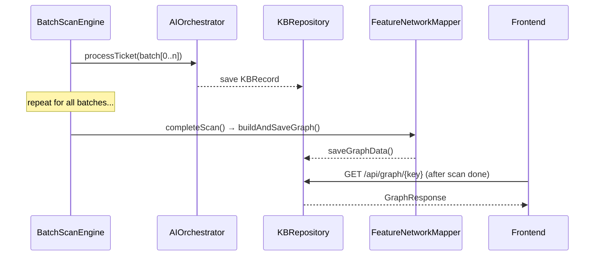
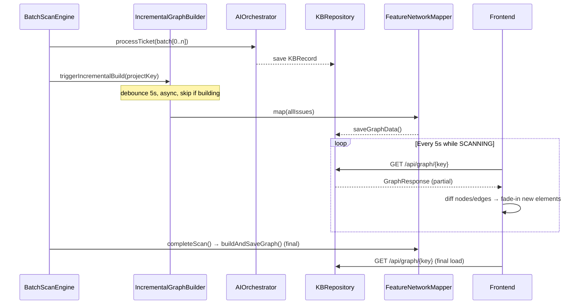
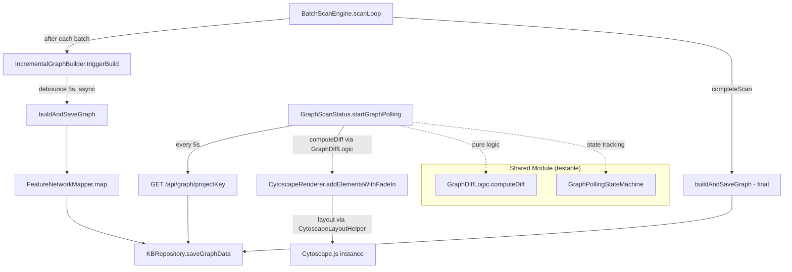

# Design Document — Incremental Graph Rendering

## Overview

Feature này chuyển đổi Knowledge Graph (Relationship Network) từ mô hình "build once on scan complete" sang mô hình "incremental build after each batch". Hiện tại, `buildAndSaveGraph()` chỉ được gọi trong `completeScan()` — graph chỉ xuất hiện khi scan hoàn tất 100%. Sau thay đổi, graph sẽ được xây dựng lại sau mỗi batch ticket được analyze, và frontend sẽ poll + cập nhật Cytoscape graph tăng dần với hiệu ứng fade-in.

### Phạm vi thay đổi

- **Backend (shared module)**: Thêm incremental graph build trigger sau mỗi batch trong `scanLoop`, với debounce 5s và async execution
- **Frontend (frontend module)**: Nâng cấp `GraphScanStatus` polling để diff nodes/edges và thêm fade-in animation cho elements mới trong `CytoscapeRenderer`
- **API**: Không thay đổi schema — `GET /api/graph/{projectKey}` vẫn trả về `GraphResponse` cùng cấu trúc
- **Shared models**: Không thay đổi `NetworkGraph`, `TicketNode`, `TicketEdge`

## Architecture

### Luồng xử lý hiện tại



### Luồng xử lý mới (Incremental)



### Design Decisions

1. **Full rebuild mỗi lần, không incremental merge**: `FeatureNetworkMapper.map()` nhận toàn bộ issues và tạo graph mới. Đây là cách đơn giản nhất vì mapper tính keyword similarity cần toàn bộ issues. Chi phí rebuild chấp nhận được vì mapper là CPU-bound thuần túy (không gọi AI).

2. **Debounce 5s thay vì per-batch**: Khi `parallelBatchSize=3` và batch hoàn tất nhanh, nhiều trigger liên tiếp sẽ gây rebuild thừa. Debounce 5s đảm bảo tối đa 1 build mỗi 5 giây.

3. **Async non-blocking**: Graph build chạy trong coroutine riêng, không block `scanLoop`. Nếu build fail, scan vẫn tiếp tục.

4. **Skip overlapping builds**: Nếu build trước chưa xong khi trigger mới đến, skip trigger cũ và chỉ chạy build mới nhất sau debounce.

5. **Frontend diff-based update**: Thay vì re-render toàn bộ Cytoscape graph, frontend so sánh node/edge IDs giữa lần poll trước và sau, chỉ thêm elements mới với fade-in animation. Giữ nguyên positions của nodes đã có.

## Components and Interfaces

### 1. IncrementalGraphBuilder (shared module — new)

```kotlin
// shared/src/commonMain/kotlin/com/assistant/scan/IncrementalGraphBuilder.kt
class IncrementalGraphBuilder(
    private val engine: BatchScanEngine,
    private val scope: CoroutineScope,
    private val debounceMs: Long = 5000L
) {
    private var pendingJob: Job? = null
    private val mutex = Mutex()        // Mutex thay vì AtomicBoolean (KMP commonMain compatible)
    private var building = false

    /**
     * Trigger an incremental graph build. Debounced — resets timer on each call.
     * If a build is already in progress, the new trigger is queued after debounce.
     */
    fun triggerBuild(projectKey: String)

    /** Cancel any pending build (called on scan cancel/pause). */
    fun cancel()
}
```

**Trách nhiệm**: Quản lý debounce timer và async execution cho incremental graph builds. Delegate actual build logic cho `BatchScanEngine.buildAndSaveGraph()`.

> **Implementation note**: Dùng `Mutex` + `var building` thay vì `AtomicBoolean` vì Kotlin Multiplatform `commonMain` không có `java.util.concurrent.atomic` và project không dùng `kotlinx-atomicfu`.

### 2. BatchScanEngine changes (shared module — modified)

```kotlin
// Thêm field (public — server module DI cần access để wire IncrementalGraphBuilder):
var incrementalGraphBuilder: IncrementalGraphBuilder? = null

// Trong scanLoop, sau mỗi batch:
// - Gọi incrementalGraphBuilder?.triggerBuild(projectKey)

// Trong completeScan:
// - Cancel incremental builder trước khi build final
// - Giữ nguyên buildAndSaveGraph() call cuối cùng

// Trong updateScanStatus (pause/cancel):
// - Gọi incrementalGraphBuilder?.cancel() trong block cancelJob để ngăn orphan builds
```

> **Implementation note**: Field là `public var` (không phải `internal`) vì `ServerModule.kt` cần truy cập để wire `IncrementalGraphBuilder` vào engine qua `.also { engine -> engine.incrementalGraphBuilder = ... }`.

### 3. CytoscapeRenderer changes (frontend module — modified)

```kotlin
// Thêm method:
fun addElementsWithFadeIn(
    newNodes: List<GraphNode>,
    newEdges: List<GraphEdge>,
    newNodeIds: Set<String>
)
```

**Trách nhiệm**: Thêm nodes/edges mới vào Cytoscape instance hiện tại mà không destroy + rebuild. Áp dụng CSS animation fade-in cho elements mới.

### 4. GraphScanStatus changes (frontend module — modified)

```kotlin
// Nâng cấp startGraphPolling():
// - Diff logic: so sánh node IDs giữa response và GraphState
// - Gọi CytoscapeRenderer.addElementsWithFadeIn() thay vì renderGraph()
// - Cập nhật node count badge sau mỗi poll
// - Final load khi scan COMPLETED

// Internal data classes:
internal data class PollResult(val completed: Boolean)
internal data class GraphDiff(
    val newNodes: List<GraphNode>,
    val newEdges: List<GraphEdge>,
    val previousNodeIds: Set<String>
) {
    val hasNewElements: Boolean get() = newNodes.isNotEmpty() || newEdges.isNotEmpty()
}

// Nếu Cytoscape chưa init (lần đầu), gọi renderGraph() thay thế
// showScanningLoadingState() hiển thị loading message khi graph empty during scan
```

### 5. GraphDiffLogic (shared module — new)

```kotlin
// shared/src/commonMain/kotlin/com/assistant/graph/GraphDiffLogic.kt
object GraphDiffLogic {
    data class DiffResult(val newNodeIds: Set<String>, val newEdgeKeys: Set<String>)

    fun computeDiff(
        oldNodeIds: Set<String>, oldEdgeKeys: Set<String>,
        newNodeIds: Set<String>, newEdgeKeys: Set<String>
    ): DiffResult

    fun edgeKey(sourceId: String, targetId: String): String
}
```

**Trách nhiệm**: Pure diff logic cho graph incremental updates. Extracted từ frontend `GraphScanStatus.computeDiff()` để testable trong shared jvmTest (không phụ thuộc DOM/browser).

### 6. GraphPollingStateMachine (shared module — new)

```kotlin
// shared/src/commonMain/kotlin/com/assistant/graph/GraphPollingStateMachine.kt
class GraphPollingStateMachine {
    var pollingActive: Boolean
    var nodeCount: Int
    var currentNodeIds: Set<String>
    var currentEdgeKeys: Set<String>
    var finalLoadTriggered: Boolean
    var consecutiveErrors: Int

    fun onScanStatus(status: ScanStatus): Boolean
    fun onPollSuccess(newNodeIds: Set<String>, newEdgeKeys: Set<String>): GraphDiffLogic.DiffResult
    fun onPollError()
    fun isTerminal(status: ScanStatus): Boolean
}
```

**Trách nhiệm**: Pure state machine cho graph polling behavior. Extracted từ frontend `GraphScanStatus` để testable trong shared jvmTest. Tracks polling state, node counts, diff integration, và error handling.

### 7. CytoscapeLayoutHelper (frontend module — new)

```kotlin
// frontend/src/jsMain/kotlin/com/assistant/frontend/pages/graph/CytoscapeLayoutHelper.kt
internal object CytoscapeLayoutHelper {
    fun runIncrementalLayout(c: dynamic, newNodeIds: Set<String>)
    fun layoutVisible(c: dynamic, count: Int)
    fun layoutConcentric(c: dynamic, focusId: String)
}
```

**Trách nhiệm**: Layout helper functions extracted từ `CytoscapeRenderer` để giữ file dưới 200 dòng. Bao gồm incremental layout (chỉ layout new nodes), visible layout, và concentric layout.

### Component Interaction Diagram



## Data Models

### Existing Models (không thay đổi)

**NetworkGraph** (shared):
```kotlin
data class NetworkGraph(
    val nodes: List<TicketNode>,
    val edges: List<TicketEdge>
)
```

**GraphResponse** (server — API response):
```kotlin
data class GraphResponse(
    val nodes: List<GraphNodeDto>,
    val edges: List<GraphEdgeDto>,
    val clusters: List<GraphClusterDto>? = null,
    val nodeTypes: List<NodeTypeInfoDto> = emptyList()
)
```

**GraphLayoutResponse** (frontend — deserialized from API):
```kotlin
data class GraphLayoutResponse(
    val nodes: List<GraphNode>,
    val edges: List<GraphEdge>,
    val clusters: List<GraphCluster>? = null,
    val nodeTypes: List<NodeTypeInfo> = emptyList()
)
```

### Internal State (không thay đổi schema)

**GraphState** (frontend): Giữ nguyên `allNodes`, `allEdges`, `allClusters`, `filteredNodeIds`. Polling logic cập nhật các fields này incrementally.

**ScanState** (shared): Giữ nguyên `status`, `processedCount`, `totalTickets`. Frontend poll `/api/projects/{key}/scan/status` để hiển thị badge.

### New Internal State

**IncrementalGraphBuilder** internal state:
- `pendingJob: Job?` — coroutine job cho debounce timer hiện tại
- `mutex: Mutex` + `building: Boolean` — Mutex-protected flag đánh dấu đang build hay không (thay vì `AtomicBoolean` — KMP compatible)
- Không persist — chỉ tồn tại trong memory trong suốt scan session

**GraphDiffLogic.DiffResult** (shared module):
- `newNodeIds: Set<String>` — node IDs có trong new graph nhưng không có trong old graph
- `newEdgeKeys: Set<String>` — edge keys có trong new graph nhưng không có trong old graph

**GraphPollingStateMachine** (shared module):
- `pollingActive: Boolean` — polling đang chạy hay không
- `nodeCount: Int` — số nodes hiện tại
- `currentNodeIds: Set<String>` — node IDs hiện tại (dùng cho diff)
- `currentEdgeKeys: Set<String>` — edge keys hiện tại (dùng cho diff)
- `finalLoadTriggered: Boolean` — đã trigger final load chưa
- `consecutiveErrors: Int` — số lỗi liên tiếp (reset khi poll thành công)


## Correctness Properties

*A property is a characteristic or behavior that should hold true across all valid executions of a system — essentially, a formal statement about what the system should do. Properties serve as the bridge between human-readable specifications and machine-verifiable correctness guarantees.*

### Property 1: Incremental build triggered after batch completion

*For any* project with N tickets (N ≥ 1) being scanned in batches, after each batch completes while scan status is SCANNING, `IncrementalGraphBuilder.triggerBuild()` SHALL be called, and after the debounce period, `kbRepository.saveGraphData()` SHALL be called with a `NetworkGraph` containing nodes derived from all currently available issues.

**Validates: Requirements 1.1, 1.2**

### Property 2: Scan continues despite incremental build failure

*For any* project being scanned, if `buildAndSaveGraph()` throws an exception during an incremental build, the scan SHALL continue processing remaining batches and eventually reach COMPLETED status with `processedCount == totalTickets`.

**Validates: Requirements 1.3**

### Property 3: Final graph build on scan completion

*For any* project with N tickets (N ≥ 1), when scan completes, `kbRepository.getGraphData(projectKey)` SHALL return a non-null `NetworkGraph`. This preserves the existing `completeScan()` → `buildAndSaveGraph()` behavior.

**Validates: Requirements 1.4, 5.3**

### Property 4: Graph diff correctly identifies new elements

*For any* two graph states `oldGraph` and `newGraph` where `newGraph` is a superset of `oldGraph` (i.e., `oldGraph.nodes ⊆ newGraph.nodes` and `oldGraph.edges ⊆ newGraph.edges`), the diff operation SHALL produce exactly the set of node IDs in `newGraph` but not in `oldGraph`, and exactly the set of edge keys in `newGraph` but not in `oldGraph`.

**Validates: Requirements 2.2**

### Property 5: Incremental build is non-blocking

*For any* batch completion event, `IncrementalGraphBuilder.triggerBuild()` SHALL return immediately without suspending. The actual graph build SHALL execute in a separate coroutine, ensuring the scan loop is not blocked.

**Validates: Requirements 4.1**

### Property 6: Debounce coalesces rapid triggers

*For any* sequence of N trigger calls (N ≥ 2) occurring within a 5-second window, the `IncrementalGraphBuilder` SHALL execute at most 1 actual graph build. If a build is already in progress when a new trigger arrives, the in-progress build is not interrupted, and a new build is scheduled after debounce.

**Validates: Requirements 4.2, 4.3**

## Error Handling

### Backend

| Scenario | Handling | Impact |
|----------|----------|--------|
| `buildAndSaveGraph()` throws during incremental build | Log error via `logToBoth()`, scan continues | Graph data may be stale until next successful build |
| `FeatureNetworkMapper.map()` fails (e.g., Jira API timeout) | Caught in `buildAndSaveGraph()`, logged | Same as above |
| `kbRepository.saveGraphData()` fails | Caught in `buildAndSaveGraph()`, logged | Graph not updated, next build will retry |
| Debounce job cancelled (scan paused/cancelled) | `IncrementalGraphBuilder.cancel()` cancels pending job | No orphan builds after scan stops |
| Concurrent scan start while incremental build running | `checkNoActiveScan()` throws `ScanConflictException` (existing behavior) | HTTP 409 returned |

### Frontend

| Scenario | Handling | Impact |
|----------|----------|--------|
| `GET /api/graph/{key}` returns 404 (no graph data yet) | `continue` in polling loop, retry next interval | Graph shows empty/loading state |
| `GET /api/graph/{key}` returns 500 | Log error, show temporary error toast, continue polling | User sees error but polling auto-retries |
| Network error during poll | Log error, continue polling on next interval | Transient — auto-recovers |
| Cytoscape `cy.add()` fails for invalid element | Catch per-element, skip invalid, log warning | Partial update — most elements still render |
| Scan status changes to CANCELLED/PAUSED during polling | Stop both graph and scan status polling | Clean shutdown |

## Testing Strategy

### Property-Based Tests (Kotest)

Sử dụng **Kotest** property testing framework (đã có trong project). Mỗi property test chạy tối thiểu 100 iterations.

| Property | Test Class | Module | Focus |
|----------|-----------|--------|-------|
| Property 1: Incremental build triggered | `IncrementalGraphBuildPropertyTest` | shared (jvmTest) | Verify triggerBuild → saveGraphData called after debounce |
| Property 2: Scan continues on build failure | `IncrementalBuildErrorResiliencePropertyTest` | shared (jvmTest) | Inject failures, verify scan completes |
| Property 3: Final graph build | `CompleteScanFinalGraphPropertyTest` | shared (jvmTest) | Verify getGraphData non-null after scan with incremental builder wired |
| Property 4: Graph diff correctness | `GraphDiffPropertyTest` | shared (jvmTest) | Generate random graph pairs, verify diff via `GraphDiffLogic` |
| Property 5: Non-blocking build | `IncrementalGraphBuildPropertyTest` | shared (jvmTest) | Verify triggerBuild returns immediately |
| Property 6: Debounce coalescing | `IncrementalGraphDebouncePropertyTest` | shared (jvmTest) | Rapid triggers → at most 1 build per 5s window |

Tag format: `Feature: incremental-graph-rendering, Property {N}: {title}`

### Unit Tests (Example-Based)

| Test | Module | Validates |
|------|--------|-----------|
| Graph polling starts when scan status is SCANNING | shared (jvmTest) — `GraphPollingBehaviorTest` | Req 2.1 |
| Fade-in CSS class applied to new Cytoscape elements | shared (jvmTest) — `FadeInRenderingTest` | Req 2.3 |
| Node count updated after successful poll | shared (jvmTest) — `GraphPollingBehaviorTest` | Req 2.4 |
| Polling stops and final load on COMPLETED | shared (jvmTest) — `GraphPollingBehaviorTest` | Req 2.5 |
| Badge shows progress during SCANNING | frontend (jsTest) — `ScanStatusServiceTest` | Req 3.1 |
| Badge shows "Completed" with total count | frontend (jsTest) — `ScanStatusServiceTest` | Req 3.2 |
| Loading message shown when graph empty during scan | shared (jvmTest) — `FadeInRenderingTest` | Req 3.3 |
| API error during poll → retry on next interval | shared (jvmTest) — `GraphPollingBehaviorTest` | Req 3.4 |

### Integration Tests

| Test | Module | Validates |
|------|--------|-----------|
| Full scan with 200+ tickets completes with incremental builds | e2e-tests | Req 4.4 |
| Pause/resume preserves incremental build state | shared | Req 5.2 |

### Smoke Tests (Preservation)

Existing test suites MUST continue passing:
- `CompleteScanPreservationPropertyTest` — Req 5.1, 5.3, 5.5
- `GraphDataPersistencePropertyTest` — Req 5.4
- `GraphEnginePropertyTest` — layout computation unchanged
- `FeatureNetworkMapperPropertyTest` — mapper logic unchanged
