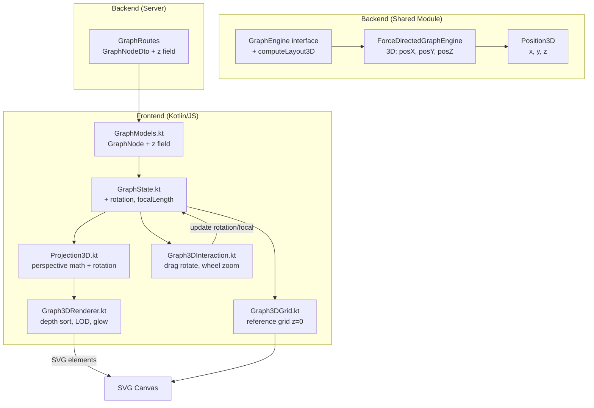
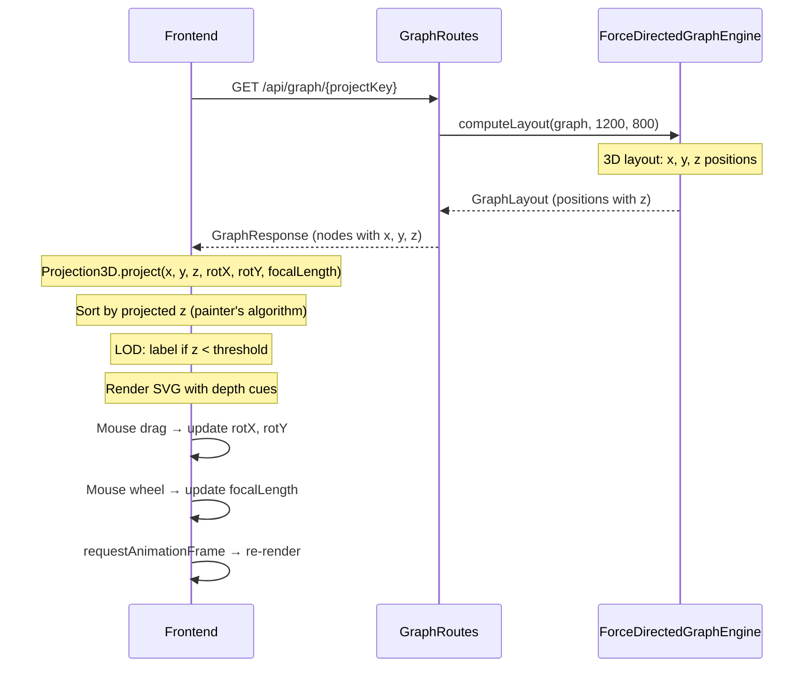
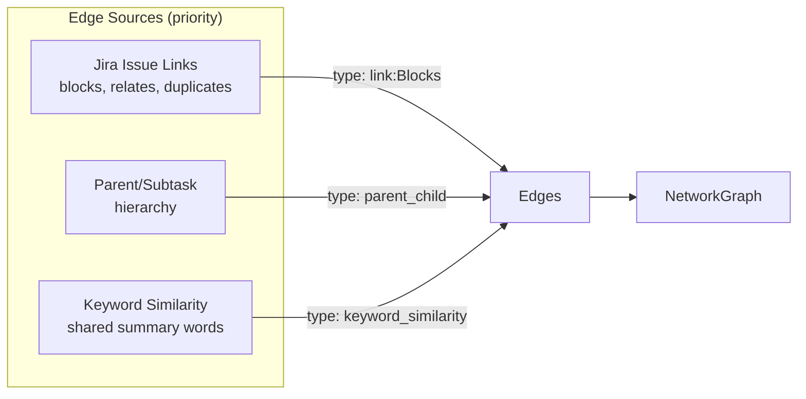

# Knowledge Graph 3D — Design

---

## Tổng quan (Overview)

Nâng cấp Knowledge Graph từ đồ thị phẳng 2D SVG sang trực quan hóa 3D perspective SVG thuần (không dùng WebGL/Three.js). Với 1823 node hiện tại, đồ thị 2D bị chồng chéo nghiêm trọng — chiều sâu z giúp phân tán node trong không gian 3 chiều, kết hợp depth cue (kích thước, opacity) và xoay tương tác để khám phá cấu trúc.

### Quyết định thiết kế chính

1. **Pure SVG, không WebGL**: Giữ nguyên stack Kotlin/JS + SVG, không thêm dependency Three.js/WebGL. Perspective projection tính toán trong Kotlin, render ra SVG elements
2. **Isometric/Perspective projection**: `screenX = x * f / (z + f)`, `screenY = y * f / (z + f)` với `f` = focal length điều chỉnh được
3. **3D Force-Directed Layout**: Mở rộng `ForceDirectedGraphEngine` sang 3 chiều (thêm posZ, dispZ)
4. **Level-of-Detail (LOD)**: Với 1800+ node, chỉ render label cho node gần camera; node xa render dạng chấm nhỏ
5. **Painter's Algorithm**: Sort SVG elements theo z-depth (xa → gần) để đảm bảo occlusion đúng
6. **Backward compatible**: API response thêm field `z` (default 0.0), frontend cũ vẫn hoạt động

## Kiến trúc (Architecture)



### Luồng dữ liệu




## Thành phần & Giao diện (Components and Interfaces)

### 1. Backend — Shared Module

#### Position3D (mở rộng Position)

```kotlin
// shared/src/commonMain/kotlin/com/assistant/graph/GraphEngine.kt
@Serializable
data class Position(val x: Double, val y: Double, val z: Double = 0.0)
```

Thêm field `z` với default `0.0` — backward compatible, code cũ dùng `Position(x, y)` vẫn hoạt động.

#### GraphEngine interface (mở rộng)

```kotlin
interface GraphEngine {
    fun computeLayout(graph: NetworkGraph, width: Double, height: Double): GraphLayout
    fun detectClusters(graph: NetworkGraph): List<Cluster>
}
```

Không cần thêm method mới — `computeLayout` trả về `GraphLayout` với `Position` đã có `z`. `ForceDirectedGraphEngine` sẽ tự tính z trong implementation.

#### ForceDirectedGraphEngine — 3D Extension

Mở rộng thuật toán Fruchterman-Reingold sang 3 chiều:

```kotlin
// Thêm posZ array song song với posX, posY
val posZ = DoubleArray(nodes.size) { margin + random.nextDouble() * (depth - 2 * margin) }

// Repulsion: tính dx, dy, dz → dist = sqrt(dx² + dy² + dz²)
// Attraction: tương tự 3D
// Displacement: dispX, dispY, dispZ
// Clamp: posZ.coerceIn(0.0, depth)
```

Parameter `depth` mặc định = `600.0` (tương đương width/2).

### 2. Backend — Server (GraphRoutes)

#### GraphNodeDto — thêm z

```kotlin
@Serializable
private data class GraphNodeDto(
    val id: String, val key: String, val summary: String, val type: String,
    val x: Double, val y: Double, val z: Double = 0.0,
    val clusterId: Int? = null
)
```

Mapping: `z = pos?.z ?: 0.0`

### 3. Frontend — Models

#### GraphNode — thêm z

```kotlin
// frontend/.../models/GraphModels.kt
@Serializable
data class GraphNode(
    val id: String, val key: String, val summary: String,
    val description: String? = null, val type: String,
    val x: Double, val y: Double, val z: Double = 0.0,
    val clusterId: Int? = null, val jiraUrl: String? = null
)
```

### 4. Frontend — Projection3D.kt (MỚI)

File mới: `frontend/.../pages/graph/Projection3D.kt`

```kotlin
internal object Projection3D {
    /** Xoay điểm (x,y,z) quanh trục Y rồi X */
    fun rotate(x: Double, y: Double, z: Double, rotX: Double, rotY: Double): Triple<Double, Double, Double>

    /** Project 3D → 2D screen coords với perspective */
    fun project(x: Double, y: Double, z: Double, focalLength: Double): Pair<Double, Double>

    /** Tính scale factor theo depth: f / (z + f) */
    fun depthScale(z: Double, focalLength: Double): Double

    /** Tính opacity theo depth: clamp(1.0 - z/maxZ * 0.7, 0.15, 1.0) */
    fun depthOpacity(z: Double, maxZ: Double): Double
}
```

Công thức rotation (Y-axis rồi X-axis):
```
// Rotate Y
x' = x * cos(rotY) + z * sin(rotY)
z' = -x * sin(rotY) + z * cos(rotY)

// Rotate X  
y' = y * cos(rotX) - z' * sin(rotX)
z'' = y * sin(rotX) + z' * cos(rotX)
```

### 5. Frontend — Graph3DRenderer.kt (MỚI)

Thay thế `GraphRenderer.renderGraph()` khi ở chế độ 3D:

```kotlin
internal object Graph3DRenderer {
    fun renderGraph()           // Entry point: sort → grid → edges → nodes
    fun renderEmptyState()      // Giữ nguyên logic cũ
    
    // Internal
    private fun sortByDepth(nodes: List<ProjectedNode>): List<ProjectedNode>
    private fun renderEdges3D(svg: Element, projectedNodes: Map<String, ProjectedNode>)
    private fun renderNodes3D(svg: Element, sortedNodes: List<ProjectedNode>)
    private fun shouldShowLabel(node: ProjectedNode): Boolean  // LOD logic
}

internal data class ProjectedNode(
    val node: GraphNode,
    val screenX: Double, val screenY: Double,
    val projectedZ: Double,  // for sorting
    val scale: Double,       // depth scale
    val opacity: Double      // depth opacity
)
```

### 6. Frontend — Graph3DInteraction.kt (MỚI)

Thay thế `GraphPanZoom` cho chế độ 3D:

```kotlin
internal object Graph3DInteraction {
    fun setup(svg: Element)
    
    // Mouse drag → rotate (rotX, rotY trong GraphState)
    // Mouse wheel → adjust focalLength
    // requestAnimationFrame loop cho smooth rotation
}
```

### 7. Frontend — Graph3DGrid.kt (MỚI)

```kotlin
internal object Graph3DGrid {
    fun render(svg: Element)  // Grid lines tại z=0, projected qua Projection3D
}
```

### 8. Frontend — GraphState.kt (mở rộng)

```kotlin
internal object GraphState {
    // ... existing fields ...
    
    // 3D state
    var rotationX: Double = 0.3    // radians, initial tilt
    var rotationY: Double = 0.0    // radians
    var focalLength: Double = 800.0
    var isDragging: Boolean = false
    var dragStartX: Double = 0.0
    var dragStartY: Double = 0.0
    var isAnimating: Boolean = false
}
```


## Mô hình Dữ liệu (Data Models)

### Backend — Position mở rộng

```kotlin
// TRƯỚC
@Serializable
data class Position(val x: Double, val y: Double)

// SAU
@Serializable
data class Position(val x: Double, val y: Double, val z: Double = 0.0)
```

### Backend — GraphNodeDto mở rộng

```kotlin
// Thêm z field
@Serializable
private data class GraphNodeDto(
    val id: String, val key: String, val summary: String, val type: String,
    val x: Double, val y: Double, val z: Double = 0.0,
    val clusterId: Int? = null
)
```

### Frontend — GraphNode mở rộng

```kotlin
// Thêm z field
@Serializable
data class GraphNode(
    val id: String, val key: String, val summary: String,
    val description: String? = null, val type: String,
    val x: Double, val y: Double, val z: Double = 0.0,
    val clusterId: Int? = null, val jiraUrl: String? = null
)
```

### Frontend — ProjectedNode (mới, internal)

```kotlin
// Kết quả sau khi project 3D → 2D, dùng cho rendering
internal data class ProjectedNode(
    val node: GraphNode,
    val screenX: Double,
    val screenY: Double,
    val projectedZ: Double,
    val scale: Double,
    val opacity: Double
)
```

### API Response — backward compatible

```json
{
  "nodes": [
    { "id": "T-1", "key": "PROJ-1", "summary": "...", "type": "FEATURE",
      "x": 150.0, "y": 200.0, "z": 50.0, "clusterId": 0 }
  ],
  "edges": [...],
  "clusters": [...]
}
```

Field `z` có default `0.0` — client cũ (nếu có) sẽ ignore field này nhờ `ignoreUnknownKeys = true`.

### Tham số 3D (constants)

| Tham số | Giá trị mặc định | Mô tả |
|---------|-------------------|-------|
| `FOCAL_LENGTH_DEFAULT` | 800.0 | Khoảng cách phối cảnh ban đầu |
| `FOCAL_LENGTH_MIN` | 200.0 | Zoom in tối đa |
| `FOCAL_LENGTH_MAX` | 2000.0 | Zoom out tối đa |
| `DEPTH_DEFAULT` | 600.0 | Chiều sâu z cho layout engine |
| `LOD_LABEL_THRESHOLD` | 0.5 | Scale threshold để hiển thị label |
| `ROTATION_SENSITIVITY` | 0.005 | Độ nhạy xoay (rad/pixel) |
| `GRID_SIZE` | 20 | Số ô lưới mỗi chiều |
| `GRID_OPACITY` | 0.06 | Opacity lưới tham chiếu |
| `NODE_RADIUS_BASE` | 20.0 | Bán kính node cơ sở |
| `GLOW_RADIUS_BASE` | 26.0 | Bán kính glow cơ sở |
| `MIN_NODE_OPACITY` | 0.15 | Opacity tối thiểu cho node xa |


## Correctness Properties

### Property 1: 3D Layout produces valid bounded coordinates

*For any* valid `NetworkGraph` (1+ nodes, 0+ edges), after `computeLayout(graph, width, height)`, every node position SHALL have `x ∈ [0, width]`, `y ∈ [0, height]`, `z ∈ [0, depth]`, and every node in the input graph SHALL have a corresponding position in the output.

**Validates: Requirements 3.14**

### Property 2: Perspective projection formula correctness

*For any* 3D point `(x, y, z)` with `z > -focalLength` and `focalLength > 0`, the projection SHALL produce `screenX = x * focalLength / (z + focalLength)` and `screenY = y * focalLength / (z + focalLength)`. Additionally, for any two points with the same `(x, y)` but `z1 < z2`, the projected point with `z1` SHALL appear further from center than the projected point with `z2` (closer objects appear larger).

**Validates: Requirements 3.15**

### Property 3: Depth cue monotonicity (scale, opacity, glow)

*For any* two z-depth values `z1 < z2` (both ≥ 0), the depth scale, depth opacity, and glow intensity at `z1` SHALL all be strictly greater than at `z2`. This ensures closer nodes are always larger, more opaque, and have stronger glow than farther nodes.

**Validates: Requirements 3.16, 3.23**

### Property 4: Rotation is an isometry (preserves distance from origin)

*For any* 3D point `(x, y, z)` and any rotation angles `(rotX, rotY)`, the Euclidean distance from origin of the rotated point SHALL equal the distance from origin of the original point: `sqrt(x'² + y'² + z'²) = sqrt(x² + y² + z²)`. Additionally, rotating by `(0, 0)` SHALL return the original point.

**Validates: Requirements 3.17**

### Property 5: Painter's algorithm sort order

*For any* list of `ProjectedNode` instances, after sorting by depth for rendering, the `projectedZ` values SHALL be in non-increasing order (farthest first, nearest last), ensuring correct occlusion in SVG rendering.

**Validates: Requirements 3.22**

### Property 6: LOD label visibility threshold consistency

*For any* `ProjectedNode`, `shouldShowLabel` SHALL return `true` if and only if `scale > LOD_LABEL_THRESHOLD`. This ensures label visibility is deterministic and consistent with the node's depth-based scale.

**Validates: Requirements 3.20**


## Xử lý Lỗi (Error Handling)

| Tình huống | Xử lý |
|-----------|-------|
| Backend trả `z = null` hoặc thiếu field `z` | Frontend dùng default `z = 0.0` (backward compatible nhờ `val z: Double = 0.0`) |
| `focalLength` bị set quá nhỏ/lớn | Clamp trong `[FOCAL_LENGTH_MIN, FOCAL_LENGTH_MAX]` |
| Node có `z + focalLength ≈ 0` (division by near-zero) | Guard: `if (z + f < 0.01) z + f = 0.01` |
| Rotation gây NaN (floating point edge case) | Guard: check `isNaN()` sau rotation, fallback về vị trí gốc |
| Graph > 5000 nodes | Tự động tăng LOD threshold, giảm glow effects, skip grid rendering |
| Browser không hỗ trợ SVG filter (cũ) | Fallback: dùng opacity thay vì CSS filter cho glow |
| requestAnimationFrame không available | Fallback: dùng setTimeout(16ms) |

## Chiến lược Kiểm thử (Testing Strategy)

### Property-Based Tests (kotest-property)

| # | Property | Test | Tag |
|---|----------|------|-----|
| 1 | 3D Layout bounded coordinates | Generate random graphs (1-100 nodes, 0-200 edges), verify all positions within bounds | `Feature: 3d-knowledge-graph, Property 1: Layout bounded coordinates` |
| 2 | Perspective projection formula | Generate random (x,y,z,f) tuples, verify formula output | `Feature: 3d-knowledge-graph, Property 2: Projection formula` |
| 3 | Depth cue monotonicity | Generate random z pairs (z1 < z2), verify scale/opacity/glow ordering | `Feature: 3d-knowledge-graph, Property 3: Depth cue monotonicity` |
| 4 | Rotation isometry | Generate random points + angles, verify distance preservation | `Feature: 3d-knowledge-graph, Property 4: Rotation isometry` |
| 5 | Painter's algorithm sort | Generate random ProjectedNode lists, verify descending z order after sort | `Feature: 3d-knowledge-graph, Property 5: Painter sort` |
| 6 | LOD threshold consistency | Generate random ProjectedNodes, verify label visibility matches threshold | `Feature: 3d-knowledge-graph, Property 6: LOD threshold` |

### Unit Tests (example-based)

| # | Test | Validates |
|---|------|-----------|
| 1 | Projection of point at z=0 returns (x, y) unchanged | Req 3.15 |
| 2 | Projection of point at z=focalLength returns (x/2, y/2) | Req 3.15 |
| 3 | Rotation by 2π returns original point | Req 3.17 |
| 4 | Rotation by π around Y flips x and z signs | Req 3.17 |
| 5 | focalLength clamped to [200, 2000] after wheel events | Req 3.18 |
| 6 | Grid lines at z=0 project correctly | Req 3.21 |
| 7 | Node click in 3D mode opens detail panel | Req 3.25 |
| 8 | Empty graph renders empty state message | Req 3.15 |

### Performance Tests

| # | Test | Validates |
|---|------|-----------|
| 1 | Render 1800 nodes + project + sort < 33ms per frame | Req 3.24 |
| 2 | Rotation animation maintains 30fps with 1800 nodes | Req 3.24 |

### Test File Structure

```
shared/src/commonTest/kotlin/com/assistant/graph/
  ForceDirectedGraphEngine3DTest.kt    — Property 1 + unit tests cho layout

frontend/src/jsTest/kotlin/com/assistant/frontend/pages/graph/
  Projection3DTest.kt                  — Property 2, 3, 4 + unit tests
  Graph3DRendererTest.kt               — Property 5, 6 + unit tests
```


---

## Mạng lưới Quan hệ Dựa trên Dữ liệu Jira (Data-Driven Network)

### Tổng quan

Thay thế cơ chế tạo edges chỉ dựa vào AI semantic analysis (không đáng tin cậy với 1800+ tickets, thường timeout) bằng 3 nguồn edges thực từ Jira data:

1. **Jira Issue Links** (ưu tiên cao nhất): `issuelinks` field chứa quan hệ tường minh (blocks, relates to, duplicates, clones, causes)
2. **Parent/Subtask Hierarchy**: `parent` và `subtasks` fields tạo edges phân cấp
3. **Keyword Similarity** (fallback heuristic): tickets có chung từ khóa quan trọng trong summary

### Jira API Fields Mở rộng

`JiraRestClient.getIssues()` request thêm fields:

```
fields=summary,status,resolution,created,updated,description,parent,subtasks,issuelinks,attachment
```

### Jira Data Models Mới

```kotlin
// shared/.../jira/JiraClient.kt
@Serializable data class JiraParent(val id: String = "", val key: String = "")
@Serializable data class JiraSubtask(val id: String = "", val key: String = "")
@Serializable data class JiraIssueLink(
    val id: String = "",
    val type: JiraIssueLinkType? = null,
    val inwardIssue: JiraLinkedIssue? = null,
    val outwardIssue: JiraLinkedIssue? = null
)
@Serializable data class JiraIssueLinkType(val name: String = "", val inward: String = "", val outward: String = "")
@Serializable data class JiraLinkedIssue(val id: String = "", val key: String = "")
@Serializable data class JiraAttachment(val id: String = "", val filename: String = "", val mimeType: String? = null, val size: Long = 0)
```

### FeatureNetworkMapper — Edge Sources



### Deduplication

Mỗi edge pair (A, B) chỉ được thêm 1 lần. `pairKey(a, b)` normalize thứ tự: `if (a < b) "$a-$b" else "$b-$a"`. Set `added` track tất cả pairs đã thêm.

### Scope Filtering

Chỉ tạo edge giữa nodes thuộc cùng project — `idSet` chứa tất cả issue IDs đã fetch, edge target phải nằm trong `idSet`.

*(Validates: Req 3.26–3.30)*

---

## Zoom Controls UI

### Layout

3 nút glassmorphism ở góc dưới phải graph container (`position: absolute; bottom: 16px; right: 16px`):

| Nút | Label | Action |
|-----|-------|--------|
| Zoom In | `+` | `focalLength -= 100` (clamp [200, 2000]) |
| Zoom Out | `−` | `focalLength += 100` (clamp [200, 2000]) |
| Reset View | `⟲` | `rotationX=0.3, rotationY=0, focalLength=800` |

### Implementation

Buttons trong `knowledge-graph.html` template, event handlers trong `Graph3DInteraction.setupZoomButtons()`.

*(Validates: Req 3.31, 3.32)*
