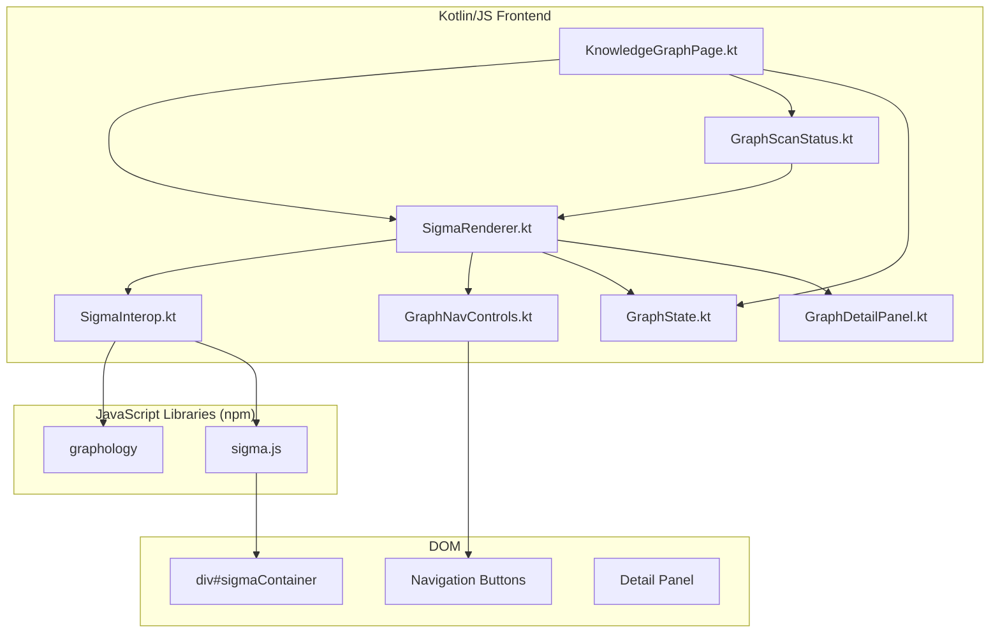
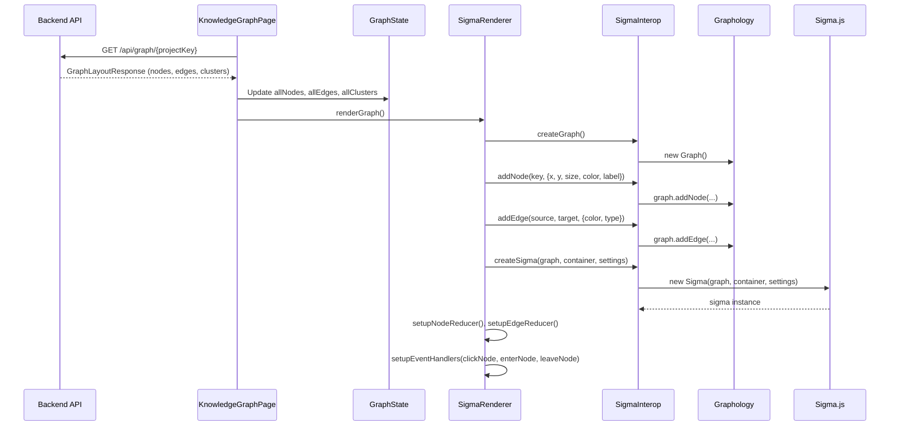

# Design Document — Knowledge Graph Optimization

## Overview

Thay thế custom SVG renderer (Graph3DRenderer, GraphRenderer, Projection3D) bằng Sigma.js (WebGL) + Graphology (data layer) để đạt hiệu suất render 60fps với 1000+ nodes. Chuyển từ 3D sang 2D, giữ server-side layout, thêm navigation controls, và duy trì Obsidian Kinetic dark theme.

### Quyết định thiết kế chính

1. **Sigma.js + Graphology** thay vì custom SVG: WebGL renderer xử lý hàng ngàn nodes mà không tạo DOM elements cho mỗi node/edge
2. **2D rendering**: Bỏ Projection3D, rotation, focalLength — đơn giản hóa interaction model
3. **Server-side layout giữ nguyên**: Graphology nhận x, y từ API, không tính layout phía client
4. **Kotlin/JS interop qua js() + external**: Gọi Sigma.js/Graphology API trực tiếp từ Kotlin code
5. **Node/Edge reducers**: Customize appearance (color, size, label) theo Obsidian Kinetic theme

### Phạm vi thay đổi

- **Tạo mới**: SigmaInterop.kt, SigmaRenderer.kt, GraphNavControls.kt
- **Sửa đổi**: KnowledgeGraphPage.kt, GraphScanStatus.kt, package.json, knowledge-graph.html, knowledge-graph.css
- **Xóa/Deprecate**: Graph3DRenderer.kt, Graph3DGrid.kt, Graph3DInteraction.kt, Projection3D.kt, ProjectedNode.kt, GraphPanZoom.kt, GraphRenderer.kt

## Architecture

### Component Diagram



### Data Flow



## Components and Interfaces

### 1. SigmaInterop.kt — Kotlin/JS External Declarations

Khai báo external interfaces để gọi Sigma.js và Graphology API từ Kotlin code.

```kotlin
// Graphology Graph instance
external interface GraphologyGraph {
    fun addNode(key: String, attributes: dynamic)
    fun addEdge(source: String, target: String, attributes: dynamic)
    fun dropNode(key: String)
    fun dropEdge(key: String)
    fun updateNodeAttribute(key: String, attr: String, value: dynamic)
    fun forEachNode(callback: (String, dynamic) -> Unit)
    fun hasNode(key: String): Boolean
    fun order: Int  // node count
    fun size: Int   // edge count
    fun clear()
}

// Sigma Camera
external interface SigmaCamera {
    fun animatedZoom(options: dynamic = definedExternally)
    fun animatedUnzoom(options: dynamic = definedExternally)
    fun animatedReset(options: dynamic = definedExternally)
    fun animate(state: dynamic, options: dynamic = definedExternally)
    val x: Double
    val y: Double
    val ratio: Double
}

// Sigma Renderer
external interface SigmaInstance {
    fun getCamera(): SigmaCamera
    fun getGraph(): GraphologyGraph
    fun on(event: String, callback: (dynamic) -> Unit)
    fun off(event: String, callback: (dynamic) -> Unit)
    fun setSetting(key: String, value: dynamic)
    fun refresh()
    fun kill()
    fun getNodeDisplayData(key: String): dynamic
}
```

Sử dụng `js()` function để tạo instances:

```kotlin
fun createGraphologyGraph(): GraphologyGraph =
    js("new (require('graphology').default || require('graphology'))()").unsafeCast<GraphologyGraph>()

fun createSigma(graph: GraphologyGraph, container: Element, settings: dynamic): SigmaInstance =
    js("new (require('sigma').default || require('sigma'))(graph, container, settings)").unsafeCast<SigmaInstance>()
```

### 2. SigmaRenderer.kt — Graph Rendering Logic

Chịu trách nhiệm:
- Tạo Graphology graph từ GraphState data
- Khởi tạo Sigma renderer với Obsidian Kinetic settings
- Setup node/edge reducers cho styling
- Setup event handlers (click, hover)
- Cung cấp API cho progressive loading (addNodes, removeNodes)

Key methods:
- `renderGraph()` — Full render từ GraphState
- `updateGraph(addedNodes, addedEdges)` — Progressive update khi scan
- `applySearchFilter(filteredIds)` — Highlight/dim nodes theo search
- `highlightNode(nodeId)` — Highlight node + connected edges on hover
- `resetHighlight()` — Reset về trạng thái bình thường
- `centerOnNode(nodeId)` — Animate camera đến node
- `destroy()` — Cleanup sigma instance

### 3. GraphNavControls.kt — Navigation Control Buttons

Bind event handlers cho navigation buttons:
- Zoom In: `camera.animatedZoom({ duration: 300 })`
- Zoom Out: `camera.animatedUnzoom({ duration: 300 })`
- Fit-to-Screen: `camera.animatedReset({ duration: 500 })`
- Reset View: `camera.animatedReset({ duration: 500 })`
- Center on Node: `camera.animate({ x, y, ratio }, { duration: 400 })`

### 4. GraphState.kt — Simplified State

Loại bỏ 3D state (rotationX, rotationY, focalLength, isDragging) và SVG viewBox state. Giữ lại:
- `allNodes`, `allEdges`, `allClusters`
- `filteredNodeIds`, `selectedNode`
- `typeColorMap`, `defaultClusterColors`
- Thêm: `highlightedNodeId: String?` cho hover state

### 5. KnowledgeGraphPage.kt — Updated Page Controller

Thay thế `Graph3DRenderer.renderGraph()` bằng `SigmaRenderer.renderGraph()`. Thay thế `Graph3DRenderer.renderEmptyState()` bằng `SigmaRenderer.renderEmptyState()`. Search filter gọi `SigmaRenderer.applySearchFilter()` thay vì re-render toàn bộ.

### 6. GraphScanStatus.kt — Updated Progressive Loading

Thay thế `Graph3DRenderer.renderGraph()` bằng `SigmaRenderer.updateGraph(addedNodes, addedEdges)` — thêm nodes/edges mới vào Graphology graph mà không reset camera position.

### 7. knowledge-graph.html — Updated Template

Thay thế `<svg id="graphSvg">` bằng `<div id="sigmaContainer">`. Thêm nút Fit-to-Screen vào zoom controls.

## Data Models

### GraphNode (giữ nguyên)

```kotlin
@Serializable
data class GraphNode(
    val id: String,
    val key: String,
    val summary: String,
    val description: String? = null,
    val type: String,
    val x: Double,
    val y: Double,
    val z: Double = 0.0,  // ignored in 2D mode
    val clusterId: Int? = null,
    val jiraUrl: String? = null
)
```

### GraphEdge (giữ nguyên)

```kotlin
@Serializable
data class GraphEdge(
    val sourceId: String,
    val targetId: String,
    val type: String
)
```

### Graphology Node Attributes (dynamic JS object)

```javascript
{
    x: Double,           // from server layout
    y: Double,           // from server layout
    size: 8,             // base node size
    color: "#2dfecf",    // from typeColorMap
    label: "ITCM-123",  // node.key
    type: "circle",      // sigma node type
    nodeType: "FEATURE"  // custom attr for reducer
}
```

### Graphology Edge Attributes (dynamic JS object)

```javascript
{
    color: "rgba(45, 254, 207, 0.25)",  // based on edge type
    type: "line",                        // or "dashed" for SEMANTIC
    size: 1.5,
    edgeType: "SEMANTIC"                 // custom attr for reducer
}
```

### Sigma Settings (dynamic JS object)

```javascript
{
    renderLabels: true,
    labelFont: "Be Vietnam Pro, sans-serif",
    labelSize: 10,
    labelWeight: "700",
    labelColor: { color: "rgba(255,255,255,0.7)" },
    defaultNodeColor: "#2dfecf",
    defaultEdgeColor: "rgba(45, 254, 207, 0.25)",
    minCameraRatio: 0.1,
    maxCameraRatio: 10,
    allowInvalidContainer: true,
    stagePadding: 40
}
```


## Correctness Properties

*A property is a characteristic or behavior that should hold true across all valid executions of a system — essentially, a formal statement about what the system should do. Properties serve as the bridge between human-readable specifications and machine-verifiable correctness guarantees.*

### Property 1: Node attribute mapping preserves server data

*For any* list of GraphNode objects from the API, when converted to Graphology node attributes, each node's x and y positions SHALL match the original GraphNode.x and GraphNode.y, the label SHALL equal GraphNode.key, and the color SHALL equal typeColorMap[GraphNode.type].

**Validates: Requirements 1.4, 3.4, 5.2**

### Property 2: Edge attribute mapping by type

*For any* GraphEdge, when converted to Graphology edge attributes, if edge.type is "SEMANTIC" then the color SHALL be purple (rgba(190, 157, 255, ...)) and the edge style SHALL be "dashed"; otherwise the color SHALL be cyan (rgba(45, 254, 207, ...)) and the style SHALL be "line".

**Validates: Requirements 5.3**

### Property 3: Search filter correctness

*For any* non-blank search query and any list of GraphNode objects, the set of filtered node IDs SHALL contain exactly those nodes where node.key.lowercase() contains query.lowercase() OR node.summary.lowercase() contains query.lowercase(). When the query is blank, the filtered set SHALL equal all node IDs.

**Validates: Requirements 4.1, 4.2, 4.3**

### Property 4: Hover highlights exactly connected edges

*For any* node in the graph, when that node is hovered, the set of highlighted edges SHALL be exactly those edges where edge.sourceId == node.id OR edge.targetId == node.id.

**Validates: Requirements 3.2**

## Error Handling

### API Errors
- **HTTP 404**: Hiển thị empty state message "No graph data yet. Run a scan from the Dashboard."
- **HTTP 4xx/5xx**: Hiển thị error banner với message cụ thể + nút Retry + nút Switch Project
- **Network error**: Hiển thị error banner "Failed to load graph data" + nút Retry

### Sigma.js Initialization Errors
- **Container not found**: Log error, hiển thị empty state
- **WebGL not supported**: Fallback message "Your browser does not support WebGL. Please use a modern browser."
- **Library not loaded**: Log error, hiển thị error banner

### Progressive Loading Errors
- **Polling failure**: Log error, stop polling, giữ nguyên graph hiện tại
- **Invalid node data**: Skip invalid nodes, log warning, tiếp tục render valid nodes

### Cleanup
- `SigmaRenderer.destroy()` gọi `sigma.kill()` khi navigate away khỏi Knowledge Graph page
- `GraphScanStatus.cancelJobs()` cancel polling coroutines

## Testing Strategy

### Unit Tests (Example-based)

1. **Empty state rendering**: Verify empty state message khi không có data
2. **Error state rendering**: Verify error banner hiển thị khi API lỗi
3. **Navigation button existence**: Verify tất cả navigation buttons tồn tại trong DOM
4. **Detail panel open/close**: Verify panel hiển thị khi click node, ẩn khi click close
5. **Scan status badge**: Verify badge hiển thị đúng processed/total counts

### Property-Based Tests

Sử dụng **kotlin-test** + **kotest-property** (hoặc tương đương cho Kotlin/JS):

- Minimum 100 iterations per property test
- Mỗi test reference property number từ design document

| Property | Test | Tag |
|----------|------|-----|
| Property 1 | Generate random GraphNode lists, convert to Graphology attributes, verify x/y/label/color | Feature: knowledge-graph-optimization, Property 1: Node attribute mapping preserves server data |
| Property 2 | Generate random GraphEdge lists with random types, convert to attributes, verify color/style | Feature: knowledge-graph-optimization, Property 2: Edge attribute mapping by type |
| Property 3 | Generate random query strings + random node lists, apply filter, verify filtered set | Feature: knowledge-graph-optimization, Property 3: Search filter correctness |
| Property 4 | Generate random graph (nodes + edges), pick random node, compute highlighted edges, verify set | Feature: knowledge-graph-optimization, Property 4: Hover highlights exactly connected edges |

### Integration Tests

1. **Sigma.js initialization**: Verify Sigma instance creates successfully with Graphology graph
2. **Camera API**: Verify zoom/reset/animate work without errors
3. **Progressive loading**: Verify adding nodes to existing graph preserves camera state
4. **Kotlin/JS interop**: Verify external declarations work at runtime

### Manual Tests

1. **Performance**: Load 1000+ nodes, verify smooth pan/zoom at 30+ fps
2. **Visual**: Verify Obsidian Kinetic theme colors, fonts, cluster backgrounds
3. **Cross-browser**: Verify WebGL rendering in Chrome, Firefox, Safari
