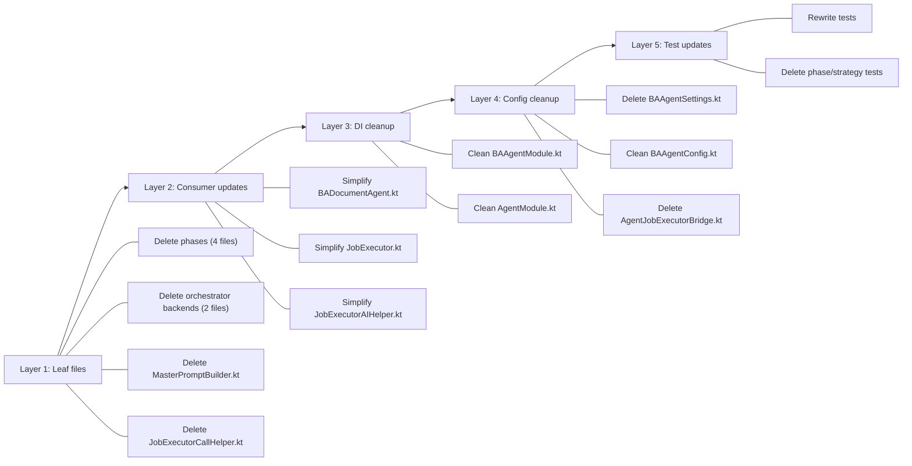

# Design Document — Legacy Pipeline Removal

## Overview

This design specifies the complete removal of the legacy BA document generation pipeline, making `BASubprocessOrchestrator` the single execution path. The work is primarily deletion and simplification — no new features are introduced.

**Current state:** Two parallel execution paths exist:
1. **Subprocess path** — `BASubprocessOrchestrator` → long-lived AI subprocess → tool call loop → multi-turn review → document
2. **Legacy path** — 4-phase thinking loop (`CollectPhase` → `ExpandPhase` → `VisualizePhase` → `SynthesizePhase`) → `MasterPromptBuilder` → one-shot AI agent call via CLI agents

**Target state:** Only the subprocess path remains. All feature flags, fallback chains, legacy phase files, orchestrator backends, and prompt builder are removed. CLI agent classes are preserved for `IntegrationRoutes` provider test connections.

### Key Design Decisions

1. **Bottom-up deletion order** — Delete leaf dependencies first (phases, orchestrator backends), then update consumers (BADocumentAgent, JobExecutor, DI modules), then delete bridge/helper files. This prevents intermediate compilation errors.

2. **Preserve `MasterPromptSections.kt`** — Used by `TaskMessageBuilder` in the subprocess path. Only `MasterPromptBuilder.kt` is deleted. Note: `MasterPromptSections.kt` was modified to remove its `CollectionStrategy` dependency — the `buildContext(memory, strategy)` and `buildLegacyContext()` methods were removed, and `buildContext(memory)` now delegates directly to `buildClassifiedContext(memory)`.

3. **Preserve CLI agent classes** — `GeminiCliAgent`, `CopilotCliAgent`, `KiroCliAgent`, `CliAgentUtils` are used by `IntegrationRoutes.kt` and `ServerModule.kt` for provider test connections. Only their usage in `JobExecutorAIHelper.resolveAgentFromConfig()` is removed.

4. **`BAAgentSettings.kt` deleted entirely** — All three constants (`SUBPROCESS_ENABLED`, `AGENT_PIPELINE_ENABLED`, `DEFAULT_ENABLED`) are removed, leaving the file empty. Delete the file.

5. **`CollectionStrategy` interface and implementations kept** — They are used by `CollectionStrategyPropertyTest` and `SynthesizePhase` tests. However, since the phases themselves are deleted, the strategy tests that depend on phases will also be deleted. The `CollectionStrategy` interface itself is only consumed by `MasterPromptBuilder` and the phases — once those are gone, the strategy files become dead code and should be deleted too.

6. **`JobExecutorAIHelper.kt` simplified, not deleted** — Retains only `SubprocessAgentStub` for document save logging in `JobExecutor.handleSubprocessResult()`.

---

## Architecture

### Dependency Graph (Before Removal)

```mermaid
graph TD
    subgraph "Files to DELETE"
        CP[CollectPhase.kt]
        EP[ExpandPhase.kt]
        VP[VisualizePhase.kt]
        SP[SynthesizePhase.kt]
        CKO[CustomKotlinOrchestrator.kt]
        LJO[LangChain4jOrchestrator.kt]
        MPB[MasterPromptBuilder.kt]
        JECH[JobExecutorCallHelper.kt]
        BAS[BAAgentSettings.kt]
        AJEB[AgentJobExecutorBridge.kt]
    end

    subgraph "Files to MODIFY"
        BDA[BADocumentAgent.kt]
        JE[JobExecutor.kt]
        BAM[BAAgentModule.kt]
        AM[AgentModule.kt]
        BAC[BAAgentConfig.kt]
        JEAH[JobExecutorAIHelper.kt]
    end

    subgraph "Files to KEEP unchanged"
        MPS[MasterPromptSections.kt *modified*]
        TMB[TaskMessageBuilder.kt]
        BSO[BASubprocessOrchestrator.kt]
        CLI[GeminiCliAgent / CopilotCliAgent / KiroCliAgent]
        IR[IntegrationRoutes.kt]
    end

    BDA -->|uses| CKO
    BDA -->|uses| MPB
    BDA -->|uses| SP
    BDA -->|uses| BSO
    BDA -->|checks| BAS
    JE -->|uses| AJEB
    JE -->|uses| JECH
    JE -->|uses| BAS
    JE -->|uses| BSO
    BAM -->|registers| MPB
    BAM -->|registers| AJEB
    BAM -->|injects| CKO
    AM -->|registers| CKO
    AM -->|registers| LJO
    BAC -->|builds| CP
    BAC -->|builds| EP
    BAC -->|builds| VP
    BAC -->|builds| SP
    LJO -->|delegates| CKO
    TMB -->|uses| MPS
    IR -->|uses| CLI
    JEAH -->|uses| CLI
```



### Deletion Order (Bottom-Up)



---

## Components and Interfaces

### BADocumentAgent (Simplified)

**Before:** 8 constructor parameters, feature flag check, dual execution paths, legacy fallback.

**After:** 4 constructor parameters, subprocess-only execution, fail-fast on error.

```kotlin
// Simplified constructor — no OrchestratorBackend, MasterPromptBuilder,
// CollectionStrategy, or SettingsRepository for feature flags
class BADocumentAgent(
    private val toolRegistry: ToolRegistry,
    private val memory: StructuredMemory,
    private val progressReporter: ProgressReporter,
    private val subprocessOrchestrator: BASubprocessOrchestrator?
) : GenericAgent {

    override suspend fun execute(input: AgentInput): AgentOutput {
        val orchestrator = subprocessOrchestrator
            ?: return failedOutput(input.requestId, "Subprocess orchestrator not available")
        val config = BATaskConfig(rootTicketId = rootTicketId, docType = docType)
        val result = orchestrator.executeTask(config)
        if (result.status == BATaskStatus.FAILED) {
            return failedOutput(input.requestId, "Subprocess failed: ${result.document}")
        }
        return successOutput(input.requestId, result.document)
    }
}
```

**Removed dependencies:**
- `OrchestratorBackend` — no thinking loop
- `MasterPromptBuilder` — no prompt assembly
- `(String) -> CollectionStrategy` — no strategy factory
- `SettingsRepository` — no feature flag check

### JobExecutor (Simplified)

**Before:** 10 constructor parameters, 4-tier fallback chain (subprocess → agent pipeline → curation → legacy prompt), feature flag checks.

**After:** 6 constructor parameters, subprocess-only path, fail on error.

```kotlin
// Simplified constructor — no agentBridge, curationPipeline,
// mcpToolRegistrar, providerConfigRepo, httpClient
class JobExecutor(
    private val aggregator: DocumentAggregator,
    private val documentRepository: DocumentRepository,
    private val jobRepository: JobRepository,
    private val settingsRepository: SettingsRepository? = null,
    private val subprocessOrchestrator: BASubprocessOrchestrator? = null
) {
    override suspend fun execute(jobId: String, ticketId: String, docType: String) {
        val tracker = DocGenProgressTracker(jobId, jobRepository, scope)
        try {
            tracker.markStarted()
            val result = executeSubprocess(ticketId, docType)
            handleSubprocessResult(tracker, jobId, ticketId, docType, result)
        } catch (e: Exception) {
            tracker.updateProgress(100, "FAILED")
            jobRepository.updateStatus(jobId, "FAILED", 100, "FAILED", e.message)
        } finally {
            tracker.stopHeartbeat()
        }
    }
}
```

**Removed dependencies:**
- `AgentJobExecutorBridge` — no agent pipeline fallback
- `CurationPipeline` — no curation fallback
- `McpToolRegistrar` — only used by curation path
- `ProviderConfigRepository` — only used by `resolveAgentFromConfig()`
- `HttpClient` — only used by `resolveAgentFromConfig()`
- `JobExecutorCallHelper` — no AI retry logic

**Removed methods:**
- `resolveLegacyPrompt()` — entire legacy prompt resolution chain
- `resolvePrompt()` — backward-compatible alias
- `handleLegacyPrompt()` — legacy prompt + AI call flow
- `trySubprocessDirect()` — replaced by direct subprocess call
- `isSubprocessEnabled()` — no feature flag
- `isAgentPipelineEnabled()` — no agent pipeline
- `isCurationEnabled()` — no curation pipeline
- `tryCurationPipeline()` — no curation
- `tryAgentPipeline()` — no agent pipeline
- `legacyPrompt()` — no legacy prompt
- `buildDocPrompt()` — no prompt building

### JobExecutorAIHelper (Simplified)

**Before:** `SubprocessAgentStub` + `resolveAgentFromConfig()` + `supportedProviderTypes()` + `buildAgent()`.

**After:** Only `SubprocessAgentStub` remains.

```kotlin
package com.assistant.server.jobs

import com.assistant.ai.*

/** Stub AIAgent for subprocess-generated documents (logging only). */
internal object SubprocessAgentStub : AIAgent {
    override suspend fun analyze(prompt: String, context: AIContext?) =
        AIResult.Failure("Not used — subprocess document")
    override fun getAgentName() = "BA Subprocess Orchestrator"
}
```

### BAAgentModule (Cleaned)

**Removed registrations:**
- `MasterPromptBuilder` singleton
- `CollectionStrategy` factory
- `AgentJobExecutorBridge` singleton
- Curation dependency singletons (`TemporalClassifier`, `CommentSummarizer`, `AttachmentCurator`, `BudgetEnforcer`, `McpToolRegistrar`) — these are registered in `CurationModule` separately

**Simplified BADocumentAgent factory:**
- No longer injects `OrchestratorBackend`, `MasterPromptBuilder`, `CollectionStrategy`
- Only injects `ToolRegistry`, `ProgressReporter`, `BASubprocessOrchestrator`

### AgentModule (Cleaned)

**Removed registrations:**
- `factory<OrchestratorBackend> { CustomKotlinOrchestrator(get(), get()) }`
- `factory { LangChain4jOrchestrator(get()) }`

**Kept registrations:** All subprocess-related (`SubprocessManager`, `SubprocessProxy`, `SessionManager`, etc.), `AgentRegistry`, `ToolRegistry`, `ThinkingLoopEngine`, `ProgressReporter`, `ErrorHandler`, `AgentStateManager`.

### BAAgentConfig (Cleaned)

**Removed:**
- `buildBAPhaseConfig()` method
- `buildCollectPhase()`, `buildExpandPhase()`, `buildVisualizePhase()`, `buildSynthesizePhase()` private methods
- Imports for `CollectPhase`, `ExpandPhase`, `VisualizePhase`, `SynthesizePhase`, `CollectionStrategy`

**Kept:**
- `buildSubprocessConfig()` method
- `buildBAAgentConfig()` method
- `AGENT_TYPE`, `CLI_PATH_KEY`, `CLI_MODEL_KEY` constants

### Files Deleted

| File | Reason |
|------|--------|
| `server/.../phases/CollectPhase.kt` | Legacy 4-phase pipeline |
| `server/.../phases/ExpandPhase.kt` | Legacy 4-phase pipeline |
| `server/.../phases/VisualizePhase.kt` | Legacy 4-phase pipeline |
| `server/.../phases/SynthesizePhase.kt` | Legacy 4-phase pipeline |
| `server/.../orchestrator/CustomKotlinOrchestrator.kt` | Legacy orchestrator backend |
| `server/.../orchestrator/LangChain4jOrchestrator.kt` | Legacy orchestrator backend |
| `server/.../prompt/MasterPromptBuilder.kt` | Legacy prompt assembly |
| `server/.../integration/BAAgentSettings.kt` | Feature flag constants (all removed) |
| `server/.../integration/AgentJobExecutorBridge.kt` | Agent pipeline bridge |
| `server/.../jobs/JobExecutorCallHelper.kt` | AI retry/streaming logic |
| `server/.../strategy/CollectionStrategy.kt` | Only used by deleted phases/builder |
| `server/.../strategy/BrdCollectionStrategy.kt` | Only used by deleted phases/builder |
| `server/.../strategy/FsdCollectionStrategy.kt` | Only used by deleted phases/builder |
| `server/.../strategy/SlidesCollectionStrategy.kt` | Only used by deleted phases/builder |

### Files Preserved

| File | Reason |
|------|--------|
| `MasterPromptSections.kt` | Used by `TaskMessageBuilder` in subprocess path. Modified: removed `CollectionStrategy` dependency |
| `GeminiCliAgent.kt` | Used by `IntegrationRoutes.kt` |
| `CopilotCliAgent.kt` | Used by `IntegrationRoutes.kt` |
| `KiroCliAgent.kt` | Used by `IntegrationRoutes.kt` |
| `CliAgentUtils.kt` | Used by CLI agents |
| `BAProgressAdapter.kt` | Used by subprocess path |
| `BASubprocessOrchestrator.kt` | The single execution path |

---

## Data Models

No new data models are introduced. Existing models are unchanged:

- **`BATaskConfig`** (shared module) — Used by `BASubprocessOrchestrator.executeTask()`
- **`BATaskResult`** (shared module) — Returned by `BASubprocessOrchestrator.executeTask()`
- **`BATaskStatus`** (shared module) — `SUCCESS`, `FAILED`, `TIMEOUT`, `PARTIAL`
- **`AgentOutput`** — Returned by `BADocumentAgent.execute()`
- **`AgentInput`** — Passed to `BADocumentAgent.execute()`

Models removed from usage (but not from shared module):
- **`PhaseDefinition`** — No longer used by BA agent (may still be used by other agents)
- **`OrchestratorBackend`** interface — Kept in shared module for future extensibility

---

## Correctness Properties

*A property is a characteristic or behavior that should hold true across all valid executions of a system — essentially, a formal statement about what the system should do. Properties serve as the bridge between human-readable specifications and machine-verifiable correctness guarantees.*

### Property 1: BADocumentAgent always delegates to subprocess

*For any* valid `AgentInput` with any ticket ID and any document type (BRD, FSD, SLIDES), when `BADocumentAgent.execute()` is called with a non-null `BASubprocessOrchestrator`, the orchestrator's `executeTask()` method SHALL be invoked exactly once, and no legacy pipeline code (thinking loop, prompt builder) SHALL be executed.

**Validates: Requirements 4.1, 4.2, 4.3**

### Property 2: JobExecutor subprocess-direct save

*For any* valid job parameters (jobId, ticketId, docType) where the `BASubprocessOrchestrator` returns a successful `BATaskResult`, the `JobExecutor` SHALL save the result document directly to `DocumentRepository` without invoking any `AIAgent.analyze()` call, and the saved document's `aiProviderUsed` field SHALL equal `"BA Subprocess Orchestrator"`.

**Validates: Requirements 5.1, 5.2, 5.4, 5.6**

---

## Error Handling

### BADocumentAgent Error Cases

| Scenario | Behavior | Requirement |
|----------|----------|-------------|
| `subprocessOrchestrator` is null | Return `AgentOutput(status=FAILED, result="Subprocess orchestrator not available")` | 4.4 |
| `executeTask()` returns `BATaskStatus.FAILED` | Return `AgentOutput(status=FAILED)` with error details — **no fallback** | 4.5 |
| `executeTask()` throws exception | Catch, return `AgentOutput(status=FAILED)` with exception message | 4.5 |

### JobExecutor Error Cases

| Scenario | Behavior | Requirement |
|----------|----------|-------------|
| `subprocessOrchestrator` is null | Mark job as FAILED with "Subprocess orchestrator not configured" | 5.3 |
| `executeTask()` returns `BATaskStatus.FAILED` | Mark job as FAILED with subprocess error details | 5.3 |
| `executeTask()` throws exception | Catch, mark job as FAILED with exception message | 5.3 |
| Document parsing fails | Mark job as FAILED with parse error | 5.3 |

**Critical change:** No silent fallback to any other pipeline. Every failure is surfaced to the caller.

---

## Testing Strategy

### Approach

This is primarily a deletion/simplification spec. Testing focuses on:
1. **Subprocess-only behavior** — Verify the simplified components work correctly
2. **Compilation verification** — Ensure no dangling references after deletions
3. **Preservation checks** — Verify CLI agents and `IntegrationRoutes` still work

### Property-Based Tests

Property-based testing is applicable for the two correctness properties identified above. The feature involves pure logic decisions (routing, save behavior) that vary meaningfully with input (different ticket IDs, doc types, subprocess results).

**Library:** Kotest property testing (already used in the project)
**Iterations:** Minimum 100 per property test
**Tag format:** `Feature: legacy-pipeline-removal, Property {N}: {description}`

| Property | Test Class | What Varies |
|----------|-----------|-------------|
| Property 1: BADocumentAgent subprocess-only | `BADocumentAgentSubprocessOnlyPropertyTest` | Random ticket IDs, doc types, subprocess results |
| Property 2: JobExecutor subprocess-direct save | `JobExecutorSubprocessDirectPropertyTest` | Random job IDs, ticket IDs, doc types, document content |

### Unit Tests (Example-Based)

| Test | Validates |
|------|-----------|
| BADocumentAgent: null orchestrator returns FAILED | Req 4.4 |
| BADocumentAgent: subprocess FAILED returns FAILED (no fallback) | Req 4.5 |
| JobExecutor: subprocess failure marks job FAILED | Req 5.3 |
| JobExecutor: null orchestrator marks job FAILED | Req 5.3 |
| BAAgentModule: no MasterPromptBuilder bean | Req 6.1 |
| BAAgentModule: no CollectionStrategy factory bean | Req 6.2 |
| BAAgentModule: BASubprocessOrchestrator still resolves | Req 6.5 |
| AgentModule: no OrchestratorBackend bean | Req 7.1 |
| AgentModule: SubprocessManager still resolves | Req 7.3 |

### Test Files to Rewrite

| File | Change |
|------|--------|
| `BADocumentAgentFeatureFlagTest.kt` | Rewrite as `BADocumentAgentSubprocessTest.kt` — test subprocess success, subprocess failure (no fallback), null orchestrator |
| `JobExecutorFallbackChainTest.kt` | Rewrite as `JobExecutorSubprocessDirectTest.kt` — test subprocess success saves document, subprocess failure marks job failed, null orchestrator marks job failed |
| `FallbackChainTestDoubles.kt` | Simplify — remove `FakeBridge`, keep `FakeOrchestrator` and repository fakes |

### Test Files to Delete

| File | Reason |
|------|--------|
| `CollectPhaseTest.kt` | Tests deleted `CollectPhase` |
| `ExpandPhaseTest.kt` | Tests deleted `ExpandPhase` |
| `ExpandPhaseClassificationTest.kt` | Tests deleted `ExpandPhase` |
| `VisualizePhaseTest.kt` | Tests deleted `VisualizePhase` |
| `SynthesizePhaseTest.kt` | Tests deleted `SynthesizePhase` |
| `CollectionStrategyPropertyTest.kt` | Tests deleted `CollectionStrategy` implementations |
| `MasterPromptBuilderPropertyTest.kt` | Tests deleted `MasterPromptBuilder` |
| `MasterPromptPropertyTest.kt` | Tests deleted `MasterPromptBuilder` |
| `MasterPromptContentPropertyTest.kt` | Tests deleted `MasterPromptBuilder` |
| `AgentJobExecutorBridgeTest.kt` | Tests deleted `AgentJobExecutorBridge` |
| `BADocumentAgentTest.kt` | Tests legacy dual-path BADocumentAgent (needs rewrite or deletion) |

### Test Files to Keep

| File | Reason |
|------|--------|
| `TaskMessageBuilderTest.kt` | Tests subprocess path component |
| `TaskMessageBuilderPropertyTest.kt` | Tests subprocess path component |
| `BAAgentModuleRegistrationTest.kt` | Needs update to remove legacy bean checks |
| `MasterPromptContextBuilderPropertyTest.kt` | Tests `MasterPromptContextBuilder` (if still used) |
| `PromptAssemblerPropertyTest.kt` | Tests `PromptAssembler` (separate from legacy pipeline) |
| `CurationPipelinePropertyTest.kt` | Tests `CurationPipeline` (separate module, not deleted) |

### Compilation Verification

After all changes, run:
```bash
./gradlew :server:compileKotlinJvm
./gradlew :server:compileTestKotlinJvm
./gradlew :server:test
```
