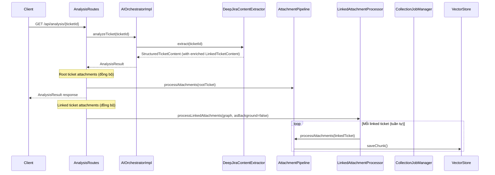
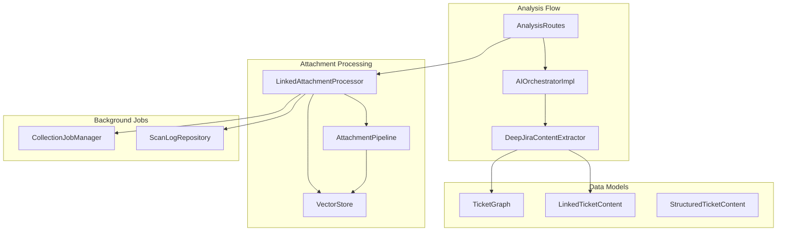
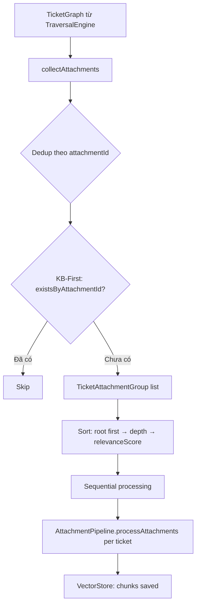

# Linked Ticket Attachments — Design Document

## Overview

### Mục tiêu

Mở rộng attachment processing pipeline để xử lý attachments từ **tất cả tickets trong TicketGraph** — bao gồm root ticket và linked tickets đã được discover bởi `TraversalEngine`. Đồng thời bổ sung `comments` và `attachments` vào `LinkedTicketContent` model để AI prompt có đầy đủ ngữ cảnh.

### Phạm vi thay đổi

1. **Model layer**: Mở rộng `LinkedTicketContent` thêm `comments` và `attachments` fields
2. **Extraction layer**: Cập nhật `DeepJiraContentExtractor.nodeToLinkedContent()` để map đầy đủ dữ liệu
3. **Prompt layer**: Cập nhật `appendLinkedTicketsContext()` để include comments và attachment filenames
4. **Processing layer**: Tạo `LinkedAttachmentProcessor` — component mới thu thập và xử lý attachments từ TicketGraph
5. **Integration layer**: Cập nhật `AnalysisRoutes` và `BatchScanEngine` để tích hợp linked attachment processing

### Nguyên tắc thiết kế

- **Reuse over rewrite**: Tái sử dụng `AttachmentPipeline.processAttachments()` cho từng ticket, không duplicate logic
- **No extra API calls**: Sử dụng dữ liệu đã có trong `TicketGraph` từ deep extraction
- **Synchronous processing**: Linked ticket attachments chạy đồng bộ cho cả Ticket Intelligence (single-ticket) và batch scan — frontend blocking layer chỉ tắt khi mọi thứ xong
- **Error isolation**: Lỗi ở một ticket không ảnh hưởng tickets khác, lỗi attachment không ảnh hưởng analysis result
- **Sequential processing**: Markitdown MCP là single-process → xử lý tuần tự

## Architecture

### High-Level Data Flow



### Component Diagram



### Quyết định kiến trúc

| Quyết định | Lý do |
|---|---|
| `LinkedAttachmentProcessor` là class riêng, không mở rộng `AttachmentPipeline` | SRP — AttachmentPipeline xử lý 1 ticket, LinkedAttachmentProcessor orchestrate nhiều tickets |
| Đồng bộ cho cả single-ticket và batch scan | Ticket Intelligence page cần blocking layer giữ đến khi xong; batch scan đã là background process |
| Sequential processing (không parallel) | Markitdown MCP server là single-process, không hỗ trợ concurrent calls |
| Nhận `TicketGraph` làm input, không fetch lại từ Jira | Tránh duplicate API calls, tận dụng dữ liệu đã thu thập |
| Extend `LinkedTicketContent` với default `emptyList()` | Backward compatibility — existing code không cần thay đổi |

## Components and Interfaces

### 1. LinkedAttachmentProcessor (MỚI)

**Package**: `com.assistant.server.attachment`

**Trách nhiệm**: Thu thập attachment metadata từ TicketGraph, dedup, sắp xếp theo relevance, và xử lý tuần tự qua `AttachmentPipeline`.

```kotlin
/**
 * Orchestrates attachment processing for all tickets in a TicketGraph.
 * Reuses AttachmentPipeline for each ticket's attachments.
 * Requirements: 1.1-1.5, 2.1-2.5, 3.1-3.4, 4.1-4.5, 5.1-5.4
 */
class LinkedAttachmentProcessor(
    private val attachmentPipeline: AttachmentPipeline,
    private val vectorStore: VectorStore,
    private val collectionJobManager: CollectionJobManager,
    private val scanLogRepository: ScanLogRepository
) {
    /**
     * Thu thập và xử lý attachments từ tất cả linked tickets.
     * Gọi từ AnalysisRoutes (background) hoặc BatchScanEngine (đồng bộ).
     *
     * @param graph TicketGraph từ deep extraction
     * @param rootTicketId Root ticket ID
     * @param asBackground true = tạo CollectionJob (single-ticket),
     *                     false = xử lý đồng bộ (batch scan)
     * @param timeoutMs Timeout tổng cho toàn bộ quá trình
     */
    suspend fun processLinkedAttachments(
        graph: TicketGraph,
        rootTicketId: String,
        asBackground: Boolean,
        timeoutMs: Long = 120_000
    )

    /**
     * Thu thập danh sách attachments cần xử lý từ TicketGraph.
     * Dedup theo attachmentId, skip đã có trong VectorStore.
     * Sắp xếp theo: root first → depth ascending → relevanceScore descending.
     *
     * @return List<TicketAttachmentGroup> — mỗi group = 1 ticket + attachments cần xử lý
     */
    internal suspend fun collectAttachments(
        graph: TicketGraph,
        rootTicketId: String
    ): List<TicketAttachmentGroup>
}
```

**Internal model**:

```kotlin
/** Nhóm attachments cần xử lý cho một ticket. */
data class TicketAttachmentGroup(
    val ticketId: String,
    val projectKey: String,
    val depth: Int,
    val relevanceScore: Double,
    val attachments: List<JiraAttachment>
)
```

### 2. LinkedTicketContent (MỞ RỘNG)

**Thay đổi**: Thêm 2 fields với default `emptyList()`.

```kotlin
@Serializable
data class LinkedTicketContent(
    val ticketId: String = "",
    val summary: String = "",
    val description: String = "",
    val status: String = "",
    val linkType: String = "",
    // MỚI — Req 11.1
    val comments: List<CommentInfo> = emptyList(),
    // MỚI — Req 11.2
    val attachments: List<AttachmentInfo> = emptyList()
)
```

### 3. DeepJiraContentExtractor.nodeToLinkedContent() (CẬP NHẬT)

**Thay đổi**: Map thêm `comments` và `attachments` từ `TicketNode.issue`.

```kotlin
private fun nodeToLinkedContent(node: TicketNode): LinkedTicketContent {
    return LinkedTicketContent(
        ticketId = node.ticketId,
        summary = node.issue.summary,
        description = node.issue.description,
        status = node.issue.status,
        linkType = node.discoveredVia.toLinkTypeLabel(),
        // MỚI — Req 11.3
        comments = node.issue.comments,
        attachments = node.issue.attachments
    )
}
```

### 4. appendLinkedTicketsContext() (CẬP NHẬT)

**Thay đổi**: Include comments và attachment filenames trong prompt section.

```kotlin
internal fun StringBuilder.appendLinkedTicketsContext(
    content: StructuredTicketContent
) {
    if (content.linkedTicketContents.isEmpty()) return
    appendLine("=== RELATED TICKETS CONTEXT ===")
    appendLine("The following are detailed contents of linked/blocking tickets.")
    appendLine()
    for (linked in content.linkedTicketContents) {
        appendLine("--- ${linked.ticketId} (${linked.linkType}) ---")
        appendLine("Summary: ${linked.summary}")
        appendLine("Status: ${linked.status}")
        if (linked.description.isNotBlank()) {
            appendLine("Description: ${linked.description}")
        }
        // MỚI — Req 11.4: Comments
        if (linked.comments.isNotEmpty()) {
            appendLine("Comments:")
            linked.comments.forEach { c ->
                appendLine("  - [${c.createdDate}] ${c.author}: ${c.content}")
            }
        }
        // MỚI — Req 11.4: Attachment filenames
        if (linked.attachments.isNotEmpty()) {
            appendLine("Attachments:")
            linked.attachments.forEach { a ->
                appendLine("  - ${a.filename} (${a.mimeType}, ${a.size} bytes)")
            }
        }
        appendLine()
    }
}
```

### 5. AnalysisRoutes (CẬP NHẬT)

**Thay đổi**: `runAnalysis()` nhận thêm `TicketGraph` từ deep extraction, gọi `LinkedAttachmentProcessor` cho linked tickets.

```kotlin
// Trong runAnalysis():
// 1. Root ticket attachments — đồng bộ (giữ nguyên)
processTicketAttachments(ticketId, attachmentPipeline, jiraClientProvider)

// 2. Linked ticket attachments — đồng bộ (Ticket Intelligence page cần blocking đến khi xong)
processLinkedAttachmentsSynchronously(ticketId, linkedAttachmentProcessor, ticketGraphHolder)
```

**Vấn đề**: Hiện tại `AIOrchestratorImpl.analyzeTicket()` không trả về `TicketGraph`. Cần thêm cơ chế để `AnalysisRoutes` nhận được graph.

**Giải pháp**: Thêm `TicketGraphHolder` — thread-local-like holder để `DeepJiraContentExtractor` lưu graph sau extraction, `AnalysisRoutes` đọc lại sau khi analysis hoàn tất.

```kotlin
/**
 * Holds the most recent TicketGraph from deep extraction.
 * Used to pass graph from DeepJiraContentExtractor to AnalysisRoutes
 * without changing AIOrchestratorImpl interface.
 */
class TicketGraphHolder {
    private val graphMap = ConcurrentHashMap<String, TicketGraph>()

    fun store(ticketId: String, graph: TicketGraph) {
        graphMap[ticketId] = graph
    }

    fun take(ticketId: String): TicketGraph? {
        return graphMap.remove(ticketId)
    }
}
```

### 6. BatchScanEngine Integration

**Thay đổi**: Sau khi `processTicket()` hoàn tất AI analysis, gọi `LinkedAttachmentProcessor` đồng bộ.

```kotlin
// Trong processTicket():
// Phase 3: Relationships + attachments (bao gồm linked)
coroutineScope {
    launch { logIssueRelationships(projectKey, ticketId) }
    launch { processAttachmentsIfAvailable(projectKey, ticketId) }
    // MỚI — Req 9.1: Linked ticket attachments (đồng bộ)
    launch {
        linkedAttachmentProcessor?.processLinkedAttachments(
            graph, ticketId, asBackground = false
        )
    }
}
```

## Data Models

### Thay đổi Model

#### LinkedTicketContent (shared module)

```diff
 @Serializable
 data class LinkedTicketContent(
     val ticketId: String = "",
     val summary: String = "",
     val description: String = "",
     val status: String = "",
-    val linkType: String = ""
+    val linkType: String = "",
+    val comments: List<CommentInfo> = emptyList(),
+    val attachments: List<AttachmentInfo> = emptyList()
 )
```

#### TicketAttachmentGroup (server module — MỚI)

```kotlin
package com.assistant.server.attachment.models

/**
 * Nhóm attachments cần xử lý cho một ticket trong TicketGraph.
 * Được sắp xếp theo depth (ascending) và relevanceScore (descending).
 */
data class TicketAttachmentGroup(
    val ticketId: String,
    val projectKey: String,
    val depth: Int,
    val relevanceScore: Double,
    val attachments: List<com.assistant.jira.JiraAttachment>
)
```

### Data Flow Diagram



### Mapping: TicketNode → JiraAttachment

`TicketNode.issue.attachments` chứa `List<AttachmentInfo>` với fields: `filename`, `mimeType`, `size`. Tuy nhiên `AttachmentPipeline.processAttachments()` nhận `List<JiraAttachment>` cần thêm `id` và `content` (download URL).

**Giải pháp**: Mở rộng `AttachmentInfo` thêm `id` và `content` fields (đã có trong Jira API response, chỉ chưa được map).

```diff
 @Serializable
 data class AttachmentInfo(
+    val id: String = "",
     val filename: String = "",
     val mimeType: String = "",
-    val size: Long = 0L
+    val size: Long = 0L,
+    val content: String = ""  // Download URL
 )
```

Và thêm extension function để convert:

```kotlin
/** Convert AttachmentInfo (from StructuredTicketContent) to JiraAttachment. */
fun AttachmentInfo.toJiraAttachment(): JiraAttachment = JiraAttachment(
    id = id,
    filename = filename,
    mimeType = mimeType,
    size = size,
    content = content
)
```

## Correctness Properties

*A property is a characteristic or behavior that should hold true across all valid executions of a system — essentially, a formal statement about what the system should do. Properties serve as the bridge between human-readable specifications and machine-verifiable correctness guarantees.*

### Property 1: Attachment Collection Completeness

*For any* `TicketGraph` with N nodes, each containing M_i attachments, `collectAttachments()` SHALL return entries covering all attachments from all nodes, where each entry contains valid attachment metadata (id, filename, mimeType, size, content URL) and the correct `ticketId` of the ticket that owns the attachment.

**Validates: Requirements 1.1, 1.2**

### Property 2: Attachment Deduplication

*For any* `TicketGraph` where the same `attachmentId` appears in multiple nodes, and *for any* set of already-processed attachment IDs in VectorStore, `collectAttachments()` SHALL return a list where (a) each `attachmentId` appears at most once, and (b) no `attachmentId` from the already-processed set appears in the output.

**Validates: Requirements 1.3, 1.4**

### Property 3: Processing Order by Relevance

*For any* `TicketGraph` with multiple nodes at varying depths and relevance scores, the output of `collectAttachments()` SHALL be ordered such that: (1) root ticket attachments appear first, (2) among non-root tickets, lower depth appears before higher depth, (3) within the same depth, higher `relevanceScore` appears before lower `relevanceScore`.

**Validates: Requirements 3.4**

### Property 4: Correct Pipeline Parameters

*For any* ticket in a `TicketGraph` with ticketId in format `"PROJECT-123"`, when `AttachmentPipeline.processAttachments()` is called, it SHALL receive `ticketKey` equal to the ticket's own `ticketId` (not the root ticket) and `projectKey` equal to `ticketId.substringBefore("-")`.

**Validates: Requirements 4.2, 4.3**

### Property 5: Error Isolation and Containment

*For any* `TicketGraph` and *for any* subset of tickets whose `AttachmentPipeline.processAttachments()` throws an exception, `processLinkedAttachments()` SHALL (a) never propagate an exception to the caller, and (b) still process all remaining non-failing tickets.

**Validates: Requirements 4.4, 6.4**

### Property 6: Job Status Determination

*For any* `CollectionJob` with `completedItems` and `failedItems` counts where `completedItems + failedItems == totalItems`, the final job status SHALL be `COMPLETED` when `completedItems > 0`, and `FAILED` when `completedItems == 0`.

**Validates: Requirements 6.5**

### Property 7: No Background Job for Single-Node Graph

*For any* `TicketGraph` containing only the root node (no linked tickets), `processLinkedAttachments()` SHALL NOT create a background `CollectionJob`.

**Validates: Requirements 7.5**

### Property 8: nodeToLinkedContent Preserves Comments and Attachments

*For any* `TicketNode` with arbitrary `comments: List<CommentInfo>` and `attachments: List<AttachmentInfo>`, `nodeToLinkedContent(node)` SHALL produce a `LinkedTicketContent` where `comments` and `attachments` are identical to `node.issue.comments` and `node.issue.attachments` respectively.

**Validates: Requirements 11.3**

### Property 9: Prompt Includes Linked Ticket Comments and Attachments

*For any* `StructuredTicketContent` with `linkedTicketContents` containing comments and attachments, the prompt string produced by `appendLinkedTicketsContext()` SHALL contain every comment author, every comment content, and every attachment filename from the linked tickets.

**Validates: Requirements 11.4**

## Error Handling

### Chiến lược Error Handling theo Layer

| Layer | Error Type | Handling |
|---|---|---|
| `LinkedAttachmentProcessor.processLinkedAttachments()` | Bất kỳ exception nào | Catch all, log error, KHÔNG propagate. Analysis response không bị ảnh hưởng |
| `LinkedAttachmentProcessor` per-ticket | `AttachmentPipeline` throws | Log error với ticketId, skip ticket, tiếp tục tickets còn lại |
| `AttachmentPipeline` per-attachment | Download fail (404, 403, network) | Skip attachment, log FAILED, tiếp tục attachment tiếp theo (behavior hiện tại) |
| `AttachmentPipeline` | Markitdown MCP crash | Restart 1 lần. Nếu vẫn fail → skip tất cả cần markitdown (behavior hiện tại) |
| `LinkedAttachmentProcessor` | Embedding service unavailable | Dừng tất cả remaining attachments, log error, cập nhật CollectionJob → FAILED |
| `LinkedAttachmentProcessor` | Timeout exceeded | Dừng processing, log warning với elapsed/completed/total, cập nhật job status |

### Error Detection cho Embedding Service

```kotlin
// Trong processLinkedAttachments loop:
val chunks = attachmentPipeline.processAttachments(projectKey, ticketId, attachments)
if (chunks == 0 && attachments.isNotEmpty()) {
    // Có thể embedding service down — kiểm tra bằng cách thử embed 1 text
    val testEmbed = embeddingService.embed("test")
    if (testEmbed == null) {
        logger.error("Embedding service unavailable, stopping linked attachment processing")
        updateJobStatus(jobId, CollectionJobStatus.FAILED)
        return
    }
}
```

### Timeout Handling

```kotlin
val startTime = System.currentTimeMillis()
for (group in sortedGroups) {
    val elapsed = System.currentTimeMillis() - startTime
    if (elapsed > timeoutMs) {
        logger.warn(
            "Linked attachment processing timeout after {}ms, processed {}/{} tickets",
            elapsed, processedCount, totalCount
        )
        break
    }
    // Process ticket...
}
```

## Testing Strategy

### Unit Tests (Example-based)

| Test | Mô tả | Validates |
|---|---|---|
| `collectAttachments_emptyGraph` | TicketGraph chỉ có root node không có attachments → empty list | 7.5 |
| `collectAttachments_rootOnly` | TicketGraph chỉ có root node có attachments → root attachments only | 7.1 |
| `processLinkedAttachments_backgroundMode` | Verify CollectionJob được tạo khi asBackground=true | 2.1 |
| `processLinkedAttachments_syncMode` | Verify KHÔNG tạo CollectionJob khi asBackground=false | 9.2 |
| `processLinkedAttachments_duplicateJobSkip` | Khi đã có active job → không tạo mới | 2.4 |
| `processLinkedAttachments_timeout` | Timeout → dừng và log warning | 5.4 |
| `processLinkedAttachments_embeddingDown` | Embedding service fail → job FAILED | 6.3 |
| `nodeToLinkedContent_mapsAllFields` | Verify tất cả fields được map đúng | 11.3 |
| `appendLinkedTicketsContext_withComments` | Verify prompt chứa comments | 11.4 |
| `appendLinkedTicketsContext_withAttachments` | Verify prompt chứa attachment filenames | 11.4 |
| `LinkedTicketContent_deserializeOldJson` | JSON không có comments/attachments → emptyList() | 11.5 |
| `runAnalysis_deepEnabled_passesGraph` | Deep extraction enabled → graph passed to processor | 3.2 |
| `runAnalysis_deepDisabled_rootOnly` | Deep extraction disabled → chỉ root ticket | 3.3, 7.4 |

### Property-Based Tests (PBT)

**Library**: [Kotest Property Testing](https://kotest.io/docs/proptest/property-based-testing.html) — đã được sử dụng trong project (xem `CollectionJobTestFakes.kt`).

**Cấu hình**: Minimum 100 iterations per property test.

| Property Test | Tag | Validates |
|---|---|---|
| `collectAttachments completeness` | Feature: linked-ticket-attachments, Property 1: Attachment Collection Completeness | 1.1, 1.2 |
| `collectAttachments deduplication` | Feature: linked-ticket-attachments, Property 2: Attachment Deduplication | 1.3, 1.4 |
| `collectAttachments ordering` | Feature: linked-ticket-attachments, Property 3: Processing Order by Relevance | 3.4 |
| `pipeline parameter correctness` | Feature: linked-ticket-attachments, Property 4: Correct Pipeline Parameters | 4.2, 4.3 |
| `error isolation` | Feature: linked-ticket-attachments, Property 5: Error Isolation and Containment | 4.4, 6.4 |
| `job status determination` | Feature: linked-ticket-attachments, Property 6: Job Status Determination | 6.5 |
| `no job for single-node graph` | Feature: linked-ticket-attachments, Property 7: No Background Job for Single-Node Graph | 7.5 |
| `nodeToLinkedContent preserves data` | Feature: linked-ticket-attachments, Property 8: nodeToLinkedContent Preserves Comments and Attachments | 11.3 |
| `prompt includes linked data` | Feature: linked-ticket-attachments, Property 9: Prompt Includes Linked Ticket Comments and Attachments | 11.4 |

### Test Generators (Kotest Arb)

```kotlin
/** Generator cho TicketGraph với random nodes và attachments. */
fun Arb.Companion.ticketGraph(
    maxNodes: Int = 10,
    maxAttachmentsPerNode: Int = 5
): Arb<TicketGraph>

/** Generator cho AttachmentInfo với random metadata. */
fun Arb.Companion.attachmentInfo(): Arb<AttachmentInfo>

/** Generator cho TicketNode với random depth, relevanceScore, attachments. */
fun Arb.Companion.ticketNode(
    depth: Int = 1,
    attachmentCount: Int = 0
): Arb<TicketNode>

/** Generator cho LinkedTicketContent với random comments và attachments. */
fun Arb.Companion.linkedTicketContent(): Arb<LinkedTicketContent>
```

### Integration Tests

| Test | Mô tả |
|---|---|
| `AnalysisRoutes_linkedAttachments_e2e` | Full flow: analysis → root attachments (sync) → linked attachments (background) |
| `BatchScan_linkedAttachments_e2e` | Batch scan processes linked ticket attachments synchronously |
| `VectorStore_linkedAttachmentSearch` | Chunks from linked tickets are searchable via semantic search |
| `CollectionJob_progressTracking` | Frontend can poll progress via GET /api/collection-jobs |

