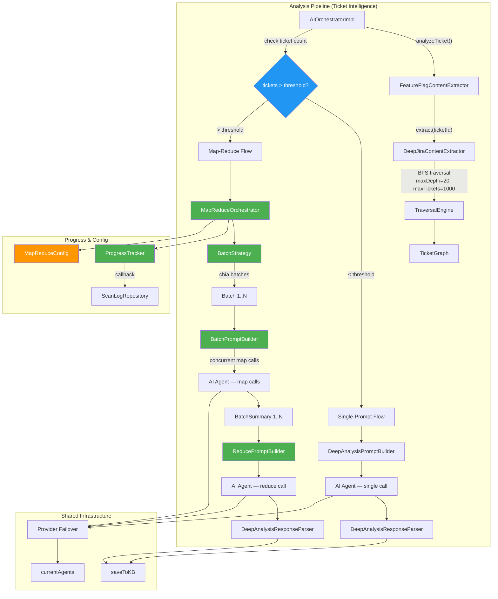
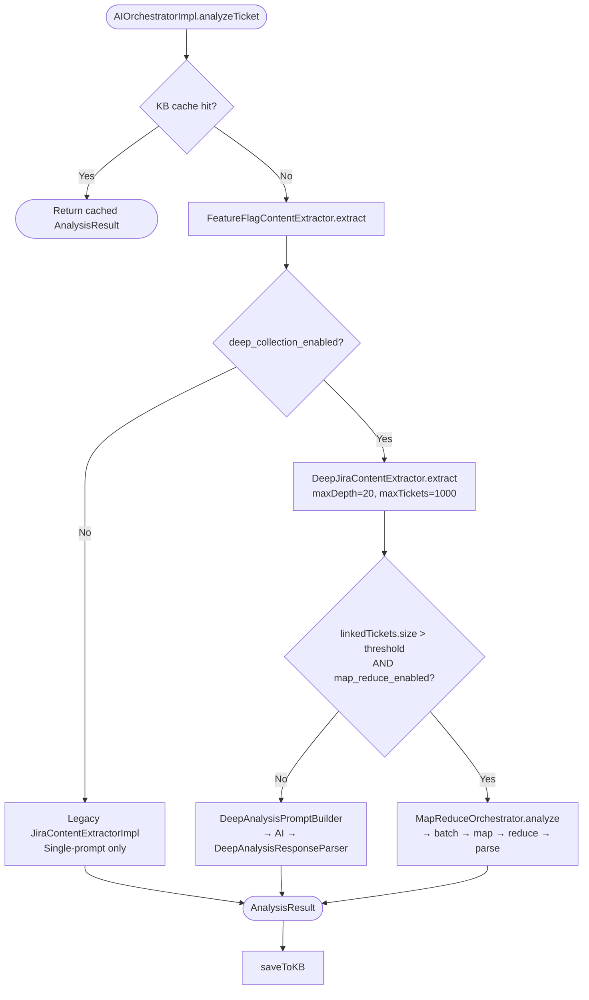
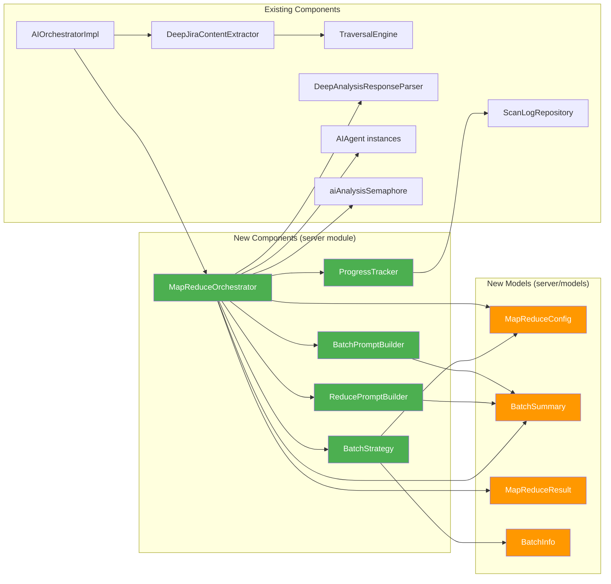
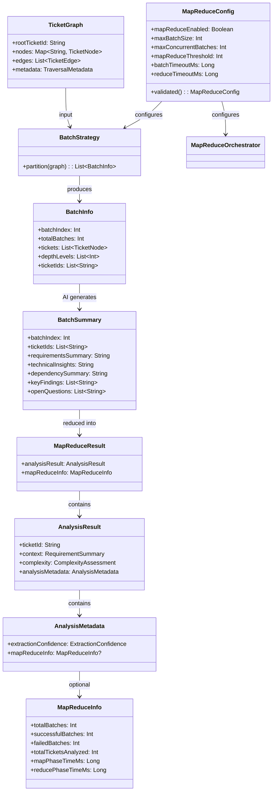
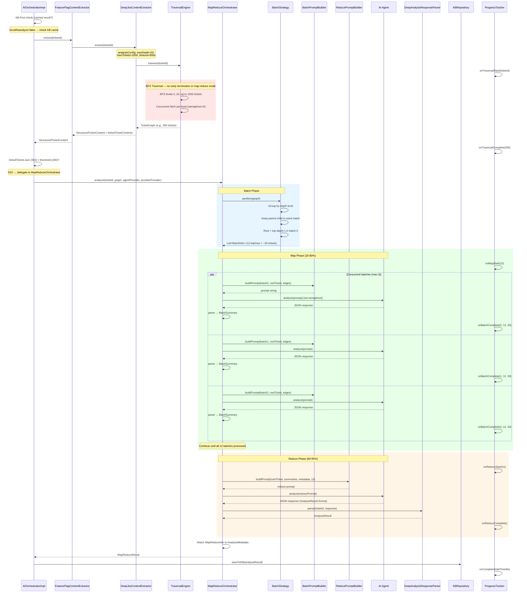
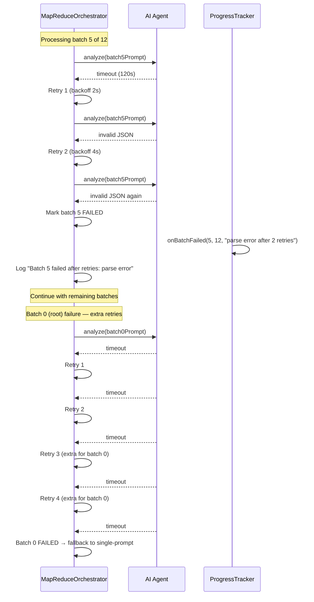
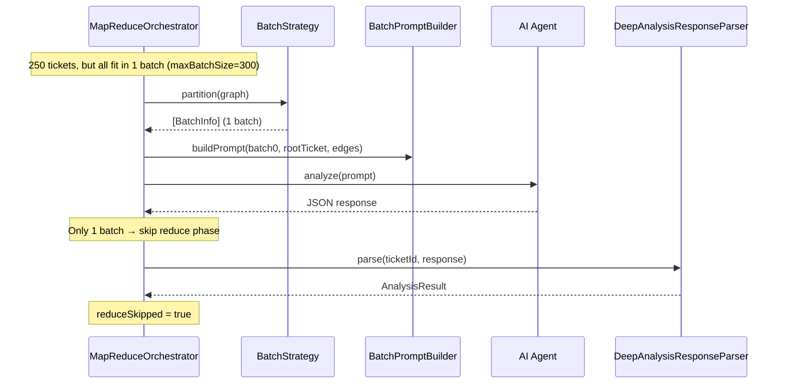

# Map-Reduce Analysis — Design

## Overview

### Mục tiêu

Thiết kế **Map-Reduce Analysis Pipeline** để giải quyết giới hạn single-prompt analysis hiện tại. Khi ticket graph lớn (>200 tickets), thay vì nhồi tất cả vào một prompt duy nhất rồi truncate, hệ thống sẽ:

1. **Bỏ giới hạn thu thập**: Mở rộng `TraversalConfig.validated()` clamp ranges (maxDepth 1..20, maxTickets 1..1000) và tăng `DeepJiraContentExtractor.analysisConfig()` lên maxDepth=20, maxTickets=1000, timeout=600s
2. **Map phase**: Chia tickets thành batches theo depth level + relationship cluster, gửi từng batch đến AI để tạo `BatchSummary`
3. **Reduce phase**: Tổng hợp tất cả `BatchSummary` thành `AnalysisResult` cuối cùng — cùng format với single-prompt flow
4. **Backward compatible**: Ticket graphs ≤200 tickets vẫn dùng single-prompt flow hiện tại, không thay đổi gì

### Phạm vi thay đổi

- **Thêm mới** (server module):
  - `MapReduceOrchestrator` — điều phối toàn bộ map-reduce pipeline
  - `MapPhaseExecutor` — concurrent batch processing với retries
  - `ReducePhaseExecutor` — combine summaries via AI với fallback
  - `BatchSummaryParser` — tolerant JSON parsing từ AI responses
  - `BatchStrategy` — chia tickets thành batches thông minh
  - `BatchPromptBuilder` + `BatchPromptSections` — xây dựng prompt cho map phase
  - `ReducePromptBuilder` + `ReduceJsonSchema` — xây dựng prompt cho reduce phase
  - `ProgressTracker` — theo dõi tiến trình map-reduce
  - `MapReduceAnalyzerAdapter` — bridges `MapReduceAnalyzer` (shared) ↔ `MapReduceOrchestrator` (server)
  - `MapReduceConfig` — cấu hình pipeline (models/)
  - `BatchSummary` — kết quả phân tích mỗi batch (models/)
  - `MapReduceResult` — kết quả tổng hợp (models/)
  - `BatchInfo` — metadata mỗi batch (models/)
- **Thêm mới** (shared module):
  - `MapReduceAnalyzer` — interface cho cross-module delegation
  - `MapReduceInfo` — pipeline metadata (dùng bởi cả AnalysisMetadata và MapReduceResult)
- **Mở rộng**:
  - `TraversalConfig.validated()` — mở rộng clamp ranges (maxDepth 1..20, maxTickets 1..1000), thêm `disableEarlyTermination` field
  - `DeepJiraContentExtractor.analysisConfig()` — tăng limits (maxDepth=20, maxTickets=1000, timeout=600s, disableEarlyTermination=true)
  - `TraversalEngine` — hỗ trợ disable early termination khi chạy map-reduce mode (via `TraversalState.isEarlyTermination()`)
  - `AIOrchestratorImpl` — inject optional `MapReduceAnalyzer` (interface), delegate khi ticket count vượt threshold
  - `AnalysisMetadata` — thêm `mapReduceInfo: MapReduceInfo?` field (MapReduceInfo ở shared module)
  - `DeepCollectionModule` — thêm map-reduce component bindings + `MapReduceAnalyzerAdapter`
  - `ServerModule` — inject `mapReduceAnalyzer` vào `AIOrchestratorImpl`
- **Giữ nguyên**: `DeepAnalysisPromptBuilder`, `DeepAnalysisResponseParser`, `FeatureFlagContentExtractor`, `FeatureFlagAggregator`, KB save logic

### Quyết định thiết kế chính

| Quyết định | Lựa chọn | Lý do |
|---|---|---|
| Module placement | `server` module | MapReduceOrchestrator phụ thuộc TraversalEngine, TicketGraph — đều ở server module |
| Batch strategy | Depth-level grouping + relationship clustering | Tickets cùng depth có ngữ cảnh tương tự, giữ parent-child trong cùng batch |
| AI agent reuse | Dùng `currentAgents()` + `getActiveProvidersByPriority()` từ AIOrchestratorImpl via `MapReduceAnalyzer` interface | Không tạo AI connections riêng, tận dụng provider failover hiện tại. Interface pattern giải quyết shared↔server module boundary |
| Concurrency control | `aiAnalysisSemaphore` (từ deep-collection spec) | Map batch calls tuân thủ AI concurrency limit chung |
| Threshold activation | `map_reduce_threshold` (mặc định 200) | Tự động chuyển sang map-reduce khi ticket count vượt ngưỡng |
| BatchSummary serialization | `@Serializable` data class với `ignoreUnknownKeys = true` | Hỗ trợ caching, round-trip, và tolerant parsing từ AI response |
| MapReduceInfo placement | Shared module (`com.assistant.ai.deepanalysis.models`) | AnalysisMetadata ở shared module cần reference MapReduceInfo — cả hai phải cùng module |
| MapReduceOrchestrator decomposition | 4 files: `MapReduceOrchestrator`, `MapPhaseExecutor`, `ReducePhaseExecutor`, `BatchSummaryParser` | Tuân thủ 200-line file limit, SRP |
| BatchPromptBuilder decomposition | 2 files: `BatchPromptBuilder`, `BatchPromptSections` | Tuân thủ 200-line file limit, SRP |
| ReducePromptBuilder decomposition | 2 files: `ReducePromptBuilder`, `ReduceJsonSchema` | Tuân thủ 200-line file limit, SRP |
| Cross-module integration | `MapReduceAnalyzer` interface (shared) + `MapReduceAnalyzerAdapter` (server) | AIOrchestratorImpl (shared) cannot depend on server module directly |
| Early termination | Disable khi map-reduce mode | Data sẽ được chia batch, không cần fit vào một prompt |
| Fallback strategy | Single-prompt flow với root + depth-1 tickets | Khi tất cả batches fail, vẫn trả về kết quả từ core data |
| Config storage | Application settings (cùng cơ chế TraversalConfig) | Admin thay đổi qua API, không cần restart |
| PromptBuilder placement | `server` module | Phụ thuộc TicketGraph, BatchInfo — đều ở server module |

## Architecture

### Tổng quan kiến trúc



### Luồng quyết định Single-Prompt vs Map-Reduce




## Components and Interfaces

### 1. MapReduceOrchestrator — Điều phối Map-Reduce pipeline

```kotlin
// Package: com.assistant.server.analysis
// File: MapReduceOrchestrator.kt (≤200 lines)

/**
 * Orchestrates the Map-Reduce analysis pipeline.
 *
 * Splits a TicketGraph into batches, sends each batch to AI (map phase),
 * then combines all BatchSummaries into a final AnalysisResult (reduce phase).
 *
 * Reuses AI agent infrastructure from AIOrchestratorImpl — no separate
 * AI connections. Provider failover applies to both map and reduce calls.
 *
 * Requirements: 1.4, 3.3, 4.2, 6.4, 7.1-7.6, 10.1-10.5
 */
class MapReduceOrchestrator(
    private val batchStrategy: BatchStrategy,
    private val batchPromptBuilder: BatchPromptBuilder,
    private val reducePromptBuilder: ReducePromptBuilder,
    private val responseParser: DeepAnalysisResponseParser,
    private val configProvider: () -> MapReduceConfig,
    private val aiAnalysisSemaphore: Semaphore,
    private val progressTracker: ProgressTracker? = null
) {
    /**
     * Run Map-Reduce analysis on a TicketGraph.
     *
     * @param ticketId Root ticket ID
     * @param graph Full TicketGraph from traversal
     * @param agentProvider Provides AI agents from AIOrchestratorImpl
     * @param providerProvider Provides active providers sorted by priority
     * @return MapReduceResult containing AnalysisResult + metadata
     */
    suspend fun analyze(
        ticketId: String,
        graph: TicketGraph,
        agentProvider: () -> Map<String, AIAgent>,
        providerProvider: () -> List<ProviderConfig>
    ): MapReduceResult

    /**
     * Map phase: send each batch to AI concurrently.
     * Respects max_concurrent_batches and aiAnalysisSemaphore.
     * Failed batches are retried up to 2 times (batch 0 gets 4 total retries).
     */
    internal suspend fun mapPhase(
        batches: List<BatchInfo>,
        graph: TicketGraph,
        agentProvider: () -> Map<String, AIAgent>,
        providerProvider: () -> List<ProviderConfig>
    ): List<BatchSummary?>

    /**
     * Reduce phase: combine all successful BatchSummaries into AnalysisResult.
     * If only 1 batch, skip reduce and use map result directly.
     */
    internal suspend fun reducePhase(
        ticketId: String,
        summaries: List<BatchSummary>,
        graph: TicketGraph,
        agentProvider: () -> Map<String, AIAgent>,
        providerProvider: () -> List<ProviderConfig>
    ): AnalysisResult
}
```

### 2. BatchStrategy — Chia tickets thành batches

```kotlin
// Package: com.assistant.server.analysis
// File: BatchStrategy.kt (≤200 lines)

/**
 * Splits a TicketGraph into batches for Map phase processing.
 *
 * Strategy: group by depth level, keep related tickets together,
 * root ticket always in batch 0 with highest-relevance depth-1 tickets.
 *
 * Invariants:
 * - Every ticket appears in exactly one batch (no duplicates, no loss)
 * - No empty batches
 * - Each batch has at most max_batch_size tickets
 * - Root ticket is always in batch 0
 *
 * Requirements: 2.1-2.7
 */
class BatchStrategy(private val config: MapReduceConfig) {

    /**
     * Partition TicketGraph nodes into batches.
     *
     * @param graph The full TicketGraph
     * @return Ordered list of BatchInfo (batch 0 contains root ticket)
     */
    fun partition(graph: TicketGraph): List<BatchInfo>

    /**
     * Group tickets by depth level, then split oversized groups.
     * Keeps parent-child relationships in same batch when possible.
     */
    internal fun groupByDepth(
        nodes: Collection<TicketNode>,
        edges: List<TicketEdge>,
        maxBatchSize: Int
    ): List<List<TicketNode>>
}
```

### 3. BatchPromptBuilder — Xây dựng prompt cho Map phase

```kotlin
// Package: com.assistant.server.analysis
// File: BatchPromptBuilder.kt (≤200 lines)

/**
 * Builds AI prompts for individual batches in the Map phase.
 *
 * Each prompt contains:
 * - Root ticket summary + description (context for every batch)
 * - Full ticket data for all tickets in the batch
 * - Relationship info between tickets in the batch
 * - Batch metadata (index, total, depth levels)
 * - JSON output schema for BatchSummary
 *
 * Prompt size is capped at maxPromptChars. When exceeded, truncates
 * comments and attachment content before ticket descriptions.
 *
 * Requirements: 3.1, 3.2, 3.6, 3.7
 */
class BatchPromptBuilder(private val maxPromptChars: Int = 100_000) {

    /**
     * Build prompt for a single batch.
     *
     * @param batchInfo Batch metadata (index, total batches, ticket nodes)
     * @param rootTicket Root ticket's StructuredTicketContent
     * @param edges Edges relevant to tickets in this batch
     * @return Prompt string ≤ maxPromptChars
     */
    fun buildPrompt(
        batchInfo: BatchInfo,
        rootTicket: StructuredTicketContent,
        edges: List<TicketEdge>
    ): String
}
```

### 4. ReducePromptBuilder — Xây dựng prompt cho Reduce phase

```kotlin
// Package: com.assistant.server.analysis
// File: ReducePromptBuilder.kt (≤200 lines)

/**
 * Builds AI prompt for the Reduce phase — combining all BatchSummaries
 * into a final AnalysisResult.
 *
 * Prompt contains:
 * - Root ticket full data
 * - All BatchSummaries sorted by batchIndex
 * - Ticket graph metadata (total tickets, max depth, relationships)
 * - Incomplete analysis warning (when <50% batches succeeded)
 * - JSON output schema matching AnalysisResult format
 *
 * Requirements: 4.1, 4.4, 4.6, 7.4
 */
class ReducePromptBuilder {

    /**
     * Build reduce prompt from batch summaries.
     *
     * @param rootTicket Root ticket content
     * @param summaries All successful BatchSummaries, sorted by batchIndex
     * @param graphMetadata Traversal metadata
     * @param totalBatches Total batches attempted (including failed)
     * @return Prompt string for reduce AI call
     */
    fun buildPrompt(
        rootTicket: StructuredTicketContent,
        summaries: List<BatchSummary>,
        graphMetadata: TraversalMetadata,
        totalBatches: Int
    ): String
}
```

### 5. ProgressTracker — Theo dõi tiến trình

```kotlin
// Package: com.assistant.server.analysis
// File: ProgressTracker.kt (≤200 lines)

/**
 * Tracks Map-Reduce pipeline progress via callback interface.
 *
 * Phase mapping:
 * - TRAVERSAL: 0-20%
 * - MAP: 20-80% (incremental per batch)
 * - REDUCE: 80-95%
 * - PARSING: 95-100%
 *
 * Requirements: 5.1-5.5
 */
class ProgressTracker(
    private val callback: ((phase: String, detail: String, progressPercent: Int) -> Unit)? = null
) {
    fun onTraversalStart(ticketId: String, config: String)
    fun onTraversalComplete(totalTickets: Int)
    fun onMapStart(totalBatches: Int)
    fun onBatchComplete(batchIndex: Int, totalBatches: Int, ticketCount: Int)
    fun onBatchFailed(batchIndex: Int, totalBatches: Int, error: String)
    fun onReduceStart(summaryCount: Int)
    fun onReduceComplete()
    fun onParsingStart()
    fun onComplete(totalTimeMs: Long)
}
```

### Component Dependency Diagram




## Data Models

### BatchSummary — Kết quả phân tích mỗi batch

```kotlin
// Package: com.assistant.server.analysis.models
// File: BatchSummary.kt

/**
 * AI-generated summary for a single batch of tickets.
 * Serializable for caching and round-trip validation.
 *
 * Parsed from AI JSON response with ignoreUnknownKeys = true.
 * Missing required fields use default values (empty string/list)
 * instead of throwing exceptions.
 *
 * Requirements: 3.5, 8.1-8.4
 */
@Serializable
data class BatchSummary(
    /** Batch index (0-based, batch 0 contains root ticket). */
    val batchIndex: Int = 0,
    /** Ticket IDs analyzed in this batch. */
    val ticketIds: List<String> = emptyList(),
    /** Summary of requirements discovered in this batch. */
    val requirementsSummary: String = "",
    /** Technical insights: API specs, DB changes, architecture notes. */
    val technicalInsights: String = "",
    /** Dependencies between tickets in this batch and others. */
    val dependencySummary: String = "",
    /** Key findings and important discoveries. */
    val keyFindings: List<String> = emptyList(),
    /** Unresolved questions from this batch. */
    val openQuestions: List<String> = emptyList()
)
```

### MapReduceConfig — Cấu hình pipeline

```kotlin
// Package: com.assistant.server.analysis.models
// File: MapReduceConfig.kt

/**
 * Configuration for the Map-Reduce analysis pipeline.
 *
 * Stored in application settings (same mechanism as TraversalConfig).
 * Use [validated] to clamp values into allowed ranges.
 *
 * Requirements: 2.7, 6.3, 9.1-9.4
 */
@Serializable
data class MapReduceConfig(
    /** Enable/disable map-reduce pipeline. When false, always use single-prompt. */
    val mapReduceEnabled: Boolean = true,
    /** Max tickets per batch. Clamped to 5..100. */
    val maxBatchSize: Int = 30,
    /** Max concurrent batch AI calls. Clamped to 1..5. */
    val maxConcurrentBatches: Int = 3,
    /** Ticket count threshold to activate map-reduce. Clamped to 50..1000. */
    val mapReduceThreshold: Int = 200,
    /** Timeout per batch AI call in milliseconds. */
    val batchTimeoutMs: Long = 120_000,
    /** Timeout for reduce AI call in milliseconds. */
    val reduceTimeoutMs: Long = 180_000,
    /** Max prompt size per batch in characters. */
    val maxPromptChars: Int = 100_000
) {
    /**
     * Returns a copy with all clamped fields coerced into valid ranges.
     *
     * - [maxBatchSize]: 5..100
     * - [maxConcurrentBatches]: 1..5
     * - [mapReduceThreshold]: 50..1000
     */
    fun validated(): MapReduceConfig = copy(
        maxBatchSize = maxBatchSize.coerceIn(5, 100),
        maxConcurrentBatches = maxConcurrentBatches.coerceIn(1, 5),
        mapReduceThreshold = mapReduceThreshold.coerceIn(50, 1000)
    )
}
```

### MapReduceResult — Kết quả tổng hợp

```kotlin
// Package: com.assistant.server.analysis.models
// File: MapReduceResult.kt

/**
 * Result of the Map-Reduce analysis pipeline.
 * Contains the final AnalysisResult plus pipeline metadata.
 *
 * Uses MapReduceInfo from shared module (com.assistant.ai.deepanalysis.models).
 *
 * Requirements: 4.5
 */
@Serializable
data class MapReduceResult(
    /** Final analysis result — same format as single-prompt flow. */
    val analysisResult: AnalysisResult,
    /** Map-Reduce pipeline metadata (from shared module). */
    val mapReduceInfo: MapReduceInfo
)

// MapReduceInfo is defined in shared module:
// shared/src/commonMain/kotlin/com/assistant/ai/deepanalysis/models/MapReduceInfo.kt
```

### BatchInfo — Metadata mỗi batch

```kotlin
// Package: com.assistant.server.analysis.models
// File: BatchInfo.kt

/**
 * Metadata for a single batch created by BatchStrategy.
 * Contains the ticket nodes assigned to this batch plus context info.
 *
 * Requirements: 2.1-2.6, 3.7
 */
@Serializable
data class BatchInfo(
    /** Batch index (0-based). Batch 0 always contains root ticket. */
    val batchIndex: Int,
    /** Total number of batches in this analysis run. */
    val totalBatches: Int,
    /** Ticket nodes assigned to this batch. */
    val tickets: List<TicketNode>,
    /** Depth levels represented in this batch. */
    val depthLevels: List<Int>
) {
    /** Ticket IDs in this batch. */
    val ticketIds: List<String> get() = tickets.map { it.ticketId }
}
```

### AnalysisMetadata Extension — MapReduceInfo field

```kotlin
// Mở rộng AnalysisMetadata hiện tại (shared module)
// MapReduceInfo cũng ở shared module (com.assistant.ai.deepanalysis.models)

@Serializable
data class AnalysisMetadata(
    val extractionConfidence: ExtractionConfidence = ExtractionConfidence.LOW,
    val analyzedAt: String = "",
    val aiProviderUsed: String = "",
    val promptVersion: String = "",
    // NEW: Map-Reduce pipeline metadata (null khi dùng single-prompt flow)
    val mapReduceInfo: MapReduceInfo? = null
)

// MapReduceInfo — shared module (com.assistant.ai.deepanalysis.models.MapReduceInfo)
@Serializable
data class MapReduceInfo(
    val totalBatches: Int = 0,
    val successfulBatches: Int = 0,
    val failedBatches: Int = 0,
    val totalTicketsAnalyzed: Int = 0,
    val mapPhaseTimeMs: Long = 0,
    val reducePhaseTimeMs: Long = 0,
    val reduceSkipped: Boolean = false
)
```

### TraversalConfig Extension — Mở rộng clamp ranges

```kotlin
// Cập nhật TraversalConfig.validated() trong server module
// Mở rộng maxDepth 1..10 → 1..20, maxTickets 1..200 → 1..1000

fun validated(): TraversalConfig = copy(
    maxDepth = maxDepth.coerceIn(1, 20),       // WAS: 1..10
    maxTickets = maxTickets.coerceIn(1, 1000),  // WAS: 1..200
    maxCommentsPerTicket = maxCommentsPerTicket.coerceIn(10, 1000),
    cacheTtlMinutes = cacheTtlMinutes.coerceIn(5, 1440)
)
```

### Quan hệ giữa các models




## Sequence Diagrams

### Full Map-Reduce Flow



### Batch Failure & Retry Flow



### Single-Batch Optimization Flow



## Integration Points

### 1. AIOrchestratorImpl — Inject MapReduceAnalyzer + Content Caching

> Vì `AIOrchestratorImpl` ở shared module không thể depend trực tiếp vào `MapReduceOrchestrator` (server module), implementation sử dụng **interface abstraction**:
> - `MapReduceAnalyzer` interface (shared module) — defines `isEnabled`, `threshold`, `analyzeWithMapReduce()`
> - `MapReduceAnalyzerAdapter` (server module) — implements `MapReduceAnalyzer`, wraps `MapReduceOrchestrator`, re-traverses ticket graph with analysis config
> - Delegation flow: `AIOrchestratorImpl` → `MapReduceAnalyzer.analyzeWithMapReduce()` → `MapReduceAnalyzerAdapter` → `MapReduceOrchestrator.analyze()`

```kotlin
class AIOrchestratorImpl(
    // ... existing dependencies ...
    private val jiraContentExtractor: JiraContentExtractor? = null,
    private val deepPromptBuilder: DeepAnalysisPromptBuilder? = null,
    private val deepResponseParser: DeepAnalysisResponseParser? = null,
    // Map-Reduce analyzer (optional, nullable) — interface in shared module (Req 10.1)
    private val mapReduceAnalyzer: MapReduceAnalyzer? = null
) : AIOrchestrator {

    /** Sealed result from tryMapReduceAnalysis — preserves extracted content on fall-through. */
    private sealed class MapReduceCheckResult {
        data class Analyzed(val result: AnalysisResult) : MapReduceCheckResult()
        data class FallThrough(val extractedContent: StructuredTicketContent?) : MapReduceCheckResult()
    }

    /**
     * Updated analyzeTicket flow:
     * 1. KB-First check (unchanged)
     * 2. tryMapReduceAnalysis() → returns MapReduceCheckResult:
     *    - Analyzed(result): map-reduce succeeded → return result
     *    - FallThrough(content): fall through to single-prompt, content cached from extraction
     * 3. Single-prompt flow receives pre-extracted content → no duplicate extraction
     *
     * Content caching: extract() is called at most ONCE per analyzeTicket() invocation.
     * When tryMapReduceAnalysis() extracts content but threshold is not met,
     * the content is passed through FallThrough to buildDeepAnalysisPrompt().
     */
    override suspend fun analyzeTicket(
        ticketId: String, ticketContent: String, forceReanalyze: Boolean
    ): AnalysisResult {
        // KB-First check (unchanged)
        if (!forceReanalyze) { /* ... cache check ... */ }

        val checkResult = tryMapReduceAnalysis(ticketId, forceReanalyze)
        when (checkResult) {
            is MapReduceCheckResult.Analyzed -> return checkResult.result
            is MapReduceCheckResult.FallThrough -> {
                return tryProvidersWithFailover(
                    ticketId, ticketContent, activeProviders, forceReanalyze,
                    checkResult.extractedContent  // pass cached content
                )
            }
        }
    }

    /**
     * Check if map-reduce should be used and delegate if so (Req 6.1-6.6, 10.2).
     * Returns MapReduceCheckResult to preserve extracted content on fall-through.
     *
     * - analyzer null/disabled/no deep analysis → FallThrough(null)
     * - extraction fails → FallThrough(null)
     * - linked count ≤ threshold → FallThrough(content) — KEY: content preserved
     * - map-reduce succeeds → Analyzed(result)
     * - map-reduce fails → FallThrough(content) — content still available
     */
    private suspend fun tryMapReduceAnalysis(
        ticketId: String, forceReanalyze: Boolean
    ): MapReduceCheckResult

    /**
     * Single-prompt flow with optional pre-extracted content.
     * When preExtractedContent is non-null, buildDeepAnalysisPrompt()
     * reuses it instead of calling extract() again.
     */
    private suspend fun tryProvidersWithFailover(
        ticketId: String, ticketContent: String,
        providers: List<ProviderConfig>, forceReanalyze: Boolean,
        preExtractedContent: StructuredTicketContent? = null
    ): AnalysisResult

    /** Build deep prompt — reuses pre-extracted content when available. */
    private suspend fun buildDeepAnalysisPrompt(
        ticketId: String,
        preExtractedContent: StructuredTicketContent? = null
    ): String {
        val content = preExtractedContent ?: jiraContentExtractor!!.extract(ticketId)
        return deepPromptBuilder!!.buildPrompt(content)
    }
}
```

### 2. DeepJiraContentExtractor — Unlimited config

```kotlin
// Cập nhật analysisConfig() companion object
companion object {
    /**
     * Analysis config: very high limits for map-reduce support.
     * maxDepth=20, maxTickets=1000, timeout=600s (10 minutes).
     * Early termination disabled when map-reduce is active.
     */
    fun analysisConfig(): TraversalConfig = TraversalConfig(
        maxDepth = 20,          // WAS: 10
        maxTickets = 1000,      // WAS: 200
        totalTimeoutMs = 600_000 // WAS: 300_000
    )
}
```

### 3. TraversalEngine — Conditional early termination

```kotlin
// TraversalConfig gets a new field to control early termination
@Serializable
data class TraversalConfig(
    // ... existing fields ...
    /** Disable early termination (for map-reduce mode). */
    val disableEarlyTermination: Boolean = false
)

// TraversalState.isEarlyTermination() checks the flag
fun isEarlyTermination(): Boolean {
    if (config.disableEarlyTermination) return false  // NEW
    val threshold = config.maxPromptChars.toLong() * 3
    return dataSize > threshold
}
```

### 4. DeepCollectionModule — Wire MapReduceOrchestrator

```kotlin
// Thêm vào deepCollectionModule trong DeepCollectionModule.kt
// (không tạo module riêng — thêm trực tiếp vào deepCollectionModule)

    // MapReduceConfig provider
    single { MapReduceConfig().validated() }

    // BatchStrategy
    single { BatchStrategy(get()) }

    // BatchPromptBuilder
    single { BatchPromptBuilder() }

    // ReducePromptBuilder
    single { ReducePromptBuilder() }

    // ProgressTracker
    single { ProgressTracker() }

    // MapReduceOrchestrator
    single {
        MapReduceOrchestrator(
            batchStrategy = get(),
            batchPromptBuilder = get(),
            reducePromptBuilder = get(),
            responseParser = get(),
            configProvider = { get<MapReduceConfig>() },
            aiAnalysisSemaphore = get(named("aiAnalysisSemaphore")),
            progressTracker = get()
        )
    }

    // MapReduceAnalyzerAdapter — bridges shared ↔ server module
    single<MapReduceAnalyzer> {
        MapReduceAnalyzerAdapter(
            orchestrator = get(),
            configProvider = { get<MapReduceConfig>() },
            jiraClientProvider = { ... },  // same pattern as DeepJiraContentExtractor
            sectionClassifier = get(),
            jiraApiSemaphore = get(named("jiraApiSemaphore"))
        )
    }
```

### 5. AnalysisMetadata — Backward compatible extension

```kotlin
// shared module — thêm optional mapReduceInfo field
// Default null → single-prompt flow không bị ảnh hưởng
// MapReduceInfo class ở shared module (com.assistant.ai.deepanalysis.models)
// vì AnalysisMetadata cũng ở shared module

// MapReduceInfo.kt (shared module)
@Serializable
data class MapReduceInfo(
    val totalBatches: Int = 0,
    val successfulBatches: Int = 0,
    val failedBatches: Int = 0,
    val totalTicketsAnalyzed: Int = 0,
    val mapPhaseTimeMs: Long = 0,
    val reducePhaseTimeMs: Long = 0,
    val reduceSkipped: Boolean = false
)

// AnalysisMetadata.kt — thêm field
@Serializable
data class AnalysisMetadata(
    val extractionConfidence: ExtractionConfidence = ExtractionConfidence.LOW,
    val analyzedAt: String = "",
    val aiProviderUsed: String = "",
    val promptVersion: String = "",
    val mapReduceInfo: MapReduceInfo? = null  // NEW
)
```

> **Implementation note**: `MapReduceInfo` được đặt ở shared module (`com.assistant.ai.deepanalysis.models`) thay vì server module, vì `AnalysisMetadata` ở shared module cần reference nó. Server module's `MapReduceResult.kt` import `MapReduceInfo` từ shared module — không có duplicate class.


## Correctness Properties

*A property is a characteristic or behavior that should hold true across all valid executions of a system — essentially, a formal statement about what the system should do. Properties serve as the bridge between human-readable specifications and machine-verifiable correctness guarantees.*

### Property 1: TraversalConfig Clamping — Extended Ranges

*For any* integer values cho maxDepth và maxTickets, `TraversalConfig(...).validated()` SHALL trả về config với `maxDepth in 1..20` và `maxTickets in 1..1000`. Các fields khác (maxCommentsPerTicket, cacheTtlMinutes) giữ nguyên ranges cũ (10..1000 và 5..1440).

**Validates: Requirements 1.2**

### Property 2: MapReduceConfig Clamping — Valid Ranges

*For any* integer values cho maxBatchSize, maxConcurrentBatches, và mapReduceThreshold, `MapReduceConfig(...).validated()` SHALL trả về config với `maxBatchSize in 5..100`, `maxConcurrentBatches in 1..5`, và `mapReduceThreshold in 50..1000`.

**Validates: Requirements 2.7, 9.1, 9.3**

### Property 3: Pipeline Selection — Threshold Decision

*For any* ticket count N và *for any* mapReduceThreshold T:
- Nếu N > T VÀ mapReduceEnabled = true VÀ mapReduceOrchestrator != null → Map-Reduce pipeline được chọn
- Nếu N ≤ T HOẶC mapReduceEnabled = false HOẶC mapReduceOrchestrator == null → Single-prompt pipeline được chọn

Hai flows là mutually exclusive — không bao giờ cả hai chạy cho cùng một request.

**Validates: Requirements 1.4, 6.1, 6.2, 6.3, 10.2**

### Property 4: Batch Partition — Conservation and Invariants

*For any* TicketGraph với N nodes (N ≥ 1) và *for any* maxBatchSize M (5 ≤ M ≤ 100), `BatchStrategy.partition(graph)` SHALL trả về danh sách batches thỏa mãn đồng thời:
1. Tổng số tickets trong tất cả batches = N (không mất ticket)
2. Không có ticket ID nào xuất hiện trong nhiều hơn 1 batch (không trùng)
3. Mỗi batch chứa ít nhất 1 ticket (không có batch rỗng)
4. Mỗi batch chứa tối đa M tickets
5. Root ticket (depth=0) nằm trong batch đầu tiên (batchIndex=0)

**Validates: Requirements 2.1, 2.3, 2.5, 2.6**

### Property 5: Batch Depth Grouping — Tickets cùng depth ưu tiên cùng batch

*For any* TicketGraph, khi `BatchStrategy.partition()` tạo batches, tickets trong mỗi batch SHALL có depth levels liền kề hoặc trùng nhau. Cụ thể: *for any* batch, `max(depthLevels) - min(depthLevels) ≤ 1` HOẶC batch chứa overflow tickets từ depth level lân cận (khi một depth level vượt maxBatchSize).

**Validates: Requirements 2.2**

### Property 6: Batch Prompt Content — Root Context và Metadata

*For any* BatchInfo và *for any* root ticket, `BatchPromptBuilder.buildPrompt()` SHALL tạo prompt chứa:
1. Root ticket summary (dù root không nằm trong batch)
2. Tất cả ticket IDs trong batch
3. Batch metadata pattern "Batch {X} of {Y}"
4. JSON output schema instruction cho BatchSummary

VÀ `prompt.length ≤ maxPromptChars`.

**Validates: Requirements 3.1, 3.2, 3.6, 3.7**

### Property 7: BatchSummary Serialization Round-trip

*For any* valid BatchSummary object, `Json.decodeFromString<BatchSummary>(Json.encodeToString(batchSummary))` SHALL cho ra object tương đương với batchSummary ban đầu (tất cả fields bằng nhau).

**Validates: Requirements 3.5, 8.4**

### Property 8: BatchSummary Parsing Tolerance

*For any* valid BatchSummary JSON string:
- Khi wrapped trong markdown fences (```json ... ```), parsing SHALL strip fences và parse thành công
- Khi chứa extra unknown fields, parsing SHALL ignore chúng và parse known fields đúng
- Khi thiếu optional fields (technicalInsights, openQuestions), parsing SHALL sử dụng default values (empty string, empty list)

**Validates: Requirements 8.1, 8.2, 8.3**

### Property 9: Reduce Prompt — Content và Ordering

*For any* danh sách BatchSummaries (≥1) và *for any* root ticket, `ReducePromptBuilder.buildPrompt()` SHALL tạo prompt chứa:
1. Root ticket full data (summary, description, status, priority)
2. Tất cả BatchSummaries, xuất hiện theo thứ tự batchIndex tăng dần
3. Ticket graph metadata (total tickets, max depth)
4. JSON output schema matching AnalysisResult format

**Validates: Requirements 4.1, 4.6**

### Property 10: MapReduceInfo Consistency

*For any* MapReduceResult, `mapReduceInfo` SHALL thỏa mãn:
- `successfulBatches + failedBatches == totalBatches`
- `successfulBatches >= 1` (ít nhất batch 0 phải thành công, nếu không thì fallback)
- `totalTicketsAnalyzed <= tổng tickets trong graph`
- `mapPhaseTimeMs >= 0` và `reducePhaseTimeMs >= 0`

**Validates: Requirements 4.5**

### Property 11: Progress Calculation — Map Phase

*For any* completedBatches (0 ≤ completed ≤ total) và totalBatches (≥ 1), progress percent trong Map phase SHALL bằng `20 + (completedBatches * 60 / totalBatches)`, nằm trong range 20..80.

**Validates: Requirements 5.1, 5.2**

### Property 12: Incomplete Analysis Warning

*For any* reduce prompt được tạo khi `successfulBatches < totalBatches / 2`, prompt SHALL chứa warning annotation "WARNING:" hoặc "incomplete" indicator. *For any* reduce prompt khi `successfulBatches >= totalBatches / 2`, prompt SHALL KHÔNG chứa warning annotation.

**Validates: Requirements 7.4**

