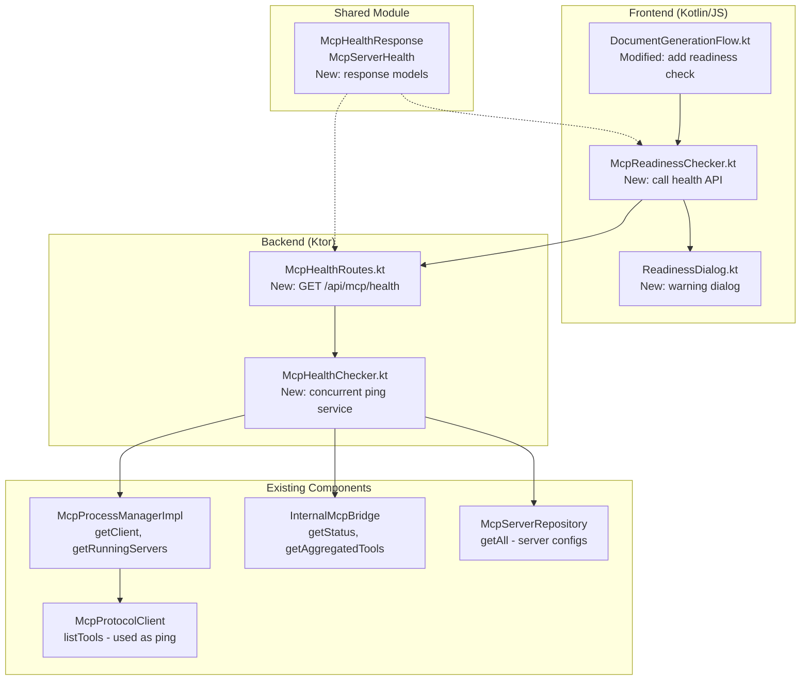
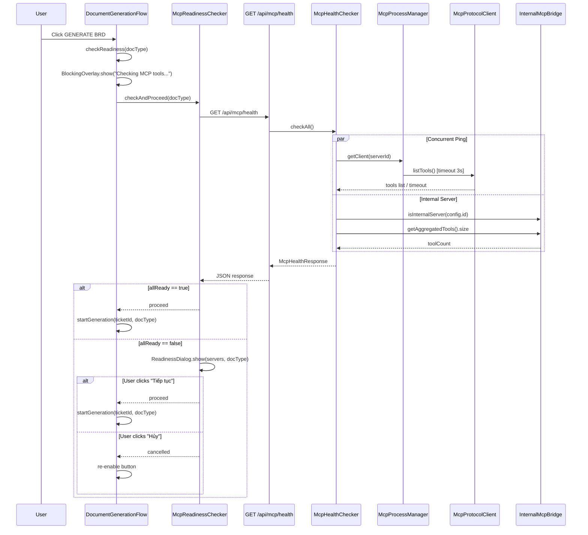

# MCP Readiness Check — Design

## Overview

Feature này thêm bước kiểm tra sẵn sàng (readiness check) cho tất cả MCP server trước khi bắt đầu sinh tài liệu BRD/FSD/Slides. Giải quyết vấn đề hiện tại: khi MCP server không sẵn sàng, tool call fail silently → AI sinh tài liệu rỗng/thiếu dữ liệu mà user không biết nguyên nhân.

### Thay đổi chính

1. **Backend**: Thêm `McpHealthChecker` service + `GET /api/mcp/health` endpoint — ping tất cả MCP server concurrently, trả về readiness status.
2. **Frontend**: Thêm `McpReadinessChecker` interceptor trong `DocumentGenerationFlow` — gọi health API trước khi sinh tài liệu, hiển thị `ReadinessDialog` nếu có server không sẵn sàng.
3. **Shared**: Thêm `McpHealthResponse` / `McpServerHealth` models trong shared module.

### Design Rationale

- **Tách McpHealthChecker thành service riêng** (không nhúng vào McpRoutes) vì logic ping concurrent + timeout phức tạp, cần unit test riêng.
- **Dùng `listTools()` làm ping** thay vì custom health endpoint vì MCP protocol không có health check method — `tools/list` là cách chuẩn nhất để xác nhận server phản hồi.
- **Concurrent ping với `withTimeout(3s)`** cho từng server — đảm bảo tổng thời gian ≤ 5s bất kể số lượng server.
- **Frontend intercept tại `DocumentGenerationFlow`** — điểm duy nhất trigger generation, không cần sửa `DocumentGenerationSection` button binding.

## Architecture

### Component Diagram



### Sequence Diagram — Readiness Check Flow



## Components and Interfaces

### Backend: McpHealthChecker Service

**File**: `server/src/jvmMain/kotlin/com/assistant/server/mcp/McpHealthChecker.kt`

```kotlin
class McpHealthChecker(
    private val processManager: McpProcessManager,
    private val internalMcpBridge: InternalMcpBridge,
    private val mcpRepo: McpServerRepository
)
```

**Key method**: `suspend fun checkAll(): McpHealthResponse`
- Lấy tất cả active server configs từ `mcpRepo.getAll()` (filter `disabled == false`, `type != "marker"`)
- Với mỗi server: kiểm tra `internalMcpBridge.isInternalServer(config.id)` — nếu internal thì gọi `buildInternalHealth()`, nếu external thì gọi `pingServer()`
- External server: `getClient(configId)` → `withTimeout(3000) { client.listTools() }`
- Internal server: luôn `ready: true`, `toolCount = internalMcpBridge.getAggregatedTools().size`
- Chạy tất cả ping concurrent bằng `coroutineScope { configs.map { async { ... } }.map { it.await() } }`

**Server role classification** (Req 5.1):
- `knowledge_base`: server name chứa "knowledge" hoặc "kb"
- `database`: server name chứa "database" hoặc "db"
- `markitdown`: server name chứa "markitdown"
- `jira_internal`: server ID == `InternalMcpBridge.INTERNAL_SERVER_ID`
- `other`: tất cả server còn lại

### Backend: McpHealthRoutes

**File**: `server/src/jvmMain/kotlin/com/assistant/server/routes/McpHealthRoutes.kt`

```kotlin
fun Routing.mcpHealthRoutes() {
    route("/api/mcp") {
        withPermission(Permission.ANALYZE_AI) {
            get("/health") { ... }
        }
    }
}
```

- Inject `McpHealthChecker` via Koin (`val checker by inject<McpHealthChecker>()`)
- Require `ANALYZE_AI` permission via `withPermission()` (same pattern as AnalysisRoutes, DocumentRoutes — `withPermission` handles both JWT authentication and RBAC permission check)
- Return `McpHealthResponse` as JSON
- Catch unexpected errors → HTTP 500 with `ErrorResponse`

### Frontend: McpReadinessChecker

**File**: `frontend/src/jsMain/kotlin/com/assistant/frontend/pages/ticket/McpReadinessChecker.kt`

```kotlin
internal object McpReadinessChecker {
    suspend fun check(): McpHealthResponse
    suspend fun checkAndProceed(docType: String): Boolean
}
```

- `check()`: gọi `GET /api/mcp/health` via `window.fetch` (consistent với TicketAnalysisFlow pattern)
- `checkAndProceed(docType)`: gọi `check()`, nếu `allReady` → return true, nếu không → show `ReadinessDialog`, return user choice

### Frontend: ReadinessDialog

**File**: `frontend/src/jsMain/kotlin/com/assistant/frontend/pages/ticket/ReadinessDialog.kt`

- Tạo modal dialog bằng `document.createElement()` + CSS classes (theo frontend-structure rules)
- Hiển thị danh sách server với icon ✅/⚠️
- Hiển thị error reason cho server không sẵn sàng
- Warning message cho critical servers theo doc type
- Buttons: "Tiếp tục" / "Hủy"
- Dismiss bằng click outside hoặc Escape key
- Return `Boolean` via `CompletableDeferred<Boolean>`

### Frontend: DocumentGenerationFlow Modification

**File**: `frontend/src/jsMain/kotlin/com/assistant/frontend/pages/ticket/DocumentGenerationFlow.kt`

Thay đổi `startGeneration()` và `startGenerateAll()`:
```
Before: click → POST generate → poll
After:  click → checkReadiness(docType) → [BlockingOverlay("Checking MCP tools...") → McpReadinessChecker.checkAndProceed(docType) → BlockingOverlay.remove()] → POST generate → poll
```

Readiness logic extracted vào private helper `checkReadiness(docType: String): Boolean`:
- Show `BlockingOverlay("Checking MCP tools...")`
- Call `McpReadinessChecker.checkAndProceed(docType)`
- If returns false (cancelled) → re-enable button, return false
- If throws → show error toast, re-enable button, return false
- `BlockingOverlay.remove()` always in `finally` block
- `startGeneration()` passes `documentType`, `startGenerateAll()` passes `"BRD"` (most critical)

## Data Models

### Shared Module: McpHealthResponse

**File**: `shared/src/commonMain/kotlin/com/assistant/mcp/models/McpHealthResponse.kt`

```kotlin
@Serializable
data class McpHealthResponse(
    val allReady: Boolean,
    val servers: List<McpServerHealth>
)

@Serializable
data class McpServerHealth(
    val configId: String,
    val serverName: String,
    val ready: Boolean,
    val toolCount: Int = 0,
    val error: String? = null,
    val role: String = "other"  // knowledge_base, database, markitdown, jira_internal, other
)
```

### Critical Server Mapping (Frontend)

```kotlin
val CRITICAL_SERVERS: Map<String, Set<String>> = mapOf(
    "BRD" to setOf("knowledge_base", "database"),
    "FSD" to setOf("knowledge_base", "database"),
    "REQUIREMENT_SLIDES" to setOf("knowledge_base")
)
```


## Correctness Properties

*A property is a characteristic or behavior that should hold true across all valid executions of a system — essentially, a formal statement about what the system should do. Properties serve as the bridge between human-readable specifications and machine-verifiable correctness guarantees.*

### Property 1: Health response completeness

*For any* set of active (non-disabled, non-marker) MCP server configs and their corresponding ping results, `McpHealthChecker.checkAll()` SHALL return a `McpHealthResponse` containing exactly one `McpServerHealth` entry per active server, with each entry having non-blank `configId`, non-blank `serverName`, valid `toolCount >= 0`, and `error` being non-null only when `ready == false`.

**Validates: Requirements 1.1, 1.2**

### Property 2: Ping result determines ready status

*For any* external MCP server, if `getClient(configId)` returns a non-null client AND `client.listTools()` succeeds within 3 seconds, the server SHALL be reported as `ready: true` with `toolCount` equal to the number of tools returned. Conversely, if `getClient()` returns null, OR `listTools()` throws an exception, OR `listTools()` exceeds the 3-second timeout, the server SHALL be reported as `ready: false` with a non-null descriptive `error` message.

**Validates: Requirements 1.3, 1.4, 4.3**

### Property 3: Internal server invariant

*For any* health check invocation where the application is running, the internal MCP server (ID = `jira-assistant-ui`) SHALL always appear in the response as `ready: true` with `role: "jira_internal"` and `toolCount` equal to the number of registered internal tools.

**Validates: Requirements 1.5**

### Property 4: allReady consistency

*For any* `McpHealthResponse`, the `allReady` field SHALL equal `servers.all { it.ready }`. That is, `allReady` is `true` if and only if every server in the `servers` list has `ready == true`.

**Validates: Requirements 1.6**

### Property 5: Server role classification correctness

*For any* MCP server config, the assigned `role` in `McpServerHealth` SHALL be determined by pattern matching on the server name/ID: servers with name containing "knowledge" or "kb" → `knowledge_base`, containing "database" or "db" → `database`, containing "markitdown" → `markitdown`, ID equal to `jira-assistant-ui` → `jira_internal`, all others → `other`. The classification SHALL be case-insensitive and deterministic.

**Validates: Requirements 5.1**

### Property 6: Critical server identification and warning

*For any* document type and list of `McpServerHealth` entries, the system SHALL correctly identify which unavailable servers are critical for that document type based on the `CRITICAL_SERVERS` mapping. When ALL critical servers for the requested document type have `ready == false`, the system SHALL produce a strong warning message containing the document type name.

**Validates: Requirements 5.2, 5.3**

### Property 7: Server health rendering correctness

*For any* list of `McpServerHealth` entries, the rendered dialog output SHALL display a green checkmark (✅) for servers with `ready == true` and a red warning (⚠️) for servers with `ready == false`. For every server with `ready == false` and a non-null `error`, the error reason SHALL be visible in the rendered output.

**Validates: Requirements 3.1, 3.2**

## Error Handling

### Backend Errors

| Scenario | Handling | HTTP Status |
|----------|----------|-------------|
| Individual server ping timeout (>3s) | Mark server as `ready: false`, error = "Connection timeout (3s)" | N/A (per-server) |
| Individual server ping exception | Mark server as `ready: false`, error = exception message | N/A (per-server) |
| `getClient()` returns null | Mark server as `ready: false`, error = "Server not running" | N/A (per-server) |
| Overall check timeout (>5s) | Return partial results, mark remaining servers as not ready | 200 |
| McpHealthChecker throws unexpected error | Log error, return HTTP 500 | 500 |
| Missing/invalid JWT | Return 401 Unauthorized | 401 |
| Insufficient permissions | Return 403 Forbidden | 403 |

### Frontend Errors

| Scenario | Handling |
|----------|----------|
| Health API returns 401/403 | Redirect to login (existing ApiClient behavior) |
| Health API returns 500 | Show error toast: "Không thể kiểm tra MCP tools — vui lòng thử lại", re-enable button |
| Health API network error/timeout | Show error toast: "Không thể kiểm tra MCP tools — vui lòng thử lại", re-enable button |
| Health API returns unexpected JSON | Show error toast, re-enable button |

## Testing Strategy

### Property-Based Tests (Kotest)

**Library**: Kotest property testing (`io.kotest.property`)
**Config**: `PropTestConfig(iterations = 100)` minimum per property
**File**: `server/src/jvmTest/kotlin/com/assistant/server/mcp/McpHealthCheckerPropertyTest.kt`

Each property test references its design property:
- **Feature: mcp-readiness-check, Property 1: Health response completeness** — Generate random server configs + mock ping results, verify response structure
- **Feature: mcp-readiness-check, Property 2: Ping result determines ready status** — Generate random client availability + ping outcomes, verify ready/error mapping
- **Feature: mcp-readiness-check, Property 3: Internal server invariant** — Generate random server sets always including internal, verify internal always ready
- **Feature: mcp-readiness-check, Property 4: allReady consistency** — Generate random McpServerHealth lists with varying ready states, verify allReady == all ready
- **Feature: mcp-readiness-check, Property 5: Server role classification** — Generate random server names with/without role keywords, verify classification
- **Feature: mcp-readiness-check, Property 6: Critical server identification** — Generate random doc types + server health lists, verify critical identification + warning

Property 7 (rendering) is frontend-specific and will be tested via example-based tests since Kotlin/JS DOM testing with PBT is impractical.

### Unit Tests (Example-Based)

**File**: `server/src/jvmTest/kotlin/com/assistant/server/mcp/McpHealthCheckerTest.kt`

- Health check with all servers ready → allReady: true
- Health check with one server down → allReady: false, correct error
- Health check with no external servers → only internal server in response
- Internal server always ready regardless of external server states
- HTTP 500 when checker throws unexpected error
- Role classification edge cases (mixed case names, empty names)

### Integration Tests

- Health endpoint requires JWT authentication
- Health endpoint requires ANALYZE_AI permission
- Concurrent ping completes within 5s with slow servers
- Frontend readiness check flow (manual): button click → overlay → dialog → proceed/cancel
