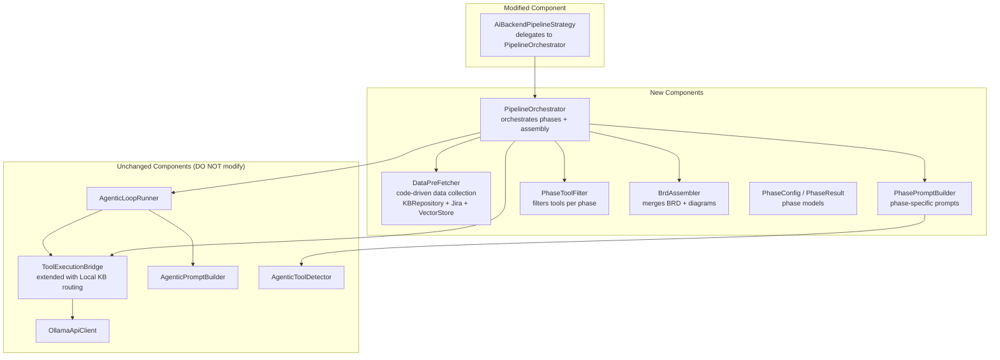
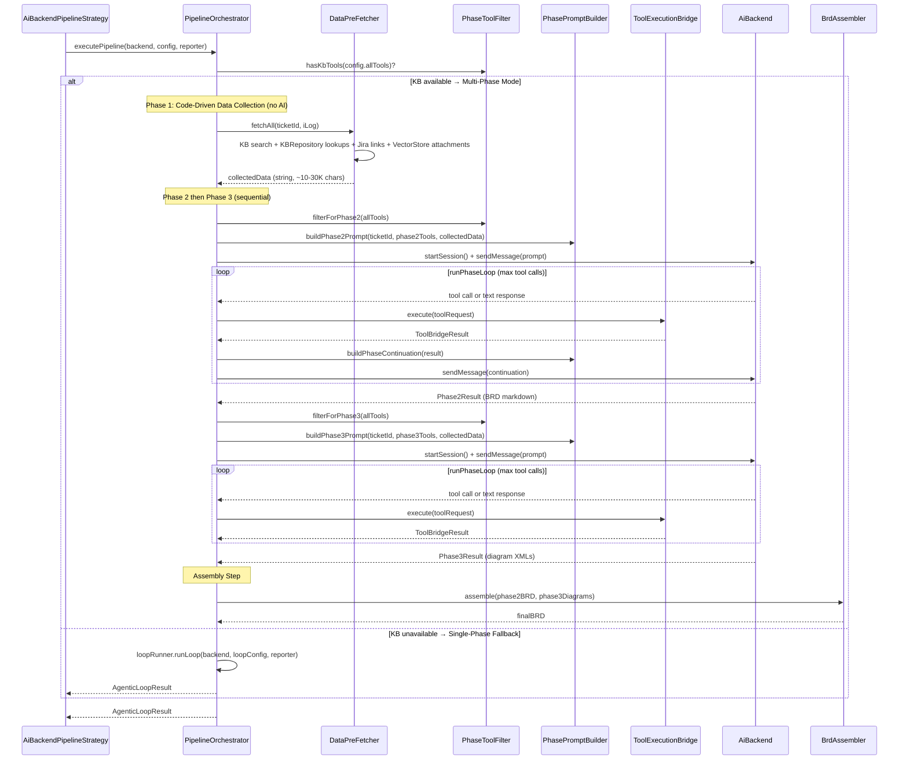

# Multi-Phase BRD Pipeline — Design

## Overview

Feature này tách single-phase BRD generation pipeline thành **multi-phase pipeline** với KB MCP server làm external memory. Thay vì một AI session duy nhất với prompt ~84K ký tự chứa 57 tool definitions + BRD template + diagram templates + data strategy, pipeline mới chia thành 3 AI phases + 1 assembly step, mỗi phase có prompt ~15-20K ký tự với chỉ tools và instructions cần thiết.

### Design Rationale

**Tại sao multi-phase?**
- **Lost in the middle**: Ollama model bỏ qua instructions cuối prompt khi prompt quá dài. Chia nhỏ prompt giải quyết trực tiếp vấn đề này.
- **Context accumulation**: Mỗi phase có conversation history riêng, không tích lũy context từ phases trước.
- **Focused AI sessions**: Phase 1 chỉ collect data, Phase 2 chỉ viết BRD, Phase 3 chỉ sinh diagrams → chất lượng cao hơn.

**Tại sao KB as shared memory?**
- KB MCP server đã tồn tại và hoạt động (kb_search, kb_read, kb_ingest, kb_context).
- Phase 1 ghi data vào KB, Phase 2+3 đọc từ KB → không cần shared in-memory state.
- Backward compatible: khi KB không available → fallback về single-phase hiện tại.

**Tại sao reuse AgenticLoopRunner?**
- `AgenticLoopRunner` đã có mechanism hoàn chỉnh: prompt → parse tool call → execute → continuation → lặp lại.
- Mỗi phase chỉ cần: prompt khác + tool set khác → cùng runner, khác config.
- Không cần modify runner — chỉ cần orchestration layer mới.

### Key Architecture Decisions

| Decision | Choice | Rationale |
|----------|--------|-----------|
| Orchestration pattern | New `PipelineOrchestrator` class | SRP: tách orchestration logic khỏi `AiBackendPipelineStrategy` |
| Phase execution | Mini agentic loop per phase via `ToolExecutionBridge` | `AgenticLoopRunner` has prompt builder baked-in; multi-phase needs different prompts per phase. Single-phase fallback still uses `AgenticLoopRunner.runLoop()` |
| Inter-phase communication | KB MCP server as external memory + Phase 1 output text as fallback | KB is primary; Phase 1 output injected into Phase 2/3 prompts as fallback when KB data is insufficient |
| Phase 2+3 execution | Sequential (not parallel) | OllamaApiClient has shared conversationHistory — parallel execution causes session conflicts. Sequential ensures clean sessions per phase |
| Fallback strategy | Single-phase when KB unavailable | Zero-risk backward compatibility |
| Tool filtering | `PhaseToolFilter` with pattern matching | Reuse approach from `AgenticToolDetector` |
| Prompt building | `PhasePromptBuilder` per phase | Reuse existing `appendXxx()` functions from prompt sections |
| Assembly | Pure Kotlin `BrdAssembler`, no AI | Deterministic merge, no AI variability |
| Tool descriptor collection | `collectToolDescriptors()` in `AiBackendPipelineStrategy` | Collects only external MCP tools + Local KB tool descriptors. Internal MCP tools (Jira Assistant UI) are excluded from pipeline — they control the app UI, not data sources for BRD generation |

## Architecture

### Component Diagram



### Pipeline Execution Flow



### File Organization

Tất cả new files trong package `com.assistant.server.agent.ba.subprocess.pipeline.aibackend`:

| File | Lines (actual) | Responsibility |
|------|-------------|----------------|
| `PipelineOrchestrator.kt` (new) | 200 | Orchestrate phases, manage state, sequential execution, fallback, mini agentic loop per phase, interaction logging. Receives `KBRepository`, `LocalKBToolExecutor`, `JiraContentExtractor`, `VectorStore` as optional constructor deps for `DataPreFetcher`. Uses `aggregateResults2()` for Phase 2+3 only (Phase 1 is code-driven) |
| `PipelineInteractionLogger.kt` (new) | 62 | SLF4J-based turn-by-turn logging of BA Agent ↔ AI interaction via logger `"PipelineInteraction"` → `data/logs/pipeline-interaction.log`. Includes `logAttachmentDetails()` for per-file attachment logging (filename + chunk count) |
| `DataPreFetcher.kt` (new) | 160 | Code-driven 6-step data collection (no AI): (1) KB semantic search via `LocalKBToolExecutor`, (2) main ticket from `KBRepository.findByTicketId()`, (3) parse linked IDs from KB deps + Jira raw links via `JiraContentExtractor.extract()`, (4) fetch each linked ticket from KB (MAX_LINKED=500), (5) search relationships, (6) fetch attachments from main ticket + up to 10 linked tickets via `searchAttachmentsMulti()`, with version deduplication. Delegates attachment helpers to `AttachmentVersionDedup.kt` |
| `AttachmentVersionDedup.kt` (new) | 90 | Attachment collection helpers: `collectChunksFromTickets()` (multi-ticket VectorStore fetch), `deduplicateVersions()` (group by base name, keep latest version via regex `v\d+.\d+`), `formatAttachmentResult()` (format for AI prompt with source ticket ID), `extractBaseName()`, `extractVersion()` |
| `AgenticDiagramSections.kt` (existing) | — | Phase 3 diagram instructions. Now injects draw.io skill content from `/draw.io/SKILL.md` + `/draw.io/xml-reference.md` via `DrawioSkillLoader` before MCP tool or inline template instructions |
| `DrawioSkillLoader.kt` (new) | 55 | Provides hardcoded condensed draw.io XML rules for Phase 3 prompts: basic structure, rigid grid positioning, edge rules (mxGeometry child required, no duplicate attrs), XML well-formedness (escape &, unique IDs, no comments). Intentionally minimal — complex patterns (swimlanes, containers) omitted to avoid confusing smaller AI models |
| `PhasePromptBuilder.kt` (new) | 134 | Phase-specific prompt builders reusing existing `appendXxx()` functions |
| `PhasePromptSections.kt` (new) | 100 | Extracted phase-specific prompt sections (KB memory protocol, data retrieval, task instructions, Phase 1 data context) |
| `PhaseToolFilter.kt` (new) | 81 | Filter tools per phase using pattern matching |
| `BrdAssembler.kt` (new) | 130 | Parse diagram blocks (fenced ```xml or raw `<mxGraphModel>`), normalize labels (`Process Flow` → `PROCESS_FLOW`). 3-branch assembly: (1) placeholder replacement when BRD has placeholders, (2) section-based injection via `SECTION_TARGETS` when BRD has no placeholders, (3) raw append before Appendix when no diagram blocks parsed |
| `models/PipelineModels.kt` (new) | 57 | PhaseId, PhaseConfig, PhaseResult, PipelineConfig |

**Modified file**:
| File | Change |
|------|--------|
| `AiBackendPipelineStrategy.kt` | Replace direct `AgenticLoopRunner.runLoop()` call with `PipelineOrchestrator.executePipeline()` |

## Components and Interfaces

### 1. PipelineOrchestrator — Phase Orchestration

```kotlin
// PipelineOrchestrator.kt (~200 lines)
package com.assistant.server.agent.ba.subprocess.pipeline.aibackend

/**
 * Orchestrates multi-phase BRD generation pipeline.
 * Detects KB availability → multi-phase (code-driven data collection + 2 AI phases + assembly)
 * or single-phase fallback when KB unavailable.
 *
 * Reuses: AgenticLoopRunner, ToolExecutionBridge, OllamaApiClient.
 * Does NOT modify any existing components.
 */
class PipelineOrchestrator(
    private val loopRunner: AgenticLoopRunner,
    private val promptBuilder: AgenticPromptBuilder,  // for single-phase fallback
    private val phasePromptBuilder: PhasePromptBuilder,
    private val phaseToolFilter: PhaseToolFilter,
    private val assembler: BrdAssembler,
    private val toolBridge: ToolExecutionBridge,  // for multi-phase direct tool execution
    // DataPreFetcher dependencies (code-driven Phase 1)
    private val kbRepository: KBRepository? = null,
    private val localKBToolExecutor: LocalKBToolExecutor? = null,
    private val jiraContentExtractor: JiraContentExtractor? = null,
    private val vectorStore: VectorStore? = null
) {
    suspend fun executePipeline(
        backend: AiBackend,
        config: PipelineConfig,
        progressReporter: ProgressReporter
    ): AgenticLoopResult
}
```

**Orchestration logic**:

```kotlin
suspend fun executePipeline(...): AgenticLoopResult {
    val hasKb = phaseToolFilter.hasKbTools(config.allTools)

    return if (hasKb) {
        executeMultiPhase(backend, config, progressReporter)
    } else {
        executeSinglePhase(backend, config, progressReporter)
    }
}
```

**Multi-phase execution**:
1. Run Phase 1 (code-driven data collection via `DataPreFetcher`) → get collected data string (~10-30K chars)
2. Phase 1 is NOT an AI phase — it uses `KBRepository`, `LocalKBToolExecutor`, `JiraContentExtractor`, and `VectorStore` directly
3. Run Phase 2 then Phase 3 sequentially (parallel disabled — OllamaApiClient shared session conflict)
4. If Phase 2 fails → retry once. Phase 3 gets 0 retries (graceful degradation)
5. Run Assembly step with Phase 2 output + Phase 3 output
6. Aggregate Phase 2 + Phase 3 results into single `AgenticLoopResult` via `aggregateResults2()` (Phase 1 has no tool call log since it's code-driven)

**Multi-phase data collection**: Phase 1 (DATA_COLLECTION) is code-driven via `DataPreFetcher` — no AI needed. `DataPreFetcher` performs a 6-step collection: (1) KB semantic search via `LocalKBToolExecutor.execute("search_knowledge")`, (2) main ticket from `KBRepository.findByTicketId()`, (3) parse linked IDs from KB deps + Jira raw links via `JiraContentExtractor.extract()`, (4) fetch each linked ticket from KB (up to MAX_LINKED=500), (5) search relationships via `LocalKBToolExecutor.execute("search_relationships")`, (6) fetch attachments from main ticket + up to 10 linked tickets via `searchAttachmentsMulti()`, with version deduplication (files with same base name but different versions like `v1.7`, `v2.3` → only latest kept). Data is collected in ~1-7 seconds (vs 60-70s with AI-driven approach). The collected data (typically 10-30K chars) is injected into Phase 2/3 prompts as context.

**Multi-phase AI execution**: Phase 2 (BRD_WRITING) and Phase 3 (DIAGRAM_GENERATION) run their own mini agentic loops via `runPhaseLoop()` using `ToolExecutionBridge` directly. Each phase receives the pre-fetched data in its prompt and can call additional KB/diagram tools as needed. Phases run **sequentially** (not parallel) due to `OllamaApiClient` shared `conversationHistory` — parallel execution causes session conflicts.

**Single-phase fallback**: Delegates to existing `AgenticLoopRunner.runLoop()` with existing `AgenticPromptBuilder` — behavior identical to current pipeline. Creates `AgenticLoopConfig` with combined tool calls and timeouts from all phases.

**Progress reporting**:
- Phase 1 (DataPreFetcher): 5% → 30%
- Phase 2: 30% → 70%
- Phase 3: runs after Phase 2 (sequential)
- Assembly: 70% → 100%

**Result aggregation**:

The pipeline uses `aggregateResults2()` which only aggregates Phase 2 + Phase 3 results (Phase 1 is code-driven and has no AI tool call log):

```kotlin
private fun aggregateResults2(
    phase2: PhaseResult,
    phase3: PhaseResult?,
    assembledDoc: String,
    totalDurationMs: Long
): AgenticLoopResult {
    val allToolLogs = phase2.toolCallLog +
        (phase3?.toolCallLog ?: emptyList())
    return AgenticLoopResult(
        document = assembledDoc,
        toolCallLog = allToolLogs,
        toolCallsExecuted = allToolLogs.size,
        toolCallsFailed = allToolLogs.count { !it.success },
        timedOut = false,
        totalDurationMs = totalDurationMs
    )
}
```

Note: The original `aggregateResults()` (p1+p2+p3) still exists in code but is unused since Phase 1 became code-driven.

### 2. PhasePromptBuilder — Phase-Specific Prompts

```kotlin
// PhasePromptBuilder.kt (~180 lines)
package com.assistant.server.agent.ba.subprocess.pipeline.aibackend

/**
 * Builds phase-specific prompts by composing existing appendXxx() functions.
 * Each phase gets only the instructions and tool definitions it needs.
 *
 * Reuses: appendSystemInstructions(), appendToolDefinitions(),
 * appendToolProtocol(), appendBrdSections(), appendDiagramInstructions(),
 * appendDataCollectionStrategy() from existing prompt section files.
 */
class PhasePromptBuilder {

    fun buildPhase1Prompt(
        ticketId: String, tools: List<ToolDescriptor>
    ): String

    fun buildPhase2Prompt(
        ticketId: String, docType: String,
        tools: List<ToolDescriptor>
    ): String

    fun buildPhase3Prompt(
        ticketId: String, tools: List<ToolDescriptor>
    ): String

    fun buildPhaseContinuation(
        latestToolResult: String
    ): String
}
```

**Phase 1 prompt structure** (~15-20K chars):
```
# SYSTEM INSTRUCTIONS (data collection focus)
## AVAILABLE TOOLS (Jira + KB + doc convert only)
## TOOL PROTOCOL
## DATA COLLECTION STRATEGY (recursive exploration + KB cache)
## KB MEMORY PROTOCOL (title format, tags)
## TASK: Collect data for ticket {ticketId}
```

**Phase 2 prompt structure** (~15-20K chars):
```
# SYSTEM INSTRUCTIONS (BRD writing focus)
## AVAILABLE TOOLS (KB read-only tools)
## TOOL PROTOCOL
## BRD STRUCTURE (7 sections from BrdPromptBuilder.BRD_SECTIONS)
## KB DATA RETRIEVAL (search by "BRD:{ticketId}")
## DIAGRAM PLACEHOLDERS (where to insert markers)
## TASK: Write BRD for ticket {ticketId} using KB data
```

**Phase 3 prompt structure** (~15-20K chars):
```
# SYSTEM INSTRUCTIONS (diagram generation focus)
## AVAILABLE TOOLS (KB read + diagram tools)
## TOOL PROTOCOL
## DRAW.IO XML RULES (condensed: structure, grid, edge rules, well-formedness)
## DIAGRAM INSTRUCTIONS (MCP tool or inline templates)
## KB DATA RETRIEVAL (search by "BRD:{ticketId}")
## TASK: Generate diagrams for ticket {ticketId}
```

**Prompt size logging**: Each builder measures output length and logs warning if exceeding soft limit (Phase 1: 20K, Phase 2: 20K, Phase 3: 15K).

### 3. PhaseToolFilter — Tool Filtering per Phase

```kotlin
// PhaseToolFilter.kt (~100 lines)
package com.assistant.server.agent.ba.subprocess.pipeline.aibackend

/**
 * Filters ToolDescriptor lists for each pipeline phase.
 * Uses case-insensitive pattern matching on tool names.
 * Deterministic: same input always produces same output.
 *
 * Reuses pattern matching approach from AgenticToolDetector.
 */
class PhaseToolFilter {

    fun hasKbTools(tools: List<ToolDescriptor>): Boolean

    fun filterForPhase1(tools: List<ToolDescriptor>): List<ToolDescriptor>

    fun filterForPhase2(tools: List<ToolDescriptor>): List<ToolDescriptor>

    fun filterForPhase3(tools: List<ToolDescriptor>): List<ToolDescriptor>

    companion object {
        // Phase 1: Jira + KB + doc convert
        internal val PHASE1_PATTERNS = listOf(
            "get_issue", "search", "jira",
            "analyze_ticket", "get_ticket_analysis",
            "kb_search", "kb_read", "kb_context",
            "kb_ingest", "kb_write",
            "convert_to_markdown", "markitdown"
        )
        // Phase 2: KB read-only
        internal val PHASE2_PATTERNS = listOf(
            "kb_search", "kb_search_smart",
            "kb_read", "kb_context"
        )
        // Phase 3: KB read + diagram
        internal val PHASE3_PATTERNS = listOf(
            "kb_search", "kb_read", "kb_context",
            "drawio", "draw.io", "diagram"
        )
        // Always excluded
        internal val EXCLUDED_PATTERNS = listOf(
            "playwright", "browser"
        )
    }
}
```

**Filter algorithm**:
1. Sort tools by name (deterministic)
2. Exclude tools matching `EXCLUDED_PATTERNS`
3. Include tools matching any pattern in phase-specific pattern list
4. Return filtered list

### 4. BrdAssembler — Merge BRD + Diagrams

```kotlin
// BrdAssembler.kt (~130 lines)
package com.assistant.server.agent.ba.subprocess.pipeline.aibackend

class BrdAssembler {

    fun assemble(brdMarkdown: String, diagramOutput: String?): String

    internal fun injectDiagramsBySection(
        brdMarkdown: String, diagrams: Map<String, String>
    ): String

    internal fun parseDiagramBlocks(
        diagramOutput: String
    ): Map<String, String>

    internal fun replacePlaceholders(
        brdMarkdown: String, diagrams: Map<String, String>
    ): String

    companion object {
        val DIAGRAM_LABELS = listOf(
            "PROCESS_FLOW", "ACTIVITY",
            "DATA_MODEL", "DEPLOYMENT"
        )
        const val PLACEHOLDER_PREFIX = "<!-- DIAGRAM:"
        const val PLACEHOLDER_SUFFIX = " -->"
        const val FALLBACK_TEXT = "[Diagram không khả dụng]"

        internal val SECTION_TARGETS = mapOf(
            "PROCESS_FLOW" to "Existing Processes",
            "ACTIVITY" to "Project Requirements",
            "DATA_MODEL" to "Data Requirements",
            "DEPLOYMENT" to "Appendix"
        )
    }
}
```

**Assembly algorithm** (3-branch):
1. If `diagramOutput` is null/blank → return BRD as-is (graceful degradation)
2. Parse Phase 3 output into `Map<label, xml>` via `parseDiagramBlocks()`
3. If no diagram blocks parsed → `appendRawDiagrams()`: insert raw output before Appendix section
4. If diagram blocks parsed AND BRD **has placeholders** → `replacePlaceholders()`: replace each `<!-- DIAGRAM:LABEL -->` with XML, unmatched placeholders get `FALLBACK_TEXT`
5. If diagram blocks parsed AND BRD **has NO placeholders** → `injectDiagramsBySection()`: find each diagram's target section heading in BRD, insert XML before the next `## ` heading. Uses `SECTION_TARGETS` map to match labels to section names

### 5. AiBackendPipelineStrategy — Integration Point (Modified)

The existing `AiBackendPipelineStrategy.doExecute()` currently creates `AgenticLoopRunner` + `AgenticPromptBuilder` and calls `runner.runLoop()` directly. The modification replaces this with `PipelineOrchestrator.executePipeline()`:

```kotlin
// Before (current):
val runner = AgenticLoopRunner(bridge, promptBuilder)
val loopConfig = buildLoopConfig(config)
val loopResult = runner.runLoop(backend, loopConfig, reporter)

// After (modified):
val runner = AgenticLoopRunner(bridge, promptBuilder)
val orchestrator = PipelineOrchestrator(
    runner, promptBuilder, PhasePromptBuilder(),
    PhaseToolFilter(), BrdAssembler(), bridge
)
val allToolDescriptors = collectToolDescriptors()
// collectToolDescriptors() now includes Local KB tools when enabled
// (settingsRepository + localKBToolExecutor injected via constructor)
val pipelineConfig = PipelineConfig(
    ticketId = config.rootTicketId,
    docType = config.docType,
    allTools = allToolDescriptors
)
val loopResult = orchestrator.executePipeline(
    configuredBackend, pipelineConfig, reporter
)
```

`collectToolDescriptors()` is a private method in `AiBackendPipelineStrategy` that replicates the tool collection logic from `AgenticPromptBuilder.getAllToolDescriptors()` (internal MCP tools + external MCP tools → `ToolDescriptor` list, with `SubprocessProxy` fallback). When Local KB is enabled (via `ChatLocalKBContext.isEnabled(settingsRepository)`) and `localKBToolExecutor` is available, it also appends 3 Local KB tool descriptors from `LocalKBToolDescriptorProvider.getDescriptors()` with KB-compatible names (containing `kb_search`, `kb_get_ticket_info`, `kb_search_relationships`). See bugfix spec `brd-pipeline-local-kb-integration` for details.

The previous `buildLoopConfig()` method was removed as it is no longer called — `PipelineOrchestrator` builds its own `AgenticLoopConfig` internally for single-phase fallback.

The rest of `AiBackendPipelineStrategy` (status determination, result building, logging) remains unchanged because `PipelineOrchestrator` returns the same `AgenticLoopResult` type.

## Data Models

### New Models

```kotlin
// models/PipelineModels.kt (~80 lines)
package com.assistant.server.agent.ba.subprocess.pipeline.aibackend.models

/**
 * Identifies a pipeline phase.
 */
enum class PhaseId {
    DATA_COLLECTION,  // Phase 1
    BRD_WRITING,      // Phase 2
    DIAGRAM_GENERATION // Phase 3
}

/**
 * Configuration for a single pipeline phase.
 * Extends AgenticLoopConfig concept with phase-specific settings.
 */
data class PhaseConfig(
    val phaseId: PhaseId,
    val ticketId: String,
    val docType: String,
    val maxToolCalls: Int,
    val timeoutSeconds: Int
)

/**
 * Result of a single pipeline phase execution.
 * Compatible with AgenticLoopResult for aggregation.
 */
data class PhaseResult(
    val phaseId: PhaseId,
    val output: String,
    val toolCallLog: List<ToolCallLogEntry>,
    val toolCallsExecuted: Int,
    val toolCallsFailed: Int,
    val durationMs: Long,
    val success: Boolean,
    val timedOut: Boolean
)

/**
 * Top-level pipeline configuration.
 */
data class PipelineConfig(
    val ticketId: String,
    val docType: String,
    val allTools: List<ToolDescriptor>,
    val phase1MaxToolCalls: Int = 25,
    val phase1TimeoutSeconds: Int = 180,
    val phase2MaxToolCalls: Int = 15,
    val phase2TimeoutSeconds: Int = 120,
    val phase3MaxToolCalls: Int = 10,
    val phase3TimeoutSeconds: Int = 90,
    val enableParallelPhases: Boolean = true,
    val maxRetries: Int = 1
)
```

### Existing Models (unchanged)

| Model | Location | Usage |
|-------|----------|-------|
| `AgenticLoopConfig` | `models/AgenticLoopModels.kt` | Config for each `AgenticLoopRunner.runLoop()` call |
| `AgenticLoopResult` | `models/AgenticLoopModels.kt` | Final output of pipeline (reused as-is) |
| `ToolBridgeResult` | `models/AgenticLoopModels.kt` | Tool execution result (unchanged) |
| `ToolRequest` | `models/AiBackendModels.kt` | Parsed tool call (unchanged) |
| `DetectedTools` | `AgenticToolDetector.kt` | Tool category detection result (unchanged) |
| `ToolDescriptor` | shared module | Tool name + description (unchanged) |
| `ToolCallLogEntry` | shared module | Tool call log entry (unchanged) |

### Data Collection Protocol — DataPreFetcher Output Format

Phase 1 is code-driven via `DataPreFetcher` — no AI, no KB writes. Data is collected directly and output as structured text:

| Section | Format | Source |
|---------|--------|--------|
| KB Search | `=== KB SEARCH ===\n{results}` | `LocalKBToolExecutor.execute("search_knowledge")` |
| Main Ticket | `=== MAIN TICKET: {ticketId} ===\n{formatted record}` | `KBRepository.findByTicketId()` |
| Linked Tickets | `=== LINKED: {linkedId} ===\n{formatted record}` (per ticket) | `KBRepository.findByTicketId()` for each linked ID |
| Relationships | `=== RELATIONSHIPS ===\n{results}` | `LocalKBToolExecutor.execute("search_relationships")` |
| Attachments | `=== ATTACHMENTS ===\n--- FILE: {filename} (source: {ticketId}, {N} chunks) ---\n{chunk texts}` | `VectorStore.findByTicketId()` for main + up to 10 linked tickets, filtered by ATTACHMENT/CONFLUENCE, version-deduplicated (latest only) |

Phase 2 and Phase 3 receive the full DataPreFetcher output text directly in their prompts as data context.

### Diagram Placeholder Protocol

Phase 2 inserts placeholders in BRD markdown:
```markdown
<!-- DIAGRAM:PROCESS_FLOW -->
<!-- DIAGRAM:ACTIVITY -->
<!-- DIAGRAM:DATA_MODEL -->
<!-- DIAGRAM:DEPLOYMENT -->
```

Phase 3 outputs labeled diagram blocks:
```markdown
<!-- DIAGRAM:PROCESS_FLOW -->
```xml
<mxGraphModel>...</mxGraphModel>
```
```

Assembly step matches labels and replaces placeholders with XML blocks.

### Phase Default Configurations

| Phase | Max Tool Calls | Timeout (s) | Prompt Size Limit |
|-------|---------------|-------------|-------------------|
| Phase 1 (Data Collection) | 25 | 180 | 20,000 chars |
| Phase 2 (BRD Writing) | 15 | 120 | 20,000 chars |
| Phase 3 (Diagram Generation) | 10 | 90 | 15,000 chars |
| Assembly | N/A | 5 | N/A |


## Correctness Properties

*A property is a characteristic or behavior that should hold true across all valid executions of a system — essentially, a formal statement about what the system should do. Properties serve as the bridge between human-readable specifications and machine-verifiable correctness guarantees.*

### Property 1: KB detection determines pipeline mode

*For any* list of ToolDescriptors, `PhaseToolFilter.hasKbTools(tools)` SHALL return `true` if and only if at least one tool name contains "kb_search", "kb_ingest", or "kb_write" (case-insensitive). When `hasKbTools` returns `true`, `PipelineOrchestrator` SHALL execute multi-phase mode. When `false`, it SHALL execute single-phase fallback mode.

**Validates: Requirements 1.1, 8.1**

### Property 2: Result aggregation preserves totals

*For any* list of PhaseResults with varying tool call counts and durations, the aggregated `AgenticLoopResult` SHALL have: `toolCallsExecuted` equal to the sum of all phases' `toolCallsExecuted`, `toolCallsFailed` equal to the sum of all phases' `toolCallsFailed`, and `toolCallLog` equal to the concatenation of all phases' `toolCallLog` lists in phase order.

**Validates: Requirements 1.5**

### Property 3: Phase prompt content isolation

*For any* valid ticketId and tool list containing both Jira and KB tools:
- Phase 1 prompt SHALL contain "DATA COLLECTION" and SHALL NOT contain "BRD STRUCTURE" or "DIAGRAM"
- Phase 2 prompt SHALL contain "BRD STRUCTURE" and `"BRD:{ticketId}"` search instruction, and SHALL NOT contain "DATA COLLECTION" or "DIAGRAM"
- Phase 3 prompt SHALL contain "DIAGRAM" and `"BRD:{ticketId}"` search instruction, and SHALL NOT contain "BRD STRUCTURE" or "DATA COLLECTION"

Each phase's prompt contains only the instructions relevant to its task.

**Validates: Requirements 2.1, 3.1, 4.1, 6.1, 6.2, 6.3, 10.3**

### Property 4: Phase tool filter correctness

*For any* list of ToolDescriptors containing a mix of Jira, KB, diagram, browser, and unrelated tools:
- `filterForPhase1(tools)` SHALL return only tools whose names match Jira, KB, or doc-convert patterns
- `filterForPhase2(tools)` SHALL return only tools whose names match KB read patterns (kb_search, kb_search_smart, kb_read, kb_context)
- `filterForPhase3(tools)` SHALL return only tools whose names match KB read or diagram patterns
- For all phases, every tool in the output SHALL match at least one pattern in that phase's pattern list

**Validates: Requirements 2.2, 3.2, 4.2, 7.1, 7.2, 7.3, 7.4**

### Property 5: Tool filter determinism

*For any* list of ToolDescriptors and any phase filter function, calling the filter on the original list and on any permutation of that list SHALL produce the same result (same tools in same order). Formally: `filterForPhaseN(tools).map { it.name } == filterForPhaseN(tools.shuffled()).map { it.name }` for all permutations.

**Validates: Requirements 7.6**

### Property 6: Excluded tools never pass any phase filter

*For any* ToolDescriptor whose name contains "playwright" or "browser" (case-insensitive), that tool SHALL NOT appear in the output of `filterForPhase1`, `filterForPhase2`, or `filterForPhase3`, regardless of what other patterns the tool name might match.

**Validates: Requirements 7.5**

### Property 7: Assembly diagram block parsing

*For any* string containing N labeled diagram blocks (format: `<!-- DIAGRAM:LABEL -->` followed by a `` ```xml `` code block), `parseDiagramBlocks()` SHALL return a Map with exactly N entries, where each key is the label string and each value is the XML content between the code fences.

**Validates: Requirements 5.2**

### Property 8: Assembly placeholder replacement round-trip

*For any* BRD markdown containing M placeholder markers (`<!-- DIAGRAM:LABEL -->`) and a diagram map with K entries (where K ≤ M), `replacePlaceholders()` SHALL: (a) replace each placeholder that has a matching diagram with the corresponding XML content, (b) replace each placeholder without a matching diagram with the fallback text `"[Diagram không khả dụng]"`, and (c) the output SHALL contain zero remaining placeholder markers of the form `<!-- DIAGRAM:* -->`.

**Validates: Requirements 5.3, 5.5**

## Error Handling

### Phase Execution Errors

| Scenario | Handling |
|----------|----------|
| Phase 1 (DataPreFetcher) partial failure | Individual steps are wrapped in try-catch — if one step fails (e.g., VectorStore exception), it's skipped and remaining steps continue. DataPreFetcher never fails entirely |
| Phase 2 fails (timeout/error) | Retry once with same PhaseConfig but new AI session. If retry fails → pipeline returns failed result |
| Phase 3 fails | No retry needed — Assembly returns BRD without diagrams (graceful degradation) |
| Phase 2+3 both fail | Pipeline returns failed result (BRD content is required) |

### KB Memory Errors

| Scenario | Handling |
|----------|----------|
| KBRepository returns null for main ticket | DataPreFetcher logs warning, continues with other data sources |
| LocalKBToolExecutor unavailable (null) | KB search and relationship steps are skipped entirely |
| VectorStore unavailable (null) | Attachment collection step is skipped |
| JiraContentExtractor fails | Jira raw links step is skipped, only KB-derived linked IDs are used |

### Assembly Errors

| Scenario | Handling |
|----------|----------|
| Phase 3 output is null/blank | `assemble()` returns BRD from Phase 2 as-is (no diagrams) |
| Phase 3 output has no parseable diagram blocks | `parseDiagramBlocks()` returns empty map → `appendRawDiagrams()` inserts raw output before Appendix section |
| Phase 3 output has malformed XML | Assembly doesn't validate XML — passes through as-is. BrdResponseParser handles downstream |
| BRD has placeholders + diagrams parsed | `replacePlaceholders()` replaces each placeholder with matching XML; unmatched placeholders get `FALLBACK_TEXT` |
| BRD has NO placeholders + diagrams parsed | `injectDiagramsBySection()` finds target section headings via `SECTION_TARGETS` map and inserts XML before the next `## ` heading. If a target section is not found in BRD, that diagram is skipped |

### Backward Compatibility Errors

| Scenario | Handling |
|----------|----------|
| No KB tools in tool list | `hasKbTools()` returns false → single-phase fallback, identical to current behavior |
| PipelineOrchestrator creation fails | `AiBackendPipelineStrategy` catches exception → returns failed BATaskResult |
| AgenticLoopResult from pipeline incompatible | Not possible — pipeline returns same type. `determineStatus()` works unchanged |

### Tool Filter Errors

| Scenario | Handling |
|----------|----------|
| Empty tool list | All phase filters return empty list. Phase runs with no tools → AI produces direct output |
| Tool with empty name | Pattern matching on empty string → no match → tool excluded. Harmless |
| All tools excluded by filter | Phase runs with empty tool list → prompt has no tool definitions → AI generates without tools |

## Testing Strategy

### Property-Based Tests (Kotest + Arbs)

The project uses Kotlin with Kotest for testing. Property-based tests will use **Kotest property testing** (`io.kotest.property`) with **100 iterations** per property.

**Test file**: `server/src/jvmTest/kotlin/com/assistant/server/agent/ba/subprocess/pipeline/aibackend/MultiPhasePipelinePropertyTest.kt`

Each property test references its design document property:

```kotlin
// Feature: multi-phase-brd-pipeline, Property 1: KB detection determines pipeline mode
// Feature: multi-phase-brd-pipeline, Property 2: Result aggregation preserves totals
// Feature: multi-phase-brd-pipeline, Property 3: Phase prompt content isolation
// Feature: multi-phase-brd-pipeline, Property 4: Phase tool filter correctness
// Feature: multi-phase-brd-pipeline, Property 5: Tool filter determinism
// Feature: multi-phase-brd-pipeline, Property 6: Excluded tools never pass any phase filter
// Feature: multi-phase-brd-pipeline, Property 7: Assembly diagram block parsing
// Feature: multi-phase-brd-pipeline, Property 8: Assembly placeholder replacement round-trip
```

**Generators needed**:
- `toolDescriptorArb`: Generates `ToolDescriptor` with realistic names (mix of KB, Jira, diagram, browser, and random tools)
- `toolListArb`: `Arb.list(toolDescriptorArb, 1..30)` for random tool lists
- `ticketIdArb`: `Arb.string()` with format `"PROJ-{1..9999}"`
- `phaseResultArb`: Generates `PhaseResult` with random tool call counts, durations, success/failure
- `diagramBlockArb`: Generates labeled diagram blocks with random XML content
- `brdWithPlaceholdersArb`: Generates BRD markdown with random placeholder positions

**Properties to implement as PBT** (8 properties):
1. KB detection determines pipeline mode
2. Result aggregation preserves totals
3. Phase prompt content isolation
4. Phase tool filter correctness
5. Tool filter determinism
6. Excluded tools never pass any phase filter
7. Assembly diagram block parsing
8. Assembly placeholder replacement round-trip

### Unit Tests (Example-Based)

**Test file**: `server/src/jvmTest/kotlin/com/assistant/server/agent/ba/subprocess/pipeline/aibackend/MultiPhasePipelineUnitTest.kt`

| Test | What it verifies | Validates |
|------|-----------------|-----------|
| `PipelineConfig default phase1MaxToolCalls is 25` | Phase 1 default config | Req 2.6 |
| `PipelineConfig default phase1TimeoutSeconds is 180` | Phase 1 default timeout | Req 2.6 |
| `PipelineConfig default phase2MaxToolCalls is 15` | Phase 2 default config | Req 3.6 |
| `PipelineConfig default phase2TimeoutSeconds is 120` | Phase 2 default timeout | Req 3.6 |
| `PipelineConfig default phase3MaxToolCalls is 10` | Phase 3 default config | Req 4.5 |
| `PipelineConfig default phase3TimeoutSeconds is 90` | Phase 3 default timeout | Req 4.5 |
| `Phase 1 prompt contains KB memory protocol title format` | KB title format in prompt | Req 10.1, 10.2 |
| `Phase 1 prompt contains KB tags instruction` | KB tags in prompt | Req 10.4 |
| `Phase 2 prompt contains diagram placeholder markers` | Placeholder markers present | Req 3.5 |
| `Assembly with null diagram output returns BRD as-is` | Graceful degradation | Req 5.5 |
| `Assembly with empty diagram output returns BRD as-is` | Graceful degradation | Req 5.5 |
| `Phase retry executes at most once` | Retry limit | Req 1.4 |
| `DIAGRAM_LABELS contains all 4 types` | All diagram types defined | Req 5.2 |

### Integration Tests

**Test file**: `server/src/jvmTest/kotlin/com/assistant/server/agent/ba/subprocess/pipeline/aibackend/MultiPhasePipelineIntegrationTest.kt`

| Test | What it verifies | Validates |
|------|-----------------|-----------|
| `Multi-phase pipeline with mock backend produces valid BRD` | End-to-end multi-phase flow | Req 1.2, 1.3 |
| `Single-phase fallback produces same result as current pipeline` | Backward compatibility | Req 8.1, 8.3 |
| `Phase 2 and Phase 3 run sequentially` | Sequential execution (parallel disabled) | Req 9.1 |
| `Pipeline progress reports in expected ranges` | Progress reporting | Req 1.7 |
| `Existing AiBackendPipelineStrategy tests still pass` | Regression check | Req 8.4 |

### Test Configuration

- Property tests: **100 iterations** per property
- All tests run with `./gradlew :server:jvmTest`
- No external dependencies needed (mock AI backend, in-memory operations)
- Tag format: `Feature: multi-phase-brd-pipeline, Property {N}: {title}`
