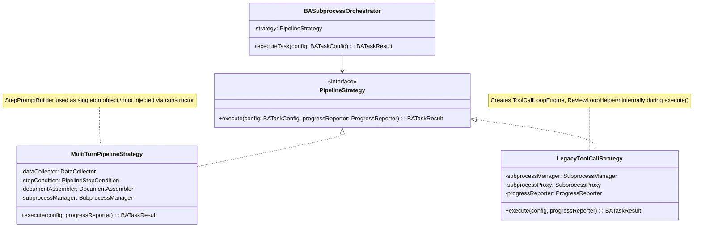
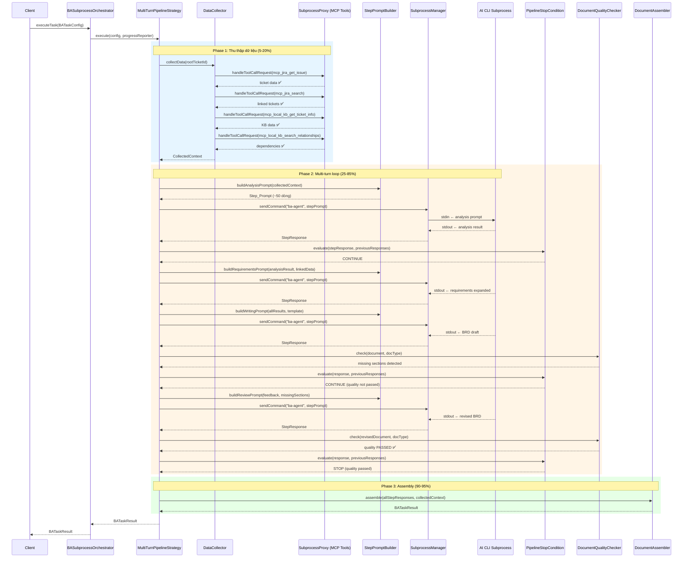
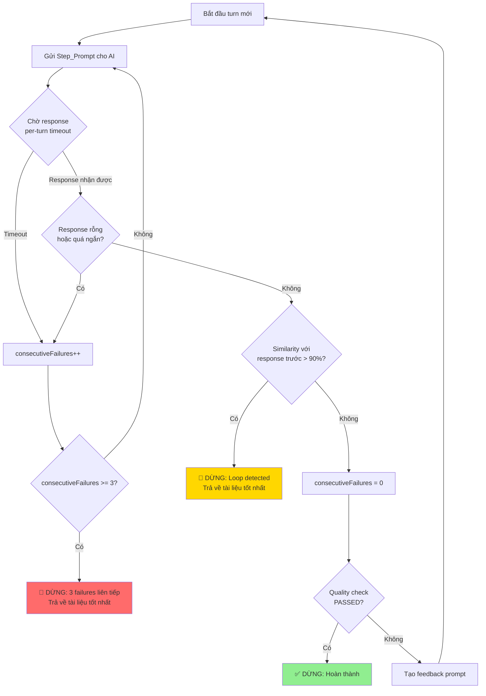

# Tài liệu Thiết kế: Multi-Turn BA Orchestration

## Tổng quan

### Mục tiêu

Tái cấu trúc `BASubprocessOrchestrator` từ mô hình **single-shot prompt** (gửi 1 prompt ~800 dòng, AI tự gọi tool qua `ToolCallLoopEngine`) sang mô hình **multi-turn orchestration** (Orchestrator chủ động thu thập dữ liệu qua MCP tools, gửi từng bước nhỏ cho AI, AI chỉ phân tích và viết tài liệu).

### Quyết định thiết kế chính

1. **Strategy Pattern** cho pipeline: `MultiTurnPipelineStrategy` (mới, mặc định) vs `LegacyToolCallStrategy` (cũ, fallback) — cho phép chọn qua config mà không sửa code hiện tại
2. **Orchestrator tự gọi MCP tools**: `DataCollector` sử dụng `SubprocessProxy.handleToolCallRequest()` trực tiếp — không cần AI gọi tool
3. **Không giới hạn cứng số turns**: Pipeline loop dừng theo 4 điều kiện (quality pass, error, loop detection, consecutive failures)
4. **Per-turn timeout** thay vì total timeout: Mỗi loại step có timeout riêng (30s/60s/120s)
5. **ToolCallLoopEngine giữ nguyên**: Không xóa, không sửa — chỉ không sử dụng trong pipeline mới

### Phạm vi thay đổi

| Component | Thay đổi |
|-----------|----------|
| `BASubprocessOrchestrator` | Refactor: delegate sang Strategy |
| `DataCollector` (MỚI) | Thu thập dữ liệu từ MCP tools |
| `MultiTurnPipelineStrategy` (MỚI) | Pipeline loop mới |
| `StepPromptBuilder` (MỚI) | Tạo prompt nhỏ cho từng step |
| `PipelineStopCondition` (MỚI) | Đánh giá điều kiện dừng |
| `DocumentAssembler` (MỚI) | Ghép kết quả thành BATaskResult |
| `ToolCallLoopEngine` | Không thay đổi — giữ cho backward compatibility |
| `ReviewLoopHelper` | Không thay đổi — giữ cho backward compatibility |
| `TaskMessageBuilder` | Không thay đổi — giữ cho backward compatibility |
| `BATaskConfig` | Không thay đổi interface |
| `BATaskResult` | Không thay đổi interface |

## Kiến trúc

### Strategy Pattern — Chọn pipeline



### Sequence Diagram — Multi-Turn Pipeline



### Flowchart — Điều kiện dừng Pipeline



## Components và Interfaces

### 1. PipelineStrategy (Interface)

```kotlin
// File: server/.../ba/subprocess/pipeline/PipelineStrategy.kt
interface PipelineStrategy {
    suspend fun execute(
        config: BATaskConfig,
        progressReporter: ProgressReporter
    ): BATaskResult
}
```

**Lý do**: Open/Closed Principle — thêm strategy mới không cần sửa `BASubprocessOrchestrator`.

### 2. DataCollector

```kotlin
// File: server/.../ba/subprocess/pipeline/DataCollector.kt
class DataCollector(
    private val subprocessProxy: SubprocessProxy,
    private val progressReporter: ProgressReporter
) {
    suspend fun collectData(rootTicketId: String): CollectedContext
}
```

**Trách nhiệm**: Gọi MCP tools trực tiếp qua `SubprocessProxy.handleToolCallRequest()` để thu thập:
- Ticket chính (`mcp_jira_get_issue`)
- Linked tickets (`mcp_jira_search`)
- KB analysis (`mcp_local_knowledge_base_get_ticket_info`)
- Dependencies (`mcp_local_knowledge_base_search_relationships`)

**Xử lý lỗi**: Mỗi tool call được wrap trong try-catch. Nếu thất bại → ghi log, đánh dấu `ToolCallOutcome.FAILED`, tiếp tục tool tiếp theo.

### 3. StepPromptBuilder

```kotlin
// File: server/.../ba/subprocess/pipeline/StepPromptBuilder.kt
object StepPromptBuilder {
    fun buildAnalysisPrompt(context: CollectedContext, docType: String): String
    fun buildRequirementsPrompt(analysisResult: String, linkedData: String): String
    fun buildWritingPrompt(accumulatedResults: String, docType: String): String
    fun buildReviewPrompt(feedback: String, currentDocument: String): String
}
```

**Trách nhiệm**: Tạo prompt nhỏ (≤200 dòng) cho từng step. Không chứa tool descriptions hay tool call instructions.

### 4. PipelineStopCondition

```kotlin
// File: server/.../ba/subprocess/pipeline/PipelineStopCondition.kt
class PipelineStopCondition {
    fun evaluate(
        currentResponse: StepResponse,
        previousResponses: List<StepResponse>,
        qualityPassed: Boolean,
        consecutiveFailures: Int
    ): StopDecision

    companion object {
        const val SIMILARITY_THRESHOLD = 0.90
        const val MAX_CONSECUTIVE_FAILURES = 3
    }
}

// Top-level internal function for testability
internal fun jaccardSimilarity(a: String, b: String): Double
```

**Trách nhiệm**: Đánh giá 4 điều kiện dừng:
- `QUALITY_PASSED` — Caller passes `qualityPassed: Boolean` (extracted from `DocumentQualityChecker.QualityResult.passed`)
- `LOOP_DETECTED` — Jaccard similarity > 90% với response trước (via top-level `jaccardSimilarity()` function)
- `CONSECUTIVE_FAILURES` — 3 turns liên tiếp thất bại
- `ERROR` — AI subprocess crash

**Lưu ý**: `evaluate()` nhận `qualityPassed: Boolean` thay vì `QualityResult` object — caller (`MultiTurnPipelineStrategy`) chịu trách nhiệm gọi `DocumentQualityChecker.check()` và truyền `passed` flag. Điều này giữ `PipelineStopCondition` không phụ thuộc vào `DocumentQualityChecker`.

### 5. DocumentAssembler

```kotlin
// File: server/.../ba/subprocess/pipeline/DocumentAssembler.kt
class DocumentAssembler {
    fun assemble(
        stepResponses: List<StepResponse>,
        collectedContext: CollectedContext,
        startTimeMs: Long
    ): BATaskResult
}
```

**Trách nhiệm**: Lấy document từ step cuối cùng, map metrics sang `BATaskResult` format (backward compatible).

### 6. MultiTurnPipelineStrategy

```kotlin
// File: server/.../ba/subprocess/pipeline/MultiTurnPipelineStrategy.kt
class MultiTurnPipelineStrategy(
    private val dataCollector: DataCollector,
    private val stopCondition: PipelineStopCondition,
    private val documentAssembler: DocumentAssembler,
    private val subprocessManager: SubprocessManager
) : PipelineStrategy {
    override suspend fun execute(
        config: BATaskConfig,
        progressReporter: ProgressReporter
    ): BATaskResult
}
```

**Lưu ý**: `StepPromptBuilder` là `object` (singleton) nên được sử dụng trực tiếp trong code, không inject qua constructor. Điều này đơn giản hóa constructor và phù hợp với Kotlin idiom cho stateless utility objects.
```

### 7. LegacyToolCallStrategy

```kotlin
// File: server/.../ba/subprocess/pipeline/LegacyToolCallStrategy.kt
class LegacyToolCallStrategy(
    private val subprocessManager: SubprocessManager,
    private val subprocessProxy: SubprocessProxy,
    private val progressReporter: ProgressReporter
) : PipelineStrategy
```

**Trách nhiệm**: Wrap logic hiện tại của `BASubprocessOrchestrator` (ToolCallLoopEngine + ReviewLoopHelper) — backward compatibility. Tạo `ToolCallLoopEngine`, `ReviewLoopHelper` internally thay vì inject qua constructor — đơn giản hóa API vì các component này chỉ được sử dụng bên trong strategy.

## Data Models

### CollectedContext

```kotlin
// File: server/.../ba/subprocess/pipeline/models/CollectedContext.kt
data class CollectedContext(
    val rootTicketData: ToolCallOutcome,
    val linkedTicketsData: ToolCallOutcome,
    val kbAnalysisData: ToolCallOutcome,
    val dependenciesData: ToolCallOutcome,
    val toolCallLog: List<ToolCallLogEntry>
) {
    val successCount: Int get() = listOf(
        rootTicketData, linkedTicketsData,
        kbAnalysisData, dependenciesData
    ).count { it.success }
}
```

### ToolCallOutcome

```kotlin
// File: server/.../ba/subprocess/pipeline/models/ToolCallOutcome.kt
data class ToolCallOutcome(
    val toolName: String,
    val success: Boolean,
    val data: String,
    val durationMs: Long,
    val errorMessage: String? = null
)
```

### StepResponse

```kotlin
// File: server/.../ba/subprocess/pipeline/models/StepResponse.kt
data class StepResponse(
    val stepName: String,
    val content: String,
    val durationMs: Long,
    val timedOut: Boolean = false,
    val isEmpty: Boolean = false
)
```

### StopDecision

```kotlin
// File: server/.../ba/subprocess/pipeline/models/StopDecision.kt
enum class StopReason {
    QUALITY_PASSED,
    LOOP_DETECTED,
    CONSECUTIVE_FAILURES,
    ERROR
}

data class StopDecision(
    val shouldStop: Boolean,
    val reason: StopReason? = null,
    val message: String = ""
)
```

### PipelineStepConfig

```kotlin
// File: server/.../ba/subprocess/pipeline/models/PipelineStepConfig.kt
data class PipelineStepConfig(
    val name: String,
    val timeoutSeconds: Int,
    val progressRange: IntRange
)
```

**Per-turn timeout mặc định**:
- Data collection: 30s per tool call
- Analysis step: 60s
- Writing step: 120s
- Review step: 120s

### Cấu trúc package mới

```
server/src/jvmMain/kotlin/com/assistant/server/agent/ba/subprocess/
├── pipeline/
│   ├── PipelineStrategy.kt              (~19 dòng)
│   ├── MultiTurnPipelineStrategy.kt     (~180 dòng)
│   ├── LegacyToolCallStrategy.kt        (~103 dòng)
│   ├── DataCollector.kt                 (~122 dòng)
│   ├── StepPromptBuilder.kt             (~126 dòng)
│   ├── PipelineStopCondition.kt         (~82 dòng)
│   ├── DocumentAssembler.kt             (~68 dòng)
│   └── models/
│       ├── CollectedContext.kt           (~23 dòng)
│       ├── ToolCallOutcome.kt            (~14 dòng)
│       ├── StepResponse.kt              (~14 dòng)
│       ├── StopDecision.kt              (~21 dòng)
│       └── PipelineStepConfig.kt        (~18 dòng)
├── BASubprocessOrchestrator.kt          (refactored ~134 dòng)
├── ToolCallLoopEngine.kt               (KHÔNG THAY ĐỔI)
├── ReviewLoopHelper.kt                 (KHÔNG THAY ĐỔI)
├── TaskMessageBuilder.kt               (KHÔNG THAY ĐỔI)
├── TaskMessageConstants.kt             (KHÔNG THAY ĐỔI)
├── DocumentQualityChecker.kt           (KHÔNG THAY ĐỔI)
└── CliBackendResolver.kt               (KHÔNG THAY ĐỔI)
```

Tất cả file mới đều ≤200 dòng, tuân thủ coding standards.

## Correctness Properties

*Một property là một đặc tính hoặc hành vi phải đúng trong mọi lần thực thi hợp lệ của hệ thống — về bản chất là một phát biểu hình thức về những gì hệ thống phải làm. Properties là cầu nối giữa đặc tả con người đọc được và đảm bảo tính đúng đắn có thể kiểm chứng bằng máy.*

### Property 1: Data collection completeness

*For any* valid `rootTicketId`, khi `DataCollector.collectData()` hoàn thành, `CollectedContext` trả về SHALL chứa đúng 4 `ToolCallOutcome` entries tương ứng với 4 MCP tool calls: `mcp_jira_get_issue`, `mcp_jira_search`, `mcp_local_knowledge_base_get_ticket_info`, và `mcp_local_knowledge_base_search_relationships` — mỗi entry có `toolName` khớp và `rootTicketId` xuất hiện trong arguments.

**Validates: Requirements 1.1, 1.2, 1.3, 1.4, 1.6**

### Property 2: Data collection resilience

*For any* tổ hợp thành công/thất bại của 4 MCP tool calls (2⁴ = 16 trường hợp), `DataCollector.collectData()` SHALL luôn trả về `CollectedContext` (không throw exception), trong đó các tool thành công có `success=true` với data không rỗng, và các tool thất bại có `success=false` với `errorMessage` không null.

**Validates: Requirements 1.5, 1.6**

### Property 3: Pipeline termination guarantee

*For any* chuỗi `StepResponse` (bao gồm responses rỗng, responses lặp lại, và responses có quality thấp), `PipelineStopCondition.evaluate()` SHALL trả về `shouldStop=true` trong tối đa N turns, trong đó N được xác định bởi: quality pass (bất kỳ turn nào), 3 consecutive failures, hoặc loop detection (2 responses liên tiếp similarity > 90%).

**Validates: Requirements 2.2, 2.3**

### Property 4: Loop detection accuracy

*For any* hai chuỗi text `a` và `b`, nếu similarity(a, b) > 90% thì `PipelineStopCondition` SHALL phát hiện loop và trả về `StopReason.LOOP_DETECTED`. Ngược lại, nếu similarity(a, b) ≤ 90% thì SHALL KHÔNG phát hiện loop (không false positive).

**Validates: Requirements 2.3, 2.4**

### Property 5: Step prompt structure invariant

*For any* `CollectedContext` và step type (analysis, requirements, writing, review), prompt được tạo bởi `StepPromptBuilder` SHALL KHÔNG chứa các pattern: `"toolCall"`, `"tool_name"`, `"TOOL USAGE INSTRUCTIONS"`, `"Available tools:"`, hoặc JSON tool call format `{"toolCall":{`. Prompt SHALL chứa role instruction và step-specific instruction.

**Validates: Requirements 3.1, 3.2, 5.2**

### Property 6: Step prompt data inclusion

*For any* `CollectedContext` chứa ticket data `D`, khi tạo analysis prompt, output SHALL chứa `D`. *For any* analysis result `A`, khi tạo requirements prompt, output SHALL chứa `A`. *For any* accumulated results `R`, khi tạo writing prompt, output SHALL chứa `R`.

**Validates: Requirements 3.3, 3.4, 3.5**

### Property 7: Step prompt size invariant

*For any* input data (CollectedContext, analysis results, accumulated results) có kích thước bất kỳ, prompt được tạo bởi `StepPromptBuilder` SHALL có số dòng ≤ 200. Nếu input data quá lớn, builder SHALL truncate data mà vẫn giữ instruction và structure.

**Validates: Requirements 3.6**

### Property 8: Document assembly correctness

*For any* danh sách `StepResponse` không rỗng và `CollectedContext`, `DocumentAssembler.assemble()` SHALL trả về `BATaskResult` trong đó: `document` bằng content của StepResponse cuối cùng có content không rỗng, `status` là một giá trị hợp lệ trong `BATaskStatus`, và `totalDurationMs` ≥ 0.

**Validates: Requirements 6.1, 6.3**

### Property 9: Metrics mapping correctness

*For any* `CollectedContext` với N tool calls (trong đó M thành công, F thất bại), `BATaskResult` được tạo bởi `DocumentAssembler` SHALL có `toolCallsExecuted == N`, `toolCallsFailed == F`, và `toolCallLog` có đúng N entries với `toolName` và `success` khớp với `CollectedContext.toolCallLog`.

**Validates: Requirements 7.3, 7.4**

## Error Handling

### Phân loại lỗi và xử lý

| Loại lỗi | Component | Xử lý | Kết quả |
|-----------|-----------|-------|---------|
| MCP tool call thất bại | DataCollector | Log warning, đánh dấu `ToolCallOutcome.FAILED`, tiếp tục | Pipeline tiếp tục với dữ liệu partial |
| AI subprocess crash | MultiTurnPipelineStrategy | Spawn subprocess mới, gửi lại accumulated context | Pipeline tiếp tục từ step hiện tại |
| Per-turn timeout | MultiTurnPipelineStrategy | Tăng `consecutiveFailures`, retry hoặc dừng | Retry nếu < 3 failures, dừng nếu ≥ 3 |
| Response rỗng | PipelineStopCondition | Tăng `consecutiveFailures` | Retry hoặc dừng |
| Loop detected | PipelineStopCondition | Dừng pipeline | Trả về tài liệu tốt nhất |
| CliBackendResolver thất bại | BASubprocessOrchestrator | Return BATaskResult(status=FAILED) | Không bắt đầu pipeline |
| All MCP tools thất bại | DataCollector | Return CollectedContext rỗng | Pipeline vẫn chạy, AI viết từ rootTicketId |

### Chiến lược recovery

1. **Graceful degradation**: Nếu một số MCP tools thất bại, pipeline vẫn tiếp tục với dữ liệu có sẵn
2. **Subprocess auto-restart**: Nếu AI crash, spawn mới và gửi lại context (tận dụng `SubprocessManager.getOrSpawnSubprocess()` hiện có)
3. **Best-effort output**: Khi pipeline dừng do lỗi hoặc loop, trả về tài liệu tốt nhất đã thu thập — không bao giờ trả về document rỗng nếu đã có ít nhất 1 step thành công

### Logging strategy

- **INFO**: Bắt đầu/kết thúc mỗi phase, mỗi step, metrics tổng hợp
- **WARN**: MCP tool call thất bại, per-turn timeout, loop detected, subprocess restart
- **ERROR**: Pipeline thất bại hoàn toàn, CliBackendResolver thất bại
- **DEBUG**: Nội dung prompt (truncated 500 chars), nội dung response (truncated 500 chars)

## Testing Strategy

### Unit Tests (Example-based)

| Test | Mô tả | Validates |
|------|--------|-----------|
| `testPipelineExecutesStepsInOrder` | Verify 3 initial steps chạy đúng thứ tự | Req 2.1 |
| `testPipelineContinuesBeyondFixedTurns` | Mock quality fail N lần, verify pipeline chạy N+3 turns | Req 2.2 |
| `testPipelineSendsFeedbackOnQualityFail` | Mock quality fail, verify feedback prompt được gửi | Req 2.5 |
| `testSameSubprocessUsedForAllSteps` | Verify tất cả sendCommand dùng "ba-agent" | Req 4.1 |
| `testPerTurnTimeoutApplied` | Verify mỗi step type dùng timeout đúng | Req 4.4 |
| `testSubprocessCrashRecovery` | Mock crash, verify respawn + context resend | Req 4.5 |
| `testDefaultStrategyIsMultiTurn` | Verify strategy mặc định | Req 10.2 |
| `testFallbackToLegacyStrategy` | Verify có thể chọn legacy strategy | Req 10.3 |
| `testProgressReportingCheckpoints` | Verify progress % tại mỗi phase | Req 8.1-8.4 |
| `testPlainTextCommunication` | Verify không JSON tool call parsing | Req 5.3, 9.2 |

### Property-Based Tests (PBT)

Sử dụng thư viện **Kotest Property Testing** (`io.kotest:kotest-property`) — thư viện PBT chuẩn cho Kotlin.

Mỗi property test chạy tối thiểu **100 iterations**.

| Property Test | Property # | Tag |
|---------------|-----------|-----|
| `testDataCollectionCompleteness` | Property 1 | Feature: multi-turn-ba-orchestration, Property 1: Data collection completeness |
| `testDataCollectionResilience` | Property 2 | Feature: multi-turn-ba-orchestration, Property 2: Data collection resilience |
| `testPipelineTerminationGuarantee` | Property 3 | Feature: multi-turn-ba-orchestration, Property 3: Pipeline termination guarantee |
| `testLoopDetectionAccuracy` | Property 4 | Feature: multi-turn-ba-orchestration, Property 4: Loop detection accuracy |
| `testStepPromptStructureInvariant` | Property 5 | Feature: multi-turn-ba-orchestration, Property 5: Step prompt structure invariant |
| `testStepPromptDataInclusion` | Property 6 | Feature: multi-turn-ba-orchestration, Property 6: Step prompt data inclusion |
| `testStepPromptSizeInvariant` | Property 7 | Feature: multi-turn-ba-orchestration, Property 7: Step prompt size invariant |
| `testDocumentAssemblyCorrectness` | Property 8 | Feature: multi-turn-ba-orchestration, Property 8: Document assembly correctness |
| `testMetricsMappingCorrectness` | Property 9 | Feature: multi-turn-ba-orchestration, Property 9: Metrics mapping correctness |

### Integration Tests

| Test | Mô tả |
|------|--------|
| `testEndToEndMultiTurnPipeline` | Full pipeline với mock SubprocessManager + mock SubprocessProxy |
| `testEndToEndLegacyFallback` | Full pipeline với legacy strategy |
| `testCliBackendCompatibility` | Verify pipeline hoạt động với tất cả 4 backends (gemini, copilot, kiro, ollama) |
| `testDelimiterBasedReading` | Verify stdout reading với ---END--- delimiter |

### Test file structure

```
server/src/jvmTest/kotlin/com/assistant/server/agent/ba/subprocess/pipeline/
├── DataCollectorTest.kt                    (unit + property tests)
├── StepPromptBuilderTest.kt                (unit + property tests)
├── PipelineStopConditionTest.kt            (unit + property tests)
├── DocumentAssemblerTest.kt                (unit + property tests)
├── MultiTurnPipelineStrategyTest.kt        (unit tests)
├── MultiTurnPipelineIntegrationTest.kt     (integration tests)
└── LegacyToolCallStrategyTest.kt           (unit tests)
```
