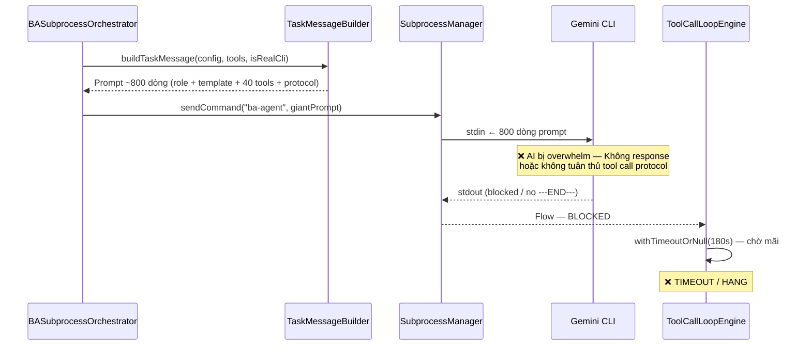
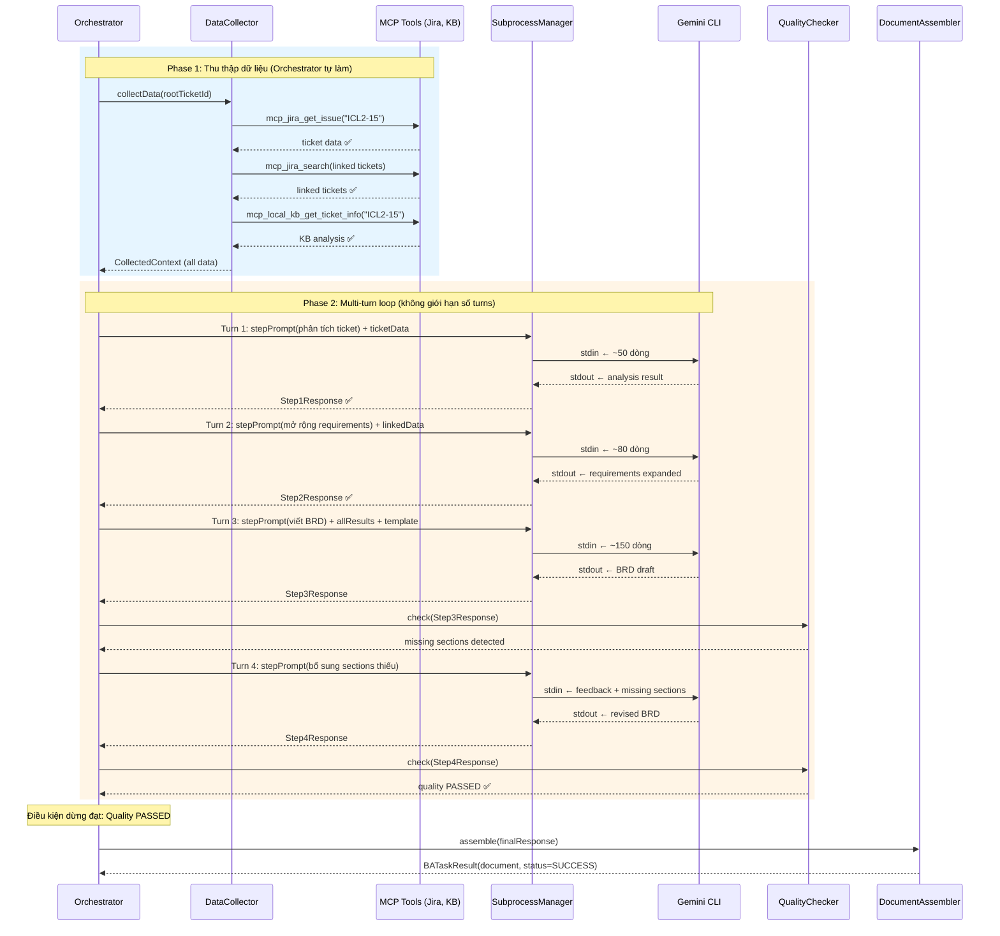
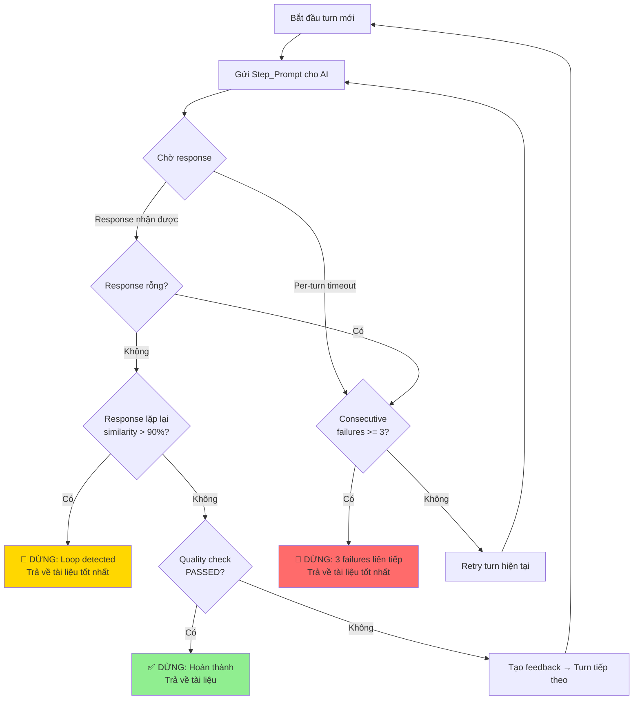

# Requirements Document

## Giới thiệu

Tái cấu trúc kiến trúc BA document generation từ mô hình **single-shot prompt** (gửi 1 prompt khổng lồ ~800 dòng kèm 40+ tool descriptions, AI tự gọi tool qua JSON stdout) sang mô hình **multi-turn orchestration** (orchestrator chủ động thu thập dữ liệu qua MCP tools, gửi từng bước nhỏ cho AI, AI chỉ tập trung phân tích và viết tài liệu).

### Vấn đề hiện tại

1. **Prompt quá lớn**: `TaskMessageBuilder` tạo prompt ~800 dòng chứa role instruction + template + tool usage instructions + 40+ tool descriptions → vượt khả năng xử lý của Gemini CLI
2. **AI phải tự gọi tool**: `ToolCallLoopEngine` kỳ vọng AI output JSON `{"toolCall":{...}}` trên stdout → Gemini CLI thực tế không tuân thủ protocol này
3. **Không có phản hồi trung gian**: Toàn bộ BRD generation phụ thuộc vào 1 prompt duy nhất hoạt động hoàn hảo
4. **Không thể điều chỉnh giữa chừng**: Nếu AI đi sai hướng, không có cơ chế course correction

### Kiến trúc mong muốn

- Orchestrator thu thập dữ liệu từ MCP tools **trước khi** gọi AI
- Gửi dữ liệu đã thu thập cho AI trong các message nhỏ, tập trung
- AI chỉ làm nhiệm vụ phân tích và viết tài liệu, không gọi tool
- Multi-turn: Bước 1 "phân tích ticket data", Bước 2 "mở rộng requirements từ linked tickets", Bước 3 "viết BRD hoàn chỉnh"

### Kiến trúc hiện tại (Single-Shot) — BỊ STUCK

### Kiến trúc mới (Multi-Turn) — MỤC TIÊU

### Điều kiện dừng pipeline

### So sánh kiến trúc

| | Single-Shot (hiện tại) | Multi-Turn (mới) |
|---|---|---|
| **Prompt size** | ~800 dòng | ≤200 dòng/step |
| **Ai gọi MCP tools?** | AI tự gọi (thất bại) | Orchestrator gọi |
| **Số lần giao tiếp** | 1 lần (all-or-nothing) | Không giới hạn — dừng khi hoàn thành, lỗi, hoặc loop |
| **Course correction** | Không thể | Kiểm tra sau mỗi step |
| **AI làm gì?** | Mọi thứ (tool + phân tích + viết) | Chỉ phân tích + viết |
| **Điểm thất bại** | 1 prompt fail = toàn bộ fail | Mỗi step độc lập |
| **Điều kiện dừng** | Timeout hoặc hang | Hoàn thành / Lỗi / Phát hiện loop |

## Thuật ngữ

- **Orchestrator**: Component `BASubprocessOrchestrator` điều phối toàn bộ quy trình tạo tài liệu BA
- **AI_Subprocess**: Tiến trình CLI bên ngoài (Gemini CLI, Copilot CLI) nhận text input và trả text output
- **MCP_Tool_Proxy**: Component `SubprocessProxy` thực thi MCP tool calls và trả kết quả
- **Data_Collector**: Component mới thu thập dữ liệu từ MCP tools trước khi gửi cho AI
- **Turn**: Một cặp message gửi-nhận giữa Orchestrator và AI_Subprocess
- **Pipeline_Step**: Một bước trong quy trình multi-turn, mỗi bước có mục tiêu cụ thể
- **Collected_Context**: Dữ liệu đã thu thập từ MCP tools, được format thành text cho AI
- **Step_Prompt**: Prompt nhỏ gửi cho AI trong mỗi Pipeline_Step, chỉ chứa instruction + data cần thiết
- **Step_Response**: Kết quả AI trả về sau mỗi Step_Prompt
- **Document_Assembler**: Component ghép các Step_Response thành tài liệu hoàn chỉnh

## Requirements

### Requirement 1: Thu thập dữ liệu chủ động bởi Orchestrator

**User Story:** Là một BA, tôi muốn Orchestrator tự thu thập dữ liệu từ Jira và Knowledge Base trước khi gọi AI, để AI nhận dữ liệu đã sẵn sàng thay vì phải tự gọi tool.

#### Acceptance Criteria

1. WHEN một BATaskConfig được nhận, THE Data_Collector SHALL gọi MCP tool `mcp_jira_get_issue` với rootTicketId để lấy thông tin ticket chính
2. WHEN ticket chính đã được thu thập, THE Data_Collector SHALL gọi MCP tool `mcp_jira_search` để tìm các linked tickets liên quan
3. WHEN ticket chính đã được thu thập, THE Data_Collector SHALL gọi MCP tool `mcp_local_knowledge_base_get_ticket_info` để lấy dữ liệu Knowledge Base
4. WHEN ticket chính đã được thu thập, THE Data_Collector SHALL gọi MCP tool `mcp_local_knowledge_base_search_relationships` để lấy dependencies
5. IF một MCP tool call thất bại, THEN THE Data_Collector SHALL ghi log lỗi và tiếp tục thu thập từ các tool còn lại
6. THE Data_Collector SHALL trả về một Collected_Context chứa toàn bộ dữ liệu đã thu thập, bao gồm cả trạng thái thành công/thất bại của từng tool call

### Requirement 2: Pipeline multi-turn với điều kiện dừng thông minh

**User Story:** Là một BA, tôi muốn quy trình tạo tài liệu được chia thành nhiều bước tuần tự không giới hạn số lượng, chỉ dừng khi hoàn thành, gặp lỗi, hoặc phát hiện AI bị loop.

#### Acceptance Criteria

1. THE Orchestrator SHALL thực thi pipeline gồm các Pipeline_Step tuần tự, bắt đầu từ: (1) phân tích ticket data, (2) mở rộng requirements từ linked tickets, (3) viết tài liệu hoàn chỉnh, và tiếp tục thêm các bước review/bổ sung nếu cần
2. THE Orchestrator SHALL KHÔNG giới hạn cứng số lượng turns — pipeline tiếp tục cho đến khi gặp điều kiện dừng
3. THE Orchestrator SHALL dừng pipeline khi gặp một trong các điều kiện sau:
   - **Hoàn thành**: DocumentQualityChecker xác nhận tài liệu đạt chất lượng
   - **Lỗi**: AI_Subprocess crash, hoặc trả về response rỗng
   - **Loop detection**: AI trả về response giống hệt hoặc gần giống response trước đó (similarity > 90%)
   - **Per-turn timeout**: Một turn cụ thể không nhận được response trong thời gian cho phép (configurable per step — ví dụ: data collection 30s/call, analysis 60s, writing 120s)
   - **Consecutive failures**: 3 turns liên tiếp thất bại (timeout hoặc response rỗng)
4. WHEN phát hiện AI bị loop (response lặp lại), THE Orchestrator SHALL ghi log cảnh báo, dừng pipeline, và trả về tài liệu tốt nhất đã thu thập được
5. WHEN một Pipeline_Step trả về response không đạt yêu cầu, THE Orchestrator SHALL gửi feedback cụ thể và tiếp tục turn tiếp theo thay vì dừng lại

### Requirement 3: Step Prompt nhỏ gọn không chứa tool instructions

**User Story:** Là một BA, tôi muốn mỗi prompt gửi cho AI chỉ chứa instruction cụ thể và dữ liệu cần thiết cho bước đó, để AI không bị quá tải bởi thông tin không liên quan.

#### Acceptance Criteria

1. THE Step_Prompt SHALL không chứa tool usage instructions hoặc tool descriptions
2. THE Step_Prompt SHALL chỉ chứa: (a) role instruction ngắn gọn, (b) instruction cụ thể cho Pipeline_Step hiện tại, (c) Collected_Context liên quan đến bước đó
3. WHEN tạo Step_Prompt cho bước phân tích, THE Orchestrator SHALL bao gồm dữ liệu ticket chính và yêu cầu AI trích xuất business goals, stakeholders, và scope
4. WHEN tạo Step_Prompt cho bước mở rộng requirements, THE Orchestrator SHALL bao gồm kết quả phân tích từ bước trước và dữ liệu linked tickets
5. WHEN tạo Step_Prompt cho bước viết tài liệu, THE Orchestrator SHALL bao gồm toàn bộ kết quả phân tích tích lũy và template structure
6. THE Step_Prompt cho mỗi bước SHALL có kích thước không vượt quá 200 dòng

### Requirement 4: Giao tiếp multi-turn với AI Subprocess

**User Story:** Là một BA, tôi muốn Orchestrator gửi nhiều message tuần tự cho cùng một AI subprocess session, để AI có thể duy trì context giữa các bước.

#### Acceptance Criteria

1. THE Orchestrator SHALL sử dụng cùng một AI_Subprocess instance cho toàn bộ pipeline của một BATaskConfig
2. WHEN gửi Step_Prompt, THE Orchestrator SHALL ghi Step_Prompt vào stdin của AI_Subprocess và đọc Step_Response từ stdout
3. WHEN đọc Step_Response, THE Orchestrator SHALL sử dụng delimiter `---END---` để xác định kết thúc response
4. THE Orchestrator SHALL áp dụng idle timeout cho mỗi turn để phát hiện AI_Subprocess không phản hồi
5. IF AI_Subprocess crash giữa pipeline, THEN THE Orchestrator SHALL spawn subprocess mới và gửi lại context tích lũy từ các bước trước

### Requirement 5: Loại bỏ ToolCallLoopEngine khỏi luồng chính

**User Story:** Là một developer, tôi muốn loại bỏ cơ chế tool call loop trong luồng tạo tài liệu chính, để đơn giản hóa kiến trúc và loại bỏ điểm thất bại chính.

#### Acceptance Criteria

1. THE Orchestrator SHALL không sử dụng ToolCallLoopEngine trong pipeline multi-turn mới
2. THE Orchestrator SHALL không gửi tool descriptions hoặc tool call format instructions cho AI_Subprocess
3. THE Orchestrator SHALL đọc stdout của AI_Subprocess dưới dạng plain text, không parse JSON tool call requests
4. WHILE đọc Step_Response, THE Orchestrator SHALL tích lũy tất cả output lines cho đến khi gặp delimiter hoặc timeout

### Requirement 6: Document Assembly từ multi-turn results

**User Story:** Là một BA, tôi muốn kết quả từ các bước multi-turn được ghép thành tài liệu hoàn chỉnh, để output cuối cùng vẫn là một BRD/FSD đầy đủ.

#### Acceptance Criteria

1. THE Document_Assembler SHALL sử dụng Step_Response cuối cùng có content không rỗng làm tài liệu chính
2. WHEN tài liệu chưa đạt chất lượng theo DocumentQualityChecker, THE MultiTurnPipelineStrategy SHALL gửi review feedback cho AI và tiếp tục pipeline loop — Document_Assembler chỉ chịu trách nhiệm ghép kết quả cuối cùng
3. THE Document_Assembler SHALL trả về BATaskResult với document, số turn đã thực hiện, và trạng thái pipeline
4. THE Document_Assembler SHALL ghi log kích thước tài liệu, số turns, và thời gian mỗi turn

### Requirement 7: Backward compatibility với BATaskConfig và BATaskResult

**User Story:** Là một developer, tôi muốn interface BATaskConfig và BATaskResult không thay đổi, để các component gọi BASubprocessOrchestrator không cần sửa đổi.

#### Acceptance Criteria

1. THE Orchestrator SHALL chấp nhận cùng BATaskConfig interface hiện tại bao gồm rootTicketId, docType, cliBackend, maxToolCalls, và taskTimeoutSeconds
2. THE Orchestrator SHALL trả về cùng BATaskResult interface hiện tại bao gồm document, toolCallsExecuted, toolCallsFailed, totalDurationMs, status, và toolCallLog
3. WHEN sử dụng pipeline multi-turn, THE Orchestrator SHALL map toolCallsExecuted thành số MCP tool calls mà Data_Collector đã thực hiện
4. WHEN sử dụng pipeline multi-turn, THE Orchestrator SHALL map toolCallLog thành log của các MCP tool calls từ Data_Collector

### Requirement 8: Progress reporting cho từng bước pipeline

**User Story:** Là một user, tôi muốn thấy tiến trình chi tiết của từng bước trong pipeline, để biết hệ thống đang làm gì và ước lượng thời gian còn lại.

#### Acceptance Criteria

1. WHEN bắt đầu thu thập dữ liệu, THE Orchestrator SHALL báo cáo progress 5-15% với message mô tả tool đang gọi
2. WHEN hoàn thành thu thập dữ liệu, THE Orchestrator SHALL báo cáo progress 20% với tổng số tool calls thành công/thất bại
3. WHEN bắt đầu mỗi Pipeline_Step, THE Orchestrator SHALL báo cáo progress tương ứng: Analysis = 25-40%, Requirements/Writing = 45-70%, Review = 75-85%
4. WHEN hoàn thành pipeline, THE Orchestrator SHALL báo cáo progress 90-95%
5. THE Orchestrator SHALL sử dụng ProgressReporter interface hiện tại để báo cáo

### Requirement 9: Tương thích với nhiều CLI backends

**User Story:** Là một developer, tôi muốn pipeline multi-turn hoạt động với tất cả CLI backends được hỗ trợ (Gemini, Copilot, Kiro, Ollama), để không giới hạn lựa chọn AI provider.

#### Acceptance Criteria

1. THE Orchestrator SHALL sử dụng CliBackendResolver hiện tại để resolve SubprocessConfig cho mỗi backend
2. THE Orchestrator SHALL gửi Step_Prompt dưới dạng plain text cho tất cả CLI backends
3. THE Orchestrator SHALL đọc Step_Response dưới dạng plain text với delimiter `---END---` cho tất cả CLI backends
4. IF một CLI backend không hỗ trợ multi-turn (không duy trì context giữa các message), THEN THE Orchestrator SHALL gửi context tích lũy trong mỗi Step_Prompt

### Requirement 10: Giữ lại ToolCallLoopEngine cho backward compatibility

**User Story:** Là một developer, tôi muốn ToolCallLoopEngine và các component liên quan vẫn tồn tại trong codebase, để có thể fallback hoặc sử dụng cho các use case khác trong tương lai.

#### Acceptance Criteria

1. THE Orchestrator SHALL không xóa ToolCallLoopEngine, TaskMessageBuilder, hoặc TaskMessageConstants khỏi codebase
2. THE Orchestrator SHALL sử dụng pipeline multi-turn làm strategy mặc định cho document generation
3. WHERE cần fallback về strategy cũ, THE Orchestrator SHALL cho phép chọn strategy qua BATaskConfig hoặc configuration
