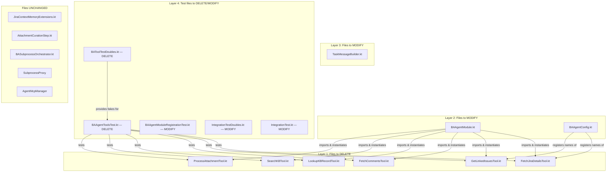
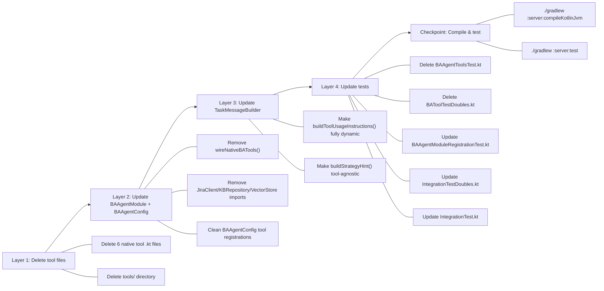
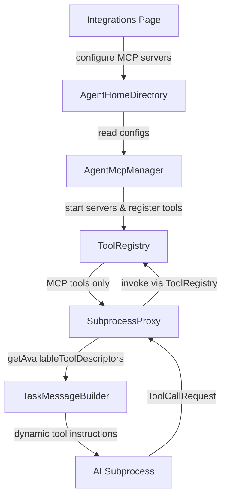

# Design Document — Native BA Tool Removal

## Overview

This design specifies the complete removal of the 6 hardcoded native BA tools and all associated registration/reference code, making dynamically configured MCP tools (via the Integrations page) the sole source of tools for the BA subprocess.

**Current state:** `BAAgentModule.wireNativeBATools()` registers 6 hardcoded `AgentTool` implementations — `FetchJiraDetailsTool`, `GetLinkedIssuesTool`, `FetchCommentsTool`, `LookupKBRecordTool`, `SearchKBTool`, `ProcessAttachmentTool` — into `ToolRegistry` with direct `JiraClient`, `KBRepository`, and `VectorStore` dependencies. `TaskMessageBuilder` strategy hints reference specific native tool names. Tests use native tool names in fixtures.

**Target state:** All 6 native tool files deleted. `wireNativeBATools()` removed from `BAAgentModule`. `TaskMessageBuilder` generates tool instructions dynamically from whatever `ToolDescriptor` list is passed in. Tests use MCP-style tool names (`mcp_{serverName}_{toolName}`). The system gracefully handles zero configured MCP servers.

### Key Design Decisions

1. **Bottom-up deletion order** — Same pattern as the [legacy-pipeline-removal spec](./../legacy-pipeline-removal/design.md): delete leaf files first (tool implementations), then update consumers (BAAgentModule, TaskMessageBuilder), then update tests. This prevents intermediate compilation errors.

2. **JiraContextMemoryExtensions unchanged** — The `toolName` strings in `MemoryEntry` objects (e.g., `"fetchComments"`, `"getLinkedIssues"`) are metadata labels for memory slot entries, not references to the deleted tool classes. They are used by `AttachmentCurationStep` to partition root vs linked attachments. Changing these would break memory slot logic with no benefit — the subprocess now populates memory through MCP tool responses, and these extension functions may still be called by other code paths.

3. **BAAgentConfig.buildBAAgentConfig() tool registration cleaned** — The `tools { register("fetchJiraDetails") ... }` block in `BAAgentConfig` references native tool names in the `AgentConfig` DSL. These registrations are removed since tools are now discovered dynamically via `SubprocessProxy.getAvailableToolDescriptors()`.

4. **AttachmentCurationStep.partitionAttachments() unchanged** — The `entry.toolName == "processAttachment"` check is a memory entry metadata comparison, not a reference to the deleted `ProcessAttachmentTool` class. It partitions attachment data by origin. This remains valid regardless of whether the data came from a native tool or an MCP tool.

5. **Strategy hints made tool-agnostic** — `TaskMessageBuilder.buildStrategyHint()` currently says "Start by fetching the root ticket details" which is already tool-agnostic. The hints are updated to remove any remaining specific tool name references while still providing useful document-type-specific guidance.

---

## Architecture

### Deletion Dependency Graph



### Deletion Order (Bottom-Up)



### After-State: Tool Flow



---

## Components and Interfaces

### 1. BAAgentModule (Modified)

**Location:** `server/src/jvmMain/kotlin/com/assistant/server/agent/ba/BAAgentModule.kt`

**Changes:**
- Delete `wireNativeBATools()` private function entirely
- Remove `import com.assistant.server.agent.ba.tools.*` wildcard import
- Remove the `wireNativeBATools(toolRegistry)` call from the agent factory
- Keep `registerMcpTools(toolRegistry)` call — this becomes the only tool registration path
- Keep `BASubprocessOrchestrator` singleton registration unchanged
- Keep `BADocumentAgent` factory registration unchanged

**After:**

```kotlin
val baAgentModule = module {
    single {
        BASubprocessOrchestrator(
            subprocessManager = get(),
            subprocessProxy = get(),
            progressReporter = get(),
            settingsRepository = get(),
            providerConfigRepo = getOrNull()
        )
    }

    single(createdAtStart = true) {
        val registry: AgentRegistry = get()
        registry.register(BADocumentAgent.AGENT_TYPE) { _ ->
            val toolRegistry: ToolRegistry = get()
            registerMcpTools(toolRegistry)
            // wireNativeBATools() REMOVED — MCP tools only
            BADocumentAgent(
                toolRegistry = toolRegistry,
                memory = JiraContextMemorySchema.createMemory(),
                progressReporter = get(),
                subprocessOrchestrator = getOrNull()
            )
        }
    }
}

// registerMcpTools() KEPT — unchanged
private fun org.koin.core.scope.Scope.registerMcpTools(
    toolRegistry: ToolRegistry
) {
    val mcpManager: AgentMcpManager? = getOrNull()
    if (mcpManager == null) return
    kotlinx.coroutines.runBlocking { mcpManager.initialize() }
}

// wireNativeBATools() DELETED entirely
```

**Removed dependencies:** `JiraClient`, `KBRepository`, `VectorStore` — no longer resolved from Koin for native tool construction.

### 2. BAAgentConfig (Modified)

**Location:** `server/src/jvmMain/kotlin/com/assistant/server/agent/ba/BAAgentConfig.kt`

**Changes:**
- Remove the `tools { ... }` block from `buildBAAgentConfig()` that registers 6 native tool names
- Remove the `errorStrategy { forTool("fetchJiraDetails", ...) }` entry that references a native tool name
- Keep `memorySchema`, `phases`, `limits`, and `buildSubprocessConfig()` unchanged

**After (tools and errorStrategy sections):**

```kotlin
fun buildBAAgentConfig(): AgentConfig = agentConfig {
    memorySchema { /* unchanged */ }
    phases { /* unchanged */ }
    // tools { } block REMOVED — tools discovered dynamically
    limits { /* unchanged */ }
    errorStrategy {
        default = ErrorStrategy.SKIP
        // forTool("fetchJiraDetails", ...) REMOVED
    }
}
```

### 3. TaskMessageBuilder (Modified)

**Location:** `server/src/jvmMain/kotlin/com/assistant/server/agent/ba/subprocess/TaskMessageBuilder.kt`

**Changes:**
- `buildToolUsageInstructions()` — already generates from `List<ToolDescriptor>` parameter. Add handling for empty tool list: output a message instructing the AI to work without tools.
- `buildStrategyHint()` — update strategy hint constants to remove any specific tool name references. Current hints already say "Start by fetching the root ticket details" which is tool-agnostic, but we ensure no native tool names appear anywhere.

**After (buildToolUsageInstructions):**

```kotlin
fun buildToolUsageInstructions(
    tools: List<ToolDescriptor>
): String = buildString {
    appendLine("## TOOL USAGE INSTRUCTIONS")
    if (tools.isEmpty()) {
        appendLine(NO_TOOLS_MESSAGE)
        return@buildString
    }
    appendLine("You can request tool calls using JSON format:")
    appendLine(TOOL_CALL_FORMAT_EXAMPLE)
    appendLine()
    appendLine("Available tools:")
    for (tool in tools) {
        appendToolEntry(this, tool)
    }
}.trimEnd()
```

**New constant:**

```kotlin
private const val NO_TOOLS_MESSAGE =
    "No tools are currently available. Produce the document " +
    "using only the root ticket ID and document type provided " +
    "in this task message. Do not attempt tool calls."
```

**Updated strategy hint constants (tool-agnostic):**

```kotlin
private const val BRD_STRATEGY_HINT =
    "Prioritize business goals, stakeholder needs, and acceptance criteria. " +
    "Start by exploring the root ticket details, then look for linked issues " +
    "and comments for requirements context. Use available tools to gather data."

private const val FSD_STRATEGY_HINT =
    "Prioritize technical architecture, data models, and API specifications. " +
    "Start by exploring the root ticket details, then look for technical " +
    "details and linked implementation tickets. Use available tools to gather data."

private const val SLIDES_STRATEGY_HINT =
    "Prioritize executive summary, key metrics, and visual elements. " +
    "Start by exploring the root ticket details, then gather high-level " +
    "business context and key decisions from comments. Use available tools to gather data."
```

### 4. Files Deleted

| File | Reason |
|------|--------|
| `server/.../tools/FetchJiraDetailsTool.kt` | Native BA tool — replaced by MCP Jira tools |
| `server/.../tools/GetLinkedIssuesTool.kt` | Native BA tool — replaced by MCP Jira tools |
| `server/.../tools/FetchCommentsTool.kt` | Native BA tool — replaced by MCP Jira tools |
| `server/.../tools/LookupKBRecordTool.kt` | Native BA tool — replaced by MCP KB tools |
| `server/.../tools/SearchKBTool.kt` | Native BA tool — replaced by MCP KB tools |
| `server/.../tools/ProcessAttachmentTool.kt` | Native BA tool — replaced by MCP tools |
| `server/.../tools/BAAgentToolsTest.kt` | Tests deleted native tool classes |
| `server/.../tools/BAToolTestDoubles.kt` | Fakes for deleted native tool classes |

### 5. Files Unchanged

| File | Reason for keeping |
|------|-------------------|
| `JiraContextMemoryExtensions.kt` | `toolName` strings are metadata labels, not class references. Used by `AttachmentCurationStep` for partitioning. |
| `AttachmentCurationStep.kt` | `entry.toolName == "processAttachment"` is a string comparison on memory entry metadata, not a reference to the deleted class. |
| `BASubprocessOrchestrator.kt` | No references to native tools — delegates to `SubprocessProxy` |
| `SubprocessProxy` | Already tool-agnostic — returns whatever is in `ToolRegistry` |
| `AgentMcpManager` | Already handles MCP tool registration independently |

### 6. Impact Analysis: References to Native Tool Names

| Location | Reference | Action |
|----------|-----------|--------|
| `BAAgentModule.wireNativeBATools()` | Instantiates all 6 tool classes | **DELETE** function |
| `BAAgentConfig.buildBAAgentConfig()` | `register("fetchJiraDetails")` etc. | **REMOVE** tools block |
| `BAAgentConfig.buildBAAgentConfig()` | `forTool("fetchJiraDetails", ...)` | **REMOVE** error strategy entry |
| `JiraContextMemoryExtensions.kt` | `"fetchComments"`, `"getLinkedIssues"` etc. as string metadata | **KEEP** — metadata labels, not class refs |
| `AttachmentCurationStep.kt` | `entry.toolName == "processAttachment"` | **KEEP** — string comparison on metadata |
| `BADocumentAgentIntegrationTestDoubles.kt` | `ToolDescriptor("fetchJiraDetails", ...)` | **UPDATE** to MCP-style names |
| `BADocumentAgentIntegrationTestDoubles.kt` | `"name":"fetchJiraDetails"` in JSON | **UPDATE** to MCP-style names |
| `BAAgentToolsTest.kt` | Tests all 6 tool classes | **DELETE** file |
| `BAToolTestDoubles.kt` | Fakes for all 6 tool classes | **DELETE** file |

---

## Data Models

No new data models are introduced. No existing data models are modified.

Existing models remain unchanged:
- **`ToolDescriptor`** — Used by `TaskMessageBuilder.buildToolUsageInstructions()` to generate dynamic tool instructions. After this change, the descriptors come exclusively from MCP tools.
- **`ToolResult`** — Return type of `AgentTool.execute()`. No longer returned by native BA tools (deleted), but still used by MCP tool bridge.
- **`MemoryEntry`** — Contains `toolName` string metadata. The string values (`"fetchComments"`, etc.) are kept as-is — they are labels, not class references.

---

## Correctness Properties

*A property is a characteristic or behavior that should hold true across all valid executions of a system — essentially, a formal statement about what the system should do. Properties serve as the bridge between human-readable specifications and machine-verifiable correctness guarantees.*

### Property 1: Tool usage instructions contain all provided tools and no hardcoded native names

*For any* non-empty list of `ToolDescriptor` objects with arbitrary names and descriptions, the output of `TaskMessageBuilder.buildToolUsageInstructions()` SHALL contain every tool name from the input list AND SHALL NOT contain any of the 6 deleted native tool names (`fetchJiraDetails`, `getLinkedIssues`, `fetchComments`, `lookupKBRecord`, `searchKB`, `processAttachment`).

**Validates: Requirements 3.1, 3.3**

---

## Error Handling

### No MCP Servers Configured

| Scenario | Detection | Response |
|----------|-----------|----------|
| No MCP servers on Integrations page | `AgentMcpManager.initialize()` registers zero tools | `ToolRegistry` is empty; `SubprocessProxy.getAvailableToolDescriptors()` returns `emptyList()` |
| Empty tool list passed to TaskMessageBuilder | `tools.isEmpty()` check | Generate "no tools available" message instructing AI to produce document with provided context only |
| AI subprocess sends ToolCallRequest with no tools registered | `ToolRegistry.invoke()` returns `ToolResult(success=false)` | `SubprocessProxy` returns `ToolCallResponse(success=false, error="Tool not found: <name>")` — AI decides how to proceed |

### Compilation Errors During Deletion

The bottom-up deletion order prevents intermediate compilation errors:

1. **Layer 1** (delete tool files) — No other production code imports these classes directly except `BAAgentModule.wireNativeBATools()` and `BAAgentConfig`. Deleting the files will cause compilation errors in Layer 2 files only.
2. **Layer 2** (update BAAgentModule + BAAgentConfig) — Removing `wireNativeBATools()` and the tool registration block resolves all compilation errors from Layer 1.
3. **Layer 3** (update TaskMessageBuilder) — Independent of Layers 1-2. Strategy hint constant changes are self-contained.
4. **Layer 4** (update tests) — Test compilation errors from deleted tool classes are resolved by deleting test files and updating test doubles.

---

## Testing Strategy

### Approach

This is primarily a deletion/simplification spec. Testing focuses on:
1. **Compilation verification** — Ensure no dangling references after deletions
2. **Dynamic tool instruction behavior** — Verify TaskMessageBuilder works with MCP-style tools and empty tool lists
3. **Integration test fixture updates** — Verify tests pass with MCP-style tool names
4. **Preservation checks** — Verify BASubprocessOrchestrator, SubprocessProxy, and AgentMcpManager still work

### Property-Based Testing (PBT)

**Library:** Kotest Property Testing — already available in the project's test dependencies.

**Configuration:** Minimum 100 iterations per property test.

**Tag format:** `// Feature: native-tool-removal, Property 1: <property_text>`

| Property | Test Class | Generator Strategy |
|----------|-----------|-------------------|
| P1: Tool instructions contain all tools, no hardcoded names | `TaskMessageBuilderPropertyTest` (update existing) | Random lists of `ToolDescriptor` (1–20 tools, arbitrary names following `mcp_*` pattern), verify all names present and no native names present |

**Note:** The existing `TaskMessageBuilderPropertyTest` already has Property 2 from the subprocess-orchestration spec ("tool usage instructions reference all available tools"). This spec adds a new property test to the same file that additionally verifies no hardcoded native tool names appear.

### Unit Tests (Example-Based)

| Component | Test Cases |
|-----------|-----------|
| `TaskMessageBuilder` | Empty tool list → "no tools available" message; BRD/FSD/SLIDES strategy hints contain no native tool names; MCP-style tool names appear correctly in output |
| `BAAgentModule` | Koin module resolves BASubprocessOrchestrator; BA agent type registered; no native tool classes instantiated |
| `BAAgentConfig` | `buildBAAgentConfig()` has no tool registrations; error strategy has no tool-specific entries |

### Test Files to Delete

| File | Reason |
|------|--------|
| `server/.../tools/BAAgentToolsTest.kt` | Tests deleted `FetchJiraDetailsTool`, `GetLinkedIssuesTool`, `FetchCommentsTool`, `LookupKBRecordTool`, `SearchKBTool`, `ProcessAttachmentTool` |
| `server/.../tools/BAToolTestDoubles.kt` | Provides `fakeJiraClient()`, `fakeKBRepository()`, `fakeVectorStore()` exclusively for deleted tool tests |

### Test Files to Modify

| File | Change |
|------|--------|
| `BAAgentModuleRegistrationTest.kt` | Remove any assertions about native BA tool registration. Keep assertions about `BASubprocessOrchestrator` registration and `ba-document` agent type registration. |
| `BADocumentAgentIntegrationTestDoubles.kt` | Update `FakeSubprocessProxy.getAvailableToolDescriptors()` to return MCP-style descriptors: `ToolDescriptor("mcp_jira_get_issue", "Get Jira issue details")`. Update `toolCallStdoutProvider()` to use `"name":"mcp_jira_get_issue"` instead of `"name":"fetchJiraDetails"`. |
| `BADocumentAgentIntegrationTest.kt` | Verify tests pass with updated MCP-style tool names in fixtures. No structural changes needed — the test logic is tool-name-agnostic. |
| `TaskMessageBuilderPropertyTest.kt` | Add Property 1 test: generate random `ToolDescriptor` lists, verify output contains all names and no native names. |

### Test File Locations

```
server/src/jvmTest/kotlin/com/assistant/server/agent/ba/
├── BAAgentModuleRegistrationTest.kt         # MODIFY — remove native tool assertions
├── BADocumentAgentIntegrationTest.kt        # MODIFY — verify with MCP tool names
├── BADocumentAgentIntegrationTestDoubles.kt # MODIFY — MCP-style tool descriptors
└── tools/                                   # DELETE entire directory
    ├── BAAgentToolsTest.kt                  # DELETE
    └── BAToolTestDoubles.kt                 # DELETE

server/src/jvmTest/kotlin/com/assistant/server/agent/ba/subprocess/
└── TaskMessageBuilderPropertyTest.kt        # MODIFY — add Property 1
```

### Compilation Verification

After all changes, run:
```bash
./gradlew :server:compileKotlinJvm
./gradlew :server:compileTestKotlinJvm
./gradlew :server:test --tests "com.assistant.server.agent.ba.*"
```
