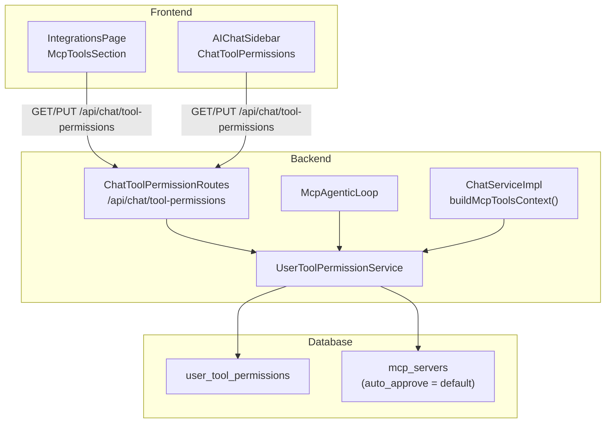

# Per-User Tool Permissions — Design

## Tổng quan

Feature này chuyển đổi hệ thống quản lý quyền MCP tools từ global (`mcp_servers.auto_approve`) sang per-user (`user_tool_permissions`). Mô hình đơn giản: mỗi tool có 2 trạng thái `enabled` hoặc `disabled` per-user.

- `enabled` = AI có thể sử dụng tool (tool xuất hiện trong system prompt)
- `disabled` = AI không thể sử dụng tool (tool bị ẩn khỏi system prompt)

Không có confirmation flow. Không có reject. Giống mô hình Kiro IDE.

### Phạm vi ảnh hưởng

| Layer | Files bị ảnh hưởng |
|-------|-------------------|
| Database | `KnowledgeBase.sq` — thêm bảng `user_tool_permissions` |
| Shared | `UserToolPermissionRepository.kt` (mới), DTOs mới |
| Backend | `ChatToolPermissionRoutes.kt` (mới), `McpAgenticLoop.kt`, `ChatServiceImpl.kt`, `ServerModule.kt` |
| Frontend | `McpToolsSection.kt`, `McpServerCards.kt`, `ChatToolPermissions.kt` (mới), `ai-chat-sidebar.html` |

---

## Kiến trúc



### Enable/Disable Flow

```
User toggle OFF tool "search_docs" trên server "aws-docs"
  → PUT /api/chat/tool-permissions {"aws-docs::search_docs": "disabled"}
  → Lưu vào user_tool_permissions

User gửi chat message
  → ChatServiceImpl.buildMcpToolsContext()
    → PermService.getEnabledTools(userId)
    → Filter: chỉ inject enabled tools vào system prompt
  → AI không biết tool "search_docs" tồn tại → không gọi
  
User toggle ON lại
  → PUT /api/chat/tool-permissions {"aws-docs::search_docs": "enabled"}
  → Lần chat tiếp theo, tool xuất hiện lại trong system prompt
```

---

## Data Models

### SQLDelight Schema

```sql
CREATE TABLE user_tool_permissions (
    user_id TEXT NOT NULL PRIMARY KEY,
    permissions_json TEXT NOT NULL DEFAULT '{}',
    updated_at TEXT NOT NULL
);

findUserToolPermissions:
SELECT * FROM user_tool_permissions WHERE user_id = ?;

upsertUserToolPermissions:
INSERT OR REPLACE INTO user_tool_permissions (user_id, permissions_json, updated_at) VALUES (?, ?, ?);

deleteUserToolPermissions:
DELETE FROM user_tool_permissions WHERE user_id = ?;
```


### `permissions_json` Format

```json
{
  "aws-docs::search_documentation": "enabled",
  "aws-docs::get_document": "disabled",
  "jira-assistant-ui::start_scan": "disabled"
}
```

Key format: `{serverId}::{toolName}`. Tool không có trong map = `enabled` (default).

### Shared DTOs

```kotlin
// shared/src/commonMain/kotlin/com/assistant/chat/ToolPermissionDtos.kt

@Serializable
data class ToolPermissionsResponse(
    val permissions: Map<String, String>,  // "serverId::toolName" → "enabled"|"disabled"
    val defaults: Map<String, String>      // global defaults từ mcp_servers.auto_approve
)

@Serializable
data class ToolPermissionsUpdateRequest(
    val permissions: Map<String, String>
)

@Serializable
data class ToolPermissionsBulkRequest(
    val serverId: String,
    val action: String  // "enable_all" | "disable_all"
)
```

---

## Components và Interfaces

### 1. UserToolPermissionRepository (shared)

```kotlin
interface UserToolPermissionRepository {
    suspend fun findByUserId(userId: String): Map<String, String>?
    suspend fun save(userId: String, permissions: Map<String, String>)
    suspend fun delete(userId: String)
}
```

### 2. UserToolPermissionService (Backend)

```kotlin
class UserToolPermissionService(
    private val permRepo: UserToolPermissionRepository,
    private val mcpServerRepo: McpServerRepository
) {
    /** Lấy effective permissions cho user. Req: 3.2 */
    suspend fun getEffectivePermissions(userId: String): ToolPermissionsResponse

    /** Kiểm tra tool có enabled cho user không. Req: 6.1 */
    suspend fun isEnabled(userId: String, serverId: String, toolName: String): Boolean

    /** Lấy danh sách enabled tool keys cho user (dùng cho system prompt filter). Req: 1.3, 6.4 */
    suspend fun getDisabledTools(userId: String): Set<String>

    /** Lưu permissions per-user. Validate trước khi lưu. Req: 3.3 */
    suspend fun savePermissions(userId: String, permissions: Map<String, String>): Result<Unit>

    /** Bulk enable/disable tất cả tools của 1 server. Req: 3.6 */
    suspend fun bulkUpdate(userId: String, serverId: String, action: String): Result<Unit>

    /** Validate format. Req: 3.7 */
    fun validate(permissions: Map<String, String>): Result<Unit>
}
```

### 3. API Endpoints

| Endpoint | Method | Auth | Mô tả |
|----------|--------|------|--------|
| `/api/chat/tool-permissions` | GET | JWT Reader+ | Lấy tool permissions per-user + defaults |
| `/api/chat/tool-permissions` | PUT | JWT Reader+ | Cập nhật tool permissions per-user |
| `/api/chat/tool-permissions/bulk` | PUT | JWT Reader+ | Bulk enable/disable tools của 1 server |

### 4. Koin Registration

```kotlin
single<UserToolPermissionRepository> { UserToolPermissionRepositoryImpl(get()) }
single { UserToolPermissionService(permRepo = get(), mcpServerRepo = get()) }
```

---

## Thay đổi McpAgenticLoop

```kotlin
// executeToolWithLocalRouting — thêm check isEnabled
private suspend fun executeToolWithLocalRouting(...): String {
    // Check per-user permission
    val key = "${req.serverId}::${req.toolName}"
    if (permService != null && userId != null) {
        if (!permService.isEnabled(userId, req.serverId, req.toolName)) {
            return "Tool '${req.toolName}' is disabled by user"
        }
    }
    // ... existing routing logic
}
```

## Thay đổi ChatServiceImpl — System Prompt Filter

```kotlin
// buildMcpToolsContext() — filter disabled tools
internal fun buildMcpToolsContext(userId: String?): String {
    val disabledTools = if (userId != null && permService != null) {
        runBlocking { permService.getDisabledTools(userId) }
    } else emptySet()
    
    val internalTools = internalMcpBridge?.getAggregatedTools()
        ?.filter { "${it.serverId}::${it.name}" !in disabledTools }
    val externalTools = mcpProcessManager?.getActiveTools()
        ?.filter { "${it.serverId}::${it.name}" !in disabledTools }
    // ... build prompt with filtered tools only
}
```

---

## Frontend Components

### 1. ChatToolPermissions.kt (mới)

Path: `frontend/src/jsMain/kotlin/com/assistant/frontend/components/chat/ChatToolPermissions.kt`

- Section "🔧 Tool Permissions" trong AI Chat Sidebar (collapsible)
- Load từ `GET /api/chat/tool-permissions`
- Toggle switch per-tool (ON = enabled, OFF = disabled)
- "Enable All" / "Disable All" per server group
- Counter "X / Y enabled"
- Label "(default)" khi user chưa tùy chỉnh

### 2. McpToolsSection.kt (cập nhật)

- Toggle đọc/ghi từ `GET/PUT /api/chat/tool-permissions` per-user
- Bulk actions gọi `PUT /api/chat/tool-permissions/bulk`
- Tooltip: "Enabled — AI có thể sử dụng" / "Disabled — AI không thể sử dụng"

### 3. McpServerCards.kt (cập nhật)

- `createBuiltinBadge()` → đổi "Built-in" thành "LOCAL", class `local-kb-type-badge`

---

## Correctness Properties

### Property 1: Disabled tools are not injected into system prompt

*For any* userId và tool có trạng thái `disabled`, tool đó SHALL KHÔNG xuất hiện trong system prompt injection. Số tools trong prompt = tổng tools - disabled tools.

**Validates: Requirements 1.3, 6.4**

### Property 2: Disabled tools are skipped in agentic loop

*For any* tool call trong agentic loop, nếu tool có trạng thái `disabled` cho user hiện tại, agentic loop SHALL skip tool và trả message "disabled by user".

**Validates: Requirements 1.2, 6.1**

### Property 3: Permissions round-trip

*For any* valid permissions map, saving via PUT then reading via GET SHALL return the same map.

**Validates: Requirements 3.2, 3.3**

### Property 4: Default = all enabled

*For any* user chưa có bản ghi, tất cả tools SHALL có trạng thái `enabled`.

**Validates: Requirements 3.4, 6.2**

### Property 5: Per-user isolation

*For any* user có bản ghi, thay đổi global `auto_approve` SHALL KHÔNG ảnh hưởng permissions đã lưu.

**Validates: Requirements 3.5, 5.5**

### Property 6: Validation rejects invalid entries

*For any* permissions map với key không đúng format hoặc value không phải `enabled`/`disabled`, validate SHALL fail.

**Validates: Requirements 3.7**

### Property 7: Bulk update applies to all tools

*For any* server với N tools, `enable_all` → tất cả N tools enabled. `disable_all` → tất cả N tools disabled.

**Validates: Requirements 3.6**

---

## Error Handling

| Tình huống | Xử lý | HTTP Code |
|-----------|-------|-----------|
| JWT missing/invalid | 401 Unauthorized | 401 |
| Validation thất bại | 400 Bad Request | 400 |
| DB query thất bại | Fallback: tất cả tools enabled, log WARN | — |
| serverId không tồn tại (bulk) | 404 Not Found | 404 |
| action không hợp lệ (bulk) | 400 Bad Request | 400 |

### Fallback Chain

```
1. Check user_tool_permissions (per-user)
   ↓ (nếu không có bản ghi hoặc DB error)
2. Default: tất cả tools enabled
```
