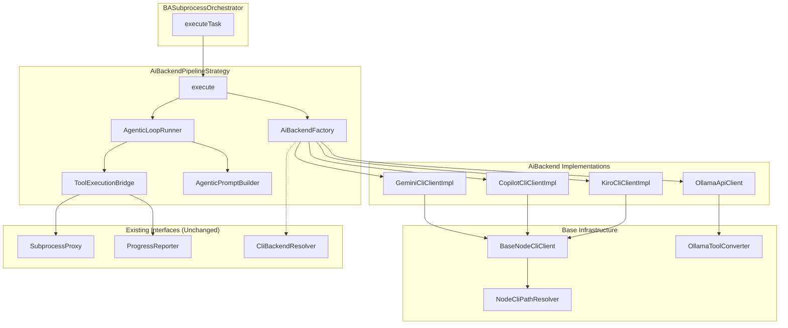
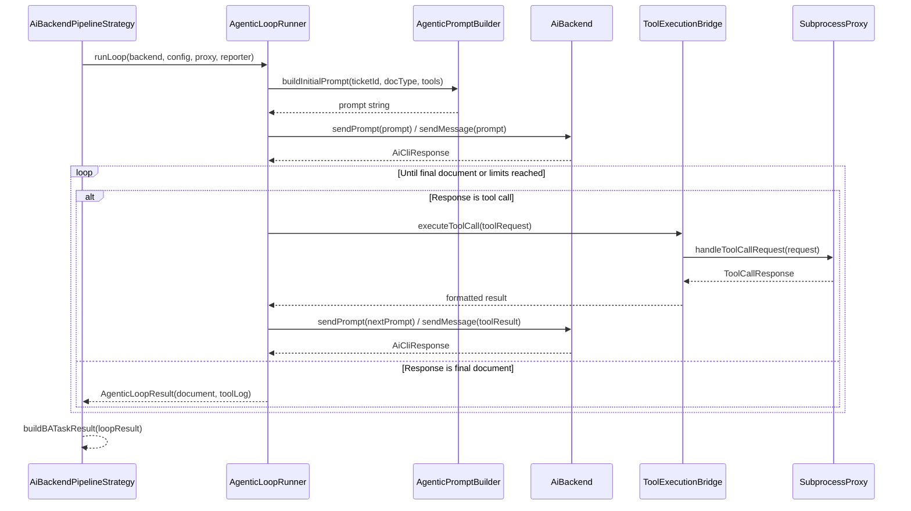

# Design Document: POC Agent Replacement

## Overview

This design replaces the current `CliInteractiveStrategy` (and its `cli/` sub-package) with the proven POC architecture from `poc/AgentCLI-Interaction/`. The core change is introducing a transport-agnostic `AiBackend` interface hierarchy that supports both CLI-based backends (Gemini, Copilot, Kiro) and API-based backends (Ollama), with stateless and persistent process modes.

### Key Design Decisions

1. **Port POC code, don't wrap it** — Adapt POC classes to use existing project types (`SubprocessProxy`, `ToolDescriptor`, `BATaskConfig`, `BATaskResult`) rather than creating adapters or shims.
2. **Tool execution through SubprocessProxy** — The POC's `ToolExecutor` (which hardcodes Jira tools) is replaced by `ToolExecutionBridge`, which converts POC `ToolRequest` → `ToolCallRequest` → `SubprocessProxy` → `ToolCallResponse` → POC protocol format.
3. **AiBackendPipelineStrategy as the new default** — Implements `PipelineStrategy`, delegates to `AgenticLoopRunner` for the iterative tool-call loop.
4. **Preserve CliBackendResolver for settings-based config** — `NodeCliPathResolver` handles JS path detection, but `CliBackendResolver` still provides settings/provider-config-based configuration for Ollama model/baseUrl.
5. **Ollama uses native tool calling** — Not the JSON text protocol used by CLI backends. `OllamaToolConverter` maps `ToolDescriptor` → Ollama's JSON Schema format.
6. **BaseNodeCliClient handles both STATELESS and PERSISTENT modes** — Concrete clients (Gemini, Copilot, Kiro) only define backend-specific command arguments.

### What Changes vs. What Stays

| Component | Status |
|-----------|--------|
| `PipelineStrategy` interface | **Unchanged** |
| `BATaskConfig`, `BATaskResult`, `ToolCallLogEntry` | **Unchanged** |
| `SubprocessProxy`, `ToolCallRequest/Response` | **Unchanged** |
| `ProgressReporter` | **Unchanged** |
| `CliBackendResolver` | **Modified** — added public `resolveModel(backend)` method for factory model resolution |
| `BASubprocessOrchestrator` | **Modified** — default strategy changes to `AiBackendPipelineStrategy`; `doExecuteTask()` skips `CliBackendResolver.resolve()` for Ollama backend since Ollama uses REST API, not CLI path |
| `CliInteractiveStrategy` + `cli/` sub-package | **Kept as fallback** — no longer default |
| `MultiTurnPipelineStrategy` | **Kept as fallback** |
| `aibackend/` package (all new files) | **New** — ported from POC |

## Architecture

### Component Diagram



### Agentic Loop Sequence



## Components and Interfaces

### 1. AiBackend Interface Hierarchy

**File:** `aibackend/AiBackend.kt`

```kotlin
interface AiBackend {
    val displayName: String

    // Stateless mode
    fun sendPrompt(prompt: String): AiCliResponse

    // Session mode
    fun startSession()
    fun sendMessage(message: String): AiCliResponse
    fun endSession()
    fun isSessionActive(): Boolean

    // Tool handling
    fun isToolCall(response: String): Boolean
    fun parseToolCall(response: String): ToolRequest?

    // Availability
    fun isInstalled(): Boolean
    fun getInstallInstructions(): String
}
```

**File:** `aibackend/AiCliClient.kt`

```kotlin
interface AiCliClient : AiBackend {
    val type: AiCliType
    var processMode: ProcessMode
}
```

**File:** `aibackend/AiApiClient.kt`

```kotlin
interface AiApiClient : AiBackend {
    val baseUrl: String
    val model: String
}
```

**Rationale:** Ported directly from POC. The hierarchy separates transport concerns (CLI vs API) from the common contract (`AiBackend`). `AiBackendPipelineStrategy` depends only on `AiBackend`, enabling uniform handling of all backends.

### 2. BaseNodeCliClient

**Files:** `aibackend/BaseNodeCliClient.kt` + `aibackend/BaseNodeCliClientHelpers.kt`

Split into two files to stay within the 200-line limit. The helpers file contains internal functions for stateless and streaming process execution (`executeStatelessProcess`, `executeStreamProcess`), output reading, and NDJSON stream event parsing via a `StreamEvent` sealed class.

Abstract base class handling:
- Process spawning via `ProcessBuilder` with `nodePath` + `cliJsPath` + args
- **STATELESS mode:** spawn → write stdin → close stdin → read stdout → wait for exit
- **PERSISTENT mode:** spawn with stream-json → read NDJSON line-by-line → detect `"type":"result"` → resume with `--resume latest` on subsequent calls
- Stderr reading in background daemon thread to prevent blocking
- Timeout enforcement via `process.waitFor(timeoutSeconds, TimeUnit.SECONDS)` + `destroyForcibly()`
- Lazy path resolution via `NodeCliPathResolver`
- Tool call parsing using POC protocol: `{"type":"tool_call","tool":"...","params":{...}}`

Concrete subclasses only override:
- `cliConfig: NodeCliConfig` — command name, npm package, JS entry path
- `buildCommandArgs(prompt)` — stateless mode CLI args
- `buildPersistentCommandArgs(isResume)` — persistent mode CLI args
- `getInstallInstructions()` — human-readable install guide

### 3. NodeCliPathResolver

**File:** `aibackend/NodeCliPathResolver.kt`

Ported from POC with SLF4J logging replacing custom `Logger`. Resolution strategy:
1. Find executable via OS command (`where` on Windows, `which` on Unix)
2. Read script wrapper content, extract JS path via configurable regex patterns
3. Infer JS path from script location (check relative `node_modules/` paths)
4. Fall back to common global npm paths (OS-specific: Scoop, nvm, APPDATA, /usr/local/lib)

### 4. Concrete CLI Clients

| File | Type | Config |
|------|------|--------|
| `GeminiCliClientImpl.kt` | GEMINI | `commandName="gemini"`, `npmPackage="@google/gemini-cli"`, `jsEntryPath="bundle/gemini.js"`, accepts optional `model: String?` |
| `CopilotCliClientImpl.kt` | COPILOT | `commandName="copilot"`, `npmPackage="@github/copilot"`, `jsEntryPath="index.js"` |
| `KiroCliClientImpl.kt` | KIRO | `commandName="kiro-cli"`, `npmPackage="@amazon/kiro-cli"`, `jsEntryPath="dist/cli.js"` |

Each is ≤100 lines, defining only config + command args + install instructions. `GeminiCliClientImpl` includes `-m <model>` in command args when a model is provided.

### 5. OllamaApiClient

**Files:** `aibackend/ollama/OllamaApiClient.kt` + `aibackend/ollama/OllamaApiClientHelpers.kt`

Split into two files to stay within the 200-line limit. The helpers file (`OllamaApiClientHelpers`) is an internal object containing stateless functions for tool call detection, HTTP communication, streaming response reading, and response building.

Ported from POC with these adaptations:
- Uses Ktor `HttpClient` (CIO engine) with `HttpTimeout` plugin configured from `timeoutSeconds` parameter (default 300s) for request and socket timeouts, 10s connect timeout
- Tool definitions accepted as constructor parameter `tools: List<OllamaTool>` (provided by the strategy at creation time)
- Injectable `httpClient: HttpClient` constructor parameter for testing with Ktor `MockEngine`
- Conversation history managed in-memory for session mode (`internal val conversationHistory` for test access)
- `sendToolResult(toolName, result)` appends `role="tool"` message and re-sends history
- Streaming: reads NDJSON chunks, accumulates content until `done: true`
- Availability: GET to `baseUrl/`, returns `true` on 2xx

### 6. OllamaToolConverter

**Files:** `aibackend/ollama/OllamaToolConverter.kt` + `aibackend/ollama/McpToolConverter.kt`

Two converter paths:
- `ToolDescriptor.toOllamaTool()` — converts project's `ToolDescriptor` (parameter names only, no types) to `OllamaTool`. All parameters default to `type = "string"`. Used in tests.
- `McpAggregatedTool.toOllamaTool()` — converts MCP tools directly to `OllamaTool`, preserving full JSON Schema from `inputSchema` (parameter types, descriptions, required list). Used in production when `McpProcessManager` is available.

### 7. AiBackendFactory

**File:** `aibackend/AiBackendFactory.kt`

```kotlin
class AiBackendFactory(
    private val cliBackendResolver: CliBackendResolver
) {
    suspend fun create(cliBackend: String): Result<AiBackend>
}
```

Model resolution is delegated to `CliBackendResolver.resolveModel(backend)`, which checks `ProviderConfigRepository` first, then `SettingsRepository` as fallback. This ensures the factory uses the same model resolution logic as the rest of the system.

Mapping:
- `"gemini"` → `GeminiCliClientImpl(model)` with model from `cliBackendResolver.resolveModel("gemini")`
- `"copilot"` → `CopilotCliClientImpl`
- `"kiro"` → `KiroCliClientImpl`
- `"ollama"` → `OllamaApiClient` with default `baseUrl` (`http://localhost:11434`) and `model` from `cliBackendResolver.resolveModel("ollama")` (default `batiai/gemma4-e2b:q4`)

Returns `Result.failure` for unsupported backend names.

### 8. AgenticLoopRunner

**Files:** `aibackend/AgenticLoopRunner.kt` + `aibackend/AgenticLoopHelpers.kt`

Split into two files. The helpers file contains `LoopState` (internal mutable state tracker for tool call accumulation and failure tracking), `shouldUseSessionMode()` (mode selection logic), and `buildTimeoutResult()`. The main file contains the loop orchestration and a `determineStatus()` companion function for `BATaskStatus` mapping.

Core agentic loop logic, extracted from POC's `BrdAgent.generateBrd()`:

```kotlin
class AgenticLoopRunner(
    private val toolBridge: ToolExecutionBridge,
    private val promptBuilder: AgenticPromptBuilder
) {
    suspend fun runLoop(
        backend: AiBackend,
        config: AgenticLoopConfig,
        progressReporter: ProgressReporter
    ): AgenticLoopResult
}
```

Loop behavior:
1. Build initial prompt with tool definitions and ticket context
2. Send to backend (stateless: `sendPrompt`, session: `sendMessage`)
3. Detect tool calls using 3-strategy parsing (ported from POC's `BrdAgent.tryParseToolCall`):
   - Strategy 1: Backend's native `isToolCall`/`parseToolCall` (full JSON response)
   - Strategy 2: Regex search for `{"type":"tool_call",...}` embedded in response text
   - Strategy 3: Direct JSON decode of entire response
4. If tool call found → execute via bridge → send result back; if not → treat as final document
5. Enforce `maxToolCalls` — when reached, send "produce final document" message
6. Enforce `taskTimeoutSeconds` via `withTimeoutOrNull`
7. Track consecutive parse failures (3+ → exit loop)
8. Track tool call log entries for `BATaskResult`

Mode selection:
- `AiApiClient` → always session mode (`startSession` → `sendMessage` loop → `endSession`)
- `AiCliClient` with `ProcessMode.PERSISTENT` → session mode
- `AiCliClient` with `ProcessMode.STATELESS` → stateless mode (rebuild full prompt each iteration)

### 9. ToolExecutionBridge

**File:** `aibackend/ToolExecutionBridge.kt`

Bridges tool calls to `SubprocessProxy`, `McpProcessManager`, or `InternalMcpBridge`:

```kotlin
class ToolExecutionBridge(
    private val subprocessProxy: SubprocessProxy,
    private val progressReporter: ProgressReporter,
    private val mcpProcessManager: McpProcessManager? = null,
    private val internalMcpBridge: InternalMcpBridge? = null
) {
    suspend fun execute(toolRequest: ToolRequest): ToolBridgeResult
}
```

Routing logic (priority order):
1. When tool name starts with `mcp_`, check **internal tools first** via `internalMcpBridge.getAggregatedTools()` — matches by full prefixed name `mcp_{serverName}_{toolName}`. Internal tool calls use `internalMcpBridge.callTool()` with `userId = "ba-agent"` and `userRole = "ADMINISTRATOR"` (must match `UserRole` enum exactly).
2. Then check **external tools** via `mcpProcessManager.getActiveTools()` — matches by full prefixed name, routes to `mcpProcessManager.getClient(serverId).callTool()`.
3. Otherwise falls back to `SubprocessProxy.handleToolCallRequest()`

MCP tool name parsing: `mcp_{serverName}_{toolName}` → finds matching `McpAggregatedTool` → gets client by `serverId` → calls tool with original name.

Conversion flow:
1. `ToolRequest(tool, params)` → `ToolCallRequest(id=UUID, name=tool, arguments=params)`
2. `subprocessProxy.handleToolCallRequest(request)` → `ToolCallResponse`
3. Format result:
   - **CLI backends:** `{"type":"tool_result","tool":"...","success":true/false,"data":{...},"error":"..."}`
   - **Ollama:** Return raw data for `OllamaApiClient.sendToolResult()`
4. Report to `ProgressReporter.reportToolCall(toolName, status)`
5. Create `ToolCallLogEntry(toolName, durationMs, success, resultSizeChars)`

### 10. AgenticPromptBuilder

**File:** `aibackend/AgenticPromptBuilder.kt`

Builds prompts following the POC's proven structure:

```kotlin
class AgenticPromptBuilder(
    private val subprocessProxy: SubprocessProxy,
    private val mcpProcessManager: McpProcessManager? = null,
    private val internalMcpBridge: InternalMcpBridge? = null
)
```

Tool source (priority order):
1. Combines `internalMcpBridge.getAggregatedTools()` (30 internal Jira/KB tools) + `mcpProcessManager.getActiveTools()` (external MCP tools from database/Integrations page)
2. Falls back to `subprocessProxy.getAvailableToolDescriptors()` only when no MCP tools are available

Key design decisions:
- **No hardcoded whitelist** — all tools are passed to the AI, letting the model choose which tools to call. Only a small blacklist (`EXCLUDED_PATTERNS`: `playwright`, `browser`, `convert_to_markdown`) removes clearly irrelevant tools.
- **Compact tool descriptions:** Only first line of description (max 120 chars) + parameter names, instead of full multi-paragraph descriptions.
- **Deep data collection strategy:** Instead of a simple 2-step "get issue → write BRD" instruction, the prompt includes a 5-step DATA COLLECTION STRATEGY that guides the AI to thoroughly explore the ticket ecosystem before writing.
- **BRD structure template:** Sections matching `BrdPromptBuilder.BRD_SECTIONS` as single source of truth

**File:** `aibackend/AgenticDataStrategy.kt` (extracted for SRP)

The data collection strategy dynamically adapts based on available tools:
1. **Step 1 — Get main ticket:** Call `get_issue` (or first available tool), extract summary, linked issues, attachments, comments
2. **Step 2 — Get existing analysis:** Call `get_ticket_analysis` or `analyze_ticket` if available (returns stored AI analysis with deeper insights)
3. **Step 3 — Explore linked tickets:** For each linked ticket found in Step 1, call get_issue for parent, subtasks, and related issues
4. **Step 4 — Search related context:** Use search/graph tools to find related tickets in the same project
5. **Step 5 — Write BRD:** Only after collecting data from Steps 1-4, produce the complete BRD with real data

The strategy detects tool availability (`hasAnalyzeTool`, `hasSearchTool`, `hasGetAnalysis`) and adjusts instructions accordingly — skipping steps when relevant tools are not available.

Prompt modes:
- **Initial prompt:** System instructions → all tools (minus excluded) → protocol rules → BRD structure → data collection strategy with ticket ID
- **Stateless continuation:** Context header → tools (minus excluded) → protocol → BRD structure → collected data → next step guidance
- **Persistent continuation:** Minimal message with latest tool result + continuation instruction

### 11. AiBackendPipelineStrategy

**File:** `pipeline/AiBackendPipelineStrategy.kt`

```kotlin
class AiBackendPipelineStrategy(
    private val subprocessProxy: SubprocessProxy,
    private val cliBackendResolver: CliBackendResolver,
    private val mcpProcessManager: McpProcessManager? = null,
    private val internalMcpBridge: InternalMcpBridge? = null
) : PipelineStrategy {
    override suspend fun execute(
        config: BATaskConfig,
        progressReporter: ProgressReporter
    ): BATaskResult
}
```

The `mcpProcessManager` parameter provides access to external MCP tools from the database (Integrations page). The `internalMcpBridge` parameter provides access to internal tools (Jira Assistant UI — 30 tools, Local Knowledge Base — 3 tools). Both are passed through to `AgenticPromptBuilder` and `ToolExecutionBridge`.

For Ollama backends, `configureOllamaTools()` combines internal tools (`internalMcpBridge.getAggregatedTools()`) + external tools (`mcpProcessManager.getActiveTools()`), converts them to `OllamaTool` via `McpToolConverter.toOllamaTool()`, and filters only by `EXCLUDED_PATTERNS` (playwright, browser, convert_to_markdown). No hardcoded whitelist — all eligible tools are passed to Ollama's native tool calling.

Orchestration:
1. Create `AiBackend` via `AiBackendFactory.create(config.cliBackend)`
2. Check `backend.isInstalled()` → return FAILED if not
3. For Ollama backends: combine internal + external tools, exclude irrelevant ones, convert via `McpToolConverter`, and re-create `OllamaApiClient` with the tools
4. Create `ToolExecutionBridge` and `AgenticPromptBuilder` with both `mcpProcessManager` and `internalMcpBridge`
5. Run `AgenticLoopRunner.runLoop(backend, loopConfig, progressReporter)` with `ProcessMode.STATELESS`
6. Convert `AgenticLoopResult` → `BATaskResult` with correct status
7. Report progress 100% "Complete"

The strategy uses `ProcessMode.STATELESS` for CLI backends. In STATELESS mode, each agentic loop iteration spawns a new Gemini CLI process with `--output-format json`, and the AI response text is parsed for embedded tool_call JSON between invocations. Note: `GeminiCliClientImpl` overrides `sendMessage()` for PERSISTENT mode to also use json output (not stream-json) + `--resume latest`, because stream-json mode causes Gemini CLI to process tool calls internally via its own MCP, bypassing the agentic loop.

Status determination:
- `SUCCESS` — non-empty document, all tool calls succeeded
- `PARTIAL` — non-empty document, some tool calls failed
- `TIMEOUT` — loop timed out
- `FAILED` — empty document or backend unavailable

## Data Models

### New Models (`aibackend/models/AiBackendModels.kt`)

```kotlin
@Serializable
data class AiCliResponse(
    val response: String,
    val sessionId: String? = null,
    val rawJson: String? = null,
    val metadata: Map<String, String> = emptyMap()
)

enum class AiCliType { GEMINI, COPILOT, KIRO }

enum class ProcessMode { STATELESS, PERSISTENT }

data class NodeCliConfig(
    val commandName: String,
    val npmPackage: String,
    val jsEntryPath: String,
    val jsPathPatterns: List<Regex> = emptyList()
)

data class ResolvedPaths(
    val nodePath: String,
    val jsPath: String?
)

@Serializable
data class ToolRequest(
    val type: String = "tool_call",
    val tool: String,
    val params: Map<String, String> = emptyMap()
)
```

### New Models (`aibackend/models/AgenticLoopModels.kt`)

```kotlin
data class AgenticLoopConfig(
    val ticketId: String,
    val docType: String,
    val maxToolCalls: Int,
    val taskTimeoutSeconds: Int,
    val processMode: ProcessMode = ProcessMode.STATELESS
)

data class AgenticLoopResult(
    val document: String,
    val toolCallLog: List<ToolCallLogEntry>,
    val toolCallsExecuted: Int,
    val toolCallsFailed: Int,
    val timedOut: Boolean,
    val totalDurationMs: Long
)

data class ToolBridgeResult(
    val formattedResult: String,
    val logEntry: ToolCallLogEntry,
    val rawResponse: ToolCallResponse
)
```

### Ollama Models (`aibackend/ollama/OllamaModels.kt` + `aibackend/ollama/OllamaToolModels.kt`)

Split into two files to stay within the 200-line limit. `OllamaModels.kt` contains chat request/response types, `OllamaToolModels.kt` contains tool definition types.

Ported from POC with `@Serializable` annotations and `@SerialName` for JSON field mapping:

```kotlin
@Serializable
data class OllamaChatRequest(
    val model: String,
    val messages: List<OllamaChatMessage>,
    val stream: Boolean = true,
    val tools: List<OllamaTool>? = null,
    val options: OllamaOptions? = null
)

@Serializable
data class OllamaChatMessage(
    val role: String,
    val content: String = "",
    @SerialName("tool_calls")
    val toolCalls: List<OllamaToolCall>? = null
)

@Serializable
data class OllamaChatResponse(
    val model: String = "",
    val message: OllamaChatMessage = OllamaChatMessage(role = "assistant"),
    val done: Boolean = false,
    @SerialName("done_reason") val doneReason: String? = null,
    @SerialName("total_duration") val totalDuration: Long? = null,
    @SerialName("eval_count") val evalCount: Int? = null
)

@Serializable data class OllamaOptions(
    val temperature: Double? = null,
    @SerialName("num_predict") val numPredict: Int? = null
)

@Serializable data class OllamaTool(
    val type: String = "function",
    val function: OllamaToolFunction
)

@Serializable data class OllamaToolFunction(
    val name: String,
    val description: String,
    val parameters: OllamaToolParameters
)

@Serializable data class OllamaToolParameters(
    val type: String = "object",
    val properties: Map<String, OllamaToolProperty>,
    val required: List<String> = emptyList()
)

@Serializable data class OllamaToolProperty(
    val type: String,
    val description: String
)

@Serializable data class OllamaToolCall(
    val function: OllamaToolCallFunction
)

@Serializable data class OllamaToolCallFunction(
    val name: String,
    val arguments: Map<String, String> = emptyMap()
)
```

### Existing Models (Unchanged)

- `BATaskConfig` — input config with `rootTicketId`, `docType`, `maxToolCalls`, `taskTimeoutSeconds` (default 600s), `cliBackend`
- `BATaskResult` — output with `document`, `toolCallsExecuted`, `toolCallsFailed`, `totalDurationMs`, `status`, `toolCallLog`
- `BATaskStatus` — `SUCCESS`, `PARTIAL`, `TIMEOUT`, `FAILED`
- `ToolCallLogEntry` — `toolName`, `durationMs`, `success`, `resultSizeChars`
- `ToolCallRequest` — `id`, `name`, `arguments`
- `ToolCallResponse` — `id`, `success`, `data`, `error`
- `ToolDescriptor` — `name`, `description`, `parameterNames`

## Correctness Properties

*A property is a characteristic or behavior that should hold true across all valid executions of a system — essentially, a formal statement about what the system should do. Properties serve as the bridge between human-readable specifications and machine-verifiable correctness guarantees.*

### Property 1: Tool call parsing round-trip for CLI backends

*For any* valid POC tool call JSON string of the form `{"type":"tool_call","tool":"<name>","params":{<key-value pairs>}}`, calling `isToolCall(json)` SHALL return `true` and `parseToolCall(json)` SHALL return a `ToolRequest` with matching `tool` and `params` fields. *For any* string that is not valid tool call JSON, `isToolCall` SHALL return `false`.

**Validates: Requirements 1.3, 3.7**

### Property 2: Script path regex extraction

*For any* script file content containing a JS path matching the configured regex patterns (with known npm package and JS entry path embedded), `extractJsPathFromScript()` SHALL extract a non-null path string that ends with the expected JS entry filename.

**Validates: Requirements 2.2**

### Property 3: Ollama tool_calls parsing

*For any* valid `OllamaChatResponse` JSON containing a non-empty `tool_calls` array, `isToolCall(json)` SHALL return `true` and `parseToolCall(json)` SHALL return a `ToolRequest` with `tool` matching the first tool call's function name and `params` matching its arguments.

**Validates: Requirements 7.3**

### Property 4: Conversation history preservation in session mode

*For any* sequence of N `sendMessage()` calls on an `OllamaApiClient` in session mode, the internal conversation history SHALL contain at least N user messages in the order they were sent.

**Validates: Requirements 7.5**

### Property 5: ToolDescriptor to OllamaTool conversion with type mapping

*For any* valid `ToolDescriptor` with N parameter names, `toOllamaTool()` SHALL produce an `OllamaTool` where: (a) `function.name` equals the descriptor's name, (b) `function.description` equals the descriptor's description, (c) `function.parameters.properties` has exactly N entries, and (d) each property type is a valid JSON Schema type string (`"string"`, `"integer"`, `"number"`, `"boolean"`, or `"array"`). For unrecognized input types, the output type SHALL default to `"string"`.

**Validates: Requirements 8.1, 8.2, 8.3**

### Property 6: maxToolCalls enforcement

*For any* `maxToolCalls` value M > 0 and an AI backend that always requests tool calls, the agentic loop SHALL execute at most M tool calls before requesting the final document.

**Validates: Requirements 9.5**

### Property 7: Tool call bridge conversion and logging

*For any* `ToolRequest` with a non-empty tool name and arbitrary params, `ToolExecutionBridge.execute()` SHALL produce a `ToolBridgeResult` where: (a) the `logEntry.toolName` matches the request's tool name, (b) `logEntry.durationMs >= 0`, (c) `logEntry.success` matches the `SubprocessProxy` response's success field, and (d) a valid correlation UUID was generated for the `ToolCallRequest`.

**Validates: Requirements 10.1, 10.6**

### Property 8: Tool result POC protocol formatting

*For any* tool name, success boolean, data string, and error string, the formatted POC protocol result SHALL be valid JSON containing `"type":"tool_result"`, the tool name, the success value, and the data/error strings.

**Validates: Requirements 10.3**

### Property 9: BATaskResult status determination

*For any* agentic loop result: (a) if `timedOut` is true, status SHALL be `TIMEOUT`; (b) if document is empty and not timed out, status SHALL be `FAILED`; (c) if document is non-empty and `toolCallsFailed > 0`, status SHALL be `PARTIAL`; (d) if document is non-empty and `toolCallsFailed == 0`, status SHALL be `SUCCESS`. The `toolCallLog` SHALL contain entries in execution order with size equal to `toolCallsExecuted`.

**Validates: Requirements 12.1, 12.2, 12.3, 12.4, 12.5**

### Property 10: Prompt building contains required sections

*For any* ticket ID, document type, and non-empty tool descriptor list, the built initial prompt SHALL contain: (a) the ticket ID, (b) at least one tool name from the descriptor list, (c) the POC tool protocol format instructions, and (d) the document type template reference.

**Validates: Requirements 15.1, 15.4, 15.5**

## Error Handling

### Backend Unavailable

When `AiBackend.isInstalled()` returns `false`, `AiBackendPipelineStrategy` returns a `BATaskResult` with:
- `status = FAILED`
- `document = getInstallInstructions()` (so the user sees how to fix it)
- `toolCallsExecuted = 0`

### Process Timeout

`BaseNodeCliClient` enforces `timeoutSeconds` via `process.waitFor()`. On timeout:
- Process is force-killed via `destroyForcibly()`
- `RuntimeException` is thrown with descriptive message
- `AgenticLoopRunner` catches this and marks the loop as timed out

### Agentic Loop Timeout

`AgenticLoopRunner` wraps the entire loop in `withTimeoutOrNull(taskTimeoutSeconds * 1000L)`. On timeout:
- Loop exits with `timedOut = true`
- Any partial document collected so far is preserved
- Status becomes `TIMEOUT`

### Tool Call Failures

`ToolExecutionBridge` never throws. All errors from `SubprocessProxy` are captured:
- `ToolCallResponse(success=false, error=...)` → formatted as error result for the AI
- `ToolCallLogEntry` records `success = false`
- AI receives the error and can decide to retry or proceed

### Network Errors (Ollama)

`OllamaApiClient` catches specific exceptions:
- `ConnectException` → "Cannot connect to Ollama server at {baseUrl}"
- `HttpTimeoutException` → "Request timed out after {timeout}s"
- HTTP 4xx/5xx → "Ollama API error (HTTP {code}): {body}"

### Consecutive Failure Circuit Breaker

The agentic loop tracks consecutive tool call failures. If 3+ consecutive failures occur, the loop sends a "produce final document with available data" message to prevent infinite retry loops.

### Stderr Reader Resilience (Windows)

On Windows, `startReader(process.errorStream)` in persistent mode may throw an exception with null message due to a race condition when the process is still initializing. `executeStreamProcess` wraps the stderr reader creation in a try-catch, allowing stream reading to proceed without stderr capture. This does not affect functionality — stderr is only used for debug logging.

## Testing Strategy

### Property-Based Tests (Kotest Property)

Each correctness property maps to a property-based test with minimum 100 iterations:

| Property | Test Class | Generator Strategy |
|----------|-----------|-------------------|
| P1: Tool call parsing | `ToolCallParsingPropertyTest` | Generate random tool names (alphanumeric), random param maps, build valid/invalid JSON |
| P2: Script regex extraction | `ScriptPathExtractionPropertyTest` | Generate random script content with embedded JS paths in known wrapper formats |
| P3: Ollama parsing | `OllamaToolCallParsingPropertyTest` | Generate random `OllamaChatResponse` JSON with/without tool_calls |
| P4: Conversation history | `ConversationHistoryPropertyTest` | Generate random message sequences, verify ordering (requires mock HTTP) |
| P5: ToolDescriptor conversion | `OllamaToolConverterPropertyTest` | Generate random `ToolDescriptor` objects with varying parameter counts and types |
| P6: maxToolCalls | `MaxToolCallsPropertyTest` | Generate random maxToolCalls values (1..50), mock backend always returning tool calls |
| P7: Bridge conversion | `ToolExecutionBridgePropertyTest` | Generate random `ToolRequest` objects, mock `SubprocessProxy` |
| P8: POC protocol format | `ToolResultFormattingPropertyTest` | Generate random tool names, booleans, data/error strings, verify JSON structure |
| P9: Status determination | `StatusDeterminationPropertyTest` | Generate random `AgenticLoopResult` combinations, verify status mapping |
| P10: Prompt building | `PromptBuildingPropertyTest` | Generate random ticket IDs, doc types, tool descriptor lists |

**Tag format:** `// Feature: poc-agent-replacement, Property {N}: {title}`

**Configuration:** Each test uses `checkAll(100) { ... }` from Kotest property testing, except P4 (conversation history, `checkAll(50)` due to MockEngine overhead) and P6 (maxToolCalls, `checkAll(50)` since each iteration runs a full agentic loop).

### Unit Tests (JUnit 5)

Example-based tests for deterministic behavior:

- `CliClientUnitTest` — verify `buildCommandArgs`, `buildPersistentCommandArgs`, `cliConfig` values, `parseResponse` for all three CLI clients (Gemini, Copilot, Kiro) using testable subclasses that expose protected methods
- `AiBackendFactoryTest` — verify each backend name maps to correct client type, unsupported names return failure, Ollama uses model from settings
- `BASubprocessOrchestratorTest` — verify `createDefaultStrategy()` returns `AiBackendPipelineStrategy`, `createMultiTurnStrategy()` returns `MultiTurnPipelineStrategy`

### Integration Tests

- `AgenticLoopIntegrationTest` — full loop with mocked `AiBackend` and `SubprocessProxy`, verifying end-to-end flow from prompt → tool calls → document, progress reporting percentages, SUCCESS/PARTIAL status determination

### Test Dependencies

All test dependencies are already available in `server/build.gradle.kts`:
- `io.kotest:kotest-property:5.9.1` — property-based testing
- `io.kotest:kotest-assertions-core:5.9.1` — assertions
- `org.junit.jupiter:junit-jupiter` — test framework
- `io.ktor:ktor-client-mock` — HTTP client mocking
