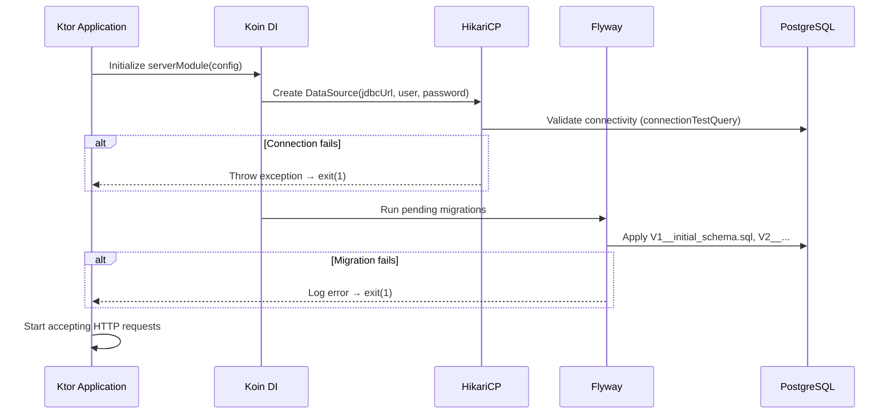

# Design Document: PostgreSQL + pgvector Migration

## Overview

This design provides the PostgreSQL + pgvector persistence layer for the Jira Assistant. The system uses PostgreSQL 16 with the pgvector extension for native vector storage and HNSW-indexed approximate nearest neighbor (ANN) search, HikariCP for connection pooling, and Flyway for versioned schema migrations.

The architecture has two layers:
1. **Infrastructure**: Docker Compose PostgreSQL service, JDBC driver, HikariCP connection pool
2. **Schema & Application**: Flyway-managed DDL migrations, `PgVectorStoreImpl`, PostgreSQL-backed repository implementations for all 10 repository interfaces

### Key Design Decisions

| Decision | Rationale |
|----------|-----------|
| HikariCP over raw JDBC | Industry-standard connection pooling; handles connection lifecycle, leak detection, and health checks |
| Flyway over Liquibase | Simpler SQL-first approach; team already uses raw SQL |
| HNSW over IVFFlat | Better recall at comparable latency; no need for periodic re-training |
| Raw JDBC over Exposed/R2DBC | Minimal new dependencies; repositories are simple CRUD; avoids ORM overhead |
| `vector(768)` fixed dimension | Matches Ollama nomic-embed-text output; pgvector validates dimension at insert time |
| PostgreSQL-only (no SQLite fallback) | Migration complete; single persistence path simplifies codebase and eliminates conditional wiring |

## Architecture

```mermaid
graph TB
    subgraph Docker Compose
        PG[(PostgreSQL 16<br/>+ pgvector)]
        APP[Ktor Server]
        OLLAMA[Ollama]
    end

    APP -->|HikariCP Pool| PG
    APP -->|HTTP /api/embed| OLLAMA

    subgraph Application Layer
        SM[ServerModule<br/>Koin DI]
        FW[Flyway<br/>Migrations]
        DM[Data Migration<br/>SQLite → PG]
    end

    subgraph Repository Layer
        PVS[PgVectorStoreImpl]
        PKB[PgKBRepository]
        PSS[PgScanStateRepository]
        PSL[PgScanLogRepository]
        PCR[PgChatRepository]
        PCC[PgChatConversationRepository]
        PUA[PgUserAIConfigRepository]
        PMS[PgMcpServerRepository]
        PSR[PgSettingsRepository]
        PPC[PgProviderConfigRepository]
        PUT[PgUserToolPermissionRepository]
    end

    SM --> FW
    SM --> DM
    SM --> PVS
    SM --> PKB
    SM --> PSS
    SM --> PSL
    SM --> PCR
    SM --> PCC
    SM --> PUA
    SM --> PMS
    SM --> PSR
    SM --> PPC
    SM --> PUT

    PVS -->|"<=> cosine distance"| PG
    PKB --> PG
    PSS --> PG
    PSL --> PG
    PCR --> PG
    PCC --> PG
    PUA --> PG
    PMS --> PG
    PSR --> PG
    PPC --> PG
    PUT --> PG
```



### Startup Sequence



## Components and Interfaces

### 1. DatabaseConfig

Reads PostgreSQL connection parameters from environment variables.

```kotlin
// server/src/jvmMain/kotlin/com/assistant/server/db/DatabaseConfig.kt
data class DatabaseConfig(
    val jdbcUrl: String,      // DATABASE_URL
    val username: String,     // DATABASE_USER (default: "postgres")
    val password: String,     // DATABASE_PASSWORD
    val maxPoolSize: Int,     // DATABASE_POOL_SIZE (default: 10)
    val connectionTimeout: Long // millis, default: 30_000
)
```

### 2. HikariCP DataSource Factory

```kotlin
// server/src/jvmMain/kotlin/com/assistant/server/db/DataSourceFactory.kt
object DataSourceFactory {
    fun create(config: DatabaseConfig): HikariDataSource
}
```

Creates a `HikariDataSource` with:
- `jdbcUrl`, `username`, `password` from config
- `maximumPoolSize` = config.maxPoolSize
- `connectionTimeout` = config.connectionTimeout
- `connectionTestQuery` = `"SELECT 1"`
- `poolName` = `"jira-assistant-pool"`

### 3. Flyway Migration Runner

```kotlin
// server/src/jvmMain/kotlin/com/assistant/server/db/FlywayMigrator.kt
object FlywayMigrator {
    fun migrate(dataSource: DataSource)
}
```

Configures Flyway with:
- `dataSource` from HikariCP
- `locations` = `"classpath:db/migration"`
- Runs `flyway.migrate()` on startup
- Logs migration info; throws on failure (application exits)

### 4. PgVectorStoreImpl

Implements the existing `VectorStore` interface using pgvector SQL operators. Split into two files to comply with the ≤200 lines/file code standard:

- `PgVectorStoreImpl.kt` — class with public `VectorStore` methods and private helpers
- `PgVectorStoreSql.kt` — `internal object` holding all SQL constant strings

```kotlin
// server/src/jvmMain/kotlin/com/assistant/server/db/pg/PgVectorStoreImpl.kt
class PgVectorStoreImpl(
    private val dataSource: DataSource,
    private val efSearch: Int = 40
) : VectorStore

// server/src/jvmMain/kotlin/com/assistant/server/db/pg/PgVectorStoreSql.kt
internal object PgVectorStoreSql { /* SQL constants */ }
```

Key methods:
- `search(queryEmbedding, topK, chunkType?)`: Executes `SET LOCAL hnsw.ef_search = $efSearch` (string interpolation — `SET LOCAL` does not support JDBC parameterized placeholders) then `SELECT ... ORDER BY embedding <=> ?::vector LIMIT ?`
- `saveChunk(chunk)`: Inserts with `?::vector` cast for the embedding column
- `deleteByProjectKey(projectKey, chunkType?)`: Uses `ticket_id LIKE ? || '-%'` to match all tickets under a project key
- All queries use `PreparedStatement` with parameterized values
- Embedding readback parses the `vector(768)` column as a string via `rs.getString("embedding")` and splits it into floats — avoids the `PGobject`→`PGvector` cast issue that occurs when the pgvector JDBC type is not explicitly registered with the connection

### 5. PostgreSQL Repository Implementations

Each repository follows the same pattern: takes a `DataSource`, uses `connection.prepareStatement()` for all queries.

| Repository Interface | PG Implementation | Package |
|---------------------|-------------------|---------|
| `KBRepository` | `PgKBRepository` | `server.db.pg` |
| `ScanStateRepository` | `PgScanStateRepository` | `server.db.pg` |
| `ScanLogRepository` | `PgScanLogRepository` | `server.db.pg` |
| `ChatRepository` | `PgChatRepository` | `server.db.pg` |
| `ChatConversationRepository` | `PgChatConversationRepository` | `server.db.pg` |
| `UserAIConfigRepository` | `PgUserAIConfigRepository` | `server.db.pg` |
| `McpServerRepository` | `PgMcpServerRepository` | `server.db.pg` |
| `SettingsRepository` | `PgSettingsRepository` | `server.db.pg` |
| `ProviderConfigRepository` | `PgProviderConfigRepository` | `server.db.pg` |
| `UserToolPermissionRepository` | `PgUserToolPermissionRepository` | `server.db.pg` |

All implementations:
- Accept `javax.sql.DataSource` as constructor parameter
- Use `dataSource.connection.use { }` for connection management
- Use `PreparedStatement` for all queries (SQL injection prevention)
- Return connections to pool after each operation

### 6. ServerModule — PostgreSQL Wiring

The `serverModule` function unconditionally includes the PostgreSQL Koin module. The persistence wiring is in a dedicated module file:

- `PostgresModule.kt` — creates `DatabaseConfig`, `HikariDataSource` via `DataSourceFactory`, runs `FlywayMigrator.migrate()`, and wires all `Pg*` repository implementations

```kotlin
// server/src/jvmMain/kotlin/com/assistant/server/di/ServerModule.kt
fun serverModule(config: ServerConfig): Module = module {
    // ...
    includes(postgresModule(config))
    // ...
}

// server/src/jvmMain/kotlin/com/assistant/server/di/PostgresModule.kt
fun postgresModule(config: ServerConfig): Module = module {
    single<DataSource> { createDataSource() }
    single<VectorStore> { PgVectorStoreImpl(get()) }
    single<KBRepository> { PgKBRepository(get()) }
    // ... all PG implementations
}

private fun createDataSource(): DataSource {
    val dbConfig = DatabaseConfig.fromEnvironment()
    val dataSource = DataSourceFactory.create(dbConfig)
    FlywayMigrator.migrate(dataSource)
    return dataSource
}
```

### 8. ProviderConfigRepository Inheritance

The base `ProviderConfigRepository` in `shared/` was made `open` (with `open` methods and nullable `database` parameter) so that `PgProviderConfigRepository` can extend it. This allows the PG implementation to be injected wherever the base type `ProviderConfigRepository` is expected throughout the codebase, without introducing a new interface.

```kotlin
// shared/src/jvmMain/kotlin/com/assistant/kb/ProviderConfigRepository.kt
open class ProviderConfigRepository(
    private val database: JiraDatabase? = null,
    private val encryptionKey: String = ""
)

// server/src/jvmMain/kotlin/com/assistant/server/db/pg/PgProviderConfigRepository.kt
class PgProviderConfigRepository(
    private val dataSource: DataSource,
    private val pgEncryptionKey: String
) : ProviderConfigRepository()
```

## Data Models

### PostgreSQL DDL — Flyway Migration V1

```sql
-- V1__initial_schema.sql
CREATE EXTENSION IF NOT EXISTS vector;

-- Knowledge Base Records
CREATE TABLE kb_records (
    ticket_id TEXT NOT NULL PRIMARY KEY,
    requirement_summary TEXT NOT NULL,
    evolution_history TEXT NOT NULL,
    scrum_points DOUBLE PRECISION NOT NULL,
    confidence_score DOUBLE PRECISION NOT NULL,
    rationale TEXT NOT NULL,
    similar_ticket_refs TEXT NOT NULL,
    created_at TEXT NOT NULL,
    updated_at TEXT NOT NULL,
    deep_analysis_json TEXT NOT NULL DEFAULT '{}'
);

-- Graph Data
CREATE TABLE graph_data (
    project_key TEXT NOT NULL PRIMARY KEY,
    graph_json TEXT NOT NULL,
    updated_at TEXT NOT NULL
);

-- Users
CREATE TABLE users (
    id TEXT NOT NULL PRIMARY KEY,
    name TEXT NOT NULL,
    email TEXT NOT NULL UNIQUE,
    role TEXT NOT NULL DEFAULT 'READER',
    avatar_url TEXT,
    custom_permissions TEXT NOT NULL DEFAULT '[]'
);

-- Audit Log
CREATE TABLE audit_log (
    id BIGSERIAL PRIMARY KEY,
    timestamp TEXT NOT NULL,
    actor_id TEXT NOT NULL,
    target_user_id TEXT NOT NULL,
    action TEXT NOT NULL,
    old_value TEXT NOT NULL,
    new_value TEXT NOT NULL,
    tag TEXT NOT NULL
);

-- Provider Configs
CREATE TABLE provider_configs (
    provider_id TEXT NOT NULL PRIMARY KEY,
    name TEXT NOT NULL,
    type TEXT NOT NULL,
    endpoint TEXT NOT NULL,
    api_key TEXT,
    model TEXT,
    priority INTEGER NOT NULL DEFAULT 0,
    status TEXT NOT NULL DEFAULT 'OFFLINE'
);

-- App Settings
CREATE TABLE app_settings (
    setting_key TEXT NOT NULL PRIMARY KEY,
    setting_value TEXT NOT NULL,
    updated_at TEXT NOT NULL
);

-- Scan States
CREATE TABLE scan_states (
    project_key TEXT NOT NULL PRIMARY KEY,
    status TEXT NOT NULL DEFAULT 'IDLE',
    total_tickets INTEGER NOT NULL DEFAULT 0,
    processed_count INTEGER NOT NULL DEFAULT 0,
    current_ticket_id TEXT,
    ticket_ids TEXT NOT NULL DEFAULT '[]',
    started_at TEXT NOT NULL,
    updated_at TEXT NOT NULL
);

-- Scan Log
CREATE TABLE scan_log (
    id BIGSERIAL PRIMARY KEY,
    project_key TEXT NOT NULL,
    ticket_id TEXT NOT NULL,
    status TEXT NOT NULL,
    message TEXT NOT NULL,
    timestamp TEXT NOT NULL
);
CREATE INDEX idx_scan_log_project ON scan_log(project_key, timestamp DESC);

-- Chat Messages
CREATE TABLE chat_messages (
    id BIGSERIAL PRIMARY KEY,
    user_id TEXT NOT NULL,
    conversation_id TEXT NOT NULL DEFAULT '',
    role TEXT NOT NULL,
    message TEXT NOT NULL,
    context TEXT,
    timestamp TEXT NOT NULL
);
CREATE INDEX idx_chat_messages_user_timestamp
    ON chat_messages(user_id, timestamp ASC);
CREATE INDEX idx_chat_msg_conv
    ON chat_messages(conversation_id, timestamp ASC);

-- Chat Conversations
CREATE TABLE chat_conversations (
    id TEXT NOT NULL PRIMARY KEY,
    user_id TEXT NOT NULL,
    title TEXT NOT NULL DEFAULT 'New Chat',
    created_at TEXT NOT NULL,
    updated_at TEXT NOT NULL
);
CREATE INDEX idx_chat_conv_user
    ON chat_conversations(user_id, updated_at DESC);

-- User AI Config
CREATE TABLE user_ai_config (
    user_id TEXT NOT NULL PRIMARY KEY,
    skills_json TEXT NOT NULL DEFAULT '[]',
    workflow_json TEXT NOT NULL DEFAULT '[]',
    instructions_json TEXT NOT NULL DEFAULT '[]',
    rules_json TEXT NOT NULL DEFAULT '[]',
    updated_at TEXT NOT NULL
);

-- MCP Servers
CREATE TABLE mcp_servers (
    id TEXT NOT NULL PRIMARY KEY,
    name TEXT NOT NULL,
    type TEXT NOT NULL DEFAULT 'stdio',
    command TEXT NOT NULL DEFAULT '',
    url TEXT NOT NULL DEFAULT '',
    args TEXT NOT NULL DEFAULT '[]',
    env TEXT NOT NULL DEFAULT '{}',
    auto_approve TEXT NOT NULL DEFAULT '[]',
    disabled BOOLEAN NOT NULL DEFAULT FALSE,
    status TEXT NOT NULL DEFAULT 'OFFLINE',
    created_at TEXT NOT NULL,
    updated_at TEXT NOT NULL,
    internal BOOLEAN NOT NULL DEFAULT FALSE
);

-- Attachment Chunks (with pgvector)
CREATE TABLE attachment_chunks (
    id BIGSERIAL PRIMARY KEY,
    ticket_id TEXT NOT NULL,
    attachment_id TEXT NOT NULL,
    filename TEXT NOT NULL,
    chunk_index INTEGER NOT NULL,
    chunk_text TEXT NOT NULL,
    embedding vector(768) NOT NULL,
    created_at TEXT NOT NULL,
    chunk_type TEXT NOT NULL DEFAULT 'ATTACHMENT'
);
CREATE INDEX idx_attachment_chunks_ticket
    ON attachment_chunks(ticket_id);
CREATE INDEX idx_attachment_chunks_attachment
    ON attachment_chunks(attachment_id);
CREATE INDEX idx_attachment_chunks_type
    ON attachment_chunks(chunk_type);

-- HNSW Index for cosine distance ANN search
CREATE INDEX idx_attachment_chunks_embedding_hnsw
    ON attachment_chunks
    USING hnsw (embedding vector_cosine_ops)
    WITH (m = 16, ef_construction = 64);

-- User Tool Permissions
CREATE TABLE user_tool_permissions (
    user_id TEXT NOT NULL PRIMARY KEY,
    permissions_json TEXT NOT NULL DEFAULT '{}',
    updated_at TEXT NOT NULL
);
```

### Key Type Mappings: SQLite → PostgreSQL

| SQLite Type | PostgreSQL Type | Notes |
|-------------|----------------|-------|
| `INTEGER NOT NULL PRIMARY KEY AUTOINCREMENT` | `BIGSERIAL PRIMARY KEY` | Auto-incrementing 64-bit |
| `REAL` | `DOUBLE PRECISION` | 8-byte floating point |
| `TEXT` (embedding JSON) | `vector(768)` | Native pgvector type |
| `INTEGER` (boolean 0/1) | `BOOLEAN` | Native boolean |
| `TEXT` | `TEXT` | Unchanged |

### Docker Compose Changes

```yaml
services:
  postgres:
    image: pgvector/pgvector:pg16
    ports:
      - "${POSTGRES_PORT:-5432}:5432"
    environment:
      POSTGRES_DB: ${POSTGRES_DB:-jira_assistant}
      POSTGRES_USER: ${POSTGRES_USER:-postgres}
      POSTGRES_PASSWORD: ${POSTGRES_PASSWORD:-postgres}
    volumes:
      - pg-data:/var/lib/postgresql/data
    healthcheck:
      test: ["CMD-SHELL", "pg_isready -U ${POSTGRES_USER:-postgres}"]
      interval: 5s
      timeout: 3s
      retries: 5
    restart: unless-stopped

  backend:
    build:
      context: .
      dockerfile: Dockerfile
    ports:
      - "${PORT:-8080}:8080"
    environment:
      PORT: "8080"
      DATABASE_URL: jdbc:postgresql://postgres:5432/${POSTGRES_DB:-jira_assistant}
      DATABASE_USER: ${POSTGRES_USER:-postgres}
      DATABASE_PASSWORD: ${POSTGRES_PASSWORD:-postgres}
      AI_PROVIDER_URL: ${AI_PROVIDER_URL:-http://host.docker.internal:11434}
      JIRA_HOST: ${JIRA_HOST:-https://jira.example.com}
      JWT_SECRET: ${JWT_SECRET:-change-me-in-production}
      ENCRYPTION_KEY: ${ENCRYPTION_KEY:-change-me-in-production}
      STATIC_DIR: /app/static
    depends_on:
      postgres:
        condition: service_healthy
    restart: unless-stopped

volumes:
  pg-data:
    driver: local
```

### Environment Variables

| Variable | Default | Description |
|----------|---------|-------------|
| `DATABASE_URL` | `jdbc:postgresql://localhost:5432/jira_assistant` | PostgreSQL JDBC URL |
| `DATABASE_USER` | `postgres` | PostgreSQL username |
| `DATABASE_PASSWORD` | *(required)* | PostgreSQL password |
| `DATABASE_POOL_SIZE` | `10` | HikariCP max pool size |
| `POSTGRES_DB` | `jira_assistant` | Database name (Docker Compose) |
| `POSTGRES_PORT` | `5432` | Host port mapping (Docker Compose) |

### New Dependencies (server/build.gradle.kts)

```kotlin
// PostgreSQL JDBC driver
implementation("org.postgresql:postgresql:42.7.5")

// HikariCP connection pool
implementation("com.zaxxer:HikariCP:6.3.0")

// Flyway migrations
implementation("org.flywaydb:flyway-core:11.8.0")
implementation("org.flywaydb:flyway-database-postgresql:11.8.0")

// pgvector Java support (vector type serialization)
implementation("com.pgvector:pgvector:0.1.6")
```

### Gradle `.env` Loading for Local Development

The server module's `build.gradle.kts` parses the root `.env` file at Gradle configuration time and injects all key-value pairs into the `jvmRun` task's environment. This bridges the gap between the `.env` file (which is not automatically loaded by `System.getenv()`) and the application code that reads config via `System.getenv()`.

```kotlin
// server/build.gradle.kts (top-level, before kotlin { } block)
val dotEnv = mutableMapOf<String, String>()
val envFile = rootProject.file(".env")
if (envFile.exists()) {
    envFile.readLines().forEach { line ->
        val trimmed = line.trim()
        if (trimmed.isNotEmpty() && !trimmed.startsWith("#") && trimmed.contains("=")) {
            val (key, value) = trimmed.split("=", limit = 2)
            dotEnv[key.trim()] = value.trim()
        }
    }
}

// After kotlin { } block
tasks.named<JavaExec>("jvmRun") {
    dotEnv.forEach { (key, value) ->
        environment(key, value)
    }
}
```

This pattern is consistent with the e2e-tests module's existing `.env` loading approach.


## Correctness Properties

*A property is a characteristic or behavior that should hold true across all valid executions of a system — essentially, a formal statement about what the system should do. Properties serve as the bridge between human-readable specifications and machine-verifiable correctness guarantees.*

### Property 1: Configuration parsing with defaults

*For any* map of environment variables (with some keys present and some absent), constructing a `DatabaseConfig` SHALL produce a config where present keys use their provided values and absent keys use their documented defaults (`DATABASE_USER` → `"postgres"`, `DATABASE_POOL_SIZE` → `10`).

**Validates: Requirements 2.3, 8.1, 8.2, 8.3**

### Property 2: Embedding vector round-trip

*For any* valid 768-dimensional float array, inserting an `AttachmentChunk` with that embedding into `PgVectorStoreImpl` and then reading it back via `findByTicketId` SHALL produce an embedding whose values are equal to the original (within floating-point epsilon of 1e-6).

**Validates: Requirements 4.4, 5.4, 7.3**

### Property 3: Wrong dimension rejection

*For any* float array whose length is not 768, attempting to insert an `AttachmentChunk` with that embedding via `PgVectorStoreImpl` SHALL fail with a descriptive error and SHALL NOT persist the chunk.

**Validates: Requirements 4.5**

### Property 4: Vector search correctness

*For any* set of inserted chunks with random 768-dim embeddings and *for any* random query embedding, calling `search(queryEmbedding, topK, chunkType)` SHALL return at most `topK` results, all results SHALL have `chunkType` matching the filter (when non-null), and results SHALL be ordered by ascending cosine distance from the query embedding.

**Validates: Requirements 5.2, 5.3**

### Property 5: VectorStore CRUD round-trip

*For any* set of `AttachmentChunk` objects with distinct ticket IDs and attachment IDs, after saving all chunks via `saveChunk`:
- `existsByAttachmentId(id)` SHALL return `true` for every saved attachment ID and `false` for any unsaved ID
- `findByTicketId(ticketId)` SHALL return exactly the chunks saved for that ticket
- `deleteByTicketId(ticketId)` SHALL remove all chunks for that ticket, and subsequent `findByTicketId` SHALL return empty

**Validates: Requirements 5.5, 6.2**

### Property 6: Health check validates PostgreSQL connectivity

*For any* running application with a valid PostgreSQL connection, the `/health` endpoint's `knowledgeBase` component SHALL report `status = "up"` by executing a `SELECT 1` query against the PostgreSQL DataSource. If the connection fails, it SHALL report `status = "down"` with a descriptive error message.

**Validates: Requirements 2.4, 2.5**

## Error Handling

### Connection Pool Failures

| Scenario | Behavior |
|----------|----------|
| PostgreSQL unreachable at startup | HikariCP throws `SQLTransientConnectionException` → application logs error and calls `exitProcess(1)` |
| Connection lost during operation | HikariCP retries from pool; if pool exhausted, operation throws `SQLException` → repository returns failure result |
| Pool exhaustion (all connections busy) | HikariCP blocks up to `connectionTimeout` (30s default), then throws `SQLTransientConnectionException` |

### Flyway Migration Failures

| Scenario | Behavior |
|----------|----------|
| Invalid SQL in migration file | Flyway throws `FlywayException` → application logs migration version + SQL → `exitProcess(1)` |
| Migration already applied (re-run) | Flyway skips already-applied migrations (idempotent) |
| Checksum mismatch (modified migration) | Flyway throws `FlywayValidateException` → application logs and exits |

### Data Migration Failures

**Status:** Data migration has been removed. The `DataMigrationService` and all supporting files have been deleted.

### Repository Operation Failures

| Scenario | Behavior |
|----------|----------|
| SQL syntax error | `SQLException` propagated to caller → HTTP 500 |
| Constraint violation (duplicate key) | `SQLException` caught → repository returns `false` or throws domain exception |
| Connection timeout | `SQLException` propagated → HTTP 503 |
| Invalid vector dimension on insert | `SQLException` with pgvector error message → repository returns `false` with logged error |

## Testing Strategy

### Property-Based Testing

This feature is well-suited for property-based testing because:
- Repository operations are pure input/output functions against a database
- Vector operations have clear mathematical properties (distance ordering, dimension validation)
- Data migration has round-trip and idempotency properties
- Configuration parsing has clear default-value semantics

**Library**: Kotest Property (already in `jvmTest` dependencies — `io.kotest:kotest-property:5.9.1`)

**Configuration**: Minimum 100 iterations per property test.

**Tag format**: `Feature: postgresql-pgvector-migration, Property {number}: {property_text}`

Each correctness property (1–6) maps to a property-based test.

### Test Infrastructure

All property tests use a real PostgreSQL instance via [Testcontainers](https://testcontainers.com/) (`org.testcontainers:postgresql`), which spins up a disposable `pgvector/pgvector:pg16` container per test class. This ensures tests run against real pgvector behavior (HNSW index, `<=>` operator, dimension validation).

### Unit Tests (Example-Based)

| Test | What it verifies |
|------|-----------------|
| `FlywayMigrator creates all 14 tables` | Migration SQL creates expected tables |
| `HNSW index uses correct parameters` | m=16, ef_construction=64 in DDL |
| `ef_search defaults to 40` | PgVectorStoreImpl constructor default |
| `SET LOCAL hnsw.ef_search executed before search` | SQL execution order |
| `Koin wires PG impls when backend=postgresql` | DI conditional wiring |
| `Docker Compose contains postgres service` | YAML structure validation |

### Integration Tests

| Test | What it verifies |
|------|-----------------|
| `Application starts with valid PG connection` | End-to-end startup sequence |
| `Application exits on PG connection failure` | Fail-fast behavior |
| `Concurrent writes to same table succeed` | PostgreSQL MVCC concurrency |
| `500K chunk search completes within timeout` | HNSW performance at scale |

### New Test Dependencies

```kotlin
// Testcontainers for PostgreSQL
implementation("org.testcontainers:testcontainers:1.21.4")
implementation("org.testcontainers:postgresql:1.21.4")
implementation("org.testcontainers:junit-jupiter:1.21.4")
```
