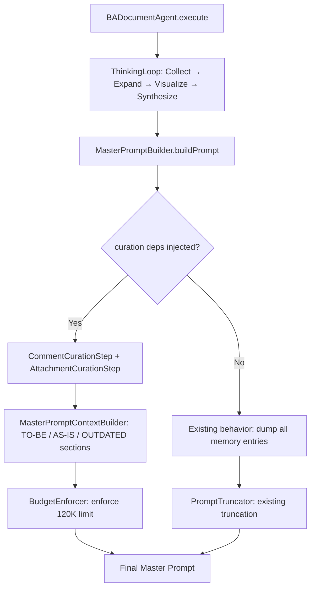

# Design Document: Prompt Curation Pipeline (Integrated into Agent Pipeline)

## Overview

The Prompt Curation Pipeline integrates intelligent data curation directly INTO the existing BADocumentAgent pipeline — specifically into `MasterPromptBuilder`, `MasterPromptSections`, and `ExpandPhase`. There is NO separate `CurationPipeline` class or separate path in `JobExecutor`. Instead:

- **ExpandPhase** classifies linked tickets as AS-IS / TO-BE / OUTDATED using `TemporalClassifier` during collection
- **MasterPromptSections.buildContext()** builds separate TO-BE and AS-IS sections from classification data stored in memory
- **MasterPromptBuilder** integrates `CommentSummarizer`, `AttachmentCurator`, `BudgetEnforcer`, and `McpToolRegistrar` as optional constructor dependencies

The curation components are:

1. **KB-First Strategy** — Already exists in `shouldSkipRawEntry()`, enhanced with comment/attachment curation
2. **Temporal Classification** — New `TemporalClassifier` invoked during ExpandPhase, results stored in `ticketClassifications` memory slot
3. **Comment Summarization** — New `CommentSummarizer` invoked by `MasterPromptBuilder` before section building
4. **Attachment Curation** — New `AttachmentCurator` invoked by `MasterPromptBuilder` before section building
5. **Budget Enforcement** — New `BudgetEnforcer` replaces `PromptTruncator` in `MasterPromptBuilder` when curation is active
6. **MCP KB Lookup** — New `McpToolRegistrar` adds tool block for reference-only tickets

Feature flag `prompt_curation_enabled` controls DI injection — when disabled, `MasterPromptBuilder` receives null curation dependencies and uses existing behavior. Additionally, `CurationPipeline` and `McpToolRegistrar` are injected into `JobExecutor` via `ServerModule.kt`, enabling a standalone curation path as fallback when the agent pipeline fails. The `JobExecutor.resolvePrompt()` fallback chain is: agent pipeline → curation pipeline → legacy prompt.

Additionally, `GeminiCliAgent` timeout increases from 120s → 240s and retry count reduces from 2 → 1 (3 → 2 total attempts) to fit within the 5-minute job timeout.

## Architecture

### Integration Point in Agent Pipeline



### Component Decomposition (SOLID)

Curation components are standalone interfaces injected into existing agent components:

| Component | Responsibility | Injected Into |
|-----------|---------------|---------------|
| `TemporalClassifier` | Classifies tickets as OLDER/NEWER/CONCURRENT | `ExpandPhase` (during collection) |
| `CommentSummarizer` | Deduplicates and summarizes comments | `MasterPromptBuilder` (via `CommentCurationStep`) |
| `AttachmentCurator` | Previews and prioritizes attachments | `MasterPromptBuilder` (via `AttachmentCurationStep`) |
| `BudgetEnforcer` | Progressive truncation to fit 120K budget | `MasterPromptBuilder` (replaces `PromptTruncator`) |
| `McpToolRegistrar` | Registers KB lookup tools for capable agents | `MasterPromptBuilder` (adds tool block) |
| `MasterPromptContextBuilder` | Builds TO-BE/AS-IS/OUTDATED sections from classified memory | `MasterPromptSections` (new helper) |

### Feature Flag Integration

```mermaid
flowchart LR
    A[Settings Page UI] -->|"toggle on/off"| B[/api/settings/feature]
    B -->|"prompt_curation_enabled"| C[app_settings table]
    C --> D[Koin DI Module reads at startup]
    D -->|true| E[Inject MasterPromptBuilder WITH curation deps]
    D -->|false| F[Inject MasterPromptBuilder with null deps → existing behavior]
    E --> G[BADocumentAgent uses curated MasterPromptBuilder]
    F --> G
```

**Frontend UI**: The `prompt_curation_enabled` flag is exposed as a toggle in the **Settings page** (`#settings`) under a "FEATURE FLAGS" section. Only admin users can see and modify it. The toggle reads/writes via the existing `/api/settings/feature` API endpoint. The `agent_pipeline_enabled` toggle is also co-located in the same FEATURE FLAGS section for centralized feature flag management.

**Implementation**:
- HTML: `frontend/src/jsMain/resources/templates/settings.html` — two toggle cards under FEATURE FLAGS heading
- Controller: `frontend/src/jsMain/kotlin/com/assistant/frontend/pages/settings/SettingsCurationToggle.kt` — `object SettingsCurationToggle` managing `prompt_curation_enabled`
- Controller: `frontend/src/jsMain/kotlin/com/assistant/frontend/pages/settings/SettingsAgentPipelineToggle.kt` — `object SettingsAgentPipelineToggle` managing `agent_pipeline_enabled`
- Wired into `SettingsPage.render()` via `SettingsCurationToggle.init()` and `SettingsAgentPipelineToggle.init()` after admin role check
- Settings page accessible from sidebar navigation (`⚙️ Settings`)

## Components and Interfaces

### 1. TemporalClassifier (new — invoked by ExpandPhase)

```kotlin
// server/src/jvmMain/kotlin/com/assistant/server/document/curation/TemporalClassifier.kt
interface TemporalClassifier {
    fun classify(
        rootTicket: StructuredTicketContent,
        linkedTicket: StructuredTicketContent,
        linkedKb: KBRecord?
    ): TicketClassification
}
```

Uses rich domain types (`StructuredTicketContent`, `KBRecord`) instead of raw strings, allowing the classifier to access all ticket fields (dates, status, requirements) directly.

**Classification Logic:**
1. Compare `createdDate` of linked ticket vs root ticket
2. If linked is older AND status is Closed/Done/Resolved AND no conflicts → AS-IS
3. If linked is older AND requirements conflict with root (detected via KBRecord.extractedRequirements) → OUTDATED
4. If linked is newer or concurrent → TO-BE
5. Status field (Closed, Done, Resolved, In Progress, Open) as secondary signal
6. Safe default: classify as TO-BE when uncertain

### 2. CommentSummarizer (new — invoked by MasterPromptBuilder)

```kotlin
// server/src/jvmMain/kotlin/com/assistant/server/document/curation/CommentSummarizer.kt
interface CommentSummarizer {
    fun summarize(comments: List<FullComment>, hasKbRecord: Boolean): CommentSummary
}
```

**Rules:**
- If `hasKbRecord` is true → skip entirely (KB already has the info)
- If ≤ 10 comments → include all (no summarization needed)
- If > 10 comments → extract decisions/clarifications/blockers + keep 3 most recent substantive
- Deduplicate bot comments (ScriptRunner, status bots) → count + date range
- Output ≤ 2000 chars per ticket

### 3. AttachmentCurator (new — invoked by MasterPromptBuilder)

```kotlin
// server/src/jvmMain/kotlin/com/assistant/server/document/curation/AttachmentCurator.kt
interface AttachmentCurator {
    fun curate(
        rootAttachments: List<AttachmentChunkInfo>,
        linkedAttachments: List<AttachmentChunkInfo>,
        kbReferencedFilenames: Set<String>
    ): List<CuratedAttachment>
}
```

**Rules:**
- Exclude attachments already referenced in KB records
- Preview: first 5000 chars (8000 for BRD/FRD/FSD/requirement docs)
- Priority: root > linked (by depth)
- Total attachment budget: 30000 chars max
- Truncate from deepest tickets first

### 4. BudgetEnforcer (new — replaces PromptTruncator in MasterPromptBuilder)

```kotlin
// server/src/jvmMain/kotlin/com/assistant/server/document/curation/BudgetEnforcer.kt
interface BudgetEnforcer {
    fun enforce(context: CuratedContext, maxChars: Int): BudgetResult
}
```

Operates on the structured `CuratedContext` model rather than a raw prompt string, enabling intelligent section-aware truncation.

**Progressive Truncation Order (Req 6.3):**
1. Deeper ticket details (depth ≥ 3)
2. AS-IS section details (reduce to summaries only)
3. Attachment previews (reduce preview size)
4. Comment summaries (reduce to decisions only)

**Never Truncate:**
- Root ticket KB record
- TO-BE section
- Prompt skeleton (role, template, instructions)
- Diagram instructions

### 5. McpToolRegistrar (new — adds tool block in MasterPromptBuilder)

```kotlin
// server/src/jvmMain/kotlin/com/assistant/server/document/curation/McpToolRegistrar.kt
interface McpToolRegistrar {
    fun buildToolBlock(referenceOnlyTickets: List<String>): String
    fun isToolUseSupported(agentType: String): Boolean
}
```

### 6. MasterPromptBuilder (modified — gains optional curation dependencies)

```kotlin
// server/src/jvmMain/kotlin/com/assistant/server/agent/ba/prompt/MasterPromptBuilder.kt
open class MasterPromptBuilder(
    // Existing (unchanged)
    // New optional curation dependencies — null when curation disabled
    private val commentSummarizer: CommentSummarizer? = null,
    private val attachmentCurator: AttachmentCurator? = null,
    private val budgetEnforcer: BudgetEnforcer? = null,
    private val mcpToolRegistrar: McpToolRegistrar? = null
) {
    open fun buildPrompt(memory: StructuredMemory, strategy: CollectionStrategy): String {
        // 1. Apply CommentCurationStep (if commentSummarizer != null)
        // 2. Apply AttachmentCurationStep (if attachmentCurator != null)
        // 3. Build sections via MasterPromptContextBuilder (if ticketClassifications in memory)
        //    OR existing MasterPromptSections.buildContext() (fallback)
        // 4. Apply BudgetEnforcer (if budgetEnforcer != null) OR PromptTruncator (fallback)
        // 5. Add MCP tool block (if mcpToolRegistrar != null)
    }
}
```

### 7. MasterPromptContextBuilder (new helper — extracted from MasterPromptSections)

```kotlin
// server/src/jvmMain/kotlin/com/assistant/server/agent/ba/prompt/MasterPromptContextBuilder.kt
internal object MasterPromptContextBuilder {
    fun buildToBeSection(memory: StructuredMemory, kbSources: Set<String>): String
    fun buildAsIsSection(memory: StructuredMemory, kbSources: Set<String>): String
    fun buildOutdatedMetadata(memory: StructuredMemory): String
}
```

Reads `ticketClassifications` memory slot to determine which tickets go in which section.

### 8. ExpandPhase (modified — adds temporal classification)

```kotlin
// server/src/jvmMain/kotlin/com/assistant/server/agent/ba/phases/ExpandPhase.kt
// After scoring relevance, classify each linked ticket using StructuredTicketContent:
private fun classifySingleTicket(memory, rootTicket, ticket) {
    val linkedTicket = StructuredTicketContent(
        summary = "${ticket.key} ${ticket.summary}",
        createdDate = "", status = "Open"
    )
    val classification = temporalClassifier.classify(rootTicket, linkedTicket, null)
    memory.store("ticketClassifications", MemoryEntry(
        data = "${ticket.key}:${classification.contentClassification}",
        source = ticket.key, toolName = "temporalClassifier"
    ))
}
```

The `ExpandPhase` holds a `TemporalClassifier` instance directly (not injected via DI) and calls `classifyLinkedTickets()` after fetching relevant details. Root ticket content is constructed from memory's summary entry timestamp.

## Data Models

### Classification Models (new)

```kotlin
// server/src/jvmMain/kotlin/com/assistant/server/document/curation/models/ClassificationModels.kt
enum class TemporalRelation { OLDER, NEWER, CONCURRENT }
enum class ContentClassification { AS_IS, TO_BE, OUTDATED }

data class TicketClassification(
    val ticketId: String,
    val temporalRelation: TemporalRelation,
    val contentClassification: ContentClassification,
    val supersededBy: String? = null
)
```

### Comment Models (new)

```kotlin
// server/src/jvmMain/kotlin/com/assistant/server/document/curation/models/CommentModels.kt
@Serializable
data class CommentSummary(
    val decisions: List<String> = emptyList(),
    val clarifications: List<String> = emptyList(),
    val blockers: List<String> = emptyList(),
    val recentComments: List<FullComment> = emptyList(),
    val botSummary: String? = null,
    val totalChars: Int = 0
)

// CuratedAttachment is co-located in the same file
@Serializable
data class CuratedAttachment(
    val filename: String,
    val ticketId: String,
    val preview: String,  // max 3000 chars (5000 for requirement docs)
    val priority: Int,
    val isRequirementDoc: Boolean
)
```

### Attachment Models

`CuratedAttachment` is defined in `CommentModels.kt` alongside `CommentSummary` (both are small curation output models).

### Budget Result (new)

```kotlin
// server/src/jvmMain/kotlin/com/assistant/server/document/curation/models/BudgetResult.kt
@Serializable
data class BudgetResult(
    val context: CuratedContext,
    val truncationApplied: Boolean,
    val truncationAnnotation: String? = null,
    val originalSize: Int,
    val finalSize: Int
)
```

Returns the truncated `CuratedContext` (not a raw string), allowing downstream consumers to access structured sections after budget enforcement.

### CurationMetrics (new — for observability logging)

```kotlin
// server/src/jvmMain/kotlin/com/assistant/server/document/curation/models/CurationMetrics.kt
@Serializable
data class CurationMetrics(
    val originalContextSizeChars: Int,
    val curatedContextSizeChars: Int,
    val ticketsAsIs: Int,
    val ticketsToBe: Int,
    val ticketsOutdated: Int,
    val ticketsReferenceOnly: Int,
    val commentsSummarized: Int,
    val attachmentsCurated: Int,
    val curationTimeMs: Long
)
```

### CuratedContext (new — structured output of the curation pipeline)

```kotlin
// server/src/jvmMain/kotlin/com/assistant/server/document/curation/models/CuratedContext.kt
@Serializable
data class CuratedContext(
    val rootTicket: KBRecord,
    val toBeSection: ToBeSection,
    val asIsSection: AsIsSection,
    val outdatedMetadata: List<OutdatedReference> = emptyList(),
    val commentSummaries: Map<String, CommentSummary> = emptyMap(),
    val attachments: List<CuratedAttachment> = emptyList(),
    val referenceOnlyTickets: List<TicketReference> = emptyList(),
    val metrics: CurationMetrics = CurationMetrics(...)
)
```

Supporting section models (in `SectionModels.kt`):

```kotlin
@Serializable data class ToBeSection(val rootRequirements: List<String>, val linkedRequirements: List<ClassifiedTicketData>)
@Serializable data class AsIsSection(val existingFunctionality: List<ClassifiedTicketData>)
@Serializable data class ClassifiedTicketData(val ticketId: String, val classification: ContentClassification, val businessSummary: String, val asIsState: String, val toBeState: String, val extractedRequirements: List<String>, val annotation: String? = null)
@Serializable data class OutdatedReference(val ticketId: String, val supersededBy: String, val reason: String = "")
@Serializable data class TicketReference(val ticketId: String, val oneLinerSummary: String)
```

### StructuredMemory Schema Change (modified)

```kotlin
// BAAgentConfig.kt — add ticketClassifications slot
memorySchema {
    // ... existing slots ...
    mapSlot("ticketClassifications", 20)  // NEW: stores TicketClassification per linked ticket
}
```

### Data Flow

Classification data flows through StructuredMemory — NOT through a separate `CuratedContext` model:

1. **ExpandPhase** stores `TicketClassification` in `ticketClassifications` memory slot
2. **MasterPromptContextBuilder** reads `ticketClassifications` to build TO-BE/AS-IS/OUTDATED sections
3. **CommentCurationStep** reads `comments` slot, applies `CommentSummarizer`, writes summarized entries back
4. **AttachmentCurationStep** reads `attachmentsData` slot, applies `AttachmentCurator`, writes curated previews back

### Configuration Constants

```kotlin
object CurationConfig {
    const val MAX_PROMPT_CHARS = 120_000
    const val TARGET_MIN_CHARS = 80_000
    const val MAX_COMMENT_CHARS_PER_TICKET = 3_000
    const val MAX_ATTACHMENT_PREVIEW_CHARS = 5_000
    const val MAX_REQUIREMENT_DOC_PREVIEW_CHARS = 8_000
    const val MAX_TOTAL_ATTACHMENT_CHARS = 30_000
    const val MAX_MCP_LOOKUPS = 20
    const val COMMENT_THRESHOLD = 10  // summarize if > this many
    const val GEMINI_TIMEOUT_MS = 240_000L
    const val MAX_RETRIES = 1  // 2 total attempts
    const val JOB_FAIL_FAST_MS = 280_000L
}
```

### GeminiCliAgent Changes

```kotlin
// Updated constants in GeminiCliAgent
companion object {
    private const val TIMEOUT_MS = 240_000L  // was 120_000L (Req 7.1)
}

// Updated constant in JobExecutor
private const val MAX_RETRIES = 1  // was 2 (Req 7.2) — 2 total attempts
```

**Process I/O fix**: `executeCliCommand()` reads stdout and stderr in separate threads via `CompletableFuture.supplyAsync` concurrently with `process.waitFor()`. This prevents a classic Java ProcessBuilder deadlock where the OS pipe buffer fills up (~64KB on Windows) when the Gemini CLI produces a large response, causing the child process to block on write while the parent blocks on `waitFor()`. On timeout, partial stdout/stderr are captured and logged for diagnostics.


## Correctness Properties

*A property is a characteristic or behavior that should hold true across all valid executions of a system — essentially, a formal statement about what the system should do. Properties serve as the bridge between human-readable specifications and machine-verifiable correctness guarantees.*

### Property 1: KB-First Data Selection

*For any* ticket in the EnrichedContext that has a corresponding KBRecord, the CuratedContext SHALL contain only KB fields (businessSummary, asIsState, toBeState, extractedRequirements) for that ticket and SHALL NOT contain raw ticket description or raw comment dumps. For linked tickets, only the 4 specified fields shall be included. Comment summarization SHALL be skipped for tickets with KB records.

**Validates: Requirements 1.1, 1.2, 1.5, 4.6**

### Property 2: KB Fallback for Missing Records

*For any* ticket in the EnrichedContext that does NOT have a corresponding KBRecord, the CuratedContext SHALL contain a summarized version of the raw ticket data consisting of the description plus the top 5 most recent comments.

**Validates: Requirements 1.3**

### Property 3: Root Ticket and Protected Content Preservation

*For any* EnrichedContext input regardless of total size, the curated output SHALL always contain the complete Root_Ticket KBRecord (all fields, no truncation), the complete TO-BE section, and the prompt skeleton (role, template, instructions, diagram instructions). These items SHALL never be removed by budget enforcement.

**Validates: Requirements 1.4, 6.4**

### Property 4: Temporal Classification Correctness

*For any* linked ticket with known creation/resolution/update dates relative to the root ticket: if the linked ticket is older with non-conflicting requirements, it SHALL be classified AS-IS; if older with conflicting requirements, it SHALL be classified OUTDATED; if newer or concurrent, it SHALL be classified TO-BE. The classification output SHALL always be exactly one of {AS_IS, TO_BE, OUTDATED}.

**Validates: Requirements 2.1, 2.3, 2.4, 2.5**

### Property 5: Section Placement Correctness

*For any* CuratedContext output: all tickets classified AS-IS SHALL appear only in the AS-IS section, all tickets classified TO-BE (including root) SHALL appear only in the TO-BE section, and all tickets classified OUTDATED SHALL be excluded from both AS-IS and TO-BE sections and appear only as one-line references in the outdated metadata. If a requirement appears in both an older ticket and the root ticket, only the root version SHALL appear in TO-BE with an evolution annotation.

**Validates: Requirements 3.2, 3.3, 3.4, 3.6**

### Property 6: TO-BE Before AS-IS Ordering

*For any* assembled prompt output, the TO-BE section SHALL appear before the AS-IS section in the final string, giving higher priority to new requirements.

**Validates: Requirements 3.5**

### Property 7: Comment Summarization Correctness

*For any* list of comments with more than 10 items, the CommentSummarizer SHALL produce output that: (a) is no larger than 2000 characters, (b) preserves the 3 most recent substantive (non-bot) comments in their original form, and (c) replaces bot/automated comments with only a count and date range summary.

**Validates: Requirements 4.1, 4.3, 4.4, 4.5**

### Property 8: Attachment Curation Correctness

*For any* set of attachment chunks: (a) each preview SHALL be ≤ 5000 characters (or ≤ 8000 for filenames containing "BRD", "FRD", "FSD", or "requirement"), (b) attachments already referenced in KB records SHALL be excluded, (c) root ticket attachments SHALL have higher priority than linked ticket attachments, and (d) total attachment content SHALL not exceed 30000 characters with truncation applied from deepest tickets first.

**Validates: Requirements 5.1, 5.2, 5.3, 5.4, 5.5**

### Property 9: Budget Enforcement Invariant

*For any* StructuredMemory input regardless of size, the final assembled prompt produced by `MasterPromptBuilder.buildPrompt()` with curation enabled SHALL be no larger than 120000 characters.

**Validates: Requirements 6.1**

### Property 10: Progressive Truncation Correctness

*For any* assembled prompt that exceeds the budget limit, truncation SHALL be applied in the following priority order (lowest priority removed first): (1) deeper ticket details, (2) AS-IS section details, (3) attachment previews, (4) comment summaries. When truncation occurs, a truncation annotation SHALL be appended listing what was removed and original vs final size.

**Validates: Requirements 6.3, 6.5**

### Property 11: Determinism

*For any* StructuredMemory input, calling `MasterPromptBuilder.buildPrompt()` twice with the same memory and strategy SHALL produce identical prompt outputs (excluding timing metrics).

**Validates: Requirements 8.5**

## Error Handling

### Curation Component Errors

| Error Scenario | Handling Strategy | Fallback |
|---------------|-------------------|----------|
| TemporalClassifier fails for a ticket | Classify as TO-BE (safe default — includes rather than excludes) | Continue with remaining tickets |
| CommentSummarizer fails for a ticket | Include raw comments (truncated to 2000 chars) | Continue with remaining tickets |
| AttachmentCurator fails | Exclude all attachments for that ticket | Continue with remaining data |
| BudgetEnforcer fails | Fall back to existing PromptTruncator | Prompt may exceed 120K but still works |
| MasterPromptBuilder with null curation deps | Uses existing behavior (no classification, no summarization) | Backward compatible |

### GeminiCliAgent Errors

| Error Scenario | Handling Strategy |
|---------------|-------------------|
| Timeout after 240s | Log prompt size + elapsed time + attempt number, retry once (Req 7.3) |
| Total job time approaches 280s | Skip retry, fail fast with descriptive error (Req 7.5) |
| Empty response | Treat as failure, retry once |
| Non-zero exit code | Log stderr, retry once |

### Feature Flag Errors

| Error Scenario | Handling Strategy |
|---------------|-------------------|
| Settings DB unavailable | Default to curation disabled (null deps injected) |
| Invalid setting value | Treat as disabled |

### Defensive Design Principles

1. **Fail-open for curation**: If any curation component fails, MasterPromptBuilder falls back to existing behavior (null deps = no curation)
2. **Fail-closed for budget**: If BudgetEnforcer fails, falls back to PromptTruncator (existing behavior)
3. **No data loss**: Curation components only transform/filter data in memory — original StructuredMemory entries are never deleted
4. **Idempotent**: Multiple buildPrompt() calls on the same memory produce the same output (excluding timing)

## Testing Strategy

### Test Framework: JUnit5 + Kotest Property (Hybrid)

The project uses a **hybrid approach**: JUnit5 as the test runner with Kotest Property for property-based testing. This is because the project includes `kotest-property` and `kotest-assertions-core` but does NOT include `kotest-runner-junit5` — so Kotest's `FunSpec` DSL is unavailable.

**Pattern for property tests:**
```kotlin
import io.kotest.common.ExperimentalKotest
import io.kotest.property.PropTestConfig
import io.kotest.property.checkAll
import kotlinx.coroutines.test.runTest
import kotlin.test.Test

class ExamplePropertyTest {
    @OptIn(ExperimentalKotest::class)
    @Test
    fun `property name`() = runTest {
        checkAll(PropTestConfig(iterations = 100), arbGenerator()) { input ->
            // assertions
        }
    }
}
```

**Pattern for unit/integration tests:**
```kotlin
import kotlin.test.Test
import kotlin.test.assertEquals

class ExampleUnitTest {
    @Test
    fun `test name`() {
        // arrange, act, assert
    }
}
```

**Key conventions:**
- All tests use `@Test` from `kotlin.test` (JUnit5 runner)
- Property tests require `@OptIn(ExperimentalKotest::class)` annotation
- Property tests use `runTest { checkAll(...) }` from `kotlinx.coroutines.test`
- Property metadata is documented via KDoc comments (e.g., `/** Property 8: Attachment Curation Correctness */`)
- No mocking library (no MockK) — tests use real implementations with generated inputs

**Configuration**: 50–100 iterations per property test (using `PropTestConfig(iterations = 50..100)`)

### Property-Based Testing Rationale

The curation pipeline is ideal for property-based testing because:
- It's a **pure function** (EnrichedContext → CuratedContext) with no side effects
- It has **universal invariants** (budget limits, ordering, classification rules)
- The **input space is large** (varying ticket counts, comment volumes, attachment sizes)
- It's **fast** (< 500ms) making 50–100 iterations cost-effective

**Library**: Kotest Property (`io.kotest:kotest-property`) + Kotest Assertions (`io.kotest:kotest-assertions-core`) — already in project dependencies

### Test Structure

```
server/src/jvmTest/kotlin/com/assistant/server/document/curation/
├── TemporalClassifierPropertyTest.kt    — Property 4
├── TemporalClassifierTest.kt            — Edge cases (same-day, missing dates, null resolution)
├── CommentSummarizerPropertyTest.kt     — Property 7
├── CommentSummarizerTest.kt             — Bot comment detection patterns
├── AttachmentCuratorPropertyTest.kt     — Property 8
├── BudgetEnforcerPropertyTest.kt        — Properties 9-10
├── CuratedPromptAssemblerPropertyTest.kt — Prompt assembly from CuratedContext
├── CurationIntegrationTest.kt           — End-to-end curation pipeline integration
├── CurationPipelinePropertyTest.kt      — Pipeline-level property tests
├── McpToolRegistrarTest.kt              — MCP tool registration unit tests
├── GeminiTimeoutTest.kt                 — Timeout and retry config validation
└── generators/
    └── CurationArbitraries.kt           — Shared Arb generators

server/src/jvmTest/kotlin/com/assistant/server/agent/ba/prompt/
├── MasterPromptBuilderPropertyTest.kt   — Properties 1-3, 9 (curation), 11
├── MasterPromptContentPropertyTest.kt   — Prompt content correctness
├── MasterPromptContextBuilderPropertyTest.kt — Properties 5-6
└── MasterPromptPropertyTest.kt          — General prompt assembly tests

server/src/jvmTest/kotlin/com/assistant/server/agent/ba/phases/
└── ExpandPhaseClassificationTest.kt     — ExpandPhase temporal classification integration
```

**Note on Property 11 (Determinism):** The determinism test compares two `curate()` calls on the same input but must exclude `CurationMetrics.curationTimeMs` from comparison, since timing is inherently non-deterministic. The test copies the result with `curationTimeMs = 0` before comparing.

### Generators (Arb)

Key generators in `CurationArbitraries.kt`:
- `arbKBRecord()` — random KBRecord with varying field sizes
- `arbStructuredTicketContent()` — random ticket with dates, status, comments
- `arbEnrichedContext()` — full context with configurable ticket count and sizes
- `arbFullComment()` — random comment (bot and substantive variants)
- `arbAttachmentChunkInfo()` — random attachment with varying sizes and filenames
- `arbTicketDates()` — date pairs for temporal classification testing

### Unit Tests (Example-Based)

| Test File | Test Area | Examples |
|-----------|-----------|----------|
| `TemporalClassifierTest.kt` | Temporal classification edge cases | Same-day tickets, missing dates, null resolution dates, all status combinations |
| `CommentSummarizerTest.kt` | Bot comment detection | ScriptRunner patterns, status update bots, Jira automation comments |
| `McpToolRegistrarTest.kt` | MCP tool block generation | Tool-capable agent gets tool block, non-tool agent gets empty string, tool block format |
| `GeminiTimeoutTest.kt` | GeminiCliAgent timeout/retry | 240s timeout applied, fail-fast at 280s, max 1 retry (2 total attempts) |

### Integration Tests

| Test File | Test Area | Scope |
|-----------|-----------|-------|
| `MasterPromptBuilderPropertyTest.kt` | Feature flag routing | Curation deps injected → uses curated sections |
| `MasterPromptBuilderPropertyTest.kt` | Null deps fallback | Curation deps null → uses existing behavior |
| `ExpandPhaseClassificationTest.kt` | Classification integration | Linked tickets get classified and stored in memory |
| `GeminiTimeoutTest.kt` | Timeout/retry | 240s timeout, fail-fast at 280s, max 1 retry |

### Performance Tests

| Test | Threshold |
|------|-----------|
| Curation of 50-ticket context | < 500ms |
| Curation of 100-ticket context with 200+ comments each | < 1000ms |
| Budget enforcement on 500K char input | < 200ms |
