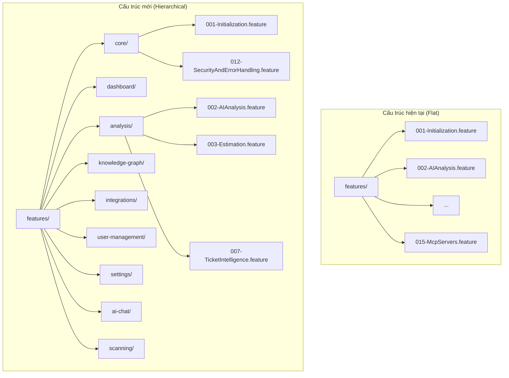
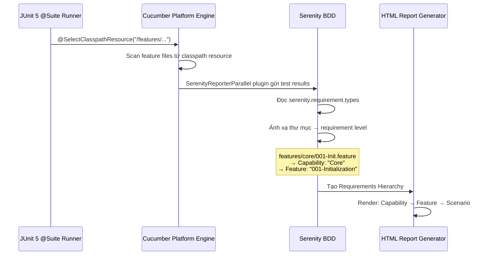
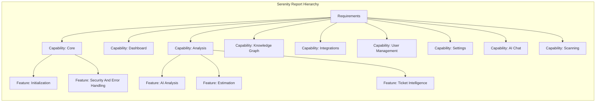

# Tài liệu Thiết kế: Serenity Report Feature Hierarchy

## Tổng quan

Tính năng này tổ chức lại cấu trúc thư mục feature files của E2E test từ dạng phẳng (flat) sang dạng phân cấp (hierarchical) theo domain/capability. Mục tiêu là kích hoạt Requirements Hierarchy trong Serenity BDD HTML report, cho phép hiển thị theo cấu trúc: **Capability (thư mục)** → **Feature (file .feature)** → **Scenario**.

Hiện tại, tất cả 15 file `.feature` nằm trong một thư mục duy nhất `e2e-tests/src/test/resources/features/`, khiến Serenity report hiển thị tất cả scenarios dạng danh sách phẳng không có nhóm capability. Sau khi tổ chức lại, Serenity sẽ tự động nhận diện cấu trúc thư mục con và tạo Requirements Hierarchy tương ứng trong report.

Thay đổi này chỉ ảnh hưởng đến vị trí file và cấu hình — không thay đổi nội dung scenarios, step definitions, hay logic test.

## Kiến trúc

### Cơ chế Requirements Hierarchy của Serenity BDD

Serenity BDD sử dụng cấu trúc thư mục feature files để tự động tạo Requirements Hierarchy. Khi cấu hình `serenity.requirement.types`, Serenity ánh xạ mỗi cấp thư mục thành một requirement type.



### Luồng xử lý của Serenity khi đọc feature files



## Thành phần và Giao diện

### Thành phần 1: Cấu trúc thư mục Feature Files

**Mục đích**: Tổ chức 15 feature files vào 9 thư mục con theo domain

**Ánh xạ thư mục**:

| Thư mục con | Feature Files | Mô tả Domain |
|---|---|---|
| `core/` | 001-Initialization, 012-SecurityAndErrorHandling | Khởi tạo hệ thống, bảo mật |
| `dashboard/` | 005-Dashboard | Trang chủ dashboard |
| `analysis/` | 002-AIAnalysis, 003-Estimation, 007-TicketIntelligence | Phân tích AI, ước lượng |
| `knowledge-graph/` | 006-KnowledgeGraph | Đồ thị tri thức |
| `integrations/` | 008-Integrations, 015-McpServers | Tích hợp bên ngoài |
| `user-management/` | 004-FirstLaunchRedirect, 009-UserManagement | Quản lý người dùng |
| `settings/` | 011-AppSettings | Cài đặt ứng dụng |
| `ai-chat/` | 013-AIChatSidebar | Chat AI sidebar |
| `scanning/` | 010-FrontendBackendIntegration, 014-BatchScan | Quét và tích hợp FE-BE |


**Cấu trúc thư mục đầy đủ**:

```
features/
├── core/
│   ├── 001-Initialization.feature
│   └── 012-SecurityAndErrorHandling.feature
├── dashboard/
│   └── 005-Dashboard.feature
├── analysis/
│   ├── 002-AIAnalysis.feature
│   ├── 003-Estimation.feature
│   └── 007-TicketIntelligence.feature
├── knowledge-graph/
│   └── 006-KnowledgeGraph.feature
├── integrations/
│   ├── 008-Integrations.feature
│   └── 015-McpServers.feature
├── user-management/
│   ├── 004-FirstLaunchRedirect.feature
│   └── 009-UserManagement.feature
├── settings/
│   └── 011-AppSettings.feature
├── ai-chat/
│   └── 013-AIChatSidebar.feature
└── scanning/
    ├── 010-FrontendBackendIntegration.feature
    └── 014-BatchScan.feature
```

### Thành phần 2: Cấu hình Serenity Properties

**Mục đích**: Cấu hình Serenity nhận diện cấu trúc phân cấp

**Thay đổi trong `serenity.properties`**:

```properties
# Giữ nguyên
serenity.features.directory=src/test/resources/features

# Thêm mới — định nghĩa requirement types theo cấp thư mục
serenity.requirement.types=capability,feature
```

**Giải thích cơ chế**:
- Cấp 1 (thư mục con trực tiếp dưới `features/`): ánh xạ thành **Capability** (ví dụ: `core/` → Capability "Core")
- Cấp 2 (file `.feature` trong thư mục con): ánh xạ thành **Feature** (ví dụ: `001-Initialization.feature` → Feature "001-Initialization")
- Cấp 3 (Scenario trong file): tự động thành **Scenario**

### Thành phần 3: Runner Classes

**Mục đích**: Cập nhật đường dẫn feature file trong 13 runner classes và thêm `@Feature` annotation để populate tab "Features" trong Serenity report

**Giao diện** (JUnit 5 `@Suite` + Cucumber Platform Engine + `@Feature` annotation):

```kotlin
@Suite
@IncludeEngines("cucumber")
@SelectClasspathResource("features")
@ConfigurationParameter(key = FEATURES_PROPERTY_NAME, value = "src/test/resources/features/<subdirectory>/<filename>.feature")
@ConfigurationParameter(key = Constants.FILTER_TAGS_PROPERTY_NAME, value = "@ui")
@ConfigurationParameter(key = PLUGIN_PROPERTY_NAME, value = "net.serenitybdd.cucumber.core.plugin.SerenityReporterParallel")
@net.serenitybdd.annotations.Feature("<Domain Name>")
class Ui<Name>Runner
```

**Giải thích**:
- `@SelectClasspathResource("features")` — trỏ đến thư mục gốc features trên classpath (không có `/` ở đầu, theo docs chính thức)
- `FEATURES_PROPERTY_NAME` — chỉ định file `.feature` cụ thể để chạy (override classpath discovery). Cần thiết vì một số thư mục con chứa nhiều feature files
- `PLUGIN_PROPERTY_NAME` — cấu hình SerenityReporterParallel plugin trực tiếp trên runner

**Giải thích cơ chế 2 tầng**:
- **Requirements tab**: Populated từ Cucumber directory hierarchy (`serenity.requirement.types=capability,feature`). Hiển thị Capability → Feature → Scenario. **Hoạt động đúng.**
- **Features/Stories tabs**: Designed cho `@Feature`/`@Story` annotations trên JUnit 5 native tests (dùng `SerenityJUnit5Extension`). **Không hoạt động** với Cucumber Platform Engine vì Cucumber engine quản lý test lifecycle riêng — `@Feature` annotation trên `@Suite` class không được Serenity đọc. Đây là known limitation của Serenity BDD 5.x.

**Bảng ánh xạ @Feature annotation cho từng runner**:

| Runner Class | @Feature value | Classpath Resource |
|---|---|---|
| `UiInitializationRunner` | `"Core"` | `/features/core/001-Initialization.feature` |
| `UiSecurityRunner` | `"Core"` | `/features/core/012-SecurityAndErrorHandling.feature` |
| `UiDashboardRunner` | `"Dashboard"` | `/features/dashboard/005-Dashboard.feature` |
| `UiTicketIntelligenceRunner` | `"Analysis"` | `/features/analysis/007-TicketIntelligence.feature` |
| `UiKnowledgeGraphRunner` | `"Knowledge Graph"` | `/features/knowledge-graph/006-KnowledgeGraph.feature` |
| `UiIntegrationsRunner` | `"Integrations"` | `/features/integrations/008-Integrations.feature` |
| `UiMcpServersRunner` | `"Integrations"` | `/features/integrations/015-McpServers.feature` |
| `UiFirstLaunchRunner` | `"User Management"` | `/features/user-management/004-FirstLaunchRedirect.feature` |
| `UiUserManagementRunner` | `"User Management"` | `/features/user-management/009-UserManagement.feature` |
| `UiAppSettingsRunner` | `"Settings"` | `/features/settings/011-AppSettings.feature` |
| `UiAIChatSidebarRunner` | `"AI Chat"` | `/features/ai-chat/013-AIChatSidebar.feature` |
| `UiFrontendBackendRunner` | `"Scanning"` | `/features/scanning/010-FrontendBackendIntegration.feature` |
| `UiBatchScanRunner` | `"Scanning"` | `/features/scanning/014-BatchScan.feature` |

**Cấu hình chung** trong `junit-platform.properties`:
```properties
cucumber.glue=com.assistant.e2e.steps
cucumber.plugin=net.serenitybdd.cucumber.core.plugin.SerenityReporterParallel,pretty
```

**Dependencies** (trong `build.gradle.kts`):
- `io.cucumber:cucumber-junit-platform-engine` — Cucumber JUnit 5 engine
- `org.junit.platform:junit-platform-suite` — `@Suite` annotation support
- Đã loại bỏ: `junit:junit:4.13.2` (JUnit 4) và `junit-vintage-engine` (JUnit 4 bridge)

**Bảng ánh xạ đường dẫn mới cho từng runner**:

| Runner Class | Đường dẫn cũ | Đường dẫn mới |
|---|---|---|
| `UiInitializationRunner` | `features/001-Initialization.feature` | `features/core/001-Initialization.feature` |
| `UiDashboardRunner` | `features/005-Dashboard.feature` | `features/dashboard/005-Dashboard.feature` |
| `UiKnowledgeGraphRunner` | `features/006-KnowledgeGraph.feature` | `features/knowledge-graph/006-KnowledgeGraph.feature` |
| `UiTicketIntelligenceRunner` | `features/007-TicketIntelligence.feature` | `features/analysis/007-TicketIntelligence.feature` |
| `UiIntegrationsRunner` | `features/008-Integrations.feature` | `features/integrations/008-Integrations.feature` |
| `UiUserManagementRunner` | `features/009-UserManagement.feature` | `features/user-management/009-UserManagement.feature` |
| `UiFirstLaunchRunner` | `features/004-FirstLaunchRedirect.feature` | `features/user-management/004-FirstLaunchRedirect.feature` |
| `UiFrontendBackendRunner` | `features/010-FrontendBackendIntegration.feature` | `features/scanning/010-FrontendBackendIntegration.feature` |
| `UiAppSettingsRunner` | `features/011-AppSettings.feature` | `features/settings/011-AppSettings.feature` |
| `UiSecurityRunner` | `features/012-SecurityAndErrorHandling.feature` | `features/core/012-SecurityAndErrorHandling.feature` |
| `UiAIChatSidebarRunner` | `features/013-AIChatSidebar.feature` | `features/ai-chat/013-AIChatSidebar.feature` |
| `UiBatchScanRunner` | `features/014-BatchScan.feature` | `features/scanning/014-BatchScan.feature` |
| `UiMcpServersRunner` | `features/015-McpServers.feature` | `features/integrations/015-McpServers.feature` |

### Thành phần 4: CucumberTestRunner (Root Runner)

**Mục đích**: Root runner scan đệ quy tất cả feature files

```kotlin
@Suite
@IncludeEngines("cucumber")
@SelectClasspathResource("features")
@ConfigurationParameter(key = FEATURES_PROPERTY_NAME, value = "src/test/resources/features")
@ConfigurationParameter(key = Constants.FILTER_TAGS_PROPERTY_NAME, value = "not @api and not @ui")
@ConfigurationParameter(key = PLUGIN_PROPERTY_NAME, value = "net.serenitybdd.cucumber.core.plugin.SerenityReporterParallel")
class CucumberTestRunner
```

**Phân tích**: Cucumber JUnit Platform Engine tự động scan đệ quy tất cả thư mục con khi `FEATURES_PROPERTY_NAME` trỏ đến thư mục gốc `src/test/resources/features`.

## Mô hình Dữ liệu

### Ánh xạ Serenity Requirements Hierarchy



### Cấu trúc dữ liệu ánh xạ file → thư mục

```kotlin
/**
 * Ánh xạ từ tên file feature sang thư mục con (capability).
 * Dùng để di chuyển file và cập nhật runner paths.
 */
val featureFileMapping: Map<String, String> = mapOf(
    // core
    "001-Initialization.feature" to "core",
    "012-SecurityAndErrorHandling.feature" to "core",
    // dashboard
    "005-Dashboard.feature" to "dashboard",
    // analysis
    "002-AIAnalysis.feature" to "analysis",
    "003-Estimation.feature" to "analysis",
    "007-TicketIntelligence.feature" to "analysis",
    // knowledge-graph
    "006-KnowledgeGraph.feature" to "knowledge-graph",
    // integrations
    "008-Integrations.feature" to "integrations",
    "015-McpServers.feature" to "integrations",
    // user-management
    "004-FirstLaunchRedirect.feature" to "user-management",
    "009-UserManagement.feature" to "user-management",
    // settings
    "011-AppSettings.feature" to "settings",
    // ai-chat
    "013-AIChatSidebar.feature" to "ai-chat",
    // scanning
    "010-FrontendBackendIntegration.feature" to "scanning",
    "014-BatchScan.feature" to "scanning"
)
```

```kotlin
/**
 * Ánh xạ từ runner class sang đường dẫn feature file mới.
 */
val runnerPathMapping: Map<String, String> = mapOf(
    "UiInitializationRunner" to "src/test/resources/features/core/001-Initialization.feature",
    "UiDashboardRunner" to "src/test/resources/features/dashboard/005-Dashboard.feature",
    "UiKnowledgeGraphRunner" to "src/test/resources/features/knowledge-graph/006-KnowledgeGraph.feature",
    "UiTicketIntelligenceRunner" to "src/test/resources/features/analysis/007-TicketIntelligence.feature",
    "UiIntegrationsRunner" to "src/test/resources/features/integrations/008-Integrations.feature",
    "UiUserManagementRunner" to "src/test/resources/features/user-management/009-UserManagement.feature",
    "UiFirstLaunchRunner" to "src/test/resources/features/user-management/004-FirstLaunchRedirect.feature",
    "UiFrontendBackendRunner" to "src/test/resources/features/scanning/010-FrontendBackendIntegration.feature",
    "UiAppSettingsRunner" to "src/test/resources/features/settings/011-AppSettings.feature",
    "UiSecurityRunner" to "src/test/resources/features/core/012-SecurityAndErrorHandling.feature",
    "UiAIChatSidebarRunner" to "src/test/resources/features/ai-chat/013-AIChatSidebar.feature",
    "UiBatchScanRunner" to "src/test/resources/features/scanning/014-BatchScan.feature",
    "UiMcpServersRunner" to "src/test/resources/features/integrations/015-McpServers.feature"
)
```

## Pseudocode thuật toán

### Thuật toán di chuyển Feature Files

```kotlin
/**
 * Di chuyển tất cả feature files từ thư mục phẳng sang cấu trúc phân cấp.
 *
 * Preconditions:
 *   - Thư mục features/ tồn tại và chứa 15 file .feature
 *   - Tất cả file trong featureFileMapping tồn tại
 *
 * Postconditions:
 *   - 9 thư mục con được tạo trong features/
 *   - Tất cả 15 file .feature nằm trong thư mục con tương ứng
 *   - Không còn file .feature nào ở cấp features/ gốc
 *   - Nội dung file không thay đổi (checksum giữ nguyên)
 */
fun migrateFeatureFiles(featuresDir: Path) {
    // Bước 1: Tạo tất cả thư mục con
    val subdirectories = featureFileMapping.values.toSet()
    for (subdir in subdirectories) {
        createDirectory(featuresDir / subdir)
    }

    // Bước 2: Di chuyển từng file vào thư mục con
    for ((filename, subdir) in featureFileMapping) {
        val source = featuresDir / filename
        val target = featuresDir / subdir / filename
        
        assert(source.exists()) { "File không tồn tại: $source" }
        
        moveFile(source, target)
        
        assert(target.exists()) { "File không được di chuyển: $target" }
        assert(!source.exists()) { "File gốc vẫn còn: $source" }
    }

    // Bước 3: Xác nhận không còn file .feature ở cấp gốc
    val remainingFiles = featuresDir.listFiles("*.feature")
    assert(remainingFiles.isEmpty()) { "Còn file .feature ở cấp gốc: $remainingFiles" }
}
```

### Thuật toán cập nhật Runner Classes

```kotlin
/**
 * Cập nhật runner classes từ JUnit 4 @RunWith(CucumberWithSerenity) sang
 * JUnit 5 @Suite + @IncludeEngines("cucumber") + @SelectClasspathResource.
 *
 * Preconditions:
 *   - File runner tồn tại và chứa @RunWith(CucumberWithSerenity) annotation
 *
 * Postconditions:
 *   - Runner dùng @Suite + @IncludeEngines("cucumber")
 *   - @SelectClasspathResource trỏ đến classpath resource path: /features/<subdir>/<filename>.feature
 *   - @ConfigurationParameter cho filter tags
 *   - File vẫn compile thành công
 */
fun migrateRunnerToJUnit5(runnersDir: Path) {
    for ((runnerName, newPath) in runnerPathMapping) {
        val runnerFile = runnersDir / "$runnerName.kt"
        val classpathResource = newPath.removePrefix("src/test/resources")
        // Rewrite file with JUnit 5 Suite annotations
        // @SelectClasspathResource("$classpathResource")
    }
}
```

### Thuật toán cập nhật Serenity Properties

```kotlin
/**
 * Thêm cấu hình requirement.types vào serenity.properties.
 *
 * Preconditions:
 *   - File serenity.properties tồn tại
 *   - Chưa có dòng serenity.requirement.types
 *
 * Postconditions:
 *   - File chứa dòng: serenity.requirement.types=capability,feature
 *   - Các cấu hình khác không thay đổi
 */
fun updateSerenityProperties(propertiesFile: Path) {
    val content = propertiesFile.readText()
    
    // Kiểm tra chưa có cấu hình requirement.types
    assert(!content.contains("serenity.requirement.types")) {
        "serenity.requirement.types đã tồn tại"
    }
    
    // Thêm sau dòng serenity.features.directory
    val updatedContent = content.replace(
        "serenity.features.directory=src/test/resources/features",
        """serenity.features.directory=src/test/resources/features
serenity.requirement.types=capability,feature"""
    )
    
    propertiesFile.writeText(updatedContent)
}
```

## Ví dụ sử dụng

### Trước khi thay đổi — Serenity Report (Flat)

```
Requirements
├── 001-Initialization (3 scenarios)
├── 002-AIAnalysis (5 scenarios)
├── 003-Estimation (4 scenarios)
├── 004-FirstLaunchRedirect (2 scenarios)
├── 005-Dashboard (6 scenarios)
├── ... (tất cả ngang hàng, không nhóm)
└── 015-McpServers (3 scenarios)
```

### Sau khi thay đổi — Serenity Report (Hierarchical)

```
Requirements
├── Capability: Core
│   ├── Feature: Initialization (3 scenarios)
│   └── Feature: Security And Error Handling (4 scenarios)
├── Capability: Dashboard
│   └── Feature: Dashboard (6 scenarios)
├── Capability: Analysis
│   ├── Feature: AI Analysis (5 scenarios)
│   ├── Feature: Estimation (4 scenarios)
│   └── Feature: Ticket Intelligence (3 scenarios)
├── Capability: Knowledge Graph
│   └── Feature: Knowledge Graph (7 scenarios)
├── Capability: Integrations
│   ├── Feature: Integrations (5 scenarios)
│   └── Feature: MCP Servers (3 scenarios)
├── Capability: User Management
│   ├── Feature: First Launch Redirect (2 scenarios)
│   └── Feature: User Management (4 scenarios)
├── Capability: Settings
│   └── Feature: App Settings (3 scenarios)
├── Capability: AI Chat
│   └── Feature: AI Chat Sidebar (4 scenarios)
└── Capability: Scanning
    ├── Feature: Frontend Backend Integration (5 scenarios)
    └── Feature: Batch Scan (3 scenarios)
```

### Ví dụ Runner Class sau khi cập nhật

```kotlin
// UiDashboardRunner.kt — JUnit 5 + @Feature annotation
@Suite
@IncludeEngines("cucumber")
@SelectClasspathResource("features")
@ConfigurationParameter(key = FEATURES_PROPERTY_NAME, value = "src/test/resources/features/dashboard/005-Dashboard.feature")
@ConfigurationParameter(key = Constants.FILTER_TAGS_PROPERTY_NAME, value = "@ui")
@ConfigurationParameter(key = PLUGIN_PROPERTY_NAME, value = "net.serenitybdd.cucumber.core.plugin.SerenityReporterParallel")
@net.serenitybdd.annotations.Feature("Dashboard")
class UiDashboardRunner
```

```kotlin
// UiTicketIntelligenceRunner.kt — JUnit 5 + @Feature annotation
@Suite
@IncludeEngines("cucumber")
@SelectClasspathResource("features")
@ConfigurationParameter(key = FEATURES_PROPERTY_NAME, value = "src/test/resources/features/analysis/007-TicketIntelligence.feature")
@ConfigurationParameter(key = Constants.FILTER_TAGS_PROPERTY_NAME, value = "@ui")
@ConfigurationParameter(key = PLUGIN_PROPERTY_NAME, value = "net.serenitybdd.cucumber.core.plugin.SerenityReporterParallel")
@net.serenitybdd.annotations.Feature("Analysis")
class UiTicketIntelligenceRunner
```

## Thuộc tính Đúng đắn (Correctness Properties)

### P1: Bảo toàn Feature Files
- ∀ file ∈ featureFileMapping: file tồn tại trong thư mục con tương ứng sau khi di chuyển
- |files sau di chuyển| = |files trước di chuyển| = 15
- ∀ file: checksum(file trước) = checksum(file sau) (nội dung không đổi)

### P2: Không còn file ở cấp gốc
- Sau khi di chuyển: `features/*.feature` = ∅ (không còn file .feature nào ở cấp gốc)

### P3: Runner paths hợp lệ
- ∀ runner ∈ runnerPathMapping: đường dẫn trong `features = [...]` trỏ đến file thực tế tồn tại
- ∀ runner: file runner compile thành công sau khi cập nhật

### P4: CucumberTestRunner không thay đổi
- `CucumberTestRunner.kt` giữ nguyên `features = ["src/test/resources/features"]`
- Cucumber scan đệ quy tìm được tất cả 15 feature files

### P5: Serenity Requirements Hierarchy
- Serenity report hiển thị đúng 9 Capabilities
- Mỗi Capability chứa đúng số Features theo bảng ánh xạ
- Tổng số Scenarios trong report = tổng số Scenarios trước khi thay đổi

### P6: Build và Test vẫn hoạt động
- `./gradlew :e2e-tests:test` compile thành công
- `./gradlew :e2e-tests:uiTest` chạy đúng tất cả UI tests
- `./gradlew :e2e-tests:aggregate` tạo Serenity report thành công

## Xử lý Lỗi

### Lỗi 1: Feature file không tìm thấy sau di chuyển

**Điều kiện**: Runner class trỏ đến đường dẫn cũ (chưa cập nhật)
**Phản hồi**: Cucumber throw `FileNotFoundException` khi khởi tạo test
**Khắc phục**: Kiểm tra bảng ánh xạ runner → path, cập nhật đường dẫn đúng

### Lỗi 2: Serenity không nhận diện hierarchy

**Điều kiện**: Thiếu `serenity.requirement.types` trong properties
**Phản hồi**: Report vẫn hiển thị flat list
**Khắc phục**: Thêm `serenity.requirement.types=capability,feature` vào `serenity.properties`

### Lỗi 3: Duplicate feature file

**Điều kiện**: File được copy thay vì move, tồn tại ở cả vị trí cũ và mới
**Phản hồi**: Cucumber có thể chạy scenario 2 lần
**Khắc phục**: Xóa file ở vị trí cũ, đảm bảo chỉ tồn tại ở vị trí mới

## Chiến lược Kiểm thử

### Kiểm thử thủ công

1. **Verify file structure**: Kiểm tra 9 thư mục con được tạo, 15 files nằm đúng vị trí
2. **Verify runner compilation**: `./gradlew :e2e-tests:compileTestKotlin` thành công
3. **Verify Serenity report**: Chạy test và kiểm tra HTML report có Requirements Hierarchy
4. **Verify no regression**: Tổng số test pass/fail không thay đổi so với trước

### Kiểm thử tự động (Smoke Test)

Sau khi di chuyển, chạy:
```bash
# Compile kiểm tra đường dẫn hợp lệ
./gradlew :e2e-tests:compileTestKotlin

# Chạy 1 runner để verify
./gradlew :e2e-tests:test --tests "com.assistant.e2e.runners.UiDashboardRunner"

# Tạo report và kiểm tra hierarchy
./gradlew :e2e-tests:aggregate
```

## Cân nhắc Hiệu suất

- Không ảnh hưởng hiệu suất test execution — Cucumber scan đệ quy thư mục con nhanh tương đương
- Serenity report generation có thể chậm hơn không đáng kể do xử lý thêm cấp hierarchy
- `maxParallelForks = 6` cho UI tests và `maxParallelForks = 8` cho tất cả tests không cần thay đổi

## Phụ thuộc

- **Serenity BDD 5.3.9**: Đã hỗ trợ `serenity.requirement.types` từ version 2.x
- **Cucumber**: Hỗ trợ scan đệ quy thư mục feature files (mặc định)
- **Gradle Serenity Plugin**: `net.serenity-bdd.serenity-gradle-plugin:5.3.9` — cần cấu hình `requirementsBaseDir` và `requirementsDir` trong `serenity {}` block để aggregate task nhận diện cấu trúc thư mục
- **build.gradle.kts**: Cần thay đổi `serenity {}` block — thêm `requirementsBaseDir` và `requirementsDir` dùng **absolute path** via `file("src/test/resources/features").absolutePath`. Ngoài ra, cần thêm `doFirst` block cho `aggregate` task để set system properties với absolute path (`serenity.features.directory`, `serenity.requirement.types`, `serenity.test.root`) vì aggregate chạy ngoài test JVM, không đọc `serenity.properties` từ classpath, và không resolve relative paths đúng khi chạy từ Gradle daemon
