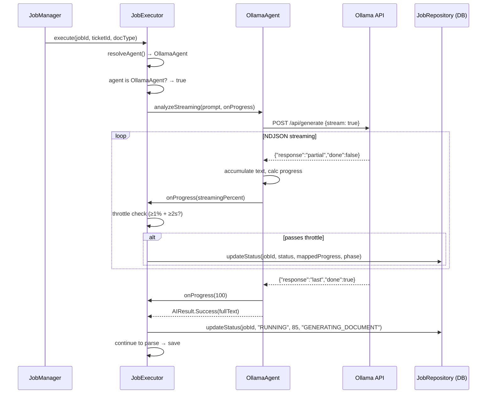
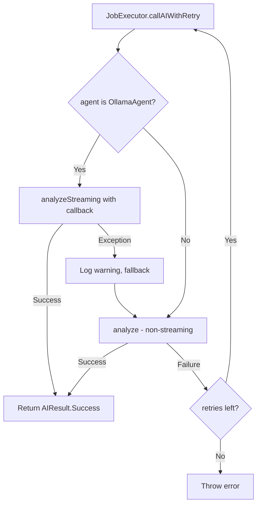

# Streaming Generation Progress — Design

## Overview

Feature này thêm streaming support vào quá trình sinh tài liệu BRD/FSD, cho phép progress bar tăng dần mượt mà từ 35% → 85% thay vì đứng yên rồi nhảy đột ngột.

**Cách tiếp cận**: OllamaAgent thêm method `analyzeStreaming()` sử dụng Ollama `/api/generate` với `stream: true`. Ktor client đọc response dưới dạng `ByteReadChannel`, parse từng NDJSON line, tích lũy text và gọi progress callback. JobExecutor detect OllamaAgent qua `is` check, gọi `analyzeStreaming()` với callback ánh xạ streaming progress vào job progress range (35–85%), throttle DB writes theo điều kiện ≥1% change + ≥2s interval.

**Phạm vi thay đổi**:
- `OllamaAgent` — thêm `analyzeStreaming()`, delegate streaming logic sang `OllamaStreamReader`
- `OllamaStreamReader` — class mới (SRP extraction) đọc NDJSON lines, tích lũy text, tính progress với monotonicity guarantee
- `StreamingProgressHelper` — helper functions cho progress mapping và throttle logic, extracted từ JobExecutor
- `JobExecutor` — thêm streaming-aware `callAIWithRetry()` với progress callback + throttle (sử dụng helper functions)
- Thêm streaming models trong package `models/` (NDJSON line data class)
- Không thay đổi `AIAgent` interface, không thay đổi frontend

**Quyết định thiết kế chính**:
1. `analyzeStreaming()` là method trên `OllamaAgent` class, không phải trên `AIAgent` interface — giữ interface segregation, các agent khác không bị ảnh hưởng
2. Throttle logic nằm trong `JobExecutor` (server module) — vì OllamaAgent ở shared module không có DB dependency
3. Fallback tự động: nếu streaming fail → gọi `analyze()` non-streaming, pipeline tiếp tục bình thường

## Architecture

### Component Interaction Flow



### Fallback Flow



## Components and Interfaces

### 1. OllamaAgent — `analyzeStreaming()` method

**Location**: `shared/src/commonMain/kotlin/com/assistant/ai/OllamaAgent.kt`

```kotlin
/**
 * Streaming analysis: sends prompt with stream=true, reads NDJSON lines,
 * accumulates response text, reports progress via callback.
 */
suspend fun analyzeStreaming(
    prompt: String,
    onProgress: (Int) -> Unit,
    context: AIContext? = null
): AIResult
```

**Behavior**:
- Builds `OllamaRequest` with `stream = true`
- Uses Ktor `HttpClient.preparePost().execute { response -> ... }` to get streaming `HttpResponse`
- Delegates NDJSON reading to `OllamaStreamReader.readStream()` (SRP extraction)
- On success: returns `AIResult.Success(accumulated)`
- On exception: returns `AIResult.Failure(message)`

### 1b. OllamaStreamReader — NDJSON stream reading (SRP extraction)

**Location**: `shared/src/commonMain/kotlin/com/assistant/ai/OllamaStreamReader.kt`

Extracted from `OllamaAgent` to keep file sizes within the 200-line limit (Kotlin code standards).

```kotlin
internal class OllamaStreamReader(
    private val json: Json = Json { ignoreUnknownKeys = true }
) {
    suspend fun readStream(
        channel: ByteReadChannel,
        onProgress: (Int) -> Unit
    ): String
}
```

**Behavior**:
- Reads `ByteReadChannel` line-by-line via `readLine()`
- Parses each line as `OllamaStreamLine` (NDJSON), skips malformed lines
- Accumulates `response` field into `StringBuilder`
- Calculates progress: `min(95, (linesReceived * 100) / estimatedTotalLines)`
- **Monotonicity guarantee**: tracks `maxProgress = maxOf(maxProgress, raw)` — ensures reported progress never decreases even when `adjustEstimate()` doubling causes raw progress to drop
- Calls `onProgress(maxProgress)` for each line
- When `done == true`: calls `onProgress(100)`, returns accumulated text
- **Stream interruption**: if stream ends without `done: true`, throws `StreamInterruptedException` — caller wraps in `AIResult.Failure`

**Key classes**:
- `StreamInterruptedException(message: String)` — thrown when NDJSON stream ends without a `done: true` signal, ensuring partial text is never returned as success (Property 2)

**Top-level helper functions** (visible for testing):
- `calculateProgress(linesReceived, estimatedTotalLines): Int` — `min(95, (linesReceived * 100) / estimatedTotalLines)`
- `adjustEstimate(linesReceived, currentEstimate): Int` — doubles estimate when `linesReceived > currentEstimate`

### 2. JobExecutor — Streaming-aware `callAIWithRetry()`

**Location**: `server/src/jvmMain/kotlin/com/assistant/server/jobs/JobExecutor.kt`

**Changes to `callAIWithRetry()`**:
- Check `agent is OllamaAgent`
- If true: call `agent.analyzeStreaming(prompt, progressCallback)`
- `progressCallback` uses `mapStreamingToJobProgress()` from `StreamingProgressHelper`
- Throttle: uses `shouldWriteProgress()` from `StreamingProgressHelper`
- On streaming exception: log warning, fallback to `agent.analyze(prompt)`
- If false: use existing `agent.analyze(prompt)` path

### 2b. StreamingProgressHelper — Progress mapping & throttle functions

**Location**: `server/src/jvmMain/kotlin/com/assistant/server/jobs/StreamingProgressHelper.kt`

Extracted from `JobExecutor` for testability and SRP. Contains pure functions with no side effects.

```kotlin
/** Maps streaming progress (0–100) to job progress (35–85). */
internal fun mapStreamingToJobProgress(streamingProgress: Int): Int

/** Determines if a progress update should be written to DB based on throttle rules. */
internal fun shouldWriteProgress(
    newProgress: Int,
    lastWrittenProgress: Int,
    nowMs: Long,
    lastWriteTimeMs: Long
): Boolean
```

**Constants**:
- `STREAMING_PROGRESS_START = 35`, `STREAMING_PROGRESS_END = 85`
- `THROTTLE_MIN_PROGRESS_DELTA = 1`, `THROTTLE_MIN_TIME_MS = 2000L`

**Throttle state** (local to each `callAIWithRetry` invocation in JobExecutor):
- `lastWrittenProgress: Int` — last progress value written to DB
- `lastWriteTime: Long` — timestamp of last DB write (System.currentTimeMillis)

### 3. Streaming Models

**Location**: `shared/src/commonMain/kotlin/com/assistant/ai/models/OllamaStreamLine.kt`

New data class for parsing individual NDJSON lines from Ollama streaming response.

## Data Models

### OllamaStreamLine

```kotlin
@Serializable
data class OllamaStreamLine(
    val model: String = "",
    val response: String = "",
    val done: Boolean = false,
    @SerialName("done_reason") val doneReason: String? = null,
    @SerialName("created_at") val createdAt: String = ""
)
```

**Fields**:
- `response` — partial text token(s) for this chunk
- `done` — `true` on the final line, `false` for intermediate lines
- `doneReason` — reason for completion (e.g., "stop"), only present when `done == true`
- `model`, `createdAt` — metadata, not used for progress logic

### OllamaRequest (modified)

Existing `OllamaRequest` already has `stream: Boolean = false`. For streaming, we pass `stream = true`. No structural change needed — just a different value at call site.

### Progress Mapping Formula

```
streamingProgress = min(95, (linesReceived * 100) / estimatedTotalLines)
jobProgress = 35 + (streamingProgress * 50) / 100
```

| Streaming Progress | Job Progress | Phase |
|---|---|---|
| 0% | 35% | GENERATING_DOCUMENT start |
| 50% | 60% | Mid-generation |
| 95% | 82% | Near completion |
| 100% (done) | 85% | Generation complete |

### Throttle State (not persisted — local variables in JobExecutor)

```kotlin
var lastWrittenProgress: Int = 35
var lastWriteTime: Long = System.currentTimeMillis()
```

Throttle condition (via `StreamingProgressHelper.shouldWriteProgress()`):
- `(newProgress - lastWrittenProgress >= 1) && (now - lastWriteTime >= 2000)`
- Exception: `newProgress == 85` always bypasses throttle


## Correctness Properties

*A property is a characteristic or behavior that should hold true across all valid executions of a system — essentially, a formal statement about what the system should do. Properties serve as the bridge between human-readable specifications and machine-verifiable correctness guarantees.*

### Property 1: NDJSON accumulation preserves all response text

*For any* sequence of NDJSON lines where each line has a `response` field and the last line has `done: true`, the accumulated result returned by `analyzeStreaming()` SHALL equal the exact concatenation of all `response` fields in order.

**Validates: Requirements 1.2, 1.3**

### Property 2: Stream error never produces partial success

*For any* NDJSON stream that is interrupted at any point before `done: true` (network error, timeout, malformed JSON), `analyzeStreaming()` SHALL return `AIResult.Failure` — never `AIResult.Success` with partial text.

**Validates: Requirements 1.4**

### Property 3: Streaming progress is bounded and monotonically non-decreasing

*For any* sequence of increasing `linesReceived` values and any `estimatedTotalLines` (with dynamic doubling when exceeded), the computed streaming progress SHALL always be in the range [0, 95] before `done: true`, equal 100 when `done: true`, and never decrease between consecutive calls.

**Validates: Requirements 1.5, 3.2, 3.3**

### Property 4: Progress mapping stays within job progress range

*For any* streaming progress value in [0, 100], the mapped job progress `35 + (streamingProgress * 50) / 100` SHALL always be in the range [35, 85].

**Validates: Requirements 2.2, 3.4**

### Property 5: Throttle permits DB write only when both conditions met

*For any* sequence of `(progress, timestamp)` pairs representing streaming updates, a DB write SHALL occur only when both conditions hold: (a) progress has changed by at least 1% since the last write, AND (b) at least 2000ms have elapsed since the last write. The sole exception is the final write at 85% which bypasses throttle.

**Validates: Requirements 2.3, 5.1, 5.2**

## Error Handling

### OllamaAgent Errors

| Error Scenario | Handling | Result |
|---|---|---|
| Network connection refused | Catch exception in `analyzeStreaming()` | `AIResult.Failure("Ollama Connection Error: ...")` |
| HTTP non-2xx status | Check `response.status.isSuccess()` | `AIResult.Failure("Ollama HTTP Error: {status}")` |
| Malformed NDJSON line | Catch `SerializationException` per line, skip malformed line | Continue accumulating, log warning |
| Stream interrupted mid-way | `OllamaStreamReader` throws `StreamInterruptedException` | `AIResult.Failure("Stream interrupted: ...")` |
| Stream ends without `done: true` | `OllamaStreamReader` throws `StreamInterruptedException` | `AIResult.Failure("Stream ended without done signal after N lines")` |
| Timeout (Ktor client timeout) | Catch `HttpRequestTimeoutException` | `AIResult.Failure("Stream timeout: ...")` |

### JobExecutor Errors

| Error Scenario | Handling | Result |
|---|---|---|
| `analyzeStreaming()` throws exception | Catch, log warning, fallback to `analyze()` | Continue pipeline with non-streaming |
| `analyzeStreaming()` returns `AIResult.Failure` | Treat as retry-able failure (same as current `analyze()` failure) | Retry up to MAX_RETRIES times |
| Fallback `analyze()` also fails | Existing retry logic handles this | Error after MAX_RETRIES+1 attempts |
| DB write in throttle callback fails | Log error, continue streaming (progress update is best-effort) | Streaming continues, next throttle interval retries |

### Fallback Strategy

```
1. Try analyzeStreaming() with progress callback
2. If exception → log warning, fallback to analyze()
3. If AIResult.Failure → retry (up to MAX_RETRIES)
4. Each retry resets streaming progress to 35%
5. On retry, try analyzeStreaming() again first, then fallback if needed
```

## Testing Strategy

### Property-Based Tests (Kotest + property testing)

Property-based tests verify universal properties across randomly generated inputs. Each test runs minimum 100 iterations.

**Library**: Kotest property testing (`io.kotest:kotest-property`)

| Property | Test Description | Generator |
|---|---|---|
| Property 1 | Generate random NDJSON line sequences, verify accumulated text = concatenation | Random strings for response fields, random sequence lengths (1–2000) |
| Property 2 | Generate random NDJSON sequences, inject failure at random index, verify AIResult.Failure | Random failure point, random accumulated text before failure |
| Property 3 | Generate random linesReceived/estimatedTotalLines pairs, verify progress bounds and monotonicity | Random ints for linesReceived (0–5000), estimatedTotalLines (100–2000) |
| Property 4 | Generate random streaming progress (0–100), verify mapped value in [35, 85] | Random ints 0–100 |
| Property 5 | Generate random (progress, timestamp) sequences, verify throttle decisions | Random progress deltas (0–5), random time deltas (0–5000ms) |

**Tag format**: `Feature: streaming-generation-progress, Property {N}: {description}`

### Unit Tests (Example-Based)

| Test | Validates |
|---|---|
| OllamaAgent type check dispatches to analyzeStreaming | Req 2.1 |
| Non-OllamaAgent uses analyze() | Req 2.5 |
| Streaming completion sets progress to 85% | Req 2.4 |
| Retry resets progress to 35% | Req 2.6 |
| Fallback logs warning message | Req 4.4 |
| Final 85% write bypasses throttle | Req 5.2 |
| Default estimatedTotalLines is 1000 | Req 3.1 |

### Integration Tests

| Test | Validates |
|---|---|
| Full streaming pipeline with mock Ollama HTTP server | Req 1.1, end-to-end |
| Existing `analyze()` behavior unchanged after changes | Req 4.2 |
