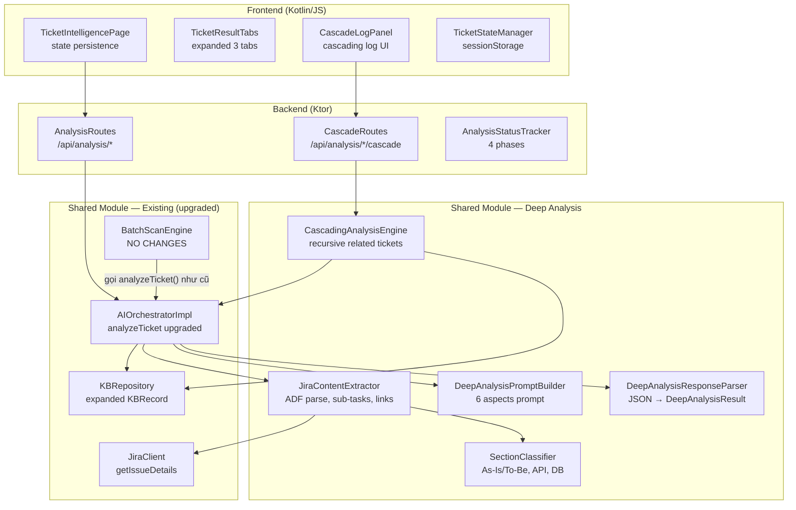

# Ticket Intelligence — Design

## Ticket Intelligence (MH5) — Frontend-Backend Real-Time Progress — Polling Strategy

Frontend sử dụng **fire-and-forget + polling** pattern qua `window.fetch` (không dùng ktor-client-js để tránh coroutine timeout cho long-running requests):

1. `POST /api/analysis/{ticketId}/reanalyze` trả về **202 Accepted** ngay lập tức — server launch analysis async trong `CoroutineScope(Dispatchers.IO)`
2. Frontend hiển thị blocking overlay + progress bar simulation ngay sau khi fire request
3. Sau 2s, bắt đầu polling `GET /api/analysis/{ticketId}/status` mỗi 3s qua `window.fetch`
4. Khi polling detect COMPLETE hoặc 404 → fetch kết quả từ `GET /api/analysis/{ticketId}` → hiển thị tabs
5. `GET /api/analysis/{ticketId}` kiểm tra nếu analysis đang chạy (trả 202 + status), nếu không thì trả KB cache result (200 + AnalysisResult)
6. Response format cho status endpoint:
   - **200 OK** + `AnalysisStatus` JSON khi analysis đang active
   - **404 Not Found** khi không có active analysis — frontend xử lý như "analysis đã xong"

*(Cập nhật: chuyển từ long-running HTTP request + polling fallback sang fire-and-forget + polling-only. Lý do: ktor-client-js cancel internal coroutine khi HTTP request >5 phút, gây "StandaloneCoroutine was cancelled" error)*

```kotlin
@Serializable
data class AnalysisStatus(
    val ticketId: String,
    val phase: String,       // "FETCHING_JIRA", "EXTRACTING_CONTENT", "AI_ANALYZING", "KB_SYNCING", "COMPLETE"
    val progressPercent: Int  // 0-100
)
```

Backend sử dụng typed `AnalysisPhase` enum với 4 progress ranges (Req 3, 21.4):

```kotlin
enum class AnalysisPhase(val startPercent: Int, val endPercent: Int) {
    FETCHING_JIRA(0, 20),
    EXTRACTING_CONTENT(20, 35),
    AI_ANALYZING(35, 85),
    KB_SYNCING(85, 100),
    COMPLETE(100, 100);
}
```

Frontend `TicketProgressBar` simulates 4 phases matching these ranges, with backward compatibility mapping `"METADATA"` → `FETCHING_JIRA`. Phase labels: "Fetching Jira Data..." (0-20%), "Extracting Content..." (20-35%), "AI Analyzing Scope..." (35-85%), "Syncing to Knowledge Base..." (85-95%).

### Ticket Analysis States (Req 11-14)

Backend phân biệt 5 trạng thái phân tích ticket:

```kotlin
enum class TicketAnalysisState {
    NOT_ANALYZED,  // Chưa phân tích — chưa có KBRecord
    SCANNED,       // Đã quét — batch scan đã chạy nhưng chưa deep analyze (có KBRecord nhưng không có deep analysis fields)
    ANALYZED,      // Đã phân tích — deep analysis đầy đủ (có businessSummary hoặc technicalDetails hoặc acceptanceCriteria)
    HAS_UPDATES,   // Có cập nhật mới — ticket đã thay đổi sau lần phân tích cuối
    ANALYZING      // Đang phân tích — đang trong quá trình scan/analyze
}
```

Backend xác định trạng thái trong `ProjectRoutes.kt` (`GET /api/projects/{key}/tickets/status`):
- `ANALYZING` — ticket đang được scan/analyze (currentTicketId match)
- `HAS_UPDATES` — có KBRecord nhưng ticket đã thay đổi sau lần phân tích cuối
- `ANALYZED` — có KBRecord VÀ có deep analysis data (`hasDeepAnalysis()`: businessSummary không rỗng, hoặc có apiSpecifications, hoặc có acceptanceCriteria)
- `SCANNED` — có KBRecord nhưng KHÔNG có deep analysis data (chỉ batch scan cơ bản)
- `NOT_ANALYZED` — chưa có KBRecord

Frontend hiển thị nút hành động động:
- NOT_ANALYZED / SCANNED → nút "ANALYZE" (Req 12)
- HAS_UPDATES → nút "RE-ANALYZE" (Req 13)
- ANALYZING → nút disabled "ANALYZING..." + spinner (Req 14)
- ANALYZED → nút "RE-ANALYZE" (outline style)

*(Validates: Req 3, 11-14, 21.4)*

---

## Ticket Intelligence — Combobox & Dynamic Actions (MH5 mở rộng)

Ticket Intelligence sử dụng searchable combobox thay vì text input, hiển thị trạng thái phân tích ticket, và nút hành động động.

### Implementation Files

| Component | File | Trách nhiệm |
|-----------|------|-------------|
| HTML Template | `resources/templates/ticket-intelligence.html` | Combobox wrapper, status badge, action button, progress bar, 3 result tabs |
| Combobox Logic | `pages/ticket/TicketCombobox.kt` | Self-contained: debounced search (250ms), dropdown render (appended to body, position:fixed), ticket selection, dynamic action button, state save |
| Analysis Flow | `pages/ticket/TicketAnalysisFlow.kt` + `pages/ticket/TicketAnalysisFlowUI.kt` | Fire-and-forget pattern: POST /reanalyze via window.fetch (returns 202), polling status via window.fetch every 3s, fetch result via window.fetch when COMPLETE/404. No ktor-client-js for analysis requests (avoids coroutine timeout). Double-click guard (`isAnalyzing` flag), refresh detection via sessionStorage (`checkAndResumeAnalysis()`). UI helpers extracted to FlowUI for SRP. `cleanup()` cancels jobs + removes overlay on navigate away |
| CSS | `resources/styles/components.css` | Combobox dropdown, status badges (not-analyzed, scanned, analyzed, has-updates, analyzing) |

### Combobox Behavior

- Load ticket list từ `GET /api/projects/{key}/tickets/status` khi page render (gợi ý từ project hiện tại)
- Debounce 250ms khi user gõ (Req 15 — giảm từ 300ms xuống 250ms cho UX tốt hơn)
- Filter theo ticketId hoặc summary (case-insensitive)
- Dropdown appended to `document.body` với `position:fixed` để thoát stacking context của glass-card containers. Vị trí tính toán từ `getBoundingClientRect()` của input, cập nhật khi resize/scroll
- Click outside → auto-select nếu text khớp chính xác ticket ID (case-insensitive) trong list hiện tại, accept cross-project nếu valid ticket ID pattern nhưng không thuộc list, restore về ticket cũ nếu text không hợp lệ, hide dropdown (Req 15.1, 15.2)
- Cross-project support: `isValidTicketId(text)` validate regex `^[A-Z][A-Z0-9]+-\d+$`, `getTypedTicketId()` extract ID từ input, `acceptCrossProjectTicket(ticketId)` tạo synthetic `TicketAnalysisStatus` với state NOT_ANALYZED
- ANALYZE button fallback chain: `selectedTicket ?: tryAcceptTypedTicketId() ?: return` — nếu không có ticket từ dropdown, thử accept typed cross-project ticket ID
- `setInputText(text)` — public method cho phép set combobox input text từ bên ngoài (dùng bởi `TicketIntelligencePage` cho immediate restore)
- All event binding self-contained trong `TicketCombobox.kt` (không còn bind từ `TicketIntelligencePage`)
- `reset()` method xóa state khi page re-render

### Dynamic Action Button Logic

```
selectTicket(ticket) →
  NOT_ANALYZED / SCANNED → btn "ANALYZE" (vibrant)
  ANALYZED → btn "RE-ANALYZE" (outline)
  HAS_UPDATES → btn "RE-ANALYZE" (vibrant)
  ANALYZING → btn "ANALYZING..." (disabled + spinner)
```

*(Validates: Req 1, 11-15)*

---

## Liên kết Spec

> **Deep Analysis Enhancement**: Đã merge từ spec `ticket-intelligence-deep-analysis` vào spec này. Xem phần Deep Analysis Design bên dưới.

---

# Deep Analysis — Design

## Tổng quan

Deep Analysis nâng cấp pipeline phân tích AI chung (`AIOrchestrator.analyzeTicket()`) mà cả Ticket Intelligence lẫn Dashboard Batch Scan đều sử dụng. Pipeline mới:

1. **Jira Content Extractor** — Parse ADF có cấu trúc, lấy sub-tasks, linked issues, comments, changelog, attachments metadata
2. **Section Classifier** — Nhận diện As-Is/To-Be, API specs, DB changes, external integrations, acceptance criteria
3. **Deep Analysis Prompt Builder** — Prompt chi tiết 6 khía cạnh với strict JSON output
4. **Deep Analysis Response Parser** — Parse AI response thành `DeepAnalysisResult`, validate Scrum Points
5. **Cascading Analysis Engine** — Đệ quy phát hiện và phân tích ticket liên quan chưa có trong KB

### Quyết định thiết kế chính

1. **Nâng cấp tại tầng AIOrchestrator** — `BatchScanEngine.processTicket()` KHÔNG thay đổi
2. **Backward compatible data models** — Trường mới optional với default values
3. **StructuredTicketContent** là intermediate model — không serialize vào KB
4. **Cascading analysis tuần tự** — Dùng cùng AI semaphore, safety limit 50 tickets (configurable)
5. **Frontend state persistence** — sessionStorage lưu selected ticket (ticketId + ticketSummary) + analysis result + active tab. Khi quay lại trang: Phase 1 (immediate) hiển thị text ticket từ sessionStorage vào combobox ngay lập tức mà không chờ API; Phase 2 (deferred) sau khi API trả về, đồng bộ `selectedTicket` object đầy đủ từ `ticketList` via `selectTicketSilently()` khi đã có `analysisResult` trong session (tránh trigger auto-load → skeleton flash), hoặc `selectTicket()` khi chưa có results (trigger auto-load từ KB cache) (Req 23.1)
6. **Tách file theo Kotlin code standards** — Max 200 dòng/file, max 20 dòng/function, models package riêng
7. **Deep analysis components optional** — `AIOrchestratorImpl` nhận `JiraContentExtractor?`, `DeepAnalysisPromptBuilder?`, `DeepAnalysisResponseParser?` là optional constructor params. Khi không inject → fallback sang legacy prompt/parse. Khi đã inject nhưng Jira API fail tại runtime (network, rate limit, session expired) → `tryAnalyzeWithRetry()` catch exception từ prompt build, log đầy đủ message + stack trace, trả null để failover sang provider tiếp theo. Exception không bị nuốt — stack trace luôn hiện trong server log. Đảm bảo backward compatibility và traceability (Req 21.5)
8. **KB deep analysis stored as JSON blob** — Trường `deep_analysis_json TEXT` trong bảng `kb_records` chứa serialized `KBDeepAnalysisData`. Old records với `'{}'` deserialize thành defaults
9. **BatchScanEngine skip redundant fetch** — Khi `jiraContentExtractor` available, `fetchTicketContent()` trả về empty string vì `analyzeTicket()` đã gọi extractor internally. Tránh double Jira API calls
10. **SubTaskInfo có trường `key`** — Ngoài `summary` và `status`, thêm `key` (Jira issue key) để CascadingAnalysisEngine phát hiện sub-task tickets liên quan
11. **StructuredTicketContent có trường `parentKey`** — Key của parent ticket, dùng cho cascading analysis discovery


---

## Deep Analysis — Kiến trúc (Architecture)



## Deep Analysis — Components

### JiraContentExtractor
Thay thế `BatchScanTicketProcessor.fetchTicketContent()`. Gọi `JiraClient.getIssueDetails()` (với `expand=changelog`), parse ADF, lấy sub-tasks (key + summary + status), links, comments, changelog, attachments metadata, parent key. Delegate section classification sang `SectionClassifier`. Constructor nhận `jiraClientProvider: () -> JiraClient` (lambda) thay vì `JiraClient` trực tiếp — đảm bảo credentials được đọc fresh từ DB mỗi lần gọi, tránh bị đóng băng `NoOpJiraClient` khi `AIOrchestratorImpl` (singleton) được tạo lúc startup mà Jira chưa configured. Sau khi extract ticket chính, fetch content chi tiết của tất cả linked tickets (ưu tiên blocking > linked > sub-tasks, không giới hạn số lượng), lưu vào `linkedTicketContents` (Req 27.1-27.2). `collectLinkedKeys()` validate mỗi key theo `TICKET_PATTERN` regex (`[A-Z][A-Z0-9]+-\d+`) trước khi fetch — keys không hợp lệ (ví dụ "active-jobs", "documents") bị filter ra và log warning, tránh HTTP 404 và `IllegalStateException` (Req 27.6, bugfix spec `invalid-jira-key-fetch`). Implementation split thành: `JiraContentExtractorImpl.kt` (orchestration + linked ticket fetching + key validation), `JiraFieldMappers.kt` (pure mapping functions), `JiraExtendedModels.kt` + `JiraChangelogModels.kt` (Jira API models).

### SectionClassifier
Pattern matching: As-Is/To-Be headings, HTTP methods + URL paths, DB table patterns, external service names, acceptance criteria patterns. Implementation split thành: `SectionClassifierImpl.kt` (orchestration + confidence), `SectionPatterns.kt` (regex constants), `SectionExtractors.kt` (per-section extraction), `SectionExtractorHelpers.kt` (low-level helpers).

### DeepAnalysisPromptBuilder
Thay thế `AIOrchestratorImpl.buildAnalysisPrompt()`. 6 khía cạnh phân tích, strict JSON output schema, instruction không bịa đặt. Thêm section "RELATED TICKETS CONTEXT" inject nội dung linked tickets (Req 27.3-27.4) và "DIAGRAM GENERATION" yêu cầu AI sinh Mermaid diagrams (Req 28.1). JSON schema bao gồm `diagrams` array. Implementation split thành: `DeepAnalysisPromptBuilderImpl.kt` (orchestration), `PromptSectionTicketData.kt` (ticket data sections + linked tickets context + diagram instructions), `PromptSectionTechnical.kt` (API/DB/analysis instructions), `PromptJsonSchema.kt` (JSON output schema constant).

### DeepAnalysisResponseParser
Thay thế `AIOrchestratorImpl.parseAIResponse()`. Strip markdown fences, parse JSON, default values cho optional fields, validate Scrum Points, tính extraction_confidence. Implementation split thành: `DeepAnalysisResponseParserImpl.kt` (orchestration), `ResponseJsonModels.kt` (intermediate AI response models), `ResponseToResultMapper.kt` (mapping + validation), `ResponseParserHelpers.kt` (fence stripping + confidence), `ScrumPointsValidator.kt` (Fibonacci scale normalization). Throws `DeepAnalysisParseException` — caller (AIOrchestrator) handles retry.

### CascadingAnalysisEngine
BFS queue-based, tuần tự, Set visited tickets, safety limit 50, cùng AI semaphore. Log: DISCOVERED, ANALYZING, COMPLETED, SKIPPED, FAILED, CASCADE, DONE. Implementation split thành: `CascadingAnalysisEngineImpl.kt` (BFS loop), `CascadeState.kt` (queue + visited set + counters), `CascadeProcessing.kt` (per-ticket processing extensions), `RelatedTicketCollector.kt` (discovers related tickets from issue links, sub-tasks, parent, comment mentions via regex `[A-Z][A-Z0-9]+-\d+`). `RelatedTicketCollector` cũng validate keys từ issue links, sub-tasks, và parent theo `TICKET_PATTERN` — keys không hợp lệ bị filter ra trước khi đưa vào cascade queue (Req 27.6, bugfix spec `invalid-jira-key-fetch`).

### Frontend Components

| Component | File | Trách nhiệm |
|-----------|------|-------------|
| `TicketStateManager` | `pages/ticket/TicketStateManager.kt` | sessionStorage save/restore |
| `ContextTabRenderer` | `pages/ticket/ContextTabRenderer.kt` | Business summary (deep analysis) hoặc unified summary fallback (batch scan), As-Is/To-Be, extracted requirements, affected modules, diagrams. Delegates enrichment sections tới `ContextTabEnrichment` |
| `ContextTabEnrichment` | `pages/ticket/ContextTabEnrichment.kt` | Dependencies Overview (blocking issues + risk badges + related count), Acceptance Criteria preview (top 3 + Complexity tab link), Analysis Info (timestamp, provider, confidence badge). Split từ ContextTabRenderer cho SRP |
| `TechnicalDetailsRenderer` | `pages/ticket/TechnicalDetailsRenderer.kt` | API specs table, DB changes table, external integrations list (split from ContextTabRenderer for SRP) |
| `DiagramRenderer` | `pages/ticket/DiagramRenderer.kt` | Format router — checks `diagram.format` and delegates to `MermaidDiagramRenderer` (format `"mermaid"` or empty) or `DrawioDiagramRenderer` (format `"drawio"`). Lazy loads only needed libraries. See spec `drawio-template-diagrams` for draw.io details. Req 28.3-28.5, drawio Req 6.1-6.4 |
| `MermaidDiagramRenderer` | `pages/ticket/MermaidDiagramRenderer.kt` | Extracted Mermaid logic: per-diagram rendering via `window.__mermaidRenderOne(el)`, sanitizes AI output (strips fences, removes trailing semicolons, quotes labels containing parentheses/commas/non-ASCII chars in both `[]` and `{}` delimiters), fallback to code block. Mermaid.js CDN, dark theme, `suppressErrorRendering: true`. Req 28.3-28.5 |
| `DrawioDiagramRenderer` | `pages/ticket/DrawioDiagramRenderer.kt` | draw.io rendering: merges JSON metadata into XML template via `DrawioTemplateEngine`, renders via locally bundled viewer (`/js/viewer-static.min.js`), fallback to `.drawio` download. See spec `drawio-template-diagrams` Req 5.1-5.7, bugfix `brd-diagram-and-sections-fix` |
| `EvolutionTabRenderer` | `pages/ticket/EvolutionTabRenderer.kt` | Neural console timeline với changeType badges |
| `ComplexityTabRenderer` | `pages/ticket/ComplexityTabRenderer.kt` | Scrum Points gradient, rationale, acceptance criteria, KB references |
| `DependencySectionRenderer` | `pages/ticket/DependencySectionRenderer.kt` | Blocking/related issues với risk badges, external deps (split from ComplexityTabRenderer for SRP) |
| `CascadeLogPanel` | `pages/ticket/CascadeLogPanel.kt` | Cascading analysis log + progress bar polling |
| `CascadeLogEntryRenderer` | `pages/ticket/CascadeLogEntryRenderer.kt` | Individual log entry rendering với color-coded status badges |
| `CascadeIntegration` | `pages/ticket/CascadeIntegration.kt` | Orchestrates cascade trigger after analysis, monitors completion, refreshes Complexity tab |
| `ConfidenceBadge` | `pages/ticket/ConfidenceBadge.kt` | Analysis metadata badge + LOW confidence warning banner |
| `TicketAutoLoader` | `pages/ticket/TicketAutoLoader.kt` | Auto-loads cached results for ANALYZED/SCANNED/HAS_UPDATES tickets with skeleton loading |
| `TicketProgressBar` | `pages/ticket/TicketProgressBar.kt` | 4-phase progress simulation + status-driven updates |

### Frontend Display Models

| Model | File | Trách nhiệm |
|-------|------|-------------|
| `TicketTab` | `models/DeepAnalysisDisplayModels.kt` | Tab enum (CONTEXT, EVOLUTION, COMPLEXITY) |
| `TicketPageState` | `models/DeepAnalysisDisplayModels.kt` | Serializable state for sessionStorage persistence. Bao gồm `selectedTicketId`, `selectedTicketSummary` (cho immediate restore khi quay lại trang — Req 23.1), `activeTab`, `analysisResult` |
| `ConfidenceDisplay` | `models/DeepAnalysisDisplayModels.kt` | Maps ExtractionConfidence → CSS colors/labels/showWarning |
| `MetadataBadgeInfo` | `models/DeepAnalysisDisplayModels.kt` | Display helper for metadata badge |

### Backend Components (Server Module)

| Component | File | Trách nhiệm |
|-----------|------|-------------|
| `AnalysisStatusTracker` | `routes/AnalysisRoutes.kt` | In-memory ConcurrentHashMap tracking 4-phase analysis progress per ticket |
| `CascadeStatusTracker` | `routes/CascadeStatusTracker.kt` | In-memory ConcurrentHashMap tracking cascade progress per ticket |
| `CascadeRoutes` | `routes/CascadeRoutes.kt` | POST cascade (async), GET cascade/status (polling) |
| `ChatDeepAnalysisContext` | `chat/ChatDeepAnalysisContext.kt` | Builds deep analysis context strings for AI chat prompts |

### Shared Module — Extracted Helper Files

| Component | File | Trách nhiệm |
|-----------|------|-------------|
| `AIOrchestratorKBMapper` | `ai/AIOrchestratorKBMapper.kt` | KBRecord ↔ AnalysisResult mapping with deep analysis fields |
| `LegacyResponseMapper` | `ai/LegacyResponseMapper.kt` | Legacy prompt builder + response parser (fallback when deep analysis not injected) |
| `KBDeepAnalysisData` | `kb/KBDeepAnalysisData.kt` | Serializable container for deep_analysis_json column + toDeepAnalysisData() extension |

## Deep Analysis — Data Models

### Shared Module — `com.assistant.ai.deepanalysis.models/`

| File | Classes | Trách nhiệm |
|------|---------|-------------|
| `TechnicalDetails.kt` | `TechnicalDetails`, `ApiSpecification`, `DatabaseChange`, `ExternalIntegration` | Technical specs from analysis (Req 19.2) |
| `AcceptanceCriterion.kt` | `AcceptanceCriterion` | AC with id, description, testabilityAssessment (Req 19.3) |
| `DependencyInfo.kt` | `DependencyInfo`, `DependencyItem` | Blocking/related/external deps (Req 19.4) |
| `AnalysisMetadata.kt` | `AnalysisMetadata`, `ExtractionConfidence` | Confidence enum + metadata (Req 19.5) |
| `TicketContentModels.kt` | `SubTaskInfo` (key+summary+status), `IssueLinkInfo`, `AttachmentInfo`, `CommentInfo`, `ChangelogEntry` | Jira ticket auxiliary models (Req 16.3-16.7) |
| `StructuredTicketContent.kt` | `StructuredTicketContent` | Consolidated Jira data + parentKey + classifiedContent (Req 16.8, 26.1) |
| `ClassifiedContent.kt` | `ClassifiedContent` | Classified description sections with confidence (Req 17.1-17.6) |
| `CascadeModels.kt` | `CascadeLogStatus`, `CascadeStatus`, `CascadeLogEntry`, `CascadeResult` | Cascade analysis state + log (Req 26.8-26.9) |

### KB Storage — `deep_analysis_json` column

Deep analysis fields stored as single JSON blob in `kb_records.deep_analysis_json TEXT NOT NULL DEFAULT '{}'`. Serialized via `KBDeepAnalysisData` container. Old records with `'{}'` deserialize to defaults (Req 20.4).

## Deep Analysis — Error Handling

| Tình huống | Xử lý |
|-----------|-------|
| Jira API không khả dụng | Fallback sang KB cache hoặc trả lỗi rõ ràng |
| ADF parse thất bại | Giữ raw description, confidence LOW |
| AI response JSON không hợp lệ | Retry tối đa 2 lần |
| Scrum Points ngoài thang | Làm tròn đến giá trị gần nhất |
| KBRecord cũ thiếu trường mới | Default values, không gây lỗi |
| Cascading vòng lặp | Set visited tickets, skip đã thăm |
| Cascading vượt giới hạn 50 | Log cảnh báo, dừng |
| sessionStorage lỗi | Graceful degradation |
