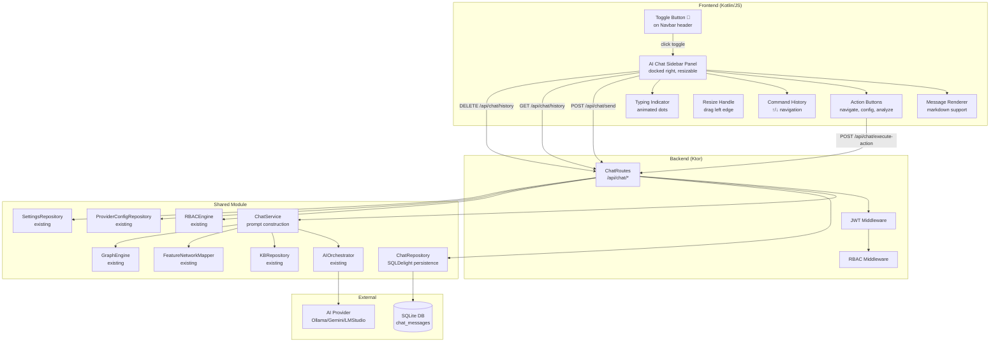
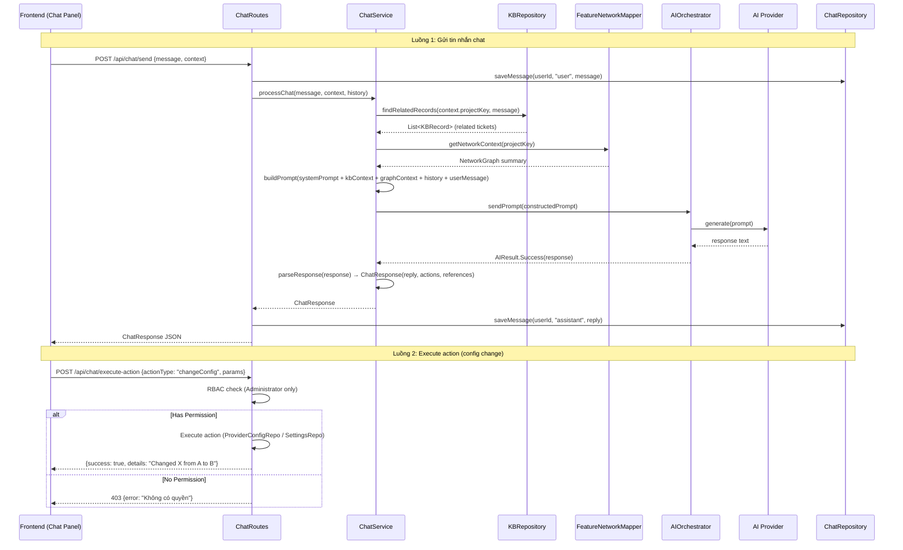

# AI Chat Sidebar — Design

# Thiết kế AI Chat Sidebar — Trợ lý AI Tương tác

## Tổng quan (Overview)

AI Chat Sidebar là panel chat AI docked bên phải trong Shell layout, có thể resize bằng drag handle. Cho phép người dùng tương tác với hệ thống qua ngôn ngữ tự nhiên. Sidebar tích hợp sâu với AI_Orchestrator (OllamaAgent), Knowledge_Base, và Relationship Network để cung cấp câu trả lời có ngữ cảnh dự án. Ngoài ra, sidebar hỗ trợ điều hướng ứng dụng và thay đổi cấu hình (với RBAC check).

### Quyết định thiết kế chính

1. **Panel docked bên phải trong Shell**: AI Chat Sidebar nằm trong flexbox layout của Shell (Sidebar | MainContent | ChatPanel). Không phải fixed overlay. Toggle button 💬 trên Navbar header, bên cạnh project badge
2. **Resizable**: Drag handle ở cạnh trái panel, width 280–600px (default 380px). CSS `display:none/flex` thay vì transform
3. **Textarea multiline**: Input dùng `<textarea rows="3">`, Shift+Enter xuống dòng, Enter gửi. Resize vertical, min-height 60px, max-height 160px
4. **ChatService dùng OllamaAgent trực tiếp**: ChatServiceImpl inject `aiAgentProvider` lambda tạo OllamaAgent từ DB config mỗi lần gọi (không qua Koin `get<AIAgent>()`)
5. **Per-user chat history trong SQLDelight**: Bảng `chat_messages` lưu toàn bộ tin nhắn per-user, hỗ trợ phân trang và xóa lịch sử. DB cũ cần xóa khi thêm bảng mới
6. **Action system**: AI response chứa `actions` — hành động đề xuất (navigate, changeConfig, triggerAnalysis). Frontend render action buttons, backend validate RBAC
7. **KB-First strategy cho chat**: Khi user hỏi về ticket cụ thể, ChatService truy vấn KB trước, inject kết quả vào prompt context
8. **Command history navigation**: Frontend lưu danh sách user messages, phím ↑/↓ điều hướng

---

## Kiến trúc (Architecture)



### Luồng dữ liệu chính



---

## Thành phần & Giao diện (Components and Interfaces)

### 1. ChatService Interface

```kotlin
// shared/.../chat/ChatService.kt
interface ChatService {
    /**
     * Xử lý tin nhắn chat: xây dựng prompt với KB context + graph context + history,
     * gửi đến AI provider, parse response thành ChatResponse.
     */
    suspend fun processChat(
        message: String,
        context: ChatContext,
        conversationHistory: List<ChatMessage>
    ): ChatResponse

    /**
     * Xây dựng system prompt cho AI chat.
     */
    fun buildSystemPrompt(context: ChatContext): String
}

@Serializable
data class ChatContext(
    val projectKey: String,
    val currentScreen: String,    // "dashboard", "knowledge_graph", etc.
    val userRole: String,         // "ADMINISTRATOR", "NEURAL_ARCHITECT", "READER"
    val userId: String
)
```

### 2. ChatServiceImpl

```kotlin
// shared/.../chat/ChatServiceImpl.kt
class ChatServiceImpl(
    private val aiOrchestrator: AIOrchestrator,
    private val kbRepository: KBRepository,
    private val featureNetworkMapper: FeatureNetworkMapper,
    private val graphEngine: GraphEngine
) : ChatService {

    override suspend fun processChat(
        message: String,
        context: ChatContext,
        conversationHistory: List<ChatMessage>
    ): ChatResponse {
        // 1. Query KB for related ticket data
        val kbContext = buildKBContext(context.projectKey, message)

        // 2. Query graph for relationship context
        val graphContext = buildGraphContext(context.projectKey)

        // 3. Build full prompt
        val systemPrompt = buildSystemPrompt(context)
        val fullPrompt = """
            $systemPrompt
            
            --- KNOWLEDGE BASE CONTEXT ---
            $kbContext
            
            --- RELATIONSHIP NETWORK CONTEXT ---
            $graphContext
            
            --- CONVERSATION HISTORY ---
            ${formatHistory(conversationHistory)}
            
            --- USER MESSAGE ---
            $message
        """.trimIndent()

        // 4. Send to AI provider via orchestrator
        val aiResult = aiOrchestrator.generateChatResponse(fullPrompt)

        // 5. Parse response into structured ChatResponse
        return parseAIResponse(aiResult)
    }

    override fun buildSystemPrompt(context: ChatContext): String = """
        Bạn là trợ lý AI của Jira Assistant, hỗ trợ quản lý dự án Agile.
        Project hiện tại: ${context.projectKey}
        Màn hình hiện tại: ${context.currentScreen}
        Vai trò người dùng: ${context.userRole}
        
        Quy tắc:
        - Trả lời dựa trên dữ liệu Knowledge Base khi có
        - Đề xuất hành động cụ thể khi phù hợp (navigate, analyze, config)
        - Format response dạng JSON: {"reply": "...", "actions": [...], "references": [...]}
        - Actions format: {"type": "navigate|changeConfig|triggerAnalysis", "label": "...", "params": {...}}
        - References format: {"type": "ticket|screen", "id": "...", "label": "..."}
    """.trimIndent()

    private suspend fun buildKBContext(projectKey: String, message: String): String {
        // Extract ticket IDs from message (e.g., "PROJ-123")
        val ticketPattern = Regex("[A-Z]+-\\d+")
        val mentionedTickets = ticketPattern.findAll(message).map { it.value }.toList()

        val kbRecords = mentionedTickets.mapNotNull { kbRepository.findByTicketId(it) }
        if (kbRecords.isEmpty()) return "Không có dữ liệu KB liên quan."

        return kbRecords.joinToString("\n") { record ->
            "Ticket ${record.ticketId}: ${record.requirementSummary} | " +
            "Scrum Points: ${record.scrumPoints} | Confidence: ${record.confidenceScore}"
        }
    }

    private suspend fun buildGraphContext(projectKey: String): String {
        val graph = kbRepository.getGraphData(projectKey) ?: return "Chưa có dữ liệu graph."
        val clusters = graphEngine.detectClusters(graph)
        return "Graph: ${graph.nodes.size} nodes, ${graph.edges.size} edges, ${clusters.size} clusters"
    }

    private fun formatHistory(history: List<ChatMessage>): String {
        return history.takeLast(20).joinToString("\n") { msg ->
            "${msg.role}: ${msg.message}"
        }
    }

    private fun parseAIResponse(aiResult: String): ChatResponse {
        // Try parse JSON response from AI
        return try {
            Json.decodeFromString<ChatResponse>(aiResult)
        } catch (e: Exception) {
            // Fallback: treat entire response as plain text reply
            ChatResponse(
                reply = aiResult,
                actions = emptyList(),
                references = emptyList()
            )
        }
    }
}
```

### 3. ChatRepository Interface

```kotlin
// shared/.../chat/ChatRepository.kt
interface ChatRepository {
    suspend fun saveMessage(userId: String, role: String, message: String, context: String? = null): Long
    suspend fun getHistory(userId: String, page: Int = 0, size: Int = 50): List<ChatMessage>
    suspend fun getHistoryCount(userId: String): Long
    suspend fun deleteHistory(userId: String): Boolean
    suspend fun getUserMessageList(userId: String): List<String>  // For command history
}
```

### 4. ChatRepositoryImpl (SQLDelight)

```kotlin
// shared/.../chat/ChatRepositoryImpl.kt
class ChatRepositoryImpl(
    private val database: JiraDatabase
) : ChatRepository {

    override suspend fun saveMessage(userId: String, role: String, message: String, context: String?): Long {
        val timestamp = Clock.System.now().toString()
        database.chatMessagesQueries.insertChatMessage(
            user_id = userId,
            role = role,
            message = message,
            context = context,
            timestamp = timestamp
        )
        return database.chatMessagesQueries.lastInsertRowId().executeAsOne()
    }

    override suspend fun getHistory(userId: String, page: Int, size: Int): List<ChatMessage> {
        val offset = (page * size).toLong()
        return database.chatMessagesQueries
            .getChatHistory(user_id = userId, limit = size.toLong(), offset = offset)
            .executeAsList()
            .map { row ->
                ChatMessage(
                    id = row.id,
                    userId = row.user_id,
                    role = row.role,
                    message = row.message,
                    context = row.context_,
                    timestamp = row.timestamp
                )
            }
    }

    override suspend fun getHistoryCount(userId: String): Long {
        return database.chatMessagesQueries.getChatHistoryCount(userId).executeAsOne()
    }

    override suspend fun deleteHistory(userId: String): Boolean {
        database.chatMessagesQueries.deleteChatHistory(userId)
        return true
    }

    override suspend fun getUserMessageList(userId: String): List<String> {
        return database.chatMessagesQueries
            .getUserMessages(user_id = userId)
            .executeAsList()
            .map { it.message }
    }
}
```

### 5. ChatRoutes (Backend API)

```kotlin
// server/.../routes/ChatRoutes.kt
fun Routing.chatRoutes() {
    val chatService by inject<ChatService>()
    val chatRepository by inject<ChatRepository>()
    val rbacEngine by inject<RBACEngine>()
    val providerConfigRepo by inject<ProviderConfigRepository>()
    val settingsRepo by inject<SettingsRepository>()

    route("/api/chat") {
        authenticate("auth-jwt") {

            // POST /api/chat/send — Gửi tin nhắn chat
            post("/send") {
                val principal = call.principal<JWTPrincipal>()!!
                val userId = principal.getClaim("userId", String::class)!!
                val userRole = principal.getClaim("role", String::class)!!
                val request = call.receive<ChatRequest>()

                // Save user message
                chatRepository.saveMessage(userId, "user", request.message, request.context?.currentScreen)

                // Load recent history
                val history = chatRepository.getHistory(userId, page = 0, size = 20)

                // Build context
                val context = request.context ?: ChatContext(
                    projectKey = principal.getClaim("projectKey", String::class) ?: "",
                    currentScreen = "unknown",
                    userRole = userRole,
                    userId = userId
                )

                // Process via ChatService
                val response = chatService.processChat(request.message, context, history)

                // Save assistant response
                chatRepository.saveMessage(userId, "assistant", response.reply)

                call.respond(response)
            }

            // POST /api/chat/execute-action — Thực hiện hành động AI đề xuất
            post("/execute-action") {
                val principal = call.principal<JWTPrincipal>()!!
                val userId = principal.getClaim("userId", String::class)!!
                val userRole = principal.getClaim("role", String::class)!!
                val request = call.receive<ChatActionRequest>()

                when (request.actionType) {
                    "changeConfig" -> {
                        // RBAC check: Administrator only
                        if (userRole != "ADMINISTRATOR") {
                            call.respond(HttpStatusCode.Forbidden,
                                mapOf("error" to "Bạn không có quyền thực hiện thao tác này."))
                            return@post
                        }
                        val result = executeConfigChange(request.parameters, providerConfigRepo, settingsRepo)
                        call.respond(result)
                    }
                    "navigate" -> {
                        // Navigation actions don't need special permissions
                        call.respond(ChatActionResponse(success = true, details = "Navigate to ${request.parameters["screen"]}"))
                    }
                    "triggerAnalysis" -> {
                        // Requires Neural_Architect+
                        val role = UserRole.valueOf(userRole)
                        if (!rbacEngine.hasPermission(role, Permission.ANALYZE_AI)) {
                            call.respond(HttpStatusCode.Forbidden,
                                mapOf("error" to "Bạn không có quyền thực hiện thao tác này."))
                            return@post
                        }
                        call.respond(ChatActionResponse(success = true, details = "Analysis triggered"))
                    }
                    else -> call.respond(HttpStatusCode.BadRequest, mapOf("error" to "Unknown action type"))
                }
            }

            // GET /api/chat/history — Lấy lịch sử hội thoại
            get("/history") {
                val principal = call.principal<JWTPrincipal>()!!
                val userId = principal.getClaim("userId", String::class)!!
                val page = call.request.queryParameters["page"]?.toIntOrNull() ?: 0
                val size = call.request.queryParameters["size"]?.toIntOrNull() ?: 50

                val messages = chatRepository.getHistory(userId, page, size)
                val total = chatRepository.getHistoryCount(userId)
                call.respond(ChatHistoryResponse(messages = messages, total = total, page = page, size = size))
            }

            // DELETE /api/chat/history — Xóa lịch sử hội thoại
            delete("/history") {
                val principal = call.principal<JWTPrincipal>()!!
                val userId = principal.getClaim("userId", String::class)!!
                chatRepository.deleteHistory(userId)
                call.respond(mapOf("success" to true, "message" to "Chat history deleted"))
            }
        }
    }
}
```

### Route Summary

| Endpoint | Method | Auth | RBAC | Mô tả |
|---|---|---|---|---|
| `/api/chat/send` | POST | JWT | Reader+ | Gửi tin nhắn, nhận phản hồi AI |
| `/api/chat/execute-action` | POST | JWT | Tùy action type | Thực hiện hành động AI đề xuất |
| `/api/chat/history` | GET | JWT | Reader+ | Lấy lịch sử hội thoại (phân trang) |
| `/api/chat/history` | DELETE | JWT | Reader+ | Xóa lịch sử hội thoại của user |

---


---

## Thiết kế bổ sung — Context Indicator, Voice Input, File Upload

### Context Window Indicator

Circular progress indicator (SVG circle) bên dưới nút Send:
- Tính toán: `(totalChars / maxContextChars) * 100%`
- `totalChars` = system prompt + KB context + graph context + conversation history + current message
- `maxContextChars` ≈ `maxTokens * 4` (ước lượng 4 chars/token)
- Màu: primary (<80%), warning (80-95%), danger (>95%)
- Tooltip hiển thị "Context: X% used (Y/Z tokens)"
- Backend trả `contextUsage` trong `ChatResponse` để frontend cập nhật

### Voice Input (Web Speech API)

- Sử dụng `window.asDynamic().SpeechRecognition` hoặc `webkitSpeechRecognition`
- `continuous = false`, `interimResults = true`, `lang = "vi-VN"` (fallback "en-US")
- Nút 🎤 toggle recording state
- Recording state: nút đổi màu đỏ + CSS animation pulse
- `onresult` → append transcript vào textarea
- `onend` hoặc silence timeout 3s → stop recording
- Fallback: nếu browser không hỗ trợ → ẩn nút microphone

### File Upload

- `POST /api/chat/upload` — multipart/form-data, max 10MB
- Server lưu file vào `data/chat-uploads/{userId}/{timestamp}-{filename}`
- Response: `{ fileId, fileName, fileType, fileUrl, textContent? }`
- Text extraction:
  - PDF: Apache PDFBox `PDDocument.load()` → `PDFTextStripper`
  - Word (.docx): Apache POI `XWPFDocument` → `XWPFWordExtractor`
  - Excel (.xlsx): Apache POI `XSSFWorkbook` → iterate sheets/rows/cells
  - Image: không extract text (gửi URL cho multimodal AI nếu hỗ trợ)
- `ChatRequest.attachments: List<ChatAttachment>` — fileId, fileName, fileType, fileUrl
- `ChatServiceImpl` inject extracted text vào prompt context

### Clipboard Paste

- Listen `paste` event trên textarea
- Check `event.clipboardData.items` cho `type.startsWith("image/")`
- Convert clipboard item → Blob → FormData → upload via `POST /api/chat/upload`
- Hiển thị thumbnail preview trong input area

### Drag & Drop

- Listen `dragover`, `drop` events trên `.ai-chat-sidebar`
- `event.dataTransfer.files` → validate MIME type → upload
- Visual feedback: border highlight khi dragging over

### Input Area Layout (updated)

```
┌─────────────────────────────────────────┐
│  [textarea - multiline input]           │
├─────────────────────────────────────────┤
│  [📎 attach] [🎤 voice] [➤ send]  ◯%  │
│                                   ctx   │
└─────────────────────────────────────────┘
```


### AI Personalization — Per-User Config

SQLDelight schema:
```sql
CREATE TABLE user_ai_config (
    user_id TEXT NOT NULL PRIMARY KEY,
    skills TEXT NOT NULL DEFAULT '',
    workflow TEXT NOT NULL DEFAULT '',
    instructions TEXT NOT NULL DEFAULT '',
    rules TEXT NOT NULL DEFAULT '',
    updated_at TEXT NOT NULL
);
```

API endpoints:
- `GET /api/chat/config` — JWT auth, trả về `UserAIConfig` của user hiện tại
- `PUT /api/chat/config` — JWT auth, nhận `UserAIConfig` body, lưu vào DB

System prompt injection order:
1. Base system prompt (project key, screen, role)
2. **User skills** → "Người dùng có kỹ năng: {skills}"
3. **User workflow** → "Quy trình làm việc: {workflow}"
4. **User instructions** → "Hướng dẫn: {instructions}"
5. **User rules** → "QUY TẮC BẮT BUỘC: {rules}"
6. KB context
7. Graph context
8. Conversation history
9. User message

UI: Panel config mở từ ⚙️ button trên chat header, 4 textarea fields, nút SAVE.


### Multi-Conversation Management

SQLDelight schema:
```sql
CREATE TABLE chat_conversations (
    id TEXT NOT NULL PRIMARY KEY,
    user_id TEXT NOT NULL,
    title TEXT NOT NULL DEFAULT 'New Chat',
    created_at TEXT NOT NULL,
    updated_at TEXT NOT NULL
);
CREATE INDEX idx_chat_conv_user ON chat_conversations(user_id, updated_at DESC);

-- Update chat_messages: add conversation_id
ALTER TABLE chat_messages ADD COLUMN conversation_id TEXT NOT NULL DEFAULT '';
CREATE INDEX idx_chat_msg_conv ON chat_messages(conversation_id, timestamp ASC);
```

API endpoints:
- `GET /api/chat/conversations` — list conversations (newest first)
- `POST /api/chat/conversations` — create new, return `{id, title}`
- `DELETE /api/chat/conversations/{id}` — delete conversation + messages
- `PUT /api/chat/conversations/{id}` — rename
- `GET /api/chat/history?conversationId={id}` — messages for specific conversation
- `POST /api/chat/send` — updated: include `conversationId` in request

UI Layout:
```
┌─────────────────────────────────┐
│ AI Assistant  [⚙️] [✕]         │
├─────────────────────────────────┤
│ [➕ New Chat]                   │
│ ▸ How to fix ICL2-1407  (today)│ ← active (highlighted)
│ ▸ Sprint velocity analysis (2d)│
│ ▸ Jira config help      (5d)  │
├─────────────────────────────────┤
│                                 │
│  [chat messages area]           │
│                                 │
├─────────────────────────────────┤
│  [textarea] [📎][🎤][➤] ◯%    │
└─────────────────────────────────┘
```


### Model-Aware Chat UI

Model info endpoint: `GET /api/chat/model-info`
```json
{
  "modelName": "gemma4:e2b",
  "provider": "ollama",
  "supportsVision": false,
  "supportsTools": true,
  "maxTokens": 8192
}
```

Capability detection logic (server-side):
- `supportsVision`: true nếu model name chứa "vision", "4o", "gpt-4", "gemini-1.5-pro", "llava", hoặc provider config có `vision: true`
- `supportsTools`: true nếu có ít nhất 1 MCP server ACTIVE với tools available

Tools endpoint: `GET /api/chat/tools`
```json
[
  { "toolName": "aws-docs", "serverName": "aws-documentation", "description": "Search AWS docs" },
  { "toolName": "query-db", "serverName": "postgres-mcp", "description": "Run SQL queries" }
]
```

@mention parsing in ChatService:
- Regex: `@([a-zA-Z0-9_-]+)` → extract tool names
- Route to MCP server: `McpServerManager.callTool(toolName, context)`
- Combine tool result + AI response

Input area layout (updated):
```
┌─────────────────────────────────────────┐
│  [textarea - multiline input]           │
│  @aws-docs ← autocomplete dropdown     │
├─────────────────────────────────────────┤
│  [📎][🎤][🔧 tools][➤ send]  ◯% ctx   │
│                          gemma4:e2b     │
└─────────────────────────────────────────┘
```
