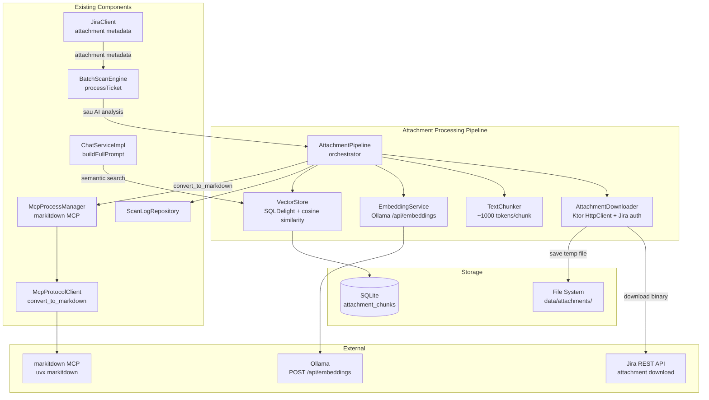
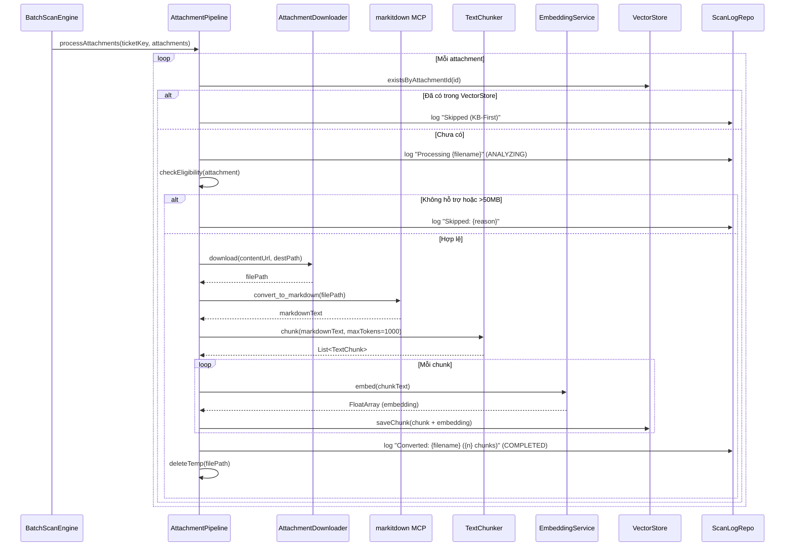

# Attachment Processing Pipeline — Design

# Attachment Processing Pipeline — Thiết kế Chi tiết

## Tổng quan

Attachment Processing Pipeline mở rộng Batch Scan Engine để tự động xử lý file đính kèm trong Jira tickets. Pipeline thực hiện: tải attachment từ Jira → chuyển đổi sang markdown qua markitdown MCP → chia nhỏ text thành chunks → tạo embeddings qua Ollama → lưu vào vector store (SQLDelight). AI Chat sử dụng semantic search trên vector store để bổ sung context từ attachment khi trả lời câu hỏi.

### Quyết định thiết kế chính

1. **JiraAttachment mở rộng**: Thêm field `content: String?` (download URL từ Jira API v3)
2. **AttachmentDownloader**: Service mới trong server module, tải binary qua Ktor HttpClient với Jira Basic auth
3. **Markitdown MCP**: Auto-configure `uvx markitdown` khi chưa có, gọi tool `convert_to_markdown`
4. **EmbeddingService**: Gọi Ollama `POST /api/embed` (v0.20+) với model `nomic-embed-text`, request `{model, input}`, response `{embeddings: [[float, ...]]}`. Endpoint đọc dynamically từ DB config. Fallback support cho legacy response format
5. **TextChunker**: Chia markdown thành chunks ~1000 tokens (word-based splitting, ~750 words/chunk)
6. **VectorStore**: Bảng SQLDelight `attachment_chunks`, cosine similarity search trong Kotlin
7. **AttachmentPipeline**: Orchestrator: download → markitdown → chunk → embed → store. Markitdown ID resolved by name (case-insensitive) thay vì hardcode. Auto-retry markitdown sau crash
8. **Tích hợp BatchScanEngine**: Gọi AttachmentPipeline sau AI analysis trong `processTicket()`. AI calls qua semaphore (default 1), Jira fetch + attachments chạy parallel
9. **Tích hợp ChatService**: Thêm attachment context từ VectorStore semantic search vào prompt

## Kiến trúc



### Luồng xử lý chính



---

## Thành phần & Giao diện (Components and Interfaces)

### 1. JiraAttachment — Mở rộng model

```kotlin
// shared/.../jira/JiraClient.kt — cập nhật
@Serializable
data class JiraAttachment(
    val id: String = "",
    val filename: String = "",
    val mimeType: String? = null,
    val size: Long = 0,
    val content: String? = null  // NEW: download URL từ Jira API v3
)
```

Jira API v3 trả về field `content` chứa URL tải file: `https://{domain}/rest/api/3/attachment/content/{id}`.

### 2. AttachmentDownloader — Tải file từ Jira

```kotlin
// server/.../attachment/AttachmentDownloader.kt
interface AttachmentDownloader {
    /** Tải file từ URL, lưu vào destPath. Trả về true nếu thành công. */
    suspend fun download(contentUrl: String, destPath: String, authHeader: String): Boolean
}
```

**Implementation**: Sử dụng Ktor HttpClient streaming download, ghi vào file. Tạo thư mục parent nếu chưa có.

### 3. TextChunker — Chia text thành chunks

```kotlin
// server/.../attachment/TextChunker.kt
object TextChunker {
    /** Chia text thành chunks, mỗi chunk tối đa maxTokens tokens (~0.75 words/token). */
    fun chunk(text: String, maxTokens: Int = 1000): List<TextChunk>
}

@Serializable
data class TextChunk(
    val index: Int,
    val text: String,
    val tokenCount: Int
)
```

**Thuật toán**: Word-based splitting. Ước lượng 1 token ≈ 0.75 words → maxWords = maxTokens * 0.75 = 750 words. Split theo paragraph boundaries trước, nếu paragraph > limit thì split theo sentence, cuối cùng split theo word.

### 4. EmbeddingService — Tạo embeddings qua Ollama

```kotlin
// server/.../attachment/EmbeddingService.kt
interface EmbeddingService {
    /** Tạo embedding vector cho text. Trả về FloatArray hoặc null nếu lỗi. */
    suspend fun embed(text: String): FloatArray?
}
```

**Implementation**: Gọi Ollama `POST /api/embed` (v0.20+) với body `{"model": "nomic-embed-text", "input": text}`. Parse response `{"embeddings": [[0.1, 0.2, ...]]}` — lấy first array. Fallback: nếu response có legacy `{"embedding": [0.1, ...]}` thì dùng trực tiếp. Endpoint đọc dynamically từ DB config (`ProviderType.OLLAMA`) mỗi lần gọi qua `endpointProvider` lambda.
### 5. VectorStore — Lưu trữ và tìm kiếm vector

```kotlin
// server/.../attachment/VectorStore.kt
interface VectorStore {
    /** Lưu chunk với embedding. */
    suspend fun saveChunk(chunk: AttachmentChunk): Boolean
    
    /** Kiểm tra attachment đã có trong store. */
    suspend fun existsByAttachmentId(attachmentId: String): Boolean
    
    /** Semantic search: tìm top-K chunks gần nhất với query embedding. */
    suspend fun search(queryEmbedding: FloatArray, topK: Int = 5): List<AttachmentChunk>
    
    /** Xóa chunks theo ticket ID. */
    suspend fun deleteByTicketId(ticketId: String): Boolean
}
```

### 6. AttachmentPipeline — Orchestrator

```kotlin
// server/.../attachment/AttachmentPipeline.kt
class AttachmentPipeline(
    private val downloader: AttachmentDownloader,
    private val embeddingService: EmbeddingService,
    private val vectorStore: VectorStore,
    private val mcpProcessManager: McpProcessManager,
    private val scanLogRepository: ScanLogRepository,
    private val jiraAuthProvider: () -> String?  // Basic auth header
) {
    companion object {
        val SUPPORTED_EXTENSIONS = setOf(
            "pdf", "docx", "xlsx", "pptx", "txt", "md",
            "csv", "html", "png", "jpg", "jpeg", "gif"
        )
        const val MAX_FILE_SIZE = 50L * 1024 * 1024  // 50MB
        const val MARKITDOWN_SERVER_ID = "markitdown"
    }

    /** Xử lý tất cả attachments của một ticket. */
    suspend fun processAttachments(
        projectKey: String, ticketKey: String,
        attachments: List<JiraAttachment>
    ): Int  // trả về số chunks đã lưu

    /** Kiểm tra attachment có đủ điều kiện xử lý. */
    fun isEligible(attachment: JiraAttachment): Boolean

    /** Lấy extension từ filename. */
    fun getExtension(filename: String): String
}
```

---

## Mô hình Dữ liệu (Data Models)

### AttachmentChunk

```kotlin
// server/.../attachment/models/AttachmentChunk.kt
@Serializable
data class AttachmentChunk(
    val id: Long = 0,
    val ticketId: String,
    val attachmentId: String,
    val filename: String,
    val chunkIndex: Int,
    val chunkText: String,
    val embedding: List<Float>,  // vector as JSON array
    val createdAt: String        // ISO-8601
)
```

### AttachmentStatus (cho frontend)

```kotlin
// server/.../attachment/models/AttachmentStatus.kt
@Serializable
data class AttachmentStatusResponse(
    val attachmentId: String,
    val filename: String,
    val status: AttachmentProcessingStatus,
    val chunkCount: Int = 0,
    val error: String? = null
)

@Serializable
enum class AttachmentProcessingStatus {
    CONVERTED, PENDING, FAILED
}
```

### EmbeddingRequest/Response (Ollama API v0.20+)

```kotlin
// server/.../attachment/models/EmbeddingModels.kt
@Serializable
data class OllamaEmbeddingRequest(
    val model: String = "nomic-embed-text",
    val input: String = ""  // v0.20+: "input" replaces "prompt"
)

@Serializable
data class OllamaEmbeddingResponse(
    val embeddings: List<List<Float>> = emptyList(),  // v0.20+: array of arrays
    val embedding: List<Float> = emptyList()           // legacy fallback
)
```

### SQLDelight Schema — Bảng `attachment_chunks`

```sql
-- Thêm vào KnowledgeBase.sq

CREATE TABLE attachment_chunks (
    id INTEGER NOT NULL PRIMARY KEY AUTOINCREMENT,
    ticket_id TEXT NOT NULL,
    attachment_id TEXT NOT NULL,
    filename TEXT NOT NULL,
    chunk_index INTEGER NOT NULL,
    chunk_text TEXT NOT NULL,
    embedding TEXT NOT NULL,          -- JSON array of floats
    created_at TEXT NOT NULL
);

CREATE INDEX idx_attachment_chunks_ticket ON attachment_chunks(ticket_id);
CREATE INDEX idx_attachment_chunks_attachment ON attachment_chunks(attachment_id);

-- Queries
insertAttachmentChunk:
INSERT INTO attachment_chunks (ticket_id, attachment_id, filename, chunk_index, chunk_text, embedding, created_at)
VALUES (?, ?, ?, ?, ?, ?, ?);

findChunksByTicketId:
SELECT * FROM attachment_chunks WHERE ticket_id = ? ORDER BY chunk_index ASC;

findChunksByAttachmentId:
SELECT * FROM attachment_chunks WHERE attachment_id = ? ORDER BY chunk_index ASC;

existsAttachmentChunks:
SELECT COUNT(*) FROM attachment_chunks WHERE attachment_id = ?;

getAllChunks:
SELECT * FROM attachment_chunks;

deleteChunksByTicketId:
DELETE FROM attachment_chunks WHERE ticket_id = ?;

deleteChunksByAttachmentId:
DELETE FROM attachment_chunks WHERE attachment_id = ?;
```

---

## Tích hợp với Batch Scan Engine

Cập nhật `BatchScanEngine.processTicket()` — thêm gọi AttachmentPipeline sau AI analysis:

```kotlin
// Trong processTicket(), sau khi lưu KBRecord:
// ... existing AI analysis code ...

// NEW: Process attachments
val issue = jiraClientProvider().getIssueDetails(ticketId)
val attachments = issue?.fields?.attachment ?: emptyList()
if (attachments.isNotEmpty()) {
    attachmentPipeline.processAttachments(projectKey, ticketId, attachments)
}
```

`AttachmentPipeline` được inject vào `BatchScanEngine` constructor (optional dependency — nullable để backward compatible).

## Tích hợp với AI Chat

Cập nhật `ChatServiceImpl.buildFullPrompt()` — thêm attachment context:

```kotlin
// Trong buildFullPrompt():
val attachmentCtx = buildAttachmentContext(context.projectKey, message)
// Thêm vào prompt:
"$base\n...\n--- ATTACHMENT CONTEXT ---\n$attachmentCtx\n--- USER ---\n$message"
```

```kotlin
internal suspend fun buildAttachmentContext(projectKey: String, message: String): String {
    val queryEmbedding = embeddingService.embed(message) ?: return ""
    val chunks = vectorStore.search(queryEmbedding, topK = 5)
    if (chunks.isEmpty()) return "No attachment data."
    return chunks.joinToString("\n") { "[${it.filename}] ${it.chunkText}" }
}
```

## Cosine Similarity — Thuật toán

```kotlin
object CosineSimilarity {
    /** Tính cosine similarity giữa 2 vectors. Trả về giá trị trong [-1, 1]. */
    fun compute(a: FloatArray, b: FloatArray): Float {
        require(a.size == b.size) { "Vectors must have same dimension" }
        var dot = 0f; var normA = 0f; var normB = 0f
        for (i in a.indices) {
            dot += a[i] * b[i]
            normA += a[i] * a[i]
            normB += b[i] * b[i]
        }
        val denom = kotlin.math.sqrt(normA) * kotlin.math.sqrt(normB)
        return if (denom == 0f) 0f else dot / denom
    }
}
```

VectorStore.search() implementation:
1. Tạo embedding cho query text
2. Load tất cả chunks từ DB (hoặc filter theo project)
3. Tính cosine similarity cho mỗi chunk
4. Sort descending, trả về top-K

> **Lưu ý**: Với quy mô nhỏ-trung bình (< 10K chunks), brute-force cosine similarity trong Kotlin đủ nhanh. Nếu cần scale, có thể chuyển sang FAISS hoặc pgvector sau.

---

## Correctness Properties

*A property is a characteristic or behavior that should hold true across all valid executions of a system — essentially, a formal statement about what the system should do. Properties serve as the bridge between human-readable specifications and machine-verifiable correctness guarantees.*

### Property 1: JiraAttachment serialization round-trip

*For any* JiraAttachment với content URL không null, serializing rồi deserializing phải trả về object tương đương — đặc biệt field `content` phải được bảo toàn.

**Validates: Requirements 22.1**

### Property 2: Attachment eligibility filter

*For any* JiraAttachment, `isEligible()` SHALL trả về `true` khi và chỉ khi: (1) file extension nằm trong danh sách hỗ trợ (pdf, docx, xlsx, pptx, txt, md, csv, html, png, jpg, jpeg, gif) VÀ (2) file size ≤ 50MB. Tất cả trường hợp khác SHALL trả về `false`.

**Validates: Requirements 22.3, 22.4**

### Property 3: Text chunking preserves content and respects size limit

*For any* non-empty text string, `TextChunker.chunk(text, maxTokens)` SHALL trả về danh sách chunks sao cho: (1) nối tất cả chunk texts lại (trim whitespace) bằng text gốc, (2) mỗi chunk có tokenCount ≤ maxTokens, (3) chunk indices liên tục từ 0.

**Validates: Requirements 22.10**

### Property 4: Cosine similarity search returns correctly ordered results

*For any* tập hợp embedding vectors và query vector, `VectorStore.search()` SHALL trả về kết quả được sắp xếp theo cosine similarity giảm dần, và số lượng kết quả ≤ topK.

**Validates: Requirements 22.11**

### Property 5: KB-First deduplication skips existing attachments

*For any* danh sách attachments trong đó một số đã có trong VectorStore (theo attachmentId), `AttachmentPipeline.processAttachments()` SHALL chỉ xử lý các attachments chưa có trong store. Số attachments được xử lý = tổng - số đã tồn tại.

**Validates: Requirements 22.15**

### Property 6: Attachment context building — format và giới hạn

*For any* danh sách attachment chunks (0 đến N chunks) trả về từ semantic search, `buildAttachmentContext()` SHALL: (1) chứa header "--- ATTACHMENT CONTEXT ---" trong prompt, (2) mỗi chunk được format dạng `[{filename}] {chunkText}`, (3) tối đa 5 chunks trong context.

**Validates: Requirements 22.17, 22.18**

---

## Xử lý Lỗi (Error Handling)

| Tình huống | Hành vi | Log |
|---|---|---|
| Attachment download thất bại (network, 404, auth) | Skip attachment, log FAILED, tiếp tục attachment tiếp theo | WARN |
| Markitdown MCP server STOPPED/ERROR | Skip bước chuyển đổi, log warning, KHÔNG block scan | WARN |
| Markitdown convert thất bại (unsupported format) | Log FAILED cho attachment, tiếp tục | WARN |
| Ollama embedding API không khả dụng | Skip embedding + storage, log FAILED | ERROR |
| File size > 50MB | Skip attachment, log "Skipped: file too large ({size}MB > 50MB)" | INFO |
| Unsupported file type | Skip attachment, log "Skipped: unsupported type ({ext})" | INFO |
| Temp file cleanup thất bại | Log warning, không block pipeline | WARN |
| VectorStore write thất bại | Retry 3 lần (pattern từ KBRepositoryImpl), log error | ERROR |
| Cosine similarity search trả empty | Trả về "No attachment data." trong context | — |

---

## Chiến lược Kiểm thử (Testing Strategy)

### Property-Based Tests (Kotest Property)

Mỗi property test chạy tối thiểu 100 iterations.

| # | Property | Tag |
|---|----------|-----|
| P1 | JiraAttachment serialization round-trip | `Feature: attachment-processing, Property 1: JiraAttachment serialization round-trip` |
| P2 | Attachment eligibility filter | `Feature: attachment-processing, Property 2: Attachment eligibility filter` |
| P3 | Text chunking preserves content | `Feature: attachment-processing, Property 3: Text chunking preserves content and respects size limit` |
| P4 | Cosine similarity search ordering | `Feature: attachment-processing, Property 4: Cosine similarity search returns correctly ordered results` |
| P5 | KB-First deduplication | `Feature: attachment-processing, Property 5: KB-First deduplication skips existing attachments` |
| P6 | Attachment context building | `Feature: attachment-processing, Property 6: Attachment context building — format và giới hạn` |

### Unit Tests (Example-based)

| Test | Mô tả | Req |
|------|--------|-----|
| AttachmentDownloader mock test | Verify correct URL + auth header | 22.2 |
| Markitdown MCP fallback | MCP server down → pipeline continues | 22.7 |
| Temp file cleanup | Files created in correct path, deleted after | 22.8 |
| EmbeddingService mock test | Verify Ollama API call format | 22.9 |
| Scan log entries format | Verify ANALYZING/COMPLETED/FAILED messages | 22.14 |
| ChatService attachment context | Verify semantic search called, context added | 22.16 |

### Integration Tests (API E2E)

| Test | Mô tả | Req |
|------|--------|-----|
| Full pipeline mock test | Download → convert → chunk → embed → store | 22.2–22.12 |
| BatchScanEngine + AttachmentPipeline | Verify attachments processed after AI analysis | 22.13 |
| ChatService + VectorStore | Verify attachment context in AI prompt | 22.16–22.18 |
