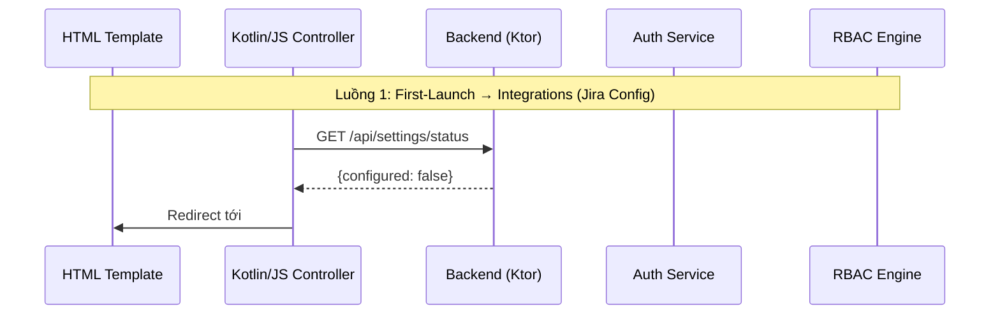

# Auth Flow & RBAC — Design

Relevant design details are in the architecture.md of the main spec. Key components: AuthServiceImpl (2 default users), JWT middleware, RBAC Engine (3 roles), ApplicationCallPipeline.Call phase.

---

## Architecture — Auth & RBAC Components

### Auth_Service

JWT-based session management — JWT chỉ chứa user identity, không chứa Jira credentials. Jira credentials lưu trong DB dùng chung cho toàn hệ thống.

### RBAC_Engine

Phân quyền 3 vai trò (Administrator, Neural_Architect, Reader).

### Auth Flow Diagram (from architecture.md)



### Backend Server Module — Route Groups (Auth & RBAC)

| Route Group | Endpoints | Auth | RBAC |
|---|---|---|---|
| `/api/auth` | `POST /login`, `POST /logout` | None / JWT | None |
| `/api/users` | `GET /`, `PUT /{userId}/role`, `PUT /{userId}/permissions` | JWT | Administrator |

---

## Auth Service Interface (from backend-interfaces.md)

```kotlin
// shared/.../auth/AuthService.kt
interface AuthService {
    suspend fun authenticate(domain: String, apiToken: String): AuthResult
    fun generateJwt(user: AuthenticatedUser): String
    fun validateJwt(token: String): AuthenticatedUser?
    fun invalidateSession(userId: String)
}

data class AuthenticatedUser(
    val userId: String,
    val email: String,
    val role: UserRole,
    val projectKey: String,
    val jiraDomain: String
)

// ServerConfig bổ sung ENCRYPTION_KEY cho mã hóa provider API keys
data class ServerConfig(
    val jiraHost: String,          // env: JIRA_HOST
    val aiProviderUrl: String,     // env: AI_PROVIDER_URL
    val dbPath: String,            // env: DB_PATH
    val jwtSecret: String,         // env: JWT_SECRET
    val encryptionKey: String,     // env: ENCRYPTION_KEY (AES-256-GCM)
    val port: Int                  // env: PORT
)

sealed class AuthResult {
    data class Success(val user: AuthenticatedUser, val jwt: String, val projects: List<JiraProject>) : AuthResult()
    data class Failure(val code: Int, val message: String) : AuthResult()
}
```

---

## RBAC Engine Interface (from backend-interfaces.md)

```kotlin
// shared/.../rbac/RBACEngine.kt
enum class UserRole { ADMINISTRATOR, NEURAL_ARCHITECT, READER }

enum class Permission {
    VIEW_DASHBOARD, VIEW_GRAPH, VIEW_ANALYSIS,
    ANALYZE_AI, VIEW_KB, RE_ANALYZE,
    CONFIG_INTEGRATIONS, TEST_PROVIDER,
    MANAGE_USERS, TOGGLE_PERMISSIONS, SIGN_OUT
}

interface RBACEngine {
    fun hasPermission(role: UserRole, permission: Permission): Boolean
    fun getPermissions(role: UserRole): Set<Permission>
    suspend fun changeRole(adminId: String, targetUserId: String, newRole: UserRole): RBACResult
    suspend fun togglePermission(adminId: String, targetUserId: String, permission: Permission, enabled: Boolean): RBACResult
}

// Ma trận phân quyền cứng (hardcoded permission matrix)
object PermissionMatrix {
    private val matrix = mapOf(
        UserRole.ADMINISTRATOR to Permission.entries.toSet(),
        UserRole.NEURAL_ARCHITECT to setOf(
            Permission.VIEW_DASHBOARD, Permission.VIEW_GRAPH, Permission.VIEW_ANALYSIS,
            Permission.ANALYZE_AI, Permission.VIEW_KB, Permission.RE_ANALYZE,
            Permission.TEST_PROVIDER, Permission.SIGN_OUT
        ),
        UserRole.READER to setOf(
            Permission.VIEW_DASHBOARD, Permission.VIEW_GRAPH, Permission.VIEW_ANALYSIS,
            Permission.VIEW_KB, Permission.SIGN_OUT
        )
    )
    fun check(role: UserRole, permission: Permission): Boolean = matrix[role]?.contains(permission) ?: false
}
```

---

## JWT Middleware Configuration (from architecture.md)

```kotlin
// server/src/main/kotlin/com/assistant/server/Application.kt
fun Application.module() {
    install(ContentNegotiation) { json() }
    install(Authentication) { jwt("auth-jwt") { /* HMAC256 config */ } }
    install(StatusPages) { /* error handlers */ }
    
    configureRouting()  // mount all route groups
}
```

RBAC Middleware sử dụng `ApplicationCallPipeline.Call` phase — Ktor route interceptor kiểm tra quyền trước khi xử lý request.
