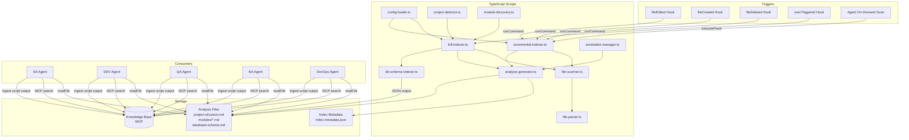

# Design Document: Code Intelligence System

## Overview

The Code Intelligence System provides a persistent, structured understanding of **any** codebase and its database schema to all agents (BA, SA, QA, DEV, DevOps) in the multi-agent pipeline. It is **project-agnostic** — it auto-detects the project's language, framework, build system, and module structure rather than assuming any specific technology stack. It solves the problem of agents operating without codebase awareness by:

1. **Auto-detecting** the project type (Kotlin/Java/TypeScript/Python/Go/etc.), build system (Gradle/Maven/npm/pip/etc.), and module structure by scanning build files and directory layout.
2. **Indexing** all source files across all detected modules using a full scan + incremental update strategy based on SHA-256 content hashing.
3. **Storing** results in two complementary formats: the Knowledge Base (MCP-based, searchable by agents) and Analysis Files (Markdown, version-controlled, human-readable).
4. **Keeping data current** through Kiro hooks (fileEdited, fileCreated, fileDeleted) that trigger incremental re-indexing automatically.
5. **Enriching** index entries with semantic annotations (business context, design decisions, requirement traceability) written by SA and DEV agents.
6. **Indexing database schema** from any database accessible via the database MCP tools (PostgreSQL, MySQL, Oracle, etc.).
7. **Providing consistent access** through two paths: direct file reads and Knowledge Base smart search.

### Key Design Decisions

| Decision | Rationale |
|----------|-----------|
| TypeScript scripts for core logic | Steering-only approach can't meet performance requirements (Req 1.5: 5000 files in 120s), can't produce deterministic/reproducible results, and can't support executable property-based tests. Scripts handle scanning, hashing, parsing, and generation; agents handle MCP integration (KB ingestion, DB schema querying). |
| SHA-256 content hashing for change detection | Timestamps alone are unreliable across branch switches and rebases. Content hashing guarantees accurate change detection. |
| Dual storage (KB + Analysis Files) | KB enables semantic search across agents; Analysis Files provide version-controlled, reviewable, offline-accessible documentation. |
| Hook-based incremental updates | Keeps the index current without manual intervention. File extension filtering prevents unnecessary indexing of build artifacts. |
| JSON configuration file | Allows developers to customize indexing behavior (extensions, exclusions) without modifying agent code. |
| **Project-agnostic auto-detection** | The indexer detects project type by scanning for build files (`build.gradle.kts`, `pom.xml`, `package.json`, `Cargo.toml`, `go.mod`, `pyproject.toml`, `*.sln`, etc.) rather than hardcoding any specific tech stack. |
| Slim steering + scripts split | Steering file (`.kiro/steering/code-intelligence.md`) tells agents WHEN to run scripts and HOW to read output. TypeScript scripts contain all deterministic logic. Agents handle MCP-only operations (KB ingestion, DB schema querying). |

### Technology Context (Auto-Detected at Runtime)

The Code Intelligence System does **not** assume any specific technology. Instead, it auto-detects the project context at indexing time by scanning for:

| Build File | Detected Stack | Module Discovery |
|-----------|---------------|-----------------|
| `build.gradle.kts` / `build.gradle` | Kotlin/Java + Gradle | Subprojects via `settings.gradle.kts` |
| `pom.xml` | Java/Kotlin + Maven | Child modules via `<modules>` |
| `package.json` | TypeScript/JavaScript + npm/yarn | Workspaces via `workspaces` field |
| `Cargo.toml` | Rust + Cargo | Workspace members via `[workspace]` |
| `go.mod` | Go + Go Modules | Single module per `go.mod` |
| `pyproject.toml` / `setup.py` | Python + pip/poetry | Single module or monorepo |
| `*.sln` / `*.csproj` | C#/.NET | Projects via solution file |
| None found | Generic (flat structure) | Root directory as single module |

**Language detection** is based on file extensions found during scanning. **Framework detection** is based on dependency declarations in build files (e.g., `spring-boot-starter` → Spring Boot, `react` → React, `express` → Express.js).

### Technology Stack

| Component | Technology | Purpose |
|-----------|-----------|---------|
| Runtime | Node.js (TypeScript via ts-node or compiled JS) | Execute indexing scripts |
| Testing | Vitest + fast-check | Property-based and unit testing |
| AST Parsing | TypeScript Compiler API for `.ts`/`.tsx`/`.js`/`.jsx`; regex-based extraction for other languages (Kotlin, Java, Python, Go, Rust, C#, YAML, XML, SQL, etc.) | Extract class/function signatures |
| Hashing | Node.js built-in `crypto` module | SHA-256 content hashing |

## Architecture

The system uses a **TypeScript scripts + slim steering** architecture. Core indexing logic (file scanning, SHA-256 hashing, AST parsing, JSON I/O, Markdown generation, incremental change detection) is implemented as TypeScript scripts under `.analysis/code-intelligence/scripts/`. A slim steering file tells agents when to run which script and how to read the output. Agents handle MCP-only operations (KB ingestion, DB schema querying) since MCP tools are only accessible from agent context.

### Implementation Structure

```
.analysis/code-intelligence/
├── scripts/                    ← TypeScript scripts (core implementation)
│   ├── package.json
│   ├── tsconfig.json
│   ├── src/
│   │   ├── config-loader.ts    ← loadConfig()
│   │   ├── project-detector.ts ← detectProjectType()
│   │   ├── module-discovery.ts ← discoverModules()
│   │   ├── file-parser.ts      ← parseFile() using AST tools
│   │   ├── file-scanner.ts     ← file discovery + filtering + SHA-256 hashing
│   │   ├── full-indexer.ts     ← runFullIndex() orchestration
│   │   ├── incremental-indexer.ts ← runIncrementalIndex()
│   │   ├── analysis-generator.ts  ← generates project-structure.md and module .md files
│   │   ├── db-schema-indexer.ts   ← outputs JSON for agent to ingest via MCP
│   │   ├── annotation-manager.ts  ← addAnnotation(), preserveAnnotations()
│   │   └── types.ts            ← shared TypeScript types/interfaces
│   └── tests/
│       └── properties/         ← Property-based tests using fast-check
│           ├── config.property.test.ts
│           ├── indexer.property.test.ts
│           ├── filter.property.test.ts
│           ├── analysis.property.test.ts
│           ├── annotation.property.test.ts
│           └── ...
├── index-config.json
├── index-metadata.json
├── project-structure.md
├── database-schema.md
└── modules/
    └── {module-name}.md
```

### Responsibility Split

| Layer | Responsibility | Examples |
|-------|---------------|----------|
| **TypeScript scripts** | All heavy/deterministic logic | File scanning, SHA-256 hashing, AST parsing, JSON I/O, Markdown generation, incremental change detection, config loading, project detection, module discovery |
| **Steering file** (`.kiro/steering/code-intelligence.md`) | Slim instructions for agents | WHEN to run which script, HOW to read script output, KB ingestion instructions, DB schema querying via MCP |
| **Hooks** | Trigger scripts via `runCommand` | Execute scripts directly when files change |
| **Agent role** | MCP integration + orchestration | Run scripts via `executePwsh`, read script output, ingest into KB via MCP tools, query DB schema via MCP tools |

### Architecture Diagram



### Data Flow

1. **Trigger** → A hook event fires `runCommand` to execute a TypeScript script, or an agent runs a script via `executePwsh`.
2. **Configuration** → The script reads `index-config.json` via `config-loader.ts` for file extensions, excluded directories, and excluded patterns.
3. **Change Detection** → `file-scanner.ts` computes SHA-256 hashes of source files using Node.js `crypto` module and compares against `index-metadata.json`.
4. **Parsing** → `file-parser.ts` parses changed files using TypeScript Compiler API (for TS/JS) or regex-based extraction (for other languages) to extract class signatures, function signatures, imports, and package structure.
5. **Storage** → `analysis-generator.ts` writes results to Index Metadata (JSON) and Analysis Files (Markdown). Scripts output structured JSON for KB ingestion.
6. **KB Ingestion** → Agents read script output and ingest into Knowledge Base via MCP tools (since MCP is only accessible from agent context).
7. **Consumption** → Agents read Analysis Files directly or query the Knowledge Base for semantic search.

## Components and Interfaces

### 1. Configuration Loader (`config-loader.ts`)

**Responsibility**: Read and validate `.analysis/code-intelligence/index-config.json`, falling back to defaults if missing or invalid.

**Interface**:
```typescript
function loadConfig(): IndexConfig
```

**Behavior**:
- Reads `.analysis/code-intelligence/index-config.json` from the file system
- If file doesn't exist → returns default config
- If JSON is invalid → logs error, returns default config
- Returns an `IndexConfig` object with `includedExtensions`, `excludedDirectories`, `excludedFilePatterns`

**Default Configuration**:
```json
{
  "includedExtensions": [
    ".kt", ".java", ".ts", ".tsx", ".js", ".jsx",
    ".py", ".go", ".rs", ".cs",
    ".gradle.kts", ".gradle",
    ".yml", ".yaml", ".properties", ".xml", ".json",
    ".sql",
    ".toml", ".cfg", ".ini"
  ],
  "excludedDirectories": ["build", "dist", "out", "target", ".gradle", ".git", ".analysis", "node_modules", ".idea", ".kiro", ".vscode", "__pycache__", ".mypy_cache", "vendor", "bin", "obj"],
  "excludedFilePatterns": ["*.generated.*", "*.min.*", "*.map", "*.lock", "*.sum"]
}
```

### 2. Full Indexer (`full-indexer.ts`)

**Responsibility**: Scan all source files across all modules, rebuild the entire Code Index from scratch, generate all Analysis Files, and output structured data for KB ingestion.

**Interface**:
```typescript
function runFullIndex(config: IndexConfig): IndexResult
```

**Behavior**:
1. Delete existing `index-metadata.json`
2. **Auto-detect project type** via `project-detector.ts` by scanning root directory for build files (`build.gradle.kts`, `pom.xml`, `package.json`, `Cargo.toml`, `go.mod`, `pyproject.toml`, `*.sln`)
3. **Discover modules** via `module-discovery.ts` based on detected build system:
   - Gradle: Parse `settings.gradle.kts` for `include()` statements
   - Maven: Parse root `pom.xml` for `<modules>` section
   - npm: Parse `package.json` for `workspaces` field
   - Other: Scan for subdirectories containing their own build files
   - Flat project (no modules): Treat root as single module
4. For each module, use `file-scanner.ts` to recursively scan `src/` (or language-appropriate source directory) for files matching `config.includedExtensions`
5. Skip files in `config.excludedDirectories` and matching `config.excludedFilePatterns`
6. For each source file:
   a. Compute SHA-256 content hash via Node.js `crypto` module
   b. Parse file via `file-parser.ts` to extract signatures (class, function, import, package)
   c. Handle parse errors gracefully (record `parse_error` status)
7. Write `index-metadata.json` atomically (write to `.tmp`, then rename)
8. Generate `project-structure.md` and per-module `modules/{module-name}.md` via `analysis-generator.ts`
9. Output structured JSON for KB ingestion (agents ingest via MCP tools)
10. If database schema indexing is requested, run `db-schema-indexer.ts` to output JSON for agent to ingest via MCP
11. Return summary (files indexed, modules found, classes found, functions found, parse errors, elapsed time)

### 3. Incremental Indexer (`incremental-indexer.ts`)

**Responsibility**: Re-index only files that have changed since the last indexing run.

**Interface**:
```typescript
function runIncrementalIndex(config: IndexConfig, changedFiles?: string[]): IndexResult
```

**Behavior**:
- If `changedFiles` is provided (hook-triggered): process only those files
- If `changedFiles` is undefined (agent on-demand): scan all files via `file-scanner.ts`, compare hashes against `index-metadata.json`, process only changed files
- For each changed file:
  - If file exists and hash differs → re-parse via `file-parser.ts` and update index entry
  - If file is new → parse and add index entry
  - If file is deleted → remove index entry, mark annotations as `[DELETED]` via `annotation-manager.ts`
- Regenerate only the affected module's Analysis File via `analysis-generator.ts`
- Update the affected row in `project-structure.md`
- Output structured JSON for KB update (agents update via MCP tools, not creating duplicates)

### 4. File Parser (`file-parser.ts`)

**Responsibility**: Extract structured information from a single source file.

**Interface**:
```typescript
function parseFile(filePath: string, language: string): ParseResult | ParseError
```

**Output (ParseResult)**:
```typescript
{
  filePath: string
  language: string          // Auto-detected from extension: "kotlin" | "java" | "typescript" | "javascript" | "python" | "go" | "rust" | "csharp" | "gradle" | "yaml" | "xml" | "sql" | "json" | "properties"
  moduleName: string        // Auto-detected from project structure
  packageName: string       // Language-specific: Java/Kotlin package, Python module, Go package, etc.
  classes: Array<{
    name: string
    visibility: string      // Language-specific: "public" | "internal" | "private" | "protected" | "exported" | "unexported"
    superclass: string?
    interfaces: string[]
    annotations: string[]   // Java/Kotlin annotations, Python decorators, etc.
  }>
  functions: Array<{
    name: string
    visibility: string
    parameters: Array<{ name: string, type: string }>
    returnType: string
    annotations: string[]
  }>
  imports: string[]
  indexingStatus: "success" | "parse_error"
  errorMessage: string?
}
```

**Parsing Strategy**: The parser uses the TypeScript Compiler API for AST-based extraction on TypeScript/JavaScript files (`.ts`, `.tsx`, `.js`, `.jsx`). For other languages (Kotlin, Java, Python, Go, Rust, C#), it uses regex-based extraction of class signatures, function signatures, imports, and package declarations. For configuration files (YAML, XML, JSON, properties), it uses regex-based extraction of key structures. For SQL files, it extracts table/view definitions and stored procedure signatures. **Unsupported languages** fall back to basic line-counting and import/require statement extraction.

### 5. File Scanner (`file-scanner.ts`)

**Responsibility**: Discover files matching configured extensions, filter by exclusion rules, and compute SHA-256 content hashes.

**Interface**:
```typescript
function scanFiles(config: IndexConfig, sourceDirectories: string[]): ScannedFile[]
function computeHash(filePath: string): string  // Returns "sha256:..." prefixed hash
function filterFile(filePath: string, config: IndexConfig): boolean  // true if file should be indexed
```

**Behavior**:
- Recursively walks source directories using Node.js `fs` module
- Filters files by `includedExtensions`, `excludedDirectories`, and `excludedFilePatterns`
- Computes SHA-256 content hash for each file using Node.js `crypto` module
- Returns array of `ScannedFile` objects with path, hash, and detected language

### 6. Database Schema Indexer (`db-schema-indexer.ts`)

**Responsibility**: Output structured JSON representing database schema for agents to ingest via MCP tools.

**Interface**:
```typescript
function generateDatabaseSchemaJson(schemaData: DatabaseSchema): void
```

**Behavior**:
1. Accepts schema data (provided by agent after querying via MCP tools: `mcp_database_mcp_list_schemas`, `mcp_database_mcp_list_objects`, `mcp_database_mcp_get_object_details`)
2. Generates `.analysis/code-intelligence/database-schema.md` from the schema data
3. Outputs structured JSON for KB ingestion with tags `"code-index"`, `"database"`, schema name
4. If schema data is empty or stale → notes staleness in the analysis file

**Agent role**: The agent queries the database via MCP tools (since MCP is only accessible from agent context), passes the results to this script, and then ingests the script's JSON output into the KB.

### 7. Semantic Enrichment Interface (`annotation-manager.ts`)

**Responsibility**: Allow SA and DEV agents to attach annotations to indexed code entries, and preserve annotations during re-indexing.

**Interface**:
```typescript
function addAnnotation(moduleName: string, target: string, authorAgent: string, annotationType: string, content: string): void
function preserveAnnotations(existingAnalysisFile: string, currentTargets: string[]): AnnotationRow[]
```

**Annotation Types**: `requirement-link`, `design-decision`, `implementation-note`, `known-issue`, `todo`

**Storage**: Annotations are appended to the `## Annotations` section of the target module's Analysis File as a Markdown table row. Agents ingest annotations into the Knowledge Base with tags `"semantic-annotation"`, module name, annotation type.

**Preservation**: When the Incremental Indexer regenerates a Module Analysis File, `preserveAnnotations()` reads existing annotations and returns them for inclusion in the output. If a referenced class/function no longer exists in `currentTargets`, the Target column is updated to `[DELETED] OriginalName`.

### 8. Analysis Generator (`analysis-generator.ts`)

**Responsibility**: Generate `project-structure.md` and per-module `modules/{module-name}.md` files from index data.

**Interface**:
```typescript
function generateProjectStructure(modules: ModuleData[], projectInfo: ProjectInfo): void
function generateModuleAnalysis(module: ModuleData, annotations: AnnotationRow[]): void
```

**Behavior**:
- Generates Markdown files from structured index data
- Includes "Last Updated" UTC timestamp
- Preserves existing annotations when regenerating module files
- Writes files atomically (temp file + rename)

### 9. Hook Definitions

Three file-event hooks and one manual trigger hook. Hooks use `runCommand` to execute TypeScript scripts directly:

| Hook ID | Event | File Patterns | Action |
|---------|-------|---------------|--------|
| `code-index-edit` | fileEdited | `**/*.kt, **/*.java, **/*.ts, **/*.tsx, **/*.js, **/*.jsx, **/*.py, **/*.go, **/*.rs, **/*.cs, **/*.gradle.kts, **/*.yml, **/*.properties, **/*.xml, **/*.sql, **/*.json, **/*.toml` | runCommand: Execute incremental-indexer.ts for the changed file |
| `code-index-create` | fileCreated | (same patterns) | runCommand: Execute incremental-indexer.ts to add the new file |
| `code-index-delete` | fileDeleted | (same patterns) | runCommand: Execute incremental-indexer.ts to remove the file |
| `code-index-full` | userTriggered | N/A | askAgent: Run full-indexer.ts, then ingest output into KB via MCP |

**Filtering**: Hooks use file pattern matching to trigger only for source files. The scripts additionally check against `excludedDirectories` and `excludedFilePatterns` from config before processing.

**Note**: The `code-index-full` hook uses `askAgent` instead of `runCommand` because the full index requires KB ingestion via MCP tools, which is only accessible from agent context. The agent runs the script via `executePwsh`, reads the output, and ingests into KB.

## Data Models

### Index Metadata (`.analysis/code-intelligence/index-metadata.json`)

```json
{
  "version": "1.0",
  "lastFullIndexTimestamp": "2025-01-15T10:30:00Z",
  "projectName": "auto-detected-from-workspace",
  "projectType": "gradle-kotlin",
  "totalFiles": 1234,
  "files": {
    "module-a/src/main/kotlin/com/example/service/UserService.kt": {
      "contentHash": "sha256:a1b2c3d4e5f6...",
      "lastIndexedTimestamp": "2025-01-15T10:30:00Z",
      "language": "kotlin",
      "moduleName": "module-a",
      "indexingStatus": "success"
    },
    "module-b/src/index.ts": {
      "contentHash": "sha256:f6e5d4c3b2a1...",
      "lastIndexedTimestamp": "2025-01-15T10:30:00Z",
      "language": "typescript",
      "moduleName": "module-b",
      "indexingStatus": "success"
    }
  }
}
```

### Index Configuration (`.analysis/code-intelligence/index-config.json`)

```json
{
  "includedExtensions": [".kt", ".java", ".ts", ".tsx", ".gradle.kts", ".yml", ".properties", ".xml", ".sql"],
  "excludedDirectories": ["build", ".gradle", ".git", "node_modules", ".idea", ".kiro"],
  "excludedFilePatterns": ["*.generated.*", "*.min.*"]
}
```

### Project Structure File (`.analysis/code-intelligence/project-structure.md`)

```markdown
# Project Structure — {auto-detected-project-name}

**Last Updated:** 2025-01-15T10:30:00Z
**Project Type:** {auto-detected: gradle-kotlin | maven-java | npm-typescript | cargo-rust | go-module | python | dotnet | generic}

## Modules

| Module | Purpose | Language | Framework | Key Dependencies | Source Files |
|--------|---------|----------|-----------|-----------------|-------------|
| {module-a} | {auto-detected from README or inferred from package names} | {auto-detected} | {auto-detected from dependencies} | {top 3-5 dependencies} | {count} |
| {module-b} | {auto-detected} | {auto-detected} | {auto-detected} | {dependencies} | {count} |

## Inter-Module Dependencies

| Module | Depends On |
|--------|-----------|
| {module-a} | {detected from imports/build file dependencies} |
| {module-b} | {detected} |
```

### Module Analysis File (`.analysis/code-intelligence/modules/{module-name}.md`)

```markdown
# Module Analysis — {module-name}

**Last Updated:** 2025-01-15T10:30:00Z
**Language:** {auto-detected} | **Framework:** {auto-detected from dependencies}

## Package Structure

```
{auto-detected-root-package}/
├── {package-1}/     # {inferred purpose from class names}
├── {package-2}/     # {inferred purpose}
└── {package-N}/     # {inferred purpose}
```

## Key Classes

| Class | Package | Responsibility | Visibility |
|-------|---------|---------------|------------|
| {ClassName} | {package} | {inferred from class name, annotations, interfaces} | {public/internal/private} |

## Public API Surface

### {ControllerOrHandlerClass}
- `{METHOD} {path}` → `{functionName}({params}): {ReturnType}`

## Dependencies

| Imports From | Classes Used |
|-------------|-------------|
| {other-module} | {imported classes} |

## Detected Patterns

- **DI Style**: {auto-detected: constructor injection / field injection / none}
- **Error Handling**: {auto-detected: exception handler / try-catch / Result type}
- **Naming**: {auto-detected patterns: *Controller, *Service, *Repository, etc.}
- **Logging**: {auto-detected: SLF4J / Log4j / console.log / println}
- **Testing**: {auto-detected: JUnit / Jest / pytest / go test}

## Annotations

| Target | Author Agent | Type | Content | Timestamp |
|--------|-------------|------|---------|-----------|
| {ClassName} | {SA_Agent/DEV_Agent} | {requirement-link/design-decision/etc.} | {content} | {timestamp} |
```

### Database Schema File (`.analysis/code-intelligence/database-schema.md`)

```markdown
# Database Schema — {auto-detected-project-name}

**Last Updated:** 2025-01-15T10:30:00Z

## Data Sources

| Name | Type | Host | Database | Access |
|------|------|------|----------|--------|
| {auto-detected from config} | {PostgreSQL/MySQL/Oracle/SQLite/etc.} | {from config} | {from config} | {Read-Write/Read-Only} |

## {DataSource Name} ({Database Type})

### Schemas

| Schema | Tables | Description |
|--------|--------|-------------|
| {schema} | {count} | {auto-detected or inferred} |

### Tables — {schema} schema

| Table | Columns | Rows (approx) | Description |
|-------|---------|---------------|-------------|
| {table} | {count} | {approx count from DB stats} | {inferred from column names} |

### Table Details

#### {table_name}
| Column | Type | Nullable | Default | Description |
|--------|------|----------|---------|-------------|
| {column} | {type} | {YES/NO} | {default} | {inferred from name} |
```

### Knowledge Base Document Structure

Each module ingestion creates a KB document with:
- **Title**: `Code Index — {module-name}`
- **Content**: Module summary including package structure, key classes, public API surface, dependencies
- **Tags**: `code-index, {module-name}, {auto-detected-language}`
- **Project**: `{auto-detected-project-name}`

Each annotation ingestion creates a KB document with:
- **Title**: `Annotation — {target} — {annotation-type}`
- **Content**: The annotation content with module and target context
- **Tags**: `semantic-annotation, {module-name}, {annotation-type}`
- **Project**: `{auto-detected-project-name}`

Each database schema ingestion creates a KB document with:
- **Title**: `Database Schema — {schema-name}`
- **Content**: Schema summary with tables, columns, relationships
- **Tags**: `code-index, database, {schema-name}`
- **Project**: `{auto-detected-project-name}`


## Correctness Properties

*A property is a characteristic or behavior that should hold true across all valid executions of a system — essentially, a formal statement about what the system should do. Properties serve as the bridge between human-readable specifications and machine-verifiable correctness guarantees.*

### Property 1: Full Index Completeness

*For any* set of source files across any number of modules, when the Full Indexer completes, every source file matching the configured extensions and not in excluded directories SHALL have both a complete index entry (with file path, language, module name, package name, class signatures, function signatures, imports, and timestamp) AND a corresponding entry in `index-metadata.json` (with relative file path, valid SHA-256 content hash, and last-indexed UTC timestamp).

**Validates: Requirements 1.1, 1.2**

### Property 2: Incremental Change Detection Accuracy

*For any* set of previously indexed files, when some files are modified (content changed) and the Incremental Indexer runs, it SHALL re-index exactly the files whose current SHA-256 content hash differs from the hash stored in Index Metadata — no more, no less. Files with unchanged content SHALL retain their existing index entries unmodified.

**Validates: Requirements 1.3**

### Property 3: Incremental Deletion Cleanup

*For any* set of previously indexed files, when one or more files are deleted and the Incremental Indexer runs, the deleted files SHALL be absent from both the Code Index and the Index Metadata. All non-deleted files SHALL retain their existing index entries.

**Validates: Requirements 1.4**

### Property 4: Parse Error Isolation

*For any* set of source files where a subset contains syntax errors, the Full Indexer SHALL record `indexing_status: "parse_error"` with a human-readable error message for each unparseable file, AND SHALL successfully index all remaining parseable files with `indexing_status: "success"`. The count of successfully indexed files plus parse-error files SHALL equal the total number of source files processed.

**Validates: Requirements 1.7**

### Property 5: Knowledge Base Tagging Correctness

*For any* Knowledge Base ingestion — whether for a module index, a semantic annotation, or a database schema — the document SHALL be tagged with the correct required tags: modules get `["code-index", {module-name}, {language}]`, annotations get `["semantic-annotation", {module-name}, {annotation-type}]`, and database schemas get `["code-index", "database", {schema-name}]`. The `project` field SHALL always be set to the workspace name.

**Validates: Requirements 2.2, 4.6, 9.3**

### Property 6: Knowledge Base Deduplication on Update

*For any* file that is indexed, then modified, then re-indexed by the Incremental Indexer, the Knowledge Base SHALL contain exactly one document for that file's module — the updated version. No duplicate entries SHALL be created by repeated indexing of the same module.

**Validates: Requirements 2.4**

### Property 7: Project Structure Completeness

*For any* set of modules in the project, the generated `project-structure.md` SHALL contain exactly one row per module in the modules table, and each row SHALL include the module's purpose, primary language, framework, key dependencies, and source file count. No module SHALL be missing and no extra rows SHALL exist.

**Validates: Requirements 3.1**

### Property 8: Module Analysis Completeness

*For any* module, the generated Module Analysis File SHALL contain all required sections: package structure tree, list of key classes with responsibilities, public API surface with function signatures, dependency graph showing imports from other modules, and detected patterns. No required section SHALL be empty or missing.

**Validates: Requirements 3.2**

### Property 9: Incremental Scope Isolation

*For any* file change in module X, when the Incremental Indexer runs, it SHALL regenerate only module X's Module Analysis File and update only module X's row in `project-structure.md`. All other modules' Analysis Files SHALL remain byte-identical to their state before the incremental run.

**Validates: Requirements 3.3**

### Property 10: Annotation Format Correctness

*For any* semantic annotation with any combination of target name, author agent, annotation type, content, and timestamp, the annotation SHALL be stored as a valid Markdown table row in the `## Annotations` section with exactly five columns: Target, Author Agent, Annotation Type, Content, and Timestamp. The row SHALL be parseable back into its constituent fields.

**Validates: Requirements 4.3**

### Property 11: Annotation Preservation on Regeneration

*For any* set of existing semantic annotations in a Module Analysis File, when the Incremental Indexer regenerates that file due to a code change, all pre-existing annotations SHALL be preserved exactly as they were — same target, same author, same type, same content, same timestamp. No annotation SHALL be lost or modified during regeneration.

**Validates: Requirements 4.4**

### Property 12: Deleted Target Annotation Marking

*For any* semantic annotation whose referenced class or function is deleted from the codebase, when the Incremental Indexer runs, the annotation's Target column SHALL be updated to `[DELETED] {original-target-name}`. The annotation itself SHALL NOT be removed — only the target marker changes.

**Validates: Requirements 4.5**

### Property 13: File Path Filtering

*For any* file path, the indexer SHALL process the file if and only if: (a) the file's extension is in the `includedExtensions` list, AND (b) the file's path does not traverse any directory in the `excludedDirectories` list, AND (c) the file's name does not match any pattern in `excludedFilePatterns`. Files failing any of these conditions SHALL be ignored.

**Validates: Requirements 5.4, 5.7, 10.1**

### Property 14: Index Summary Completeness

*For any* indexing run (full or incremental), the reported summary SHALL include all required fields: total files indexed, total modules found, total classes found, total functions found, number of parse errors, and elapsed time. No field SHALL be missing or null.

**Validates: Requirements 7.3**

### Property 15: Database Analysis Completeness

*For any* database schema returned by the database MCP, the generated `database-schema.md` SHALL contain: a row in the schemas table for each schema, a row in the tables table for each table (with column count and approximate row count), and a detailed column definition section for each table (with column name, type, nullable, and default).

**Validates: Requirements 9.2**

### Property 16: Configuration Round-Trip

*For any* valid `IndexConfig` object (with arrays of extensions, directories, and patterns), serializing it to JSON and writing to `index-config.json`, then reading and parsing the file, SHALL produce an `IndexConfig` object identical to the original.

**Validates: Requirements 10.1**

### Property 17: Invalid Configuration Fallback

*For any* string that is not valid JSON, when the Configuration Loader attempts to parse it as `index-config.json`, it SHALL return the default configuration values (default extensions, default excluded directories, default excluded patterns) without throwing an error. The returned config SHALL be identical to the config returned when the file does not exist.

**Validates: Requirements 10.4**

## Error Handling

### Error Categories and Responses

| Error | Source | Response | Recovery |
|-------|--------|----------|----------|
| **File parse error** | File Parser encounters syntax errors | Record `parse_error` status with error message, continue indexing remaining files | Next index run will retry the file |
| **Knowledge Base unavailable** | MCP connection failure during ingestion | Log warning, complete indexing to Analysis Files only, set retry flag | Next indexing run retries KB ingestion |
| **Database MCP unavailable** | MCP connection failure during schema indexing | Log warning, skip database indexing, note staleness in `database-schema.md` | Next full index retries database indexing |
| **Invalid config JSON** | Malformed `index-config.json` | Log error with parse failure details, fall back to default configuration | Developer fixes the JSON; next run re-reads |
| **File read permission error** | OS-level permission denied on source file | Record file with `indexing_status: "read_error"`, continue with remaining files | Developer fixes permissions; next run retries |
| **Index metadata corruption** | Malformed `index-metadata.json` | Log error, delete corrupted metadata, trigger full re-index | Full re-index rebuilds clean metadata |
| **Hook execution error** | Script fails during hook-triggered run | Log error to console, do NOT interrupt developer's editing session | Next hook trigger or manual scan retries |
| **Interrupted full re-index** | Script or agent session ends during full index | Write metadata atomically (write to temp file, then rename) so partial state is never persisted | Next run detects incomplete metadata and restarts |
| **Duplicate KB document** | Race condition between concurrent index runs | Use module name as unique key for KB documents; update existing rather than create new | Deduplication logic prevents accumulation |

### Atomic Write Strategy

To prevent metadata corruption from interrupted writes:
1. Write `index-metadata.json` to a temporary file (`index-metadata.json.tmp`)
2. Only after the write completes successfully, rename the temp file to the final path
3. If the process is interrupted, the temp file is ignored on next run, and the previous valid metadata (or absence of metadata) triggers a clean full re-index

### Error Logging Format

All errors are logged with structured context:
```
[Code-Index] ERROR: {error-type} — {file-path} — {error-message}
[Code-Index] WARN: {warning-type} — {context} — {message}
[Code-Index] INFO: {action} — {details}
```

## Testing Strategy

### Testing Approach

The Code Intelligence System uses **Vitest** as the test runner and **fast-check** for property-based testing. All tests are TypeScript files located under `.analysis/code-intelligence/scripts/tests/`.

1. **Property-based tests** (via fast-check) verify universal correctness properties across randomly generated inputs (minimum 100 iterations per property)
2. **Example-based unit tests** (via Vitest) verify specific scenarios, edge cases, and integration points
3. **Integration tests** (via Vitest) verify end-to-end behavior with real file system and MCP tools

### Testing Technology Stack

| Component | Technology | Purpose |
|-----------|-----------|---------|
| Test Runner | [Vitest](https://vitest.dev/) | Fast TypeScript-native test runner with built-in assertion library |
| Property Testing | [fast-check](https://github.com/dubzzz/fast-check) | Property-based testing with shrinking and random input generation |
| Test Location | `.analysis/code-intelligence/scripts/tests/properties/` | Property-based test files |

### Property-Based Testing

**Library**: [fast-check](https://github.com/dubzzz/fast-check) (TypeScript), executed via Vitest.

**Configuration**: Each property test runs a minimum of 100 iterations with random inputs.

**Tag Format**: Each test is tagged with `Feature: code-intelligence, Property {N}: {property-text}`

| Property | Test Description | Generator Strategy |
|----------|-----------------|-------------------|
| P1: Full Index Completeness | Generate random file trees (1–100 files, various extensions, multiple modules), run full index, verify every matching file has complete index entry + metadata | Random file paths, random content, random module structures |
| P2: Incremental Change Detection | Generate indexed file set, randomly modify subset, verify only modified files re-indexed | Random content mutations on random file subsets |
| P3: Incremental Deletion Cleanup | Generate indexed file set, randomly delete subset, verify deleted files absent from index + metadata | Random deletion of file subsets |
| P4: Parse Error Isolation | Generate file sets with random mix of valid/invalid syntax, verify error isolation | Random injection of syntax errors into file content |
| P5: KB Tagging Correctness | Generate random module names, languages, annotation types, schema names, verify tag arrays | Random strings for names, enum values for types |
| P6: KB Deduplication | Generate random module, index twice with different content, verify single KB entry | Random content changes between index runs |
| P7: Project Structure Completeness | Generate random module sets (1–15 modules), verify project-structure.md row count and content | Random module names, languages, dependency counts |
| P8: Module Analysis Completeness | Generate random module with varying classes/functions/packages, verify all sections present | Random class hierarchies, function signatures |
| P9: Incremental Scope Isolation | Generate multi-module project, change files in one random module, verify other modules unchanged | Random module selection for changes |
| P10: Annotation Format | Generate random annotations (all types, various content lengths, special characters), verify Markdown table format | Random strings, enum annotation types, timestamps |
| P11: Annotation Preservation | Generate random annotations, regenerate analysis file, verify annotations preserved | Random annotation sets, random code changes |
| P12: Deleted Target Marking | Generate annotations, delete random referenced targets, verify [DELETED] marking | Random target deletion patterns |
| P13: File Path Filtering | Generate random file paths with various extensions and directory structures, verify filter correctness | Random paths, extensions, directory nesting |
| P14: Summary Completeness | Generate random indexing results, verify summary has all required fields | Random counts for files, modules, classes, functions, errors |
| P15: Database Analysis Completeness | Generate random schema structures (schemas, tables, columns), verify analysis file completeness | Random schema/table/column definitions |
| P16: Configuration Round-Trip | Generate random valid configs, serialize to JSON, deserialize, verify equality | Random extension arrays, directory arrays, pattern arrays |
| P17: Invalid Config Fallback | Generate random non-JSON strings, verify default config returned | Random byte sequences, partial JSON, malformed strings |

### Example-Based Unit Tests

| Test | Scenario | Validates |
|------|----------|-----------|
| Default config when file missing | Config file doesn't exist → returns defaults | Req 10.2 |
| Updated config applied | Modify config, run indexer → new config used | Req 10.3 |
| New module detection | Add directory with build.gradle.kts → new analysis file created | Req 3.5 |
| Removed module cleanup | Remove module directory → analysis file deleted, row removed | Req 3.6 |
| Last Updated timestamp | Generate project-structure.md → contains valid UTC timestamp | Req 3.4 |
| Progress indicator | Run full index → progress messages emitted | Req 7.2 |
| KB unavailability retry | Simulate KB down → indexing completes to files, retry on next run | Req 2.5 |
| DB MCP unavailability | Simulate DB MCP down → warning logged, staleness noted | Req 9.4 |
| Hook error isolation | Simulate script error during hook → no developer interruption | Req 5.6 |
| Interrupted re-index recovery | Simulate interruption → metadata consistent on next run | Req 7.4 |

### Integration Tests

| Test | Scenario | Validates |
|------|----------|-----------|
| Full index end-to-end | Run full index on actual project subset → verify all outputs | Req 1.1–1.7, 3.1–3.2 |
| KB ingestion and search | Ingest module data → search with smart query → verify results | Req 2.1, 2.3, 8.5 |
| Database schema indexing | Query actual database → verify schema file and KB ingestion | Req 9.1–9.3, 9.5 |
| SA agent consumption | SA agent reads code intelligence → retrieves tech stack, patterns | Req 8.1 |
| DEV agent consumption | DEV agent reads code intelligence → retrieves conventions, patterns | Req 8.2 |
| QA agent consumption | QA agent reads code intelligence → retrieves testable components | Req 8.3 |
| Hook-triggered incremental | Edit file → hook fires → script completes incremental index | Req 5.1–5.5 |
| On-demand scan | Agent triggers script → both files and KB updated | Req 6.1–6.4 |
| Performance: full index | Full index on 5,000 files → completes within 120 seconds | Req 1.5 |
| Performance: incremental | Single file change → completes within 5 seconds | Req 1.6 |
| Performance: on-demand | 500 changed files → completes within 30 seconds | Req 6.4 |
