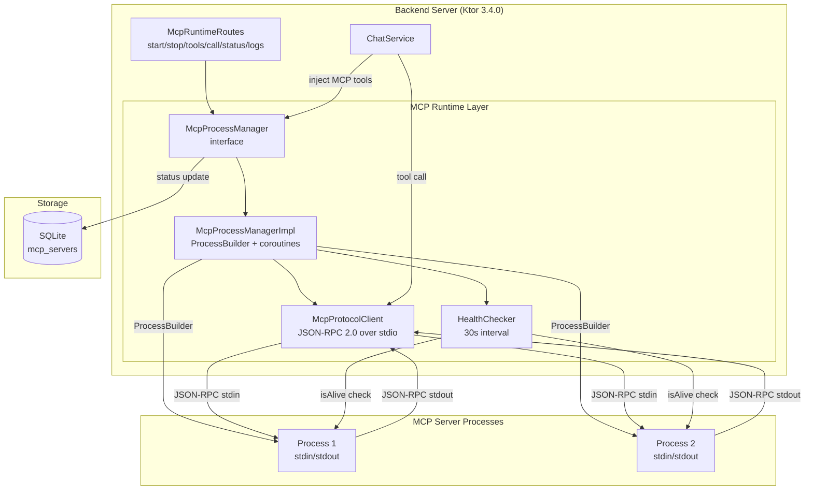
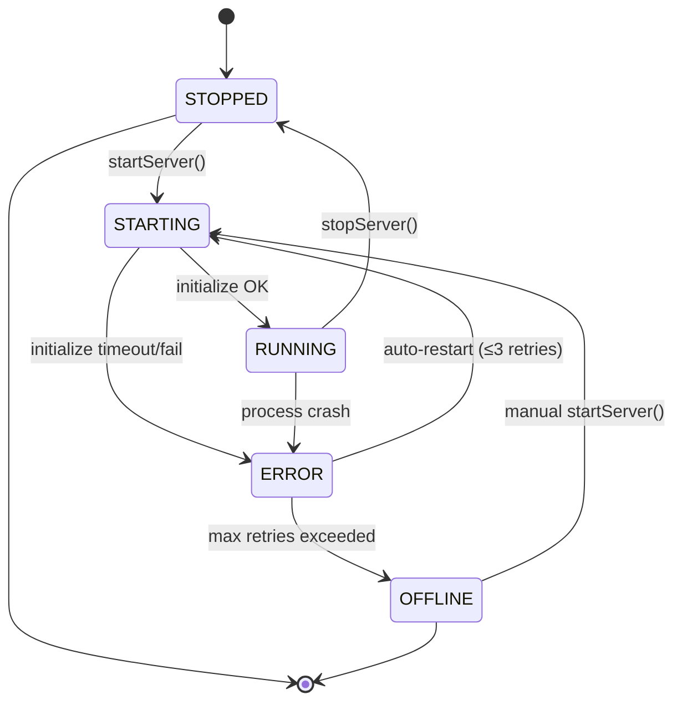
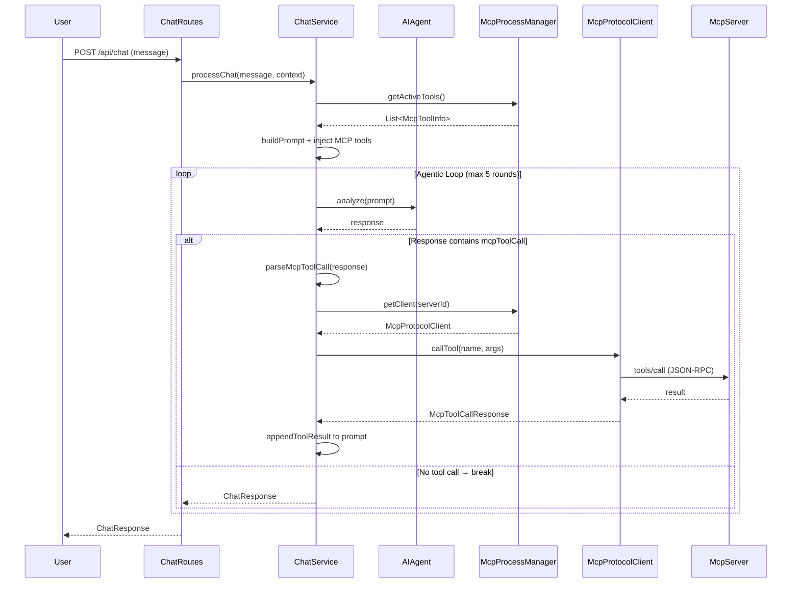

# MCP Servers — Design

# Thiết kế MCP Server Integration — Integrations Page

## Tổng quan

MCP (Model Context Protocol) servers mở rộng khả năng của AI Chat bằng cách cung cấp tools bổ sung (database queries, documentation search, API calls, etc.). Trang Integrations cho phép đăng ký, cấu hình, quản lý MCP servers, và tích hợp MCP tools vào AI Chat thông qua agentic loop.

Thiết kế này bao gồm 2 phần:
1. **MCP Server Registration** (AC 6.20–6.30) — CRUD, Form/JSON config, import/export *(đã triển khai)*
2. **MCP Runtime Integration** (AC 6.31–6.61) — Process management, JSON-RPC 2.0 protocol, tool discovery/execution, AI Chat integration, health monitoring

---

## Phần 1: MCP Server Registration *(đã triển khai)*

### SQLDelight Schema

```sql
CREATE TABLE mcp_servers (
    id TEXT NOT NULL PRIMARY KEY,
    name TEXT NOT NULL,
    type TEXT NOT NULL DEFAULT 'stdio',       -- 'stdio' hoặc 'sse'
    command TEXT NOT NULL DEFAULT '',          -- cho stdio transport
    url TEXT NOT NULL DEFAULT '',              -- cho SSE transport
    args TEXT NOT NULL DEFAULT '[]',
    env TEXT NOT NULL DEFAULT '{}',
    auto_approve TEXT NOT NULL DEFAULT '[]',
    disabled INTEGER NOT NULL DEFAULT 0,
    status TEXT NOT NULL DEFAULT 'OFFLINE',
    created_at TEXT NOT NULL,
    updated_at TEXT NOT NULL
);
```

> **Lưu ý:** Cột `type` và `url` đã tồn tại trong schema thực tế (KnowledgeBase.sq) và `McpServerConfig.kt`. Field `type` hỗ trợ 2 transport: `stdio` (default, dùng ProcessBuilder) và `sse` (Server-Sent Events, dùng HTTP). Field `url` chứa endpoint URL cho SSE transport.

### API Endpoints (CRUD)

| Endpoint | Method | Auth | RBAC | Mô tả |
|---|---|---|---|---|
| `/api/integrations/mcp` | GET | JWT | Reader+ | Danh sách MCP servers |
| `/api/integrations/mcp` | POST | JWT | Administrator | Đăng ký server mới |
| `/api/integrations/mcp/{id}` | PUT | JWT | Administrator | Cập nhật config |
| `/api/integrations/mcp/{id}` | DELETE | JWT | Administrator | Xóa server (+ stop process) |
| `/api/integrations/mcp/{id}/test` | POST | JWT | Administrator | Test connection (full handshake) |
| `/api/integrations/mcp/export` | GET | JWT | Administrator | Export JSON config |
| `/api/integrations/mcp/import` | POST | JWT | Administrator | Import JSON config |

### JSON Config Format (mcp.json compatible)

```json
{
  "mcpServers": {
    "server-name": {
      "command": "uvx",
      "args": ["package@latest"],
      "env": { "KEY": "value" },
      "disabled": false,
      "autoApprove": ["tool1", "tool2"]
    }
  }
}
```

### UI Layout

```
┌─────────────────────────────────────────────┐
│ MCP SERVERS                    [➕ Add] [📥] │
├─────────────────────────────────────────────┤
│ ┌─────────────┐ ┌─────────────┐             │
│ │ AWS Docs  🟢│ │ Postgres  🔴│             │
│ │ uvx         │ │ npx         │             │
│ │ [TEST][CFG] │ │ [TEST][CFG] │             │
│ └─────────────┘ └─────────────┘             │
│                                             │
│ ── Config Modal ──                          │
│ [Form / JSON] toggle                        │
│ Form: Name, Command, Args, Env, AutoApprove │
│ JSON: textarea with raw JSON                │
│ [SAVE] [TEST] [CANCEL]                      │
└─────────────────────────────────────────────┘
```

---

## Phần 2: MCP Runtime Integration (AC 6.31–6.61)

### Kiến trúc tổng quan



### Process State Machine



**Trạng thái:**
- `STOPPED` — Process chưa chạy hoặc đã dừng gracefully
- `STARTING` — Process đang khởi động, chờ initialize handshake
- `RUNNING` — Process hoạt động, initialize thành công, tools đã discover
- `ERROR` — Process crash hoặc initialize thất bại, đang chờ auto-restart
- `OFFLINE` — Đã vượt quá max retries (3 lần), cần manual restart


---

## Thành phần & Giao diện (Components and Interfaces)

### 1. McpProcessManager — Quản lý lifecycle processes

```kotlin
// shared/src/commonMain/kotlin/com/assistant/mcp/McpProcessManager.kt
interface McpProcessManager {
    /** Khởi động MCP server process. Requirements: 6.31, 6.32 */
    suspend fun startServer(configId: String): McpProcessStatus
    
    /** Dừng process gracefully (SIGTERM → timeout → SIGKILL). Req: 6.36 */
    suspend fun stopServer(configId: String): McpProcessStatus
    
    /** Restart = stop + start. Req: 6.32 */
    suspend fun restartServer(configId: String): McpProcessStatus
    
    /** Danh sách servers đang chạy. Req: 6.32 */
    fun getRunningServers(): Map<String, McpProcessStatus>
    
    /** Trạng thái chi tiết 1 server. Req: 6.57 */
    fun getStatus(configId: String): McpProcessStatus?
    
    /** Khởi động tất cả servers enabled. Req: 6.33 */
    suspend fun startAllEnabled()
    
    /** Dừng tất cả servers (shutdown hook). */
    suspend fun stopAll()
}
```

**Implementation: `McpProcessManagerImpl`**
- Sử dụng `ConcurrentHashMap<String, ManagedProcess>` lưu trữ processes đang chạy
- Mỗi `ManagedProcess` chứa: `Process` (Java), `McpProtocolClient`, `Job` (reader coroutine), restart count, start time
- `CoroutineScope(Dispatchers.IO + SupervisorJob())` cho process management
- Health check coroutine chạy mỗi 30 giây (Req: 6.56)

```kotlin
// server/src/jvmMain/kotlin/com/assistant/server/mcp/McpProcessManagerImpl.kt
class McpProcessManagerImpl(
    private val mcpRepo: McpServerRepository,
    private val scope: CoroutineScope
) : McpProcessManager {
    
    private val processes = ConcurrentHashMap<String, ManagedProcess>()
    private val maxRetries = 3
    private val backoffMs = longArrayOf(2000, 4000, 8000)
    
    // ... implementation
}

/** Trạng thái runtime của 1 managed process */
internal data class ManagedProcess(
    val process: Process,
    val client: McpProtocolClient,
    val readerJob: Job,
    val healthJob: Job,
    val startedAt: Long,
    val restartCount: Int = 0
)
```

**Graceful shutdown flow (Req: 6.36):**
1. Gửi SIGTERM (`process.destroy()`)
2. Chờ tối đa 5 giây (`process.waitFor(5, TimeUnit.SECONDS)`)
3. Nếu vẫn chạy → force kill (`process.destroyForcibly()`)
4. Cleanup: cancel reader coroutine, remove from map

**Auto-restart flow (Req: 6.35):**
1. Detect crash qua health check hoặc reader coroutine exit
2. Nếu `restartCount < 3` → delay `backoffMs[restartCount]` → restart
3. Nếu `restartCount >= 3` → status = OFFLINE, ghi log

### 2. McpProtocolClient — JSON-RPC 2.0 over stdio

```kotlin
// shared/src/commonMain/kotlin/com/assistant/mcp/McpProtocolClient.kt
interface McpProtocolClient {
    /** Initialize handshake. Req: 6.39 */
    suspend fun initialize(): McpInitializeResult
    
    /** Gửi JSON-RPC request, chờ response. Req: 6.38, 6.41 */
    suspend fun sendRequest(method: String, params: JsonElement? = null): JsonElement
    
    /** Gửi notification (không chờ response). Req: 6.39 */
    suspend fun sendNotification(method: String, params: JsonElement? = null)
    
    /** Discover tools. Req: 6.44 */
    suspend fun listTools(): List<McpToolInfo>
    
    /** Execute tool call. Req: 6.48 */
    suspend fun callTool(name: String, arguments: JsonObject): McpToolCallResponse
    
    /** Đóng client, cleanup resources. */
    fun close()
}
```

**Implementation: `McpProtocolClientImpl`**

```kotlin
// server/src/jvmMain/kotlin/com/assistant/server/mcp/McpProtocolClientImpl.kt
class McpProtocolClientImpl(
    private val stdin: OutputStream,   // process.outputStream
    private val stdout: BufferedReader, // process.inputStream.bufferedReader()
    private val scope: CoroutineScope
) : McpProtocolClient {
    
    private val requestId = AtomicInteger(0)
    private val pending = ConcurrentHashMap<Int, CompletableDeferred<JsonElement>>()
    private val json = Json { ignoreUnknownKeys = true }
    private var toolsCache: List<McpToolInfo>? = null
    
    /** Reader coroutine — đọc stdout line by line, dispatch responses. Req: 6.43 */
    val readerJob: Job = scope.launch(Dispatchers.IO) {
        stdout.lineSequence().forEach { line ->
            dispatchResponse(line)
        }
    }
    
    // ... implementation
}
```

**JSON-RPC message flow:**

```
Client (stdin) →  {"jsonrpc":"2.0","id":1,"method":"initialize","params":{...}}
Server (stdout) ← {"jsonrpc":"2.0","id":1,"result":{"protocolVersion":"2024-11-05",...}}
Client (stdin) →  {"jsonrpc":"2.0","method":"notifications/initialized"}
Client (stdin) →  {"jsonrpc":"2.0","id":2,"method":"tools/list"}
Server (stdout) ← {"jsonrpc":"2.0","id":2,"result":{"tools":[...]}}
Client (stdin) →  {"jsonrpc":"2.0","id":3,"method":"tools/call","params":{"name":"...","arguments":{...}}}
Server (stdout) ← {"jsonrpc":"2.0","id":3,"result":{"content":[{"type":"text","text":"..."}]}}
```

**Request/Response matching (Req: 6.41, 6.43):**
1. `sendRequest()` tạo `CompletableDeferred`, lưu vào `pending[requestId]`
2. Ghi JSON line vào stdin, flush
3. Reader coroutine đọc stdout, parse JSON, lấy `id` field
4. Lookup `pending[id]`, gọi `complete(result)` hoặc `completeExceptionally(error)`
5. Caller `await()` trên deferred với timeout

**Initialize handshake (Req: 6.39, 6.40):**

```json
// → Request
{
  "jsonrpc": "2.0", "id": 1,
  "method": "initialize",
  "params": {
    "protocolVersion": "2024-11-05",
    "clientInfo": { "name": "jira-assistant", "version": "1.0.0" },
    "capabilities": {}
  }
}

// ← Response
{
  "jsonrpc": "2.0", "id": 1,
  "result": {
    "protocolVersion": "2024-11-05",
    "serverInfo": { "name": "aws-docs-mcp", "version": "0.1.0" },
    "capabilities": { "tools": {} }
  }
}

// → Notification (không có id)
{ "jsonrpc": "2.0", "method": "notifications/initialized" }
```

- Timeout initialize: 10 giây (Req: 6.40)
- Timeout tools/call: 60 giây (Req: 6.49)


### 3. McpRuntimeRoutes — API Endpoints mới

| Endpoint | Method | Auth | RBAC | Mô tả | Req |
|---|---|---|---|---|---|
| `/api/integrations/mcp/{id}/start` | POST | JWT | Administrator | Khởi động process thủ công | 6.37 |
| `/api/integrations/mcp/{id}/stop` | POST | JWT | Administrator | Dừng process | 6.37 |
| `/api/integrations/mcp/{id}/tools` | GET | JWT | Reader+ | Tools từ 1 server | 6.45 |
| `/api/integrations/mcp/tools` | GET | JWT | Reader+ | Aggregated tools tất cả servers | 6.46 |
| `/api/integrations/mcp/tools/call` | POST | JWT | Administrator | Execute tool call | 6.48 |
| `/api/integrations/mcp/{id}/status` | GET | JWT | Reader+ | Runtime status chi tiết | 6.57 |
| `/api/integrations/mcp/{id}/logs` | GET | JWT | Administrator | 100 dòng log gần nhất | 6.61 |

**Cập nhật endpoint test (Req: 6.34):**
`POST /api/integrations/mcp/{id}/test` — Thay vì chỉ mark ACTIVE, giờ thực sự:
1. Spawn process với ProcessBuilder
2. Thực hiện initialize handshake
3. Gọi `tools/list`
4. Trả về danh sách tools nếu thành công
5. Stop process sau khi test
6. Trả về error chi tiết nếu thất bại (exit code, stderr)

```kotlin
// server/src/jvmMain/kotlin/com/assistant/server/routes/McpRuntimeRoutes.kt
fun Routing.mcpRuntimeRoutes() {
    val processManager by inject<McpProcessManager>()
    val mcpRepo by inject<McpServerRepository>()
    
    route("/api/integrations/mcp") {
        authenticate("auth-jwt") {
            // Runtime control
            post("/{id}/start") { handleStart(processManager) }
            post("/{id}/stop") { handleStop(processManager) }
            
            // Tool discovery
            get("/{id}/tools") { handleGetTools(processManager) }
            get("/tools") { handleGetAllTools(processManager) }
            
            // Tool execution
            post("/tools/call") { handleToolCall(processManager) }
            
            // Status & logs
            get("/{id}/status") { handleGetStatus(processManager) }
            get("/{id}/logs") { handleGetLogs(processManager) }
        }
    }
}
```

**Response examples:**

```json
// GET /api/integrations/mcp/{id}/status → 200
{
  "configId": "abc123",
  "pid": 12345,
  "state": "RUNNING",
  "uptime": 3600,
  "toolCount": 5,
  "lastError": null,
  "restartCount": 0
}

// GET /api/integrations/mcp/{id}/tools → 200
[
  {
    "name": "search_documentation",
    "description": "Search AWS documentation",
    "inputSchema": {
      "type": "object",
      "properties": {
        "query": { "type": "string", "description": "Search query" }
      },
      "required": ["query"]
    }
  }
]

// GET /api/integrations/mcp/tools → 200 (aggregated)
[
  {
    "serverId": "abc123",
    "serverName": "AWS Docs",
    "name": "search_documentation",
    "description": "Search AWS documentation",
    "inputSchema": { ... }
  }
]

// POST /api/integrations/mcp/tools/call
// Request:
{ "serverId": "abc123", "toolName": "search_documentation", "arguments": { "query": "S3 bucket" } }
// Response (auto-approved):
{ "content": [{ "type": "text", "text": "Found 5 results..." }], "isError": false }
// Response (needs approval):
{ "requiresApproval": true, "toolName": "search_documentation", "arguments": { "query": "S3 bucket" } }
```

### 4. Tích hợp ChatService — Agentic Loop (Req: 6.52–6.55)



**System prompt injection (Req: 6.52):**

```
Available MCP Tools:
[MCP:AWS Docs] search_documentation: Search AWS documentation
[MCP:AWS Docs] get_document: Get specific document by URL
[MCP:Postgres] query: Execute SQL query on database

To use a tool, respond with JSON: {"mcpToolCall": {"serverId": "abc123", "toolName": "search_documentation", "arguments": {"query": "..."}}}
```

**AutoApprove check (Req: 6.50):**
- Trước khi execute tool call, kiểm tra `toolName in config.autoApprove`
- Nếu không trong autoApprove → trả về `{requiresApproval: true}` cho frontend
- Frontend hiển thị confirmation dialog (Req: 6.51)
- User approve → gửi lại request với `{approved: true}`

**Graceful degradation (Req: 6.55):**
- Nếu tool call thất bại → append error message vào prompt
- AI sinh response thay thế dựa trên error context
- KHÔNG crash chat flow


---

## Mô hình Dữ liệu (Data Models)

### Runtime Models

```kotlin
// shared/src/commonMain/kotlin/com/assistant/mcp/models/McpProcessStatus.kt
@Serializable
data class McpProcessStatus(
    val configId: String,
    val pid: Long? = null,
    val state: McpServerState,
    val uptime: Long = 0,          // seconds
    val toolCount: Int = 0,
    val lastError: String? = null,
    val restartCount: Int = 0
)

@Serializable
enum class McpServerState {
    STOPPED, STARTING, RUNNING, ERROR, OFFLINE
}
```

```kotlin
// shared/src/commonMain/kotlin/com/assistant/mcp/models/McpToolInfo.kt
@Serializable
data class McpToolInfo(
    val name: String,
    val description: String,
    val inputSchema: JsonElement    // JSON Schema object
)

/** Aggregated tool với server info (cho GET /mcp/tools endpoint) */
@Serializable
data class McpAggregatedTool(
    val serverId: String,
    val serverName: String,
    val name: String,
    val description: String,
    val inputSchema: JsonElement
)
```

```kotlin
// shared/src/commonMain/kotlin/com/assistant/mcp/models/McpToolCall.kt
@Serializable
data class McpToolCallRequest(
    val serverId: String,
    val toolName: String,
    val arguments: JsonObject = JsonObject(emptyMap()),
    val approved: Boolean = false   // cho approval flow
)

@Serializable
data class McpToolCallResponse(
    val content: List<McpContent> = emptyList(),
    val isError: Boolean = false,
    val requiresApproval: Boolean = false,
    val toolName: String? = null,
    val arguments: JsonObject? = null
)

@Serializable
data class McpContent(
    val type: String,               // "text", "image", "resource"
    val text: String? = null,
    val data: String? = null,       // base64 for image
    val mimeType: String? = null
)
```

### JSON-RPC Models

```kotlin
// shared/src/commonMain/kotlin/com/assistant/mcp/models/JsonRpc.kt
@Serializable
data class JsonRpcRequest(
    val jsonrpc: String = "2.0",
    val id: Int? = null,            // null cho notifications
    val method: String,
    val params: JsonElement? = null
)

@Serializable
data class JsonRpcResponse(
    val jsonrpc: String = "2.0",
    val id: Int? = null,
    val result: JsonElement? = null,
    val error: JsonRpcError? = null
)

@Serializable
data class JsonRpcError(
    val code: Int,
    val message: String,
    val data: JsonElement? = null
)

@Serializable
data class McpInitializeResult(
    val protocolVersion: String,
    val serverInfo: McpServerInfo,
    val capabilities: JsonElement? = null
)

@Serializable
data class McpServerInfo(
    val name: String,
    val version: String? = null
)
```

### McpError Exception

```kotlin
// shared/src/commonMain/kotlin/com/assistant/mcp/models/McpError.kt
/** JSON-RPC error codes theo spec. Req: 6.42 */
class McpError(
    val code: Int,
    val errorMessage: String,
    val data: JsonElement? = null
) : Exception("MCP Error $code: $errorMessage") {
    companion object {
        const val PARSE_ERROR = -32700
        const val INVALID_REQUEST = -32600
        const val METHOD_NOT_FOUND = -32601
        const val INVALID_PARAMS = -32602
        const val INTERNAL_ERROR = -32603
    }
}
```

---

## Koin Registration

```kotlin
// Trong serverModule() — server/src/jvmMain/kotlin/com/assistant/server/di/ServerModule.kt

// MCP Process Manager — singleton, auto-start hook
single<McpProcessManager> {
    McpProcessManagerImpl(
        mcpRepo = get(),
        scope = CoroutineScope(Dispatchers.IO + SupervisorJob())
    )
}
```

**Auto-start hook (Req: 6.33):**

```kotlin
// server/src/jvmMain/kotlin/com/assistant/server/Application.kt
fun Application.module() {
    // ... existing setup ...
    
    // Auto-start MCP servers on application startup
    val processManager by inject<McpProcessManager>()
    launch {
        processManager.startAllEnabled()  // parallel coroutines, 30s timeout each
    }
    
    // Graceful shutdown
    environment.monitor.subscribe(ApplicationStopped) {
        runBlocking { processManager.stopAll() }
    }
}
```


---

## Correctness Properties

*Một property là đặc tính hoặc hành vi phải đúng trong mọi lần thực thi hợp lệ của hệ thống — về cơ bản là một phát biểu hình thức về những gì hệ thống phải làm. Properties là cầu nối giữa đặc tả con người đọc được và đảm bảo tính đúng đắn có thể kiểm chứng bằng máy.*

### Property 1: Process lifecycle state machine validity

*For any* chuỗi operations (start, stop, restart) trên McpProcessManager, trạng thái server SAU mỗi operation phải tuân theo state machine hợp lệ: STOPPED→STARTING→RUNNING→STOPPED, STARTING→ERROR, RUNNING→ERROR, ERROR→STARTING (retry), ERROR→OFFLINE (max retries). Không có transition nào ngoài state machine được phép xảy ra.

**Validates: Requirements 6.31, 6.32**

### Property 2: JSON-RPC request/response ID matching

*For any* chuỗi N concurrent JSON-RPC requests gửi qua McpProtocolClient, mỗi request có ID duy nhất (tăng dần), và mỗi response nhận được phải được dispatch về đúng caller thông qua matching ID. Không có response nào bị mất hoặc gửi nhầm caller.

**Validates: Requirements 6.41, 6.43**

### Property 3: Auto-restart bounded retries

*For any* MCP server process crash liên tiếp, hệ thống retry tối đa 3 lần với exponential backoff (2s, 4s, 8s). Sau 3 lần thất bại, trạng thái chuyển thành OFFLINE và không retry thêm. Với crash count `n`: nếu `n < 3` → retry với delay `2^(n+1)` giây; nếu `n >= 3` → OFFLINE.

**Validates: Requirements 6.35**

### Property 4: Timeout enforcement

*For any* JSON-RPC request, nếu server không phản hồi trong thời gian quy định (10s cho initialize, 60s cho tools/call), request phải bị cancel và trả về error. Không có request nào được phép chờ vô hạn.

**Validates: Requirements 6.40, 6.49**

### Property 5: AutoApprove routing correctness

*For any* tool call request với toolName và danh sách autoApprove của server config: nếu `toolName ∈ autoApprove` → execute ngay lập tức và trả về kết quả; nếu `toolName ∉ autoApprove` → trả về `{requiresApproval: true}` mà KHÔNG execute tool.

**Validates: Requirements 6.50**

### Property 6: Agentic loop termination and graceful degradation

*For any* AI chat flow có chứa MCP tool calls, agentic loop phải terminate trong tối đa 5 vòng lặp. Nếu tool execution thất bại ở bất kỳ vòng nào, error message được append vào prompt cho AI sinh response thay thế — chat flow KHÔNG bị crash.

**Validates: Requirements 6.53, 6.55**

---

## Xử lý Lỗi (Error Handling)

### Process Management Errors

| Lỗi | Xử lý | Log level |
|-----|--------|-----------|
| Process không khởi động được (command not found, permission denied) | Status → ERROR, ghi stderr output, trigger auto-restart | WARN |
| Process crash (exit code ≠ 0) | Status → ERROR, auto-restart ≤3 lần với backoff | WARN |
| Initialize timeout (>10s) | Kill process, status → ERROR, ghi "Initialize timeout" | WARN |
| Max retries exceeded | Status → OFFLINE, ghi log tổng hợp | ERROR |

### Protocol Errors

| Lỗi | Xử lý | HTTP Status |
|-----|--------|-------------|
| JSON parse error từ stdout | Log WARN, skip line, tiếp tục đọc | — |
| JSON-RPC error response (-32700 đến -32603) | Trả về `McpError` cho caller | 502 Bad Gateway |
| Tool call timeout (>60s) | Cancel request, trả về timeout error | 504 Gateway Timeout |
| Server not running khi gọi tools | Trả về "Server not running" | 409 Conflict |
| Tool name không tồn tại | Trả về "Tool not found" | 404 Not Found |

### AI Chat Integration Errors

| Lỗi | Xử lý |
|-----|--------|
| MCP tool execution thất bại | Append error vào prompt, AI sinh response thay thế (graceful degradation) |
| Agentic loop vượt 5 rounds | Break loop, trả về response cuối cùng của AI |
| Tất cả MCP servers offline | Chat hoạt động bình thường không có MCP tools (fallback) |
| mcpToolCall parse error | Log WARN, bỏ qua tool call, trả về AI response gốc |

---

## Chiến lược Kiểm thử (Testing Strategy)

### Property-Based Tests (fast-check / kotest-property)

Mỗi property test chạy tối thiểu 100 iterations.

| # | Property | Tag |
|---|----------|-----|
| P1 | State machine validity | `Feature: mcp-runtime, Property 1: Process lifecycle state machine validity` |
| P2 | Request/response ID matching | `Feature: mcp-runtime, Property 2: JSON-RPC request/response ID matching` |
| P3 | Auto-restart bounded | `Feature: mcp-runtime, Property 3: Auto-restart bounded retries` |
| P4 | Timeout enforcement | `Feature: mcp-runtime, Property 4: Timeout enforcement` |
| P5 | AutoApprove routing | `Feature: mcp-runtime, Property 5: AutoApprove routing correctness` |
| P6 | Agentic loop termination | `Feature: mcp-runtime, Property 6: Agentic loop termination and graceful degradation` |

**Library:** Kotest Property-Based Testing (`io.kotest:kotest-property`) — tích hợp tốt với Kotlin coroutines và JUnit 5.

### Unit Tests (example-based)

| Test | Mô tả | Req |
|------|--------|-----|
| Graceful shutdown sequence | Verify SIGTERM → 5s wait → force kill | 6.36 |
| Initialize handshake 3-step | Mock stdin/stdout, verify request/response/notification | 6.39 |
| JSON-RPC error code parsing | Verify -32700 đến -32603 mapped correctly | 6.42 |
| Tool discovery caching | Verify tools cached after initialize | 6.44 |
| System prompt injection format | Verify `[MCP:{name}] tool: desc` format | 6.52 |

### Integration Tests (API E2E)

| Test | Mô tả | Req |
|------|--------|-----|
| POST /mcp/{id}/start → GET /mcp/{id}/status | Start server, verify RUNNING status | 6.37, 6.57 |
| POST /mcp/{id}/test full handshake | Spawn mock server, verify tools returned | 6.34 |
| POST /mcp/tools/call routing | Verify tool call routed to correct server | 6.48 |
| GET /mcp/tools aggregated | Verify tools from multiple servers merged | 6.46 |
| GET /mcp/{id}/logs | Verify returns ≤100 lines, requires Admin | 6.61 |
| RBAC: Reader cannot start/stop | Verify 403 for non-Admin on control endpoints | 6.37 |
