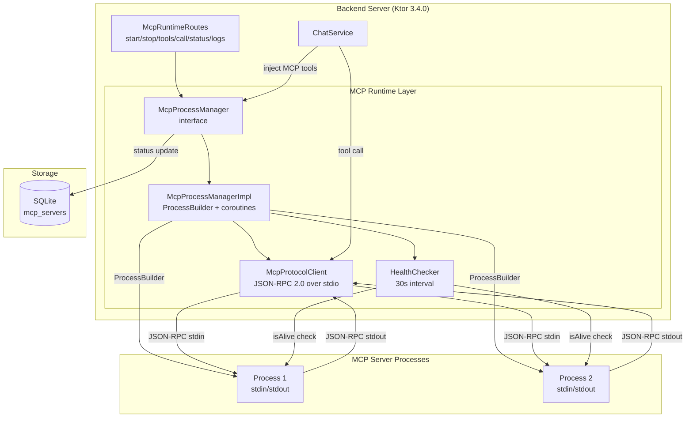
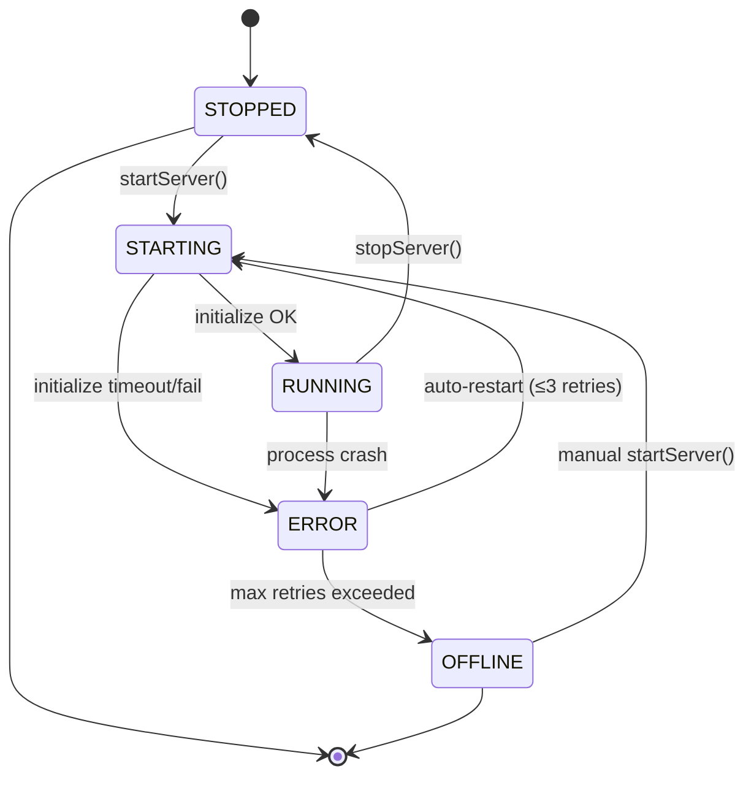
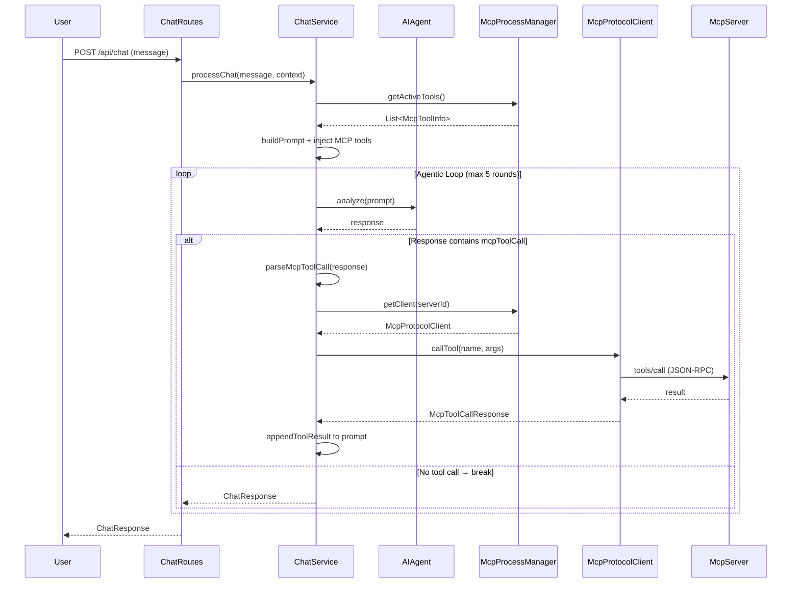
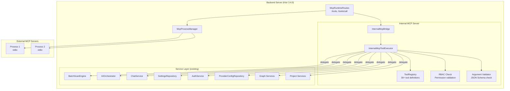
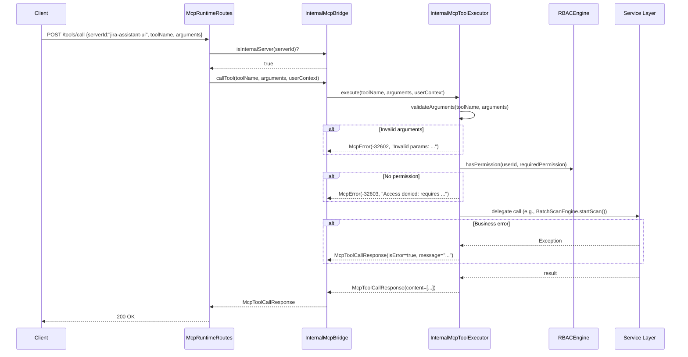

# MCP Servers — Design

# Thiết kế MCP Server Integration — Integrations Page

## Tổng quan

MCP (Model Context Protocol) servers mở rộng khả năng của AI Chat bằng cách cung cấp tools bổ sung (database queries, documentation search, API calls, etc.). Trang Integrations cho phép đăng ký, cấu hình, quản lý MCP servers, và tích hợp MCP tools vào AI Chat thông qua agentic loop.

Thiết kế này bao gồm 2 phần:
1. **MCP Server Registration** (AC 6.20–6.30) — CRUD, Form/JSON config, import/export *(đã triển khai)*
2. **MCP Runtime Integration** (AC 6.31–6.61) — Process management, JSON-RPC 2.0 protocol, tool discovery/execution, AI Chat integration, health monitoring

---

## Phần 1: MCP Server Registration *(đã triển khai)*

### SQLDelight Schema

```sql
CREATE TABLE mcp_servers (
    id TEXT NOT NULL PRIMARY KEY,
    name TEXT NOT NULL,
    type TEXT NOT NULL DEFAULT 'stdio',       -- 'stdio' hoặc 'sse'
    command TEXT NOT NULL DEFAULT '',          -- cho stdio transport
    url TEXT NOT NULL DEFAULT '',              -- cho SSE transport
    args TEXT NOT NULL DEFAULT '[]',
    env TEXT NOT NULL DEFAULT '{}',
    auto_approve TEXT NOT NULL DEFAULT '[]',
    disabled INTEGER NOT NULL DEFAULT 0,
    status TEXT NOT NULL DEFAULT 'OFFLINE',
    created_at TEXT NOT NULL,
    updated_at TEXT NOT NULL,
    internal INTEGER NOT NULL DEFAULT 0       -- 1 = Internal MCP Server (protected, Req 6.70)
);
```

> **Lưu ý:** Cột `type` và `url` đã tồn tại trong schema thực tế (KnowledgeBase.sq) và `McpServerConfig.kt`. Field `type` hỗ trợ 2 transport: `stdio` (default, dùng ProcessBuilder) và `sse` (Server-Sent Events, dùng HTTP). Field `url` chứa endpoint URL cho SSE transport.

### API Endpoints (CRUD)

| Endpoint | Method | Auth | RBAC | Mô tả |
|---|---|---|---|---|
| `/api/integrations/mcp` | GET | JWT | Reader+ | Danh sách MCP servers |
| `/api/integrations/mcp` | POST | JWT | Administrator | Đăng ký server mới |
| `/api/integrations/mcp/{id}` | PUT | JWT | Administrator | Cập nhật config |
| `/api/integrations/mcp/{id}` | DELETE | JWT | Administrator | Xóa server (+ stop process) |
| `/api/integrations/mcp/{id}/test` | POST | JWT | Administrator | Test connection (full handshake) |
| `/api/integrations/mcp/export` | GET | JWT | Administrator | Export JSON config |
| `/api/integrations/mcp/import` | POST | JWT | Administrator | Import JSON config |

### JSON Config Format (mcp.json compatible)

```json
{
  "mcpServers": {
    "server-name": {
      "command": "uvx",
      "args": ["package@latest"],
      "env": { "KEY": "value" },
      "disabled": false,
      "autoApprove": ["tool1", "tool2"]
    }
  }
}
```

### UI Layout

```
┌─────────────────────────────────────────────┐
│ MCP SERVERS                    [➕ Add] [📥] │
├─────────────────────────────────────────────┤
│ ┌─────────────┐ ┌─────────────┐             │
│ │ AWS Docs  🟢│ │ Postgres  🔴│             │
│ │ uvx         │ │ npx         │             │
│ │ [TEST][CFG] │ │ [TEST][CFG] │             │
│ └─────────────┘ └─────────────┘             │
│                                             │
│ ── Config Modal ──                          │
│ [Form / JSON] toggle                        │
│ Form: Name, Command, Args, Env, AutoApprove │
│ JSON: textarea with raw JSON                │
│ [SAVE] [TEST] [CANCEL]                      │
└─────────────────────────────────────────────┘
```

### Tools Section (expandable, Req: 6.47)

Mỗi MCP server card có expandable "Tools" section. Khi expand:

```
▼ Tools (30)
┌─────────────────────────────────────────────┐
│ [✅ Enable All] [❌ Disable All]  5/30 enabled│
├─────────────────────────────────────────────┤
│ [☑] 🔧 navigate_to_page  Navigate to...  [Schema] │
│ [☐] 🔧 start_scan        Start a batch... [Schema] │
│ [☑] 🔧 get_settings      Get all app...   [Schema] │
│ ...                                                  │
└─────────────────────────────────────────────┘
```

Component: `McpToolsSection.kt`
- Checkbox per tool: toggle per-user permission, save via `PUT /api/chat/tool-permissions`
- "Enable All": gọi `PUT /api/chat/tool-permissions/bulk` với `enable_all`
- "Disable All": gọi `PUT /api/chat/tool-permissions/bulk` với `disable_all`
- Counter: "{enabled} / {total} enabled"
- Tooltip: "Enabled — AI có thể sử dụng tool này" / "Disabled — AI không thể sử dụng tool này"

> ✅ **Đã cập nhật bởi spec `per-user-tool-permissions`**: Toggle đọc/ghi từ `user_tool_permissions` per-user thay vì `mcp_servers.auto_approve` global.

### Local & Internal Server Cards — START/STOP (Req: 6.72, 19.75)

Tất cả server cards (Local KB, Jira Assistant UI, external MCP) dùng chung pattern START/STOP button:

```
┌─────────────────────────────────────────────┐
│ 🟢 Local Knowledge Base          [STOP]    │
│ LOCAL                                       │
│ Knowledge Base cục bộ — ...                 │
│ ▶ Tools (3)                                 │
└─────────────────────────────────────────────┘

┌─────────────────────────────────────────────┐
│ 🟢 Jira Assistant UI    [LOCAL]  [STOP]    │
│ — · 30 tools                                │
│ ▶ Tools (30)                                │
└─────────────────────────────────────────────┘
```

Component: `LocalServerStartStop.kt` (`pages/integrations/`)
- Internal servers: toggle via `PUT /api/settings/feature` với key `internal_mcp_enabled`
- External servers: start/stop via `POST /api/integrations/mcp/{id}/start|stop`
- Button style: `mcp-startstop-btn` (STOP = đỏ, START = xanh), cùng style cho tất cả cards
- Status dot color: dùng `McpStatusPoller.stateColor()` thống nhất (RUNNING = `#00ff88`, STOPPED = `#666`)
- Admin-only: chỉ Administrator mới thấy nút START/STOP
- Internal server cards ẩn nút TEST/CONFIGURE/REMOVE

`LocalKBCard.kt` cũng dùng cùng pattern START/STOP (key: `local_kb_tool_enabled`).

---

## Phần 2: MCP Runtime Integration (AC 6.31–6.61)

### Kiến trúc tổng quan



### Process State Machine



**Trạng thái:**
- `STOPPED` — Process chưa chạy hoặc đã dừng gracefully
- `STARTING` — Process đang khởi động, chờ initialize handshake
- `RUNNING` — Process hoạt động, initialize thành công, tools đã discover
- `ERROR` — Process crash hoặc initialize thất bại, đang chờ auto-restart
- `OFFLINE` — Đã vượt quá max retries (3 lần), cần manual restart


---

## Thành phần & Giao diện (Components and Interfaces)

### 1. McpProcessManager — Quản lý lifecycle processes

```kotlin
// shared/src/commonMain/kotlin/com/assistant/mcp/McpProcessManager.kt
interface McpProcessManager {
    /** Khởi động MCP server process. Requirements: 6.31, 6.32 */
    suspend fun startServer(configId: String): McpProcessStatus
    
    /** Dừng process gracefully (SIGTERM → timeout → SIGKILL). Req: 6.36 */
    suspend fun stopServer(configId: String): McpProcessStatus
    
    /** Restart = stop + start. Req: 6.32 */
    suspend fun restartServer(configId: String): McpProcessStatus
    
    /** Danh sách servers đang chạy. Req: 6.32 */
    fun getRunningServers(): Map<String, McpProcessStatus>
    
    /** Trạng thái chi tiết 1 server. Req: 6.57 */
    fun getStatus(configId: String): McpProcessStatus?
    
    /** Khởi động tất cả servers enabled. Req: 6.33 */
    suspend fun startAllEnabled()
    
    /** Dừng tất cả servers (shutdown hook). */
    suspend fun stopAll()
}
```

**Implementation: `McpProcessManagerImpl`**
- Sử dụng `ConcurrentHashMap<String, ManagedProcess>` lưu trữ processes đang chạy
- Mỗi `ManagedProcess` chứa: `Process` (Java), `McpProtocolClient`, `Job` (reader coroutine), restart count, start time
- `CoroutineScope(Dispatchers.IO + SupervisorJob())` cho process management
- Health check coroutine chạy mỗi 30 giây (Req: 6.56)

```kotlin
// server/src/jvmMain/kotlin/com/assistant/server/mcp/McpProcessManagerImpl.kt
class McpProcessManagerImpl(
    private val mcpRepo: McpServerRepository,
    private val scope: CoroutineScope
) : McpProcessManager {
    
    private val processes = ConcurrentHashMap<String, ManagedProcess>()
    private val maxRetries = 3
    private val backoffMs = longArrayOf(2000, 4000, 8000)
    
    // ... implementation
}

/** Trạng thái runtime của 1 managed process */
internal data class ManagedProcess(
    val process: Process,
    val client: McpProtocolClient,
    val readerJob: Job,
    val healthJob: Job,
    val startedAt: Long,
    val restartCount: Int = 0
)
```

**Graceful shutdown flow (Req: 6.36):**
1. Gửi SIGTERM (`process.destroy()`)
2. Chờ tối đa 5 giây (`process.waitFor(5, TimeUnit.SECONDS)`)
3. Nếu vẫn chạy → force kill (`process.destroyForcibly()`)
4. Cleanup: cancel reader coroutine, remove from map

**Auto-restart flow (Req: 6.35):**
1. Detect crash qua health check hoặc reader coroutine exit
2. Nếu `restartCount < 3` → delay `backoffMs[restartCount]` → restart
3. Nếu `restartCount >= 3` → status = OFFLINE, ghi log

### 2. McpProtocolClient — JSON-RPC 2.0 over stdio

```kotlin
// shared/src/commonMain/kotlin/com/assistant/mcp/McpProtocolClient.kt
interface McpProtocolClient {
    /** Initialize handshake. Req: 6.39 */
    suspend fun initialize(): McpInitializeResult
    
    /** Gửi JSON-RPC request, chờ response. Req: 6.38, 6.41 */
    suspend fun sendRequest(method: String, params: JsonElement? = null): JsonElement
    
    /** Gửi notification (không chờ response). Req: 6.39 */
    suspend fun sendNotification(method: String, params: JsonElement? = null)
    
    /** Discover tools. Req: 6.44 */
    suspend fun listTools(): List<McpToolInfo>
    
    /** Execute tool call. Req: 6.48 */
    suspend fun callTool(name: String, arguments: JsonObject): McpToolCallResponse
    
    /** Đóng client, cleanup resources. */
    fun close()
}
```

**Implementation: `McpProtocolClientImpl`**

```kotlin
// server/src/jvmMain/kotlin/com/assistant/server/mcp/McpProtocolClientImpl.kt
class McpProtocolClientImpl(
    private val stdin: OutputStream,   // process.outputStream
    private val stdout: BufferedReader, // process.inputStream.bufferedReader()
    private val scope: CoroutineScope
) : McpProtocolClient {
    
    private val requestId = AtomicInteger(0)
    private val pending = ConcurrentHashMap<Int, CompletableDeferred<JsonElement>>()
    private val json = Json { ignoreUnknownKeys = true }
    private var toolsCache: List<McpToolInfo>? = null
    
    /** Reader coroutine — đọc stdout line by line, dispatch responses. Req: 6.43 */
    val readerJob: Job = scope.launch(Dispatchers.IO) {
        stdout.lineSequence().forEach { line ->
            dispatchResponse(line)
        }
    }
    
    // ... implementation
}
```

**JSON-RPC message flow:**

```
Client (stdin) →  {"jsonrpc":"2.0","id":1,"method":"initialize","params":{...}}
Server (stdout) ← {"jsonrpc":"2.0","id":1,"result":{"protocolVersion":"2024-11-05",...}}
Client (stdin) →  {"jsonrpc":"2.0","method":"notifications/initialized"}
Client (stdin) →  {"jsonrpc":"2.0","id":2,"method":"tools/list"}
Server (stdout) ← {"jsonrpc":"2.0","id":2,"result":{"tools":[...]}}
Client (stdin) →  {"jsonrpc":"2.0","id":3,"method":"tools/call","params":{"name":"...","arguments":{...}}}
Server (stdout) ← {"jsonrpc":"2.0","id":3,"result":{"content":[{"type":"text","text":"..."}]}}
```

**Request/Response matching (Req: 6.41, 6.43):**
1. `sendRequest()` tạo `CompletableDeferred`, lưu vào `pending[requestId]`
2. Ghi JSON line vào stdin, flush
3. Reader coroutine đọc stdout, parse JSON, lấy `id` field
4. Lookup `pending[id]`, gọi `complete(result)` hoặc `completeExceptionally(error)`
5. Caller `await()` trên deferred với timeout

**Initialize handshake (Req: 6.39, 6.40):**

```json
// → Request
{
  "jsonrpc": "2.0", "id": 1,
  "method": "initialize",
  "params": {
    "protocolVersion": "2024-11-05",
    "clientInfo": { "name": "jira-assistant", "version": "1.0.0" },
    "capabilities": {}
  }
}

// ← Response
{
  "jsonrpc": "2.0", "id": 1,
  "result": {
    "protocolVersion": "2024-11-05",
    "serverInfo": { "name": "aws-docs-mcp", "version": "0.1.0" },
    "capabilities": { "tools": {} }
  }
}

// → Notification (không có id)
{ "jsonrpc": "2.0", "method": "notifications/initialized" }
```

- Timeout initialize: 10 giây (Req: 6.40)
- Timeout tools/call: 60 giây (Req: 6.49)


### 3. McpRuntimeRoutes — API Endpoints mới

| Endpoint | Method | Auth | RBAC | Mô tả | Req |
|---|---|---|---|---|---|
| `/api/integrations/mcp/{id}/start` | POST | JWT | Administrator | Khởi động process thủ công | 6.37 |
| `/api/integrations/mcp/{id}/stop` | POST | JWT | Administrator | Dừng process | 6.37 |
| `/api/integrations/mcp/{id}/tools` | GET | JWT | Reader+ | Tools từ 1 server | 6.45 |
| `/api/integrations/mcp/tools` | GET | JWT | Reader+ | Aggregated tools tất cả servers | 6.46 |
| `/api/integrations/mcp/tools/call` | POST | JWT | Administrator | Execute tool call | 6.48 |
| `/api/integrations/mcp/{id}/status` | GET | JWT | Reader+ | Runtime status chi tiết | 6.57 |
| `/api/integrations/mcp/{id}/logs` | GET | JWT | Administrator | 100 dòng log gần nhất | 6.61 |

**Cập nhật endpoint test (Req: 6.34):**
`POST /api/integrations/mcp/{id}/test` — Thay vì chỉ mark ACTIVE, giờ thực sự:
1. Spawn process với ProcessBuilder
2. Thực hiện initialize handshake
3. Gọi `tools/list`
4. Trả về danh sách tools nếu thành công
5. Stop process sau khi test
6. Trả về error chi tiết nếu thất bại (exit code, stderr)

```kotlin
// server/src/jvmMain/kotlin/com/assistant/server/routes/McpRuntimeRoutes.kt
fun Routing.mcpRuntimeRoutes() {
    val processManager by inject<McpProcessManager>()
    val mcpRepo by inject<McpServerRepository>()
    
    route("/api/integrations/mcp") {
        authenticate("auth-jwt") {
            // Runtime control
            post("/{id}/start") { handleStart(processManager) }
            post("/{id}/stop") { handleStop(processManager) }
            
            // Tool discovery
            get("/{id}/tools") { handleGetTools(processManager) }
            get("/tools") { handleGetAllTools(processManager) }
            
            // Tool execution
            post("/tools/call") { handleToolCall(processManager) }
            
            // Status & logs
            get("/{id}/status") { handleGetStatus(processManager) }
            get("/{id}/logs") { handleGetLogs(processManager) }
        }
    }
}
```

**Response examples:**

```json
// GET /api/integrations/mcp/{id}/status → 200
{
  "configId": "abc123",
  "pid": 12345,
  "state": "RUNNING",
  "uptime": 3600,
  "toolCount": 5,
  "lastError": null,
  "restartCount": 0
}

// GET /api/integrations/mcp/{id}/tools → 200
[
  {
    "name": "search_documentation",
    "description": "Search AWS documentation",
    "inputSchema": {
      "type": "object",
      "properties": {
        "query": { "type": "string", "description": "Search query" }
      },
      "required": ["query"]
    }
  }
]

// GET /api/integrations/mcp/tools → 200 (aggregated)
[
  {
    "serverId": "abc123",
    "serverName": "AWS Docs",
    "name": "search_documentation",
    "description": "Search AWS documentation",
    "inputSchema": { ... }
  }
]

// POST /api/integrations/mcp/tools/call
// Request:
{ "serverId": "abc123", "toolName": "search_documentation", "arguments": { "query": "S3 bucket" } }
// Response (auto-approved):
{ "content": [{ "type": "text", "text": "Found 5 results..." }], "isError": false }
// Response (needs approval):
{ "requiresApproval": true, "toolName": "search_documentation", "arguments": { "query": "S3 bucket" } }
```

### 4. Tích hợp ChatService — Agentic Loop (Req: 6.52–6.55)



**System prompt injection (Req: 6.52, 6.109):**

```
Available MCP Tools (35):
[Internal] navigate_to_page: Navigate to a specific application page. [Permission: VIEW_ANALYSIS] [Role: Reader]
[Internal] start_scan: Start a batch scan for a Jira project. [Permission: ANALYZE_AI] [Role: Neural_Architect]
...
[MCP:AWS Docs] search_documentation: Search AWS documentation
[MCP:AWS Docs] get_document: Get specific document by URL
[MCP:Postgres] query: Execute SQL query on database

You have 35 MCP tools available. When user asks about tools or how many tools you have, answer from this list directly — do NOT call any tool.
To use a tool, respond with JSON: {"mcpToolCall": {"serverId": "...", "toolName": "...", "arguments": {...}}}
```

> ✅ **Đã cập nhật**: System prompt injection delegate sang `ChatMcpToolsContext.build()` với per-user filtering. Internal tools dùng prefix `[Internal]`, external tools dùng `[MCP:{serverName}]`. Tools disabled per-user bị loại khỏi prompt.

**Per-user permission check (thay thế AutoApprove — Req: 6.50, 6.53a):**

> ✅ **Đã cập nhật bởi spec `per-user-tool-permissions`**: `isToolAutoApproved()` đã bị xóa khỏi `McpAgenticLoop`. Thay thế bằng `isToolDisabledByUser()` kiểm tra `UserToolPermissionService.isEnabled()` per-user.

Hai nơi enforce per-user permissions:

1. **REST API** (`POST /tools/call` — `McpToolsHandlers`):
   - Kiểm tra per-user permission qua `UserToolPermissionService.isEnabled()`
   - Nếu disabled → trả về error message

2. **Agentic Loop** (`McpAgenticLoop.executeToolWithLocalRouting`):
   - Per-user check: `isToolDisabledByUser(userId, permService, req)`
   - Nếu disabled → trả message "Tool '{toolName}' is disabled by user"
   - AI sinh response thay thế (graceful degradation)
   - Internal tools (`jira-assistant-ui`): vẫn check per-user permission
   - Local KB tools: bypass check (in-process, no approval needed)

**Graceful degradation (Req: 6.55):**
- Nếu tool call thất bại hoặc bị reject bởi autoApprove → append error message vào prompt
- AI sinh response thay thế dựa trên error context
- KHÔNG crash chat flow


---

## Mô hình Dữ liệu (Data Models)

### Runtime Models

```kotlin
// shared/src/commonMain/kotlin/com/assistant/mcp/models/McpProcessStatus.kt
@Serializable
data class McpProcessStatus(
    val configId: String,
    val pid: Long? = null,
    val state: McpServerState,
    val uptime: Long = 0,          // seconds
    val toolCount: Int = 0,
    val lastError: String? = null,
    val restartCount: Int = 0
)

@Serializable
enum class McpServerState {
    STOPPED, STARTING, RUNNING, ERROR, OFFLINE
}
```

```kotlin
// shared/src/commonMain/kotlin/com/assistant/mcp/models/McpToolInfo.kt
@Serializable
data class McpToolInfo(
    val name: String,
    val description: String,
    val inputSchema: JsonElement    // JSON Schema object
)

/** Aggregated tool với server info (cho GET /mcp/tools endpoint) */
@Serializable
data class McpAggregatedTool(
    val serverId: String,
    val serverName: String,
    val name: String,
    val description: String,
    val inputSchema: JsonElement
)
```

```kotlin
// shared/src/commonMain/kotlin/com/assistant/mcp/models/McpToolCall.kt
@Serializable
data class McpToolCallRequest(
    val serverId: String,
    val toolName: String,
    val arguments: JsonObject = JsonObject(emptyMap()),
    val approved: Boolean = false   // cho approval flow
)

@Serializable
data class McpToolCallResponse(
    val content: List<McpContent> = emptyList(),
    val isError: Boolean = false,
    val requiresApproval: Boolean = false,
    val toolName: String? = null,
    val arguments: JsonObject? = null
)

@Serializable
data class McpContent(
    val type: String,               // "text", "image", "resource"
    val text: String? = null,
    val data: String? = null,       // base64 for image
    val mimeType: String? = null
)
```

### JSON-RPC Models

```kotlin
// shared/src/commonMain/kotlin/com/assistant/mcp/models/JsonRpc.kt
@Serializable
data class JsonRpcRequest(
    val jsonrpc: String = "2.0",
    val id: Int? = null,            // null cho notifications
    val method: String,
    val params: JsonElement? = null
)

@Serializable
data class JsonRpcResponse(
    val jsonrpc: String = "2.0",
    val id: Int? = null,
    val result: JsonElement? = null,
    val error: JsonRpcError? = null
)

@Serializable
data class JsonRpcError(
    val code: Int,
    val message: String,
    val data: JsonElement? = null
)

@Serializable
data class McpInitializeResult(
    val protocolVersion: String,
    val serverInfo: McpServerInfo,
    val capabilities: JsonElement? = null
)

@Serializable
data class McpServerInfo(
    val name: String,
    val version: String? = null
)
```

### McpError Exception

```kotlin
// shared/src/commonMain/kotlin/com/assistant/mcp/models/McpError.kt
/** JSON-RPC error codes theo spec. Req: 6.42 */
class McpError(
    val code: Int,
    val errorMessage: String,
    val data: JsonElement? = null
) : Exception("MCP Error $code: $errorMessage") {
    companion object {
        const val PARSE_ERROR = -32700
        const val INVALID_REQUEST = -32600
        const val METHOD_NOT_FOUND = -32601
        const val INVALID_PARAMS = -32602
        const val INTERNAL_ERROR = -32603
    }
}
```

---

## Koin Registration

```kotlin
// Trong serverModule() — server/src/jvmMain/kotlin/com/assistant/server/di/ServerModule.kt

// MCP Process Manager — singleton, auto-start hook
single<McpProcessManager> {
    McpProcessManagerImpl(
        mcpRepo = get(),
        scope = CoroutineScope(Dispatchers.IO + SupervisorJob())
    )
}
```

**Auto-start hook (Req: 6.33):**

```kotlin
// server/src/jvmMain/kotlin/com/assistant/server/Application.kt
fun Application.module() {
    // ... existing setup ...
    
    // Auto-start MCP servers on application startup
    val processManager by inject<McpProcessManager>()
    launch {
        processManager.startAllEnabled()  // parallel coroutines, 30s timeout each
    }
    
    // Graceful shutdown
    environment.monitor.subscribe(ApplicationStopped) {
        runBlocking { processManager.stopAll() }
    }
}
```


---

## Correctness Properties

*Một property là đặc tính hoặc hành vi phải đúng trong mọi lần thực thi hợp lệ của hệ thống — về cơ bản là một phát biểu hình thức về những gì hệ thống phải làm. Properties là cầu nối giữa đặc tả con người đọc được và đảm bảo tính đúng đắn có thể kiểm chứng bằng máy.*

### Property 1: Process lifecycle state machine validity

*For any* chuỗi operations (start, stop, restart) trên McpProcessManager, trạng thái server SAU mỗi operation phải tuân theo state machine hợp lệ: STOPPED→STARTING→RUNNING→STOPPED, STARTING→ERROR, RUNNING→ERROR, ERROR→STARTING (retry), ERROR→OFFLINE (max retries). Không có transition nào ngoài state machine được phép xảy ra.

**Validates: Requirements 6.31, 6.32**

### Property 2: JSON-RPC request/response ID matching

*For any* chuỗi N concurrent JSON-RPC requests gửi qua McpProtocolClient, mỗi request có ID duy nhất (tăng dần), và mỗi response nhận được phải được dispatch về đúng caller thông qua matching ID. Không có response nào bị mất hoặc gửi nhầm caller.

**Validates: Requirements 6.41, 6.43**

### Property 3: Auto-restart bounded retries

*For any* MCP server process crash liên tiếp, hệ thống retry tối đa 3 lần với exponential backoff (2s, 4s, 8s). Sau 3 lần thất bại, trạng thái chuyển thành OFFLINE và không retry thêm. Với crash count `n`: nếu `n < 3` → retry với delay `2^(n+1)` giây; nếu `n >= 3` → OFFLINE.

**Validates: Requirements 6.35**

### Property 4: Timeout enforcement

*For any* JSON-RPC request, nếu server không phản hồi trong thời gian quy định (10s cho initialize, 60s cho tools/call), request phải bị cancel và trả về error. Không có request nào được phép chờ vô hạn.

**Validates: Requirements 6.40, 6.49**

### Property 5: AutoApprove routing correctness

*For any* tool call request với toolName và danh sách autoApprove của server config: nếu `toolName ∈ autoApprove` → execute ngay lập tức và trả về kết quả; nếu `toolName ∉ autoApprove` → trả về `{requiresApproval: true}` mà KHÔNG execute tool.

**Validates: Requirements 6.50**

### Property 6: Agentic loop termination and graceful degradation

*For any* AI chat flow có chứa MCP tool calls, agentic loop phải terminate trong tối đa 5 vòng lặp. Nếu tool execution thất bại ở bất kỳ vòng nào, error message được append vào prompt cho AI sinh response thay thế — chat flow KHÔNG bị crash.

**Validates: Requirements 6.53, 6.55**

---

## Xử lý Lỗi (Error Handling)

### Process Management Errors

| Lỗi | Xử lý | Log level |
|-----|--------|-----------|
| Process không khởi động được (command not found, permission denied) | Status → ERROR, ghi stderr output, trigger auto-restart | WARN |
| Process crash (exit code ≠ 0) | Status → ERROR, auto-restart ≤3 lần với backoff | WARN |
| Initialize timeout (>10s) | Kill process, status → ERROR, ghi "Initialize timeout" | WARN |
| Max retries exceeded | Status → OFFLINE, ghi log tổng hợp | ERROR |

### Protocol Errors

| Lỗi | Xử lý | HTTP Status |
|-----|--------|-------------|
| JSON parse error từ stdout | Log WARN, skip line, tiếp tục đọc | — |
| JSON-RPC error response (-32700 đến -32603) | Trả về `McpError` cho caller | 502 Bad Gateway |
| Tool call timeout (>60s) | Cancel request, trả về timeout error | 504 Gateway Timeout |
| Server not running khi gọi tools | Trả về "Server not running" | 409 Conflict |
| Tool name không tồn tại | Trả về "Tool not found" | 404 Not Found |

### AI Chat Integration Errors

| Lỗi | Xử lý |
|-----|--------|
| MCP tool execution thất bại | Append error vào prompt, AI sinh response thay thế (graceful degradation) |
| Agentic loop vượt 5 rounds | Break loop, trả về response cuối cùng của AI |
| Tất cả MCP servers offline | Chat hoạt động bình thường không có MCP tools (fallback) |
| mcpToolCall parse error | Log WARN, bỏ qua tool call, trả về AI response gốc |

---

## Chiến lược Kiểm thử (Testing Strategy)

### Property-Based Tests (fast-check / kotest-property)

Mỗi property test chạy 25 iterations (PropTestConfig).

| # | Property | Tag |
|---|----------|-----|
| P1 | State machine validity | `Feature: mcp-runtime, Property 1: Process lifecycle state machine validity` |
| P2 | Request/response ID matching | `Feature: mcp-runtime, Property 2: JSON-RPC request/response ID matching` |
| P3 | Auto-restart bounded | `Feature: mcp-runtime, Property 3: Auto-restart bounded retries` |
| P4 | Timeout enforcement | `Feature: mcp-runtime, Property 4: Timeout enforcement` |
| P5 | AutoApprove routing | `Feature: mcp-runtime, Property 5: AutoApprove routing correctness` |
| P6 | Agentic loop termination | `Feature: mcp-runtime, Property 6: Agentic loop termination and graceful degradation` |

**Library:** Kotest Property-Based Testing (`io.kotest:kotest-property`) — tích hợp tốt với Kotlin coroutines và JUnit 5.

### Unit Tests (example-based)

| Test | Mô tả | Req |
|------|--------|-----|
| Graceful shutdown sequence | Verify SIGTERM → 5s wait → force kill | 6.36 |
| Initialize handshake 3-step | Mock stdin/stdout, verify request/response/notification | 6.39 |
| JSON-RPC error code parsing | Verify -32700 đến -32603 mapped correctly | 6.42 |
| Tool discovery caching | Verify tools cached after initialize | 6.44 |
| System prompt injection format | Verify `[MCP:{name}] tool: desc` format | 6.52 |

### Integration Tests (API E2E)

| Test | Mô tả | Req |
|------|--------|-----|
| POST /mcp/{id}/start → GET /mcp/{id}/status | Start server, verify RUNNING status | 6.37, 6.57 |
| POST /mcp/{id}/test full handshake | Spawn mock server, verify tools returned | 6.34 |
| POST /mcp/tools/call routing | Verify tool call routed to correct server | 6.48 |
| GET /mcp/tools aggregated | Verify tools from multiple servers merged | 6.46 |
| GET /mcp/{id}/logs | Verify returns ≤100 lines, requires Admin | 6.61 |
| RBAC: Reader cannot start/stop | Verify 403 for non-Admin on control endpoints | 6.37 |

### E2E Tests (API + UI) — ✅ Đã triển khai

**File:** `e2e-tests/src/test/kotlin/com/assistant/e2e/api/McpInternalApiTest.kt` (45 test cases)

Bao gồm 20 sections kiểm tra toàn diện:
- Server list & internal server presence (auth, reader access) — Req 6.20, 6.26, 6.30
- Internal server protection (cannot delete/stop/disable) — Req 6.70
- Status endpoint (always RUNNING, toolCount ≥25) — Req 6.57, 6.70
- Tool discovery (per-server, aggregated, inputSchema) — Req 6.44–6.47, 6.107, 6.108
- Tool execution cho 9 categories: Navigation, Scan, Analysis, Chat, Settings, User Management, Integrations, Knowledge Graph, Dashboard — Req 6.74–6.103
- RBAC enforcement (Reader read-only, Neural_Architect partial, Admin full) — Req 6.104, 6.106
- Argument validation (-32602 missing/invalid, -32601 unknown tool) — Req 6.112
- Business error handling (graceful, no 500) — Req 6.110
- MCP CRUD (create, duplicate 409, reader denied) — Req 6.26, 6.30, 6.30a
- Import/Export (mcpServers format, skip duplicates) — Req 6.27
- Test connection & Logs (admin-only) — Req 6.34, 6.61

**UI E2E Tests (Cucumber/Serenity):**
- Feature: `e2e-tests/src/test/resources/features/015-McpServers.feature` (30 scenarios)
- Steps: `e2e-tests/src/test/kotlin/com/assistant/e2e/steps/McpServersSteps.kt`
- Runner: `e2e-tests/src/test/kotlin/com/assistant/e2e/runners/UiMcpServersRunner.kt`

UI scenarios bao gồm: MCP section visibility, Internal server card (LOCAL badge, RUNNING, hidden CONFIGURE/REMOVE/TEST, START/STOP toggle), tools expandable section, tool permissions toggle, Add MCP Server modal (Form/JSON), Import/Export buttons, RBAC (Reader/Neural_Architect restricted), AI Chat tool execution display (🏠 icon, collapsible results), page navigation persistence.

---

# Phần 3: Internal MCP Server — Điều khiển ứng dụng qua AI (AC 6.70–6.112)

## Tổng quan

Internal MCP Server là một MCP server tích hợp sẵn trong Backend_Server, expose toàn bộ chức năng ứng dụng (navigation, scan, analysis, chat, settings, user management, knowledge graph, dashboard) dưới dạng MCP tools. Khác với external MCP servers (chạy process riêng, giao tiếp qua stdio/JSON-RPC), Internal MCP Server chạy in-process và gọi trực tiếp service layers.

### Quyết định thiết kế chính

1. **InternalMcpToolExecutor** — Component trung tâm, nhận tool call requests và dispatch tới service layers tương ứng. Không cần process/stdio.
2. **Tool Registration** — Mỗi tool được định nghĩa bằng `InternalToolDefinition` (name, description, inputSchema, requiredPermission). Danh sách tools được build tại startup.
3. **Tích hợp McpProcessManager** — `InternalMcpBridge` implement logic để internal tools xuất hiện trong aggregated tools list (`GET /api/integrations/mcp/tools`) cùng external tools.
4. **RBAC Enforcement** — Mỗi tool call kiểm tra permission từ JWT token trước khi execute. Trả về JSON-RPC error nếu không đủ quyền.
5. **Error Handling** — 3 loại: validation error (-32602), business error (isError:true), system error (-32603).

## Kiến trúc



### Tool Call Flow



## Thành phần & Giao diện (Components and Interfaces)

### 1. InternalToolDefinition — Định nghĩa tool

```kotlin
// shared/src/commonMain/kotlin/com/assistant/mcp/models/InternalToolDefinition.kt
@Serializable
data class InternalToolDefinition(
    val name: String,
    val description: String,           // includes [Permission: X] [Role: Y]
    val inputSchema: JsonElement,      // JSON Schema object
    val requiredPermission: String,    // e.g., "ANALYZE_AI", "VIEW_ANALYSIS"
    val requiredRole: String,          // e.g., "Administrator", "Reader"
    val category: ToolCategory
)

@Serializable
enum class ToolCategory {
    NAVIGATION, SCAN, ANALYSIS, CHAT, SETTINGS,
    USER_MANAGEMENT, INTEGRATIONS, KNOWLEDGE_GRAPH, DASHBOARD
}
```

### 2. InternalMcpToolExecutor — Thực thi tool calls

```kotlin
// server/src/jvmMain/kotlin/com/assistant/server/mcp/internal/InternalMcpToolExecutor.kt
class InternalMcpToolExecutor(
    private val toolRegistry: InternalToolRegistry,
    private val rbacEngine: RBACEngine,
    batchScanEngine: BatchScanEngine,
    aiOrchestrator: AIOrchestrator,
    chatServiceProvider: () -> ChatService,  // lazy để tránh circular dep với ChatService
    chatRepository: ChatRepository,
    conversationRepository: ChatConversationRepository,
    settingsRepository: SettingsRepository,
    providerConfigRepo: ProviderConfigRepository,
    mcpProcessManager: McpProcessManager,
    mcpServerRepo: McpServerRepository,
    kbRepository: KBRepository,
    userStore: UserStore
) {
    // Handler instances — chatHandlers lazy để break circular dependency:
    // ChatService → InternalMcpBridge → InternalMcpToolExecutor → ChatService
    private val chatHandlers by lazy {
        ChatHandlers(chatServiceProvider(), chatRepository, conversationRepository)
    }
    
    /** Lấy danh sách tool definitions. Req: 6.73, 6.108 */
    fun getTools(): List<InternalToolDefinition> = toolRegistry.getAllTools()
    
    /** Execute tool call với RBAC + validation. Req: 6.104, 6.112 */
    suspend fun execute(
        toolName: String,
        arguments: JsonObject,
        userId: String,
        userRole: String
    ): McpToolCallResponse
}
```

**Execute flow:**
1. Lookup tool definition từ registry → 404 nếu không tìm thấy
2. Validate arguments theo inputSchema → -32602 nếu invalid
3. Check RBAC permission → -32603 nếu không đủ quyền
4. Dispatch tới handler method tương ứng
5. Wrap result thành `McpToolCallResponse`
6. Catch business errors → `isError: true`
7. Catch system errors → `-32603`

### 3. InternalToolRegistry — Đăng ký tools

```kotlin
// server/src/jvmMain/kotlin/com/assistant/server/mcp/internal/InternalToolRegistry.kt
class InternalToolRegistry {
    private val tools = mutableMapOf<String, InternalToolDefinition>()
    
    init { registerAllTools() }
    
    fun getAllTools(): List<InternalToolDefinition>
    fun getTool(name: String): InternalToolDefinition?
    
    private fun registerAllTools() {
        // Navigation tools (6.74-6.76)
        register("navigate_to_page", ...)
        register("get_current_page", ...)
        register("list_available_pages", ...)
        // Scan tools (6.77-6.82)
        register("start_scan", ...)
        // ... 30+ tools total
    }
}
```

### 4. InternalMcpBridge — Cầu nối với McpProcessManager

```kotlin
// server/src/jvmMain/kotlin/com/assistant/server/mcp/internal/InternalMcpBridge.kt
class InternalMcpBridge(
    private val executor: InternalMcpToolExecutor,
    private val mcpRepo: McpServerRepository
) {
    companion object {
        const val INTERNAL_SERVER_ID = "jira-assistant-ui"
        const val INTERNAL_SERVER_NAME = "Jira Assistant UI"
    }
    
    /** Đăng ký internal server record trong DB. Req: 6.70 */
    suspend fun ensureRegistered()
    
    /** Kiểm tra serverId có phải internal. */
    fun isInternalServer(serverId: String): Boolean =
        serverId == INTERNAL_SERVER_ID
    
    /** Lấy aggregated tools cho internal server. Req: 6.71, 6.107 */
    fun getAggregatedTools(): List<McpAggregatedTool>
    
    /** Execute tool call. Req: 6.71 */
    suspend fun callTool(
        toolName: String, arguments: JsonObject,
        userId: String, userRole: String
    ): McpToolCallResponse
    
    /** Trả về status luôn RUNNING. Req: 6.70 */
    fun getStatus(): McpProcessStatus
}
```

### 5. Cập nhật McpRuntimeRoutes — Routing internal vs external

Tất cả endpoints truy vấn theo `{id}` cần kiểm tra `InternalMcpBridge.isInternalServer(id)` và delegate tới bridge thay vì `McpProcessManager` cho internal server. Các endpoints cần routing:

- `GET /{id}/status` → `bridge.getStatus()` (luôn RUNNING, trả về toolCount)
- `GET /{id}/tools` → `bridge.getAggregatedTools()` (trả về 30 internal tools)
- `POST /{id}/test` → trả về `McpTestResult(true, tools)` trực tiếp từ bridge
- `POST /tools/call` → `bridge.callTool()` nếu serverId là internal
- `GET /tools` → merge `bridge.getAggregatedTools()` + `processManager.getActiveTools()`

```kotlin
// McpRuntimeHandlers.kt — GET /{id}/status. Req: 6.57, 6.70
internal suspend fun RoutingContext.handleServerStatus(processManager: McpProcessManager) {
    val id = call.parameters["id"] ?: return
    if (isInternalServerId(id)) {
        val bridge by call.application.inject<InternalMcpBridge>()
        call.respond(HttpStatusCode.OK, bridge.getStatus())
        return
    }
    val status = processManager.getStatus(id) ?: return call.respond(HttpStatusCode.NotFound, ...)
    call.respond(HttpStatusCode.OK, status)
}

// McpToolsHandlers.kt — GET /{id}/tools. Req: 6.45, 6.71
internal suspend fun RoutingContext.handleServerTools(processManager: McpProcessManager) {
    val id = call.parameters["id"] ?: return
    if (id == InternalMcpBridge.INTERNAL_SERVER_ID) {
        val bridge by call.application.inject<InternalMcpBridge>()
        call.respond(HttpStatusCode.OK, bridge.getAggregatedTools())
        return
    }
    // External: processManager.getClient(id)?.listTools()
}

// McpRoutes.kt — POST /{id}/test. Req: 6.34, 6.70
// Internal server: trả về tools trực tiếp từ bridge, không spawn process
// External server: spawn process → initialize → tools/list → stop

// McpToolsHandlers.kt — POST /tools/call. Req: 6.48, 6.71
// Internal: bridge.callTool() (RBAC handled by executor)
// External: autoApprove check → execute via protocol client

// McpToolsHandlers.kt — GET /tools (aggregated). Req: 6.46, 6.107
// Merge: bridge.getAggregatedTools() + processManager.getActiveTools()
```

### 6. Cập nhật ChatService — Ưu tiên Internal tools

Cập nhật system prompt injection (Req: 6.109):

```kotlin
// Trong ChatServiceImpl.buildFullPrompt()
val internalTools = internalBridge.getAggregatedTools()
val externalTools = processManager.getActiveTools()

// Internal tools first, with [Internal] prefix
val toolsPrompt = buildString {
    appendLine("Available MCP Tools:")
    for (tool in internalTools) {
        appendLine("[Internal] ${tool.name}: ${tool.description}")
    }
    for (tool in externalTools) {
        appendLine("[MCP:${tool.serverName}] ${tool.name}: ${tool.description}")
    }
}
```

## Danh sách Tools đầy đủ

| # | Tool Name | Category | Parameters | Required Permission | Req |
|---|-----------|----------|------------|-------------------|-----|
| 1 | `navigate_to_page` | NAVIGATION | page (enum) | VIEW_ANALYSIS | 6.74 |
| 2 | `get_current_page` | NAVIGATION | — | VIEW_ANALYSIS | 6.75 |
| 3 | `list_available_pages` | NAVIGATION | — | VIEW_ANALYSIS | 6.76 |
| 4 | `start_scan` | SCAN | projectKey, concurrency?, aiConcurrency?, forceReanalyze? | ANALYZE_AI | 6.77 |
| 5 | `pause_scan` | SCAN | projectKey | ANALYZE_AI | 6.78 |
| 6 | `resume_scan` | SCAN | projectKey | ANALYZE_AI | 6.79 |
| 7 | `cancel_scan` | SCAN | projectKey | ANALYZE_AI | 6.80 |
| 8 | `get_scan_status` | SCAN | projectKey | VIEW_ANALYSIS | 6.81 |
| 9 | `get_scan_log` | SCAN | projectKey, limit?, offset? | VIEW_ANALYSIS | 6.82 |
| 10 | `analyze_ticket` | ANALYSIS | ticketId, forceReanalyze? | ANALYZE_AI | 6.83 |
| 11 | `get_ticket_analysis` | ANALYSIS | ticketId | VIEW_ANALYSIS | 6.84 |
| 12 | `list_analyzed_tickets` | ANALYSIS | projectKey, limit?, offset? | VIEW_ANALYSIS | 6.85 |
| 13 | `send_chat_message` | CHAT | message, conversationId?, currentScreen? | VIEW_ANALYSIS | 6.86 |
| 14 | `get_chat_history` | CHAT | conversationId?, limit?, offset? | VIEW_ANALYSIS | 6.87 |
| 15 | `list_conversations` | CHAT | — | VIEW_ANALYSIS | 6.88 |
| 16 | `get_settings` | SETTINGS | — | VIEW_ANALYSIS | 6.89 |
| 17 | `update_setting` | SETTINGS | key, value | MANAGE_SETTINGS | 6.90 |
| 18 | `get_setting` | SETTINGS | key | VIEW_ANALYSIS | 6.91 |
| 19 | `list_users` | USER_MGMT | — | MANAGE_USERS | 6.92 |
| 20 | `update_user_role` | USER_MGMT | userId, role (enum) | MANAGE_USERS | 6.93 |
| 21 | `get_user_permissions` | USER_MGMT | userId | MANAGE_USERS | 6.94 |
| 22 | `list_ai_providers` | INTEGRATIONS | — | VIEW_ANALYSIS | 6.95 |
| 23 | `test_ai_provider` | INTEGRATIONS | providerId | MANAGE_SETTINGS | 6.96 |
| 24 | `list_mcp_servers` | INTEGRATIONS | — | VIEW_ANALYSIS | 6.97 |
| 25 | `manage_mcp_server` | INTEGRATIONS | serverId, action (enum) | MANAGE_SETTINGS | 6.98 |
| 26 | `get_graph_data` | KNOWLEDGE_GRAPH | projectKey?, filters? | VIEW_ANALYSIS | 6.99 |
| 27 | `search_graph_nodes` | KNOWLEDGE_GRAPH | query, nodeType?, limit? | VIEW_ANALYSIS | 6.100 |
| 28 | `get_dashboard_metrics` | DASHBOARD | projectKey | VIEW_ANALYSIS | 6.101 |
| 29 | `list_projects` | DASHBOARD | — | VIEW_ANALYSIS | 6.102 |
| 30 | `get_project_analysis_summary` | DASHBOARD | projectKey | VIEW_ANALYSIS | 6.103 |

## Mô hình Dữ liệu bổ sung

### UserContext — Truyền thông tin user qua tool execution

```kotlin
// server/src/jvmMain/kotlin/com/assistant/server/mcp/internal/UserContext.kt
data class UserContext(
    val userId: String,
    val userRole: String,
    val email: String? = null
)
```

### Cập nhật mcp_servers schema

Thêm cột `internal` vào bảng `mcp_servers`. Migration được đăng ký trong `DatabaseMigrations.kt` (`buildMigrationStatements()`) để tự động apply cho existing databases khi startup. Đồng thời cột `internal` cũng có trong `CREATE TABLE IF NOT EXISTS mcp_servers` statement cho fresh databases.

```sql
-- Trong DatabaseMigrations.kt — incremental migration cho existing DB
ALTER TABLE mcp_servers ADD COLUMN internal INTEGER NOT NULL DEFAULT 0;
```

Record cho Internal MCP Server:
```json
{
  "id": "jira-assistant-ui",
  "name": "Jira Assistant UI",
  "type": "internal",
  "command": "",
  "internal": 1,
  "disabled": 0,
  "status": "RUNNING"
}
```

## Correctness Properties (Internal MCP Server)

*Một property là đặc tính hoặc hành vi phải đúng trong mọi lần thực thi hợp lệ của hệ thống — về cơ bản là một phát biểu hình thức về những gì hệ thống phải làm.*

### Property 7: Tool aggregation includes internal tools

*For any* tập hợp external MCP servers đang chạy (0 hoặc nhiều), khi gọi aggregated tools list, kết quả SHALL luôn bao gồm tất cả tools từ Internal_MCP_Server với `serverId: "jira-assistant-ui"`, merged cùng external tools. Số lượng tools trong kết quả = internal tools + tổng external tools.

**Validates: Requirements 6.71, 6.107**

### Property 8: RBAC enforcement cho mọi tool call

*For any* tool trong Internal_MCP_Server và *for any* user có role KHÔNG đủ permission cho tool đó, khi gọi tool, hệ thống SHALL trả về error `"Access denied"` mà KHÔNG thực thi logic của tool. Ngược lại, user có đủ permission SHALL được phép thực thi.

**Validates: Requirements 6.104, 6.106**

### Property 9: Tool definitions completeness

*For any* tool trong Internal_MCP_Server, tool definition SHALL có: (a) inputSchema là valid JSON Schema object với `type: "object"` và `properties`, (b) description chứa thông tin `requiredPermission` và `requiredRole`, (c) tất cả required parameters được liệt kê trong schema `required` array.

**Validates: Requirements 6.105, 6.108**

### Property 10: RBAC-filtered page listing

*For any* user role (Reader, Neural_Architect, Administrator), `list_available_pages` SHALL trả về chỉ và đúng các pages mà role đó có permission truy cập. Không có page nào bị thiếu hoặc thừa so với RBAC rules.

**Validates: Requirements 6.76**

### Property 11: Business error handling

*For any* tool call gây ra lỗi nghiệp vụ (not found, conflict, invalid state), response SHALL có `isError: true` với message mô tả cụ thể lỗi. Không có exception nào propagate ra ngoài tool executor.

**Validates: Requirements 6.110**

### Property 12: Argument validation

*For any* tool có required parameters, khi gọi với arguments thiếu required field hoặc sai type, hệ thống SHALL trả về JSON-RPC error code `-32602` (Invalid params) với message chỉ rõ field nào sai, TRƯỚC KHI thực thi bất kỳ logic nào.

**Validates: Requirements 6.112**

## Xử lý Lỗi (Error Handling)

### Validation Errors (Req: 6.112)

| Lỗi | Error Code | Message Format | Ví dụ |
|-----|-----------|----------------|-------|
| Missing required param | -32602 | "Tool '{toolName}': missing required fields: {fields}" | "Tool 'start_scan': missing required fields: projectKey" |
| Wrong type | -32602 | "Tool '{toolName}': field '{key}' must be {type}" | "Tool 'get_scan_log': field 'limit' must be integer" |
| Invalid enum value | -32602 | "Tool '{toolName}': field '{key}' must be one of: {values}" | "Tool 'navigate_to_page': field 'page' must be one of: dashboard, analysis, ..." |
| Unknown tool | -32601 | "Tool not found: {toolName}" | "Tool not found: unknown_tool" |

### Business Errors (Req: 6.110)

| Lỗi | isError | Message | Service |
|-----|---------|---------|---------|
| Ticket not found | true | "Ticket {id} not found" | AIOrchestrator |
| Scan conflict | true | "Scan conflict: {detail}" | BatchScanEngine |
| Cannot resume | true | "Cannot resume: {detail}" | BatchScanEngine |
| Project not configured | true | "Project {key} not configured" | ProjectService |
| User not found | true | "User {id} not found" | AuthService |
| Setting not found | true | "Setting {key} not found" | SettingsRepository |
| Self-manage blocked | true | "Cannot manage internal server: jira-assistant-ui" | IntegrationHandlers |

### System Errors (Req: 6.111)

| Lỗi | Error Code | Log Level |
|-----|-----------|-----------|
| Database error | -32603 | WARN |
| Service unavailable | -32603 | WARN |
| Unexpected exception | -32603 | ERROR |

### RBAC Errors (Req: 6.104)

| Lỗi | Error Code | Message |
|-----|-----------|---------|
| Insufficient permission | -32603 | "Access denied: requires {permission}" |

## Chiến lược Kiểm thử bổ sung (Testing Strategy)

### Property-Based Tests (Kotest Property)

Mỗi property test chạy 25 iterations (PropTestConfig), nhất quán với P1–P6.

| # | Property | Test File | Tag |
|---|----------|-----------|-----|
| P7 | Tool aggregation | `InternalToolAggregationPropertyTest.kt` | `Feature: mcp-servers, Property 7: Tool aggregation includes internal tools` |
| P8 | RBAC enforcement | `InternalRbacEnforcementPropertyTest.kt` | `Feature: mcp-servers, Property 8: RBAC enforcement cho mọi tool call` |
| P9 | Tool definitions completeness | `InternalToolDefinitionsPropertyTest.kt` | `Feature: mcp-servers, Property 9: Tool definitions completeness` |
| P10 | RBAC-filtered page listing | `InternalPageFilteringPropertyTest.kt` | `Feature: mcp-servers, Property 10: RBAC-filtered page listing` |
| P11 | Business error handling | `InternalBusinessErrorPropertyTest.kt` | `Feature: mcp-servers, Property 11: Business error handling` |
| P12 | Argument validation | `InternalArgumentValidationPropertyTest.kt` | `Feature: mcp-servers, Property 12: Argument validation` |

Tất cả test files nằm tại `server/src/jvmTest/kotlin/com/assistant/server/mcp/`.

### Unit Tests (example-based)

| Test | Mô tả | Req |
|------|--------|-----|
| Internal server auto-register | Verify startup creates record với internal=true | 6.70 |
| Internal server immutable | Verify cannot disable/stop/delete internal server | 6.70 |
| Frontend badge "LOCAL" + toggle | Verify internal flag in GET response, toggle via settings/feature | 6.72 |
| navigate_to_page valid enum | Verify returns URL + metadata for each page | 6.74 |
| manage_mcp_server self-protect | Verify rejects actions on internal server | 6.98 |
| System prompt ordering | Verify [Internal] tools before [MCP:] tools | 6.109 |
| System error returns -32603 | Verify DB error mapped to -32603 | 6.111 |

### Integration Tests (API E2E)

| Test | Mô tả | Req |
|------|--------|-----|
| POST /tools/call internal tool | Verify internal tool execution end-to-end | 6.71 |
| GET /tools includes internal | Verify aggregated list has internal tools | 6.107 |
| RBAC Reader blocked on write | Verify Reader cannot call start_scan | 6.104, 6.106 |
| RBAC Admin full access | Verify Admin can call all tools | 6.104 |
| Invalid args returns 200 + error | Verify -32602 for missing required param | 6.112 |

> ✅ **Đã triển khai đầy đủ** trong `McpInternalApiTest.kt` (45 test cases) và `015-McpServers.feature` (30 UI scenarios). Xem chi tiết tại section "E2E Tests (API + UI)" trong Phần 2 Testing Strategy.
