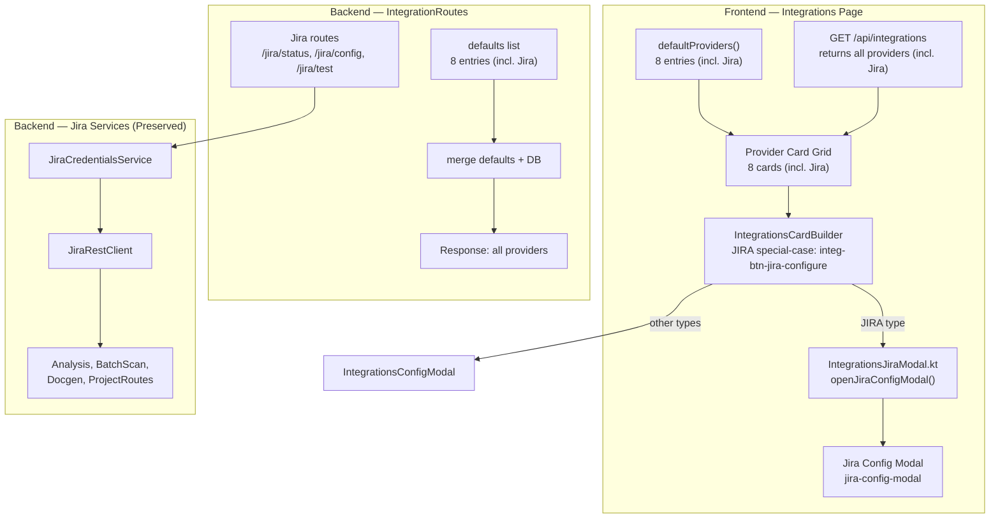
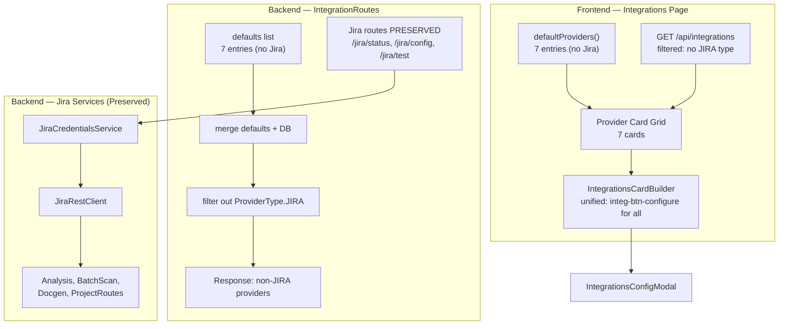

# Design Document — Loại bỏ Jira Cloud Services Badge khỏi Integrations Page

## Overview

Feature này loại bỏ provider card "Jira Cloud Services" khỏi UI trang Integrations, bao gồm card hiển thị, Jira config modal, và frontend code liên quan. Backend Jira infrastructure (JiraCredentialsService, JiraRestClient, IntegrationRoutes cho Jira) được giữ nguyên vì vẫn được sử dụng bởi các module analysis, batch scan, docgen, và project routes.

Thay đổi bao gồm:
- Xoá Jira entry khỏi `defaultProviders()` trong frontend (`IntegrationsPage.kt`) và backend (`IntegrationRoutes.kt`)
- Thêm filter loại bỏ provider type JIRA khỏi API response (`GET /api/integrations`)
- Xoá Jira Config Modal HTML template khỏi `integrations.html`
- Xoá file `IntegrationsJiraModal.kt` và `JiraModalBugConditionTest.kt`
- Xoá JIRA special-case logic trong `IntegrationsCardBuilder.kt`
- Cập nhật priority indices cho remaining providers
- Cập nhật E2E tests và documentation
- Giữ nguyên toàn bộ backend Jira routes và services

## Architecture

### Kiến trúc hiện tại (Before)



### Kiến trúc sau khi refactor (After)



## Components and Interfaces

### 1. IntegrationsPage.kt (Modified)

**File:** `frontend/src/jsMain/kotlin/com/assistant/frontend/pages/IntegrationsPage.kt`

Xoá Jira entry khỏi `defaultProviders()`. Cập nhật priority indices.

```kotlin
private fun defaultProviders(): List<ProviderInfo> = listOf(
    ProviderInfo("ollama", "Ollama (Local)", "OLLAMA", "OFFLINE", priority = 0),
    ProviderInfo("gemini", "Google Gemini API", "GEMINI", "OFFLINE", priority = 1),
    ProviderInfo("lm_studio", "LM Studio", "LM_STUDIO", "OFFLINE", priority = 2),
    ProviderInfo("gemini_cli", "Gemini CLI Interface", "GEMINI_CLI", "OFFLINE", priority = 3),
    ProviderInfo("copilot_cli", "Copilot CLI (GitHub)", "COPILOT_CLI", "OFFLINE", priority = 4),
    ProviderInfo("kiro_cli", "Kiro CLI (Amazon)", "KIRO_CLI", "OFFLINE", priority = 5),
    ProviderInfo("embedding", "Embedding Model", "EMBEDDING", "ACTIVE", priority = 10,
        endpoint = "http://localhost:11434", model = "nomic-embed-text")
)
```

### 2. IntegrationRoutes.kt (Modified)

**File:** `server/mcp/src/jvmMain/kotlin/com/assistant/server/routes/IntegrationRoutes.kt`

Xoá Jira entry khỏi `defaults` list. Thêm filter loại bỏ `ProviderType.JIRA` khỏi merged result trước khi respond. Giữ nguyên toàn bộ Jira-specific routes.

```kotlin
// GET handler — filter out JIRA from response
val defaults = listOf(
    // No Jira entry
    ProviderConfig(providerId = "ollama", ...),
    // ... remaining providers with updated priorities
)

val merged = defaults.map { default -> dbMap[default.providerId] ?: default }
val extraFromDb = dbProviders.filter { it.providerId !in defaultIds }
val result = (merged + extraFromDb).filter { it.type != ProviderType.JIRA }

call.respond(HttpStatusCode.OK, result)
```

Jira routes preserved:
- `GET /api/integrations/jira/status` — health check, first-launch detection
- `PUT /api/integrations/jira/config` — credential management
- `POST /api/integrations/{providerId}/test` (providerId = "jira") — connection testing

### 3. IntegrationsCardBuilder.kt (Modified)

**File:** `frontend/src/jsMain/kotlin/com/assistant/frontend/pages/integrations/IntegrationsCardBuilder.kt`

Xoá JIRA special-case logic:
- `configBtnClass`: luôn dùng `"integ-btn-configure"` (xoá branch `if (provider.type == "JIRA")`)
- `providerLogo()`: xoá entry `"JIRA" -> "🔷"`
- `bindCardEvents()`: xoá event listener cho `.integ-btn-jira-configure`

### 4. integrations.html (Modified)

**File:** `frontend/src/jsMain/resources/templates/integrations.html`

Xoá toàn bộ Jira Config Modal section (`<div id="jira-config-modal">...</div>`).

### 5. IntegrationsJiraModal.kt (Deleted)

**File:** `frontend/src/jsMain/kotlin/com/assistant/frontend/pages/integrations/IntegrationsJiraModal.kt`

Xoá toàn bộ file — modal không còn cần thiết.

### 6. JiraModalBugConditionTest.kt (Deleted)

**File:** `frontend/src/jsTest/kotlin/com/assistant/frontend/pages/integrations/JiraModalBugConditionTest.kt`

Xoá toàn bộ file — test cho modal đã bị xoá.

### 7. IntegrationsTestLink.kt (No Change)

**File:** `frontend/src/jsMain/kotlin/com/assistant/frontend/pages/integrations/IntegrationsTestLink.kt`

Không cần thay đổi — code đã generic cho tất cả providers, không có Jira-specific logic.

## Data Models

### Provider Defaults — Frontend (After)

| # | providerId | name | type | priority |
|---|-----------|------|------|----------|
| 0 | ollama | Ollama (Local) | OLLAMA | 0 |
| 1 | gemini | Google Gemini API | GEMINI | 1 |
| 2 | lm_studio | LM Studio | LM_STUDIO | 2 |
| 3 | gemini_cli | Gemini CLI Interface | GEMINI_CLI | 3 |
| 4 | copilot_cli | Copilot CLI (GitHub) | COPILOT_CLI | 4 |
| 5 | kiro_cli | Kiro CLI (Amazon) | KIRO_CLI | 5 |
| 6 | embedding | Embedding Model | EMBEDDING | 10 |

### Provider Defaults — Backend (After)

Same as frontend, with `ProviderConfig` data class. Jira entry removed from defaults. Additional `.filter { it.type != ProviderType.JIRA }` on merged result ensures DB-stored Jira configs are also excluded from the API response.

### Preserved Backend Jira Data Flow

```
JiraCredentialsService → reads from provider_configs (type=JIRA)
    ↓
JiraRestClient → uses credentials for API calls
    ↓
Consumers: AnalysisRoutes, TicketDetailRoutes, ProjectRoutes, BatchScanEngineFactory, DocgenModule
```

No changes to this data flow.

## Correctness Properties

*A property is a characteristic or behavior that should hold true across all valid executions of a system — essentially, a formal statement about what the system should do. Properties serve as the bridge between human-readable specifications and machine-verifiable correctness guarantees.*

### Property 1: Frontend provider list excludes Jira

*For any* list of `ProviderInfo` objects returned from the backend (including entries with providerId "jira" or type "JIRA"), after the frontend filtering logic is applied, the resulting list SHALL NOT contain any provider with providerId "jira" or type "JIRA".

**Validates: Requirements 1.1, 1.2**

### Property 2: Backend API response excludes Jira type

*For any* set of `ProviderConfig` objects stored in the database (including entries with type `ProviderType.JIRA`), the `GET /api/integrations` endpoint SHALL return a list that does NOT contain any provider with type `ProviderType.JIRA`.

**Validates: Requirements 3.1, 3.2**

### Property 3: Provider priority indices are sequential

*For any* list of default providers (after Jira removal), the priority indices SHALL form a monotonically increasing sequence starting from 0, with no gaps in the range [0, N-1] where N is the number of non-embedding providers (embedding retains priority 10).

**Validates: Requirements 5.2**

## Error Handling

### Frontend — Backend returns Jira in provider list
- If backend has not been updated yet and returns Jira provider in the list, frontend `defaultProviders()` no longer includes Jira, but `loadProviders()` uses backend response directly
- Safety filter in `loadProviders()`: filter out providers with type "JIRA" before rendering
- This provides defense-in-depth during rolling deployments

### Frontend — Missing Jira modal element
- After removing the modal HTML, any residual code attempting `document.getElementById("jira-config-modal")` returns `null`
- `IntegrationsJiraModal.openJiraConfigModal()` already handles `null` with early return: `val modal = ... ?: return`
- After file deletion, no code path calls this function

### Backend — Existing Jira config in database
- Jira credentials stored in `provider_configs` table remain untouched
- `JiraCredentialsService` continues to read them normally
- Only the `GET /api/integrations` response filters them out — no data deletion

### Backend — Jira routes still accessible
- All Jira-specific routes (`/jira/status`, `/jira/config`, `/{providerId}/test` for jira) remain functional
- Backend consumers (analysis, batch scan, docgen, project routes) continue to work without changes

## Testing Strategy

### Unit Tests (Example-based)

| Test | Validates | Description |
|------|-----------|-------------|
| `defaultProviders()` does not contain Jira | Req 1.3 | Verify frontend defaults list |
| Backend defaults list does not contain Jira | Req 3.1 | Verify backend defaults list |
| `GET /api/integrations` filters JIRA type | Req 3.2 | Mock DB with Jira entry, verify response excludes it |
| Jira routes still respond | Req 3.3, 4.3-4.5 | Call `/jira/status`, `/jira/config`, `/jira/test` — verify not 404 |
| `JiraCredentialsService` injectable | Req 4.1 | Verify Koin resolves the service |
| `buildCardHtml` uses unified configure class | Req 7.2 | Verify no "integ-btn-jira-configure" in output |

### Property-Based Tests (PBT)

Sử dụng **Kotest** property testing (đã có trong project dependencies).

| Property | Min Iterations | Tag |
|----------|---------------|-----|
| Property 1: Frontend Jira filtering | 100 | Feature: remove-jira-cloud-badge, Property 1: Frontend provider list excludes Jira |
| Property 2: Backend Jira filtering | 100 | Feature: remove-jira-cloud-badge, Property 2: Backend API response excludes Jira type |
| Property 3: Priority indices sequential | 100 | Feature: remove-jira-cloud-badge, Property 3: Provider priority indices are sequential |

### Smoke Tests

| Test | Validates |
|------|-----------|
| Compile succeeds after changes | All requirements |
| `integrations.html` does not contain `jira-config-modal` | Req 2.1 |
| `IntegrationsJiraModal.kt` file does not exist | Req 7.1 |
| `JiraModalBugConditionTest.kt` file does not exist | Req 7.3 |
| E2E feature file updated with correct card count | Req 6.1 |

### E2E Test Updates

- Update card count from 5 to 7 (all non-Jira providers) in `008-Integrations.feature`
- Remove Jira-specific scenarios (modal open, save & test, field validation, token toggle, persistence)
- Update provider list assertions to exclude "Jira Cloud Services"
- Update default provider fallback scenarios
