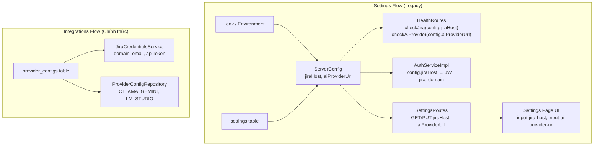
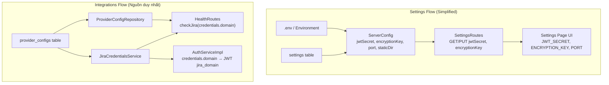

# Design Document — Xoá Legacy Settings (JIRA_HOST, AI_PROVIDER_URL)

## Overview

Feature này loại bỏ hoàn toàn hai trường cấu hình legacy `jiraHost` và `aiProviderUrl` khỏi toàn bộ codebase. Hai trường này đã thừa vì trang Integrations quản lý cấu hình kết nối thực tế qua `JiraCredentialsService` (đọc từ bảng `provider_configs`) và `ProviderConfigRepository`.

Thay đổi bao gồm:
- Xoá fields khỏi `ServerConfig`, `AppSettings`, `AppSettingsResponse`
- Chuyển Health Check (`GET /health`) sang đọc từ `JiraCredentialsService` và `ProviderConfigRepository`
- Chuyển JWT `jira_domain` claim sang đọc từ `JiraCredentialsService`
- Xoá UI fields khỏi Settings page (HTML template + Kotlin controllers)
- Dọn dẹp `.env` / `.env.example`

## Architecture

### Kiến trúc hiện tại (Before)



### Kiến trúc sau khi refactor (After)



## Components and Interfaces

### 1. ServerConfig (Modified)

**File:** `server/core/src/jvmMain/kotlin/com/assistant/server/config/ServerConfig.kt`

Xoá hai fields `jiraHost` và `aiProviderUrl` khỏi data class. Cập nhật `load()` và `loadFromDb()`.

```kotlin
data class ServerConfig(
    val jwtSecret: String,
    val encryptionKey: String,
    val port: Int,
    val staticDir: String
)
```

### 2. AppSettings / AppSettingsResponse (Modified)

**File:** `shared/src/commonMain/kotlin/com/assistant/settings/SettingsRepository.kt`

Xoá `jiraHost` và `aiProviderUrl` khỏi cả hai data classes.

```kotlin
@Serializable
data class AppSettings(
    val jwtSecret: String? = null,
    val encryptionKey: String? = null,
    val port: Int? = null
)

@Serializable
data class AppSettingsResponse(
    val jwtSecret: String? = null,
    val encryptionKey: String? = null,
    val port: Int? = null,
    val portReadOnly: Boolean = true
)
```

### 3. HealthRoutes (Modified)

**File:** `server/core/src/jvmMain/kotlin/com/assistant/server/routes/HealthRoutes.kt`

Inject `JiraCredentialsService` và `ProviderConfigRepository` thay vì dùng `ServerConfig`.

```kotlin
fun Routing.healthRoutes() {
    val jiraCredentialsService by inject<JiraCredentialsService>()
    val providerConfigRepo by inject<ProviderConfigRepository>()
    val httpClient by inject<HttpClient>()

    get("/health") {
        val jiraHealth = checkJira(httpClient, jiraCredentialsService)
        val aiHealth = checkAiProvider(httpClient, providerConfigRepo)
        val kbHealth = checkKnowledgeBase()
        // ...
    }
}
```

Logic mới:
- **Jira**: Gọi `jiraCredentialsService.getJiraCredentials()` → nếu `null` trả `"Not configured"`, nếu có thì ping `credentials.domain`
- **AI Provider**: Gọi `providerConfigRepo.findByType()` lần lượt cho `OLLAMA`, `GEMINI`, `LM_STUDIO` → lấy provider đầu tiên có `endpoint` → ping endpoint đó. Nếu không có provider nào → trả `"Not configured"`

### 4. AuthServiceImpl (Modified)

**File:** `server/core/src/jvmMain/kotlin/com/assistant/server/auth/AuthServiceImpl.kt`

Thêm dependency `JiraCredentialsService`. Thay `config.jiraHost` bằng `jiraCredentialsService.getJiraCredentials()?.domain ?: ""`.

```kotlin
class AuthServiceImpl(
    private val config: ServerConfig,
    private val httpClient: HttpClient,
    private val jiraCredentialsService: JiraCredentialsService
) : AuthService {
    override suspend fun authenticate(email: String, password: String): AuthResult {
        // ...
        val jiraDomain = jiraCredentialsService.getJiraCredentials()?.domain ?: ""
        val user = AuthenticatedUser(
            userId = username,
            email = creds.email,
            role = creds.role,
            projectKey = "",
            jiraDomain = jiraDomain
        )
        // ...
    }
}
```

### 5. SettingsRoutes (Modified)

**File:** `server/core/src/jvmMain/kotlin/com/assistant/server/routes/SettingsRoutes.kt`

- `handleGetSettings`: Không đọc/trả `JIRA_HOST`, `AI_PROVIDER_URL`
- `handlePutSettings`: Không validate/persist `jiraHost`, `aiProviderUrl`

### 6. Frontend — Settings Page (Modified)

**Files:**
- `frontend/src/jsMain/resources/templates/settings.html` — Xoá 2 input fields
- `frontend/src/jsMain/kotlin/.../SettingsPage.kt` — Xoá `setInput("input-jira-host", ...)` và `setInput("input-ai-provider-url", ...)`
- `frontend/src/jsMain/kotlin/.../SettingsSaveHandler.kt` — Xoá `jiraHost`/`aiProviderUrl` khỏi `FormValues`, `gatherFormValues()`, `validate()`, `buildPayload()`

### 7. DI Module (Modified)

**File:** `server/core/src/jvmMain/kotlin/com/assistant/server/di/CoreModule.kt`

Cập nhật `AuthServiceImpl` constructor call thêm `JiraCredentialsService`:

```kotlin
single<AuthService> { AuthServiceImpl(get(), get(), get()) }
```

## Data Models

### ServerConfig (After)

| Field | Type | Source | Description |
|-------|------|--------|-------------|
| jwtSecret | String | DB → ENV fallback | JWT signing secret |
| encryptionKey | String | DB → ENV fallback | AES-256-GCM encryption key |
| port | Int | DB → ENV fallback | Server port |
| staticDir | String | ENV only | Static files directory |

### AppSettings (After — PUT request body)

| Field | Type | Nullable | Description |
|-------|------|----------|-------------|
| jwtSecret | String? | Yes | New JWT secret (null = no change) |
| encryptionKey | String? | Yes | New encryption key (null = no change) |
| port | Int? | Yes | Port (read-only, ignored on PUT) |

### AppSettingsResponse (After — GET response body)

| Field | Type | Description |
|-------|------|-------------|
| jwtSecret | String? | Masked (last 4 chars visible) |
| encryptionKey | String? | Masked (last 4 chars visible) |
| port | Int? | Current port |
| portReadOnly | Boolean | Always true |

### HealthResponse (Unchanged structure)

```json
{
  "status": "healthy|degraded",
  "jira": { "status": "up|down", "message": "..." },
  "aiProvider": { "status": "up|down", "message": "..." },
  "knowledgeBase": { "status": "up|down", "message": "..." }
}
```

Thay đổi logic bên trong: đọc từ `provider_configs` thay vì `ServerConfig`.


## Correctness Properties

*A property is a characteristic or behavior that should hold true across all valid executions of a system — essentially, a formal statement about what the system should do. Properties serve as the bridge between human-readable specifications and machine-verifiable correctness guarantees.*

### Property 1: AppSettingsResponse serialization excludes legacy fields

*For any* valid `AppSettings` instance (with arbitrary `jwtSecret`, `encryptionKey`, `port` values), calling `AppSettingsResponse.fromSettings()` and serializing the result to JSON SHALL produce output that does not contain `"jiraHost"` or `"aiProviderUrl"` keys.

**Validates: Requirements 2.5**

### Property 2: Settings PUT round-trip persists only valid fields

*For any* PUT request body containing arbitrary `jwtSecret` and `encryptionKey` values (and optionally `jiraHost`/`aiProviderUrl` values), the `handlePutSettings` logic SHALL persist only `jwtSecret` and `encryptionKey` to the SettingsRepository, and SHALL never persist keys `"JIRA_HOST"` or `"AI_PROVIDER_URL"`.

**Validates: Requirements 3.2, 3.3**

### Property 3: JWT jira_domain claim matches JiraCredentialsService domain

*For any* Jira domain string configured in `JiraCredentialsService`, when `AuthServiceImpl.authenticate()` generates a JWT token, the `jira_domain` claim in that token SHALL equal the domain returned by `JiraCredentialsService.getJiraCredentials()?.domain` (or empty string if null).

**Validates: Requirements 5.1, 5.2**

## Error Handling

### Health Check — Jira not configured
- `JiraCredentialsService.getJiraCredentials()` returns `null`
- Response: `{ "status": "down", "message": "Not configured" }`
- Không throw exception, trả về graceful degraded status

### Health Check — AI Provider not configured
- `ProviderConfigRepository.findByType()` returns `null` cho tất cả AI types
- Response: `{ "status": "down", "message": "Not configured" }`

### Health Check — Connection failure
- HTTP call tới Jira/AI provider fails (timeout, connection refused)
- Response: `{ "status": "down", "message": "<exception message>" }`
- Giữ nguyên behavior hiện tại, chỉ thay đổi nguồn URL

### JWT — Jira not configured
- `JiraCredentialsService.getJiraCredentials()` returns `null`
- `jira_domain` claim = `""` (empty string)
- Token vẫn valid, chỉ thiếu Jira domain info

### Settings API — Unknown fields in PUT body
- `kotlinx.serialization` với `ignoreUnknownKeys = true` sẽ tự bỏ qua fields không có trong `AppSettings`
- Nếu client gửi `jiraHost`/`aiProviderUrl`, chúng bị ignore silently
- Không trả error, không log warning

### Backward Compatibility — API Response
- Clients cũ đang đọc `jiraHost`/`aiProviderUrl` từ GET response sẽ nhận `null` hoặc field không tồn tại
- Frontend đã dùng `ignoreUnknownKeys = true` nên sẽ không crash

## Testing Strategy

### Unit Tests (Example-based)

| Test | Validates | Description |
|------|-----------|-------------|
| ServerConfig.load() không chứa jiraHost/aiProviderUrl | Req 1.3, 1.4 | Verify load() output |
| ServerConfig.loadFromDb() không query JIRA_HOST/AI_PROVIDER_URL | Req 1.5, 1.6 | Mock SettingsRepository |
| HealthRoutes trả "Not configured" khi Jira chưa setup | Req 4.2 | Mock JiraCredentialsService → null |
| HealthRoutes trả "Not configured" khi AI chưa setup | Req 4.4 | Mock ProviderConfigRepository → empty |
| HealthRoutes trả "up" khi Jira configured + reachable | Req 4.5 | Mock HTTP success |
| HealthRoutes trả "up" khi AI configured + reachable | Req 4.6 | Mock HTTP success |
| AuthService JWT jira_domain = "" khi Jira chưa setup | Req 5.2 | Mock JiraCredentialsService → null |
| GET /api/settings response không chứa legacy fields | Req 3.1 | Integration test |

### Property-Based Tests (PBT)

Sử dụng **Kotest** property testing (đã có trong project dependencies).

| Property | Min Iterations | Tag |
|----------|---------------|-----|
| Property 1: AppSettingsResponse serialization | 100 | Feature: remove-legacy-settings, Property 1: AppSettingsResponse serialization excludes legacy fields |
| Property 2: Settings PUT round-trip | 100 | Feature: remove-legacy-settings, Property 2: Settings PUT round-trip persists only valid fields |
| Property 3: JWT jira_domain claim | 100 | Feature: remove-legacy-settings, Property 3: JWT jira_domain claim matches JiraCredentialsService domain |

### Smoke Tests

| Test | Validates |
|------|-----------|
| Compile succeeds after removing fields | Req 1.1, 1.2, 2.1-2.4, 5.3, 6.5 |
| settings.html không chứa input-jira-host | Req 6.1 |
| settings.html không chứa input-ai-provider-url | Req 6.2 |
| .env.example không chứa AI_PROVIDER_URL | Req 7.3 |
