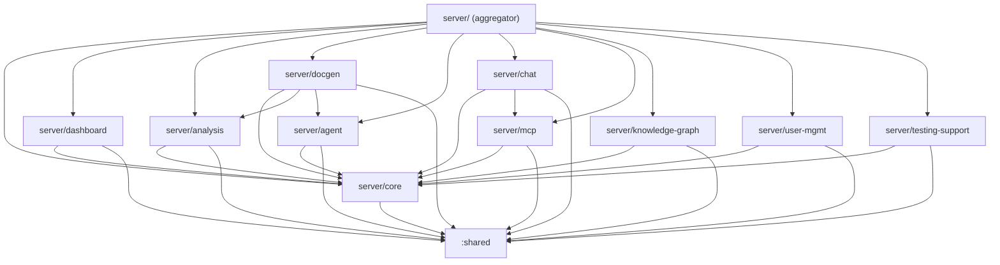

# Design Document — Server Module Restructure

## Overview

This design describes how to split the monolithic `server/` Gradle module into 10 sub-modules aligned with the feature groups defined in `.kiro/specs/01-*.md` through `.kiro/specs/10-*.md`. The restructuring enforces dependency boundaries at the build level, enables faster incremental compilation, and improves code navigability — while preserving the existing fat JAR deployment, test infrastructure, and all build commands.

### Key Design Decisions

1. **KMP sub-modules under `server/`**: Each sub-module uses `kotlin { jvm { } }` KMP configuration with `jvmMain`/`jvmTest` source sets, matching the existing server module pattern.
2. **Aggregator pattern**: The top-level `server/` module becomes an aggregator that depends on all sub-modules, assembles the fat JAR, and contains `Application.kt`, `configureRouting()`, root Koin module composition (`ServerModule.kt`), and cross-cutting aggregator bindings (`AggregatorBindings.kt`, `AggregatorHelpers.kt`, `BatchScanEngineFactory.kt`) for services that span multiple sub-modules.
3. **Package names preserved**: All classes keep their original `com.assistant.server.*` package names after moving to sub-modules. Only the Gradle module boundary changes.
4. **Koin module per sub-module**: Each sub-module defines its own Koin module. The aggregator composes them via `includes()`.
5. **Route extension functions**: Each sub-module exposes a `Application.configure*Routes()` or `Routing.*Routes()` extension function. The aggregator calls them all from `configureRouting()`.
6. **Incremental migration**: Modules are created one at a time (core first, then feature modules), with build + test verification after each phase.

### Rationale

- **Build-level enforcement** prevents accidental cross-domain coupling that code reviews alone cannot catch.
- **Incremental compilation** means changing a file in `server/chat` only recompiles `server/chat` and its dependents, not the entire server.
- **Preserving package names** avoids a massive import-rewrite across the codebase and keeps git blame useful.
- **Aggregator pattern** keeps the fat JAR, Docker deployment, and all existing `./gradlew :server:*` commands working unchanged.

## Architecture

### Module Dependency Graph



### Directory Layout (Post-Restructure)

```
server/
├── build.gradle.kts              ← Aggregator: fatJar, jvmTestAll, depends on all sub-modules
├── src/jvmMain/kotlin/com/assistant/server/
│   ├── Application.kt            ← Entry point (stays in aggregator)
│   ├── di/
│   │   ├── ServerModule.kt       ← Root Koin module composition via includes()
│   │   ├── AggregatorBindings.kt ← Cross-cutting bindings (Jira, AI, Graph, BatchScan)
│   │   ├── AggregatorHelpers.kt  ← Helper functions for aggregator bindings
│   │   └── BatchScanEngineFactory.kt ← BatchScanEngine factory wiring
│   └── routes/Routing.kt         ← configureRouting() calls sub-module route functions
├── src/jvmTest/kotlin/            ← Aggregator-level integration tests
│   ├── KoinModuleIntegrationTest.kt      ← Verifies all DI bindings compose
│   ├── RouteRegistrationSmokeTest.kt     ← Verifies all routes return non-404
│   └── integration/
│       ├── DynamicConfigRefreshTest.kt   ← Cross-module config refresh test
│       └── HardcodedIdAuditTest.kt       ← Audits for hardcoded IDs
│
├── core/
│   ├── build.gradle.kts
│   └── src/jvmMain/kotlin/com/assistant/server/
│       ├── config/                ← ServerConfig
│       ├── auth/                  ← AuthServiceImpl
│       ├── db/                    ← DatabaseConfig, DataSourceFactory, FlywayMigrator, pg/
│       ├── di/                    ← PostgresModule, core Koin module
│       ├── middleware/            ← RBACMiddleware
│       └── routes/                ← AuthRoutes, HealthRoutes, SettingsRoutes, ProjectRoutes
│
├── dashboard/
│   ├── build.gradle.kts
│   └── src/jvmMain/kotlin/com/assistant/server/
│       └── routes/                ← ScanRoutes, EstimationRoutes, GraphRoutes
│
├── analysis/
│   ├── build.gradle.kts
│   └── src/jvmMain/kotlin/com/assistant/server/
│       ├── analysis/              ← MapReduce pipeline, models
│       ├── attachment/            ← AttachmentPipeline, EmbeddingService, VectorStore
│       ├── indexing/              ← IndexingPipeline, BatchEmbedder
│       └── routes/                ← AnalysisRoutes, AttachmentRoutes, TicketDetailRoutes, CascadeRoutes
│
├── docgen/
│   ├── build.gradle.kts
│   └── src/jvmMain/kotlin/com/assistant/server/
│       ├── document/              ← DeepCollector, DocumentAggregator, sub-packages
│       ├── jobs/                  ← JobManager, JobExecutor, JobChainOrchestrator
│       └── routes/                ← DocumentRoutes, DocumentRouteHandlers, JobRoutes, CollectionJobRoutes
│
├── agent/
│   ├── build.gradle.kts
│   └── src/jvmMain/kotlin/com/assistant/server/
│       ├── agent/                 ← ba/, engine/, orchestrator/, subprocess/, tool/, registry/, etc.
│       └── ai/                    ← CliAgentUtils, CopilotCliAgent, GeminiCliAgent, KiroCliAgent
│
├── chat/
│   ├── build.gradle.kts
│   └── src/jvmMain/kotlin/com/assistant/server/
│       ├── chat/                  ← ChatServiceImpl, McpAgenticLoop, models/
│       └── routes/                ← ChatRoutes, ChatActionRoutes, ChatConfigRoutes, etc.
│
├── mcp/
│   ├── build.gradle.kts
│   └── src/jvmMain/kotlin/com/assistant/server/
│       ├── mcp/                   ← McpProcessManagerImpl, internal/, protocol client
│       └── routes/                ← IntegrationRoutes, McpRoutes, McpHealthRoutes, McpRuntimeRoutes
│
├── knowledge-graph/
│   ├── build.gradle.kts
│   └── src/jvmMain/kotlin/com/assistant/server/
│       └── routes/                ← Graph-specific route handlers
│
├── user-mgmt/
│   ├── build.gradle.kts
│   └── src/jvmMain/kotlin/com/assistant/server/
│       └── routes/                ← UserRoutes
│
└── testing-support/
    ├── build.gradle.kts
    └── src/jvmMain/kotlin/com/assistant/server/
        └── testing/               ← Shared test utilities, fixtures, test doubles
```

## Components and Interfaces

### 1. Sub-Module Build Configuration (Template)

Each sub-module `build.gradle.kts` follows this template:

```kotlin
plugins {
    alias(libs.plugins.kotlinMultiplatform)
    alias(libs.plugins.kotlinSerialization)
}

kotlin {
    jvm {
        testRuns["test"].executionTask.configure {
            useJUnitPlatform {
                excludeTags("sequential")
            }
        }
    }

    sourceSets {
        jvmMain.dependencies {
            implementation(project(":shared"))
            implementation(project(":server:core")) // if not core itself
            // Domain-specific dependencies from version catalog
        }
        jvmTest.dependencies {
            implementation(kotlin("test-junit5"))
            implementation(project(":server:testing-support"))
            // JUnit 5
            implementation("org.junit.jupiter:junit-jupiter:${libs.versions.junit.get()}")
            runtimeOnly("org.junit.jupiter:junit-jupiter-engine:${libs.versions.junit.get()}")
            // Test-specific dependencies
        }
    }
}
```

> **Note:** Do not include both `kotlin("test")` and `kotlin("test-junit5")` — `kotlin("test")` pulls in JUnit 4 which conflicts with JUnit 5. Use only `kotlin("test-junit5")`.

### 2. Koin Module Per Sub-Module

Each sub-module defines a Koin module in its `di/` package:

```kotlin
// server/chat/src/jvmMain/kotlin/com/assistant/server/chat/di/ChatModule.kt
package com.assistant.server.chat.di

import org.koin.dsl.module

val chatModule = module {
    single { UserToolPermissionService(permRepo = get(), mcpServerRepo = get()) }
    single<ChatService> { ChatServiceImpl(/* injected via get() */) }
    // ...
}
```

The aggregator composes all modules:

```kotlin
// server/src/jvmMain/.../di/ServerModule.kt
fun serverModule(config: ServerConfig): Module = module {
    single { config }
    includes(
        // ── Shared modules ──
        aiModule,
        domainModule,

        // ── Core platform ──
        coreModule(config),

        // ── Feature sub-modules ──
        dashboardModule,
        analysisModule,
        docgenModule,
        agentModule,
        baAgentModule,
        chatKoinModule,
        mcpKoinModule,
        knowledgeGraphModule,
        userMgmtModule,

        // ── Aggregator cross-cutting bindings ──
        aggregatorBindingsModule,
    )
}
```

The `aggregatorBindingsModule` (in `AggregatorBindings.kt`) wires cross-cutting services that span multiple sub-modules: `JiraCredentialsService`, `JiraClient`, `GraphEngine`, `AIOrchestrator`, and `BatchScanEngine`.

### 3. Route Registration Pattern

Each sub-module exposes routes via a `Routing` extension function:

```kotlin
// server/chat/src/jvmMain/.../routes/ChatRouting.kt
package com.assistant.server.routes

import io.ktor.server.routing.*

fun Routing.configureChatRoutes() {
    chatRoutes()
    chatUploadRoutes()
    // other chat-related route groups
}
```

The aggregator's `configureRouting()` calls each:

```kotlin
fun Application.configureRouting() {
    routing {
        configureCoreRoutes()       // health, auth, settings, project
        configureDashboardRoutes()  // scan, estimation, graph
        configureAnalysisRoutes()   // analysis, attachment, ticket detail, cascade
        configureDocgenRoutes()     // document, job, collection job
        configureChatRoutes()       // chat, upload, config, history, actions, tool permissions
        configureMcpRoutes()        // mcp, integration, mcp health, mcp runtime
        configureKnowledgeGraphRoutes()
        configureUserMgmtRoutes()   // user routes
        // Static file serving (stays in aggregator)
    }
}
```

### 4. Aggregator Fat JAR Task

The aggregator's `fatJar` task collects classes from all sub-modules:

```kotlin
tasks.register<Jar>("fatJar") {
    archiveBaseName.set("jira-assistant-server")
    archiveClassifier.set("all")
    archiveVersion.set("")
    duplicatesStrategy = DuplicatesStrategy.EXCLUDE
    manifest {
        attributes["Main-Class"] = "com.assistant.server.ApplicationKt"
    }
    val jvmMain = kotlin.jvm().compilations["main"]
    from(jvmMain.output.allOutputs)
    dependsOn(jvmMain.compileTaskProvider)
    from({
        jvmMain.runtimeDependencyFiles.filter { it.name.endsWith(".jar") }.map { zipTree(it) }
    })
}
```

Because the aggregator depends on all sub-modules, `runtimeDependencyFiles` transitively includes all sub-module JARs, which get unpacked into the fat JAR.

### 5. Dependency Enforcement

Dependency rules are enforced structurally by Gradle: each sub-module's `build.gradle.kts` only declares `implementation(project(...))` for its allowed dependencies. If a developer tries to import a class from a non-declared sub-module, the Kotlin compiler will fail with an "unresolved reference" error.

For additional safety, a CI check can verify that no sub-module's `build.gradle.kts` contains undeclared project dependencies:

```kotlin
// In aggregator build.gradle.kts
tasks.register("verifyDependencyRules") {
    doLast {
        val allowedDeps = mapOf(
            "core" to setOf(":shared"),
            "dashboard" to setOf(":server:core", ":shared"),
            "analysis" to setOf(":server:core", ":shared"),
            // ... etc
        )
        // Parse each sub-module build.gradle.kts and verify
    }
}
```

### 6. Test Organization

Each sub-module has its own `jvmTest` source set. The aggregator defines aggregate test tasks:

```kotlin
// Aggregator build.gradle.kts
tasks.named("jvmTest") {
    // Gradle automatically runs sub-module tests via dependency chain
    dependsOn(subprojects.mapNotNull { it.tasks.findByName("jvmTest") })
}

tasks.register("jvmTestAll") {
    dependsOn("jvmTest")
    dependsOn("jvmTestSequential")
    tasks.named("jvmTestSequential").get().mustRunAfter("jvmTest")
}
```

Each sub-module configures JUnit 5 with the same parallel/sequential tag strategy:

```kotlin
// In each sub-module
testRuns["test"].executionTask.configure {
    useJUnitPlatform { excludeTags("sequential") }
    maxParallelForks = (Runtime.getRuntime().availableProcessors() / 2).coerceAtLeast(1)
}
```

### 7. Shared Interface Strategy

Cross-cutting interfaces that multiple sub-modules depend on:

| Interface | Current Location | Decision |
|-----------|-----------------|----------|
| `AIOrchestrator` | `:shared` (`com.assistant.ai`) | Stays in `:shared` |
| `KBRepository` | `:shared` (`com.assistant.kb`) | Stays in `:shared` |
| `McpProcessManager` | `:shared` (`com.assistant.mcp`) | Stays in `:shared` |
| `ChatService` | `:shared` (`com.assistant.chat`) | Stays in `:shared` |
| `AuthService` | `:shared` (`com.assistant.auth`) | Stays in `:shared` |
| `GraphEngine` | `:shared` (`com.assistant.graph`) | Stays in `:shared` |
| `BatchScanEngine` | `:shared` (`com.assistant.scan`) | Stays in `:shared` |
| `EmbeddingService` | `server/attachment` | Move interface to `server/core`, impl stays in `server/analysis` |
| `VectorStore` | `server/attachment` | Move interface to `server/core`, impl stays in `server/analysis` |
| `AttachmentDownloader` | `server/attachment` | Move interface to `server/core`, impl stays in `server/analysis` |

New interfaces needed during restructuring will be placed in `server/core` with implementations in the appropriate sub-module, resolved via Koin DI.

## Data Models

No new data models are introduced by this restructuring. All existing data classes, DTOs, and domain models retain their current package names and locations. The restructuring only changes which Gradle module contains each source file.

### Key Model Locations (Unchanged)

| Model Package | Current Module | Target Sub-Module |
|--------------|---------------|-------------------|
| `com.assistant.server.analysis.models` | `:server` | `server/analysis` |
| `com.assistant.server.attachment.models` | `:server` | `server/analysis` |
| `com.assistant.server.chat.models` | `:server` | `server/chat` |
| `com.assistant.server.document.models` | `:server` | `server/docgen` |
| `com.assistant.server.config.ServerConfig` | `:server` | `server/core` |
| Shared domain models (`com.assistant.*`) | `:shared` | `:shared` (unchanged) |

## Correctness Properties

*This section is intentionally omitted.* Property-based testing is not applicable to this feature because:

1. **Build system restructuring is declarative configuration**, analogous to Infrastructure as Code. There are no pure functions with varying inputs to test.
2. **The acceptance criteria are structural** — they verify that Gradle modules exist, dependencies are declared correctly, build commands produce expected outputs, and tests pass. These are best validated by **build verification tests** and **smoke tests**.
3. Running 100+ iterations of "does `./gradlew build` succeed" provides no additional value over running it once.

The appropriate testing strategies are: build compilation checks, fat JAR assembly verification, route endpoint smoke tests, and Koin DI resolution tests.

## Error Handling

### Build-Time Errors

| Error Scenario | Detection | Resolution |
|---------------|-----------|------------|
| Undeclared cross-module dependency | Kotlin compiler: "unresolved reference" | Add the dependency to the sub-module's `build.gradle.kts` or move the class to the correct module |
| Circular dependency between sub-modules | Gradle: "circular dependency" error during configuration | Refactor the shared code into `server/core` or `:shared` |
| Duplicate class in fat JAR | `DuplicatesStrategy.EXCLUDE` in fatJar task | Ensure classes exist in only one sub-module |
| Missing Koin binding after split | Runtime: `NoBeanDefFoundException` | Add the missing binding to the appropriate sub-module's Koin module |
| Missing route registration | Runtime: 404 on existing endpoint | Add the `configure*Routes()` call in the aggregator's `configureRouting()` |

### Migration-Phase Errors

| Error Scenario | Detection | Resolution |
|---------------|-----------|------------|
| Test fails after moving code | `./gradlew :server:<module>:jvmTest` | Fix import paths or add missing test dependencies |
| Fat JAR missing classes | `java.lang.ClassNotFoundException` at runtime | Verify aggregator depends on all sub-modules |
| Settings.gradle.kts missing include | Gradle sync fails: "project :server:X not found" | Add `include(":server:X")` to settings.gradle.kts |

### Runtime Errors

Koin DI resolution errors are the primary runtime risk. Mitigation:
- Each sub-module's Koin module is unit-tested with `checkModules()` to verify all bindings resolve.
- The aggregator runs a full `checkModules()` integration test with all sub-module Koin modules composed.

## Testing Strategy

### Why PBT Does Not Apply

This feature restructures Gradle build configuration — it moves source files between modules and updates `build.gradle.kts` declarations. There are no pure functions, data transformations, or algorithms being implemented. The acceptance criteria are structural ("module X depends on module Y") and behavioral ("build command Z produces output W"). These are best verified by:

- **Build smoke tests**: `./gradlew build` compiles successfully
- **Fat JAR verification**: `./gradlew :server:fatJar` produces a runnable JAR
- **Koin DI tests**: `checkModules()` verifies all bindings resolve
- **Route smoke tests**: All API endpoints return expected status codes
- **Test parity checks**: Same tests pass before and after restructuring

### Test Categories

#### 1. Build Verification (Smoke Tests)

Run after each migration phase:

```bash
./gradlew build                          # Full build compiles
./gradlew :server:fatJar                 # Fat JAR assembles
./gradlew :server:core:jvmTest           # Sub-module tests pass independently
./gradlew :server:jvmTest                # Aggregator parallel tests pass
./gradlew :server:jvmTestSequential      # Sequential tests pass
./gradlew :server:jvmTestAll             # All tests pass
```

#### 2. Koin DI Resolution Tests

Each sub-module includes a test that verifies its Koin module resolves all bindings:

```kotlin
class ChatModuleTest {
    @Test
    fun `chatModule resolves all bindings`() {
        koinApplication {
            modules(coreModule(testConfig), chatModule, mcpModule)
        }.checkModules()
    }
}
```

The aggregator includes a full integration test:

```kotlin
class KoinModuleIntegrationTest {
    @Test
    fun `serverModule composes without duplicate or missing definitions`() {
        assertDoesNotThrow {
            startKoin {
                modules(serverModule(testConfig))
            }
        }
    }
}
```

#### 3. Route Endpoint Smoke Tests

Using Ktor's `testApplication`, verify all existing endpoints return non-404 status codes:

```kotlin
class RouteRegistrationSmokeTest {
    @Test
    fun `all sub-module routes are registered`() =
        testApplication {
            application { installTestApp(testConfig) }
            for (ep in endpoints) {
                val response = client.request(ep.path) { method = ep.method }
                assertNotEquals(
                    HttpStatusCode.NotFound, response.status,
                    "Route ${ep.method.value} ${ep.path} (${ep.module}) returned 404",
                )
            }
        }
}
```

The test uses a `NoOpDataSource` override so no real PostgreSQL connection is needed. Endpoints that require auth return 401 (Unauthorized), which proves the route is registered.

#### 4. Fat JAR Integrity Test

Verify the fat JAR contains classes from all sub-modules:

```kotlin
@Test
fun `fatJar contains all sub-module classes`() {
    val jarFile = File("server/build/libs/jira-assistant-server-all.jar")
    val jar = JarFile(jarFile)
    // Verify key classes from each sub-module are present
    assertNotNull(jar.getEntry("com/assistant/server/chat/ChatServiceImpl.class"))
    assertNotNull(jar.getEntry("com/assistant/server/mcp/McpProcessManagerImpl.class"))
    // ... etc
}
```

#### 5. Test Parity Verification

Before and after each migration phase, capture the test results and compare:
- Same number of tests pass
- Same number of tests are skipped
- No new failures introduced

### Test Infrastructure

- **JUnit 5** with `@Tag("sequential")` for Testcontainers tests (unchanged)
- **Kotest property testing** for existing property tests (unchanged, just moved to sub-modules)
- **Ktor test host** for route tests (unchanged)
- **Testcontainers** for PostgreSQL integration tests (unchanged)
- **`server/testing-support`** sub-module provides shared test utilities, fixtures, and test doubles used across sub-module test suites

### Cross-Module Integration Tests

Two integration tests in `server/analysis` (`AttachmentPipelineIntegrationTest`, `IndexSearchIntegrationTest`) reference `ChatServiceImpl` from `server/chat`. These are enabled via the `implementation(project(":server:chat"))` jvmTest dependency in `server/analysis/build.gradle.kts`. The cross-module test fakes (`FakeAIAgentForAttachment`, `FakeKBRepoForAttachment`, `FakeGraphEngineForAttachment`) reside in the analysis module's own test doubles, avoiding a dependency on chat test sources.

### workingDir Configuration

Sub-modules that contain structural tests reading source files via relative paths (e.g., `File("server/analysis/src/jvmMain/...")`) require `workingDir = rootProject.projectDir` in their `testRuns["test"].executionTask.configure` block. This is set in: `server/agent`, `server/analysis`, `server/chat`, `server/docgen`.
