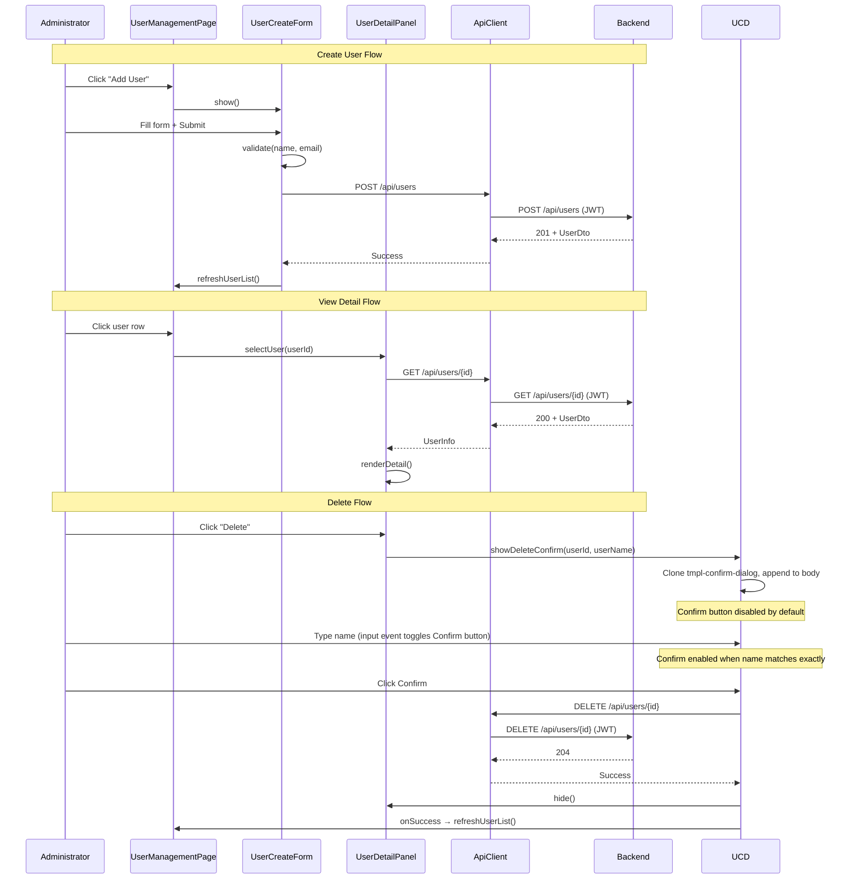

# Design Document — User CRUD & Profile

## Overview

This design extends the existing User Management module with full CRUD lifecycle operations: create, view detail, edit, disable/enable, and delete users. The system currently supports listing users, changing roles, and toggling 4 hardcoded permissions. This feature adds the missing lifecycle management that administrators need.

The implementation spans three layers of the Kotlin Multiplatform stack:

1. **Shared module** — Extend `User` model with `status` and `createdAt` fields; extend `UserStore` interface with `updateUser`, `deleteUser`, `updateStatus` methods
2. **Backend (Ktor)** — Add 5 new route handlers in `UserRoutes.kt` (POST, GET/{id}, PUT/{id}, PUT/{id}/status, DELETE/{id}), all guarded by `withPermission(MANAGE_USERS)`
3. **Frontend (KotlinJS)** — Add creation form, detail panel, edit mode, confirmation dialogs, and status toggle UI using HTML templates + DOM APIs

All operations require JWT authentication and `MANAGE_USERS` permission, and every mutation is recorded in the audit log.

## Architecture

### System Context

```mermaid
graph TB
    subgraph Frontend["Frontend (KotlinJS)"]
        UMP[UserManagementPage]
        UCF[UserCreateForm]
        UDP[UserDetailPanel]
        UDEM[UserDetailEditMode]
        UCD[UserConfirmDialog]
    end

    subgraph Backend["Backend (Ktor)"]
        UR[UserRoutes]
        MW[RBACMiddleware]
        RE[RBACEngine]
    end

    subgraph Shared["Shared Module"]
        UM[User Model]
        US[UserStore Interface]
        ALS[AuditLogStore]
    end

    subgraph Persistence["Persistence"]
        IMS[InMemoryUserStore]
    end

    UMP --> UCF
    UMP --> UDP
    UDP --> UDEM
    UDP --> UCD

    UCF -->|POST /api/users| MW
    UDP -->|GET /api/users/id| MW
    UDEM -->|PUT /api/users/id| MW
    UCD -->|PUT /api/users/id/status, DELETE /api/users/id| MW
    UDP -->|PUT /api/users/id/status (enable)| MW

    MW -->|JWT + MANAGE_USERS| UR
    UR --> US
    UR --> ALS
    UR --> RE
    US --> IMS
```

### Request Flow

All CRUD endpoints follow the same authorization pattern already established in `UserRoutes.kt`:

1. Request hits `withPermission(Permission.MANAGE_USERS)` middleware
2. Middleware authenticates JWT, extracts role, checks `RBACEngine.hasPermission()`
3. Route handler validates request body
4. Handler calls `UserStore` for persistence
5. Handler calls `AuditLogStore.append()` for audit trail
6. Handler returns appropriate HTTP status + `UserDto`

### Design Decisions

1. **Extend existing `UserRoutes.kt`** rather than creating a new routes file — all user endpoints belong in the same route group under `/api/users`. Route registrations stay in `UserRoutes.kt`, while handler implementations are extracted to `UserCrudHandlers.kt` to keep both files under 200 lines
2. **`UserStatus` enum in shared module** — shared between backend and frontend for type-safe status handling
3. **Soft delete via status DISABLED** for disable/enable; **hard delete** via `DELETE` endpoint for permanent removal — two distinct operations as specified in requirements
4. **Email uniqueness enforced at `UserStore` level** — `addUser` checks for duplicate emails; `updateUser` email uniqueness is checked at the route handler level via `findByEmail()`
5. **Self-deletion prevention at route level** — comparing JWT `user_id` claim against target userId before allowing delete
6. **Frontend decomposition** follows existing pattern: `UserManagementPage.kt` orchestrates, sub-components in `pages/usermgmt/` package (e.g., `UserCreateForm.kt`, `UserDetailPanel.kt`, `UserDetailEditMode.kt`, `UserConfirmDialog.kt`)
7. **Edit mode as internal object** — `UserDetailEditMode` is a separate file (for the 200-line limit) but acts as an internal helper to `UserDetailPanel`, not a standalone dialog

## Components and Interfaces

### Shared Module Changes

#### UserStatus Enum (new)

```kotlin
// shared/src/commonMain/kotlin/com/assistant/rbac/UserStatus.kt
@Serializable
enum class UserStatus {
    ACTIVE, DISABLED, PENDING
}
```

#### User Model Extension

Add two fields to the existing `User` data class in `RBACModels.kt`:

```kotlin
@Serializable
data class User(
    val id: String,
    val name: String,
    val email: String,
    val role: UserRole,
    val avatarUrl: String? = null,
    val customPermissions: Set<Permission> = emptySet(),
    val status: UserStatus = UserStatus.ACTIVE,       // NEW
    val createdAt: String = ""                          // NEW — ISO 8601
)
```

Default values ensure backward compatibility with existing serialized data.

#### UserStore Interface Extension

Add three methods to the existing `UserStore` interface:

```kotlin
interface UserStore {
    // Existing methods...
    suspend fun addUser(user: User)
    suspend fun getAll(): List<User>
    suspend fun findById(userId: String): User?
    suspend fun updateRole(userId: String, newRole: UserRole): Boolean
    suspend fun updatePermissions(userId: String, permissions: Set<Permission>): Boolean

    // NEW methods
    suspend fun updateUser(userId: String, name: String, email: String): Boolean
    suspend fun deleteUser(userId: String): Boolean
    suspend fun updateStatus(userId: String, status: UserStatus): Boolean
    suspend fun findByEmail(email: String): User?  // For duplicate email checks
}
```

### Backend Components

#### Extended UserDto

```kotlin
@Serializable
data class UserDto(
    val id: String,
    val name: String,
    val email: String,
    val role: String,
    val avatarUrl: String?,
    val customPermissions: List<String>,
    val status: String = "ACTIVE",      // NEW
    val createdAt: String = ""           // NEW
)
```

#### New Request DTOs

```kotlin
@Serializable
data class CreateUserRequest(
    val name: String,
    val email: String,
    val role: String,
    val status: String = "ACTIVE"
)

@Serializable
data class UpdateUserRequest(
    val name: String,
    val email: String
)

@Serializable
data class UpdateStatusRequest(
    val status: String
)
```

#### New Route Handlers (in UserCrudHandlers.kt)

| Method | Path | Handler | Response |
|--------|------|---------|----------|
| `POST` | `/api/users` | `handleCreateUser()` | 201 + UserDto |
| `GET` | `/api/users/{userId}` | `handleGetUser()` | 200 + UserDto |
| `PUT` | `/api/users/{userId}` | `handleUpdateUser()` | 200 + UserDto |
| `PUT` | `/api/users/{userId}/status` | `handleUpdateStatus()` | 200 + UserDto |
| `DELETE` | `/api/users/{userId}` | `handleDeleteUser()` | 204 No Content |

All handlers are extracted into `UserCrudHandlers.kt` as extension functions on `RoutingContext` (≤20 lines each), keeping `UserRoutes.kt` under 200 lines for route registrations only.

### Frontend Components

#### New Files

| File | Responsibility |
|------|---------------|
| `pages/usermgmt/UserCreateForm.kt` | Create user form logic (validate, submit, overlay) |
| `pages/usermgmt/UserDetailPanel.kt` | Detail panel display, fetch user, status actions (enable), delete wiring |
| `pages/usermgmt/UserDetailEditMode.kt` | Inline edit mode for name/email (enter, save, cancel) |
| `pages/usermgmt/UserConfirmDialog.kt` | Confirmation dialogs for disable/delete. Delete dialog disables Confirm button by default; an `input` event listener enables it only when typed name matches target user name exactly (BUG-001 fix). Uses `disabled` attribute + `btn-disabled` CSS class for visual feedback. |
| `models/UserModels.kt` (extend) | Add `CreateUserRequest`, `UpdateUserRequest`, `UpdateStatusRequest` frontend DTOs |
| `templates/user-management.html` (extend) | Add `<template>` elements for create form, detail panel, confirm dialog, user row |
| `user-management.css` (extend) | Styles for user row, disabled state, status badges in rows |
| `user-management-crud.css` (new) | Styles for create form, detail panel, confirm dialog, button variants |

#### Frontend Model Extensions

```kotlin
// In models/UserModels.kt — extend UserInfo
@Serializable
data class UserInfo(
    @SerialName("id") val userId: String = "",
    val email: String = "",
    @SerialName("name") val displayName: String = "",
    val role: String = "",
    @SerialName("customPermissions") val permissions: List<String> = emptyList(),
    val status: String = "ACTIVE",      // NEW — default ACTIVE for backward compat
    val createdAt: String = ""           // NEW — default empty for backward compat
)

@Serializable
data class CreateUserRequest(val name: String, val email: String, val role: String)

@Serializable
data class UpdateUserRequest(val name: String, val email: String)

@Serializable
data class UpdateStatusRequest(val status: String)
```

#### Component Interaction Flow



## Data Models

### User Entity (Shared)

| Field | Type | Default | Description |
|-------|------|---------|-------------|
| `id` | `String` | — | Server-generated UUID |
| `name` | `String` | — | Display name |
| `email` | `String` | — | Email address (unique) |
| `role` | `UserRole` | — | ADMINISTRATOR, NEURAL_ARCHITECT, READER |
| `avatarUrl` | `String?` | `null` | Optional avatar URL |
| `customPermissions` | `Set<Permission>` | `emptySet()` | Custom permission overrides |
| `status` | `UserStatus` | `ACTIVE` | ACTIVE, DISABLED, PENDING |
| `createdAt` | `String` | `""` | ISO 8601 timestamp |

### UserStatus Enum (New)

| Value | Description |
|-------|-------------|
| `ACTIVE` | Normal active account |
| `DISABLED` | Soft-disabled, cannot log in |
| `PENDING` | Awaiting activation (future use) |

### API Request/Response Contracts

#### POST /api/users

**Request:**
```json
{
  "name": "John Doe",
  "email": "john@example.com",
  "role": "NEURAL_ARCHITECT",
  "status": "ACTIVE"
}
```

**Response (201):**
```json
{
  "id": "generated-uuid",
  "name": "John Doe",
  "email": "john@example.com",
  "role": "NEURAL_ARCHITECT",
  "avatarUrl": null,
  "customPermissions": [],
  "status": "ACTIVE",
  "createdAt": "2025-01-15T10:30:00Z"
}
```

**Error (409):**
```json
{ "error": "Email already exists" }
```

#### GET /api/users/{id}

**Response (200):** Full `UserDto` as above.

**Error (404):**
```json
{ "error": "User not found" }
```

#### PUT /api/users/{id}

**Request:**
```json
{
  "name": "John Updated",
  "email": "john.updated@example.com"
}
```

**Response (200):** Updated `UserDto`.

#### PUT /api/users/{id}/status

**Request:**
```json
{ "status": "DISABLED" }
```

**Response (200):** Updated `UserDto`.

#### DELETE /api/users/{id}

**Response (204):** No content.

**Error (403):**
```json
{ "error": "Cannot delete your own account" }
```

### Audit Log Entries

Each CRUD operation generates an `AuditLogEntry`:

| Action | Tag | Old Value | New Value |
|--------|-----|-----------|-----------|
| `USER_CREATED` | `IAM_SYNC` | `""` | `"role=NEURAL_ARCHITECT"` |
| `USER_UPDATED` | `IAM_SYNC` | `"name=Old, email=old@x.com"` | `"name=New, email=new@x.com"` |
| `USER_DISABLED` | `IAM_SYNC` | `"ACTIVE"` | `"DISABLED"` |
| `USER_ENABLED` | `IAM_SYNC` | `"DISABLED"` | `"ACTIVE"` |
| `USER_DELETED` | `IAM_SYNC` | `"name=John, email=john@x.com"` | `""` |


## Correctness Properties

*A property is a characteristic or behavior that should hold true across all valid executions of a system — essentially, a formal statement about what the system should do. Properties serve as the bridge between human-readable specifications and machine-verifiable correctness guarantees.*

### Property 1: Name validation rejects empty and whitespace-only strings

*For any* string composed entirely of whitespace characters (including the empty string), the name validation function SHALL reject it. *For any* string containing at least one non-whitespace character, the name validation function SHALL accept it.

**Validates: Requirements 1.2, 3.2**

### Property 2: Email validation accepts valid emails and rejects invalid ones

*For any* string matching the standard email format (local@domain.tld), the email validation function SHALL accept it. *For any* string not matching the email format, the email validation function SHALL reject it.

**Validates: Requirements 1.3, 3.3**

### Property 3: User model serialization round-trip

*For any* valid `User` instance (with any combination of status, role, permissions, and createdAt), serializing to JSON and then deserializing back SHALL produce an equivalent `User` object with all fields preserved.

**Validates: Requirements 6.6**

### Property 4: Email uniqueness enforcement

*For any* two users where the second user has the same email as the first, attempting to add the second user to the UserStore SHALL be rejected. Similarly, *for any* update that changes a user's email to one already held by a different user, the update SHALL be rejected.

**Validates: Requirements 1.9, 3.8, 7.7**

### Property 5: UserDto contains all required fields

*For any* valid `User` object, converting to `UserDto` SHALL produce a DTO that includes non-null values for id, name, email, role, status, and createdAt. The status and createdAt fields SHALL always be present in the serialized output.

**Validates: Requirements 2.3, 6.3**

### Property 6: CRUD audit logging completeness

*For any* user CRUD operation (create, update, disable, enable, delete), the system SHALL append an `AuditLogEntry` containing the correct actor ID, target user ID, action tag, and old/new values corresponding to the operation performed.

**Validates: Requirements 1.8, 3.7, 4.5, 4.8, 5.6**

### Property 7: UserStore operations succeed for existing users

*For any* user that has been added to the UserStore, calling `updateUser`, `deleteUser`, or `updateStatus` with that user's ID SHALL return `true`. Calling any of these methods with a non-existent user ID SHALL return `false`.

**Validates: Requirements 7.1, 7.2, 7.3, 7.4, 7.5, 7.6**

### Property 8: User creation sets ACTIVE status and createdAt

*For any* valid `CreateUserRequest`, when the backend processes the creation, the persisted `User` SHALL have status `ACTIVE` and a non-empty `createdAt` timestamp in ISO 8601 format.

**Validates: Requirements 1.6, 6.1**

### Property 9: Status change persistence

*For any* existing user with status ACTIVE, calling `updateStatus` with DISABLED SHALL result in the stored user having status DISABLED. Conversely, *for any* user with status DISABLED, calling `updateStatus` with ACTIVE SHALL result in status ACTIVE. The status round-trip (disable then enable) SHALL restore the original ACTIVE status.

**Validates: Requirements 4.3, 4.6**

### Property 10: Delete removes user permanently

*For any* user that exists in the UserStore, calling `deleteUser` SHALL result in `findById` returning `null` for that user's ID, and `getAll` SHALL no longer include that user.

**Validates: Requirements 5.4**

### Property 11: Disabled user authentication rejection

*For any* user with status DISABLED, authentication attempts SHALL be rejected with an appropriate error, regardless of whether the credentials are otherwise valid.

**Validates: Requirements 4.11**

### Property 12: Unauthorized access rejection

*For any* CRUD endpoint, requests without a valid JWT token SHALL receive HTTP 401. *For any* CRUD endpoint, requests from users without MANAGE_USERS permission SHALL receive HTTP 403.

**Validates: Requirements 8.6, 8.7**

### Property 13: Non-existent user returns 404

*For any* randomly generated user ID that does not exist in the UserStore, GET, PUT, and DELETE requests to `/api/users/{id}` SHALL return HTTP 404 with a descriptive error message.

**Validates: Requirements 8.8**

### Property 14: Invalid request body returns 400

*For any* request body that fails validation (missing required fields, invalid email format, invalid role value, invalid status value), the backend SHALL return HTTP 400 with a specific validation error message.

**Validates: Requirements 8.9**

## Error Handling

### Backend Error Responses

All errors use the existing `ErrorResponse(error: String)` format. HTTP status codes follow REST conventions:

| Scenario | Status | Error Message |
|----------|--------|---------------|
| Missing/invalid JWT | 401 | `"Unauthorized"` |
| Insufficient permissions | 403 | `"Forbidden"` |
| Self-deletion attempt | 403 | `"Cannot delete your own account"` |
| User not found | 404 | `"User not found"` |
| Duplicate email | 409 | `"Email already exists"` |
| Invalid request body | 400 | Specific validation message (e.g., `"Name is required"`, `"Invalid email format"`, `"Invalid role: XYZ"`) |
| Invalid status value | 400 | `"Invalid status: XYZ. Valid values: ACTIVE, DISABLED"` |

### Backend Validation Rules

1. **CreateUserRequest**: name non-empty, email valid format, role must be valid `UserRole` enum value
2. **UpdateUserRequest**: name non-empty, email valid format
3. **UpdateStatusRequest**: status must be valid `UserStatus` enum value (only ACTIVE and DISABLED allowed via API)
4. **Path parameter `{id}`**: must be non-empty string

### Frontend Error Handling

Every API call follows the three-state pattern (loading → success/error):

1. **BlockingOverlay** shown before request, removed in `finally` block
2. **Success**: update UI immediately (add/update/remove user row), show toast notification
3. **Error**: parse `ErrorResponse` from response body, display specific message in the relevant panel
4. **Network failure**: catch exception, display generic "Connection failed. Please try again." with retry option

### Specific Frontend Error Flows

| Operation | Error Display Location | Behavior |
|-----------|----------------------|----------|
| Create user | Below create form | Show error message, retain form values |
| Edit user | Below detail panel edit fields | Show error message, retain edited values for retry |
| Disable/Enable | Toast notification | Show error toast, revert visual state |
| Delete user | Toast notification | Show error toast, user row remains |
| Load user detail | Detail panel area | Show error + retry button |
| Load user list | User directory area | Show error + retry button (existing pattern) |

## Testing Strategy

### Property-Based Tests (Kotlin — kotest + kotest-property)

The project uses Kotlin, so we use **kotest-property** for property-based testing. Each property test runs a minimum of **100 iterations**.

Property tests target the shared module and backend logic (pure functions and UserStore operations):

| Property | Test Target | Generator Strategy |
|----------|-------------|-------------------|
| P1: Name validation | `ValidationService.isValidName()` | `Arb.string()` for invalid, `Arb.string(1..100).filter { it.isNotBlank() }` for valid |
| P2: Email validation | `ValidationService.isValidEmail()` | Custom `Arb` for valid emails, `Arb.string()` for invalid |
| P3: User round-trip | `User` serialization | `Arb` for `User` with random fields |
| P4: Email uniqueness | `InMemoryUserStore.addUser()` | Two `Arb<User>` with same email |
| P5: UserDto completeness | `User.toDto()` | `Arb<User>` with random fields |
| P6: Audit logging | Route handlers + AuditLogStore | `Arb<CreateUserRequest>`, `Arb<UpdateUserRequest>` |
| P7: UserStore operations | `InMemoryUserStore` methods | `Arb<User>` + `Arb.string()` for IDs |
| P8: Creation defaults | `handleCreateUser()` | `Arb<CreateUserRequest>` |
| P9: Status changes | `InMemoryUserStore.updateStatus()` | `Arb<User>` + `Arb.enum<UserStatus>()` |
| P10: Delete removes | `InMemoryUserStore.deleteUser()` | `Arb<User>` |
| P11: Disabled auth | Auth flow + UserStore | `Arb<User>` with status DISABLED |
| P12-14: API auth/validation | Route integration tests | Various invalid request generators |

Each test is tagged with: `// Feature: user-crud-profile, Property {N}: {title}`

### Unit Tests (Example-Based)

Unit tests cover specific scenarios, edge cases, and UI interactions:

- **Edge cases**: backward compatibility deserialization (6.4, 6.5), self-deletion prevention (5.7), non-existent user operations (7.4-7.6)
- **UI interactions**: form display on button click, detail panel toggle, edit mode switch, cancel revert, confirmation dialog display, blocking overlay lifecycle
- **Integration points**: correct HTTP methods and paths, request/response payload structure

### Integration Tests (API-Level)

Integration tests verify the full request/response cycle through Ktor's test engine:

- All 5 CRUD endpoints return correct status codes and response bodies
- Authorization middleware correctly blocks unauthorized/forbidden requests
- End-to-end flows: create → get → update → disable → enable → delete

### Test File Organization

```
server/user-mgmt/src/jvmTest/kotlin/com/assistant/server/routes/
├── UserValidationPropertyTest.kt      # Property tests for validation (P1, P2)
├── UserDtoCompletenessPropertyTest.kt  # Property test for UserDto (P5)
├── UserAuditPropertyTest.kt           # Property tests for audit logging (P6)
├── UserCreationDefaultsPropertyTest.kt # Property test for creation defaults (P8)
├── UserCrudRoutesTest.kt              # Unit tests for error cases (P13, P14)
└── UserCrudIntegrationTest.kt         # Integration tests + auth (P12)
shared/src/jvmTest/kotlin/com/assistant/rbac/
├── UserStorePropertyTest.kt           # Property tests for UserStore (P4, P7, P9, P10)
└── UserSerializationPropertyTest.kt   # Property tests for User round-trip (P3)
```
