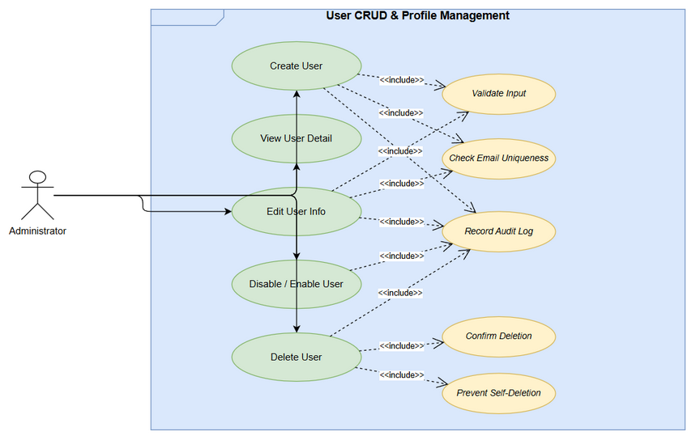
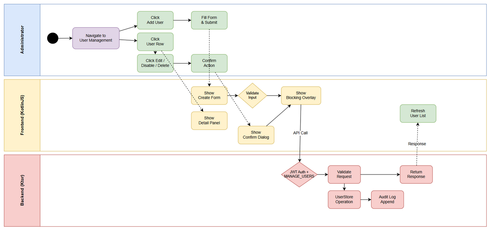
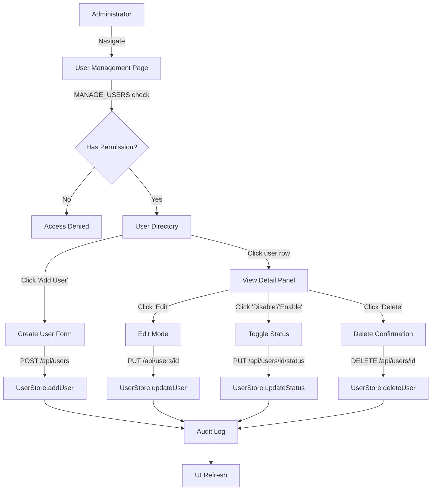
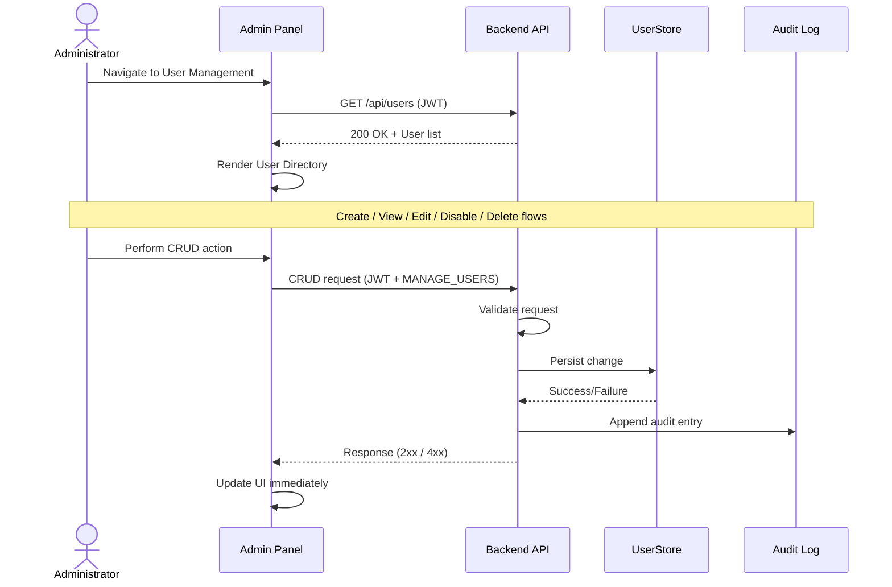

# Business Requirements Document (BRD)

## Collex AI Assistant — SCRUM-50: User CRUD & Profile Management

---

## Document Information

| Field | Value |
|-------|-------|
| Jira Ticket | SCRUM-50 |
| Title | User CRUD & Profile Management |
| Author | BA Agent |
| Version | 1.0 |
| Date | 2026-05-01 |
| Status | Draft |
| Epic | SCRUM-49 — User Management Enhancement |

---

## Author Tracking

| Role | Name - Position | Responsibility |
|------|-----------------|----------------|
| Author | BA Agent – Business Analyst | Create document |
| Peer Reviewer | SA Agent – Solution Architect | Review document |

---

## Revision History

| Version | Date | Author | Changes |
|---------|------|--------|---------|
| 1.0 | 2026-05-01 | BA Agent | Initiate document — auto-generated from Jira ticket SCRUM-50 and Kiro spec files |

---

## Sign-Off

| Name | Signature and date |
|------|--------------------|
| | ☐ I agree and confirm all criteria on this BRD as expected requirements |
| | ☐ I agree and confirm all criteria on this BRD as expected requirements |

---

## 1. Introduction

### 1.1 Scope

This feature adds full user lifecycle management to the existing User Management page of the Collex AI Assistant platform. Currently, the Admin Panel only supports listing users, changing roles, and toggling 4 hardcoded permissions. This CR extends the system with:

- **Create User** — onboard new team members with name, email, role, and initial status
- **View User Detail** — display comprehensive user profile in a detail panel
- **Edit User Info** — update display name and email address
- **Disable/Enable User** — soft-disable accounts (preserving data) and re-enable when needed
- **Delete User** — permanently remove user accounts with confirmation safeguards

The implementation spans three layers of the Kotlin Multiplatform stack:
1. **Shared module** — Extended `User` model with `status` and `createdAt` fields; extended `UserStore` interface
2. **Backend (Ktor)** — 5 new REST API endpoints under `/api/users`, all guarded by JWT + MANAGE_USERS permission
3. **Frontend (KotlinJS)** — Creation form, detail panel, edit mode, confirmation dialogs, and status toggle UI

### 1.2 Out of Scope

- User self-registration / sign-up flow
- Password management / reset functionality
- Avatar upload (only initials-based avatars)
- Bulk user import/export
- User search and filtering enhancements
- Permission management changes (existing toggle system remains as-is)
- PENDING status activation workflow (reserved for future use)

### 1.3 Preliminary Requirement

- Existing User Management page must be functional (listing users, role changes, permission toggles)
- JWT authentication system must be operational
- RBAC engine with MANAGE_USERS permission must be in place
- Audit log system must be available for recording user management actions
- InMemoryUserStore must be the active persistence implementation

---

## 2. Business Requirements

### 2.1 High Level Process Map

The User CRUD lifecycle follows a standard administrative workflow:

1. **Administrator** accesses the User Management page (requires MANAGE_USERS permission)
2. **Create** — Administrator creates new users via a form overlay
3. **View** — Administrator clicks a user row to view detailed profile in a side panel
4. **Edit** — Administrator enters edit mode within the detail panel to update name/email
5. **Disable/Enable** — Administrator toggles user account status (soft operation)
6. **Delete** — Administrator permanently removes a user with name-confirmation safeguard

All operations require JWT authentication, MANAGE_USERS permission, and are recorded in the audit log.

### 2.2 List of User Stories / Use Cases

| # | Story / Use Case | Priority | Source |
|---|-----------------|----------|--------|
| 1 | As an Administrator, I want to create a new user with name, email, role, and initial permissions, so that I can onboard new team members into the system | MUST HAVE | SCRUM-50 |
| 2 | As an Administrator, I want to view detailed information about a user, so that I can review their profile, permissions, and account status | MUST HAVE | SCRUM-50 |
| 3 | As an Administrator, I want to edit a user's display name and email, so that I can keep user information accurate and up to date | MUST HAVE | SCRUM-50 |
| 4 | As an Administrator, I want to disable a user account so that the user cannot log in while preserving their data, and re-enable the account when needed | MUST HAVE | SCRUM-50 |
| 5 | As an Administrator, I want to permanently delete a user, so that I can remove accounts that are no longer needed | MUST HAVE | SCRUM-50 |
| 6 | As a Developer, I want the User model to include status and createdAt fields, so that the system can track user lifecycle state and account creation time | MUST HAVE | SCRUM-50 |
| 7 | As a Developer, I want the UserStore interface to support update, delete, and status change operations, so that the backend can implement full user lifecycle management | MUST HAVE | SCRUM-50 |
| 8 | As a Developer, I want all new CRUD endpoints to require JWT authentication and MANAGE_USERS permission, so that only authorized administrators can manage users | MUST HAVE | SCRUM-50 |

---

### 2.3 Details of User Stories

---

#### Business Flow

**Step 1:** Administrator navigates to User Management page (requires MANAGE_USERS permission)

**Step 2:** System displays User Directory — list of all users with avatar, name, email, role, and status badge

**Step 3:** Administrator can perform any of the following actions:
- Click "Add User" → Create User flow (Story 1)
- Click a user row → View Detail flow (Story 2)
- Click "Edit" in detail panel → Edit User flow (Story 3)
- Click "Disable"/"Enable" in detail panel → Toggle Status flow (Story 4)
- Click "Delete" in detail panel → Delete User flow (Story 5)

**Step 4:** All mutations are recorded in the Audit Log with actor ID, target user ID, action, and old/new values

> **Note:** All operations require active JWT token and MANAGE_USERS permission. Unauthorized requests receive HTTP 401/403.

---

#### STORY 1: Create User

> As an Administrator, I want to create a new user with name, email, role, and initial permissions, so that I can onboard new team members into the system.

**Requirement Details:**

1. "Add User" button is displayed on the Admin Panel header
2. Clicking "Add User" opens a creation form overlay with fields: name, email, role dropdown, submit/cancel buttons
3. Form validates name (non-empty) and email (standard format) before submission
4. Role dropdown contains: ADMINISTRATOR, NEURAL_ARCHITECT, READER
5. On submit, system sends POST `/api/users` with user data
6. Backend persists new user with status ACTIVE and server-generated createdAt timestamp (ISO 8601)
7. On success, User Directory refreshes immediately without page reload
8. Audit log records: actor ID, new user ID, action "USER_CREATED", new user's role as new value
9. Duplicate email returns HTTP 409 Conflict with descriptive error message
10. On failure, form displays specific error message while retaining entered values
11. During request, Blocking Overlay with "Creating user..." prevents duplicate submissions

**Data Fields:**

| Field | Type | Required | Description | Example |
|-------|------|----------|-------------|---------|
| name | String | Yes | User display name, non-empty | "John Doe" |
| email | String | Yes | Valid email format | "john@example.com" |
| role | String (enum) | Yes | One of: ADMINISTRATOR, NEURAL_ARCHITECT, READER | "NEURAL_ARCHITECT" |
| status | String (enum) | No | Default: ACTIVE | "ACTIVE" |

**Acceptance Criteria:**

1. WHEN the Administrator clicks "Add User", THE Admin Panel SHALL display a creation form
2. THE form SHALL validate name is non-empty before allowing submission
3. THE form SHALL validate email matches standard email format before allowing submission
4. THE form SHALL provide role selection with all available roles
5. WHEN submitted, THE system SHALL send POST `/api/users` with user data
6. WHEN backend receives valid request, THE UserStore SHALL persist user with status ACTIVE and createdAt timestamp
7. WHEN created successfully, THE User Directory SHALL display new user immediately
8. WHEN created successfully, THE Audit Log SHALL record the creation event
9. IF email already exists, THEN backend SHALL return HTTP 409 Conflict
10. IF creation fails, THEN form SHALL display specific error message
11. WHILE request is in progress, THE Admin Panel SHALL display Blocking Overlay "Creating user..."

**Validation Rules:**

- Name: must be non-empty, must contain at least one non-whitespace character
- Email: must match standard email format (local@domain.tld)
- Role: must be one of ADMINISTRATOR, NEURAL_ARCHITECT, READER

**Error Handling:**

- Duplicate email: HTTP 409 — "Email already exists"
- Invalid request body: HTTP 400 — specific validation message (e.g., "Name is required", "Invalid email format", "Invalid role: XYZ")
- Unauthorized: HTTP 401 — "Unauthorized"
- Forbidden: HTTP 403 — "Forbidden"

---

#### STORY 2: View User Detail

> As an Administrator, I want to view detailed information about a user, so that I can review their profile, permissions, and account status.

**Requirement Details:**

1. Clicking a user row in User Directory opens the Detail Panel
2. Detail Panel fetches full user profile via GET `/api/users/{id}`
3. Panel displays: avatar (initials-based), name, email, role, status badge (color-coded), createdAt date
4. Custom permissions accessible via separate Permission Panel displayed alongside
5. Loading skeleton shown while data is fetching
6. Error + retry option shown on fetch failure
7. Clicking different user row updates the Detail Panel
8. Status badges: ACTIVE (green), DISABLED (red/gray), PENDING (yellow)

**Acceptance Criteria:**

1. WHEN Administrator clicks user row, THE Detail Panel SHALL display for that user
2. WHEN Detail Panel displays, THE system SHALL send GET `/api/users/{id}`
3. THE Detail Panel SHALL display avatar, name, email, role, status badge, and createdAt
4. WHILE loading, THE Detail Panel SHALL display loading skeleton
5. IF fetch fails, THEN Detail Panel SHALL display error with retry option
6. WHEN clicking different user, THE Detail Panel SHALL update to new user
7. THE Detail Panel SHALL visually distinguish ACTIVE, DISABLED, PENDING statuses

---

#### STORY 3: Edit User Info

> As an Administrator, I want to edit a user's display name and email, so that I can keep user information accurate and up to date.

**Requirement Details:**

1. "Edit" action in Detail Panel switches name and email to editable fields
2. Validates name (non-empty) and email (format) before save
3. On save, sends PUT `/api/users/{id}` with updated name and email
4. Backend updates user and checks email uniqueness (excluding current user)
5. On success, User Directory reflects changes immediately
6. Audit log records: actor ID, target user ID, action "USER_UPDATED", old and new values
7. Duplicate email returns HTTP 409
8. "Cancel" reverts to original values without API call
9. Blocking Overlay "Saving changes..." during request
10. On failure, error message displayed with edited values retained for retry

**Acceptance Criteria:**

1. WHEN Administrator clicks "Edit", THE Detail Panel SHALL switch to editable mode
2. THE system SHALL validate name is non-empty before allowing save
3. THE system SHALL validate email format before allowing save
4. WHEN saved, THE system SHALL send PUT `/api/users/{id}`
5. WHEN backend receives valid request, THE UserStore SHALL update name and email
6. WHEN saved successfully, THE User Directory SHALL reflect changes immediately
7. WHEN saved successfully, THE Audit Log SHALL record the update
8. IF updated email exists for different user, THEN backend SHALL return HTTP 409
9. WHEN "Cancel" clicked, THE Detail Panel SHALL revert to original values
10. WHILE saving, THE Admin Panel SHALL display Blocking Overlay "Saving changes..."
11. IF save fails, THEN Detail Panel SHALL display error and retain edited values

---

#### STORY 4: Disable and Enable User

> As an Administrator, I want to disable a user account so that the user cannot log in while preserving their data, and re-enable the account when needed.

**Requirement Details:**

1. "Disable" action for ACTIVE user shows Confirmation Dialog: "Are you sure you want to disable [username]?"
2. On confirm, sends PUT `/api/users/{id}/status` with status DISABLED
3. Backend updates user status to DISABLED
4. User Directory shows disabled state: grayed-out row + "DISABLED" badge
5. Audit log records: action "USER_DISABLED", old "ACTIVE", new "DISABLED"
6. "Enable" action for DISABLED user sends PUT `/api/users/{id}/status` with status ACTIVE — no confirmation needed
7. On enable success, disabled visual indicator removed
8. Audit log records: action "USER_ENABLED", old "DISABLED", new "ACTIVE"
9. Blocking Overlay "Updating status..." during request
10. On failure, error toast displayed
11. DISABLED users are rejected at authentication with appropriate error

**Acceptance Criteria:**

1. WHEN Administrator clicks "Disable" for ACTIVE user, THE system SHALL show Confirmation Dialog
2. WHEN confirmed, THE system SHALL send PUT `/api/users/{id}/status` with DISABLED
3. WHEN backend receives valid request, THE UserStore SHALL update status to DISABLED
4. WHEN disabled successfully, THE User Directory SHALL show disabled visual state
5. WHEN disabled successfully, THE Audit Log SHALL record "USER_DISABLED"
6. WHEN Administrator clicks "Enable" for DISABLED user, THE system SHALL send status ACTIVE without confirmation
7. WHEN enabled successfully, THE User Directory SHALL remove disabled visual indicator
8. WHEN enabled successfully, THE Audit Log SHALL record "USER_ENABLED"
9. WHILE status change in progress, THE Admin Panel SHALL display Blocking Overlay
10. IF status change fails, THEN THE system SHALL display error toast
11. WHILE user is DISABLED, THE RBAC Engine SHALL reject authentication attempts

---

#### STORY 5: Delete User

> As an Administrator, I want to permanently delete a user, so that I can remove accounts that are no longer needed.

**Requirement Details:**

1. "Delete" action shows Confirmation Dialog: "Are you sure you want to delete [username]? This action cannot be undone."
2. Confirmation requires typing user's name to confirm
3. On confirm, sends DELETE `/api/users/{id}`
4. Backend permanently removes user from persistence
5. User Directory removes user row immediately
6. Audit log records: action "USER_DELETED", old value = user's name and email
7. Self-deletion prevented: HTTP 403 "Cannot delete your own account"
8. Blocking Overlay "Deleting user..." during request
9. On failure, error toast displayed, user row remains
10. Detail Panel closes automatically after successful deletion

**Acceptance Criteria:**

1. WHEN Administrator clicks "Delete", THE system SHALL show Confirmation Dialog with warning
2. THE Confirmation Dialog SHALL require typing user's name to confirm
3. WHEN confirmed, THE system SHALL send DELETE `/api/users/{id}`
4. WHEN backend receives valid request, THE UserStore SHALL permanently remove user
5. WHEN deleted successfully, THE User Directory SHALL remove user row immediately
6. WHEN deleted successfully, THE Audit Log SHALL record "USER_DELETED"
7. IF Administrator attempts self-deletion, THEN backend SHALL return HTTP 403
8. WHILE deleting, THE Admin Panel SHALL display Blocking Overlay "Deleting user..."
9. IF deletion fails, THEN THE system SHALL display error toast
10. WHEN Detail Panel is open for deleted user, THE Detail Panel SHALL close automatically

---

#### STORY 6: Extended User Model

> As a Developer, I want the User model to include status and createdAt fields, so that the system can track user lifecycle state and account creation time.

**Requirement Details:**

1. User model includes `status` field of type UserStatus with default ACTIVE
2. User model includes `createdAt` field (ISO 8601 String) set at creation time
3. UserDto serializes status and createdAt in all API responses
4. Frontend defaults to ACTIVE when status field missing (backward compatibility)
5. Frontend displays "N/A" when createdAt field missing (backward compatibility)
6. Serialization round-trip preserves all fields

**Acceptance Criteria:**

1. THE User model SHALL include `status: UserStatus = UserStatus.ACTIVE`
2. THE User model SHALL include `createdAt: String = ""`
3. THE UserDto SHALL serialize status and createdAt in all responses
4. WHEN deserializing without status, THE frontend SHALL default to ACTIVE
5. WHEN deserializing without createdAt, THE frontend SHALL display "N/A"
6. FOR ALL valid User instances, serialize → deserialize SHALL produce equivalent object

---

#### STORY 7: UserStore Interface Extension

> As a Developer, I want the UserStore interface to support update, delete, and status change operations.

**Acceptance Criteria:**

1. THE UserStore SHALL include `updateUser(userId, name, email): Boolean`
2. THE UserStore SHALL include `deleteUser(userId): Boolean`
3. THE UserStore SHALL include `updateStatus(userId, status): Boolean`
4. WHEN called with non-existent userId, `updateUser` SHALL return false
5. WHEN called with non-existent userId, `deleteUser` SHALL return false
6. WHEN called with non-existent userId, `updateStatus` SHALL return false
7. THE `addUser` method SHALL reject duplicate emails with IllegalArgumentException

---

#### STORY 8: API Endpoints and Authorization

> As a Developer, I want all new CRUD endpoints to require JWT authentication and MANAGE_USERS permission.

**API Endpoints:**

| Method | Path | Description | Success Code |
|--------|------|-------------|-------------|
| POST | `/api/users` | Create new user | 201 Created |
| GET | `/api/users/{id}` | Get user detail | 200 OK |
| PUT | `/api/users/{id}` | Update user name/email | 200 OK |
| PUT | `/api/users/{id}/status` | Update user status | 200 OK |
| DELETE | `/api/users/{id}` | Delete user permanently | 204 No Content |

**Acceptance Criteria:**

1-5. All 5 endpoints SHALL be exposed as specified above
6. WHEN called without valid JWT, ALL endpoints SHALL return HTTP 401
7. WHEN called without MANAGE_USERS permission, ALL endpoints SHALL return HTTP 403
8. IF user ID not found, GET/PUT/DELETE SHALL return HTTP 404
9. THE backend SHALL validate all request bodies and return HTTP 400 for invalid input

---

## 3. Dependencies

| Dependency | Type | Related Ticket | Description |
|------------|------|----------------|-------------|
| JWT Authentication | System | N/A | JWT auth system must be operational for all CRUD endpoints |
| RBAC Engine | System | N/A | Permission checking (MANAGE_USERS) must be functional |
| Audit Log System | System | N/A | AuditLogStore must be available for recording all mutations |
| InMemoryUserStore | System | N/A | Current persistence implementation for user data |
| Shared RBAC Models | System | N/A | User, UserRole, Permission models in shared module |
| Existing User Management Page | System | N/A | Base UI that this feature extends |

---

## 4. Stakeholders

| Role | Name / Team | Responsibility | Source |
|------|-------------|----------------|--------|
| Product Owner | Project Lead | Feature approval, priority decisions | Ticket creator |
| Developer | Dev Team | Implementation across all 3 layers | Ticket assignee |
| QA Engineer | QA Team | Test planning and execution | — |
| Solution Architect | SA Team | Technical design review | — |

---

## 5. Risks and Assumptions

### 5.1 Risks

| Risk | Impact | Likelihood | Mitigation |
|------|--------|------------|------------|
| InMemoryUserStore data loss on restart | High | High | Document as known limitation; future: persistent storage |
| Self-deletion bypass via API | High | Low | Backend enforces self-deletion check comparing JWT user_id |
| Email uniqueness race condition | Medium | Low | Mutex-based locking in InMemoryUserStore |
| Backward compatibility break | High | Low | Default values on new fields ensure backward compat |
| Disabled user session still active | Medium | Medium | Auth check must verify user status on each request |

### 5.2 Assumptions

- InMemoryUserStore is the only persistence implementation (no database)
- All users are managed by administrators (no self-registration)
- Email format validation uses standard regex (not DNS verification)
- PENDING status is reserved for future use and not exposed via API
- The existing permission toggle system (4 hardcoded permissions) remains unchanged
- Frontend uses HTML template + DOM API pattern (no React/Vue framework)
- All new Kotlin files must stay under 200 lines; functions under 20 lines

---

## 6. Non-Functional Requirements

| Category | Requirement | Details |
|----------|-------------|---------|
| Security | JWT + RBAC on all endpoints | All CRUD endpoints require valid JWT and MANAGE_USERS permission |
| Security | Self-deletion prevention | Backend prevents administrators from deleting their own account |
| Security | Input validation | All request bodies validated; invalid input returns HTTP 400 |
| Auditability | Full audit trail | Every mutation (create, update, disable, enable, delete) logged with actor, target, action, old/new values |
| Usability | Blocking Overlay | All async operations show overlay to prevent duplicate submissions |
| Usability | Immediate UI updates | All mutations reflect in UI immediately without page refresh |
| Compatibility | Backward compatible | New fields have defaults; existing serialized data works without migration |
| Code Quality | File size limits | All Kotlin files ≤ 200 lines, functions ≤ 20 lines |

---

## 7. Related Tickets

| Ticket Key | Summary | Status | Type | Relationship |
|------------|---------|--------|------|--------------|
| SCRUM-50 | User CRUD & Profile Management | In Progress | Story | Main ticket |
| SCRUM-49 | User Management Enhancement | In Progress | Epic | Parent epic |

---

## 8. Appendix

### Glossary

| Term | Definition |
|------|------------|
| Admin Panel | The User Management page accessible only to users with MANAGE_USERS permission |
| User Directory | The list of all users displayed on the Admin Panel |
| Detail Panel | UI panel showing comprehensive information about a selected user |
| UserStore | Backend persistence interface for storing and retrieving user data |
| RBAC Engine | Role-Based Access Control engine enforcing permission checks |
| Audit Log | Persistent log recording all user management actions |
| UserStatus | Enum: ACTIVE, DISABLED, PENDING — lifecycle state of a user account |
| Blocking Overlay | UI overlay preventing duplicate interactions during async operations |
| Confirmation Dialog | Modal requiring explicit user confirmation before destructive actions |

### Reference Documents

| Document | Link / Location |
|----------|-----------------|
| Kiro Spec — Requirements | .kiro/specs/user-crud-profile/requirements.md |
| Kiro Spec — Design | .kiro/specs/user-crud-profile/design.md |
| Kiro Spec — Tasks | .kiro/specs/user-crud-profile/tasks.md |
| Code Intelligence — User Mgmt Module | .analysis/code-intelligence/modules/server-user-mgmt.md |
| Code Intelligence — Project Structure | .analysis/code-intelligence/project-structure.md |
