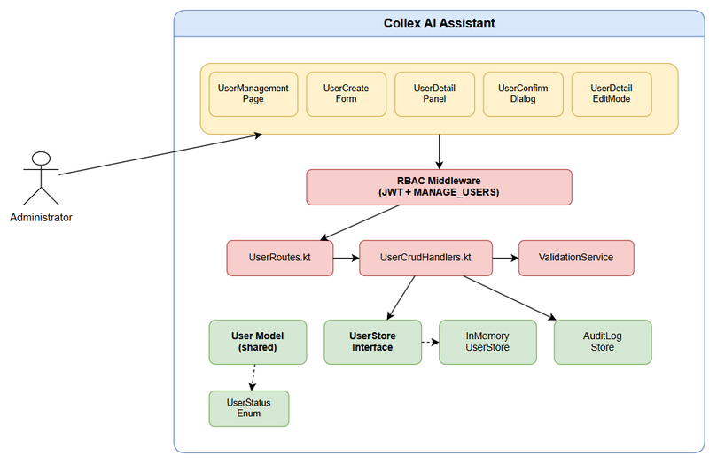
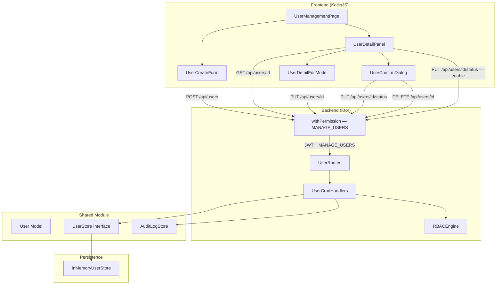
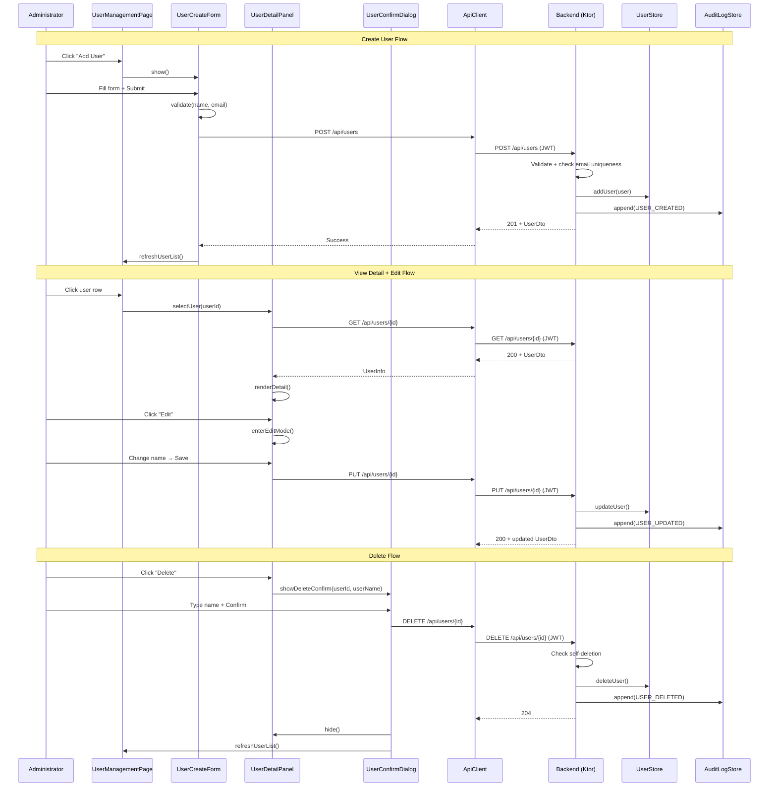
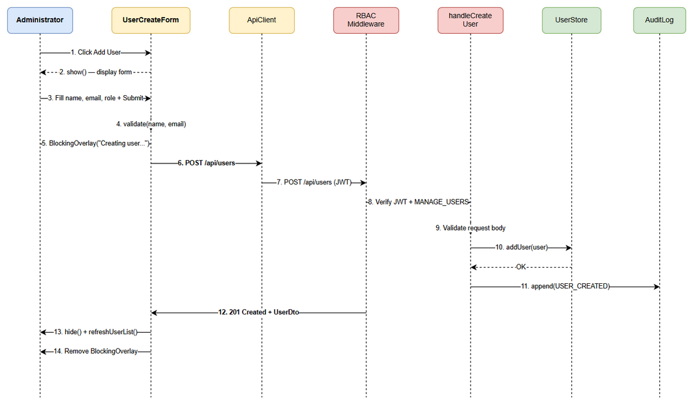
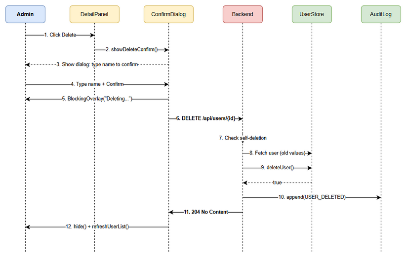
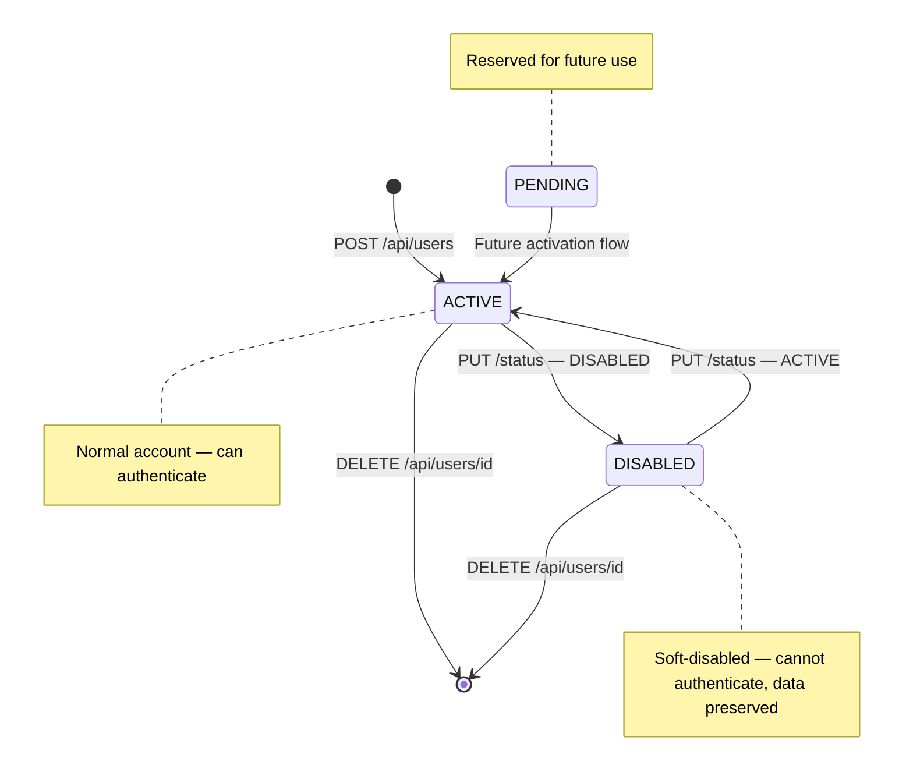

# Functional Specification Document (FSD)

## Collex AI Assistant — SCRUM-50: User CRUD & Profile Management

---

## Document Information

| Field | Value |
|-------|-------|
| Jira Ticket | SCRUM-50 |
| Title | User CRUD & Profile Management |
| Author | BA Agent |
| Version | 1.0 |
| Date | 2026-05-01 |
| Status | Draft |
| Related BRD | documents/SCRUM-50/BRD.md |

---

## Revision History

| Version | Date | Author | Changes |
|---------|------|--------|---------|
| 1.0 | 2026-05-01 | BA Agent | Initiate document — auto-generated from BRD and Kiro spec files |

---

## 1. Introduction

### 1.1 Purpose

This FSD specifies the functional behavior of the User CRUD & Profile Management feature for the Collex AI Assistant platform. It details use cases, API contracts, data models, UI specifications, and processing logic for all five CRUD operations (Create, Read/View, Update/Edit, Disable/Enable, Delete).

### 1.2 Scope

Covers the full user lifecycle management across three layers:
- **Shared module**: Extended User model and UserStore interface
- **Backend (Ktor)**: 5 new REST API endpoints under `/api/users`
- **Frontend (KotlinJS)**: Creation form, detail panel, edit mode, confirmation dialogs, status toggle UI

### 1.3 Definitions & Acronyms

| Term | Definition |
|------|------------|
| CRUD | Create, Read, Update, Delete |
| RBAC | Role-Based Access Control |
| JWT | JSON Web Token |
| KMP | Kotlin Multiplatform |
| DTO | Data Transfer Object |
| UserStatus | Enum: ACTIVE, DISABLED, PENDING |
| UserRole | Enum: ADMINISTRATOR, NEURAL_ARCHITECT, READER |

### 1.4 References

| Document | Location |
|----------|----------|
| BRD | documents/SCRUM-50/BRD.md |
| Kiro Spec — Requirements | .kiro/specs/user-crud-profile/requirements.md |
| Kiro Spec — Design | .kiro/specs/user-crud-profile/design.md |

---

## 2. System Overview

### 2.1 System Context

The User CRUD feature operates within the existing Collex AI Assistant architecture:





- **Frontend (KotlinJS)** communicates with Backend via REST API over HTTP
- **Backend (Ktor)** handles authentication (JWT), authorization (RBAC), business logic, and persistence
- **Shared module** provides common models (User, UserRole, UserStatus, Permission) used by both frontend and backend
- **InMemoryUserStore** is the persistence layer (in-memory, no database)

### 2.2 System Architecture



**Component Structure:**

```
Frontend (KotlinJS)
├── UserManagementPage.kt (orchestrator)
├── UserCreateForm.kt (create user form)
├── UserDetailPanel.kt (view/edit detail)
├── UserDetailEditMode.kt (inline edit)
├── UserConfirmDialog.kt (disable/delete confirmation)
└── user-management.html (templates)

Backend (Ktor)
├── UserRoutes.kt (route registrations)
├── UserCrudHandlers.kt (handler implementations)
├── RBACMiddleware (JWT + permission check)
└── AuditLogStore (audit trail)

Shared Module
├── User (data class with status, createdAt)
├── UserStatus (enum: ACTIVE, DISABLED, PENDING)
├── UserStore (interface with CRUD methods)
└── InMemoryUserStore (implementation)
```

---

## 3. Functional Requirements

### 3.1 Feature: Create User

**Source:** BRD Story 1

#### 3.1.1 Description

Administrators can create new users by filling out a form with name, email, and role. The system validates input, checks email uniqueness, persists the user with ACTIVE status and a server-generated timestamp, and records the action in the audit log.

#### 3.1.2 Use Case

**Use Case ID:** UC-01
**Actor:** Administrator
**Preconditions:** Administrator is authenticated with MANAGE_USERS permission; Admin Panel is displayed
**Postconditions:** New user exists in UserStore with status ACTIVE; audit log entry created

**Main Flow:**

| Step | Actor | System | Description |
|------|-------|--------|-------------|
| 1 | Clicks "Add User" button | | Administrator initiates user creation |
| 2 | | Displays creation form overlay | Form with name, email, role dropdown, submit/cancel |
| 3 | Fills in name, email, selects role | | Administrator enters user data |
| 4 | Clicks "Submit" | | Administrator submits form |
| 5 | | Validates name (non-empty) and email (format) | Client-side validation |
| 6 | | Shows Blocking Overlay "Creating user..." | Prevents duplicate submissions |
| 7 | | Sends POST /api/users | API request with user data |
| 8 | | Backend validates request body | Server-side validation |
| 9 | | Backend checks email uniqueness | Via UserStore.findByEmail() |
| 10 | | Backend persists user (status=ACTIVE, createdAt=now) | Via UserStore.addUser() |
| 11 | | Backend appends audit log entry | Action: USER_CREATED |
| 12 | | Returns 201 + UserDto | Success response |
| 13 | | Hides form, refreshes User Directory | New user appears in list |
| 14 | | Removes Blocking Overlay | Operation complete |

**Alternative Flows:**

| ID | Condition | Steps |
|----|-----------|-------|
| AF-01 | Administrator clicks "Cancel" | Form closes without API call |
| AF-02 | Client validation fails | Error shown below invalid field; form not submitted |

**Exception Flows:**

| ID | Condition | Steps |
|----|-----------|-------|
| EF-01 | Email already exists (409) | Error message shown below form; form values retained |
| EF-02 | Invalid request body (400) | Error message shown below form |
| EF-03 | Unauthorized (401) | Redirect to login |
| EF-04 | Forbidden (403) | Error toast displayed |
| EF-05 | Network failure | "Connection failed. Please try again." with retry |

#### 3.1.3 Business Rules

| Rule ID | Rule | Source |
|---------|------|--------|
| BR-01 | Name must contain at least one non-whitespace character | BRD Story 1, AC 2 |
| BR-02 | Email must match standard email format (local@domain.tld) | BRD Story 1, AC 3 |
| BR-03 | Role must be one of: ADMINISTRATOR, NEURAL_ARCHITECT, READER | BRD Story 1, AC 4 |
| BR-04 | Email must be unique across all users | BRD Story 1, AC 9 |
| BR-05 | New users always start with status ACTIVE | BRD Story 6, AC 1 |
| BR-06 | createdAt is server-generated ISO 8601 timestamp | BRD Story 6, AC 2 |

#### 3.1.4 Data Specifications

**Input Data (CreateUserRequest):**

| Field | Type | Required | Validation | Description |
|-------|------|----------|------------|-------------|
| name | String | Yes | Non-empty, non-whitespace-only | User display name |
| email | String | Yes | Standard email format regex | User email address |
| role | String | Yes | Must be valid UserRole enum value | User role assignment |
| status | String | No | Must be valid UserStatus if provided | Default: "ACTIVE" |

**Output Data (UserDto — 201 Created):**

| Field | Type | Description |
|-------|------|-------------|
| id | String | Server-generated UUID |
| name | String | User display name |
| email | String | User email address |
| role | String | User role |
| avatarUrl | String? | Always null (initials-based avatar) |
| customPermissions | List<String> | Empty list for new users |
| status | String | "ACTIVE" |
| createdAt | String | ISO 8601 timestamp |

#### 3.1.5 UI Specifications

**Screen: Create User Form (Overlay)**

| No. | Element | Type | Required | Behavior | Validation |
|-----|---------|------|----------|----------|------------|
| 1 | "Add User" button | Button | — | Opens create form overlay | — |
| 2 | Name field | Input (text) | Yes | Text input for display name | Non-empty, non-whitespace |
| 3 | Email field | Input (email) | Yes | Text input for email | Standard email format |
| 4 | Role dropdown | Select | Yes | Dropdown with ADMINISTRATOR, NEURAL_ARCHITECT, READER | Must select one |
| 5 | "Create" button | Button | — | Submits form; disabled until validation passes | — |
| 6 | "Cancel" button | Button | — | Closes form without API call | — |
| 7 | Error message area | Text | — | Displays API error messages below form | — |
| 8 | Blocking Overlay | Overlay | — | Shows "Creating user..." during API call | — |

#### 3.1.6 API Specification



**Endpoint:** `POST /api/users`

| Parameter | Type | Required | Description |
|-----------|------|----------|-------------|
| name | String (body) | Yes | User display name |
| email | String (body) | Yes | User email address |
| role | String (body) | Yes | User role |
| status | String (body) | No | Default: "ACTIVE" |

**Request Body:**

```json
{
  "name": "John Doe",
  "email": "john@example.com",
  "role": "NEURAL_ARCHITECT",
  "status": "ACTIVE"
}
```

**Response — 201 Created:**

```json
{
  "id": "generated-uuid",
  "name": "John Doe",
  "email": "john@example.com",
  "role": "NEURAL_ARCHITECT",
  "avatarUrl": null,
  "customPermissions": [],
  "status": "ACTIVE",
  "createdAt": "2026-01-15T10:30:00Z"
}
```

**Error Codes:**

| Code | Message | Description |
|------|---------|-------------|
| 400 | "Name is required" | Empty or whitespace-only name |
| 400 | "Invalid email format" | Email doesn't match format |
| 400 | "Invalid role: XYZ" | Role not in UserRole enum |
| 401 | "Unauthorized" | Missing or invalid JWT |
| 403 | "Forbidden" | User lacks MANAGE_USERS permission |
| 409 | "Email already exists" | Duplicate email in UserStore |

---

### 3.2 Feature: View User Detail

**Source:** BRD Story 2

#### 3.2.1 Description

Administrators can view detailed user information by clicking a user row in the User Directory. A Detail Panel displays the user's avatar (initials), name, email, role, status badge, and creation date.

#### 3.2.2 Use Case

**Use Case ID:** UC-02
**Actor:** Administrator
**Preconditions:** User Directory is displayed with at least one user
**Postconditions:** Detail Panel shows selected user's full profile

**Main Flow:**

| Step | Actor | System | Description |
|------|-------|--------|-------------|
| 1 | Clicks user row in User Directory | | Administrator selects a user |
| 2 | | Shows loading skeleton in Detail Panel | Visual feedback |
| 3 | | Sends GET /api/users/{id} | Fetch full user profile |
| 4 | | Renders Detail Panel with user data | Avatar, name, email, role, status badge, createdAt |
| 5 | | Displays action buttons | Edit, Disable/Enable, Delete |

**Alternative Flows:**

| ID | Condition | Steps |
|----|-----------|-------|
| AF-01 | Click different user while panel open | Panel updates to new user (re-fetch) |

**Exception Flows:**

| ID | Condition | Steps |
|----|-----------|-------|
| EF-01 | User not found (404) | Error message with retry button |
| EF-02 | Network failure | "Connection failed" with retry button |

#### 3.2.3 API Specification

**Endpoint:** `GET /api/users/{userId}`

| Parameter | Type | Required | Description |
|-----------|------|----------|-------------|
| userId | String (path) | Yes | User ID |

**Response — 200 OK:**

```json
{
  "id": "user-uuid",
  "name": "John Doe",
  "email": "john@example.com",
  "role": "NEURAL_ARCHITECT",
  "avatarUrl": null,
  "customPermissions": ["VIEW_DASHBOARD", "MANAGE_AGENTS"],
  "status": "ACTIVE",
  "createdAt": "2026-01-15T10:30:00Z"
}
```

**Error Codes:**

| Code | Message | Description |
|------|---------|-------------|
| 401 | "Unauthorized" | Missing or invalid JWT |
| 403 | "Forbidden" | User lacks MANAGE_USERS permission |
| 404 | "User not found" | userId doesn't exist |

---

### 3.3 Feature: Edit User Info

**Source:** BRD Story 3

#### 3.3.1 Description

Administrators can edit a user's display name and email via inline edit mode in the Detail Panel. The system validates input, checks email uniqueness, and records changes in the audit log.

#### 3.3.2 Use Case

**Use Case ID:** UC-03
**Actor:** Administrator
**Preconditions:** Detail Panel is displayed for a user
**Postconditions:** User's name and/or email updated; audit log entry created

**Main Flow:**

| Step | Actor | System | Description |
|------|-------|--------|-------------|
| 1 | Clicks "Edit" button | | Administrator enters edit mode |
| 2 | | Switches name and email to editable fields | Pre-filled with current values |
| 3 | Modifies name and/or email | | Administrator makes changes |
| 4 | Clicks "Save" | | Administrator saves changes |
| 5 | | Validates name (non-empty) and email (format) | Client-side validation |
| 6 | | Shows Blocking Overlay "Saving changes..." | Prevents duplicate submissions |
| 7 | | Sends PUT /api/users/{id} | API request with updated data |
| 8 | | Backend validates and checks email uniqueness | Excludes current user |
| 9 | | Backend updates user in UserStore | Via updateUser() |
| 10 | | Backend appends audit log entry | Action: USER_UPDATED, old/new values |
| 11 | | Returns 200 + updated UserDto | Success response |
| 12 | | Updates Detail Panel and User Directory | Reflects changes immediately |
| 13 | | Removes Blocking Overlay | Operation complete |

**Alternative Flows:**

| ID | Condition | Steps |
|----|-----------|-------|
| AF-01 | Administrator clicks "Cancel" | Reverts to original values; no API call |

**Exception Flows:**

| ID | Condition | Steps |
|----|-----------|-------|
| EF-01 | Email already exists for different user (409) | Error below edit fields; edited values retained |
| EF-02 | User not found (404) | Error message displayed |

#### 3.3.3 API Specification

**Endpoint:** `PUT /api/users/{userId}`

| Parameter | Type | Required | Description |
|-----------|------|----------|-------------|
| userId | String (path) | Yes | User ID |
| name | String (body) | Yes | Updated display name |
| email | String (body) | Yes | Updated email address |

**Request Body:**

```json
{
  "name": "John Updated",
  "email": "john.updated@example.com"
}
```

**Response — 200 OK:** Updated UserDto (same schema as GET response)

**Error Codes:**

| Code | Message | Description |
|------|---------|-------------|
| 400 | "Name is required" | Empty name |
| 400 | "Invalid email format" | Invalid email |
| 401 | "Unauthorized" | Missing JWT |
| 403 | "Forbidden" | No MANAGE_USERS |
| 404 | "User not found" | userId doesn't exist |
| 409 | "Email already exists" | Duplicate email |

---

### 3.4 Feature: Disable and Enable User

**Source:** BRD Story 4

#### 3.4.1 Description

Administrators can disable user accounts (soft operation preserving data) and re-enable them. Disabled users cannot authenticate. Disable requires confirmation; enable does not.

#### 3.4.2 Use Cases

**Use Case ID:** UC-04a (Disable)
**Actor:** Administrator
**Preconditions:** Detail Panel displayed for an ACTIVE user
**Postconditions:** User status changed to DISABLED; audit log entry created

**Main Flow (Disable):**

| Step | Actor | System | Description |
|------|-------|--------|-------------|
| 1 | Clicks "Disable" button | | Administrator initiates disable |
| 2 | | Shows Confirmation Dialog | "Are you sure you want to disable [username]?" |
| 3 | Clicks "Confirm" | | Administrator confirms |
| 4 | | Shows Blocking Overlay "Updating status..." | Prevents duplicates |
| 5 | | Sends PUT /api/users/{id}/status with DISABLED | API request |
| 6 | | Backend updates status to DISABLED | Via updateStatus() |
| 7 | | Backend appends audit log | Action: USER_DISABLED |
| 8 | | Returns 200 + updated UserDto | Success |
| 9 | | Updates UI: grayed-out row, DISABLED badge | Visual feedback |
| 10 | | Removes Blocking Overlay | Complete |

**Use Case ID:** UC-04b (Enable)
**Actor:** Administrator
**Preconditions:** Detail Panel displayed for a DISABLED user
**Postconditions:** User status changed to ACTIVE; audit log entry created

**Main Flow (Enable):**

| Step | Actor | System | Description |
|------|-------|--------|-------------|
| 1 | Clicks "Enable" button | | No confirmation needed |
| 2 | | Shows Blocking Overlay "Updating status..." | Prevents duplicates |
| 3 | | Sends PUT /api/users/{id}/status with ACTIVE | API request |
| 4 | | Backend updates status to ACTIVE | Via updateStatus() |
| 5 | | Backend appends audit log | Action: USER_ENABLED |
| 6 | | Returns 200 + updated UserDto | Success |
| 7 | | Updates UI: removes disabled visual state | Normal appearance |
| 8 | | Removes Blocking Overlay | Complete |

#### 3.4.3 API Specification

**Endpoint:** `PUT /api/users/{userId}/status`

| Parameter | Type | Required | Description |
|-----------|------|----------|-------------|
| userId | String (path) | Yes | User ID |
| status | String (body) | Yes | "ACTIVE" or "DISABLED" |

**Request Body:**

```json
{ "status": "DISABLED" }
```

**Response — 200 OK:** Updated UserDto

**Error Codes:**

| Code | Message | Description |
|------|---------|-------------|
| 400 | "Invalid status: XYZ. Valid values: ACTIVE, DISABLED" | Invalid status value |
| 401 | "Unauthorized" | Missing JWT |
| 403 | "Forbidden" | No MANAGE_USERS |
| 404 | "User not found" | userId doesn't exist |

---

### 3.5 Feature: Delete User

**Source:** BRD Story 5

#### 3.5.1 Description

Administrators can permanently delete users. Deletion requires typing the user's name as confirmation. Self-deletion is prevented by the backend.

#### 3.5.2 Use Case

**Use Case ID:** UC-05
**Actor:** Administrator
**Preconditions:** Detail Panel displayed for a user; user is not the current administrator
**Postconditions:** User permanently removed from UserStore; audit log entry created

**Main Flow:**

| Step | Actor | System | Description |
|------|-------|--------|-------------|
| 1 | Clicks "Delete" button | | Administrator initiates delete |
| 2 | | Shows Confirmation Dialog | "Are you sure you want to delete [username]? This action cannot be undone." |
| 3 | | Requires typing user's name | Safety confirmation |
| 4 | Types user name, clicks "Confirm" | | Administrator confirms |
| 5 | | Shows Blocking Overlay "Deleting user..." | Prevents duplicates |
| 6 | | Sends DELETE /api/users/{id} | API request |
| 7 | | Backend checks self-deletion (JWT user_id vs target) | Prevention check |
| 8 | | Backend fetches user for audit log | Old values |
| 9 | | Backend deletes user from UserStore | Via deleteUser() |
| 10 | | Backend appends audit log | Action: USER_DELETED |
| 11 | | Returns 204 No Content | Success |
| 12 | | Closes Detail Panel, removes user row | UI cleanup |
| 13 | | Removes Blocking Overlay | Complete |

**Exception Flows:**

| ID | Condition | Steps |
|----|-----------|-------|
| EF-01 | Self-deletion attempt (403) | Error toast: "Cannot delete your own account" |
| EF-02 | User not found (404) | Error toast displayed |

#### 3.5.3 API Specification



**Endpoint:** `DELETE /api/users/{userId}`

| Parameter | Type | Required | Description |
|-----------|------|----------|-------------|
| userId | String (path) | Yes | User ID to delete |

**Response — 204 No Content:** Empty body

**Error Codes:**

| Code | Message | Description |
|------|---------|-------------|
| 401 | "Unauthorized" | Missing JWT |
| 403 | "Forbidden" | No MANAGE_USERS permission |
| 403 | "Cannot delete your own account" | Self-deletion attempt |
| 404 | "User not found" | userId doesn't exist |

---

## 4. Data Model

### 4.1 Entity: User (Shared Module)

| Field | Type | Nullable | Default | Description |
|-------|------|----------|---------|-------------|
| id | String | No | — | Server-generated UUID |
| name | String | No | — | Display name |
| email | String | No | — | Email address (unique) |
| role | UserRole | No | — | ADMINISTRATOR, NEURAL_ARCHITECT, READER |
| avatarUrl | String? | Yes | null | Optional avatar URL |
| customPermissions | Set<Permission> | No | emptySet() | Custom permission overrides |
| status | UserStatus | No | ACTIVE | ACTIVE, DISABLED, PENDING |
| createdAt | String | No | "" | ISO 8601 timestamp |

### 4.2 Enum: UserStatus




| Value | Description |
|-------|-------------|
| ACTIVE | Normal active account |
| DISABLED | Soft-disabled, cannot log in |
| PENDING | Awaiting activation (future use) |

### 4.3 Enum: UserRole

| Value | Description |
|-------|-------------|
| ADMINISTRATOR | Full system access including user management |
| NEURAL_ARCHITECT | Standard user with AI capabilities |
| READER | Read-only access |

### 4.4 DTO: UserDto (API Response)

| Field | Type | Description |
|-------|------|-------------|
| id | String | User UUID |
| name | String | Display name |
| email | String | Email address |
| role | String | Role name |
| avatarUrl | String? | Avatar URL or null |
| customPermissions | List<String> | Permission names |
| status | String | "ACTIVE", "DISABLED", or "PENDING" |
| createdAt | String | ISO 8601 timestamp |

---

## 5. Integration Specifications

### 5.1 Internal: Audit Log System

| Attribute | Value |
|-----------|-------|
| Protocol | In-process function call |
| Interface | AuditLogStore.append() |
| Data Format | AuditLogEntry data class |

**Audit Log Entries:**

| Action | Tag | Old Value | New Value |
|--------|-----|-----------|-----------|
| USER_CREATED | IAM_SYNC | "" | "role=NEURAL_ARCHITECT" |
| USER_UPDATED | IAM_SYNC | "name=Old, email=old@x.com" | "name=New, email=new@x.com" |
| USER_DISABLED | IAM_SYNC | "ACTIVE" | "DISABLED" |
| USER_ENABLED | IAM_SYNC | "DISABLED" | "ACTIVE" |
| USER_DELETED | IAM_SYNC | "name=John, email=john@x.com" | "" |

---

## 6. Processing Logic

### 6.1 Email Uniqueness Check

**Trigger:** POST /api/users (create) or PUT /api/users/{id} (update)
**Input:** Email address from request body
**Output:** Pass (email unique) or Fail (HTTP 409)

**Processing Steps:**

| Step | Description | Error Handling |
|------|-------------|----------------|
| 1 | Call UserStore.findByEmail(email) | — |
| 2 | If found and different user ID → reject with 409 | Return "Email already exists" |
| 3 | If not found or same user ID → proceed | Continue with operation |

### 6.2 Self-Deletion Prevention

**Trigger:** DELETE /api/users/{id}
**Input:** JWT user_id claim + target userId path parameter
**Output:** Pass (different user) or Fail (HTTP 403)

**Processing Steps:**

| Step | Description | Error Handling |
|------|-------------|----------------|
| 1 | Extract user_id from JWT principal | — |
| 2 | Compare with target userId from path | — |
| 3 | If same → reject with 403 | Return "Cannot delete your own account" |
| 4 | If different → proceed with deletion | Continue |

---

## 7. Security Requirements

### 7.1 Authentication & Authorization

| Role | Permissions | Screens/Features |
|------|-------------|-------------------|
| ADMINISTRATOR | MANAGE_USERS | All CRUD operations on User Management page |
| NEURAL_ARCHITECT | — | No access to User Management CRUD |
| READER | — | No access to User Management CRUD |

All 5 CRUD endpoints are wrapped in `withPermission(Permission.MANAGE_USERS)` middleware which:
1. Validates JWT token (401 if invalid/missing)
2. Extracts user role from JWT claims
3. Checks RBACEngine.hasPermission(role, MANAGE_USERS) (403 if denied)

### 7.2 Audit Trail

| Event | Logged Fields | Retention |
|-------|--------------|-----------|
| USER_CREATED | actor ID, target user ID, action, new role | In-memory (session lifetime) |
| USER_UPDATED | actor ID, target user ID, action, old/new name+email | In-memory |
| USER_DISABLED | actor ID, target user ID, action, old/new status | In-memory |
| USER_ENABLED | actor ID, target user ID, action, old/new status | In-memory |
| USER_DELETED | actor ID, target user ID, action, old name+email | In-memory |

---

## 8. Non-Functional Specifications

| Category | Specification | Target |
|----------|--------------|--------|
| Compatibility | Backward compatible serialization | New fields have defaults; existing data works |
| Usability | Blocking Overlay on all async ops | Prevents duplicate submissions |
| Usability | Immediate UI updates | No page refresh needed after mutations |
| Code Quality | File size limit | All Kotlin files ≤ 200 lines |
| Code Quality | Function size limit | All functions ≤ 20 lines |

---

## 9. Error Handling & Logging

### 9.1 Error Codes Summary

| Code | Severity | Message | User Action | System Action |
|------|----------|---------|-------------|---------------|
| 400 | Warning | Validation error (specific) | Fix input and retry | Return error response |
| 401 | Critical | "Unauthorized" | Re-login | Reject request |
| 403 | Warning | "Forbidden" / "Cannot delete own account" | Contact admin | Reject request |
| 404 | Warning | "User not found" | Refresh page | Return error response |
| 409 | Warning | "Email already exists" | Use different email | Return error response |

### 9.2 Frontend Error Display

| Operation | Error Display Location | Behavior |
|-----------|----------------------|----------|
| Create user | Below create form | Show error, retain form values |
| Edit user | Below detail panel edit fields | Show error, retain edited values |
| Disable/Enable | Toast notification | Show error toast, revert visual state |
| Delete user | Toast notification | Show error toast, user row remains |
| Load user detail | Detail panel area | Show error + retry button |

---

## 10. Testing Considerations

### 10.1 Key Test Scenarios

| ID | Scenario | Input | Expected Output | Priority |
|----|----------|-------|-----------------|----------|
| TC-01 | Create user with valid data | name, email, role | 201 + UserDto | High |
| TC-02 | Create user with duplicate email | existing email | 409 error | High |
| TC-03 | Create user with empty name | empty name | 400 error | High |
| TC-04 | View user detail | valid userId | 200 + UserDto | High |
| TC-05 | View non-existent user | invalid userId | 404 error | Medium |
| TC-06 | Edit user name and email | valid data | 200 + updated UserDto | High |
| TC-07 | Edit with duplicate email | existing email | 409 error | High |
| TC-08 | Disable active user | status=DISABLED | 200 + UserDto(DISABLED) | High |
| TC-09 | Enable disabled user | status=ACTIVE | 200 + UserDto(ACTIVE) | High |
| TC-10 | Delete user | valid userId | 204 No Content | High |
| TC-11 | Self-deletion attempt | own userId | 403 error | High |
| TC-12 | Unauthorized access | no JWT | 401 error | High |
| TC-13 | Forbidden access | no MANAGE_USERS | 403 error | High |
| TC-14 | Invalid status value | status=INVALID | 400 error | Medium |
| TC-15 | Backward compat — missing status | old UserDto | Defaults to ACTIVE | Medium |

---

## 11. Appendix

### Change Log from BRD

No deviations from BRD. All functional specifications are consistent with BRD requirements.

### Diagrams

| Diagram | Description |
|---------|-------------|
| System Context | See Section 2.1 (text-based architecture) |
| Component Interaction | See Kiro design.md for Mermaid sequence diagrams |
