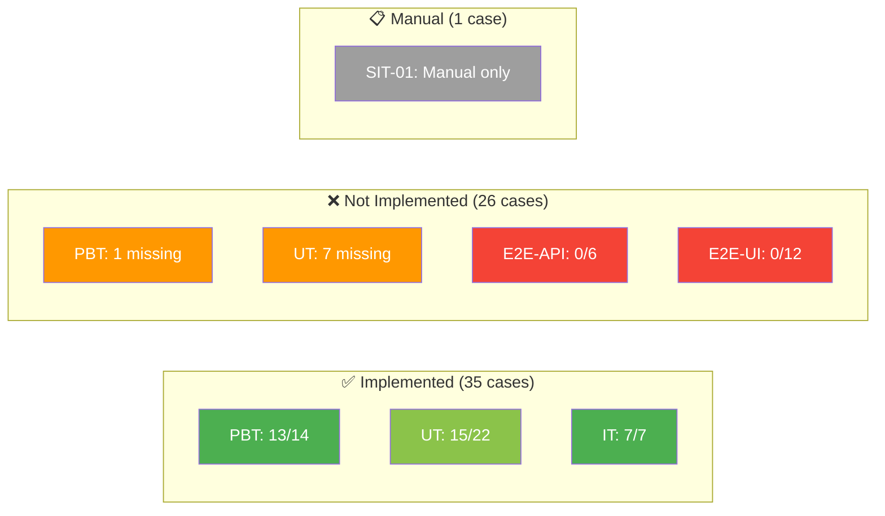

# STC Implementation Gap Report — SCRUM-50

## User CRUD & Profile Management

---

## Document Information

| Field | Value |
|-------|-------|
| Jira Ticket | SCRUM-50 |
| STC Version | 3.0 (62 test cases) |
| Report Date | 2026-05-20 |
| Prepared By | Scrum Master Agent |
| Purpose | Mapping STC test cases → implementation status |

---

## 1. Executive Summary

| Level | STC Cases | Implemented | Not Implemented | Coverage |
|-------|-----------|-------------|-----------------|----------|
| **PBT** | 14 | 13 | 1 | 93% |
| **UT** | 22 | 15 | 7 | 68% |
| **IT** | 7 | 7 | 0 | 100% |
| **E2E-API** | 6 | 0 | 6 | 0% |
| **E2E-UI** | 12 | 0 | 12 | 0% |
| **SIT** | 1 | — | — | N/A (manual) |
| **TOTAL** | 62 | 35 | 26 | 56% |

> SIT-01 là manual test, không cần implement code. Không tính vào gap.

### Tóm tắt nhanh

- ✅ **PBT + IT**: Gần như hoàn chỉnh (chỉ thiếu PBT-11)
- ⚠️ **UT**: Thiếu 7 cases — chủ yếu là backward compatibility tests và một số edge cases chưa có test riêng qua Ktor testApplication
- ❌ **E2E-API**: Hoàn toàn chưa implement (0/6) — file `UserCrudApiTest.kt` chưa tồn tại
- ❌ **E2E-UI**: Hoàn toàn chưa implement (0/12) — cả 3 files đều chưa tồn tại

---

## 2. Detailed Mapping — Property-Based Tests (PBT)

| STC ID | Property | STC File | Actual File | Status | Notes |
|--------|----------|----------|-------------|--------|-------|
| PBT-01 | Name validation rejects empty/whitespace | UserValidationPropertyTest.kt | `server/user-mgmt/src/jvmTest/.../UserValidationPropertyTest.kt` | ✅ Implemented | 2 tests: rejects whitespace, accepts non-blank |
| PBT-02 | Email validation | UserValidationPropertyTest.kt | `server/user-mgmt/src/jvmTest/.../UserValidationPropertyTest.kt` | ✅ Implemented | 2 tests: accepts valid, rejects invalid |
| PBT-03 | User serialization round-trip | UserSerializationPropertyTest.kt | `shared/src/jvmTest/.../UserSerializationPropertyTest.kt` | ✅ Implemented | Full round-trip with all field combinations |
| PBT-04 | Email uniqueness enforcement | UserStorePropertyTest.kt | `shared/src/jvmTest/.../UserStorePropertyTest.kt` | ✅ Implemented | addUser rejects duplicate email |
| PBT-05 | UserDto completeness | UserDtoCompletenessPropertyTest.kt | `server/user-mgmt/src/jvmTest/.../UserDtoCompletenessPropertyTest.kt` | ✅ Implemented | Verifies all 6 required fields in DTO + JSON |
| PBT-06 | CRUD audit logging completeness | UserAuditPropertyTest.kt | `server/user-mgmt/src/jvmTest/.../UserAuditPropertyTest.kt` | ✅ Implemented | 5 tests: create, update, disable, enable, delete |
| PBT-07 | UserStore operations succeed for existing | UserStorePropertyTest.kt | `shared/src/jvmTest/.../UserStorePropertyTest.kt` | ✅ Implemented | 4 tests: update/delete/status true, non-existent false |
| PBT-08 | Creation sets ACTIVE status + createdAt | UserCreationDefaultsPropertyTest.kt | `server/user-mgmt/src/jvmTest/.../UserCreationDefaultsPropertyTest.kt` | ✅ Implemented | 3 tests: ACTIVE status, ISO 8601 createdAt, handler logic |
| PBT-09 | Status change persistence | UserStorePropertyTest.kt | `shared/src/jvmTest/.../UserStorePropertyTest.kt` | ✅ Implemented | 3 tests: ACTIVE→DISABLED, DISABLED→ACTIVE, round-trip |
| PBT-10 | Delete removes user permanently | UserStorePropertyTest.kt | `shared/src/jvmTest/.../UserStorePropertyTest.kt` | ✅ Implemented | findById returns null, getAll excludes deleted |
| PBT-11 | Disabled user authentication rejection | (auth integration test) | — | ❌ Not Implemented | Không tìm thấy test file nào verify DISABLED users bị reject ở auth layer |
| PBT-12 | Unauthorized access rejection | UserCrudIntegrationTest.kt | `server/user-mgmt/src/jvmTest/.../UserCrudIntegrationTest.kt` | ✅ Implemented | Property 12 test + 401/403 tests |
| PBT-13 | Non-existent user returns 404 | UserCrudRoutesTest.kt | `server/user-mgmt/src/jvmTest/.../UserCrudRoutesTest.kt` | ✅ Implemented | Property 13 + individual 404 tests |
| PBT-14 | Invalid request body returns 400 | UserCrudRoutesTest.kt | `server/user-mgmt/src/jvmTest/.../UserCrudRoutesTest.kt` | ✅ Implemented | Property 14 + validation tests |

**PBT Summary: 13/14 implemented (93%)**

---

## 3. Detailed Mapping — Unit Tests (UT)

| STC ID | Scenario | Status | Actual Implementation | Notes |
|--------|----------|--------|----------------------|-------|
| UT-01 | Create user with valid data | ✅ Implemented | `UserCrudIntegrationTest.kt` → `POST returns 201 with valid data` + lifecycle test | Covered in integration test via Ktor testApplication |
| UT-02 | Create user with empty name | ✅ Implemented | `UserCrudRoutesTest.kt` → `validation rejects empty name` | Tests ValidationService directly |
| UT-03 | Create user with whitespace name | ✅ Implemented | `UserCrudRoutesTest.kt` → `validation rejects empty name` (includes whitespace) | Tests `"   "` and `"\t"` |
| UT-04 | Create user with invalid email | ✅ Implemented | `UserCrudRoutesTest.kt` → `validation rejects invalid email` | Tests multiple invalid patterns |
| UT-05 | Create user with invalid role | ✅ Implemented | `UserCrudRoutesTest.kt` → `validation rejects invalid role` | Tests INVALID, admin, empty, SUPERUSER |
| UT-06 | Create user with duplicate email | ✅ Implemented | `UserCrudRoutesTest.kt` → `POST duplicate email throws IllegalArgumentException` | Verifies 409 behavior |
| UT-07 | Get existing user | ✅ Implemented | `UserCrudIntegrationTest.kt` → lifecycle test GET step | Covered in full lifecycle |
| UT-08 | Get non-existent user | ✅ Implemented | `UserCrudRoutesTest.kt` → `GET non-existent user returns null from store` | Store-level test |
| UT-09 | Update user with valid data | ✅ Implemented | `UserCrudIntegrationTest.kt` → lifecycle test PUT step | Covered in full lifecycle |
| UT-10 | Update user with duplicate email | ✅ Implemented | `UserCrudRoutesTest.kt` → `PUT email conflict detected via findByEmail` | Verifies conflict detection |
| UT-11 | Update non-existent user | ✅ Implemented | `UserCrudRoutesTest.kt` → `PUT non-existent user returns false from store` | Store-level test |
| UT-12 | Disable active user | ✅ Implemented | `UserCrudIntegrationTest.kt` → lifecycle test DISABLE step | Returns 200 + DISABLED |
| UT-13 | Enable disabled user | ✅ Implemented | `UserCrudIntegrationTest.kt` → lifecycle test ENABLE step | Returns 200 + ACTIVE |
| UT-14 | Invalid status value | ❌ Not Implemented | — | Không có test riêng verify `{"status":"INVALID"}` → 400 qua Ktor testApplication |
| UT-15 | Delete existing user | ✅ Implemented | `UserCrudIntegrationTest.kt` → `DELETE returns 204 on success` | Dedicated test |
| UT-16 | Self-deletion attempt | ✅ Implemented | `UserCrudIntegrationTest.kt` → `self-deletion returns 403` | Full Ktor testApplication test |
| UT-17 | Delete non-existent user | ❌ Not Implemented | `UserCrudRoutesTest.kt` has store-level test only | Thiếu Ktor testApplication test verify 404 response |
| UT-18 | Missing status field defaults to ACTIVE | ❌ Not Implemented | — | Không có test deserialize JSON thiếu "status" field |
| UT-19 | Missing createdAt field defaults to empty | ❌ Not Implemented | — | Không có test deserialize JSON thiếu "createdAt" field |
| UT-20 | UserStore updateUser non-existent | ❌ Not Implemented | Covered by PBT-07 property test | Không có dedicated UT, nhưng PBT-07 đã cover |
| UT-21 | UserStore deleteUser non-existent | ❌ Not Implemented | Covered by PBT-07 property test | Không có dedicated UT, nhưng PBT-07 đã cover |
| UT-22 | UserStore updateStatus non-existent | ❌ Not Implemented | Covered by PBT-07 property test | Không có dedicated UT, nhưng PBT-07 đã cover |

**UT Summary: 15/22 implemented (68%)**

> **Lưu ý**: UT-20, UT-21, UT-22 đã được cover bởi PBT-07 (property test). Tuy nhiên STC yêu cầu dedicated UT tests riêng biệt.

---

## 4. Detailed Mapping — Integration Tests (IT)

| STC ID | Scenario | Status | Actual Implementation | Notes |
|--------|----------|--------|----------------------|-------|
| IT-01 | Full CRUD lifecycle | ✅ Implemented | `UserCrudIntegrationTest.kt` → `full lifecycle - create, get, update, disable, enable, delete` | All 8 steps verified |
| IT-02 | Unauthorized access (no JWT) | ✅ Implemented | `UserCrudIntegrationTest.kt` → `requests without JWT return 401` | All 6 endpoints tested |
| IT-03 | Forbidden access (no permission) | ✅ Implemented | `UserCrudIntegrationTest.kt` → `requests without MANAGE_USERS permission return 403` | 5 endpoints with READER JWT |
| IT-04 | Create + audit log | ✅ Implemented | `UserAuditPropertyTest.kt` → `Property 6 - create user appends audit entry` | Property-based, 100 iterations |
| IT-05 | Update + audit log | ✅ Implemented | `UserAuditPropertyTest.kt` → `Property 6 - update user appends audit entry` | Property-based, 100 iterations |
| IT-06 | Disable + audit log | ✅ Implemented | `UserAuditPropertyTest.kt` → `Property 6 - disable user appends audit entry` | Property-based, 100 iterations |
| IT-07 | Delete + audit log | ✅ Implemented | `UserAuditPropertyTest.kt` → `Property 6 - delete user appends audit entry` | Property-based, 100 iterations |

**IT Summary: 7/7 implemented (100%)**

---

## 5. Detailed Mapping — E2E-API Tests

| STC ID | Scenario | Status | Expected File | Notes |
|--------|----------|--------|---------------|-------|
| E2E-API-01 | Duplicate email rejection (real server) | ❌ Not Implemented | `e2e-tests/src/test/kotlin/com/assistant/e2e/api/UserCrudApiTest.kt` | File does not exist |
| E2E-API-02 | Full CRUD lifecycle (real server) | ❌ Not Implemented | `e2e-tests/src/test/kotlin/com/assistant/e2e/api/UserCrudApiTest.kt` | File does not exist |
| E2E-API-03 | RBAC/Auth checks (real server) | ❌ Not Implemented | `e2e-tests/src/test/kotlin/com/assistant/e2e/api/UserCrudApiTest.kt` | File does not exist |
| E2E-API-04 | Self-deletion prevention (real server) | ❌ Not Implemented | `e2e-tests/src/test/kotlin/com/assistant/e2e/api/UserCrudApiTest.kt` | File does not exist |
| E2E-API-05 | Status change API (real server) | ❌ Not Implemented | `e2e-tests/src/test/kotlin/com/assistant/e2e/api/UserCrudApiTest.kt` | File does not exist |
| E2E-API-06 | Audit log verification (real server) | ❌ Not Implemented | `e2e-tests/src/test/kotlin/com/assistant/e2e/api/UserCrudApiTest.kt` | File does not exist |

**E2E-API Summary: 0/6 implemented (0%)**

> **Lưu ý**: File `UserManagementApiTest.kt` đã tồn tại nhưng chỉ cover basic auth check (GET /api/users) và role/permission endpoints — KHÔNG cover CRUD lifecycle, duplicate email, self-deletion, status change, hay audit log.

---

## 6. Detailed Mapping — E2E-UI Tests

| STC ID | Scenario | Status | Expected Files | Notes |
|--------|----------|--------|----------------|-------|
| E2E-UI-01 | Create user via form | ❌ Not Implemented | `016-UserCrud.feature` | File does not exist |
| E2E-UI-02 | Create user validation error | ❌ Not Implemented | `016-UserCrud.feature` | File does not exist |
| E2E-UI-03 | View user detail | ❌ Not Implemented | `016-UserCrud.feature` | File does not exist |
| E2E-UI-04 | Edit user | ❌ Not Implemented | `016-UserCrud.feature` | File does not exist |
| E2E-UI-05 | Cancel edit | ❌ Not Implemented | `016-UserCrud.feature` | File does not exist |
| E2E-UI-06 | Disable user | ❌ Not Implemented | `016-UserCrud.feature` | File does not exist |
| E2E-UI-07 | Enable user | ❌ Not Implemented | `016-UserCrud.feature` | File does not exist |
| E2E-UI-08 | Delete user | ❌ Not Implemented | `016-UserCrud.feature` | File does not exist |
| E2E-UI-09 | Delete confirmation safety | ❌ Not Implemented | `016-UserCrud.feature` | File does not exist |
| E2E-UI-10 | Regression — user list | ❌ Not Implemented | `016-UserCrud.feature` | File does not exist |
| E2E-UI-11 | Regression — role change | ❌ Not Implemented | `016-UserCrud.feature` | File does not exist |
| E2E-UI-12 | Regression — permission toggle | ❌ Not Implemented | `016-UserCrud.feature` | File does not exist |

**E2E-UI Summary: 0/12 implemented (0%)**

**Missing files (all 3):**
1. `e2e-tests/src/test/resources/features/user-management/016-UserCrud.feature` — Cucumber feature file
2. `e2e-tests/src/test/kotlin/com/assistant/e2e/steps/UserCrudSteps.kt` — Step definitions
3. `e2e-tests/src/test/kotlin/com/assistant/e2e/runners/UiUserCrudRunner.kt` — Serenity runner

---

## 7. SIT (Manual — No Implementation Needed)

| STC ID | Scenario | Status | Notes |
|--------|----------|--------|-------|
| SIT-01 | Blocking overlay timing | ✅ Manual test | Đã test manual trong TEST-REPORT.md (Round 1). Không cần implement code. |

---

## 8. Recommendations — DEV Cần Implement

### Priority 1: E2E-API Tests (6 cases) — HIGH

Tạo file `e2e-tests/src/test/kotlin/com/assistant/e2e/api/UserCrudApiTest.kt`:

| Case | Effort | Description |
|------|--------|-------------|
| E2E-API-01 | Small | POST duplicate email → 409 |
| E2E-API-02 | Medium | Full CRUD lifecycle (Create→Get→Update→Disable→Enable→Delete) |
| E2E-API-03 | Medium | 10 requests: 5 without JWT → 401, 5 with READER → 403 |
| E2E-API-04 | Small | DELETE own account → 403 |
| E2E-API-05 | Medium | Disable→verify→Enable→verify→invalid status→400 |
| E2E-API-06 | Medium | Create+Update+Disable+Delete, verify 4 audit entries |

**Pattern**: Extend `ApiTestBase()`, dùng `@Tag("api")`, `@TestMethodOrder(OrderAnnotation::class)`, `runBlocking { ... }`.

### Priority 2: E2E-UI Tests (12 cases) — HIGH

Tạo 3 files:

| File | Effort | Description |
|------|--------|-------------|
| `016-UserCrud.feature` | Medium | 12 Gherkin scenarios (đã có trong STC) |
| `UserCrudSteps.kt` | Large | Step definitions cho 12 scenarios |
| `UiUserCrudRunner.kt` | Small | Serenity Cucumber runner |

**Pattern**: Theo `.kiro/steering/e2e-testing.md` — dùng `CommonSteps.kt` cho auth/navigation, `TestHelper` cho waits.

### Priority 3: Missing PBT (1 case) — MEDIUM

| Case | File | Description |
|------|------|-------------|
| PBT-11 | New file hoặc thêm vào `UserCrudIntegrationTest.kt` | Verify DISABLED users bị reject ở auth layer. Cần test: user DISABLED → attempt API call → should fail auth. |

### Priority 4: Missing UT (7 cases) — LOW-MEDIUM

| Case | Effort | Description |
|------|--------|-------------|
| UT-14 | Small | Test `{"status":"INVALID"}` → 400 via Ktor testApplication |
| UT-17 | Small | Test DELETE non-existent user → 404 via Ktor testApplication |
| UT-18 | Small | Deserialize JSON without "status" → defaults to ACTIVE |
| UT-19 | Small | Deserialize JSON without "createdAt" → defaults to "" |
| UT-20 | Small | Dedicated `userStore.updateUser("nonexistent")` → false |
| UT-21 | Small | Dedicated `userStore.deleteUser("nonexistent")` → false |
| UT-22 | Small | Dedicated `userStore.updateStatus("nonexistent")` → false |

> **Lưu ý**: UT-20/21/22 đã được cover bởi PBT-07. Có thể coi là "covered by PBT" nếu team đồng ý. UT-14, UT-17, UT-18, UT-19 thực sự thiếu.

---

## 9. Coverage Visualization

---

## 10. Effort Estimation

| Work Item | Cases | Estimated Effort | Priority |
|-----------|-------|-----------------|----------|
| E2E-API: `UserCrudApiTest.kt` | 6 | 2-3 hours | 🔴 High |
| E2E-UI: Feature + Steps + Runner | 12 | 4-6 hours | 🔴 High |
| PBT-11: Disabled auth rejection | 1 | 30 min | 🟡 Medium |
| UT-14, UT-17: Ktor testApp tests | 2 | 1 hour | 🟡 Medium |
| UT-18, UT-19: Backward compat | 2 | 30 min | 🟡 Medium |
| UT-20/21/22: Dedicated store tests | 3 | 30 min | 🟢 Low (covered by PBT-07) |
| **TOTAL** | **26** | **~8-11 hours** | |
