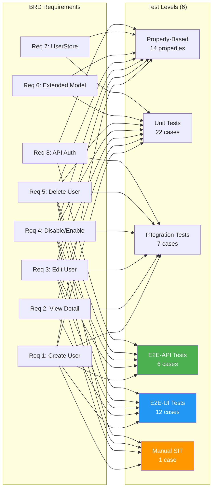
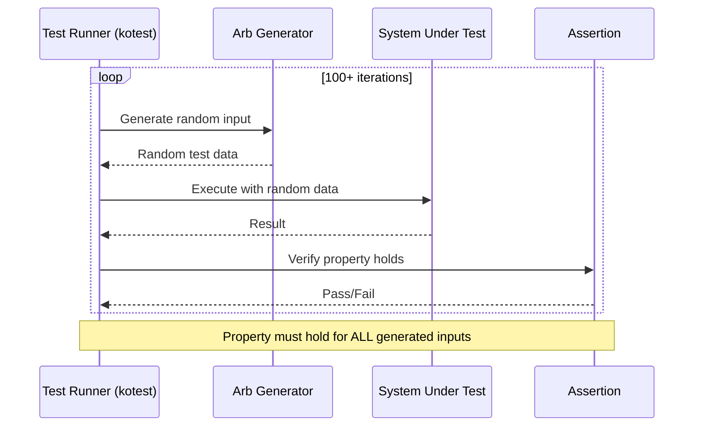
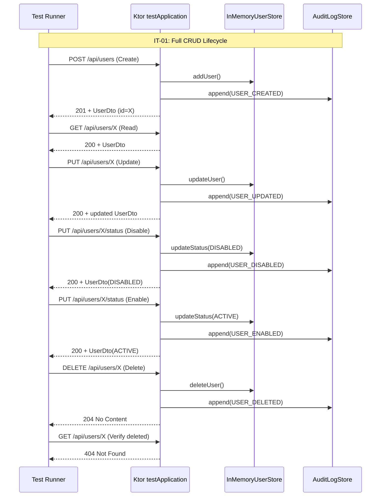
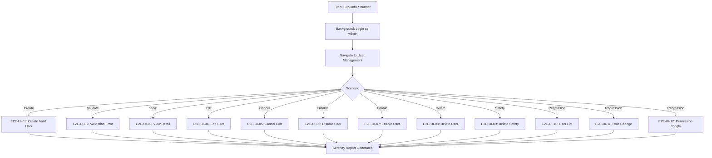

# Software Test Cases (STC)

## Collex AI Assistant — SCRUM-50: User CRUD & Profile Management

---

## Document Information

| Field | Value |
|-------|-------|
| Jira Ticket | SCRUM-50 |
| Title | User CRUD & Profile Management |
| Author | QA Agent |
| Version | 3.0 |
| Date | 2026-05-20 |
| Status | Draft |
| Related STP | documents/SCRUM-50/STP.md |
| Related BRD | documents/SCRUM-50/BRD.md |
| Related FSD | documents/SCRUM-50/FSD.md |
| Related TDD | documents/SCRUM-50/TDD.md |

---

## Revision History

| Version | Date | Author | Changes |
|---------|------|--------|---------|
| 1.0 | 2026-05-01 | QA Agent | Initiate document — detailed test cases derived from STP, BRD, FSD, and TDD |
| 2.0 | 2026-05-15 | QA Agent | Upgrade to 6 test levels — add E2E-API and E2E-UI sections; reclassify SIT cases to maximize automation |
| 3.0 | 2026-05-20 | QA Agent | Expand E2E-API from 1→6 cases (CRUD lifecycle, auth, self-deletion, status change, audit on real server); fix SIT-01 traceability to BRD Req 1-5 |

---

## 1. Introduction

### 1.1 Purpose

This document provides detailed, step-by-step test cases for the User CRUD & Profile Management feature (SCRUM-50). Each test case includes preconditions, test steps, test data, expected results, and traceability to requirements and STP references.

### 1.2 Scope

Covers all test levels defined in the STP:
- **Property-Based Tests (PBT)** — Automated correctness properties (14 properties)
- **Unit Tests (UT)** — Example-based edge case tests (22 cases)
- **Integration Tests (IT)** — Full API lifecycle tests (7 cases)
- **E2E-API Tests** — REST endpoint E2E tests on real server (6 cases)
- **E2E-UI Tests** — Browser UI E2E tests via Cucumber + Serenity (12 cases)
- **System Integration Tests (SIT)** — Manual browser-based tests for visual/UX only (1 case)

### 1.3 Test Case ID Convention

| Prefix | Level | Automation | Tools |
|--------|-------|------------|-------|
| PBT-XX | Property-Based Test | ✅ Automated | kotest-property |
| UT-XX | Unit Test | ✅ Automated | kotest |
| IT-XX | Integration Test (Ktor testApplication) | ✅ Automated | Ktor test engine |
| E2E-API-XX | REST endpoint E2E (real server) | ✅ Automated | Ktor client + JUnit 5 |
| E2E-UI-XX | Browser UI E2E (Cucumber scenarios) | ✅ Automated | Cucumber + Serenity + WebDriver |
| SIT-XX | Manual exploratory / visual only | ❌ Manual | Browser |

### 1.4 Test Coverage Overview



---

## 2. Test Data

### 2.1 Pre-seeded Users

| ID | Name | Email | Role | Status | Notes |
|----|------|-------|------|--------|-------|
| admin-001 | Admin User | admin@collex.ai | ADMINISTRATOR | ACTIVE | Pre-seeded, has MANAGE_USERS |
| user-002 | Neural User | neural@collex.ai | NEURAL_ARCHITECT | ACTIVE | Pre-seeded, no MANAGE_USERS |
| user-003 | Reader User | reader@collex.ai | READER | ACTIVE | Pre-seeded, no MANAGE_USERS |

### 2.2 Test Data for Creation

| Field | Valid Value | Invalid Value |
|-------|-----------|---------------|
| name | "John Doe" | "" (empty), "   " (whitespace only) |
| email | "john@example.com" | "notanemail", "", "john@", "@domain.com" |
| role | "NEURAL_ARCHITECT" | "SUPERADMIN", "", "invalid" |
| status | "ACTIVE" | "INVALID", "PENDING" (via API) |

### 2.3 JWT Tokens

| Token | Description | Usage |
|-------|-------------|-------|
| ADMIN_JWT | Valid JWT for admin-001 (ADMINISTRATOR + MANAGE_USERS) | All CRUD operations |
| USER_JWT | Valid JWT for user-002 (NEURAL_ARCHITECT, no MANAGE_USERS) | Forbidden access tests |
| EXPIRED_JWT | Expired JWT token | Unauthorized tests |
| INVALID_JWT | Malformed JWT string | Unauthorized tests |
| (none) | No Authorization header | Unauthorized tests |

---

## 3. Property-Based Test Cases (Automated)

### 3.1 Test Execution Flow



### PBT-01: Name Validation Rejects Empty/Whitespace

| Attribute | Value |
|-----------|-------|
| **ID** | PBT-01 |
| **Property** | P1: Name validation rejects empty and whitespace-only strings |
| **Priority** | High |
| **Type** | Automated (kotest-property) |
| **Min Iterations** | 100 |
| **File** | UserValidationPropertyTest.kt |
| **Traces To** | BRD Req 1 (AC 2), FSD BR-01 |

**Test Steps:**

| Step | Action | Expected Result |
|------|--------|-----------------|
| 1 | Generate random whitespace-only string (including empty) via `Arb.string().filter { it.isBlank() }` | String generated |
| 2 | Call `ValidationService.isValidName(input)` | Returns `false` |
| 3 | Generate random string with at least one non-whitespace char via `Arb.string(1..100).filter { it.isNotBlank() }` | String generated |
| 4 | Call `ValidationService.isValidName(input)` | Returns `true` |

---

### PBT-02: Email Validation

| Attribute | Value |
|-----------|-------|
| **ID** | PBT-02 |
| **Property** | P2: Email validation accepts valid emails and rejects invalid ones |
| **Priority** | High |
| **Type** | Automated (kotest-property) |
| **Min Iterations** | 100 |
| **File** | UserValidationPropertyTest.kt |
| **Traces To** | BRD Req 1 (AC 3), FSD BR-02 |

**Test Steps:**

| Step | Action | Expected Result |
|------|--------|-----------------|
| 1 | Generate valid email via custom `Arb` (local@domain.tld pattern) | Valid email generated |
| 2 | Call `ValidationService.isValidEmail(input)` | Returns `true` |
| 3 | Generate invalid string via `Arb.string()` (no @ or invalid format) | Invalid string generated |
| 4 | Call `ValidationService.isValidEmail(input)` | Returns `false` |

---

### PBT-03: User Serialization Round-Trip

| Attribute | Value |
|-----------|-------|
| **ID** | PBT-03 |
| **Property** | P3: Serialize → deserialize preserves all fields |
| **Priority** | High |
| **Type** | Automated (kotest-property) |
| **Min Iterations** | 100 |
| **File** | UserSerializationPropertyTest.kt |
| **Traces To** | BRD Req 6 (AC 6), TDD §5.2 |

**Test Steps:**

| Step | Action | Expected Result |
|------|--------|-----------------|
| 1 | Generate random `User` with all field combinations (random status, role, permissions, createdAt) | User instance created |
| 2 | Serialize to JSON via `Json.encodeToString(user)` | JSON string produced |
| 3 | Deserialize back via `Json.decodeFromString<User>(json)` | User instance created |
| 4 | Assert original == deserialized | All fields match exactly |

---

### PBT-04: Email Uniqueness Enforcement

| Attribute | Value |
|-----------|-------|
| **ID** | PBT-04 |
| **Property** | P4: Rejects duplicate emails in UserStore |
| **Priority** | High |
| **Type** | Automated (kotest-property) |
| **Min Iterations** | 100 |
| **File** | UserStorePropertyTest.kt |
| **Traces To** | BRD Req 1 (AC 9), BRD Req 7 (AC 7), FSD BR-04 |

**Test Steps:**

| Step | Action | Expected Result |
|------|--------|-----------------|
| 1 | Create fresh InMemoryUserStore | Empty store |
| 2 | Generate random User A | User A created |
| 3 | Add User A to store | Success |
| 4 | Generate User B with same email as User A but different ID | User B created |
| 5 | Attempt to add User B to store | Throws `IllegalArgumentException("Email already exists")` |

---

### PBT-05: UserDto Completeness

| Attribute | Value |
|-----------|-------|
| **ID** | PBT-05 |
| **Property** | P5: toDto() includes all required fields |
| **Priority** | Medium |
| **Type** | Automated (kotest-property) |
| **Min Iterations** | 100 |
| **File** | UserDtoCompletenessPropertyTest.kt |
| **Traces To** | BRD Req 6 (AC 3), FSD §4.4 |

**Test Steps:**

| Step | Action | Expected Result |
|------|--------|-----------------|
| 1 | Generate random `User` with various field values | User instance created |
| 2 | Call `user.toDto()` | UserDto produced |
| 3 | Assert `dto.id` is non-null and non-empty | Pass |
| 4 | Assert `dto.name` is non-null and non-empty | Pass |
| 5 | Assert `dto.email` is non-null and non-empty | Pass |
| 6 | Assert `dto.role` is non-null and non-empty | Pass |
| 7 | Assert `dto.status` is non-null and non-empty | Pass |
| 8 | Assert `dto.createdAt` is non-null | Pass |

---

### PBT-06: CRUD Audit Logging Completeness

| Attribute | Value |
|-----------|-------|
| **ID** | PBT-06 |
| **Property** | P6: All CRUD ops generate correct audit entries |
| **Priority** | High |
| **Type** | Automated (kotest-property) |
| **Min Iterations** | 100 |
| **File** | UserAuditPropertyTest.kt |
| **Traces To** | BRD Req 1 (AC 8), Req 3 (AC 7), Req 4 (AC 5, 8), Req 5 (AC 6) |

**Test Steps:**

| Step | Action | Expected Result |
|------|--------|-----------------|
| 1 | Generate random CreateUserRequest | Request created |
| 2 | Execute create user handler | User created |
| 3 | Check AuditLogStore last entry | Entry has action=USER_CREATED, correct actorId, targetUserId, tag=IAM_SYNC |
| 4 | Execute update user handler | User updated |
| 5 | Check AuditLogStore last entry | Entry has action=USER_UPDATED, old/new values match |
| 6 | Execute disable handler | User disabled |
| 7 | Check AuditLogStore last entry | Entry has action=USER_DISABLED, old=ACTIVE, new=DISABLED |
| 8 | Execute enable handler | User enabled |
| 9 | Check AuditLogStore last entry | Entry has action=USER_ENABLED, old=DISABLED, new=ACTIVE |
| 10 | Execute delete handler | User deleted |
| 11 | Check AuditLogStore last entry | Entry has action=USER_DELETED, old has name+email |

---

### PBT-07: UserStore Operations Succeed for Existing Users

| Attribute | Value |
|-----------|-------|
| **ID** | PBT-07 |
| **Property** | P7: CRUD returns true for existing, false for non-existent |
| **Priority** | High |
| **Type** | Automated (kotest-property) |
| **Min Iterations** | 100 |
| **File** | UserStorePropertyTest.kt |
| **Traces To** | BRD Req 7 (AC 1-6) |

**Test Steps:**

| Step | Action | Expected Result |
|------|--------|-----------------|
| 1 | Create fresh store, add random User | User added |
| 2 | Call `updateUser(user.id, newName, newEmail)` | Returns `true` |
| 3 | Call `updateStatus(user.id, DISABLED)` | Returns `true` |
| 4 | Call `deleteUser(user.id)` | Returns `true` |
| 5 | Generate random non-existent UUID | UUID generated |
| 6 | Call `updateUser(randomId, ...)` | Returns `false` |
| 7 | Call `updateStatus(randomId, ...)` | Returns `false` |
| 8 | Call `deleteUser(randomId)` | Returns `false` |

---

### PBT-08: Creation Sets ACTIVE Status and createdAt

| Attribute | Value |
|-----------|-------|
| **ID** | PBT-08 |
| **Property** | P8: New users get ACTIVE status + createdAt |
| **Priority** | High |
| **Type** | Automated (kotest-property) |
| **Min Iterations** | 100 |
| **File** | UserCreationDefaultsPropertyTest.kt |
| **Traces To** | BRD Req 6 (AC 1, 2), FSD BR-05, BR-06 |

**Test Steps:**

| Step | Action | Expected Result |
|------|--------|-----------------|
| 1 | Generate random CreateUserRequest (valid name, email, role) | Request created |
| 2 | Execute create user handler via test application | 201 response |
| 3 | Parse response body as UserDto | UserDto parsed |
| 4 | Assert `dto.status == "ACTIVE"` | Pass |
| 5 | Assert `dto.createdAt` is non-empty and valid ISO 8601 | Pass |

---

### PBT-09: Status Change Persistence

| Attribute | Value |
|-----------|-------|
| **ID** | PBT-09 |
| **Property** | P9: ACTIVE↔DISABLED round-trip works |
| **Priority** | High |
| **Type** | Automated (kotest-property) |
| **Min Iterations** | 100 |
| **File** | UserStorePropertyTest.kt |
| **Traces To** | BRD Req 4 (AC 3, 6), FSD UC-04a/b |

**Test Steps:**

| Step | Action | Expected Result |
|------|--------|-----------------|
| 1 | Create fresh store, add random User (status=ACTIVE) | User added |
| 2 | Call `updateStatus(user.id, DISABLED)` | Returns `true` |
| 3 | Call `findById(user.id)` | User has status=DISABLED |
| 4 | Call `updateStatus(user.id, ACTIVE)` | Returns `true` |
| 5 | Call `findById(user.id)` | User has status=ACTIVE (restored) |

---

### PBT-10: Delete Removes User Permanently

| Attribute | Value |
|-----------|-------|
| **ID** | PBT-10 |
| **Property** | P10: Deleted user not found by findById/getAll |
| **Priority** | High |
| **Type** | Automated (kotest-property) |
| **Min Iterations** | 100 |
| **File** | UserStorePropertyTest.kt |
| **Traces To** | BRD Req 5 (AC 4), FSD UC-05 |

**Test Steps:**

| Step | Action | Expected Result |
|------|--------|-----------------|
| 1 | Create fresh store, add random User | User added |
| 2 | Verify `findById(user.id)` returns user | User found |
| 3 | Call `deleteUser(user.id)` | Returns `true` |
| 4 | Call `findById(user.id)` | Returns `null` |
| 5 | Call `getAll()` | List does not contain deleted user |

---

### PBT-11: Disabled User Authentication Rejection

| Attribute | Value |
|-----------|-------|
| **ID** | PBT-11 |
| **Property** | P11: DISABLED users rejected at auth |
| **Priority** | High |
| **Type** | Automated (kotest-property) |
| **Min Iterations** | 100 |
| **File** | (auth integration test) |
| **Traces To** | BRD Req 4 (AC 11) |

**Test Steps:**

| Step | Action | Expected Result |
|------|--------|-----------------|
| 1 | Generate random User with status=DISABLED | User created |
| 2 | Add user to store | User persisted |
| 3 | Attempt authentication with user's credentials | Authentication rejected |
| 4 | Verify error message indicates account is disabled | Appropriate error returned |

---

### PBT-12: Unauthorized Access Rejection

| Attribute | Value |
|-----------|-------|
| **ID** | PBT-12 |
| **Property** | P12: No JWT → 401, no permission → 403 |
| **Priority** | High |
| **Type** | Automated (kotest-property) |
| **Min Iterations** | 100 |
| **File** | UserCrudIntegrationTest.kt |
| **Traces To** | BRD Req 8 (AC 6, 7) |

**Test Steps:**

| Step | Action | Expected Result |
|------|--------|-----------------|
| 1 | For each of 5 CRUD endpoints: send request without Authorization header | HTTP 401 Unauthorized |
| 2 | For each of 5 CRUD endpoints: send request with READER role JWT | HTTP 403 Forbidden |
| 3 | For each of 5 CRUD endpoints: send request with expired JWT | HTTP 401 Unauthorized |

---

### PBT-13: Non-Existent User Returns 404

| Attribute | Value |
|-----------|-------|
| **ID** | PBT-13 |
| **Property** | P13: Random UUID → 404 on GET/PUT/DELETE |
| **Priority** | Medium |
| **Type** | Automated (kotest-property) |
| **Min Iterations** | 100 |
| **File** | UserCrudRoutesTest.kt |
| **Traces To** | BRD Req 8 (AC 8) |

**Test Steps:**

| Step | Action | Expected Result |
|------|--------|-----------------|
| 1 | Generate random UUID that doesn't exist in store | UUID generated |
| 2 | Send GET `/api/users/{randomUUID}` with valid admin JWT | HTTP 404, body: `{"error": "User not found"}` |
| 3 | Send PUT `/api/users/{randomUUID}` with valid body and admin JWT | HTTP 404, body: `{"error": "User not found"}` |
| 4 | Send DELETE `/api/users/{randomUUID}` with valid admin JWT | HTTP 404, body: `{"error": "User not found"}` |

---

### PBT-14: Invalid Request Body Returns 400

| Attribute | Value |
|-----------|-------|
| **ID** | PBT-14 |
| **Property** | P14: Malformed requests → 400 |
| **Priority** | Medium |
| **Type** | Automated (kotest-property) |
| **Min Iterations** | 100 |
| **File** | UserCrudRoutesTest.kt |
| **Traces To** | BRD Req 8 (AC 9) |

**Test Steps:**

| Step | Action | Expected Result |
|------|--------|-----------------|
| 1 | Generate request with missing required fields | Request created |
| 2 | Send POST `/api/users` with malformed body | HTTP 400 with specific validation message |
| 3 | Generate request with invalid email format | Request created |
| 4 | Send POST `/api/users` with invalid email | HTTP 400, body: `{"error": "Invalid email format"}` |
| 5 | Generate request with invalid role | Request created |
| 6 | Send POST `/api/users` with invalid role | HTTP 400, body: `{"error": "Invalid role: XYZ"}` |

---

## 4. Unit Test Cases (Automated)

### 4.1 Create User Tests

#### UT-01: Create User with Valid Data

| Attribute | Value |
|-----------|-------|
| **ID** | UT-01 |
| **Priority** | High |
| **Type** | Automated (kotest) |
| **Traces To** | BRD Req 1 (AC 5, 6), FSD UC-01 |

**Preconditions:** Test application running, admin JWT available, UserStore empty

| Step | Action | Test Data | Expected Result |
|------|--------|-----------|-----------------|
| 1 | Send POST `/api/users` with valid body | `{"name":"John Doe","email":"john@example.com","role":"NEURAL_ARCHITECT"}` | HTTP 201 Created |
| 2 | Parse response body | — | UserDto with id (UUID), name="John Doe", email="john@example.com", role="NEURAL_ARCHITECT", status="ACTIVE", createdAt (non-empty ISO 8601) |
| 3 | Verify user in store | Call `findById(response.id)` | User exists with matching fields |

---

#### UT-02: Create User with Empty Name

| Attribute | Value |
|-----------|-------|
| **ID** | UT-02 |
| **Priority** | High |
| **Type** | Automated (kotest) |
| **Traces To** | BRD Req 1 (AC 2), FSD BR-01 |

**Preconditions:** Test application running, admin JWT available

| Step | Action | Test Data | Expected Result |
|------|--------|-----------|-----------------|
| 1 | Send POST `/api/users` | `{"name":"","email":"john@example.com","role":"NEURAL_ARCHITECT"}` | HTTP 400 Bad Request |
| 2 | Parse error response | — | `{"error": "Name is required"}` |

---

#### UT-03: Create User with Whitespace-Only Name

| Attribute | Value |
|-----------|-------|
| **ID** | UT-03 |
| **Priority** | High |
| **Type** | Automated (kotest) |
| **Traces To** | BRD Req 1 (AC 2), FSD BR-01 |

**Preconditions:** Test application running, admin JWT available

| Step | Action | Test Data | Expected Result |
|------|--------|-----------|-----------------|
| 1 | Send POST `/api/users` | `{"name":"   ","email":"john@example.com","role":"NEURAL_ARCHITECT"}` | HTTP 400 Bad Request |
| 2 | Parse error response | — | `{"error": "Name is required"}` |

---

#### UT-04: Create User with Invalid Email

| Attribute | Value |
|-----------|-------|
| **ID** | UT-04 |
| **Priority** | High |
| **Type** | Automated (kotest) |
| **Traces To** | BRD Req 1 (AC 3), FSD BR-02 |

**Preconditions:** Test application running, admin JWT available

| Step | Action | Test Data | Expected Result |
|------|--------|-----------|-----------------|
| 1 | Send POST `/api/users` | `{"name":"John","email":"notanemail","role":"NEURAL_ARCHITECT"}` | HTTP 400 Bad Request |
| 2 | Parse error response | — | `{"error": "Invalid email format"}` |

---

#### UT-05: Create User with Invalid Role

| Attribute | Value |
|-----------|-------|
| **ID** | UT-05 |
| **Priority** | High |
| **Type** | Automated (kotest) |
| **Traces To** | BRD Req 1 (AC 4), FSD BR-03 |

**Preconditions:** Test application running, admin JWT available

| Step | Action | Test Data | Expected Result |
|------|--------|-----------|-----------------|
| 1 | Send POST `/api/users` | `{"name":"John","email":"john@example.com","role":"SUPERADMIN"}` | HTTP 400 Bad Request |
| 2 | Parse error response | — | `{"error": "Invalid role: SUPERADMIN"}` |

---

#### UT-06: Create User with Duplicate Email

| Attribute | Value |
|-----------|-------|
| **ID** | UT-06 |
| **Priority** | High |
| **Type** | Automated (kotest) |
| **Traces To** | BRD Req 1 (AC 9), FSD BR-04 |

**Preconditions:** Test application running, admin JWT available, user with email "existing@example.com" already exists

| Step | Action | Test Data | Expected Result |
|------|--------|-----------|-----------------|
| 1 | Create first user | `{"name":"First","email":"existing@example.com","role":"READER"}` | HTTP 201 Created |
| 2 | Create second user with same email | `{"name":"Second","email":"existing@example.com","role":"READER"}` | HTTP 409 Conflict |
| 3 | Parse error response | — | `{"error": "Email already exists"}` |

---

### 4.2 View User Detail Tests

#### UT-07: Get Existing User

| Attribute | Value |
|-----------|-------|
| **ID** | UT-07 |
| **Priority** | High |
| **Type** | Automated (kotest) |
| **Traces To** | BRD Req 2 (AC 2, 3), FSD UC-02 |

**Preconditions:** User exists in store with known ID

| Step | Action | Test Data | Expected Result |
|------|--------|-----------|-----------------|
| 1 | Send GET `/api/users/{userId}` | userId = existing user's ID | HTTP 200 OK |
| 2 | Parse response body | — | Full UserDto with all fields matching stored user |

---

#### UT-08: Get Non-Existent User

| Attribute | Value |
|-----------|-------|
| **ID** | UT-08 |
| **Priority** | High |
| **Type** | Automated (kotest) |
| **Traces To** | BRD Req 8 (AC 8), FSD UC-02 EF-01 |

**Preconditions:** Test application running, admin JWT available

| Step | Action | Test Data | Expected Result |
|------|--------|-----------|-----------------|
| 1 | Send GET `/api/users/{randomUUID}` | randomUUID = "00000000-0000-0000-0000-000000000000" | HTTP 404 Not Found |
| 2 | Parse error response | — | `{"error": "User not found"}` |

---

### 4.3 Edit User Tests

#### UT-09: Update User with Valid Data

| Attribute | Value |
|-----------|-------|
| **ID** | UT-09 |
| **Priority** | High |
| **Type** | Automated (kotest) |
| **Traces To** | BRD Req 3 (AC 4, 5), FSD UC-03 |

**Preconditions:** User "John Doe" exists in store

| Step | Action | Test Data | Expected Result |
|------|--------|-----------|-----------------|
| 1 | Send PUT `/api/users/{userId}` | `{"name":"John Updated","email":"john.updated@example.com"}` | HTTP 200 OK |
| 2 | Parse response body | — | UserDto with name="John Updated", email="john.updated@example.com" |
| 3 | Verify in store | Call `findById(userId)` | User has updated name and email |

---

#### UT-10: Update User with Duplicate Email

| Attribute | Value |
|-----------|-------|
| **ID** | UT-10 |
| **Priority** | High |
| **Type** | Automated (kotest) |
| **Traces To** | BRD Req 3 (AC 8), FSD UC-03 EF-01 |

**Preconditions:** Two users exist: User A (email: a@test.com), User B (email: b@test.com)

| Step | Action | Test Data | Expected Result |
|------|--------|-----------|-----------------|
| 1 | Send PUT `/api/users/{userB.id}` | `{"name":"User B","email":"a@test.com"}` | HTTP 409 Conflict |
| 2 | Parse error response | — | `{"error": "Email already exists"}` |

---

#### UT-11: Update Non-Existent User

| Attribute | Value |
|-----------|-------|
| **ID** | UT-11 |
| **Priority** | High |
| **Type** | Automated (kotest) |
| **Traces To** | BRD Req 7 (AC 4), FSD UC-03 |

**Preconditions:** Test application running, admin JWT available

| Step | Action | Test Data | Expected Result |
|------|--------|-----------|-----------------|
| 1 | Send PUT `/api/users/{randomUUID}` | `{"name":"Test","email":"test@test.com"}` | HTTP 404 Not Found |
| 2 | Parse error response | — | `{"error": "User not found"}` |

---

### 4.4 Disable/Enable User Tests

#### UT-12: Disable Active User

| Attribute | Value |
|-----------|-------|
| **ID** | UT-12 |
| **Priority** | High |
| **Type** | Automated (kotest) |
| **Traces To** | BRD Req 4 (AC 2, 3), FSD UC-04a |

**Preconditions:** ACTIVE user exists in store

| Step | Action | Test Data | Expected Result |
|------|--------|-----------|-----------------|
| 1 | Send PUT `/api/users/{userId}/status` | `{"status":"DISABLED"}` | HTTP 200 OK |
| 2 | Parse response body | — | UserDto with status="DISABLED" |
| 3 | Verify in store | Call `findById(userId)` | User has status=DISABLED |

---

#### UT-13: Enable Disabled User

| Attribute | Value |
|-----------|-------|
| **ID** | UT-13 |
| **Priority** | High |
| **Type** | Automated (kotest) |
| **Traces To** | BRD Req 4 (AC 6, 7), FSD UC-04b |

**Preconditions:** DISABLED user exists in store

| Step | Action | Test Data | Expected Result |
|------|--------|-----------|-----------------|
| 1 | Send PUT `/api/users/{userId}/status` | `{"status":"ACTIVE"}` | HTTP 200 OK |
| 2 | Parse response body | — | UserDto with status="ACTIVE" |
| 3 | Verify in store | Call `findById(userId)` | User has status=ACTIVE |

---

#### UT-14: Invalid Status Value

| Attribute | Value |
|-----------|-------|
| **ID** | UT-14 |
| **Priority** | Medium |
| **Type** | Automated (kotest) |
| **Traces To** | BRD Req 8 (AC 9), TDD §5.4 |

**Preconditions:** User exists in store

| Step | Action | Test Data | Expected Result |
|------|--------|-----------|-----------------|
| 1 | Send PUT `/api/users/{userId}/status` | `{"status":"INVALID"}` | HTTP 400 Bad Request |
| 2 | Parse error response | — | `{"error": "Invalid status: INVALID. Valid values: ACTIVE, DISABLED"}` |

---

### 4.5 Delete User Tests

#### UT-15: Delete Existing User

| Attribute | Value |
|-----------|-------|
| **ID** | UT-15 |
| **Priority** | High |
| **Type** | Automated (kotest) |
| **Traces To** | BRD Req 5 (AC 3, 4), FSD UC-05 |

**Preconditions:** User exists in store

| Step | Action | Test Data | Expected Result |
|------|--------|-----------|-----------------|
| 1 | Send DELETE `/api/users/{userId}` | userId = existing user's ID | HTTP 204 No Content |
| 2 | Verify empty response body | — | No body |
| 3 | Verify in store | Call `findById(userId)` | Returns `null` |

---

#### UT-16: Self-Deletion Attempt

| Attribute | Value |
|-----------|-------|
| **ID** | UT-16 |
| **Priority** | High |
| **Type** | Automated (kotest) |
| **Traces To** | BRD Req 5 (AC 7), FSD §6.2 |

**Preconditions:** Admin user authenticated with JWT containing user_id = admin-001

| Step | Action | Test Data | Expected Result |
|------|--------|-----------|-----------------|
| 1 | Send DELETE `/api/users/admin-001` with admin JWT | userId = JWT's own user_id | HTTP 403 Forbidden |
| 2 | Parse error response | — | `{"error": "Cannot delete your own account"}` |
| 3 | Verify admin still exists | Call `findById(admin-001)` | Admin user still in store |

---

#### UT-17: Delete Non-Existent User

| Attribute | Value |
|-----------|-------|
| **ID** | UT-17 |
| **Priority** | High |
| **Type** | Automated (kotest) |
| **Traces To** | BRD Req 7 (AC 5), BRD Req 8 (AC 8) |

**Preconditions:** Test application running, admin JWT available

| Step | Action | Test Data | Expected Result |
|------|--------|-----------|-----------------|
| 1 | Send DELETE `/api/users/{randomUUID}` | randomUUID = non-existent ID | HTTP 404 Not Found |
| 2 | Parse error response | — | `{"error": "User not found"}` |

---

### 4.6 Backward Compatibility Tests

#### UT-18: Missing Status Field Defaults to ACTIVE

| Attribute | Value |
|-----------|-------|
| **ID** | UT-18 |
| **Priority** | Medium |
| **Type** | Automated (kotest) |
| **Traces To** | BRD Req 6 (AC 4), TDD §10.1 |

**Preconditions:** JSON string without "status" field

| Step | Action | Test Data | Expected Result |
|------|--------|-----------|-----------------|
| 1 | Deserialize JSON without status | `{"id":"x","name":"Test","email":"t@t.com","role":"READER","customPermissions":[]}` | User object created |
| 2 | Check status field | — | `status == UserStatus.ACTIVE` |

---

#### UT-19: Missing createdAt Field Defaults to Empty

| Attribute | Value |
|-----------|-------|
| **ID** | UT-19 |
| **Priority** | Medium |
| **Type** | Automated (kotest) |
| **Traces To** | BRD Req 6 (AC 5), TDD §10.1 |

**Preconditions:** JSON string without "createdAt" field

| Step | Action | Test Data | Expected Result |
|------|--------|-----------|-----------------|
| 1 | Deserialize JSON without createdAt | `{"id":"x","name":"Test","email":"t@t.com","role":"READER","status":"ACTIVE"}` | User object created |
| 2 | Check createdAt field | — | `createdAt == ""` |

---

### 4.7 UserStore Operation Tests

#### UT-20: UserStore updateUser Non-Existent

| Attribute | Value |
|-----------|-------|
| **ID** | UT-20 |
| **Priority** | Medium |
| **Type** | Automated (kotest) |
| **Traces To** | BRD Req 7 (AC 4) |

| Step | Action | Test Data | Expected Result |
|------|--------|-----------|-----------------|
| 1 | Call `userStore.updateUser("nonexistent", "name", "email@test.com")` | Non-existent ID | Returns `false` |

---

#### UT-21: UserStore deleteUser Non-Existent

| Attribute | Value |
|-----------|-------|
| **ID** | UT-21 |
| **Priority** | Medium |
| **Type** | Automated (kotest) |
| **Traces To** | BRD Req 7 (AC 5) |

| Step | Action | Test Data | Expected Result |
|------|--------|-----------|-----------------|
| 1 | Call `userStore.deleteUser("nonexistent")` | Non-existent ID | Returns `false` |

---

#### UT-22: UserStore updateStatus Non-Existent

| Attribute | Value |
|-----------|-------|
| **ID** | UT-22 |
| **Priority** | Medium |
| **Type** | Automated (kotest) |
| **Traces To** | BRD Req 7 (AC 6) |

| Step | Action | Test Data | Expected Result |
|------|--------|-----------|-----------------|
| 1 | Call `userStore.updateStatus("nonexistent", UserStatus.DISABLED)` | Non-existent ID | Returns `false` |

---

## 5. Integration Test Cases (Automated)


### 5.1 Full CRUD Lifecycle Flow



#### IT-01: Full CRUD Lifecycle

| Attribute | Value |
|-----------|-------|
| **ID** | IT-01 |
| **Priority** | High |
| **Type** | Automated (Ktor testApplication) |
| **Traces To** | All BRD Requirements, FSD UC-01 through UC-05 |

**Preconditions:** Ktor test application configured with InMemoryUserStore and admin JWT

| Step | Action | Test Data | Expected Result |
|------|--------|-----------|-----------------|
| 1 | POST `/api/users` | `{"name":"Lifecycle User","email":"lifecycle@test.com","role":"READER"}` | 201 Created, UserDto returned with id |
| 2 | GET `/api/users/{id}` | id from step 1 | 200 OK, UserDto matches created data |
| 3 | PUT `/api/users/{id}` | `{"name":"Updated Name","email":"updated@test.com"}` | 200 OK, UserDto with updated fields |
| 4 | GET `/api/users/{id}` | id from step 1 | 200 OK, name="Updated Name", email="updated@test.com" |
| 5 | PUT `/api/users/{id}/status` | `{"status":"DISABLED"}` | 200 OK, UserDto with status="DISABLED" |
| 6 | PUT `/api/users/{id}/status` | `{"status":"ACTIVE"}` | 200 OK, UserDto with status="ACTIVE" |
| 7 | DELETE `/api/users/{id}` | id from step 1 | 204 No Content |
| 8 | GET `/api/users/{id}` | id from step 1 | 404 Not Found |

---

#### IT-02: Unauthorized Access (No JWT)

| Attribute | Value |
|-----------|-------|
| **ID** | IT-02 |
| **Priority** | High |
| **Type** | Automated (Ktor testApplication) |
| **Traces To** | BRD Req 8 (AC 6) |

**Preconditions:** Ktor test application running, NO Authorization header

| Step | Action | Test Data | Expected Result |
|------|--------|-----------|-----------------|
| 1 | POST `/api/users` without JWT | Valid body, no auth header | 401 Unauthorized |
| 2 | GET `/api/users/{id}` without JWT | Any id, no auth header | 401 Unauthorized |
| 3 | PUT `/api/users/{id}` without JWT | Valid body, no auth header | 401 Unauthorized |
| 4 | PUT `/api/users/{id}/status` without JWT | Valid body, no auth header | 401 Unauthorized |
| 5 | DELETE `/api/users/{id}` without JWT | Any id, no auth header | 401 Unauthorized |

---

#### IT-03: Forbidden Access (No Permission)

| Attribute | Value |
|-----------|-------|
| **ID** | IT-03 |
| **Priority** | High |
| **Type** | Automated (Ktor testApplication) |
| **Traces To** | BRD Req 8 (AC 7) |

**Preconditions:** JWT for READER role user (no MANAGE_USERS permission)

| Step | Action | Test Data | Expected Result |
|------|--------|-----------|-----------------|
| 1 | POST `/api/users` with READER JWT | Valid body, READER auth | 403 Forbidden |
| 2 | GET `/api/users/{id}` with READER JWT | Any id, READER auth | 403 Forbidden |
| 3 | PUT `/api/users/{id}` with READER JWT | Valid body, READER auth | 403 Forbidden |
| 4 | PUT `/api/users/{id}/status` with READER JWT | Valid body, READER auth | 403 Forbidden |
| 5 | DELETE `/api/users/{id}` with READER JWT | Any id, READER auth | 403 Forbidden |

---

#### IT-04: Create + Audit Log Verification

| Attribute | Value |
|-----------|-------|
| **ID** | IT-04 |
| **Priority** | High |
| **Type** | Automated (Ktor testApplication) |
| **Traces To** | BRD Req 1 (AC 8), FSD §5.1 |

**Preconditions:** Ktor test application with AuditLogStore accessible

| Step | Action | Test Data | Expected Result |
|------|--------|-----------|-----------------|
| 1 | POST `/api/users` | `{"name":"Audit Test","email":"audit@test.com","role":"READER"}` | 201 Created |
| 2 | Query AuditLogStore for last entry | — | Entry with action="USER_CREATED", tag="IAM_SYNC" |
| 3 | Verify entry fields | — | actorId matches JWT user, targetUserId matches created user, newValue contains "role=READER" |

---

#### IT-05: Update + Audit Log Verification

| Attribute | Value |
|-----------|-------|
| **ID** | IT-05 |
| **Priority** | High |
| **Type** | Automated (Ktor testApplication) |
| **Traces To** | BRD Req 3 (AC 7), FSD §5.1 |

**Preconditions:** User "Old Name" with email "old@test.com" exists

| Step | Action | Test Data | Expected Result |
|------|--------|-----------|-----------------|
| 1 | PUT `/api/users/{id}` | `{"name":"New Name","email":"new@test.com"}` | 200 OK |
| 2 | Query AuditLogStore for last entry | — | Entry with action="USER_UPDATED" |
| 3 | Verify old/new values | — | oldValue="name=Old Name, email=old@test.com", newValue="name=New Name, email=new@test.com" |

---

#### IT-06: Disable + Audit Log Verification

| Attribute | Value |
|-----------|-------|
| **ID** | IT-06 |
| **Priority** | High |
| **Type** | Automated (Ktor testApplication) |
| **Traces To** | BRD Req 4 (AC 5), FSD §5.1 |

**Preconditions:** ACTIVE user exists

| Step | Action | Test Data | Expected Result |
|------|--------|-----------|-----------------|
| 1 | PUT `/api/users/{id}/status` | `{"status":"DISABLED"}` | 200 OK |
| 2 | Query AuditLogStore for last entry | — | Entry with action="USER_DISABLED" |
| 3 | Verify old/new values | — | oldValue="ACTIVE", newValue="DISABLED" |

---

#### IT-07: Delete + Audit Log Verification

| Attribute | Value |
|-----------|-------|
| **ID** | IT-07 |
| **Priority** | High |
| **Type** | Automated (Ktor testApplication) |

**Preconditions:** User "Delete Me" with email "delete@test.com" exists

| Step | Action | Test Data | Expected Result |
|------|--------|-----------|-----------------|
| 1 | DELETE `/api/users/{id}` | userId of "Delete Me" | 204 No Content |
| 2 | Query AuditLogStore for last entry | — | Entry with action="USER_DELETED" |
| 3 | Verify old value | — | oldValue="name=Delete Me, email=delete@test.com" |

---

## 6. E2E-API Test Cases (Automated — Ktor client + JUnit 5)

### 6.1 Overview

E2E-API tests verify REST endpoints against a **real running server** (not Ktor testApplication). These cover API-level scenarios where a browser is not needed.

**Key difference from IT (Integration Tests):**
- **IT** runs inside Ktor `testApplication` — an in-process test engine. Fast, but does not exercise real HTTP networking, server startup, or middleware pipeline exactly as production.
- **E2E-API** runs against a **real server process** (e.g., `./gradlew :server:jvmRun`). Uses Ktor HTTP client over real TCP connections. This catches issues that only surface with real networking: serialization over the wire, CORS, actual JWT validation, real middleware ordering, and server startup configuration.

**File:** `e2e-tests/src/test/kotlin/com/assistant/e2e/api/UserCrudApiTest.kt`

---

#### E2E-API-01: Duplicate Email Rejection on Real Server

| Attribute | Value |
|-----------|-------|
| **ID** | E2E-API-01 |
| **Priority** | High |
| **Type** | Automated (Ktor client + JUnit 5) |
| **File** | e2e-tests/src/test/kotlin/com/assistant/e2e/api/UserCrudApiTest.kt |
| **Traces To** | BRD Req 1 (AC 9), FSD UC-01 EF-01, BR-04 |

**Preconditions:** Server running, admin JWT available, user with email "admin@collex.ai" pre-seeded

| Step | Action | Test Data | Expected Result |
|------|--------|-----------|-----------------|
| 1 | POST `/api/users` with admin JWT | `{"name":"Duplicate Test","email":"admin@collex.ai","role":"READER"}` | HTTP 409 Conflict |
| 2 | Parse error response body | — | `{"error": "Email already exists"}` |
| 3 | Verify no user was created | GET `/api/users` and count | User count unchanged |

---

#### E2E-API-02: Full CRUD Lifecycle on Real Server

| Attribute | Value |
|-----------|-------|
| **ID** | E2E-API-02 |
| **Priority** | High |
| **Type** | Automated (Ktor client + JUnit 5) |
| **File** | e2e-tests/src/test/kotlin/com/assistant/e2e/api/UserCrudApiTest.kt |
| **Traces To** | BRD Req 1 (AC 5, 6), Req 2 (AC 2), Req 3 (AC 4, 5), Req 4 (AC 3, 7), Req 5 (AC 4), FSD UC-01 through UC-05 |

**Preconditions:** Server running, admin JWT available

| Step | Action | Test Data | Expected Result |
|------|--------|-----------|-----------------|
| 1 | POST `/api/users` with admin JWT | `{"name":"E2E Lifecycle","email":"e2e-lifecycle@test.com","role":"READER"}` | HTTP 201 Created, UserDto with id, status="ACTIVE", createdAt non-empty |
| 2 | GET `/api/users/{id}` with admin JWT | id from step 1 | HTTP 200 OK, UserDto matches created data |
| 3 | PUT `/api/users/{id}` with admin JWT | `{"name":"E2E Updated","email":"e2e-updated@test.com"}` | HTTP 200 OK, UserDto with updated name and email |
| 4 | GET `/api/users/{id}` with admin JWT | id from step 1 | HTTP 200 OK, name="E2E Updated", email="e2e-updated@test.com" |
| 5 | PUT `/api/users/{id}/status` with admin JWT | `{"status":"DISABLED"}` | HTTP 200 OK, UserDto with status="DISABLED" |
| 6 | PUT `/api/users/{id}/status` with admin JWT | `{"status":"ACTIVE"}` | HTTP 200 OK, UserDto with status="ACTIVE" |
| 7 | DELETE `/api/users/{id}` with admin JWT | id from step 1 | HTTP 204 No Content |
| 8 | GET `/api/users/{id}` with admin JWT | id from step 1 | HTTP 404 Not Found |

**Postconditions:** User permanently removed, no residual data

---

#### E2E-API-03: RBAC/Auth Checks on Real Server (401 and 403)

| Attribute | Value |
|-----------|-------|
| **ID** | E2E-API-03 |
| **Priority** | High |
| **Type** | Automated (Ktor client + JUnit 5) |
| **File** | e2e-tests/src/test/kotlin/com/assistant/e2e/api/UserCrudApiTest.kt |
| **Traces To** | BRD Req 8 (AC 6, 7), FSD §7.1 |

**Preconditions:** Server running, READER JWT available (no MANAGE_USERS), pre-seeded user exists

| Step | Action | Test Data | Expected Result |
|------|--------|-----------|-----------------|
| 1 | POST `/api/users` **without** Authorization header | Valid body | HTTP 401 Unauthorized |
| 2 | GET `/api/users/{id}` **without** Authorization header | Pre-seeded user id | HTTP 401 Unauthorized |
| 3 | PUT `/api/users/{id}` **without** Authorization header | Valid body | HTTP 401 Unauthorized |
| 4 | PUT `/api/users/{id}/status` **without** Authorization header | `{"status":"DISABLED"}` | HTTP 401 Unauthorized |
| 5 | DELETE `/api/users/{id}` **without** Authorization header | Pre-seeded user id | HTTP 401 Unauthorized |
| 6 | POST `/api/users` with **READER** JWT | Valid body | HTTP 403 Forbidden |
| 7 | GET `/api/users/{id}` with **READER** JWT | Pre-seeded user id | HTTP 403 Forbidden |
| 8 | PUT `/api/users/{id}` with **READER** JWT | Valid body | HTTP 403 Forbidden |
| 9 | PUT `/api/users/{id}/status` with **READER** JWT | `{"status":"DISABLED"}` | HTTP 403 Forbidden |
| 10 | DELETE `/api/users/{id}` with **READER** JWT | Pre-seeded user id | HTTP 403 Forbidden |

**Postconditions:** No data modified, all requests rejected

---

#### E2E-API-04: Self-Deletion Prevention on Real Server

| Attribute | Value |
|-----------|-------|
| **ID** | E2E-API-04 |
| **Priority** | High |
| **Type** | Automated (Ktor client + JUnit 5) |
| **File** | e2e-tests/src/test/kotlin/com/assistant/e2e/api/UserCrudApiTest.kt |
| **Traces To** | BRD Req 5 (AC 7), FSD §6.2 |

**Preconditions:** Server running, admin JWT available (admin-001)

| Step | Action | Test Data | Expected Result |
|------|--------|-----------|-----------------|
| 1 | DELETE `/api/users/admin-001` with admin JWT | userId = JWT's own user_id (admin-001) | HTTP 403 Forbidden |
| 2 | Parse error response body | — | `{"error": "Cannot delete your own account"}` |
| 3 | GET `/api/users/admin-001` with admin JWT | — | HTTP 200 OK — admin still exists |

**Postconditions:** Admin user unchanged, self-deletion blocked

---

#### E2E-API-05: Status Change API on Real Server

| Attribute | Value |
|-----------|-------|
| **ID** | E2E-API-05 |
| **Priority** | High |
| **Type** | Automated (Ktor client + JUnit 5) |
| **File** | e2e-tests/src/test/kotlin/com/assistant/e2e/api/UserCrudApiTest.kt |
| **Traces To** | BRD Req 4 (AC 3, 7), FSD UC-04a, UC-04b, §3.4.3 |

**Preconditions:** Server running, admin JWT available, test user created

| Step | Action | Test Data | Expected Result |
|------|--------|-----------|-----------------|
| 1 | POST `/api/users` to create test user | `{"name":"Status Test","email":"status-e2e@test.com","role":"READER"}` | HTTP 201, status="ACTIVE" |
| 2 | PUT `/api/users/{id}/status` — disable | `{"status":"DISABLED"}` | HTTP 200, UserDto with status="DISABLED" |
| 3 | GET `/api/users/{id}` — verify persisted | — | HTTP 200, status="DISABLED" |
| 4 | PUT `/api/users/{id}/status` — re-enable | `{"status":"ACTIVE"}` | HTTP 200, UserDto with status="ACTIVE" |
| 5 | GET `/api/users/{id}` — verify persisted | — | HTTP 200, status="ACTIVE" |
| 6 | PUT `/api/users/{id}/status` — invalid status | `{"status":"INVALID"}` | HTTP 400, `{"error": "Invalid status: INVALID. Valid values: ACTIVE, DISABLED"}` |
| 7 | DELETE `/api/users/{id}` — cleanup | — | HTTP 204 No Content |

**Postconditions:** Test user cleaned up

---

#### E2E-API-06: Audit Log Verification on Real Server

| Attribute | Value |
|-----------|-------|
| **ID** | E2E-API-06 |
| **Priority** | Medium |
| **Type** | Automated (Ktor client + JUnit 5) |
| **File** | e2e-tests/src/test/kotlin/com/assistant/e2e/api/UserCrudApiTest.kt |
| **Traces To** | BRD Req 1 (AC 8), Req 3 (AC 7), Req 4 (AC 5, 8), Req 5 (AC 6), FSD §5.1 |

**Preconditions:** Server running, admin JWT available, audit log API accessible (if exposed)

| Step | Action | Test Data | Expected Result |
|------|--------|-----------|-----------------|
| 1 | POST `/api/users` — create user | `{"name":"Audit E2E","email":"audit-e2e@test.com","role":"READER"}` | HTTP 201 Created |
| 2 | Query audit log for USER_CREATED entry | Filter by target user id | Entry exists with action=USER_CREATED, tag=IAM_SYNC |
| 3 | PUT `/api/users/{id}` — update user | `{"name":"Audit Updated","email":"audit-updated@test.com"}` | HTTP 200 OK |
| 4 | Query audit log for USER_UPDATED entry | Filter by target user id | Entry exists with old/new values |
| 5 | PUT `/api/users/{id}/status` — disable | `{"status":"DISABLED"}` | HTTP 200 OK |
| 6 | Query audit log for USER_DISABLED entry | Filter by target user id | Entry exists with old=ACTIVE, new=DISABLED |
| 7 | DELETE `/api/users/{id}` — delete | — | HTTP 204 No Content |
| 8 | Query audit log for USER_DELETED entry | Filter by target user id | Entry exists with old name+email |

**Postconditions:** All 4 audit entries verified on real server

---

## 7. E2E-UI Test Cases (Automated — Cucumber + Serenity + WebDriver)

### 7.1 Overview

E2E-UI tests verify browser-based user interactions using Cucumber BDD scenarios. These replace the majority of former manual SIT cases.

**Feature File:** `e2e-tests/src/test/resources/features/user-management/016-UserCrud.feature`
**Steps File:** `e2e-tests/src/test/kotlin/com/assistant/e2e/steps/UserCrudSteps.kt`
**Runner:** `e2e-tests/src/test/kotlin/com/assistant/e2e/runners/UiUserCrudRunner.kt`

### 7.2 Reclassification from SIT

| Former SIT ID | New ID | Rationale |
|---------------|--------|-----------|
| SIT-01 | E2E-UI-01 | Deterministic CRUD, easy to automate |
| SIT-02 | E2E-UI-02 | Input/output clearly defined |
| SIT-03 | E2E-API-01 | API-level check sufficient |
| SIT-04 | E2E-UI-03 | Click + verify panel content |
| SIT-05 | E2E-UI-04 | Click + type + verify update |
| SIT-06 | E2E-UI-05 | Click + verify revert |
| SIT-07 | E2E-UI-06 | Click + verify badge change |
| SIT-08 | E2E-UI-07 | Click + verify badge change |
| SIT-09 | E2E-UI-08 | Click + type name + verify removal |
| SIT-10 | E2E-UI-09 | Click + verify button state |
| SIT-11 | SIT-01 (manual) | Visual timing hard to automate |
| SIT-12 | E2E-UI-10 | Automate for fast regression |
| SIT-13 | E2E-UI-11 | Automate for fast regression |
| SIT-14 | E2E-UI-12 | Automate for fast regression |

### 7.3 Test Execution Flow



---

#### E2E-UI-01: Create User via Form

| Attribute | Value |
|-----------|-------|
| **ID** | E2E-UI-01 |
| **Priority** | High |
| **Type** | Automated (Cucumber + Serenity) |
| **Feature File** | e2e-tests/src/test/resources/features/user-management/016-UserCrud.feature |
| **Steps File** | e2e-tests/src/test/kotlin/com/assistant/e2e/steps/UserCrudSteps.kt |
| **Scenario** | Create user with valid data |
| **Traces To** | BRD Req 1 (AC 1, 5, 6, 7), FSD UC-01 |

**Gherkin:**

```gherkin
@ui @req-1.1
Scenario: Create user with valid data
  Given the admin is on the User Management page
  When the admin clicks the "Add User" button
  And the admin fills in name "Test User E2E" and email "e2e-test@example.com"
  And the admin selects role "NEURAL_ARCHITECT"
  And the admin clicks the "Create" button
  Then the creation form should close
  And the user "Test User E2E" should appear in the User Directory
  And the user should have role "NEURAL_ARCHITECT" and status "ACTIVE"
```

**Preconditions:** Logged in as Admin, User Management page displayed

| Step | Action | Expected Result |
|------|--------|-----------------|
| 1 | Click "Add User" button | Creation form overlay appears |
| 2 | Enter name: "Test User E2E" | Name field populated |
| 3 | Enter email: "e2e-test@example.com" | Email field populated |
| 4 | Select role: "NEURAL_ARCHITECT" | Role selected |
| 5 | Click "Create" button | Form closes, user appears in list |
| 6 | Verify user in User Directory | "Test User E2E" visible with correct role and ACTIVE status |

---

#### E2E-UI-02: Create User Validation Error

| Attribute | Value |
|-----------|-------|
| **ID** | E2E-UI-02 |
| **Priority** | High |
| **Type** | Automated (Cucumber + Serenity) |
| **Feature File** | e2e-tests/src/test/resources/features/user-management/016-UserCrud.feature |
| **Steps File** | e2e-tests/src/test/kotlin/com/assistant/e2e/steps/UserCrudSteps.kt |
| **Scenario** | Form validation rejects empty name and invalid email |
| **Traces To** | BRD Req 1 (AC 2, 3, 10), FSD UC-01 AF-02 |

**Gherkin:**

```gherkin
@ui @req-1.2
Scenario: Form validation rejects empty name
  Given the admin has opened the "Add User" form
  When the admin leaves the name field empty
  And the admin enters email "valid@test.com"
  And the admin clicks the "Create" button
  Then an error message "Name is required" should be displayed

@ui @req-1.3
Scenario: Form validation rejects invalid email
  Given the admin has opened the "Add User" form
  When the admin enters name "Valid Name"
  And the admin enters email "notanemail"
  And the admin clicks the "Create" button
  Then an error message containing "Invalid email" should be displayed
  And the form should retain the entered values
```

---

#### E2E-UI-03: View User Detail

| Attribute | Value |
|-----------|-------|
| **ID** | E2E-UI-03 |
| **Priority** | High |
| **Type** | Automated (Cucumber + Serenity) |
| **Feature File** | e2e-tests/src/test/resources/features/user-management/016-UserCrud.feature |
| **Steps File** | e2e-tests/src/test/kotlin/com/assistant/e2e/steps/UserCrudSteps.kt |
| **Scenario** | View user detail panel |
| **Traces To** | BRD Req 2 (AC 1, 3, 7), FSD UC-02 |

**Gherkin:**

```gherkin
@ui @req-2.1
Scenario: View user detail panel
  Given the User Directory contains at least one user
  When the admin clicks on a user row
  Then the Detail Panel should display the user's name
  And the Detail Panel should display the user's email
  And the Detail Panel should display the user's role
  And the Detail Panel should display a status badge
  And the Detail Panel should show Edit, Disable, and Delete buttons
```

---

#### E2E-UI-04: Edit User

| Attribute | Value |
|-----------|-------|
| **ID** | E2E-UI-04 |
| **Priority** | High |
| **Type** | Automated (Cucumber + Serenity) |
| **Feature File** | e2e-tests/src/test/resources/features/user-management/016-UserCrud.feature |
| **Steps File** | e2e-tests/src/test/kotlin/com/assistant/e2e/steps/UserCrudSteps.kt |
| **Scenario** | Edit user name successfully |
| **Traces To** | BRD Req 3 (AC 1, 4, 6), FSD UC-03 |

**Gherkin:**

```gherkin
@ui @req-3.1
Scenario: Edit user name successfully
  Given the admin has opened the Detail Panel for a user
  When the admin clicks the "Edit" button
  And the admin changes the name to "Edited Name E2E"
  And the admin clicks the "Save" button
  Then the Detail Panel should show name "Edited Name E2E"
  And the User Directory should show "Edited Name E2E" for that user
```

---

#### E2E-UI-05: Cancel Edit

| Attribute | Value |
|-----------|-------|
| **ID** | E2E-UI-05 |
| **Priority** | High |
| **Type** | Automated (Cucumber + Serenity) |
| **Feature File** | e2e-tests/src/test/resources/features/user-management/016-UserCrud.feature |
| **Steps File** | e2e-tests/src/test/kotlin/com/assistant/e2e/steps/UserCrudSteps.kt |
| **Scenario** | Cancel edit reverts to original values |
| **Traces To** | BRD Req 3 (AC 9), FSD UC-03 AF-01 |

**Gherkin:**

```gherkin
@ui @req-3.9
Scenario: Cancel edit reverts to original values
  Given the admin has opened the Detail Panel for a user with name "Original Name"
  When the admin clicks the "Edit" button
  And the admin changes the name to "Should Not Save"
  And the admin clicks the "Cancel" button
  Then the Detail Panel should show name "Original Name"
```

---

#### E2E-UI-06: Disable User

| Attribute | Value |
|-----------|-------|
| **ID** | E2E-UI-06 |
| **Priority** | High |
| **Type** | Automated (Cucumber + Serenity) |
| **Feature File** | e2e-tests/src/test/resources/features/user-management/016-UserCrud.feature |
| **Steps File** | e2e-tests/src/test/kotlin/com/assistant/e2e/steps/UserCrudSteps.kt |
| **Scenario** | Disable an active user |
| **Traces To** | BRD Req 4 (AC 1, 2, 4), FSD UC-04a |

**Gherkin:**

```gherkin
@ui @req-4.1
Scenario: Disable an active user
  Given the admin has opened the Detail Panel for an ACTIVE user
  When the admin clicks the "Disable" button
  And the confirmation dialog appears
  And the admin clicks "Confirm"
  Then the user's status badge should show "DISABLED"
  And the user row in the directory should appear grayed out
  And the "Enable" button should be visible instead of "Disable"
```

---

#### E2E-UI-07: Enable User

| Attribute | Value |
|-----------|-------|
| **ID** | E2E-UI-07 |
| **Priority** | High |
| **Type** | Automated (Cucumber + Serenity) |
| **Feature File** | e2e-tests/src/test/resources/features/user-management/016-UserCrud.feature |
| **Steps File** | e2e-tests/src/test/kotlin/com/assistant/e2e/steps/UserCrudSteps.kt |
| **Scenario** | Enable a disabled user |
| **Traces To** | BRD Req 4 (AC 6, 7), FSD UC-04b |

**Gherkin:**

```gherkin
@ui @req-4.6
Scenario: Enable a disabled user
  Given the admin has opened the Detail Panel for a DISABLED user
  When the admin clicks the "Enable" button
  Then no confirmation dialog should appear
  And the user's status badge should show "ACTIVE"
  And the user row should return to normal appearance
  And the "Disable" button should be visible instead of "Enable"
```

---

#### E2E-UI-08: Delete User

| Attribute | Value |
|-----------|-------|
| **ID** | E2E-UI-08 |
| **Priority** | High |
| **Type** | Automated (Cucumber + Serenity) |
| **Feature File** | e2e-tests/src/test/resources/features/user-management/016-UserCrud.feature |
| **Steps File** | e2e-tests/src/test/kotlin/com/assistant/e2e/steps/UserCrudSteps.kt |
| **Scenario** | Delete user with name confirmation |
| **Traces To** | BRD Req 5 (AC 1, 2, 3, 5, 10), FSD UC-05 |

**Gherkin:**

```gherkin
@ui @req-5.1
Scenario: Delete user with name confirmation
  Given the admin has opened the Detail Panel for user "Delete Target"
  When the admin clicks the "Delete" button
  Then a confirmation dialog should appear with warning text
  When the admin types the user's name "Delete Target"
  And the admin clicks "Confirm"
  Then the user "Delete Target" should be removed from the User Directory
  And the Detail Panel should close
```

---

#### E2E-UI-09: Delete Confirmation Safety

| Attribute | Value |
|-----------|-------|
| **ID** | E2E-UI-09 |
| **Priority** | High |
| **Type** | Automated (Cucumber + Serenity) |
| **Feature File** | e2e-tests/src/test/resources/features/user-management/016-UserCrud.feature |
| **Steps File** | e2e-tests/src/test/kotlin/com/assistant/e2e/steps/UserCrudSteps.kt |
| **Scenario** | Delete confirm button disabled with wrong name |
| **Traces To** | BRD Req 5 (AC 2), FSD UC-05 |

**Gherkin:**

```gherkin
@ui @req-5.2
Scenario: Delete confirm button disabled with wrong name
  Given the admin has opened the delete confirmation dialog for user "John Doe"
  When the admin types "Wrong Name" in the confirmation input
  Then the "Confirm" button should be disabled
  When the admin clears the input and types "John Doe"
  Then the "Confirm" button should be enabled
```

---

#### E2E-UI-10: Regression — User List Display

| Attribute | Value |
|-----------|-------|
| **ID** | E2E-UI-10 |
| **Priority** | High |
| **Type** | Automated (Cucumber + Serenity) |
| **Feature File** | e2e-tests/src/test/resources/features/user-management/016-UserCrud.feature |
| **Steps File** | e2e-tests/src/test/kotlin/com/assistant/e2e/steps/UserCrudSteps.kt |
| **Scenario** | User list displays correctly |
| **Traces To** | Regression |

**Gherkin:**

```gherkin
@ui @regression
Scenario: User list displays correctly after CRUD changes
  Given the admin navigates to the User Management page
  Then the User Directory should display pre-seeded users
  And each user row should show avatar, name, email, and role
  And the browser console should have no JavaScript errors
```

---

#### E2E-UI-11: Regression — Role Change

| Attribute | Value |
|-----------|-------|
| **ID** | E2E-UI-11 |
| **Priority** | High |
| **Type** | Automated (Cucumber + Serenity) |
| **Feature File** | e2e-tests/src/test/resources/features/user-management/016-UserCrud.feature |
| **Steps File** | e2e-tests/src/test/kotlin/com/assistant/e2e/steps/UserCrudSteps.kt |
| **Scenario** | Existing role change still works |
| **Traces To** | Regression (existing functionality) |

**Gherkin:**

```gherkin
@ui @regression
Scenario: Existing role change still works
  Given the admin selects a user in the User Directory
  When the admin changes the user's role via the role dropdown
  Then the role should be updated successfully
  And the change should persist after page refresh
```

---

#### E2E-UI-12: Regression — Permission Toggle

| Attribute | Value |
|-----------|-------|
| **ID** | E2E-UI-12 |
| **Priority** | High |
| **Type** | Automated (Cucumber + Serenity) |
| **Feature File** | e2e-tests/src/test/resources/features/user-management/016-UserCrud.feature |
| **Steps File** | e2e-tests/src/test/kotlin/com/assistant/e2e/steps/UserCrudSteps.kt |
| **Scenario** | Existing permission toggle still works |
| **Traces To** | Regression (existing functionality) |

**Gherkin:**

```gherkin
@ui @regression
Scenario: Existing permission toggle still works
  Given the admin selects a user in the User Directory
  When the admin toggles one of the hardcoded permissions
  Then the permission state should change
  And the change should persist after page refresh
```

---

## 8. Manual SIT Test Cases (Browser — Visual/UX Only)

### 8.1 Overview

Only tests that require human visual judgment remain as manual SIT. All deterministic, automatable scenarios have been promoted to E2E-API or E2E-UI.

### 8.2 Test Environment

| Attribute | Value |
|-----------|-------|
| **URL** | http://localhost:3000 |
| **Browser** | Chrome 90+ |
| **Login** | Admin user with MANAGE_USERS permission |
| **Database** | InMemoryUserStore (reset on server restart) |

---

#### SIT-01: Blocking Overlay Timing and Visual Behavior

| Attribute | Value |
|-----------|-------|
| **ID** | SIT-01 |
| **Priority** | Medium |
| **Type** | Manual (Browser) |
| **Traces To** | BRD Req 1 (AC 11), Req 3 (AC 10), Req 4 (AC 9), Req 5 (AC 8), FSD §8 |

**Preconditions:** Logged in as Admin

| Step | Action | Expected Result | Pass/Fail |
|------|--------|-----------------|-----------|
| 1 | Perform a create user operation | Blocking overlay appears with "Creating user..." message | ☐ |
| 2 | While overlay is shown, try clicking other buttons | Clicks are blocked by overlay — no duplicate submissions | ☐ |
| 3 | Wait for operation to complete | Overlay disappears smoothly | ☐ |
| 4 | Perform an edit operation | Blocking overlay appears with "Saving changes..." message | ☐ |
| 5 | Perform a disable operation | Blocking overlay appears with "Updating status..." message | ☐ |
| 6 | Perform a delete operation | Blocking overlay appears with "Deleting user..." message | ☐ |
| 7 | Verify overlay visual quality | Overlay covers full screen, semi-transparent, centered text, no layout shift | ☐ |

**Postconditions:** All operations completed, no duplicate submissions occurred
| 1 | Leave name field empty | — | ☐ |


---

## 9. Traceability Matrix

| Requirement | PBT | UT | IT | E2E-API | E2E-UI | SIT |
|-------------|-----|----|----|---------|--------|-----|
| Req 1: Create User | PBT-01,02,04,06,08 | UT-01 to UT-06 | IT-01,IT-04 | E2E-API-01,E2E-API-02,E2E-API-06 | E2E-UI-01,E2E-UI-02 | SIT-01 |
| Req 2: View Detail | — | UT-07,UT-08 | IT-01 | E2E-API-02 | E2E-UI-03 | — |
| Req 3: Edit User | PBT-01,02,04,06 | UT-09,UT-10,UT-11 | IT-01,IT-05 | E2E-API-02,E2E-API-06 | E2E-UI-04,E2E-UI-05 | SIT-01 |
| Req 4: Disable/Enable | PBT-09,PBT-11 | UT-12,UT-13,UT-14 | IT-01,IT-06 | E2E-API-02,E2E-API-05,E2E-API-06 | E2E-UI-06,E2E-UI-07 | SIT-01 |
| Req 5: Delete User | PBT-10 | UT-15,UT-16,UT-17 | IT-01,IT-07 | E2E-API-02,E2E-API-04,E2E-API-06 | E2E-UI-08,E2E-UI-09 | SIT-01 |
| Req 6: Extended Model | PBT-03,PBT-05,PBT-08 | UT-18,UT-19 | — | — | — | — |
| Req 7: UserStore | PBT-04,PBT-07,PBT-09,PBT-10 | UT-20,UT-21,UT-22 | — | — | — | — |
| Req 8: API Auth | PBT-12,PBT-13,PBT-14 | — | IT-02,IT-03 | E2E-API-03 | — | — |
| Non-functional: Overlay | — | — | — | — | — | SIT-01 |
| Regression | — | — | — | — | E2E-UI-10,E2E-UI-11,E2E-UI-12 | — |

---

## 10. Test Summary

| Level | Total Cases | High Priority | Medium Priority | Automated | Manual |
|-------|-------------|---------------|-----------------|-----------|--------|
| Property-Based (PBT) | 14 | 12 | 2 | 14 | 0 |
| Unit (UT) | 22 | 17 | 5 | 22 | 0 |
| Integration (IT) | 7 | 7 | 0 | 7 | 0 |
| E2E-API | 6 | 5 | 1 | 6 | 0 |
| E2E-UI | 12 | 11 | 1 | 12 | 0 |
| Manual SIT | 1 | 0 | 1 | 0 | 1 |
| **Total** | **62** | **52** | **10** | **61 (98%)** | **1 (2%)** |

### Pass Criteria

| Level | Target Pass Rate | Notes |
|-------|-----------------|-------|
| PBT | 100% (14/14 properties, 100+ iterations each) | All properties must hold |
| UT | ≥ 95% (21/22) | No Critical failures allowed |
| IT | 100% (7/7) | All integration paths must pass |
| E2E-API | 100% (6/6) | All API E2E must pass on real server |
| E2E-UI | ≥ 95% (11/12) | All Cucumber scenarios should pass |
| SIT | 100% (1/1) | Visual overlay test must pass |

---

## 11. Appendix

### Glossary

| Term | Definition |
|------|------------|
| PBT | Property-Based Test — verifies universal properties with random inputs |
| UT | Unit Test — example-based test for specific scenarios |
| IT | Integration Test — full API request/response cycle test via Ktor testApplication |
| E2E-API | End-to-End API Test — REST endpoint tests against a real running server (Ktor client + JUnit 5) |
| E2E-UI | End-to-End UI Test — Browser-based tests using Cucumber + Serenity + WebDriver |
| SIT | System Integration Test — manual browser-based test for visual/UX verification only |
| STP | Software Test Plan — parent document defining test strategy |
| Arb | Arbitrary — kotest-property generator for random test data |

### E2E File Structure

```
e2e-tests/
├── src/test/
│   ├── kotlin/com/assistant/e2e/
│   │   ├── api/
│   │   │   └── UserCrudApiTest.kt          # E2E-API-01 through E2E-API-06
│   │   ├── steps/
│   │   │   ├── CommonSteps.kt              # Shared steps (auth, navigation)
│   │   │   └── UserCrudSteps.kt            # E2E-UI-01 through E2E-UI-12
│   │   └── runners/
│   │       └── UiUserCrudRunner.kt         # Serenity Cucumber runner
│   └── resources/
│       └── features/
│           └── user-management/
│               └── 016-UserCrud.feature     # Cucumber feature file
```

### Test Execution Checklist

- [ ] All PBT properties pass (14/14) with ≥100 iterations each
- [ ] All UT cases pass (22/22)
- [ ] All IT cases pass (7/7)
- [ ] All E2E-API cases pass (6/6) on real server
- [ ] All E2E-UI Cucumber scenarios pass (12/12) with Serenity report
- [ ] Manual SIT case executed and documented (1/1)
- [ ] No Critical defects remaining
- [ ] No Major defects remaining
- [ ] Regression tests pass (E2E-UI-10, E2E-UI-11, E2E-UI-12)
- [ ] Test report generated with pass/fail counts
- [ ] Serenity BDD report generated and reviewed
