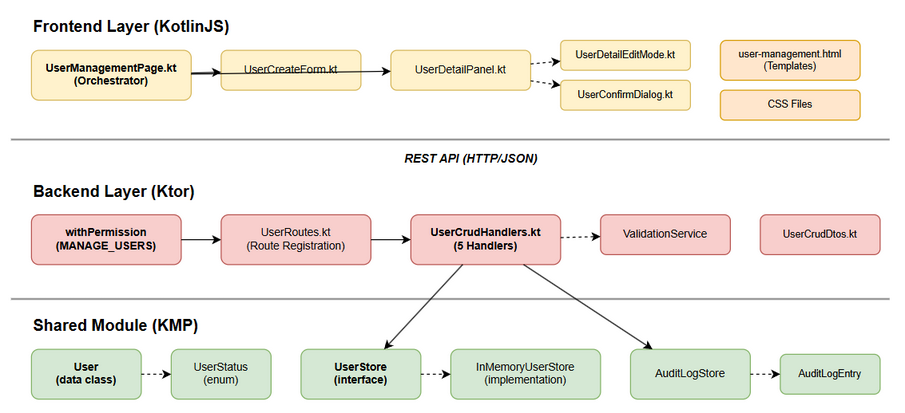
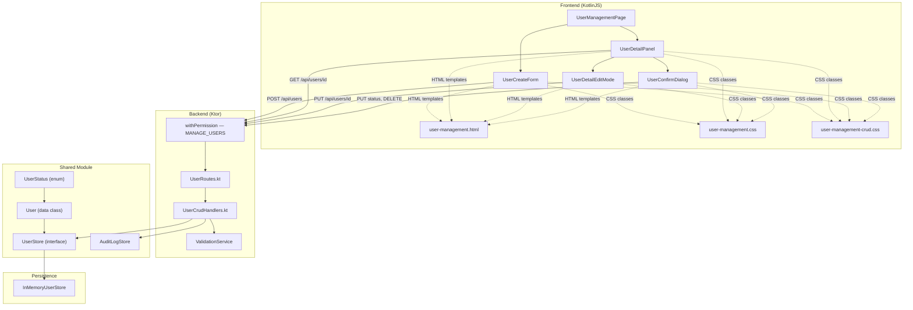
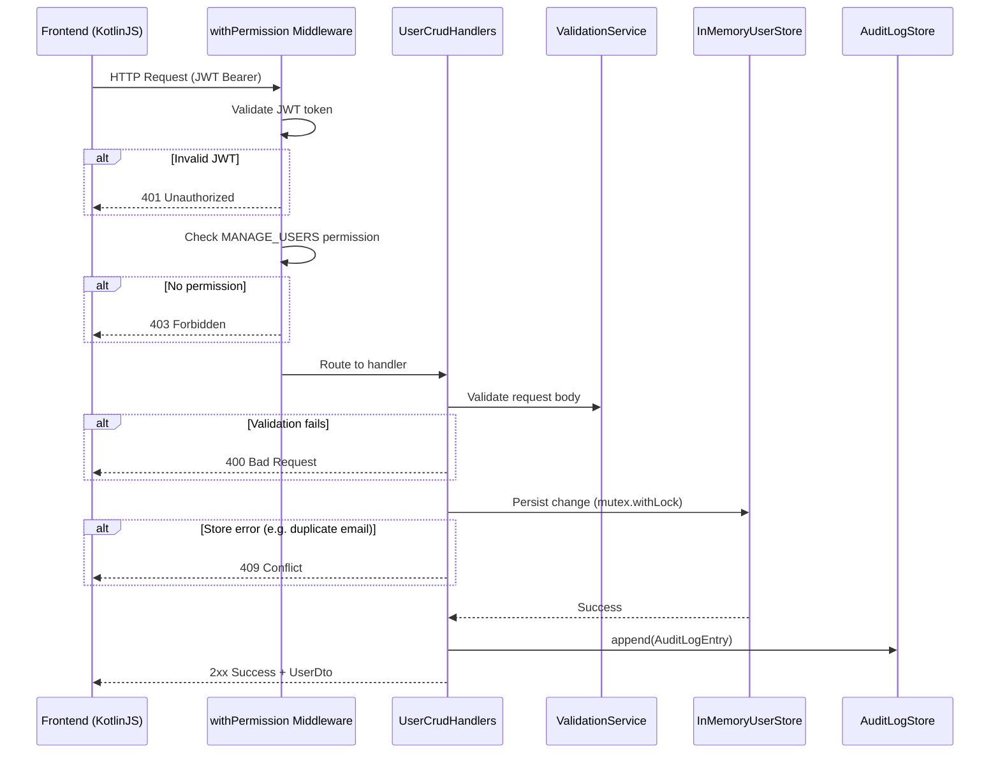
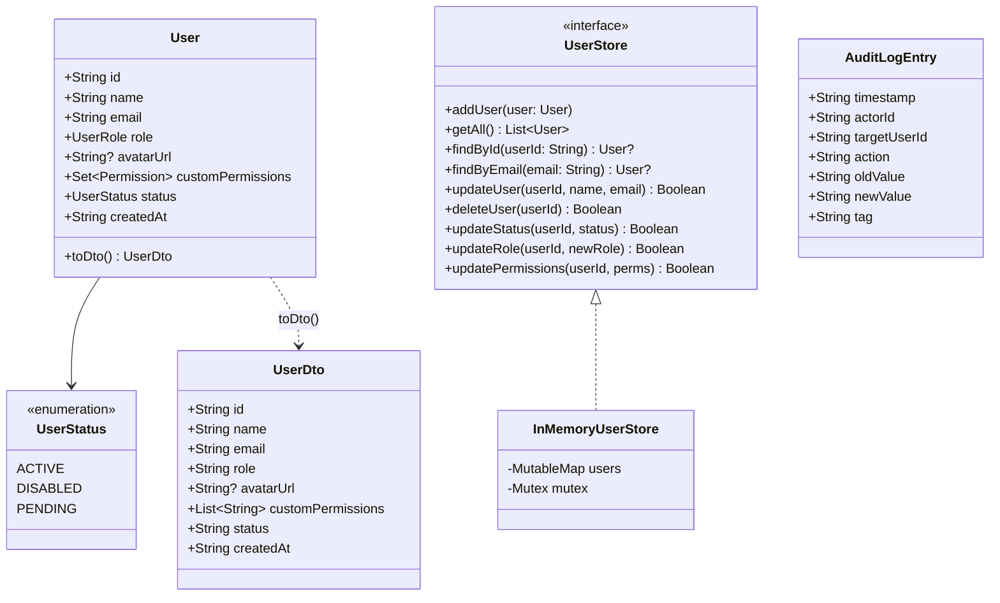
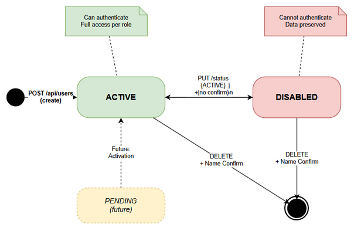
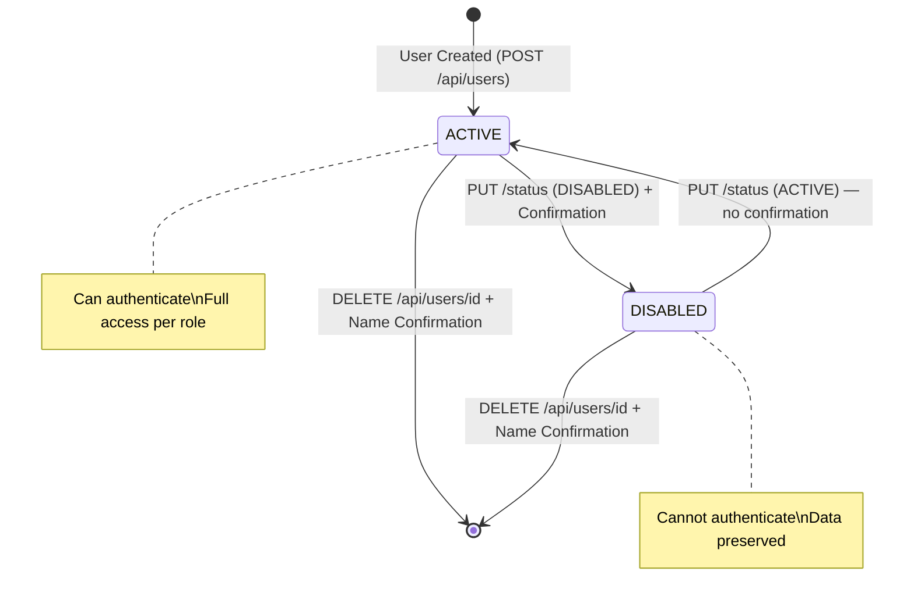

# Technical Design Document (TDD)

## Collex AI Assistant — SCRUM-50: User CRUD & Profile Management

---

## Document Information

| Field | Value |
|-------|-------|
| Jira Ticket | SCRUM-50 |
| Title | User CRUD & Profile Management |
| Author | SA Agent |
| Version | 1.0 |
| Date | 2026-05-01 |
| Status | Draft |
| Related BRD | documents/SCRUM-50/BRD.md |
| Related FSD | documents/SCRUM-50/FSD.md |

---

## Author Tracking

| Role | Name - Position | Responsibility |
|------|-----------------|----------------|
| Author | SA Agent – Solution Architect | Create document |
| Peer Reviewer | BA Agent – Business Analyst | Review document |

---

## Revision History

| Version | Date | Author | Changes |
|---------|------|--------|---------|
| 1.0 | 2026-05-01 | SA Agent | Initiate document — auto-generated from BRD, FSD, and Kiro design spec |

---

## Sign-Off

| Name | Signature and date |
|------|--------------------|
| | ☐ I agree and confirm the technical design in this TDD |
| | ☐ I agree and confirm the technical design in this TDD |

---

## 1. Introduction

### 1.1 Purpose

This TDD describes the technical design for implementing User CRUD & Profile Management across the Kotlin Multiplatform stack. It covers shared model extensions, backend API handlers, frontend components, and the testing strategy including property-based tests.

### 1.2 Scope

- **Shared module**: UserStatus enum, User model extension, UserStore interface extension, InMemoryUserStore implementation
- **Backend (Ktor)**: 5 new route handlers in UserRoutes.kt / UserCrudHandlers.kt, request DTOs, validation
- **Frontend (KotlinJS)**: 4 new components (UserCreateForm, UserDetailPanel, UserDetailEditMode, UserConfirmDialog), HTML templates, CSS
- **Testing**: 14 property-based tests (kotest-property), unit tests, integration tests

### 1.3 Technology Stack

| Layer | Technology | Version |
|-------|-----------|---------|
| Language | Kotlin (Multiplatform) | 1.9+ |
| Backend Framework | Ktor | 2.x |
| Frontend | KotlinJS + HTML Templates + DOM APIs | — |
| Serialization | kotlinx.serialization | — |
| Build Tool | Gradle (Kotlin DSL) | 8.x |
| Testing | kotest + kotest-property | 5.x |
| Authentication | JWT (Ktor Auth) | — |
| Persistence | InMemoryUserStore (in-memory) | — |

### 1.4 Design Principles

- **Kotlin Multiplatform sharing**: Common models in shared module, used by both backend and frontend
- **Backward compatibility**: New fields have default values; no migration needed
- **Separation of concerns**: Route registrations in UserRoutes.kt, handler logic in UserCrudHandlers.kt
- **200-line file limit**: All Kotlin files ≤ 200 lines, functions ≤ 20 lines
- **Template-based UI**: HTML templates cloned via DOM APIs (no HTML in Kotlin code)
- **Property-based testing**: Universal correctness properties verified with random inputs

### 1.5 Constraints

- InMemoryUserStore: data lost on server restart (no persistent database)
- PENDING status reserved for future use; not exposed via API
- No file upload for avatars (initials-based only)
- Frontend uses vanilla KotlinJS DOM APIs (no React/Vue)

### 1.6 References

| Document | Location |
|----------|----------|
| BRD | documents/SCRUM-50/BRD.md |
| FSD | documents/SCRUM-50/FSD.md |
| Kiro Design Spec | .kiro/specs/user-crud-profile/design.md |

---

## 2. System Architecture

### 2.1 Architecture Overview

The implementation follows the existing Kotlin Multiplatform architecture with three layers:





### 2.2 Component Diagram

| Component | Responsibility | Technology |
|-----------|---------------|------------|
| UserManagementPage | Page orchestrator, user list rendering | KotlinJS |
| UserCreateForm | Create user form overlay | KotlinJS + HTML template |
| UserDetailPanel | User detail display, action buttons | KotlinJS + HTML template |
| UserDetailEditMode | Inline edit for name/email | KotlinJS |
| UserConfirmDialog | Confirmation for disable/delete | KotlinJS + HTML template |
| UserRoutes | Route registration under /api/users | Ktor |
| UserCrudHandlers | Handler logic (≤20 lines each) | Ktor |
| InMemoryUserStore | Thread-safe in-memory persistence | Kotlin coroutines + Mutex |
| AuditLogStore | Audit trail recording | Kotlin |

### 2.3 Communication Patterns



| From | To | Protocol | Pattern | Description |
|------|----|----------|---------|-------------|
| Frontend | Backend | REST/HTTP | Sync | All CRUD operations via fetch API |
| Backend | UserStore | In-process | Sync (suspend) | Coroutine-based with Mutex locking |
| Backend | AuditLogStore | In-process | Sync (suspend) | Append audit entries after mutations |
| Backend | RBACEngine | In-process | Sync | Permission check before handler execution |

---

## 3. API Design

### 3.1 API Overview

| # | Endpoint | Method | Description | Source |
|---|----------|--------|-------------|--------|
| 1 | /api/users | POST | Create new user | UC-01 |
| 2 | /api/users/{userId} | GET | Get user detail | UC-02 |
| 3 | /api/users/{userId} | PUT | Update user name/email | UC-03 |
| 4 | /api/users/{userId}/status | PUT | Update user status | UC-04 |
| 5 | /api/users/{userId} | DELETE | Delete user permanently | UC-05 |

All endpoints require:
- **Header:** `Authorization: Bearer {jwt_token}`
- **Middleware:** `withPermission(Permission.MANAGE_USERS)`

### 3.2 API: POST /api/users (Create User)

**Implements:** UC-01, BR-01 through BR-06

| Attribute | Value |
|-----------|-------|
| Method | POST |
| Path | /api/users |
| Auth | Bearer Token (JWT) + MANAGE_USERS |

**Request Body:**

```json
{
  "name": "John Doe",
  "email": "john@example.com",
  "role": "NEURAL_ARCHITECT",
  "status": "ACTIVE"
}
```

**Response — 201 Created:**

```json
{
  "id": "generated-uuid",
  "name": "John Doe",
  "email": "john@example.com",
  "role": "NEURAL_ARCHITECT",
  "avatarUrl": null,
  "customPermissions": [],
  "status": "ACTIVE",
  "createdAt": "2026-01-15T10:30:00Z"
}
```

**Error Responses:**

| Status | Message | Description |
|--------|---------|-------------|
| 400 | "Name is required" | Empty/whitespace name |
| 400 | "Invalid email format" | Bad email format |
| 400 | "Invalid role: XYZ" | Unknown role |
| 401 | "Unauthorized" | Missing/invalid JWT |
| 403 | "Forbidden" | No MANAGE_USERS |
| 409 | "Email already exists" | Duplicate email |

**Handler Logic (UserCrudHandlers.kt):**

```kotlin
suspend fun RoutingContext.handleCreateUser(userStore: UserStore, auditLogStore: AuditLogStore) {
    val request = call.receive<CreateUserRequest>()
    // Validate name, email, role
    // Generate UUID, set status=ACTIVE, createdAt=Instant.now()
    // userStore.addUser(user) — catches IllegalArgumentException for duplicate email → 409
    // auditLogStore.append(USER_CREATED entry)
    // call.respond(HttpStatusCode.Created, user.toDto())
}
```

### 3.3 API: GET /api/users/{userId} (Get User Detail)

| Attribute | Value |
|-----------|-------|
| Method | GET |
| Path | /api/users/{userId} |
| Auth | Bearer Token + MANAGE_USERS |

**Response — 200 OK:** Full UserDto

**Error Responses:**

| Status | Message | Description |
|--------|---------|-------------|
| 401 | "Unauthorized" | Missing JWT |
| 403 | "Forbidden" | No MANAGE_USERS |
| 404 | "User not found" | Invalid userId |

### 3.4 API: PUT /api/users/{userId} (Update User)

| Attribute | Value |
|-----------|-------|
| Method | PUT |
| Path | /api/users/{userId} |
| Auth | Bearer Token + MANAGE_USERS |

**Request Body:**

```json
{ "name": "John Updated", "email": "john.updated@example.com" }
```

**Handler Logic:**

```kotlin
suspend fun RoutingContext.handleUpdateUser(userStore: UserStore, auditLogStore: AuditLogStore) {
    val userId = call.parameters["userId"] ?: return call.respond(400)
    val request = call.receive<UpdateUserRequest>()
    // Validate name, email
    // Check email uniqueness (exclude current user) via findByEmail()
    // Fetch old user for audit log
    // userStore.updateUser(userId, name, email) → false = 404
    // auditLogStore.append(USER_UPDATED entry with old/new values)
    // call.respond(200, updatedUser.toDto())
}
```

### 3.5 API: PUT /api/users/{userId}/status (Update Status)

| Attribute | Value |
|-----------|-------|
| Method | PUT |
| Path | /api/users/{userId}/status |
| Auth | Bearer Token + MANAGE_USERS |

**Request Body:**

```json
{ "status": "DISABLED" }
```

**Handler Logic:**

```kotlin
suspend fun RoutingContext.handleUpdateStatus(userStore: UserStore, auditLogStore: AuditLogStore) {
    val userId = call.parameters["userId"] ?: return call.respond(400)
    val request = call.receive<UpdateStatusRequest>()
    // Validate status is ACTIVE or DISABLED
    // Fetch old user for audit log
    // userStore.updateStatus(userId, status) → false = 404
    // Determine action: USER_DISABLED or USER_ENABLED
    // auditLogStore.append(entry)
    // call.respond(200, updatedUser.toDto())
}
```

### 3.6 API: DELETE /api/users/{userId} (Delete User)

| Attribute | Value |
|-----------|-------|
| Method | DELETE |
| Path | /api/users/{userId} |
| Auth | Bearer Token + MANAGE_USERS |

**Response — 204 No Content**

**Handler Logic:**

```kotlin
suspend fun RoutingContext.handleDeleteUser(userStore: UserStore, auditLogStore: AuditLogStore) {
    val userId = call.parameters["userId"] ?: return call.respond(400)
    // Extract actor ID from JWT principal
    // Compare with target userId → 403 if same (self-deletion)
    // Fetch user for audit log old values → 404 if not found
    // userStore.deleteUser(userId)
    // auditLogStore.append(USER_DELETED entry)
    // call.respond(HttpStatusCode.NoContent)
}
```

---

## 4. Database Design

### 4.1 Schema Overview

No database is used. All data is stored in `InMemoryUserStore` using a `MutableMap<String, User>` protected by a `Mutex` for thread safety.

### 4.2 InMemoryUserStore Implementation

```kotlin
class InMemoryUserStore : UserStore {
    private val users = mutableMapOf<String, User>()
    private val mutex = Mutex()

    override suspend fun addUser(user: User) = mutex.withLock {
        if (users.values.any { it.email == user.email }) {
            throw IllegalArgumentException("Email already exists")
        }
        users[user.id] = user
    }

    override suspend fun updateUser(userId: String, name: String, email: String): Boolean = mutex.withLock {
        val user = users[userId] ?: return@withLock false
        users[userId] = user.copy(name = name, email = email)
        true
    }

    override suspend fun deleteUser(userId: String): Boolean = mutex.withLock {
        users.remove(userId) != null
    }

    override suspend fun updateStatus(userId: String, status: UserStatus): Boolean = mutex.withLock {
        val user = users[userId] ?: return@withLock false
        users[userId] = user.copy(status = status)
        true
    }

    override suspend fun findByEmail(email: String): User? = mutex.withLock {
        users.values.find { it.email == email }
    }
}
```

---

## 5. Class / Module Design

### 5.1 Package Structure

```
shared/src/commonMain/kotlin/com/assistant/rbac/
├── RBACModels.kt          # User data class (extended with status, createdAt)
├── UserStatus.kt          # NEW — UserStatus enum
├── UserStore.kt           # UserStore interface (extended with CRUD methods)
└── InMemoryUserStore.kt   # Implementation (extended)

server/user-mgmt/src/jvmMain/kotlin/com/assistant/server/
├── di/
│   └── UserMgmtModule.kt  # DI wiring
└── routes/
    ├── UserRoutes.kt       # Route registrations (extended with 5 new routes)
    ├── UserCrudHandlers.kt # NEW — Handler implementations
    └── UserDtos.kt         # NEW — CreateUserRequest, UpdateUserRequest, UpdateStatusRequest

frontend/src/jsMain/kotlin/com/assistant/frontend/
├── models/
│   └── UserModels.kt      # Extended with status, createdAt, request DTOs
├── pages/usermgmt/
│   ├── UserManagementPage.kt  # Extended with create button, detail panel wiring
│   ├── UserCreateForm.kt      # NEW — Create user form
│   ├── UserDetailPanel.kt     # NEW — Detail panel
│   ├── UserDetailEditMode.kt  # NEW — Inline edit mode
│   └── UserConfirmDialog.kt   # NEW — Confirmation dialogs
└── templates/
    └── user-management.html   # Extended with new templates

frontend/src/jsMain/resources/
├── user-management.css         # Extended with status badges, disabled rows
└── user-management-crud.css    # NEW — Styles for CRUD components
```

### 5.2 Key Interfaces



```kotlin
// Shared module — UserStore interface
interface UserStore {
    suspend fun addUser(user: User)
    suspend fun getAll(): List<User>
    suspend fun findById(userId: String): User?
    suspend fun findByEmail(email: String): User?
    suspend fun updateRole(userId: String, newRole: UserRole): Boolean
    suspend fun updatePermissions(userId: String, permissions: Set<Permission>): Boolean
    suspend fun updateUser(userId: String, name: String, email: String): Boolean
    suspend fun deleteUser(userId: String): Boolean
    suspend fun updateStatus(userId: String, status: UserStatus): Boolean
}
```

### 5.3 Design Patterns

| Pattern | Where Used | Rationale |
|---------|-----------|-----------|
| Extension Functions | UserCrudHandlers.kt | Keep handlers as extension functions on RoutingContext for clean separation |
| Template Clone | Frontend components | Clone HTML templates via DOM API; no HTML in Kotlin code |
| Mutex Locking | InMemoryUserStore | Thread-safe concurrent access to in-memory data |
| DTO Mapping | User.toDto() | Separate domain model from API contract |
| Blocking Overlay | All async UI operations | Prevent duplicate submissions |

### 5.4 Error Handling

| Exception | HTTP Status | Error Code | When Thrown |
|-----------|-------------|------------|------------|
| IllegalArgumentException | 409 | Email already exists | Duplicate email on addUser |
| ContentTransformationException | 400 | Invalid request body | Malformed JSON |
| — | 400 | Validation error | Empty name, invalid email, invalid role/status |
| — | 401 | Unauthorized | Missing/invalid JWT |
| — | 403 | Forbidden | No MANAGE_USERS permission |
| — | 403 | Cannot delete own account | Self-deletion attempt |
| — | 404 | User not found | Non-existent userId |

---

## 6. Security Design

### 6.1 Authentication

JWT-based authentication via Ktor Auth plugin. All CRUD endpoints are nested inside `authenticate("auth-jwt")` block.

### 6.2 Authorization





| Role | Endpoints | Permissions |
|------|-----------|-------------|
| ADMINISTRATOR | All /api/users CRUD | MANAGE_USERS (full access) |
| NEURAL_ARCHITECT | None | No MANAGE_USERS permission |
| READER | None | No MANAGE_USERS permission |

Authorization flow:
1. `withPermission(Permission.MANAGE_USERS)` middleware intercepts request
2. Extracts role from JWT claims
3. Calls `RBACEngine.hasPermission(role, MANAGE_USERS)`
4. Returns 403 if denied

### 6.3 Input Validation

| Field | Validation | Sanitization |
|-------|-----------|--------------|
| name | Non-empty, non-whitespace-only | Trim whitespace |
| email | Regex: standard email format | Lowercase normalization |
| role | Must be valid UserRole enum value | — |
| status | Must be ACTIVE or DISABLED (via API) | — |
| userId (path) | Non-empty string | — |

---

## 7. Performance & Scalability

### 7.1 Concurrency

InMemoryUserStore uses `Mutex.withLock` for all read/write operations, ensuring thread safety under concurrent access from multiple coroutines.

### 7.2 Performance Targets

| Operation | Target | Notes |
|-----------|--------|-------|
| All CRUD endpoints | < 50ms | In-memory operations, no I/O |
| User list rendering | < 100ms | DOM manipulation |

---

## 8. Testing Strategy

### 8.1 Property-Based Tests (kotest-property)

| # | Property | Test Target | Generator |
|---|----------|-------------|-----------|
| P1 | Name validation rejects empty/whitespace | ValidationService | Arb.string() |
| P2 | Email validation accepts/rejects correctly | ValidationService | Custom email Arb |
| P3 | User serialization round-trip | User model | Arb<User> |
| P4 | Email uniqueness enforcement | InMemoryUserStore | Two Arb<User> same email |
| P5 | UserDto contains all required fields | User.toDto() | Arb<User> |
| P6 | CRUD audit logging completeness | Route handlers | Arb<Request> |
| P7 | UserStore operations succeed for existing users | InMemoryUserStore | Arb<User> |
| P8 | Creation sets ACTIVE status and createdAt | Create handler | Arb<CreateUserRequest> |
| P9 | Status change persistence | InMemoryUserStore | Arb<User> + Arb<UserStatus> |
| P10 | Delete removes user permanently | InMemoryUserStore | Arb<User> |
| P11 | Disabled user auth rejection | Auth flow | Arb<User>(DISABLED) |
| P12 | Unauthorized access rejection | Route integration | Invalid JWT |
| P13 | Non-existent user returns 404 | Route handlers | Random UUID |
| P14 | Invalid request body returns 400 | Route handlers | Malformed requests |

### 8.2 Test File Organization

```
server/user-mgmt/src/jvmTest/kotlin/com/assistant/server/routes/
├── UserValidationPropertyTest.kt       # P1, P2
├── UserDtoCompletenessPropertyTest.kt  # P5
├── UserAuditPropertyTest.kt           # P6
├── UserCreationDefaultsPropertyTest.kt # P8
├── UserCrudRoutesTest.kt              # P13, P14 (unit)
└── UserCrudIntegrationTest.kt         # P12 (integration)

shared/src/jvmTest/kotlin/com/assistant/rbac/
├── UserStorePropertyTest.kt           # P4, P7, P9, P10
└── UserSerializationPropertyTest.kt   # P3
```

---

## 9. Monitoring & Observability

### 9.1 Audit Logging

All CRUD operations are recorded via `AuditLogStore.append()` with:
- Actor ID (from JWT)
- Target user ID
- Action tag (USER_CREATED, USER_UPDATED, USER_DISABLED, USER_ENABLED, USER_DELETED)
- IAM_SYNC tag
- Old and new values

---

## 10. Deployment Considerations

### 10.1 Backward Compatibility

| Change | Compatibility | Notes |
|--------|--------------|-------|
| User model + status field | Backward compatible | Default: ACTIVE |
| User model + createdAt field | Backward compatible | Default: "" |
| UserDto + status/createdAt | Backward compatible | Defaults in serialization |
| Frontend UserInfo + status/createdAt | Backward compatible | Defaults handle missing fields |
| New API endpoints | Additive | No existing endpoints modified |

### 10.2 Rollback Strategy

Since all changes are additive (new fields with defaults, new endpoints), rollback involves:
1. Revert to previous code version
2. New fields in existing data are ignored by old code (default values)
3. No database migration to rollback

---

## 11. Appendix

### Glossary

| Term | Definition |
|------|------------|
| UserStatus | Enum: ACTIVE, DISABLED, PENDING |
| UserRole | Enum: ADMINISTRATOR, NEURAL_ARCHITECT, READER |
| UserStore | Persistence interface for user data |
| InMemoryUserStore | In-memory implementation of UserStore |
| UserDto | API response data transfer object |
| RBACEngine | Role-Based Access Control permission checker |
| AuditLogStore | Audit trail recording interface |
| Blocking Overlay | UI overlay preventing duplicate async submissions |

### Open Questions

| # | Question | Status | Answer |
|---|----------|--------|--------|
| 1 | Should PENDING status be exposed via API? | Resolved | No — reserved for future use |
| 2 | Should deleted users be soft-deleted? | Resolved | No — hard delete via DELETE endpoint; soft-disable via status |
| 3 | Persistent storage migration? | Open | Future enhancement — currently InMemoryUserStore only |
